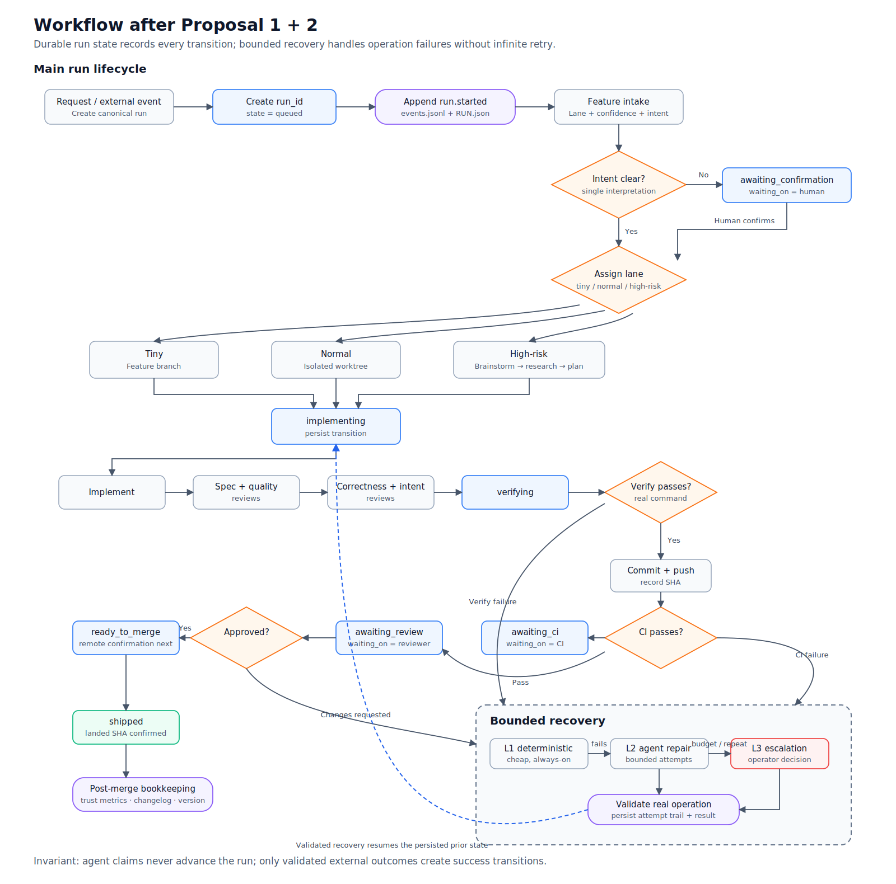

# Production Agent Harness — Lessons and Proposals for `harness-skills`

- **Date:** 2026-07-20
- **Source:** [Building a Production Agent Harness: Turning Claude Code Into a Multi-Agent Engineering Pipeline](https://licaomeng.medium.com/building-a-production-agent-harness-turning-claude-code-into-a-multi-agent-engineering-pipeline-1db4e242d08a), Messi Li, 2026-05-30
- **Scope:** Compare the production mechanisms in the article with the current `harness-skills` repository and propose architectural improvements. This is research and ideation, not an implementation plan.
- **Method:** Read the complete article through the supplied mirror and inspect `HARNESS.md`, feature intake, orchestration, subagent workflow, worktree guards, persistent state, audit scripts, the manifest, and post-merge bookkeeping.

---

## 1. Conclusion

The current repository is a relatively mature **development workflow harness**: it routes work by risk, separates risk from ambiguity, enforces branch/worktree isolation, uses independent review oracles, records verification evidence, and uses hooks to corroborate agent claims.

The system described in the article operates at a different layer: a **production agent runtime** that runs continuously, wakes on external events, persists state across processes and machines, self-recovers under retry budgets, follows CI and review through merge, and exposes an operator control plane.

The largest gap is no longer another prompt or isolated skill. It is:

> The absence of a durable execution protocol with state, transitions, retry budgets, recovery policy, waiting conditions, and observable ground truth across sessions.

The natural next step is to preserve the existing repository-level strengths and add a **durable run layer**. Slack pollers, systemd daemons, and raw transcript synchronization should wait until the run contract is stable.

---

## 2. Main lessons from the article

The article describes six production-harness layers:

1. **Event ingestion** — Slack messages, review comments, CI results, and PagerDuty alerts; push and polling ingress with deduplication and eventual-consistency handling.
2. **Agent orchestration** — specialized agents with explicit hand-off schemas instead of one agent doing everything.
3. **Persistent state** — in-memory state for process-local data, JSON operational maps, and durable case workspaces in git.
4. **Self-healing loops** — bounded recovery for CI failures, reviewer feedback, and failed operations.
5. **Observability** — live status, structured logs, terminal notifications, and tool/MCP health monitoring.
6. **Human control** — pause, resume, rescan, finalize, and kill-switch operations without accidentally blocking operator recovery.

The most reusable mechanisms are:

- A pre-commitment hypothesis slate before investigation begins.
- A structured completion report instead of downstream prose parsing.
- Confidence bounded by evidence and open questions, not only self-reported by the agent.
- Context pinning for unresolved contradictions and assumptions.
- Typed exit reasons and force-continue conditions.
- Per-operation recovery: deterministic guard → bounded agent repair → operator escalation.
- External truth re-checks; an agent's statement is not completion evidence.
- Per-case worktrees as mandatory isolation boundaries.
- Production incidents retained as regression tests.
- Self-improvement that can create a PR while policy changes still require human review.

---

## 3. What this repository already does well

### 3.1. Risk and ambiguity are independent axes

`HARNESS.md` states:

> Ceremony scales with risk. Human interruption scales with ambiguity.

Lane determines proof and process; confidence determines whether a human is asked. This avoids requiring approval for every clear high-risk task or allowing an ambiguous small diff to proceed merely because it is small.

This is a strong governance foundation and should remain intact as a runtime layer is added.

### 3.2. Multiple independent review oracles

`subagent-driven-development` already separates:

- task implementer;
- spec reviewer against the PLAN;
- code-quality reviewer;
- correctness reviewer against runtime behavior, without using the PLAN as its oracle;
- intent reviewer against the verbatim request, blind to the PLAN.

The repository does not lack review topology. Its gap is keeping execution state alive across sessions and external events.

### 3.3. Worktree isolation is structural

Normal and high-risk tasks use worktrees. `branch-isolation-guard.sh` blocks Write/Edit on shared branches. This matches the article's conclusion that worktrees are an architectural safety boundary, not a convenience.

### 3.4. Claims require re-runnable proof

`SUMMARY.md` requires a `### Verify` section; commit and CI scripts validate its shape and evidence. Review-chain fixtures also measure independent review behavior.

The next improvement is not more prose evidence. It is binding evidence to a run state and a specific external outcome.

### 3.5. Bookkeeping is already event-sourced

`.github/workflows/post-merge-maintenance.yml` reacts to merged PRs and creates bookkeeping updates for trust metrics, CHANGELOG, VERSION, and the audit log. Records are created by events instead of depending on an agent remembering to append them.

### 3.6. Harness health has audit and trend support

`harness-audit.sh` checks missing Verify evidence, stale plans and solutions, backlog drift, manifest degradation, and contract impact. `harness-status.sh` displays the audit trend. This covers **governance health**.

What is missing is observability for **execution health** of individual runs.

---

## 4. Main gaps

### 4.1. The workflow graph is not yet a runtime state machine

The current flow is essentially:

```text
request → intake → route → build → hooks corroborate → ship
```

The skills describe what the agent should do, but no machine-readable controller can reliably answer:

- What state is the run in?
- Which event caused the last transition?
- Which transition is valid next?
- Is the run waiting on CI, a reviewer, a tool, or a human?
- How many recovery attempts have occurred?
- Which commit was verified?
- Where should execution resume after a dead session?
- Was the task superseded, cancelled, or over budget?

`specs/STATE.md` is a human-readable singleton containing the active spec and session breadcrumbs. It is useful as a summary, but not strong enough as the operational source of truth.

### 4.2. Confidence is still mostly self-reported

Feature intake uses `high|medium|low`. The rubric is useful, but there is no mechanical ceiling based on unresolved assumptions, unchecked sources, open review findings, failed verification, unverified rollback, or missing external confirmation.

Confidence is therefore not yet a reliable control signal for autonomous actions.

### 4.3. Recovery is not a first-class contract

The repository has repair loops in skill instructions, but no unified contract for maximum attempts, per-attempt timeout, repeated-failure signatures, forbidden recovery actions, validation commands, success predicates, or escalation payloads.

Without that contract, an agent may retry forever, weaken a test to make CI green, or repeat an action that cannot change the outcome.

### 4.4. Exit and blocker semantics are too broad

`DONE`, `NEEDS_CONTEXT`, and `BLOCKED` work for a single-session hand-off but are not enough for resumable background work. `BLOCKED` should distinguish missing access, a human decision, an external dependency, exhausted retries, and failed verification.

### 4.5. Audit measures repository drift, not run health

The repository can answer whether harness artifacts drift, but not yet:

- how many runs are stuck;
- which run has waited longest for a human;
- which retry loop is degrading;
- the recovery success rate;
- which completion claims lack external confirmation;
- whether human rework is decreasing.

### 4.6. Investigation lacks an explicit confirmation-bias control

`xia2` and the reviewers improve research quality, but there is no immutable initial hypothesis slate with expected evidence and falsifiers. During an intermittent failure or production incident, an agent can still anchor on its first hypothesis and reinterpret later evidence around it.

---

## 5. Improvement proposals

### Proposal 1 — Durable Run State Contract

This is the highest-priority proposal. Each task owns operational artifacts:

```text
specs/<slug>/RUN.json
specs/<slug>/events.jsonl
```

`events.jsonl` is append-only history; `RUN.json` is a readable current projection.

Example projection:

```json
{
  "schema_version": 1,
  "run_id": "auth-timeout-20260720-01",
  "slug": "auth-timeout",
  "state": "awaiting_ci",
  "lane": "high-risk",
  "attempt": 1,
  "retry_budget": 3,
  "waiting_on": {
    "type": "ci",
    "reference": "github-check-run:12345"
  },
  "last_verified_sha": "abc1234",
  "updated_at": "2026-07-20T10:30:00Z"
}
```

Example event log:

```json
{"event":"run.started","from":null,"to":"investigating"}
{"event":"implementation.completed","from":"implementing","to":"awaiting_ci","sha":"abc1234"}
{"event":"ci.failed","from":"awaiting_ci","to":"fixing_ci","check_run_id":12345}
{"event":"retry.exhausted","from":"fixing_ci","to":"escalated","attempts":3}
```

Proposed state set:

```text
queued
investigating
awaiting_confirmation
planning
implementing
verifying
awaiting_ci
fixing_ci
awaiting_review
addressing_review
ready_to_merge
shipped
blocked
escalated
cancelled
superseded
```

Invariants:

- transitions are allowlisted;
- every transition writes an event;
- state is never inferred from prose;
- `shipped` carries an externally confirmed landed SHA;
- `blocked` carries `reason`, `waiting_on`, and `resume_event`;
- the projection can be rebuilt from the event log.

### Proposal 2 — Bounded Recovery Framework

Standardize recovery as:

```text
L1 deterministic repair
    ↓ unresolved
L2 constrained agent repair
    ↓ low confidence / exhausted budget / repeated failure
L3 operator escalation
```

Example contract:

```yaml
recovery:
  operation: fix_ci
  max_attempts: 3
  timeout_per_attempt: 10m
  repeated_failure_limit: 2
  validation:
    command: gh pr checks
    success: all_required_checks_pass
  forbidden:
    - weaken_test
    - skip_required_check
    - force_push_protected_branch
    - discard_unpushed_commit
  escalate_on:
    - confidence_below_threshold
    - repeated_failure_signature
    - budget_exhausted
```

Start with CI failures, rebase/push conflicts, reviewer changes, verification failures, and tool/MCP unavailability.

Success must come from external truth: test exit codes, GitHub checks, a remote branch SHA, or an API response. The agent's self-report is diagnostic input only.

### Proposal 3 — Evidence-Derived Confidence

Keep categorical confidence for human communication, but calculate a numerical ceiling:

```yaml
confidence:
  self_reported: 88
  mechanical_cap: 64
  effective: 64
  reasons:
    - "1 unchecked contract consumer: -7"
    - "2 unresolved assumptions: -16"
    - "rollback not verified: cap 64"
```

An initial calibration could be:

```text
base                    100
open question           -12 / item
unchecked source         -7 / item
unverified assumption    -8 / item
open review finding     -15 / item
missing Verify          cap 40
failed required check   cap 30
unresolved hard gate    cap 0 for auto-action
```

Weights must be calibrated with fixtures. The important invariant is `effective = min(self_reported, mechanical_cap)`.

### Proposal 4 — Hypothesis Slate for investigation

Enable this only for incidents, intermittent failures, production debugging, security investigations, or high-risk research. Do not apply it to every feature.

```markdown
### Hypothesis Slate

| ID | Hypothesis | Evidence expected | Falsifier | Status |
|---|---|---|---|---|
| H1 | Token expires early | expiry precedes failure | valid token still fails | open |
| H2 | Clock skew | node clocks differ | clocks synchronized | open |
```

The slate is created before the main investigation calls, old hypotheses cannot be deleted or rewritten, new hypotheses are appended with a source and timestamp, rejected hypotheses require falsifying evidence, and the adversarial reviewer checks whether the conclusion actually beats the alternatives.

### Proposal 5 — Typed Exit Reasons and Waiting Contract

Standardize:

```text
complete
blocked_external
blocked_human_decision
blocked_missing_access
retry_budget_exhausted
verification_failed
degrading
superseded
cancelled
```

Example:

```yaml
status: blocked
reason: missing_access
waiting_on: human
resume_event: credentials_restored
blocked_since: 2026-07-20T11:00:00Z
```

This lets a scheduler or controller resume correctly without parsing prose.

### Proposal 6 — Minimal Operator Control Plane

Start with a CLI instead of Slack:

```bash
harness runs
harness status <slug>
harness explain <slug>
harness pause <slug>
harness resume <slug>
harness retry <slug>
harness cancel <slug>
```

`explain` should show current state, blocker, waiting duration, last evidence, next allowed transition, and remaining retry budget. Pause should be scoped to a run, autonomous mutations, outbound messages, or the entire system; a global pause must never prevent an operator from resuming the system.

### Proposal 7 — Run Observability

Add execution metrics for started/completed/escalated runs, wall-clock time, human active time, retries, recovery success, review rework, CI-fix attempts, blocked duration, unconfirmed completion claims, and optional tool/token cost.

JSONL and a CLI summary are sufficient initially; a dashboard can wait.

### Proposal 8 — Production Incident Replay Tests

Formalize executable institutional memory:

```text
tests/incidents/<date>-<slug>/
  incident.md
  initial-state.json
  events.jsonl
  expected-transitions.jsonl
  assertions.sh
```

Candidate cases include pause/resume safety, repeated CI failure escalation, stale reviewer-comment deduplication, session resume with pending escalation, bookkeeping-loop prevention, landed-SHA requirements for `shipped`, and memory consolidation preserving pending human work.

After each incident: record it, create a failing replay test, fix the issue, and retain the regression fixture permanently.

---

## 6. What not to do yet

### 6.1. Do not put Slack or systemd daemons in the core

This repository is a portable toolkit. Slack polling, credential refresh, and long-lived services add deployment and security surface. Define run/event/recovery contracts first; add daemon and connector adapters later.

### 6.2. Do not sync raw Claude transcripts through git

Raw transcripts may contain secrets, grow quickly, conflict, and carry context noise. Sync distilled run state, decisions, evidence references, and pending questions first. Transcript continuity is only justified by a real consumer.

### 6.3. Do not auto-merge self-modification

The harness may detect patterns and create proposals or PRs. Policy, hooks, permissions, and recovery boundaries still require human review. Self-improvement is not self-authorization.

### 6.4. Do not apply full investigation ceremony to every task

Hypothesis slates, contradiction registers, and multiple quality gates fit incidents and high-risk debugging. Applying them to a typo or narrow feature violates the principle that ceremony scales with risk.

### 6.5. Do not build a dashboard first

JSONL, `harness status`, and GitHub checks are sufficient for the first phase. A dashboard should follow real run data and an actual operator need.

---

## 7. Proposed roadmap

Workflow after Proposal 1 and Proposal 2:



Editable source: [`assets/production-harness-workflow-p1-p2.mmd`](assets/production-harness-workflow-p1-p2.mmd).

### Phase A — Durable Run Model

- define the state graph;
- add the run and event schemas;
- implement atomic event append and projection rebuild;
- validate transitions;
- expose read-only run status.

**Success:** a run resumes from durable artifacts without conversation history.

### Phase B — Recovery Policy

- add retry budgets and timeouts;
- implement deterministic → agentic → human escalation;
- detect repeated failure signatures;
- enforce forbidden recovery actions;
- validate against external truth;
- add replay tests for retry spirals.

**Success:** no operation retries forever and every terminal failure has a complete attempt trail.

### Phase C — Evidence-Derived Confidence

- add assumption, open-question, and unchecked-source registers;
- calculate confidence ceilings;
- define auto-action thresholds;
- add degrading exits;
- calibrate with evaluation fixtures.

**Success:** the agent cannot claim a confidence level above what the evidence permits.

### Phase D — Investigation Methodology

- add hypothesis slates;
- capture empirical anchors;
- pin contradictions;
- run adversarial hypothesis review;
- add incident-specific artifact templates.

**Success:** an incident conclusion can be traced through alternatives and falsifying evidence.

### Phase E — Runtime Adapters

Start only after Phases A–C are stable:

- GitHub CI/review event adapter;
- scheduler/watcher;
- Slack/Linear/Jira connectors;
- multi-project routing;
- optional cross-machine synchronization.

**Success:** an adapter translates an external event into a canonical harness event without embedding separate workflow policy.

---

## 8. Priority order

| Priority | Initiative | Value | Effort | Reason |
|---|---|---:|---:|---|
| P0 | Durable Run State Contract | Very high | Medium | Foundation for resume, watchers, retry, control, and observability |
| P0 | Bounded Recovery Framework | Very high | Medium | Prevents retry spirals and makes self-healing verifiable |
| P1 | Typed exit/waiting reasons | High | Low | Makes the state machine and operator hand-off explicit |
| P1 | Evidence-derived confidence | High | Medium | Turns confidence into a substantive control signal |
| P1 | Incident replay tests | High | Medium | Converts production scars into executable institutional memory |
| P2 | Hypothesis slate | Medium-high | Low | Improves investigation for selected task classes |
| P2 | Operator CLI | Medium | Medium | Useful after durable run state exists |
| P3 | GitHub/Slack runtime adapters | High long-term | High | Should follow stable core contracts |

---

## 9. Recommended next steps

1. Design the Durable Run State Contract: state graph, event schema, projection, and invalid transitions before writing a controller.
2. Design a Bounded Recovery Contract for one operation first, preferably CI failure, to test retry budgets, external truth, and escalation trails.
3. Evaluate Evidence-Derived Confidence and Hypothesis Slate on one debugging fixture to measure false-completion reduction.

Do not combine the entire roadmap into one PR. Phase A should be an independent design/spec, Phase B a vertical slice, and adapters a separate initiative after the contracts stabilize.

---

## 10. Architectural decision

Move from:

> a workflow described and enforced within one session

to:

> an execution protocol with durable state, typed transitions, bounded recovery, operator control, and external ground truth across sessions.

Keep the current strengths — Lane × Confidence, worktree isolation, multi-oracle review, re-runnable Verify evidence, and event-sourced bookkeeping — and build the runtime layer around the skills. This is the most valuable lesson from the article and the natural next step for this repository.
