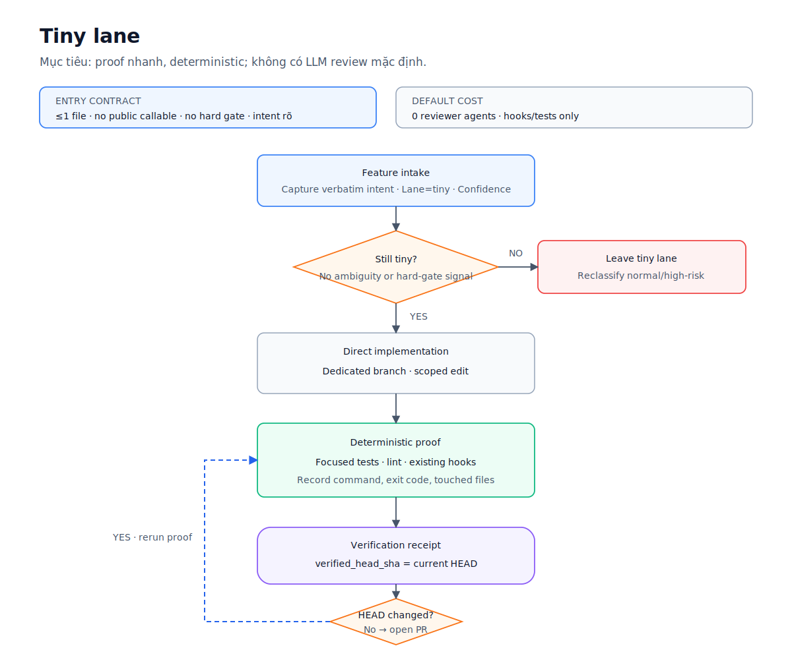
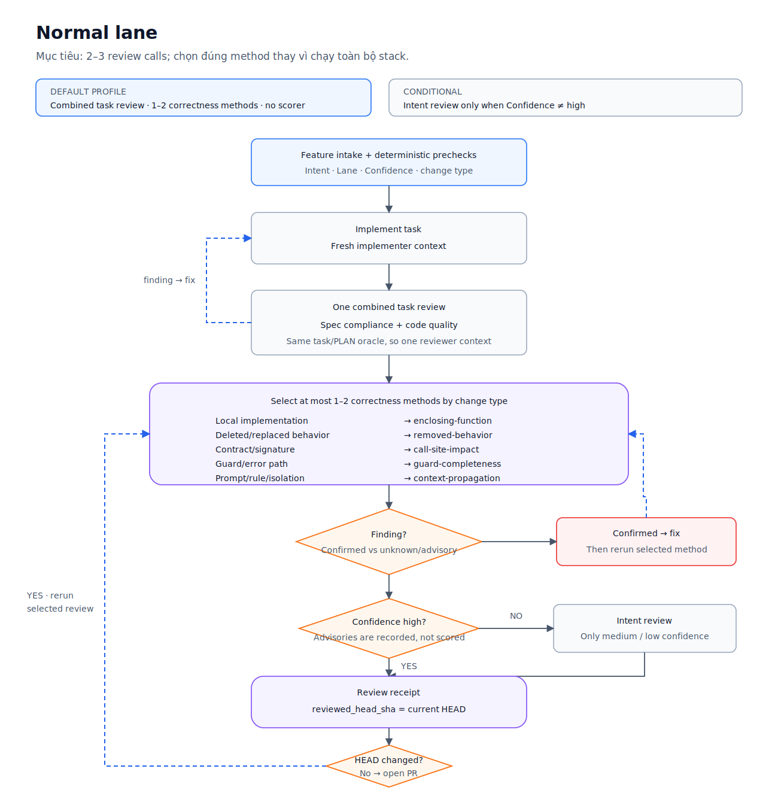
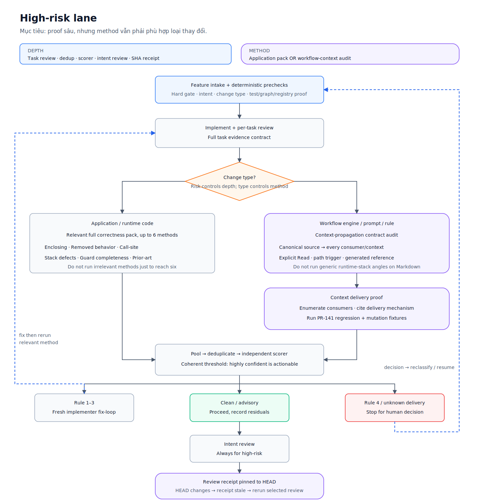

# Risk-Scaled Review Workflow Refactor — Research and Proposal

> Date: 2026-07-22 · Status: proposal only, no workflow implementation
> Primary issue: [#143 — close context-propagation review escapes](https://github.com/minhtran3124/agent-harness/issues/143)
> Related simplification issue: [#67 — simplify the harness](https://github.com/minhtran3124/agent-harness/issues/67)

---

## 1. Executive decision

The current review system should be refactored **before adding another review skill or generic
review layer**.

Issue #143 identifies a real defect class: an authoritative instruction can fail to reach an
isolated implementer, reviewer, scorer, or new-session context. The escape is not evidence that
the harness needs a seventh generic correctness angle. It is evidence that the workflow lacks a
deterministic model of:

- which execution contexts consume an instruction;
- how each context receives it;
- whether that delivery is proven on the final reviewed commit.

The recommended design has two independent routing axes:

1. **Lane controls review depth** — `tiny`, `normal`, or `high-risk` determines how much proof is
   required.
2. **Change type controls review method** — application runtime code, contract/signature changes,
   deleted behavior, guard/error paths, and workflow-engine changes require different review
   methods.

The resulting rule is:

> Run deterministic proof first. Invoke only the LLM review methods relevant to the changed
> behavior. Preserve oracle independence where it is load-bearing, but do not run every oracle on
> every lane.

## 2. Scope and non-goals

This proposal covers the review path from implementation through PR hand-off:

- per-task spec and quality review;
- whole-diff correctness review;
- intent review;
- context-propagation auditing for workflow-as-code;
- routing findings to fix, advisory, or human escalation;
- pinning review evidence to the final `HEAD` SHA.

It does **not** propose:

- another generic always-on reviewer;
- porting the full Claude harness into Codex, Cursor, or OpenCode;
- deleting the standalone `/correctness-review` or `/intent-review` entry points;
- merging correctness and intent into one reviewer context;
- making prose-only documentation changes high-risk;
- replacing deterministic tests and hooks with LLM judgment.

## 3. Evidence inspected

The recommendation is based on the current repository and the following records:

- [`skills/subagent-driven-development/`](../../../skills/subagent-driven-development/)
- [`skills/correctness-review/`](../../../skills/correctness-review/)
- [`skills/intent-review/`](../../../skills/intent-review/)
- [`agents/reviewer.md`](../../../agents/reviewer.md)
- [`hooks/risk-corroboration.sh`](../../../hooks/risk-corroboration.sh)
- [`evals/skills/review-chain/`](../../../evals/skills/review-chain/)
- [`docs/research/harness-review-improvements/reviews/over-engineering-review-2026-07-16.md`](reviews/over-engineering-review-2026-07-16.md)
- PR #141 follow-up fixes `d61e155` and `1c0f01d` referenced by issue #143.

Measured source size for the three current review-related skill directories:

| Surface | Lines | Words |
|---|---:|---:|
| `correctness-review/*` | 788 | 6,891 |
| `intent-review/*` | 303 | 2,570 |
| `subagent-driven-development/*` | 671 | 4,350 |
| **Total** | **1,762** | **13,811** |

The correctness finder also sends a shared block of approximately 1,023 words to each of six
independent angle agents, in addition to the diff and the angle-specific instructions.

## 4. Current workflow and cost

For every task in the normal `subagent-driven-development` route, the current chain runs:

1. implementer self-review;
2. independent spec-compliance reviewer;
3. independent code-quality reviewer;
4. after all tasks, six whole-diff correctness finder agents;
5. one independent scorer agent for every deduplicated correctness location;
6. one whole-diff intent reviewer;
7. additional fix and re-review loops for surviving findings.

A three-task change therefore pays for six per-task review calls before the final correctness and
intent stages begin. The number of scorer calls is data-dependent.

Repository benchmarks give the most useful cost anchors:

- the six-angle correctness FIND stage measured approximately **150k tokens per correctness
  pass** on the review-chain fixtures;
- SCORE added approximately **25k tokens per fixture** in the end-to-end run;
- replacing the harness finder with the built-in `/code-review high` engine produced the same
  planted-defect catch rate, three hard false positives, and approximately **10–15×** the token
  cost, so that engine swap was rejected;
- the over-engineering review estimates that a normal three-task change crosses roughly nine LLM
  review passes plus mechanized gates.

These numbers are evidence about the recorded fixtures and runs, not a universal production cost
model. They are sufficient to establish that another always-on layer would be expensive.

## 5. Why issue #143 escaped the current chain

PR #141 passed the existing review flow but still shipped two reviewable defects:

1. the isolated implementer prompt referenced `auto-correct-scope.md` without explicitly reading
   the path-scoped rule in the child context;
2. the correctness reviewer used an incomplete inline Rule-4 summary while the authoritative rule
   was unavailable in its plan-blind context.

The existing oracles could not reliably detect these defects:

- spec review checked the implementation against a plan that already contained the unverified
  premise;
- quality review inherited the same task framing;
- correctness review focused on runtime triggers, not instruction delivery between isolated
  contexts;
- intent review correctly stayed focused on user intent;
- Markdown and `skills/` were mostly outside semantic risk scanning;
- review completion was not pinned to the final `HEAD` after post-review fixes.

This is a **consumer-completeness and evidence-freshness problem**, not a missing generic reviewer.

## 6. Target architecture

Introduce one thin review router, conceptually `/review-change`, that receives:

```text
lane
confidence
change_type signals
BASE_SHA
HEAD_SHA
touched files
intent oracle
```

The router selects a review profile and records which methods actually ran. Existing specialist
skills remain available as thin adapters:

- `/correctness-review` remains the standalone full correctness entry point;
- `/intent-review` remains the standalone plan-blind intent entry point;
- `subagent-driven-development` delegates final review selection to the router instead of
  restating the complete pipelines;
- the per-task spec and quality reviewers may be combined when they use the same task/PLAN oracle.

Correctness and intent must **not** be merged into one reviewer context. Their mutual blindness is
load-bearing: correctness asks whether the code fails at runtime, while intent asks whether the
finished diff matches the original request.

## 7. Lane profiles

### 7.1 Tiny lane



Default behavior:

- no LLM reviewer;
- dedicated branch and scoped implementation;
- focused tests, lint, and existing hooks;
- verification receipt pinned to the current `HEAD`;
- any ambiguity, hard-gate signal, public contract, or expanded scope reclassifies the change out
  of `tiny`.

### 7.2 Normal lane



Default behavior:

- one combined per-task review for spec compliance and code quality;
- one or two correctness methods selected from change-type signals;
- no independent scorer for every finding;
- findings with weak or missing evidence become advisories rather than auto-fixes;
- intent review runs only when intake confidence is not `high`;
- final review receipt is pinned to `HEAD`.

Recommended correctness method routing:

| Change signal | Review method |
|---|---|
| Local implementation | `enclosing-function` |
| Deleted or replaced behavior | `removed-behavior` |
| Contract or signature change | `call-site-impact` |
| Guard or error-path change | `guard-completeness` |
| Relevant recorded failure | `prior-art` |
| Prompt, rule loading, agent isolation, routing | `context-propagation` |

At most one or two relevant methods run by default. A normal lane must not select six methods merely
because six exist.

### 7.3 High-risk lane



Default behavior:

- deterministic prechecks and full per-task evidence;
- application/runtime changes may use the relevant full correctness pack;
- workflow-engine changes use the context-propagation audit plus only relevant behavior methods;
- findings are pooled, deduplicated, and independently scored;
- intent review always runs;
- Rule-4 or unproven load-bearing delivery stops for a human decision;
- the review receipt is tied to final `HEAD`.

High-risk depth does not mean every review method applies. For example, running FastAPI-style stack
defect checks on a prompt-only Markdown change adds tokens without proving instruction delivery.

## 8. Context-propagation contract audit

The #143 review method should be a **change-triggered contract audit**, not another always-on skill.

### 8.1 Canonical registry

Maintain one machine-readable registry of instruction sources and consumers. The exact file may be
an extension of `harness-manifest.json` or a dedicated review registry, but the facts must not be
duplicated across prompts.

Minimum record shape:

| Field | Meaning |
|---|---|
| `source` | Authoritative rule, policy, prompt fragment, or registry entry |
| `consumer` | Skill, prompt, agent, hook, or scorer that depends on it |
| `execution_context` | Main, implementer, reviewer, scorer, new session, or hook process |
| `delivery` | Always-loaded, path-triggered, explicit Read, generated reference, or pasted content |
| `proof` | Contract test, inspected call site, probe result, or mutation fixture |

### 8.2 Audit algorithm

When a diff changes workflow-engine behavior:

1. identify every changed source of truth;
2. enumerate all registered and directly discovered consumers;
3. classify each consumer's execution context;
4. verify the delivery mechanism in that exact context;
5. corroborate graph/search results with direct reads;
6. fail when a load-bearing delivery is `assumed`, `unknown`, or `unconfirmed`;
7. prefer references and explicit reads over inline policy copies;
8. where an inline summary is unavoidable, generate or lint it against the canonical registry.

`not found` is not proof that a consumer does not exist. The audit must cite the search surface used
to make any absence claim.

### 8.3 Regression fixtures

Add deterministic fixtures for:

- PR #141 P1: implementer dispatch references a path-scoped rule but never reads it in the isolated
  child context;
- PR #141 P2: reviewer uses a stale/incomplete inline policy subset without access to the
  authoritative rule;
- mutation: remove one required explicit `Read` and prove the audit fails;
- positive and negative delivery probes for main, implementer, reviewer, and scorer contexts;
- a multi-file consumer graph so `call-site-impact` and context enumeration are exercised.

These fixtures should be classified as workflow escape regressions, separate from the existing
single-file Python runtime fixtures.

## 9. Finding precision and scoring

The current correctness scorer uses anchors `0/25/50/75/100` with a default threshold of `80`.
Therefore a finding labeled **highly confident = 75** can never enter the fix loop.

Recommended simplification:

- normal lane: no per-finding scorer; require readable evidence and a concrete trigger for an
  actionable finding, otherwise record it as advisory;
- high-risk lane: keep the independent scorer because the benchmark shows it is useful as a
  precision gate;
- align the high-risk threshold with the existing anchors by setting the actionable threshold to
  `75`, while keeping the unreadable-file cap at `50`;
- benchmark this contract before making it authoritative.

Alternative: retain threshold `80` and change the anchor to `80`. Either is coherent; keeping `75`
minimizes prompt churn and preserves the meaning already assigned to that anchor.

Post-score routing remains:

- Rule 1–3: fresh implementer fix-loop, then rerun the relevant review method;
- Rule 4: stop for a human decision;
- below threshold: durable advisory, never silently discarded.

## 10. SHA-pinned review receipt

Review results must not authorize a newer commit than the one they inspected. A minimal receipt:

```json
{
  "reviewed_head_sha": "<full commit sha>",
  "lane": "normal",
  "change_types": ["contract"],
  "methods": ["combined-task-review", "call-site-impact"],
  "reviewers": [
    {"role": "task-review", "model_tier": "capable"},
    {"role": "correctness", "model_tier": "capable"}
  ],
  "result": "pass",
  "blocking_findings": 0,
  "advisory_findings": 1
}
```

Before opening or updating a PR:

1. load the latest receipt;
2. compare `reviewed_head_sha` with `git rev-parse HEAD`;
3. reject stale receipts;
4. rerun the selected profile after any post-review fix;
5. write a new receipt only after the final diff is covered.

The receipt proves review freshness. It does not replace test evidence in `SUMMARY.md`.

## 11. Recommended changes by component

| Component | Recommended change |
|---|---|
| `feature-intake` | Emit lane, confidence, and change-type signals; classify workflow-engine behavior as high-blast when instruction delivery/routing changes. |
| `subagent-driven-development` | Delegate final review selection to one router; trim duplicated graphs, examples, and pipeline prose. |
| Per-task reviewers | Combine spec + quality in normal lane because they share the task/PLAN oracle; keep separation only when high-risk evidence justifies it. |
| `correctness-review` | Parameterize selected methods; reserve full finder + scorer for high-risk or explicit standalone invocation. |
| `intent-review` | Keep plan-blind standalone behavior; invoke conditionally for normal and always for high-risk. |
| `risk-corroboration.sh` | Add path-based workflow-engine signals; do not keyword-scan all Markdown. |
| Manifest/registry | Canonicalize workflow-engine paths, instruction sources, consumers, and delivery contracts. |
| `finishing-a-development-branch` | Reject a missing or stale review receipt before push/PR hand-off. |

## 12. Incremental implementation plan

### Phase A — Baseline and profiles

1. Record current invocation counts, tokens, catch rate, and false positives on representative tiny,
   normal, high-risk, and workflow-engine fixtures.
2. Define machine-readable lane profiles and change-type method routing.
3. Add contract tests for profile selection.

### Phase B — Reduce normal-lane ceremony

1. Combine spec and quality review for normal tasks.
2. Select one or two correctness methods from change signals.
3. Disable per-finding scorer in normal lane.
4. Gate normal intent review on `confidence != high`.
5. Preserve standalone specialist skill behavior.

### Phase C — Context-propagation audit

1. Add the canonical source-consumer-delivery registry.
2. Add PR #141 P1/P2 regression fixtures and the explicit-Read mutation test.
3. Add path-based workflow-engine risk signals.
4. Integrate the audit as a workflow-engine method selected by the review router.

### Phase D — Review freshness

1. Define and write the review receipt.
2. Reject `HEAD != reviewed_head_sha` in the finishing workflow.
3. Require re-review after any fix that creates a new commit.

### Phase E — Calibration

1. Resolve the scorer anchor/threshold mismatch.
2. Benchmark catch rate and false-positive cost by lane and change type.
3. Measure total reviewer calls and tokens, not only whether the suite passes.
4. Feed future escaped PR findings into the regression corpus.

## 13. Acceptance criteria

- Normal high-confidence work uses no more than one combined task reviewer plus one or two relevant
  correctness methods by default.
- Normal work does not spawn one scorer per finding.
- Intent review is skipped for normal high-confidence work and remains mandatory for high-risk.
- Workflow-engine behavior changes trigger a context-propagation audit, not a generic seventh pass.
- PR #141 P1 and P2 fixtures fail on pre-fix behavior and pass on current behavior.
- Removing a required explicit `Read` causes a deterministic failure.
- Every load-bearing instruction consumer has an execution context, delivery mechanism, and proof.
- `assumed` or `unknown` load-bearing delivery blocks completion.
- Main-session evidence is not accepted as proof for a child-agent context.
- Inline policy summaries cannot silently drift from their authoritative source.
- A new commit makes the existing review receipt stale.
- Final PR hand-off refuses stale blocking review state.
- Benchmarks report catch rate, hard false positives, reviewer calls, and approximate tokens.
- `bash scripts/run-tests.sh` remains green on macOS and Ubuntu.

## 14. Risks and open questions

1. **Combined task review may reduce independence.** Spec and quality currently run separately, but
   both are plan/task anchored. Benchmark the combined prompt on real task diffs before deleting the
   old split path.
2. **Change-type classification can be wrong.** Backstop the router with deterministic path and diff
   signals, and allow high-risk profiles to add methods when evidence warrants it.
3. **One or two normal methods may miss integration bugs.** Use `call-site-impact` whenever a
   signature or contract changes, and keep an explicit full-review escape hatch.
4. **Context registries can become another duplicated truth.** The registry must be canonical and
   directly consumed by lints/tests, not mirrored into prompts.
5. **The current benchmark is small.** Issues #57 and #61 already track unmeasured angles and `n=1`
   sampling limitations. Do not claim general recall from the current fixtures.
6. **Heterogeneous review remains useful for workflow-engine PRs.** Use external Codex review as an
   optional pre-merge oracle for high-risk harness changes, not as a requirement for tiny application
   work.

## 15. Final recommendation

Implement issue #67 Phase 4 and issue #143 as one coherent review-system refactor, but ship it in
small measured phases:

1. add the review router and lane profiles;
2. reduce normal-lane calls;
3. add the deterministic context-propagation contract audit;
4. pin review evidence to `HEAD`;
5. benchmark before enabling the new defaults everywhere.

The desired outcome is not “fewer reviews” in isolation. It is **less repeated context, fewer
irrelevant agents, and stronger proof at the boundaries where the current workflow actually
escapes**.
