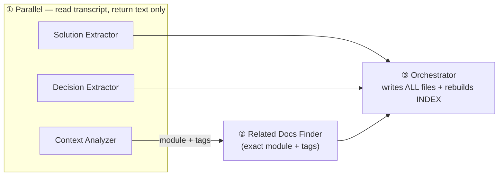
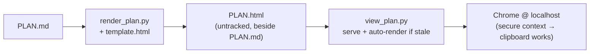
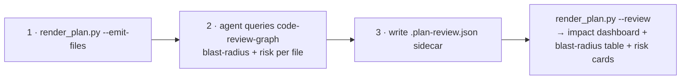
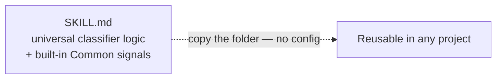

# Claude Skills — Reference & Workflow

Skills are reusable prompt programs invoked with `/skill-name`. Each skill has a defined scope, hard gates, and a handoff to the next skill.

This file is the single source of truth for overview, workflow, and cross-skill concerns — consult the `SKILL.md` of each skill for runtime behavior. Two skills keep deeper standalone docs: `skills/compound/README.md` and `skills/xia2/README.md`; the other per-skill `README.md` files have been removed (their rationale notes live at the bottom of this file).

---

## Development Workflows

### Full Cycle (3+ layers, migration, or spans multiple services)

```
scripts/init-structure.sh  (first-time repo setup only)
  → scaffolds specs/, docs/solutions/ (create-if-missing)
      ↓
/feature-intake  (routing entry point — run first on every change request)
  → classifies input type + 10-flag risk checklist + hard gates
  → output: lane (tiny|normal|high-risk) + confidence → specs/<slug>/SUMMARY.md
  → routes: tiny → branch + direct edit · normal → subagent-driven · high-risk → full chain below
  → EVERY lane cuts a branch first (enforced by hooks/branch-isolation-guard.sh)
      ↓
/brainstorming
  → reads: CLAUDE.md, docs/solutions/ (decision track only), recent commits
  → output: specs/<slug>/design.md
      ↓
/xia2
  → reads: CLAUDE.md, .claude/rules/, techstacks/, docs/, docs/solutions/, specs/
  → classifies depth from built-in Common signals (zero-config — no PROJECT.md)
  → depth re-evaluated after reading docs
  → output: specs/<slug>/research-brief.md (no code)
      ↓
/writing-plans
  → input: design.md + research-brief.md
  → output: specs/<slug>/PLAN.md
  → PLAN.html auto-rendered by hooks/render-plan-on-write.sh on every save; writing-plans opens it
      ↓
/using-git-worktrees
  → creates isolated worktree + branch
      ↓
/subagent-driven-development        ← same session
  OR /executing-plans               ← parallel session
  → implements plan task-by-task
  → two-stage review per task (spec compliance → code quality)
  → final adversarial correctness review (/correctness-review) over the whole diff before shipping
  → final intent review (/intent-review) — diff vs the original request, blind to PLAN
      ↓
/compound  (if non-obvious pattern found)
  → output: docs/solutions/<category>/<slug>.md
      ↓
/finishing-a-development-branch
  → runs tests, pushes, opens a PR (never merges — a human reviews & merges)
```

### Minimum Viable Path (intent clear, in-place edit, <1 day)

```
/feature-intake → /xia2 → /writing-plans → implement → /compound (if pattern found)

/feature-intake confirms the lane; a tiny lane branches (`git checkout -b`) then edits directly.
Skip /brainstorming when intent is clear.
Skip /using-git-worktrees for in-place edits — but NOT the branch: a plain
`git checkout -b <type>/<slug>` is still required. No lane implements on a shared branch.
PLAN.html still auto-renders on every PLAN.md save (`hooks/render-plan-on-write.sh`).
```

### Bug Fix Path

```
/systematic-debugging  (external — see below)
  → root cause analysis before any fix
      ↓
fix (implement directly or via /subagent-driven-development)
      ↓
/compound  (always — root cause is worth preserving)
```

---

## Skills Reference (in this repo)

### Intake & Routing

| Skill | Trigger | Output |
|---|---|---|
| `/feature-intake` | First, on every change request — classify risk lane + confidence and route | `specs/<slug>/SUMMARY.md` (Lane/Confidence/Reason/Flags) + a route decision |

### Setup

No skill covers first-time setup — it is a script: `bash scripts/init-structure.sh` scaffolds
`specs/` and `docs/solutions/` (create-if-missing). Run it once per repo.

### Discovery & Design

| Skill | Trigger | Output |
|---|---|---|
| `/brainstorming` | Before any new feature, component, or behavior change | `specs/<slug>/design.md` |
| `/xia2` | Before implementing anything — research what already exists (portable; zero-config, classifies from built-in Common signals) | `specs/<slug>/research-brief.md` |

### Planning

| Skill | Trigger | Output |
|---|---|---|
| `/writing-plans` | After design is approved and xia2 brief is ready | `specs/<slug>/PLAN.md` (`PLAN.html` auto-rendered by the render-plan hook) |
| `/visual-planner` | Standalone render of a `PLAN.md` — mainly for `--review` mode (blast-radius/risk overlay). Plain renders happen automatically via `hooks/render-plan-on-write.sh` | `specs/<slug>/PLAN.html` (untracked, local-only) |

### Execution

| Skill | Trigger | Output |
|---|---|---|
| `/using-git-worktrees` | Before starting feature work needing isolation | Isolated worktree + branch |
| `/subagent-driven-development` | Executing a plan in the current session (fresh subagent per task) | Implemented tasks, two-stage reviewed per task + final adversarial correctness review (delegates to `/correctness-review`) |
| `/executing-plans` | Executing a plan in a separate parallel session (checkpoint-based) | Same as above |

### Review & Shipping

| Skill | Trigger | Output |
|---|---|---|
| `/correctness-review` | After implementation — adversarial runtime-bug search over a diff, run as **6 parallel angles**, each named for its method (`enclosing-function` · `removed-behavior` · `call-site-impact` · `stack-defects` · `guard-completeness` · `prior-art`). **Standalone** (any diff, no workflow gate) or called by `/subagent-driven-development` as its final pass | Candidates deduped by location → scored (0–100, threshold 75) → classified (Severity + Rule class) → fixes, escalations, or advisory |
| `/intent-review` | After correctness-review — checks the diff against the original request verbatim, blind to PLAN (the third oracle). **Standalone** on any diff that has an intent statement, or called by `/subagent-driven-development` as its last pass | Findings classified `gap` / `excess` / `drift` → fix-loop · escalate · report-only |
| `/review-diff` | After implementation — visualize what changed | Markdown review with C4 diagrams |
| `/compound` | After session with non-obvious bug fix, pattern, or architectural decision | `docs/solutions/<category>/<slug>.md` |
| `/create-pr` | When only a PR description is needed | `.pr-body.md` |
| `/finishing-a-development-branch` | Implementation complete, tests pass | Runs tests, pushes, opens a PR (never merges) |

---

## External Skills (referenced but live elsewhere)

These skills appear in workflows above but are provided by the global `superpowers` plugin or `~/.claude/skills/`, not by this repo:

| Skill | Role |
|---|---|
| `/systematic-debugging` | Root-cause analysis before a bug fix |
| `/test-driven-development` | Tests-first protocol used by implementer subagents |
| `/requesting-code-review` | Structured review template |
| `/session-tracker` | Session resumption across conversations |
| `/skill-creator` | Authoring new skills |

If one of these isn't available in your environment, the workflows degrade gracefully — treat them as optional.

---

## Integration Evidence Tiers

Every integration this repo *claims* to use — external skills, MCP servers, and the cross-skill
handoff edges — carries an honest evidence tier. The tiers:

- **ci-proven** — a CI job in this repo actually runs the integration.
- **manually-verified (date)** — a recorded run exists in this repo (commit / results file).
- **documented-only** — referenced in docs/workflows but never observed running here.

| Integration | Kind | Tier | Evidence |
|---|---|---|---|
| `/systematic-debugging` | external skill | documented-only | referenced in Bug Fix Path; no recorded run in this repo |
| `/test-driven-development` | external skill | documented-only | named as implementer protocol; no recorded run here |
| `/requesting-code-review` | external skill | documented-only | referenced template; no recorded run here |
| `/session-tracker` | external skill | documented-only | referenced for resumption; no recorded run here |
| `/skill-creator` | external skill | documented-only | referenced for authoring; no recorded run here |
| `code-review-graph` | MCP server (`.mcp.json`) | documented-only | mandated by CLAUDE.md; no recorded review run pinned in-repo |
| `context7` | MCP server (user-level) | documented-only | user-level docs lookup; no recorded run pinned in-repo |
| `/subagent-driven-development` → `/correctness-review` → `/intent-review` | handoff edge | manually-verified (2026-06-12) | intent-review dogfood on its own diff — commit `a2a4349` |

**Graduation rule** (from the research report): an edge only moves **up** a tier when a
recorded run exists *in this repo* — support claims are never inherited from upstream or from
another project (`not_observed != absent`). Most external-skill rows start at documented-only
and that is the honest state; promote a row only when you can cite the commit or results file
that proves the run.

---

## Skill Handoff Map

```
/feature-intake             ──► tiny: git checkout -b → direct edit · normal: /subagent-driven-development
                                high-risk: /brainstorming (full chain) · low confidence: escalate
/brainstorming              ──► /xia2 → /writing-plans (the only valid next skills)
/xia2                       ──► research brief → user/skill decides next step
/writing-plans              ──► (PLAN.html auto-rendered by hook) → /using-git-worktrees
                                → /subagent-driven-development
                                OR /executing-plans (parallel session)
/visual-planner             ──► PLAN.html (terminal — visual artifact; back to writing-plans handoff)
/subagent-driven-development ──► /correctness-review → /intent-review (final passes) → /compound → /finishing-a-development-branch
/executing-plans            ──► same terminal chain as /subagent-driven-development
/correctness-review         ──► (standalone — runs the same pipeline ad-hoc on any diff; no gate)
/intent-review              ──► (standalone — same pipeline; needs ### Intent in SUMMARY or intent provided by the user)
/review-diff                ──► .review/review.md (terminal — visualization only, not a gate)
/create-pr                  ──► .pr-body.md (terminal — description only; never pushes or opens a PR)
/systematic-debugging       ──► fix → /compound
/compound                   ──► nothing (terminal — crystallization is end state)
/finishing-a-development-branch ──► nothing (terminal — shipped)
```

---

## Knowledge Base Integration

Skills read from and write to `docs/solutions/`:

```
writes ──► /compound
           docs/solutions/<category>/<slug>.md
           front-matter: problem_type (bug | knowledge | decision | failure),
                         module, tags, severity, applicable_when,
                         affects, supersedes, confidence, confirmed_at

reads  ◄── /brainstorming  (decision track only — avoid re-proposing rejected approaches)
       ◄── /xia2           (all tracks — module, affects, confidence filtering)
```

Schema reference: `docs/solutions/README.md` (scaffolded by `scripts/init-structure.sh`).

---

---

## Commit Hook

`hooks/commit-quality-gate.sh` gates every commit:
1. Secrets scan (+ staged `.env` check)
1.5. Pending-escalation gate — denies a commit touching `specs/<slug>/` while that slug's
   `ESCALATIONS.md` has `decision: pending` (deny-on-no-response)
1.6. Lane-evidence gate — for each staged `specs/<slug>/SUMMARY.md`, runs
   `scripts/verify_summary.py --lane` and blocks when the evidence the declared `Lane:` requires
   is missing (tiny → filled header; normal → + a real `### Verify` row; high-risk → + a
   non-empty `### Rollback`). The **staged** copy is checked, so a commit that adds the evidence
   self-unblocks. Fail-open when `python3` is unavailable
2. Debug artifact check (`breakpoint()`, bare `print()`)
2.5. Evidence gate (opt-in via `REQUIRE_VERIFY=1`) — for `app/` changes, requires a
   `### Verify` **heading** in the SUMMARY, then re-runs each *real* row and blocks when a
   claimed Exit does not match the fresh run. It does **not** require a real row: a table of
   only template placeholders (`<command>`) passes with a `no checks ran` warning, and the
   re-run degrades to presence-only if `python3` is unavailable
3. Targeted pytest for changed `app/` files

When ≥5 `app/` files are staged, the hook hints: `★ Consider running /compound`.

> **Two different evidence gates — do not conflate them.** Check **1.6** is the row-presence
> gate: `scripts/verify_summary.py --lane`, always on, asserts the SUMMARY carries what its `Lane:`
> requires. Check **2.5** is the row-*accuracy* gate: opt-in via `REQUIRE_VERIFY=1`, it re-runs
> real rows and blocks on a claimed-vs-actual exit mismatch — but a table of only placeholders
> passes it with a `no checks ran` warning. Evidence *exists* because of 1.6; evidence is
> *honest* because of 2.5. You can still run the former by hand:
> `python scripts/verify_summary.py --lane <slug>`.

This is one of several wired hooks — see the full table in the root `CLAUDE.md`.

---

## Per-skill Design Rationales

Notes preserved from the former per-skill READMEs. For full runtime behavior read each skill's `SKILL.md`.
The diagrams below render natively in the GitHub README — no clone needed.

### `/compound`

> **One-liner:** an orchestrator fans out read-only subagents to mine the session transcript, then writes every knowledge doc itself.



- **Orchestrator + 4 subagents.** `SKILL.md` orchestrates; subagents read the session transcript and return **text only** — the orchestrator writes all files.
- **Dispatch order (Option A, recommended):** the 3 extractors run in parallel; wait for Context Analyzer → extract `module`+`tags`; then Related Docs Finder with those exact values. Option B (all 4 in parallel with best-guess tags) is faster but slightly less accurate.
- **`applicable_when` is the primary discovery field.** Knowledge: "Use this pattern when…". Decision: "Make this decision when…". Bug: inherited from `CONTEXT_ANALYSIS`. Appears as an INDEX.md column so future agents scan one sentence per doc.
- **Four track types: `bug`, `knowledge`, `decision`, `failure`.** The `failure` track records a tried-and-abandoned approach to prevent recurrence: sections are Symptom → Wrong Approach → Why It Failed → Correct Approach → Guardrail (the check/hook/rule that now prevents a repeat). Emitted only when all four required sections (Symptom, Wrong_Approach, Why_It_Failed, Correct_Approach) are non-empty. `Harness-Delta: backlog` friction signals from subagent summaries are also mined into failure records.
- **Every `bug` doc requires `## Regression Test`.** Names the pinned test that catches a recurrence, or `[none] — <reason>` if none exists. This field is not optional.
- **Multi-decision consolidation.** ≥2 decisions in one session → single `[slug]-decisions.md` with `## Decision 1` / `## Decision 2` sections. Rationale: decisions from the same session are causally related; reading one without the other loses the constraints that drove it.
- **INDEX full rebuild (not append-only).** After every run. Prevents orphaned rows when files are renamed/moved/deleted. `docs/solutions/` grows to tens of files, not thousands — full scan is negligible.
- **Never auto-write to `CLAUDE.md`.** At end of run, if `CLAUDE.md` does not reference `docs/solutions/`, propose an addition — wait for developer approval.

**Severity triage** — `critical` requires **all three**; anything else is `standard`:

| Tier | Conditions | Effect |
|---|---|---|
| `critical` | (1) affects multiple features/layers **and** (2) ≥30 min wasted if unknown **and** (3) generalizable beyond this PR | Summary promoted to `critical-patterns.md` |
| `standard` | anything missing one of the above | Normal doc only |

**Collision handling** — how a new finding merges with existing docs:

| Overlap | Detected when | Action |
|---|---|---|
| **High** | same module **+** ≥2 matching tags | Update the existing file |
| **Moderate** | partial match | Write `[slug]-2.md` |
| **Low** | no real match | Write `[slug].md` |

### `/visual-planner`

> **One-liner:** a deterministic script (not the LLM) renders `PLAN.md` → a self-contained, untracked `PLAN.html`; a second script serves and opens it.



| Script | Role |
|---|---|
| `render_plan.py` | **Builds** `PLAN.html` by filling `{{PLACEHOLDER}}` slots in `template.html` — byte-for-byte reproducible. |
| `view_plan.py` | **Shows** it — serves on localhost + opens Chrome, auto-rendering first if `PLAN.html` is missing/stale. |

- **Deterministic script, not LLM transcription.** The skill only runs the script and relays its report — never emits HTML token-by-token. Transcribing a ~340-line template every run is expensive and the least reproducible part of the pipeline; a script makes the fill free and stable.
- **Local-only output.** `PLAN.html` is untracked — it lives beside `PLAN.md` in `specs/` (which is tracked), but `PLAN.html` itself is gitignored as a derived artifact.
- **Auto-rendered by a hook, not a sub-agent.** `hooks/render-plan-on-write.sh` (PostToolUse on `specs/*/PLAN.md`) runs `render_plan.py --summarize` on **every** save, so `PLAN.html` and the in-file "At a glance" block stay current without any skill dispatch. `/writing-plans` only *opens* the rendered file at the execution handoff. Run `/visual-planner <slug>` standalone when you want `--review` mode.
- **Why serve instead of `file://`?** Localhost is a browser *secure context*, so per-task "copy `<verify>`" buttons use `navigator.clipboard`; `--file` (`file://`) is faster but falls back to `execCommand`. Auto-view is environment-dependent (no display on headless/remote), so it stays an explicit step.
- **Self-check before claiming success.** The script asserts non-empty output, no surviving `{{PLACEHOLDER}}`, the `slug` present, and one `<section data-wave>` per distinct wave. On non-zero exit, surface the `SELF-CHECK FAILED:` lines verbatim — do not claim success.

**`--review` mode is a 3-step dance** (the offline renderer can't call MCP itself):



### `/xia2`

> **One-liner:** one portable, zero-config skill — the risk signals are built into `SKILL.md` as common cross-project vocabulary, so there is nothing to configure per repo.



> **Historical note (2026-07-17):** xia2 previously carried a per-project `PROJECT.md` sibling holding the signal lists. That file was removed when xia2 went config-free; the `PROJECT.md >` references still visible in `tests/structural/depth-modes-test-cases.md` are that era's provenance and the classifications hold unchanged under the equivalent Common signals.

- **Portable by design.** All logic — including the risk-classification signals — is built into `SKILL.md` as common cross-project vocabulary. No per-project config file.
- **Zero-config.** xia2 classifies from its built-in Common signals; nothing to bootstrap.
- **Fork to another project:**
  1. Copy `skills/xia2/`.
  2. Run `bash scripts/init-structure.sh` in the new repo to scaffold `specs/` and `docs/solutions/`.
  3. `tests/structural/depth-modes-test-cases.md` is a portable regression set against the common signals — keep or extend it.
  4. Keep `tests/behavioural/pressure-scenarios.md` — most scenarios are universal.
- **Maintenance discipline:**
  - Editing HARD-GATE, the Common signals, Decision Procedure, Depth Modes, Tiebreakers, Re-evaluation gate, or Step 1 waiver → **must** re-run `tests/structural/` suite.
  - Wording polish in non-classifier sections does not require a re-run.

**Critical regression canaries** (see `tests/structural/depth-modes-test-cases.md`):

| Test case | Must classify as |
|---|---|
| TC-01 → TC-04 | **Quick** |
| TC-19, TC-21 | **Deep** |
| TC-20 | **Standard** (initial classification) |
| TC-29 | Surface a **risk warning** when HARD-GATE is waived |
