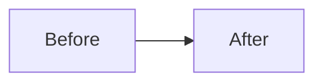

# Finishing a Development Branch

## Overview

Complete development work by verifying tests, then opening a pull request.

**Core principle:** Verify tests → Push → Open PR → Report URL.

This skill **only creates a PR**. It never merges, never force-pushes, and never discards work — a human reviews and merges the PR.

**Announce at start:** "I'm using the finishing-a-development-branch skill to open a PR for this work."

## The Process

### Step 1: Verify Tests

Invoke the **test-runner** sub-agent to run the test suite. Pass it the list of files changed on the current branch so it can target the minimal relevant test set.

#### 1a. Identify changed files

```bash
git diff --name-only $(git merge-base HEAD main)...HEAD -- '*.py'
```

Use these paths to determine which test files to run (e.g. changes to `app/repositories/user.py` → run `tests/repositories/test_user.py`).

#### 1b. Run tests

Launch the **test-runner** sub-agent with the project's test runner. Use whatever this repo
actually uses — detect it, don't assume a stack. For **this** repo (harness-skills) that is:

```bash
bash scripts/run-tests.sh
```

For an application repo, run the targeted test files with the project's runner (e.g.
`pytest <test_files> -x`, `npm test`, `go test ./...`); fall back to the full suite when no
targeted subset applies.

#### 1c. Report results

Present a structured summary:

```
Test Report
───────────────────────────────
Result:  ✅ N passed / ❌ N failed
Files:   tests/path/to/test_file.py, ...
Runner:  test-runner sub-agent
───────────────────────────────
```

#### 1d. Handle failures

- **All pass** → proceed to Step 2.
- **Failures** → report the tracebacks, attempt to fix the failing code, then re-invoke the test-runner to confirm the fix. Repeat up to **2 retries**. If tests still fail after retries, stop and ask the user how to proceed (fix manually, skip tests, or abort).

Do NOT skip this step. Never push code with failing tests.

### Step 2: Determine Base Branch

```bash
# Try common base branches
git merge-base HEAD main 2>/dev/null
```

If the base branch is not mentioned in chat, default to `main`. Only ask ("This branch split from `main` — is that correct?") if there is a concrete signal it split from something else.

### Step 3: Push and Open PR

**Gate 0 — review receipt (normal + high-risk lanes; tiny skips).** Before anything else in this
step, verify the reviews ran against the code being pushed.

First **resolve the plan directory** with Step 4a's rule (exact `specs/<slug>` from the branch, else
the best-matching `specs/*/PLAN.md`, else *no plan* → skip Gate 0 exactly as Step 4 skips). Use that
resolved `<plan_dir>` — not a bare branch-derived slug — for the checks below, so a branch like
`fix/foo` backed by `specs/gh-143-context-propagation` checks the receipt where it was actually
written. Determine `<base>` = the base branch from Step 2 (e.g. `origin/main`).

```bash
python3 scripts/check_review_receipt.py <plan_dir> --require correctness,intent --require-audit-if <base>
```

`--require-audit-if <base>` makes the gate **path-aware**: when the `<base>..HEAD` diff touches a
workflow-engine surface (`skills/*/SKILL.md`, dispatch prompts incl. `subagents/`, `agents/`,
`rules/`), it additionally requires a passing `context-propagation-audit` entry — so the
change-triggered audit cannot be skipped for exactly the prompt/rule edits it protects.

Exit 1 (receipt missing / malformed / any recorded review not `pass` — `fail`, `pending`, `skipped`,
absent all count / any `blocking_open > 0` / a required type absent, including the audit on a
workflow-engine diff / HEAD advanced with **code** outside `specs/` since the review) means the pinned
reviews are stale or incomplete — **REFUSE to push or open the PR.** Route back to
`subagent-driven-development` to re-run the affected review and re-write the receipt; never hand-edit
`.review-receipt.json` to pass the gate. Exit 0 → continue. **Tiny lane:** skip this gate — its route
has no review chain to pin.

> **Order note (the plan-`shipped` commit is safe):** step 1 below commits the `specs/`-only status
> change *after* this gate, advancing HEAD past `reviewed_head_sha`. The checker deliberately
> **tolerates a `specs/`-only advance** (bookkeeping carries no reviewable code), so re-running Gate 0
> immediately before the push (step 2) still passes. Run it again there as a belt-and-braces check —
> if any **non-`specs/`** change slipped in after review, that re-check fails and blocks the push,
> which is exactly the stale-review protection working.

**Recommended for workflow-engine diffs: a review from outside this harness.** When the
`<base>..HEAD` diff touches the `workflow-engine` surface (`harness-manifest.json` →
`workflow-engine`), the change is worth one more pass by a reviewer that is **not** dispatched by
this harness — whatever your project already uses: a PR review bot, a required human reviewer, or
another agent with its own prompts. Detect what the project has; the harness assumes none and
requires none. This is a **merge**-time suggestion, never a push gate: nothing here blocks, and
nothing is mirrored locally.

**Why it is worth the wait.** The three local oracles (`/correctness-review`, `/intent-review`,
`/context-propagation-audit`) can run on different models and still share one *reading frame* —
they are dispatched by this harness, with its prompts, and they read a `SKILL.md` as policy prose.
On PR #158 all three passed a diff in which trimming `using-git-worktrees` had deleted the line
assigning `path=` while a later step still ran `deploy-harness.sh --target "$path"`; every route
reached it unset, so a fresh worktree silently got no `.claude/`. The external reviewer caught it
by reading the same file as **code**. Model diversity does not produce that — a different frame
does, and a reviewer outside the lineage is the cheapest source of one.

That specific class is now caught mechanically by `scripts/lint-skill-bash.sh`, which is the
portable half of the lesson: prefer a deterministic check you can ship over a reviewer you cannot
assume exists. A lint only covers the frame gap you already found, so an outside pass still earns
its keep where one is available.

1. **Mark the plan shipped** — run Step 4. This updates `specs/<slug>/PLAN.md`, which is **tracked** in git, so stage and commit the status change with the work (it lands in the branch/PR). If no plan matches, skip silently.
1b. **`CHANGELOG.md` + `VERSION` — who bumps depends on whether this repo has the post-merge automation.** Check for `.github/workflows/post-merge-maintenance.yml` (paired with `scripts/bookkeeping.sh`):
   - **Automation present (the harness-skills meta-repo):** do **NOT** bump by hand. The workflow owns it end-to-end — on merge it runs `bookkeeping.sh`, which bumps `VERSION`, inserts the dated CHANGELOG section, and appends the trust-metrics + audit-log rows, all parsed from the merged `SUMMARY.md`. A manual pre-bump double-counts: `bookkeeping.sh` bumps again from the value you set (skipping a version) and orphans your `## [Unreleased]` bullet. This matches `feature-intake` → "Do NOT hand-append the ledger. CI records it on merge." Your job is a correct `SUMMARY.md`, then review the bookkeeping PR after merge.
   - **Automation absent (a consuming project — the harness deploys this skill but not `bookkeeping.sh`/the workflow):** bump manually, as there is nothing else to do it. When the change is user-visible (a new/changed skill or hook, a schema change, a fix worth announcing), add a bullet under `## [Unreleased]` and bump root `VERSION` per the CHANGELOG's own rule (patch = fix/docs · minor = new/changed skill or hook contract · major = breaking workflow/schema change). Skip for purely internal docs/research. Commit these with the work so the PR carries them.

   See `docs/solutions/harness/manual-version-bump-collides-with-event-sourced-bookkeeping.md` (the double-bump this scoping prevents).
2. **Re-run Gate 0** (`python3 scripts/check_review_receipt.py <plan_dir> --require correctness,intent --require-audit-if <base>`)
   immediately before pushing — it passes if the only advance since review is the `specs/`-only
   shipped commit, and blocks if unreviewed code slipped in. Then push:
   `git push -u github <current_branch>`.
3. Write the PR body to `.pr-body.md` (gitignored) using the template below.
4. Create the PR with `gh pr create` against `<base_branch>`, using that file as the body.
4b. **Run-state checkpoint (non-fatal).** After the PR is created, mark the run
    `ready_to_merge` — this must never fail the PR-creation flow, and correctly no-ops for a
    `tiny`-lane branch (whose run never left `investigating`, so the engine cleanly rejects
    the transition):

    ```bash
    python3 runtime/run_state.py transition --slug <slug> --to ready_to_merge \
      --event pr.opened || true
    ```
5. Return the PR URL to the user. **Stop here** — do not merge.

#### PR body template

Gather context first: `git log <base>...HEAD --oneline` and `git diff <base>...HEAD --stat`.

````markdown
## Title

type: short description  <!-- feat | fix | refactor | chore | docs | test | perf — max 72 chars -->

## Summary

[2–4 sentences a reviewer reads in ~10 seconds to understand the change without opening the
diff. Lead with the behavioral delta and why it matters, as before → after. Not diff narration.]

## Tasks

- [One clear line per task. No implementation detail.]

## Diagram

<!-- Include ONLY when the change is flow-shaped — a multi-step process, state machine, or
     request/data flow — or the linked ticket/spec is itself about a flow or already has a
     diagram. Otherwise delete this whole section; never force a diagram onto a change that
     does not have a shape. -->



## Notes

[Only what a reviewer must be flagged about: breaking changes, migration steps, follow-ups,
known limitations. Delete the section if nothing rises to that bar.]
````

Do not restate the file list or explain the code line by line — the diff view already shows both.

If a PR already exists for this branch, push the new commits and report the existing PR URL instead of creating a duplicate.

### Step 4: Mark the plan shipped

Runs as the first action of Step 3, before the push.

> Why this step exists: `status:` in `specs/<slug>/PLAN.md` records the plan lifecycle (`proposed` → `active` at execution start → `shipped` here). This is the **`shipped`** transition — a **committed** signal (`specs/` is tracked, so the transition is committed with the rest) that anyone reading the branch/PR can see the feature reached a PR. The edit auto-re-renders `PLAN.html` via `render-plan-on-write.sh` (`PLAN.html` itself is gitignored). Leaving it stale is the root cause of status drift across `specs/`.

#### 4a. Resolve the plan for this branch

```bash
branch=$(git branch --show-current)
slug=${branch#*/}                       # strip the <type>/ prefix (feat|fix|docs|chore|refactor|test|perf|ci) — see using-git-worktrees Branch Naming
ls specs/"$slug"/PLAN.md 2>/dev/null || ls specs/*/PLAN.md
```

- Exact match → use `specs/<slug>/PLAN.md`.
- No exact match → pick the `specs/*/PLAN.md` whose frontmatter `slug:` or title best matches the branch. If ambiguous, ask the user which plan this branch implements.
- No plan at all → **skip Step 4** (don't block the push).

#### 4b. Set status + append log

In the resolved `PLAN.md`:

1. Set the frontmatter to `status: shipped`. Canonical values are **only** `proposed | active | paused | shipped` — never invent others (`complete`, `done`, `ready-for-execution` are invalid and get silently dropped by the renderer).
2. Append one entry to the `## Status Log` (or numbered `## N. Status Log`) section, using today's date:

   ```markdown
   - YYYY-MM-DD — shipped via `<branch>` (PR #NNN)
   ```

Stage and commit this edit — `specs/` is tracked, so the status update lands in the branch/PR and persists for anyone who reads it (only the derived `PLAN.html` is gitignored).

## Quick Reference

| Step | Action | Blocker? |
|------|--------|----------|
| 1 | Run tests | Yes — must pass to proceed |
| 2 | Detect base branch | No — default to `main` |
| 3 | Push + open PR (no merge) | No |
| 4 | Mark plan `shipped` + log | No — skip if no plan matches |

## Red Flags

**Never:**
- Push code with failing tests
- **Merge the PR** — this skill only opens it; a human merges
- Force-push (`--force`) without explicit user request
- Use `git add -A` or `git add .` (may include secrets or junk files)
- Discard or `git clean` work — this skill never deletes work
- Amend an existing commit — always create a new one

**Always:**
- Run tests before pushing
- Stage files by name, not by wildcard
- Show the PR URL after creation
- Default to `main` as base branch when not specified
- Set the matching plan's `status: shipped` using only canonical status values, and commit it (`specs/` is tracked, so the transition is committed with the work)

## Integration

### Sub Agents

- **test-runner** sub-agent — runs tests and reports results
