# Acceptance Contract + Loop Budget

<!-- AT-A-GLANCE:BEGIN (generated — do not edit; refreshed by render_plan.py --summarize) -->
## At a glance

**9 tasks · 3 waves · 13 files · 4/9 done**

| Wave | Task | Title | Files | Done (acceptance) |
|---|---|---|---|---|
| 1 | 1.1 | SC-table schema in the plan-format rule (wave 1) | rules/plan-format.md | Rule defines table columns, id/grammar/guardrail constraints, exemptions, and th… |
| 1 | 1.2 | SC parsing + coverage enforcement in verify_summary.py (wave 1) | scripts/verify_summary.py, scripts/test_verify_summary.py | All new tests pass; existing tests untouched and green; no change to CLI flags. |
| 1 | 1.3 | Criterion column in the SUMMARY template (wave 1) | templates/SUMMARY.template.md | Template table has 5 columns; comment states the mapping rule; existing 4-col SU… |
| 1 | 1.4 | Loop budget in correctness-review (wave 1) | skills/correctness-review/SKILL.md | No "repeat until ✅" text remains; cap, progress guard, mid-loop counter rule, an… |
| 2 | 2.1 | SC authoring step in writing-plans (wave 2) | skills/writing-plans/SKILL.md, skills/writing-plans/plan-document-reviewer-prompt.md | Authoring step present before task decomposition; reviewer checklist covers SC-t… |
| 2 | 2.2 | Ship exit gate in subagent-driven-development (wave 2) | skills/subagent-driven-development/SKILL.md | Spec reviewer receives SC rows verbatim; ship gate states the conjunction; no re… |
| 2 | 2.3 | Contract as third oracle in intent-review (wave 2) | skills/intent-review/SKILL.md | Third oracle documented with precedence + routing; dispatch inputs updated; taxo… |
| 2 | 2.4 | SC-table lint in check_verify_rows (wave 2) | scripts/check_verify_rows.py, scripts/test_check_verify_rows.py, scripts/run-tests.sh | Piped/slow SC checks are caught at L1 before CI; SUMMARY linting behavior unchan… |
| 3 | 3.1 | Suite, doc-truth, dogfood SUMMARY (wave 3) | specs/acceptance-contract-loop-budget/SUMMARY.md | Full suite green locally; this spec's SUMMARY is the first contract-enforced SUM… |

```mermaid
flowchart LR
  subgraph W0[Wave 1]
    T1_1["1.1 SC-table schema in the plan-format rule (wave 1)"]
    T1_2["1.2 SC parsing + coverage enforcement in verify_summary.py (wave 1)"]
    T1_3["1.3 Criterion column in the SUMMARY template (wave 1)"]
    T1_4["1.4 Loop budget in correctness-review (wave 1)"]
  end
  subgraph W1[Wave 2]
    T2_1["2.1 SC authoring step in writing-plans (wave 2)"]
    T2_2["2.2 Ship exit gate in subagent-driven-development (wave 2)"]
    T2_3["2.3 Contract as third oracle in intent-review (wave 2)"]
    T2_4["2.4 SC-table lint in check_verify_rows (wave 2)"]
  end
  subgraph W2[Wave 3]
    T3_1["3.1 Suite, doc-truth, dogfood SUMMARY (wave 3)"]
  end
  W0 --> W1
  W1 --> W2
```



### Progress
- [x] 1.1 — SC-table schema in the plan-format rule (wave 1)
- [ ] 1.2 — SC parsing + coverage enforcement in verify_summary.py (wave 1)
- [ ] 1.3 — Criterion column in the SUMMARY template (wave 1)
- [x] 1.4 — Loop budget in correctness-review (wave 1)
- [x] 2.1 — SC authoring step in writing-plans (wave 2)
- [ ] 2.2 — Ship exit gate in subagent-driven-development (wave 2)
- [ ] 2.3 — Contract as third oracle in intent-review (wave 2)
- [x] 2.4 — SC-table lint in check_verify_rows (wave 2)
- [ ] 3.1 — Suite, doc-truth, dogfood SUMMARY (wave 3)
<!-- AT-A-GLANCE:END -->

## 1. Motivation

The loop (implement → test → review → fix) has no objective feature-level stop condition:
`PLAN.md §3 Success Criteria` is free prose no stage reads mechanically, and the
correctness-review fix-loop is textually unbounded ("repeat until ✅"). Design:
`specs/acceptance-contract-loop-budget/design.md` (approved). Research:
`specs/acceptance-contract-loop-budget/research-brief.md`.

## 2. Non-goals

- No change to correctness-review's plan-blind FIND stage.
- No LLM-as-judge acceptance checks; no new hooks; no new standing automation.
- No retrofit of existing/legacy specs (fail-open when no SC table exists).
- No review-receipt schema change (round counter is in-session state).

## 3. Success Criteria

| ID | Behavior (observable) | Check (re-runnable) | Expected |
| --- | --- | --- | --- |
| SC-1 | Lane mode fails a SUMMARY whose sibling PLAN.md has an SC table but a Verify table missing coverage for some SC | `python3 -m pytest scripts/test_verify_summary.py -q -k sc_coverage` | exit 0 |
| SC-2 | Legacy 4-column Verify tables and specs without an SC table pass exactly as today | `python3 -m pytest scripts/test_verify_summary.py -q -k backward_compat` | exit 0 |
| SC-3 | Check mode executes commands and validates Criterion-mapped rows by actual exit | `python3 -m pytest scripts/test_verify_summary.py -q -k criterion_check_mode` | exit 0 |
| SC-4 | The verify-row lint rejects a piped or whole-suite command inside a PLAN.md SC table | `python3 -m pytest scripts/test_check_verify_rows.py -q -k sc_table` | exit 0 |
| SC-5 | correctness-review SKILL.md mechanizes the loop budget (cap 3 + progress guard + escalation routing) | `grep -q "Loop budget (cap + progress guard)" skills/correctness-review/SKILL.md` | exit 0 |
| SC-6 | plan-format rule defines the SC table schema and its guardrails | `grep -q "Success Criteria schema" rules/plan-format.md` | exit 0 |
| SC-7 | commit-gate `--plan-dir` override enforces SC coverage against the real spec dir (no fail-open when SUMMARY is read from a staged/temp copy) | `python3 -m pytest scripts/test_verify_summary.py -q -k plan_dir` | exit 0 |
| SC-8 | Single-target/`--check` mode (the documented ship gate) fails an uncovered SC, including when the Verify table has no runnable row | `python3 -m pytest scripts/test_verify_summary.py -q -k fails_check_mode` | exit 0 |
| SC-9 | The commit gate judges SC coverage against the INDEXED PLAN, so editing the PLAN in the worktree after staging cannot fail it open | `grep -q "SC table is enforced even after the worktree PLAN is emptied" tests/hooks/commit-quality-gate.test.sh` | exit 0 |

## 4. Tasks

### Task 1.1 — SC-table schema in the plan-format rule (wave 1)

- **Files:** rules/plan-format.md
- **Action:** In `## PLAN.md structure`, expand the `## 3. Success Criteria` line into a
  subsection headed exactly `## Success Criteria schema (the acceptance contract)` placed
  after the Task Schema section. Define: a required markdown table for new markdown plans with columns
  `| ID | Behavior (observable) | Check (re-runnable) | Expected |`; `SC-<n>` ids sequential
  and unique; Check commands inherit the Verify guardrails (single command, pipe-free, <60s,
  no whole-suite rows — cite `docs/solutions/harness/verify-row-must-be-pipe-free-and-under-60s.md`);
  `Expected` grammar = leading machine-read token `exit <n>` (non-zero allowed), free text may
  follow; fenced tables are illustrations and ignored (same rule as tasks); legacy XML plans
  and pre-existing specs are exempt. Add one non-fenced-looking example table (inside a code
  fence so it is treated as illustration). Also document the SUMMARY side: the `### Verify`
  table accepts an optional trailing `Criterion` column naming an SC id, enforced by
  `scripts/verify_summary.py` when the sibling PLAN.md declares an SC table.
- **Verify:** `grep -q "Success Criteria schema" rules/plan-format.md && grep -q "Criterion" rules/plan-format.md`
- **Done:** Rule defines table columns, id/grammar/guardrail constraints, exemptions, and the Criterion column; doc-truth lint still passes.

### Task 1.2 — SC parsing + coverage enforcement in verify_summary.py (wave 1)

- **Files:** scripts/verify_summary.py, scripts/test_verify_summary.py
- **Action:** TDD — write failing tests first (extend existing `make_summary`/`write_summary`
  helpers with a `write_plan` helper), then implement:
  1. `parse_sc_table(plan_text) -> dict[str, str]` — map `SC-n` → expected-exit token. Parse
     only markdown table rows whose first cell matches `^SC-\d+$`, skipping fenced blocks
     (reuse the fence-skip approach used by the task parser in render_plan; a simple
     in-fence toggle on ```` ``` ```` lines). Duplicate id → error entry. `Expected` cell
     must start `exit <n>`; anything else → error.
  2. Extend `_parse_verify_rows` to read `criterion = cells[4] if len(cells) > 4 else ""`
     (skip the header/separator rows exactly as today). 4-col rows keep `criterion == ""`.
  3. In `check_lane_evidence` (shared by `--lane` and reachable from check mode): locate the
     sibling `PLAN.md` of the SUMMARY being checked (pass the summary path or spec dir in —
     add a parameter with default `None` to keep the existing text-only call signature
     working in tests). When a PLAN.md exists and `parse_sc_table` returns ≥1 SC: every SC id
     must be named by ≥1 Verify row's Criterion cell whose claimed exit matches the SC's
     expected exit; a Criterion naming an unknown SC id is an error (typo guard). No PLAN.md
     or no SC table → zero new checks (fail-open). Rows without Criterion stay legal.
  4. In check mode (`run_checks` result handling), when a Criterion-mapped row runs, compare
     the actual exit against the SC expected exit as well (reuse the existing claimed-vs-actual
     machinery — the SC expected and claimed exit must already agree from step 3).
  Test names must include: `test_sc_coverage_missing_fails_lane`, `test_sc_coverage_complete_passes_lane`,
  `test_sc_unknown_criterion_fails`, `test_sc_duplicate_id_fails`, `test_backward_compat_4col_no_plan`,
  `test_backward_compat_plan_without_sc_table`, `test_criterion_check_mode_actual_exit`,
  `test_rewrite_table_preserves_criterion_column` (5-col round-trip through default mode).
- **Verify:** `python3 -m pytest scripts/test_verify_summary.py -q`
- **Done:** All new tests pass; existing tests untouched and green; no change to CLI flags.

### Task 1.3 — Criterion column in the SUMMARY template (wave 1)

- **Files:** templates/SUMMARY.template.md
- **Action:** Extend the `### Verify` table header to
  `| Check | Command | Exit | Notes | Criterion |` (placeholder row gains a trailing
  `<SC-n or blank>` cell) and extend the HTML comment above it: the trailing `Criterion`
  column is optional, names an `SC-n` from PLAN.md §3 when one exists, and every SC must be
  covered by ≥1 passing row (enforced by `scripts/verify_summary.py`).
- **Verify:** `grep -q "Criterion" templates/SUMMARY.template.md`
- **Done:** Template table has 5 columns; comment states the mapping rule; existing 4-col SUMMARYs remain valid (no retrofit).

### Task 1.4 — Loop budget in correctness-review (wave 1)

- **Files:** skills/correctness-review/SKILL.md
- **Action:** Replace the unbounded Rule 1–3 line ("→ implementer auto-fixes (fresh dispatch)
  → re-review → repeat until ✅") with a bounded loop contract under a subsection headed
  exactly `## Loop budget (cap + progress guard)`:
  - **Cap:** max 3 fix→re-review rounds per finding; the round counter is in-session
    orchestrator state (review receipt schema unchanged). On cap: stop retrying, write the
    finding to `specs/<slug>/ESCALATIONS.md` (standalone: surface to the user), and record
    rounds used in SUMMARY.md `Deviations`. Rationale line: three fresh-context failures
    indicate a plan/spec problem — the blocker class orchestration.md already escalates.
  - **Progress guard:** after each round compute a hash of the full `git diff <base>..HEAD`
    output (`<base>` = the base of the reviewed diff range; standalone: the range the review
    was invoked with). If the open blocking count did not decrease AND the diff hash is
    unchanged versus the previous round → escalate immediately (ping-pong / no-op fix).
  - A finding first surfaced mid-loop starts its own counter at 1. The residual-work gate
    (fixed ✅ or durably recorded) is unchanged. Pipe-free example command for the hash:
    `git diff <base>..HEAD > /tmp/round.diff` then `git hash-object /tmp/round.diff`.
  Update the pipeline summary line (§ "FIND … → fix-loop") to mention the budget.
- **Verify:** `grep -q "Loop budget (cap + progress guard)" skills/correctness-review/SKILL.md && grep -q "max 3" skills/correctness-review/SKILL.md`
- **Done:** No "repeat until ✅" text remains; cap, progress guard, mid-loop counter rule, and escalation routing all present; Rule 4 STOP text untouched.

### Task 2.1 — SC authoring step in writing-plans (wave 2)

- **Files:** skills/writing-plans/SKILL.md, skills/writing-plans/plan-document-reviewer-prompt.md
- **Action:** In `## File Structure` (the "before defining tasks" section), add a step:
  author the `## 3. Success Criteria` SC table (per `.claude/rules/plan-format.md` →
  Success Criteria schema) BEFORE decomposing tasks, so tasks trace to the SCs they serve;
  a new markdown plan without the table fails plan review. Add one line to the Plan Format
  non-negotiables list pointing at the SC schema. In
  skills/writing-plans/plan-document-reviewer-prompt.md (the reviewer checklist lives there),
  add an SC-table row to the What-to-Check table: table present, `SC-<n>` ids unique,
  Check cells pipe-free and <60s, Expected cells start `exit <n>`. Keep the schema itself in
  the rule only (single-home).
- **Verify:** `grep -q "Success Criteria" skills/writing-plans/SKILL.md && grep -q "SC-" skills/writing-plans/plan-document-reviewer-prompt.md`
- **Done:** Authoring step present before task decomposition; reviewer checklist covers SC-table presence; schema not duplicated (pointer to the rule only).

### Task 2.2 — Ship exit gate in subagent-driven-development (wave 2)

- **Files:** skills/subagent-driven-development/SKILL.md
- **Action:** Two edits: (a) in the per-task spec-compliance review dispatch instructions,
  include the SC rows relevant to the task (quote them into the reviewer prompt — reviewers
  are isolated contexts; never assume they can see the plan). (b) In the `## Review Receipt`
  / handoff section, extend the ship condition to the explicit conjunction: handoff to
  `finishing-a-development-branch` requires `python scripts/verify_summary.py --check <slug>`
  passing **including SC coverage**, AND every receipt entry `result: pass` with
  `blocking_open: 0`. Add one Red Flags bullet: "shipping with an SC lacking a passing
  Criterion row". Receipt JSON schema unchanged.
- **Verify:** `grep -q "SC coverage" skills/subagent-driven-development/SKILL.md && grep -q "verify_summary.py --check" skills/subagent-driven-development/SKILL.md`
- **Done:** Spec reviewer receives SC rows verbatim; ship gate states the conjunction; no receipt schema change.

### Task 2.3 — Contract as third oracle in intent-review (wave 2)

- **Files:** skills/intent-review/SKILL.md
- **Action:** In `## 1. Oracle input`, add a third bullet after the design.md Success
  Criteria one: the PLAN.md §3 SC table (when present) is a checkable oracle — the reviewer
  verifies each SC is proven by the SUMMARY Verify table (Criterion mapping) and flags an
  unproven SC as a `gap` finding. Precedence unchanged: verbatim request wins over both
  secondary oracles. Mirror the addition in the reviewer dispatch inputs (Section 4) so the
  isolated reviewer receives the SC table + Verify table verbatim, and add `unproven SC` to
  the `gap` row of the Section 5 taxonomy.
- **Verify:** `grep -q "SC table" skills/intent-review/SKILL.md && grep -q "Criterion" skills/intent-review/SKILL.md`
- **Done:** Third oracle documented with precedence + routing; dispatch inputs updated; taxonomy covers unproven SC.

### Task 2.4 — SC-table lint in check_verify_rows (wave 2)

- **Files:** scripts/check_verify_rows.py, scripts/test_check_verify_rows.py, scripts/run-tests.sh
- **Action:** TDD — tests first. Add `check_plan_text(text) -> list[str]` linting SC-table
  Check cells with the SAME rules as `check_summary_text` (pipe in command → error;
  `_is_too_slow` match → error), applied only to rows whose first cell matches `^SC-\d+$`
  outside fenced blocks. In `main`, route files named `PLAN.md` to `check_plan_text`,
  `SUMMARY.md` to `check_summary_text` (keep the deleted-file skip). Update the run-tests.sh
  L1 lint step to pass changed `specs/*/PLAN.md` files as well as changed SUMMARYs to the
  script. Tests: `test_sc_table_pipe_rejected`, `test_sc_table_full_suite_rejected`,
  `test_sc_table_clean_passes`, `test_plan_without_sc_table_passes`. No bash-side test:
  verified that no `tests/scripts/*.test.sh` covers check_verify_rows today — pytest
  coverage suffices; do not add one.
- **Verify:** `python3 -m pytest scripts/test_check_verify_rows.py -q`
- **Done:** Piped/slow SC checks are caught at L1 before CI; SUMMARY linting behavior unchanged.

### Task 3.1 — Suite, doc-truth, dogfood SUMMARY (wave 3)

- **Files:** specs/acceptance-contract-loop-budget/SUMMARY.md
- **Action:** Run `bash scripts/run-tests.sh` (hooks/scripts changed — CLAUDE.md gotcha) and
  fix anything red. Then dogfood: fill this spec's own SUMMARY `### Verify` table using the
  NEW 5-column format, one passing row per SC-1…SC-6 (commands from §3 above, actually run),
  update `## What changed`, and confirm `python3 scripts/verify_summary.py --lane acceptance-contract-loop-budget`
  passes under the new SC-coverage enforcement. Note the full suite in prose (covered by CI
  `tests` job), never as a Verify row.
- **Verify:** `python3 scripts/verify_summary.py --lane acceptance-contract-loop-budget`
- **Done:** Full suite green locally; this spec's SUMMARY is the first contract-enforced SUMMARY (all 6 SCs covered).

## 5. Risks

- **Context propagation (workflow-engine diff):** every consumer edit (2.1–2.3) quotes
  content into isolated reviewer prompts rather than assuming `paths:` injection —
  `/context-propagation-audit` runs over the final diff and FAILs on assumed delivery.
- **Self-application at commit time:** once 1.2 lands in the working tree, the commit gate
  enforces SC coverage on THIS spec (its PLAN.md §3 is a real SC table). Wave 3 fills the
  rows before the final commit; intermediate commits must not stage SUMMARY.md while it
  still lacks Criterion rows.
- **Parser regressions:** guarded by `test_backward_compat_*` and the 5-col round-trip test.
- **Doc-truth lint:** any path named in edited rules/skills must exist — keep examples
  placeholder-style or use real repo paths.

## 6. Status Log

- 2026-07-22 — plan written (design approved same day; spec review 2 rounds, approved).
- 2026-07-22 — wave 1 shipped (`78db5a6`): tasks 1.1–1.4. wave 2 shipped (`fb37f7e`): tasks 2.1–2.4 (Rule-3 fix: missing `import os` in check_verify_rows.py). wave 3: full suite green (180 py + bash), SUMMARY dogfooded — all 6 SCs proven, `verify_summary.py --lane` passes under SC-coverage enforcement.
- 2026-07-23 — final-pass review (correctness + intent + context-propagation). B fixed (`7b44342`): SC slots added to isolated reviewer templates. A fixed (user-authorized Rule-4 hook change): `--plan-dir` override so commit-gate SC coverage no longer fail-opens on the staged/temp copy — added **SC-7** (182+2 tests green). C resolved: loop budget stays correctness-review-scoped per design.
- 2026-07-23 — re-review at final HEAD: correctness caught `--plan-dir` silently dropped in check/single-target mode; fixed (`a668471`, +1 test, 183 green). Review receipt written (correctness/intent/context-propagation-audit all pass); Gate 0 green.
- 2026-07-23 — shipped via `feature/acceptance-contract-loop-budget` (PR #157).
