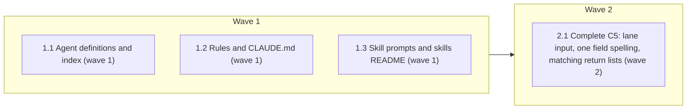

# Apply prompt-audit fixes

<!-- AT-A-GLANCE:BEGIN (generated — do not edit; refreshed by render_plan.py --summarize) -->
## At a glance

**4 tasks · 2 waves · 13 files · 4/4 done**

| Wave | Task | Title | Files | Done (acceptance) |
|---|---|---|---|---|
| 1 | 1.1 | Agent definitions and index (wave 1) | agents/PROJECT.md, agents/PROJECT.template.md, agents/test-runner.md | SC-1 through SC-6 return their expected exit codes. |
| 1 | 1.2 | Rules and CLAUDE.md (wave 1) | rules/behavior.md, rules/orchestration.md, rules/wave-parallelism.md, rules/auto-correct-scope.md, rules/plan-format.md, CLAUDE.md | SC-7, SC-9, SC-11, SC-12 and SC-17 return their expected exit codes. |
| 1 | 1.3 | Skill prompts and skills README (wave 1) | skills/subagent-driven-development/implementer-prompt.md, skills/intent-review/intent-reviewer-prompt.md, skills/README.md | SC-8, SC-10, SC-13, SC-14, SC-15 and SC-16 return their expected exit codes. |
| 2 | 2.1 | Complete C5: lane input, one field spelling, matching return lists (wave 2) | skills/subagent-driven-development/implementer-prompt.md, skills/subagent-driven-development/SKILL.md, rules/orchestration.md | SC-14 and SC-18 through SC-21 return their expected exit codes. |

### Progress
- [x] 1.1 — Agent definitions and index (wave 1)
- [x] 1.2 — Rules and CLAUDE.md (wave 1)
- [x] 1.3 — Skill prompts and skills README (wave 1)
- [x] 2.1 — Complete C5: lane input, one field spelling, matching return lists (wave 2)
<!-- AT-A-GLANCE:END -->

## 1. Motivation

The prompt audit (`specs/audit-prompt/research-brief.md`) found instruction text that is stale
against the repository (wrong pointers, missing pytest, a deploy rewrite that inverts a statement,
two subagent return contracts) and a few dated phrasings. Twelve findings came with exact
replacement text; this plan applies them.

## 2. Non-goals

- Findings marked `flag` in the audit: S1, S4–S9, C6, C12–C18.
- Any change to `scripts/`, `hooks/`, `settings.json` or `.claude/`.

## Global Constraints

- Apply only the replacement text given in `research-brief.md` for the in-scope findings; no other rewording.
- Edit source files only (`skills/`, `rules/`, `agents/`, `CLAUDE.md`); never `.claude/`.
- Keep every edited markdown table and fenced block structurally intact.

## 3. Success Criteria

| ID | Behavior (observable) | Check (re-runnable) | Expected |
| --- | --- | --- | --- |
| SC-1 | Agent index files no longer name xia2's SKILL.md as the signal location | `grep -rqF "skills/xia2/SKILL.md" agents/PROJECT.md agents/PROJECT.template.md` | exit 1 |
| SC-2 | The template no longer says xia2 carries signals inside its SKILL.md | `grep -qF "inside its own" agents/PROJECT.template.md` | exit 1 |
| SC-3 | PROJECT.md points code style at AGENTS.md | `grep -qF "Coding Style & Naming Conventions" agents/PROJECT.md` | exit 0 |
| SC-4 | PROJECT.md names the pytest targeted-run form | `grep -qF "python3 -m pytest" agents/PROJECT.md` | exit 0 |
| SC-5 | PROJECT.md names the PYTESTS list | `grep -qF "PYTESTS" agents/PROJECT.md` | exit 0 |
| SC-6 | test-runner description carries no worked examples | `grep -qF "example>" agents/test-runner.md` | exit 1 |
| SC-7 | No legacy XML field tags remain in the edited rule files or CLAUDE.md | `grep -rqF -e "<verify>" -e "<action>" -e "<files>" rules/orchestration.md rules/wave-parallelism.md rules/auto-correct-scope.md CLAUDE.md` | exit 1 |
| SC-8 | No legacy XML field tags remain in the implementer prompt | `grep -qF -e "<verify>" -e "<action>" -e "<files>" skills/subagent-driven-development/implementer-prompt.md` | exit 1 |
| SC-9 | Rule files invoke verify_summary with python3 | `grep -rqF "python scripts/" rules/auto-correct-scope.md rules/plan-format.md` | exit 1 |
| SC-10 | skills README invokes verify_summary with python3 | `grep -qF "python scripts/" skills/README.md` | exit 1 |
| SC-11 | behavior.md no longer pins a model name | `grep -qF "Opus 5.x" rules/behavior.md` | exit 1 |
| SC-12 | CLAUDE.md graph instruction is conditional on a connected server | `grep -qF "MCP server is connected" CLAUDE.md` | exit 0 |
| SC-13 | README check 1.8 no longer names the manifest file | `grep -qF "modes from the index" skills/README.md` | exit 1 |
| SC-14 | Implementer report format carries the Harness-Delta field | `grep -qF "**Harness-Delta:**" skills/subagent-driven-development/implementer-prompt.md` | exit 0 |
| SC-15 | Implementer prompt drops the trait claim | `grep -qF "You reason best" skills/subagent-driven-development/implementer-prompt.md` | exit 1 |
| SC-16 | Intent reviewer prompt drops the pressure phrase | `grep -qF "BY DEFAULT" skills/intent-review/intent-reviewer-prompt.md` | exit 1 |
| SC-17 | Documented paths and the hook table still resolve | `bash scripts/lint-doc-truth.sh` | exit 0 |
| SC-18 | The implementer prompt spells the field one way | `grep -qF "harness_delta" skills/subagent-driven-development/implementer-prompt.md` | exit 1 |
| SC-19 | The dispatch template carries the intake lane as an input | `grep -qF "Intake lane: [LANE]" skills/subagent-driven-development/implementer-prompt.md` | exit 0 |
| SC-20 | The SDD skill lists Harness-Delta in the implementer return | `grep -qF "Harness-Delta:" skills/subagent-driven-development/SKILL.md` | exit 0 |
| SC-21 | The subagent contract states the file-handoff split | `grep -qF "Under a file handoff" rules/orchestration.md` | exit 0 |

## 4. Tasks

### Task 1.1 — Agent definitions and index (wave 1)

- **Files:** agents/PROJECT.md, agents/PROJECT.template.md, agents/test-runner.md
- **Action:** Apply hunks H3 (C1), H5 (C3, C4) and H10 (C10) from `research-brief.md` exactly.
- **Verify:** `grep -qF "python3 -m pytest" agents/PROJECT.md`
- **Done:** SC-1 through SC-6 return their expected exit codes.
- **Criteria:** SC-1, SC-2, SC-3, SC-4, SC-5, SC-6
- **Interfaces:** Consumes `research-brief.md`; produces edited `agents/PROJECT.md`, `agents/PROJECT.template.md`, `agents/test-runner.md`.

### Task 1.2 — Rules and CLAUDE.md (wave 1)

- **Files:** rules/behavior.md, rules/orchestration.md, rules/wave-parallelism.md, rules/auto-correct-scope.md, rules/plan-format.md, CLAUDE.md
- **Action:** Apply H7 (C7) to the rule files, H8 (C8) to every listed `<verify>`/`<action>`/`<files>` occurrence, H9 (C9) and H11 (C11) from `research-brief.md`.
- **Verify:** `bash scripts/lint-doc-truth.sh`
- **Done:** SC-7, SC-9, SC-11, SC-12 and SC-17 return their expected exit codes.
- **Criteria:** SC-7, SC-9, SC-11, SC-12, SC-17
- **Interfaces:** Consumes `research-brief.md`; produces edited `rules/behavior.md`, `rules/orchestration.md`, `rules/wave-parallelism.md`, `rules/auto-correct-scope.md`, `rules/plan-format.md`, `CLAUDE.md`.

### Task 1.3 — Skill prompts and skills README (wave 1)

- **Files:** skills/subagent-driven-development/implementer-prompt.md, skills/intent-review/intent-reviewer-prompt.md, skills/README.md
- **Action:** Apply S2 (H1), S3 (H2), H4 (C2), H6 (C5), the README line of H7 (C7) and the implementer-prompt lines of H8 (C8) from `research-brief.md`.
- **Verify:** `grep -qF "**Harness-Delta:**" skills/subagent-driven-development/implementer-prompt.md`
- **Done:** SC-8, SC-10, SC-13, SC-14, SC-15 and SC-16 return their expected exit codes.
- **Criteria:** SC-8, SC-10, SC-13, SC-14, SC-15, SC-16
- **Interfaces:** Consumes `research-brief.md`; produces edited `skills/subagent-driven-development/implementer-prompt.md`, `skills/intent-review/intent-reviewer-prompt.md`, `skills/README.md`.

### Task 2.1 — Complete C5: lane input, one field spelling, matching return lists (wave 2)

- **Files:** skills/subagent-driven-development/implementer-prompt.md, skills/subagent-driven-development/SKILL.md, rules/orchestration.md
- **Action:** Add an `Intake lane: [LANE]` input to the dispatch Context and have the `lane` bullet echo it; rename the `harness_delta` bullet to `Harness-Delta`; make SKILL.md list the same return set and record Harness-Delta in SUMMARY; state the file-handoff split in the subagent contract.
- **Verify:** `grep -qF "Intake lane: [LANE]" skills/subagent-driven-development/implementer-prompt.md`
- **Done:** SC-14 and SC-18 through SC-21 return their expected exit codes.
- **Criteria:** SC-14, SC-18, SC-19, SC-20, SC-21
- **Interfaces:** Consumes the correctness-review advisories on the implementer prompt (lines 106, 117, 118); produces edited `skills/subagent-driven-development/implementer-prompt.md`, `skills/subagent-driven-development/SKILL.md`, `rules/orchestration.md`.

## 5. Risks

- Edits to rules, agents and dispatch prompts change what every isolated context reads; the
  context-propagation audit covers delivery.
- The Codex adapter or agent renderer may hash agent files; the full suite at finish catches drift.
- The `CLAUDE.md` graph section sits under a `<!-- code-review-graph MCP tools -->` marker; that tool's installer may regenerate the block and undo the C11 edit.

## 6. Status Log

- 2026-10-01 — plan written from the approved audit.
- 2026-10-01 — plan review: split SC-5/SC-6 per task, added SC-2 and SC-5 checks, added the installer risk.
- 2026-10-01 — tasks 1.1, 1.2, 1.3 complete; commits 585e5be, 2f09a8e, 05bc692; task reviews pass/approved (Minor only); follow-up 2b82ffc for two Minor findings.
- 2026-10-01 — shipped: context-propagation audit PASS, correctness review 0 blocking (9 advisory), intent review 0 blocking (4 recorded); PR into audit-prompt.
- 2026-10-01 — user asked to finish C5; added task 2.1 for the three C5 advisories (lane input, field spelling, return lists).
- 2026-10-01 — task 2.1 complete; commits 3f8da2a, e7efa3d; task review pass/approved; correctness round 2: 0 blocking (3 advisory); intent round 2: 0 blocking.
