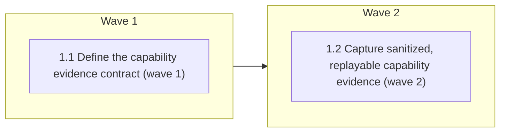

# Codex Support — Phase 1: Versioned capability baseline

<!-- AT-A-GLANCE:BEGIN (generated — do not edit; refreshed by render_plan.py --summarize) -->
## At a glance

**2 tasks · 2 waves · 15 files · 2/2 done**

| Wave | Task | Title | Files | Done (acceptance) |
|---|---|---|---|---|
| 1 | 1.1 | Define the capability evidence contract (wave 1) | specs/codex-support/capability-matrix.json, scripts/check_codex_capabilities.py, scripts/test_check_codex_capabilities.py, scripts/run-tests.sh, harness-manifest.json | the matrix is machine-readable and cannot silently turn absent/stale evidence in… |
| 2 | 1.2 | Capture sanitized, replayable capability evidence (wave 2) | scripts/capture_codex_capabilities.sh, tests/scripts/codex-capability-probe.test.sh, specs/codex-support/evidence/codex-0.147.0/doctor.json, specs/codex-support/evidence/codex-0.147.0/hooks-shell.json, specs/codex-support/evidence/codex-0.147.0/hooks-apply-patch.json, specs/codex-support/evidence/codex-0.147.0/agents-fresh-bounded.json, specs/codex-support/evidence/codex-0.147.0/agents-full-history-rejection.json, specs/codex-support/evidence/codex-0.147.0/session-end-timing.json, specs/codex-support/evidence/codex-0.147.0/platform.json, specs/codex-support/evidence/codex-0.147.0/trust-config.json, specs/codex-support/capability-matrix.json | all Phase-1 load-bearing claims point to sanitized fixtures or explicit unknowns… |

### Progress
- [x] 1.1 — Define the capability evidence contract (wave 1)
- [x] 1.2 — Capture sanitized, replayable capability evidence (wave 2)
<!-- AT-A-GLANCE:END -->

## 1. Motivation

The approved design establishes Codex as a future peer workflow runtime, but an alpha adapter must
not be built on session-only observations or field-for-field assumptions. Phase 1 creates the
evidence floor every later phase stands on: a versioned capability baseline whose claims are
machine-checked, whose unknowns are owned, and whose fixtures are reproducible.

Parent roadmap: `specs/codex-support/ROADMAP.md`. Design and research: `specs/codex-support/design.md`,
`specs/codex-support/research-brief.md`.

## 2. Non-goals

- Emitting or installing the production Codex alpha adapter from Phase 5.
- The packaging decision (Phase 2), source neutralisation (Phase 3), or the hook-input seam
  (Phase 4).
- Modifying the root `AGENTS.md`, creating a production `.codex/` tree, or claiming non-clobber
  integration is complete.
- Claiming native Windows support. The target baseline remains macOS, Linux, and WSL; unobserved
  platforms stay explicit.
- Running paid/networked Codex probes as blocking per-PR CI.

## Global Constraints

- Execute in an isolated worktree/branch based on current `simplify`; preserve all unrelated and
  untracked user files.
- Run `bash scripts/run-tests.sh` before the first `hooks/` or `scripts/` implementation edit and
  once after all tasks. Record full-suite evidence in the Status Log/SUMMARY prose, never as a
  sub-60-second Verify row.
- Treat official documentation as traceability, sanitized captured output as provenance, and live
  behavioral probes as truth. Every capability row states `observed`, `documented`, or `unknown`,
  with CLI version, platform, config hash, evidence path, and freshness; unknown never becomes pass.
- A fixture's `capture` label must come from the closed vocabulary in
  `scripts/check_codex_capabilities.py`. Only `transcribed-isolated-live-probe` may be hand-written,
  and it means exactly that: transcribed from an earlier observed run, not re-derived by the tool.
- Deterministic tests require no Codex authentication, network, or mutation of a developer's real
  Codex configuration. Live probes run only in a disposable OS account/runner and clean up the exact
  resources they create.
- Never log credentials, tokens, full transcripts, user home paths, repository absolute paths, or
  unrelated Codex configuration. Fixtures are schema-minimal and sanitized before commit.
- Keep Bash compatible with macOS Bash 3.2; prefer Python stdlib for structured parsing; all focused
  checks below are pipe-free and complete in under 60 seconds.

## 3. Success Criteria

| ID | Behavior (observable) | Check (re-runnable) | Expected |
| --- | --- | --- | --- |
| SC-1 | A versioned matrix rejects missing capability fields, stale evidence links, unsupported status values, unowned unknowns, and fixture capture labels outside the closed vocabulary | `python3 scripts/check_codex_capabilities.py specs/codex-support/capability-matrix.json` | exit 0 |
| SC-2 | Capability capture is reproducible with a fake CLI, sanitizes volatile/private fields, refuses to publish when a private path survives normalization, and never requires network or real user configuration in deterministic tests | `bash tests/scripts/codex-capability-probe.test.sh` | exit 0 |
| SC-3 | Shell, apply-patch, custom-agent, trust/config, platform, and SessionEnd claims each resolve to sanitized version-pinned evidence or explicit unknown | `python3 scripts/check_codex_capabilities.py specs/codex-support/capability-matrix.json --require-evidence` | exit 0 |
| SC-4 | The new capability surface is registered without manifest or contract drift | `python3 scripts/check_manifest.py` | exit 0 |

> SC ids are per-plan (`rules/plan-format.md`). The roadmap's original global numbering maps as
> SC-1→SC-1, SC-2→SC-2, SC-3→SC-3, and the Phase-1 half of the global SC-12→SC-4.

## 4. Tasks

### Task 1.1 — Define the capability evidence contract (wave 1)

- **Files:** specs/codex-support/capability-matrix.json, scripts/check_codex_capabilities.py, scripts/test_check_codex_capabilities.py, scripts/run-tests.sh, harness-manifest.json
- **Action:** Test-first, define a stdlib-only matrix schema keyed by runtime/CLI version and
  platform. Require each event/tool/packaging/agent capability to declare support target, evidence
  level (`observed`, `documented`, `unknown`), source/freshness, config hash, fixture path when
  observed, owner, and exit condition when unknown. Encode the design's exact shell, unified-exec,
  `apply_patch`, SessionStart/UserPromptSubmit/SessionEnd, custom-agent fork, trust/config, plugin,
  strict-config, and platform rows. Reject absolute/private paths, missing fixtures, status values
  that overclaim unknown coverage, observations whose CLI version does not match their evidence
  directory, and fixture `capture` labels outside the closed provenance vocabulary. Register the
  matrix/checker as a manifest contract with its probe and Phase-5 consumers, and register its unit
  suite in the CI-equivalent Python test list.
- **Verify:** `python3 -m pytest scripts/test_check_codex_capabilities.py -q && python3 scripts/check_codex_capabilities.py specs/codex-support/capability-matrix.json`
- **Done:** the matrix is machine-readable and cannot silently turn absent/stale evidence into
  support; every design claim has a row and every unknown has an owner plus closure condition.
- **Criteria:** SC-1, SC-4
- **Interfaces:** Consumes: approved `design.md`, official Codex contracts, CLI version vocabulary. Produces: `specs/codex-support/capability-matrix.json`, `scripts/check_codex_capabilities.py`, `harness-manifest.json`.

### Task 1.2 — Capture sanitized, replayable capability evidence (wave 2)

- **Files:** scripts/capture_codex_capabilities.sh, tests/scripts/codex-capability-probe.test.sh, specs/codex-support/evidence/codex-0.147.0/doctor.json, specs/codex-support/evidence/codex-0.147.0/hooks-shell.json, specs/codex-support/evidence/codex-0.147.0/hooks-apply-patch.json, specs/codex-support/evidence/codex-0.147.0/agents-fresh-bounded.json, specs/codex-support/evidence/codex-0.147.0/agents-full-history-rejection.json, specs/codex-support/evidence/codex-0.147.0/session-end-timing.json, specs/codex-support/evidence/codex-0.147.0/platform.json, specs/codex-support/evidence/codex-0.147.0/trust-config.json, specs/codex-support/capability-matrix.json
- **Action:** Build a capture command with explicit `--output`, `--codex-bin`, and
  `--allow-live-model-probe` boundaries. Default to non-model facts (`--version`, features,
  `--strict-config`, redacted doctor, platform/dependency checks) and use a temporary repository for
  hook/SessionEnd probes. Gate model-backed custom-agent observations behind the explicit flag.
  Normalize event records into schema-minimal fixtures, hash the effective hook config, strip all
  volatile/private fields, and refuse to overwrite evidence for a different version/platform.
  Treat a disabled or untrusted hooks feature as grounds to keep hook evidence `unknown` rather than
  promoting an event that arrives anyway. Capture effective project trust state and the trusted
  hook-configuration hash into `trust-config.json`; when a trust state cannot be reproduced
  deterministically, mark the corresponding matrix rows unknown with owner and exit condition
  instead of leaving them unevidenced by omission.
  Benchmark `state-breadcrumb.sh` for at least 20 isolated runs; record min/p95/max plus the
  documented SessionEnd timeout, and call it supported only when max stays below 80% of that budget.
  A checkout without the hook publishes an explicit unknown rather than aborting the capture.
  Create a fake-Codex contract test covering success, untrusted/disabled hooks, missing tools,
  sanitizer rejection, repeated time-budget measurement, paid-probe opt-in, cleanup, and explicit
  unknown fallback. Re-capture or transcribe the already observed 0.147.0 shell/apply-patch/fork
  results; where reproduction is unavailable, mark the matrix row unknown rather than fabricating a
  pass, and label any hand-written fixture `transcribed-isolated-live-probe` so provenance is not
  overclaimed.
- **Verify:** `bash tests/scripts/codex-capability-probe.test.sh && python3 scripts/check_codex_capabilities.py specs/codex-support/capability-matrix.json --require-evidence`
- **Done:** all Phase-1 load-bearing claims point to sanitized fixtures or explicit unknowns; the
  capture path is reproducible, bounded, opt-in for paid behavior, and safe for deterministic CI.
- **Criteria:** SC-2, SC-3
- **Interfaces:** Consumes: `scripts/check_codex_capabilities.py`, Codex CLI/documented payloads, temporary repositories. Produces: `scripts/capture_codex_capabilities.sh`, `specs/codex-support/evidence/codex-0.147.0/*.json`, updated `specs/codex-support/capability-matrix.json`.

## 5. Risks

- **Capability evidence becomes stale while still looking complete.** Mitigation: version/platform/
  config hashes, freshness rules, fixture existence checks, and explicit unknown states.
- **A hand-authored fixture masquerades as captured output.** Mitigation: the closed `capture`
  vocabulary, and a review habit of re-running the capture and diffing before trusting a fixture.
- **The matrix cannot tell whether a fixture substantiates its row.** Mitigation: named in the
  SUMMARY's negative scope; evidence links are reviewed by reading, not asserted by a gate.
- **Live probes mutate real Codex state or incur unplanned model cost.** Mitigation: disposable
  account/runner precondition, paid-probe flag, fake CLI tests, exact cleanup ledger, and no
  blocking live CI.
- **macOS/Linux shell behavior diverges.** Mitigation: keep structured parsing in Python stdlib,
  preserve Bash 3.2 compatibility, and run the full cross-platform CI suite before shipping.

## 6. Status Log

- 2026-08-10 — Tasks 1.1 and 1.2 complete; commits `872dc32`, `265eb53`. Added a version-pinned
  capability matrix and stdlib validator, sanitized Codex 0.147.0 evidence, an opt-in disposable
  live-probe path, a 20-run SessionEnd benchmark, and deterministic fake-CLI/privacy/downgrade
  tests. Registered the new Python suite in `scripts/run-tests.sh`.
- 2026-08-10 — Review of the committed diff against the plan found eight issues; the code and
  evidence half is closed in this branch. The four deterministic fixtures were re-derived from the
  installed Codex CLI 0.147.0, the `capture` vocabulary was closed, `tools.shell` was re-pointed at
  the fixture that actually observes it, and the two contract-test cases named in Task 1.2 but never
  written (untrusted/disabled hooks, sanitizer rejection) now exist. Full suite `ALL GREEN`, 480
  Python tests.
- 2026-08-10 — Split out of the single four-phase `specs/codex-support/` plan. The 14-SC contract
  made every mid-flight `specs/` commit fail the SC-coverage gate, so an honest Phase-1 record could
  not be landed until Phase 4 finished. Phases 2–4 are now sibling slugs.
