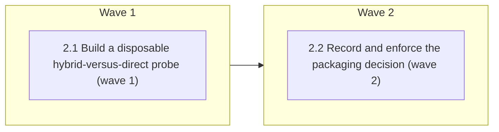

# Codex Support — Phase 2: Evidence-driven packaging decision

<!-- AT-A-GLANCE:BEGIN (generated — do not edit; refreshed by render_plan.py --summarize) -->
## At a glance

**2 tasks · 2 waves · 12 files · 2/2 done**

| Wave | Task | Title | Files | Done (acceptance) |
|---|---|---|---|---|
| 1 | 2.1 | Build a disposable hybrid-versus-direct probe (wave 1) | scripts/probe_codex_packaging.sh, tests/scripts/codex-packaging-probe.test.sh, tests/fixtures/codex-packaging/marketplace.json, tests/fixtures/codex-packaging/plugin.json, tests/fixtures/codex-packaging/agents.toml, specs/codex-support/capability-matrix.json | one safe command measures hybrid discovery/lifecycle, emits honest machine-reada… |
| 2 | 2.2 | Record and enforce the packaging decision (wave 2) | specs/codex-support/packaging-decision.md, specs/codex-support/evidence/codex-0.147.0/packaging-hybrid.json, specs/codex-support/evidence/codex-0.147.0/packaging-direct.json, scripts/check_codex_packaging.py, scripts/test_check_codex_packaging.py, scripts/run-tests.sh, specs/codex-support/capability-matrix.json | Phase 5 has one evidence-backed package boundary and a deterministic reason to s… |

### Progress
- [x] 2.1 — Build a disposable hybrid-versus-direct probe (wave 1)
- [x] 2.2 — Record and enforce the packaging decision (wave 2)
<!-- AT-A-GLANCE:END -->

## 1. Motivation

Phase 5 needs exactly one package boundary for the Codex adapter, chosen on executable evidence
rather than on the plugin documentation's recommendation. Phase 2 builds a disposable probe that
measures the hybrid lifecycle, records the direct candidate's current evidence boundary, and records
the decision with a deterministic fallback trigger and proof requirement.

Parent roadmap: `specs/codex-support/ROADMAP.md`. Depends on Phase 1's capability matrix.

## 2. Non-goals

- Emitting or installing the production Codex alpha adapter from Phase 5.
- Adding production `.codex-plugin/`, `.codex/`, or root instruction files.
- Cherry-picking the stale Claude-only `feature/plugin-namespace-packaging` branch.
- Running paid/networked Codex probes as blocking per-PR CI.

## Global Constraints

- Execute in an isolated worktree/branch; preserve all unrelated and untracked user files.
- Run `bash scripts/run-tests.sh` before the first `hooks/` or `scripts/` implementation edit and
  once after all tasks. Record full-suite evidence in the Status Log/SUMMARY prose, never as a
  sub-60-second Verify row.
- Deterministic tests require no Codex authentication, network, or mutation of a developer's real
  Codex configuration. Live plugin probes run only in a disposable OS account/runner and clean up
  the exact resources they create.
- Never log credentials, tokens, full transcripts, user home paths, repository absolute paths, or
  unrelated Codex configuration. Fixtures are schema-minimal and sanitized before commit.
- Root `AGENTS.md`, production `.codex/`, `settings.json`, and the Phase-5 installer surface are
  outside this plan and must remain byte-identical.
- Keep Bash compatible with macOS Bash 3.2; prefer Python stdlib for structured parsing; all focused
  checks below are pipe-free and complete in under 60 seconds.

## 3. Success Criteria

| ID | Behavior (observable) | Check (re-runnable) | Expected |
| --- | --- | --- | --- |
| SC-1 | The packaging probe exercises the hybrid discovery/lifecycle path, records direct as owned unknown until a real adapter probe exists, and never touches caller Codex state | `bash tests/scripts/codex-packaging-probe.test.sh` | exit 0 |
| SC-2 | One packaging decision names the selected path, executable evidence, fallback trigger, ownership boundary, and unresolved gaps | `python3 scripts/check_codex_packaging.py specs/codex-support/packaging-decision.md` | exit 0 |

> SC ids are per-plan (`rules/plan-format.md`). The roadmap's original global numbering maps as
> SC-4→SC-1 and SC-5→SC-2.

## 4. Tasks

### Task 2.1 — Build a disposable hybrid-versus-direct probe (wave 1)

- **Files:** scripts/probe_codex_packaging.sh, tests/scripts/codex-packaging-probe.test.sh, tests/fixtures/codex-packaging/marketplace.json, tests/fixtures/codex-packaging/plugin.json, tests/fixtures/codex-packaging/agents.toml, specs/codex-support/capability-matrix.json
- **Action:** Test-first, implement a probe that materializes two temporary candidates from current
  sources: hybrid (plugin-owned skills/hooks plus project-owned agents/instruction pointer) and
  direct project sync. Measure the hybrid candidate through the executable lifecycle; record direct
  as owned `unknown` until Phase 5 can observe project discovery and a real conflict installer.
  Exercise strict config parsing as a separate runtime-config check (Codex
  0.147.0 rejects `--strict-config` when it is forwarded to `codex plugin`); marketplace
  add/list/remove and local-source remove/re-add refresh (the `upgrade` subcommand is Git-only);
  plugin
  add/list/remove; installed-copy skill and hook visibility; project-owned agent discovery; no-op
  reinstall with cache fingerprint comparison; source update; removal; and cleanup. Keep lifecycle
  evidence separate from runtime-load evidence: CLI list/install output may prove distribution but
  must not by itself claim that a skill, hook, or agent executed. Deterministic tests use a fake
  Codex CLI and assert the exact CLI/config protocol. A real run is permitted only with both HOME
  and CODEX_HOME redirected to fresh temporary directories (or in an ephemeral runner), and must
  prove those roots differ from the caller's state before any mutation. Local sources only; no
  authentication, model call, or network. Do not add production `.codex-plugin/`, `.codex/`, or
  root instruction files.
- **Verify:** `bash tests/scripts/codex-packaging-probe.test.sh`
- **Done:** one safe command measures hybrid discovery/lifecycle, emits honest machine-readable
  results for both candidates (including failure/unknown states), and leaves neither project nor
  Codex user state behind.
- **Criteria:** SC-1
- **Interfaces:** Consumes: current skills and hooks trees, neutral package assumptions, Codex plugin CLI. Produces: `scripts/probe_codex_packaging.sh`, packaging fixture contracts, probe result schema used by Task 2.2.

### Task 2.2 — Record and enforce the packaging decision (wave 2)

- **Files:** specs/codex-support/packaging-decision.md, specs/codex-support/evidence/codex-0.147.0/packaging-hybrid.json, specs/codex-support/evidence/codex-0.147.0/packaging-direct.json, scripts/check_codex_packaging.py, scripts/test_check_codex_packaging.py, scripts/run-tests.sh, specs/codex-support/capability-matrix.json
- **Action:** Run the real probe in an approved disposable environment and save sanitized results
  for both candidates. Write the decision with selected path, plugin/project ownership, discovery
  evidence, reinstall/upgrade/conflict behavior, trust implications, unresolved gaps, exact fallback
  trigger plus direct proof requirement, and a statement that the stale `.claude-plugin` branch was
  inspected but not reused. Add
  a stdlib checker that rejects missing evidence, a decision unsupported by its result, an absent
  fallback criterion, or claims broader than the capability matrix. Select hybrid only if every
  required discovery/lifecycle case passes. A failed hybrid may select direct sync without changing
  semantic-core contracts only after direct has its own observed passing evidence; otherwise the
  decision blocks. If no approved disposable environment is available, do not run the probe
  against real Codex state and do not fabricate evidence: record a
  `specs/codex-support-phase-2/ESCALATIONS.md` block (`decision: pending`) for environment
  provisioning and leave the packaging decision unwritten — Phase 5 stays blocked rather than
  silently defaulting to either candidate. New packaging fixtures carry a `capture` label from the
  closed vocabulary established in Phase 1.
- **Verify:** `python3 -m pytest scripts/test_check_codex_packaging.py -q && python3 scripts/check_codex_packaging.py specs/codex-support/packaging-decision.md`
- **Done:** Phase 5 has one evidence-backed package boundary and a deterministic reason to switch to
  the fallback; the matrix and decision agree on every unresolved capability.
- **Criteria:** SC-2
- **Interfaces:** Consumes: Task 2.1 result schema and live probe output. Produces: `specs/codex-support/packaging-decision.md`, packaging evidence JSON, `scripts/check_codex_packaging.py`.

## 5. Risks

- **The packaging spike accidentally becomes an unsupported production adapter.** Mitigation: only
  temporary generated candidates and evidence are committed; production plugin/project files remain
  Phase 5.
- **Live probes mutate real Codex state or incur unplanned model cost.** Mitigation: disposable
  account/runner precondition, fake CLI tests, exact cleanup ledger, and no blocking live CI.
- **No approved disposable environment exists when the phase runs.** Mitigation: the explicit
  escalation path in Task 2.2 — Phase 5 blocks rather than defaulting to a candidate.

## 6. Status Log

- 2026-08-10 — Split out of the single four-phase `specs/codex-support/` plan; not started.
- 2026-08-10 — Activated after the Phase-1 review/fix commit `be9bc21` passed its focused checks
  and the 480-test CI-equivalent suite. Refined Task 2.1 against the current official plugin
  packaging contract and Codex CLI 0.147.0: CLI lifecycle evidence is not runtime execution
  evidence, and a live local-source probe must isolate both HOME and CODEX_HOME.
- 2026-08-10 — First real isolated run found that `codex --strict-config plugin ...` is rejected
  even though the top-level flag appears in help. Strict configuration is therefore probed
  separately; plugin lifecycle commands use their supported command surface.
- 2026-08-10 — The same run found CLI 0.147.0 caches a local plugin under its manifest version
  (`0.0.1`), while the current builder documentation describes the local cache segment as
  `local`. The probe discovers and records the single installed version directory instead of
  hard-coding either representation.
- 2026-08-10 — A local marketplace cannot use `marketplace upgrade`; CLI 0.147.0 correctly limits
  that command to Git marketplaces. Because this phase forbids networked probes, local source
  refresh is tested through remove/re-add and reinstall, while Git upgrade remains outside the
  executable evidence boundary.
- 2026-08-10 — Tasks 2.1 and 2.2 complete locally. The isolated real CLI probe selected hybrid,
  recorded direct sync as the deterministic fallback, and kept runtime invocation/hook trust as an
  explicit Phase-5 boundary rather than promoting installed-copy inspection into execution proof.
- 2026-08-10 — Claude Code review F1–F8 resolved before continuing. Direct evidence is now an owned
  `unknown`; failed hybrid evidence is publishable and fallback selection is unit-tested; strict
  parsing and reinstall idempotence are measured rather than inferred; packaging remains advisory;
  sanitizer and fresh-root checks share the Phase-1 safety boundary; the interpreter-dependent
  pytest Verify row was removed while its 11-case suite remains in `run-tests.sh`.
- 2026-08-11 — Shipped at `ba10cf9` (PR from `plan/codex-support-phases-1-4`). All 8 review findings closed pre-commit; receipt pinned.
