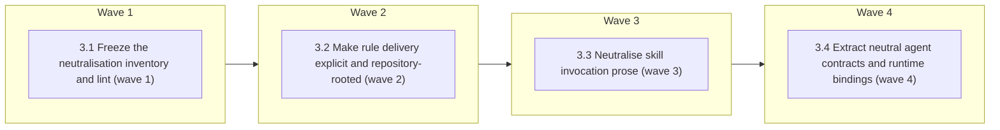

# Codex Support — Phase 3: Semantic source neutralisation

<!-- AT-A-GLANCE:BEGIN (generated — do not edit; refreshed by render_plan.py --summarize) -->
## At a glance

**4 tasks · 4 waves · 62 files · 0/4 done**

| Wave | Task | Title | Files | Done (acceptance) |
|---|---|---|---|---|
| 1 | 3.1 | Freeze the neutralisation inventory and lint (wave 1) | specs/codex-support/neutralization-inventory.json, scripts/check_runtime_neutral_sources.py, scripts/test_check_runtime_neutral_sources.py, harness-manifest.json | the current coupling set is finite and machine-checked; later tasks cannot hide … |
| 2 | 3.2 | Make rule delivery explicit and repository-rooted (wave 2) | agents/PROJECT.md, skills/README.md, skills/compound/README.md, skills/correctness-review/SKILL.md, skills/correctness-review/prompts/shared.md, skills/intent-review/SKILL.md, skills/subagent-driven-development/SKILL.md, skills/subagent-driven-development/implementer-prompt.md, skills/writing-plans/SKILL.md, skills/writing-plans/plan-document-reviewer-prompt.md, skills/xia2/references/research-brief-template.md, scripts/render_skill_prompt.py, scripts/test_render_skill_prompt.py, tests/scripts/context-propagation-regression.test.sh, tests/scripts/writing-plans-contract.test.sh, specs/codex-support/neutralization-inventory.json | all contextual rules use portable source addresses and every isolated context ha… |
| 3 | 3.3 | Neutralise skill invocation prose (wave 3) | agents/PROJECT.md, agents/PROJECT.template.md, agents/README.md, rules/auto-correct-scope.md, rules/orchestration.md, rules/wave-parallelism.md, skills/README.md, skills/brainstorming/SKILL.md, skills/compound/README.md, skills/compound/subagents/context-analyzer-prompt.md, skills/compound/subagents/decision-extractor-prompt.md, skills/compound/subagents/related-docs-finder-prompt.md, skills/compound/subagents/solution-extractor-prompt.md, skills/compound/templates/index.md, skills/correctness-review/SKILL.md, skills/correctness-review/correctness-reviewer-prompt.md, skills/feature-intake/SKILL.md, skills/feature-intake/tests/README.md, skills/intent-review/intent-reviewer-prompt.md, skills/subagent-driven-development/SKILL.md, skills/subagent-driven-development/references/review-chain.md, skills/using-git-worktrees/SKILL.md, skills/visual-planner/SKILL.md, skills/visual-planner/render_plan.py, skills/visual-planner/test_render_plan.py, skills/visual-planner/view_plan.py, skills/xia2/README.md, skills/xia2/tests/structural/depth-modes-test-cases.md, templates/SUMMARY.template.md, templates/structure/docs-solutions-critical-patterns.md, templates/structure/docs-solutions-INDEX.md, templates/structure/docs-solutions-README.md, templates/structure/specs-README.md, specs/codex-support/neutralization-inventory.json | shared instructions can be consumed by either runtime without deploy-time prose … |
| 4 | 3.4 | Extract neutral agent contracts and runtime bindings (wave 4) | agents/agent-contracts.json, agents/runtime-bindings.json, agents/coding.md, agents/reviewer.md, agents/task-reviewer.md, agents/test-runner.md, scripts/render_agent_definitions.py, scripts/test_render_agent_definitions.py, scripts/deploy-harness.sh, tests/scripts/deploy-prune.test.sh, tests/scripts/resync-conflict.test.sh, tests/scripts/settings-wiring.test.sh, tests/scripts/install-harness.test.sh, scripts/check_manifest.py, scripts/test_check_manifest.py, harness-manifest.json | semantic agent sources contain no Claude policy fields; both runtime bindings ar… |

### Progress
- [ ] 3.1 — Freeze the neutralisation inventory and lint (wave 1)
- [ ] 3.2 — Make rule delivery explicit and repository-rooted (wave 2)
- [ ] 3.3 — Neutralise skill invocation prose (wave 3)
- [ ] 3.4 — Extract neutral agent contracts and runtime bindings (wave 4)
<!-- AT-A-GLANCE:END -->

## 1. Motivation

Shared instruction sources currently address rules by their Claude-deployed path (`.claude/rules/…`)
and invoke skills with Claude slash syntax, and agent role documents carry Claude model/tool policy
inline. A second runtime cannot consume any of that without a deploy-time prose rewrite, which is
how policy drifts. Phase 3 makes the shared corpus runtime-neutral and moves vendor policy into
explicit bindings — with an inventory-first lint so no coupling is closed silently.

Parent roadmap: `specs/codex-support/ROADMAP.md`.

## 2. Non-goals

- Forking workflow policy, skills, rules, or hook bodies per runtime.
- Emitting Phase-5 Codex TOML or installing anything.
- Neutralising hook/script user-facing message prose (e.g. the `/compound` hint printed by
  `hooks/commit-quality-gate.sh`): Task 3.1 classifies these as owned runtime-entry exceptions
  deferred to Phase 5 rather than rewriting high-blast hook bodies in a bulk prose wave.
- Modifying the root `AGENTS.md` or creating a production `.codex/` tree.

## Global Constraints

- Execute in an isolated worktree/branch; preserve all unrelated and untracked user files.
- Run `bash scripts/run-tests.sh` before the first `hooks/` or `scripts/` implementation edit and
  once after all tasks. Record full-suite evidence in the Status Log/SUMMARY prose, never as a
  sub-60-second Verify row.
- Preserve Claude's installed behavior and conflict/prune guarantees. This phase may refactor
  sources and Claude generation, but the derived Claude agent definitions must retain the intended
  model, tools, descriptions, and role bodies except for approved invocation/path neutralisation.
- Shared sources use repository-root rule paths and invocation-neutral skill names. Runtime-specific
  syntax belongs only in runtime entry/binding artifacts.
- Root `AGENTS.md`, production `.codex/`, `settings.json`, and the Phase-5 installer surface are
  outside this plan and must remain byte-identical.
- Workflow-engine changes require a context-propagation audit during implementation, followed by the
  normal correctness and intent review chain before shipping.
- Keep Bash compatible with macOS Bash 3.2; prefer Python stdlib for structured parsing; all focused
  checks below are pipe-free and complete in under 60 seconds.

## 3. Success Criteria

| ID | Behavior (observable) | Check (re-runnable) | Expected |
| --- | --- | --- | --- |
| SC-1 | Shared runtime sources contain no forbidden `.claude/rules/...` address or runtime-specific skill invocation outside declared entry/binding exceptions | `python3 scripts/check_runtime_neutral_sources.py --root .` | exit 0 |
| SC-2 | Every load-bearing contextual rule reaches main, implementer, reviewer, scorer, and resume contexts through an explicit read or a checked equivalent | `bash tests/scripts/context-propagation-regression.test.sh` | exit 0 |
| SC-3 | Neutral agent contracts map every capability for Claude and Codex, reject unmapped policy, and reproduce valid Claude agent definitions | `python3 -m pytest scripts/test_render_agent_definitions.py -q` | exit 0 |
| SC-4 | New neutral-source and agent-binding surfaces are registered without manifest or contract drift | `python3 scripts/check_manifest.py` | exit 0 |

> SC ids are per-plan (`rules/plan-format.md`). The roadmap's original global numbering maps as
> SC-6→SC-1, SC-7→SC-2, SC-8→SC-3, and the Phase-3 half of the global SC-12→SC-4.

## 4. Tasks

### Task 3.1 — Freeze the neutralisation inventory and lint (wave 1)

- **Files:** specs/codex-support/neutralization-inventory.json, scripts/check_runtime_neutral_sources.py, scripts/test_check_runtime_neutral_sources.py, harness-manifest.json
- **Action:** Test-first, inventory every shared instruction file containing `.claude/rules/...`,
  Claude `/skill-name` invocation syntax, Claude model/tool frontmatter, or runtime-bound entry
  language. Classify each finding as shared-source violation, runtime entry/binding exception, test
  fixture, or false positive with rationale. Implement a stdlib lint that scans only declared
  runtime source surfaces, rejects new unowned exceptions and stale inventory entries, understands
  escaped/code-example cases, and reports exact file/line/search category. Scan `templates/` as part
  of the shared-source surface — templates instantiate into consumer repositories and carry
  invocation prose. Classify hook and script user-facing message prose
  (`hooks/commit-quality-gate.sh`, `hooks/risk-corroboration.sh`, `hooks/scope-gate.sh`,
  `scripts/check_review_receipt.py`, `scripts/rebuild_solution_index.py`,
  `scripts/score_intake_eval.py`, and the tests asserting those messages) as owned runtime-entry
  exceptions deferred to Phase 5 — recorded decisions, never silent omissions. Register the neutral
  source contract and checker consumers in the manifest.
- **Verify:** `python3 -m pytest scripts/test_check_runtime_neutral_sources.py -q && python3 scripts/check_runtime_neutral_sources.py --root .`
- **Done:** the current coupling set is finite and machine-checked; later tasks cannot hide an
  unconverted runtime dependency by changing prose or adding an allowlist silently.
- **Criteria:** SC-1, SC-4
- **Interfaces:** Consumes: current skills, agents, and rules corpus plus the approved source/entry boundary. Produces: `specs/codex-support/neutralization-inventory.json`, `scripts/check_runtime_neutral_sources.py`, manifest contract entry.

### Task 3.2 — Make rule delivery explicit and repository-rooted (wave 2)

- **Files:** agents/PROJECT.md, skills/README.md, skills/compound/README.md, skills/correctness-review/SKILL.md, skills/correctness-review/prompts/shared.md, skills/intent-review/SKILL.md, skills/subagent-driven-development/SKILL.md, skills/subagent-driven-development/implementer-prompt.md, skills/writing-plans/SKILL.md, skills/writing-plans/plan-document-reviewer-prompt.md, skills/xia2/references/research-brief-template.md, scripts/render_skill_prompt.py, scripts/test_render_skill_prompt.py, tests/scripts/context-propagation-regression.test.sh, tests/scripts/writing-plans-contract.test.sh, specs/codex-support/neutralization-inventory.json
- **Action:** Replace shared-source `.claude/rules/...` addresses with canonical repository-root
  `rules/...` paths. For `plan-format`, `wave-parallelism`, and `auto-correct-scope`, enumerate every
  load-bearing main/implementer/task-reviewer/correctness-reviewer/scorer/resume consumer and add an
  explicit read or checked composition point before the instruction is used. Extend the existing
  render/context tests from their two historical anchors to the complete consumer matrix, including
  mutation cases that remove one delivery edge. Update
  `tests/scripts/writing-plans-contract.test.sh`, which asserts the literal
  `.claude/rules/plan-format.md` read in `skills/writing-plans/SKILL.md`, to expect the
  repository-root path. Keep `paths:` auto-loading as a Claude accelerator,
  not the only guarantee; do not inline another copy of Rule 4.
- **Verify:** `bash tests/scripts/context-propagation-regression.test.sh && python3 scripts/check_runtime_neutral_sources.py --root .`
- **Done:** all contextual rules use portable source addresses and every isolated context has
  executable delivery proof; the neutral-source lint reports no rule-path violation.
- **Criteria:** SC-1, SC-2
- **Interfaces:** Consumes: authoritative `rules/*.md`, Task 3.1 inventory, existing prompt composition. Produces: portable rule references, expanded `tests/scripts/context-propagation-regression.test.sh`, updated inventory evidence.

### Task 3.3 — Neutralise skill invocation prose (wave 3)

- **Files:** agents/PROJECT.md, agents/PROJECT.template.md, agents/README.md, rules/auto-correct-scope.md, rules/orchestration.md, rules/wave-parallelism.md, skills/README.md, skills/brainstorming/SKILL.md, skills/compound/README.md, skills/compound/subagents/context-analyzer-prompt.md, skills/compound/subagents/decision-extractor-prompt.md, skills/compound/subagents/related-docs-finder-prompt.md, skills/compound/subagents/solution-extractor-prompt.md, skills/compound/templates/index.md, skills/correctness-review/SKILL.md, skills/correctness-review/correctness-reviewer-prompt.md, skills/feature-intake/SKILL.md, skills/feature-intake/tests/README.md, skills/intent-review/intent-reviewer-prompt.md, skills/subagent-driven-development/SKILL.md, skills/subagent-driven-development/references/review-chain.md, skills/using-git-worktrees/SKILL.md, skills/visual-planner/SKILL.md, skills/visual-planner/render_plan.py, skills/visual-planner/test_render_plan.py, skills/visual-planner/view_plan.py, skills/xia2/README.md, skills/xia2/tests/structural/depth-modes-test-cases.md, templates/SUMMARY.template.md, templates/structure/docs-solutions-critical-patterns.md, templates/structure/docs-solutions-INDEX.md, templates/structure/docs-solutions-README.md, templates/structure/specs-README.md, specs/codex-support/neutralization-inventory.json
- **Action:** Replace executable/shared `/skill-name` phrasing with invocation-neutral language such
  as “invoke the named skill,” while preserving literal repository paths, URLs, code operators,
  historical evidence, and explicitly runtime-bound entry examples. Neutralise the invocation prose
  in `templates/` the same way — `SUMMARY.template.md` and the `templates/structure/` docs
  instantiate into consumer repositories and must not teach Claude-only slash syntax. Leave
  hook/script user-facing message prose to its Phase-5 owned exception per Task 3.1. Update
  behavior/structural tests
  to assert semantic handoff names or generated runtime entry text rather than Claude slash syntax.
  Review every mechanical edit in context; do not rewrite policy, routing order, or review gates.
  Re-run the inventory lint and remove an exception only when the source is genuinely neutral.
- **Verify:** `python3 scripts/check_runtime_neutral_sources.py --root .`
- **Done:** shared instructions can be consumed by either runtime without deploy-time prose rewrite;
  all workflow handoffs retain their original semantics and the inventory has no stale exception.
- **Criteria:** SC-1
- **Interfaces:** Consumes: Task 3.1 inventory and current skill handoff graph. Produces: invocation-neutral shared instruction corpus and updated `specs/codex-support/neutralization-inventory.json`.

### Task 3.4 — Extract neutral agent contracts and runtime bindings (wave 4)

- **Files:** agents/agent-contracts.json, agents/runtime-bindings.json, agents/coding.md, agents/reviewer.md, agents/task-reviewer.md, agents/test-runner.md, scripts/render_agent_definitions.py, scripts/test_render_agent_definitions.py, scripts/deploy-harness.sh, tests/scripts/deploy-prune.test.sh, tests/scripts/resync-conflict.test.sh, tests/scripts/settings-wiring.test.sh, tests/scripts/install-harness.test.sh, scripts/check_manifest.py, scripts/test_check_manifest.py, harness-manifest.json
- **Action:** Test-first, move vendor model/tool fields out of semantic role documents into explicit
  bindings. Define neutral capabilities for filesystem, shell/network, MCP, nested delegation,
  context policy, model class, and output contract; require every role/runtime/capability to map or
  declare an owned unsupported exception. Add deterministic rendering for Claude agent definitions
  and validate the Codex binding shape without emitting Phase-5 TOML. Change Claude deployment to
  render agents rather than copy vendor frontmatter, preserving protected-file conflict, prune,
  dry-run, idempotency, and consumer-custom-agent behavior. Add reviewer assertions for read-only
  filesystem, no nested delegation, controlled MCP, and fresh/bounded context. Compare generated
  Claude semantics against the pre-refactor roles so model/tool isolation cannot weaken unnoticed.
- **Verify:** `python3 -m pytest scripts/test_render_agent_definitions.py -q && python3 scripts/check_manifest.py`
- **Done:** semantic agent sources contain no Claude policy fields; both runtime bindings are total
  or explicitly excepted; deployed Claude agents remain valid and behaviorally equivalent.
- **Criteria:** SC-3, SC-4
- **Interfaces:** Consumes: neutral role bodies and Task 3.1 inventory. Produces: `agents/agent-contracts.json`, `agents/runtime-bindings.json`, `scripts/render_agent_definitions.py`, derived Claude agent definitions through `scripts/deploy-harness.sh`.

## 5. Risks

- **Bulk prose neutralisation changes policy meaning.** Mitigation: inventory-first changes,
  context review per match, handoff/structural regressions, and mandatory context-propagation audit.
- **Agent extraction weakens Claude reviewer isolation.** Mitigation: total capability mapping,
  semantic/golden comparison, explicit read-only/no-nesting assertions, and deploy conflict tests.
- **The lint's exception list becomes a dumping ground.** Mitigation: every exception carries an
  owner and a Phase-5 closure condition; stale entries fail the lint.

## 6. Status Log

- 2026-08-10 — Split out of the single four-phase `specs/codex-support/` plan; not started.
