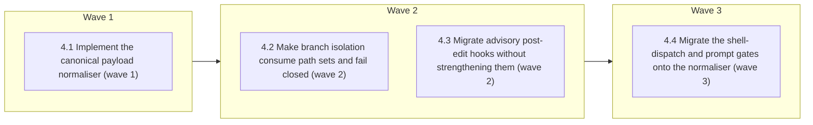

# Codex Support — Phase 4: Runtime-neutral hook input seam

<!-- AT-A-GLANCE:BEGIN (generated — do not edit; refreshed by render_plan.py --summarize) -->
## At a glance

**4 tasks · 3 waves · 29 files · 4/4 done**

| Wave | Task | Title | Files | Done (acceptance) |
|---|---|---|---|---|
| 1 | 4.1 | Implement the canonical payload normaliser (wave 1) | hooks/lib/normalize-tool-input.py, tests/lib.sh, tests/hooks/normalize-tool-input.test.sh, tests/fixtures/hook-input/claude-shell.json, tests/fixtures/hook-input/claude-write.json, tests/fixtures/hook-input/codex-shell.json, tests/fixtures/hook-input/codex-unified-exec.json, tests/fixtures/hook-input/codex-apply-patch-single.json, tests/fixtures/hook-input/codex-apply-patch-multi.json, tests/fixtures/hook-input/codex-apply-patch-move-delete.json, tests/fixtures/hook-input/claude-user-prompt.json, tests/fixtures/hook-input/codex-user-prompt.json, tests/fixtures/hook-input/malformed.json, specs/codex-support/capability-matrix.json, harness-manifest.json | every supported raw payload has one canonical representation; multi-file edits r… |
| 2 | 4.2 | Make branch isolation consume path sets and fail closed (wave 2) | hooks/branch-isolation-guard.sh, tests/hooks/branch-isolation-guard.test.sh | the hard gate cannot silently allow a supported Codex edit because a path is mis… |
| 2 | 4.3 | Migrate advisory post-edit hooks without strengthening them (wave 2) | hooks/blast-radius-check.sh, hooks/ruff-on-edit.sh, hooks/render-plan-on-write.sh, tests/hooks/blast-radius-check.test.sh, tests/hooks/ruff-on-edit.test.sh, tests/hooks/render-plan-on-write.test.sh, tests/hooks/codex-edit-hooks.test.sh, CLAUDE.md | all four edit hooks share one payload truth; advisory hooks cover every known pa… |
| 3 | 4.4 | Migrate the shell-dispatch and prompt gates onto the normaliser (wave 3) | hooks/pre-bash-dispatch.sh, hooks/scope-gate.sh, tests/hooks/pre-bash-dispatch.test.sh, tests/hooks/scope-gate.test.sh, CLAUDE.md, harness-manifest.json | no supported Codex shell path can bypass the git gates through an unparsed paylo… |

### Progress
- [x] 4.1 — Implement the canonical payload normaliser (wave 1)
- [x] 4.2 — Make branch isolation consume path sets and fail closed (wave 2)
- [x] 4.3 — Migrate advisory post-edit hooks without strengthening them (wave 2)
- [x] 4.4 — Migrate the shell-dispatch and prompt gates onto the normaliser (wave 3)
<!-- AT-A-GLANCE:END -->

## 1. Motivation

Every hook today parses the raw Claude payload directly — `.tool_input.file_path` for edits,
`.tool_input.command` for Bash, `.prompt` for prompts — and falls back to an empty string when the
field is absent. Codex reports `apply_patch` with the patch program in `tool_input.command`, not a
single path, so the normaliser must extract a deduplicated path set from that command. The empty
fallback is a silent fail-open: an unparsed payload exits 0 past a hard gate. Phase 4 replaces the
per-hook parsing with one tested normaliser whose unknown policy is explicit per gate.

Parent roadmap: `specs/codex-support/ROADMAP.md`. Depends on Phase 1's payload evidence.

## 2. Non-goals

- Emitting or installing the production Codex alpha adapter from Phase 5.
- Changing `settings.json`, moving `state-breadcrumb.sh`, or altering the git sub-hooks themselves —
  they keep receiving the raw payload relay unchanged.
- Strengthening any advisory hook into a blocking one.
- Adding runtime mode recording, the harness-specific doctor overlay, or per-PR Codex parity gates.

## Global Constraints

- Execute in an isolated worktree/branch; preserve all unrelated and untracked user files.
- Run `bash scripts/run-tests.sh` before the first `hooks/` or `scripts/` implementation edit and
  once after all tasks. Record full-suite evidence in the Status Log/SUMMARY prose, never as a
  sub-60-second Verify row.
- The hook normaliser returns every touched path plus `known`, `partial`, or `unknown`. It rejects
  traversal/out-of-repository paths, never invents a missing path, and keeps per-gate unknown policy
  explicit: branch isolation blocks; advisory post-edit hooks warn and remain non-blocking; the
  shell-dispatch gate fails closed on an unclassifiable command payload, and the prompt-scope hook
  warns and stays non-blocking — never silent success on partial/unknown input.
- Preserve Claude's installed behavior. Every pre-existing Claude case must still pass unchanged.
- Keep Bash compatible with macOS Bash 3.2; prefer Python stdlib for structured parsing; all focused
  checks below are pipe-free and complete in under 60 seconds.
- Workflow-engine changes require a context-propagation audit during implementation, followed by the
  normal correctness and intent review chain before shipping.

## 3. Success Criteria

| ID | Behavior (observable) | Check (re-runnable) | Expected |
| --- | --- | --- | --- |
| SC-1 | One normaliser correctly classifies Claude/Codex shell and edit payloads, extracts multi-file add/update/delete/move path sets, and reports malformed/partial/unknown input | `bash tests/hooks/normalize-tool-input.test.sh` | exit 0 |
| SC-2 | Branch isolation evaluates every normalized path and blocks shared-branch edits when any path or required parse state is unsafe | `bash tests/hooks/branch-isolation-guard.test.sh` | exit 0 |
| SC-3 | Ruff, blast-radius, and plan-render hooks process all applicable normalized paths and surface partial/unknown input without becoming blocking | `bash tests/hooks/codex-edit-hooks.test.sh` | exit 0 |
| SC-4 | The Bash dispatch gate evaluates normalized shell payloads from both runtimes and fails closed instead of silently passing an unclassifiable command through the git gates | `bash tests/hooks/pre-bash-dispatch.test.sh` | exit 0 |
| SC-5 | The prompt-scope hook consumes normalized prompt payloads from both runtimes and surfaces partial/unknown input without becoming blocking | `bash tests/hooks/scope-gate.test.sh` | exit 0 |
| SC-6 | New hook-normalisation surfaces and consumers are registered without manifest or contract drift | `python3 scripts/check_manifest.py` | exit 0 |

> SC ids are per-plan (`rules/plan-format.md`). The roadmap's original global numbering maps as
> SC-9→SC-1, SC-10→SC-2, SC-11→SC-3, SC-13→SC-4, SC-14→SC-5, and the Phase-4 half of the global
> SC-12→SC-6.

## 4. Tasks

### Task 4.1 — Implement the canonical payload normaliser (wave 1)

- **Files:** hooks/lib/normalize-tool-input.py, tests/lib.sh, tests/hooks/normalize-tool-input.test.sh, tests/fixtures/hook-input/claude-shell.json, tests/fixtures/hook-input/claude-write.json, tests/fixtures/hook-input/codex-shell.json, tests/fixtures/hook-input/codex-unified-exec.json, tests/fixtures/hook-input/codex-apply-patch-single.json, tests/fixtures/hook-input/codex-apply-patch-multi.json, tests/fixtures/hook-input/codex-apply-patch-move-delete.json, tests/fixtures/hook-input/claude-user-prompt.json, tests/fixtures/hook-input/codex-user-prompt.json, tests/fixtures/hook-input/malformed.json, specs/codex-support/capability-matrix.json, harness-manifest.json
- **Action:** Test-first, add one stdlib executable that reads raw hook JSON once and emits a stable
  normalized JSON object containing runtime/event identity, canonical tool class, deduplicated path
  set, command/prompt/outcome fields, and `known`, `partial`, or `unknown`. Support the observed
  Claude file-path/response fields and the documented Codex shell/unified-exec/`apply_patch`
  `tool_input.command` envelopes.
  Parse add/update/delete/move headers, retain all safe repo-relative paths, identify unparsed edit
  fragments as partial, and classify malformed/missing inputs unknown. Reject traversal, NUL, and
  outside-root paths without collapsing valid siblings. Build fixtures from the Phase-1 observed
  shell/`apply_patch` evidence and the official Codex hook schema for unified exec and
  `UserPromptSubmit`. Preserve evidence levels honestly: documented contract fixtures do not become
  `observed` without an explicitly authorised live model probe. Build table-driven golden/mutation
  tests and register the seam/consumers in the manifest.
- **Verify:** `bash tests/hooks/normalize-tool-input.test.sh && python3 scripts/check_manifest.py`
- **Done:** every supported raw payload has one canonical representation; multi-file edits remain
  set-valued; malformed/unsafe data is visible and never becomes an empty successful edit.
- **Criteria:** SC-1, SC-6
- **Interfaces:** Consumes: Phase-1 payload evidence and repository root. Produces: `hooks/lib/normalize-tool-input.py`, normalized JSON contract, golden hook fixtures.

### Task 4.2 — Make branch isolation consume path sets and fail closed (wave 2)

- **Files:** hooks/branch-isolation-guard.sh, tests/hooks/branch-isolation-guard.test.sh
- **Action:** Replace direct `.tool_input.file_path` parsing with Task 4.1 output. Evaluate every
  normalized path: allow only when all are bookkeeping or the repository is on a non-shared branch;
  deny a mixed bookkeeping/code patch on a shared branch; deny partial/unknown edit payloads on a
  shared branch with an actionable reason; preserve detached/non-repo behavior and audited
  break-glass semantics. Add Claude single-file and Codex multi-file/move/delete/path-traversal tests,
  including mutation cases proving one unsafe sibling cannot be hidden by a safe first path.
- **Verify:** `bash tests/hooks/branch-isolation-guard.test.sh`
- **Done:** the hard gate cannot silently allow a supported Codex edit because a path is missing,
  reordered, or accompanied by a bookkeeping path; all pre-existing Claude cases still pass.
- **Criteria:** SC-2
- **Interfaces:** Consumes: normalized path-set/status contract from `hooks/lib/normalize-tool-input.py`. Produces: multi-path fail-closed `hooks/branch-isolation-guard.sh` and its regression suite.

### Task 4.3 — Migrate advisory post-edit hooks without strengthening them (wave 2)

- **Files:** hooks/blast-radius-check.sh, hooks/ruff-on-edit.sh, hooks/render-plan-on-write.sh, tests/hooks/blast-radius-check.test.sh, tests/hooks/ruff-on-edit.test.sh, tests/hooks/render-plan-on-write.test.sh, tests/hooks/codex-edit-hooks.test.sh, CLAUDE.md
- **Action:** Replace direct payload parsing in all three hooks with Task 4.1 output and iterate every
  applicable path. Ruff processes each existing `.py`; blast-radius reports every out-of-plan path
  without duplicate messages; plan rendering handles each affected `specs/*/PLAN.md` once. Preserve
  their non-blocking contract: partial/unknown input emits one bounded warning/additional-context
  signal and exits 0, while explicit blast-radius strict mode may still exit 2 for known
  out-of-scope paths. Add a cross-hook Codex integration suite for multi-file, mixed-type,
  move/delete, malformed, and no-applicable-path cases. Update the hook table to describe path-set
  behavior and negative scope; do not change `settings.json` or move `state-breadcrumb.sh`.
- **Verify:** `bash tests/hooks/codex-edit-hooks.test.sh && bash tests/hooks/blast-radius-check.test.sh && bash tests/hooks/ruff-on-edit.test.sh && bash tests/hooks/render-plan-on-write.test.sh`
- **Done:** all four edit hooks share one payload truth; advisory hooks cover every known path,
  expose uncertainty, remain non-blocking by default, and retain existing Claude behavior.
- **Criteria:** SC-3
- **Interfaces:** Consumes: normalized path-set/status contract from `hooks/lib/normalize-tool-input.py`. Produces: multi-path post-edit hooks, `tests/hooks/codex-edit-hooks.test.sh`, updated `CLAUDE.md` contract table.

### Task 4.4 — Migrate the shell-dispatch and prompt gates onto the normaliser (wave 3)

- **Files:** hooks/pre-bash-dispatch.sh, hooks/scope-gate.sh, tests/hooks/pre-bash-dispatch.test.sh, tests/hooks/scope-gate.test.sh, CLAUDE.md, harness-manifest.json
- **Action:** Replace the direct `jq -r '.tool_input.command // ""'` read in
  `hooks/pre-bash-dispatch.sh` and the `.prompt // ""` read in `hooks/scope-gate.sh` with Task 4.1
  normalised output, closing the same empty-fallback fail-open the design names for edit hooks
  (design §3.1): today an unparseable Codex payload silently exits 0 past all four git gates.
  Dispatch: a `known` shell payload routes exactly as today; a `partial`/`unknown` payload emits a
  visible reason and fails closed (exit 2), matching the hook's existing missing-lib/missing-sub-hook
  fail-safe precedent, and all current Claude cases keep their behavior. Scope-gate stays advisory:
  partial/unknown emits one bounded warning and exits 0. Add Claude and Codex
  shell/unified-exec/prompt fixture tests plus mutation cases for malformed payloads. Update the
  `CLAUDE.md` hook table rows for both hooks and register the two new normaliser consumers in the
  manifest. Do not change `settings.json` or the git sub-hooks themselves — they keep receiving the
  raw payload relay unchanged.
- **Verify:** `bash tests/hooks/pre-bash-dispatch.test.sh && bash tests/hooks/scope-gate.test.sh && python3 scripts/check_manifest.py`
- **Done:** no supported Codex shell path can bypass the git gates through an unparsed payload; the
  prompt gate consumes both runtimes' payloads and stays non-blocking; existing Claude dispatch and
  scope-gate behavior is unchanged.
- **Criteria:** SC-4, SC-5, SC-6
- **Interfaces:** Consumes: normalized command/prompt contract from `hooks/lib/normalize-tool-input.py`. Produces: runtime-neutral `hooks/pre-bash-dispatch.sh` and `hooks/scope-gate.sh`, extended dispatch/scope regression suites, updated `harness-manifest.json`.

## 5. Risks

- **Patch parsing misses an edit form.** Mitigation: observed golden fixtures, mutation cases,
  partial/unknown status, branch guard fail-closed, and advisory hooks fail-visible.
- **Multi-file hook loops duplicate side effects.** Mitigation: deduplicated canonical paths,
  once-per-path fixtures, and idempotent plan-render tests.
- **Fail-closed dispatch on unknown payloads could block legitimate Bash calls if a runtime changes
  its payload shape.** Mitigation: version-pinned capability-matrix rows for shell payloads, golden
  fixtures per supported shape, and an actionable block message naming the unparsed field.
- **An advisory hook is accidentally strengthened.** Mitigation: the cross-hook suite asserts exit 0
  on partial/unknown for all three advisory hooks.
- **macOS/Linux shell behavior diverges.** Mitigation: keep structured parsing in Python stdlib,
  preserve Bash 3.2 compatibility, and run the full cross-platform CI suite before shipping.

## 6. Status Log

- 2026-08-10 — Split out of the single four-phase `specs/codex-support/` plan; not started.
- 2026-08-10 — Task 4.1 gained an explicit obligation to *capture* the unified-exec and
  UserPromptSubmit payloads and promote their matrix rows. Phase 1's review recorded both as
  evidence gaps that this phase's parsers would otherwise inherit as assumptions.
- 2026-08-11 — Activated after Phase 3 commit `73671c6`. The CI-equivalent baseline completed
  `ALL GREEN` with 514 Python tests. Official OpenAI hook documentation now defines unified exec as
  `Bash`, `apply_patch` through `tool_input.command`, and `UserPromptSubmit.prompt`; Task 4.1 was
  refined to consume that documented schema without falsely promoting it to observed evidence.
- 2026-08-11 — Tasks 4.1, 4.2, 4.3, and 4.4 implemented. Focused suites passed: normalizer 17,
  branch isolation 16,
  Codex edit-hook integration 8, shell dispatch 8, scope gate 11, blast-radius 17, Ruff 4, and plan
  render 9. Manifest, capability evidence, documentation truth, Python lint, Bash syntax, and the
  context-propagation consumer audit passed.
- 2026-08-11 — Final `bash scripts/run-tests.sh` completed `ALL GREEN` with 514 Python tests. Plan
  remains active until review/commit/merge closes the phase.
- 2026-08-11 — Shipped at `ba10cf9` (PR from `plan/codex-support-phases-1-4`). Fail-open closed and mutation-verified both layers; receipt pinned.
