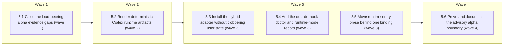

# Codex Support — Phase 5: Advisory alpha adapter

<!-- AT-A-GLANCE:BEGIN (generated — do not edit; refreshed by render_plan.py --summarize) -->
## At a glance

**6 tasks · 4 waves · 73 files · 4/6 done**

| Wave | Task | Title | Files | Done (acceptance) |
|---|---|---|---|---|
| 1 | 5.1 | Close the load-bearing alpha evidence gaps (wave 1) | scripts/capture_codex_capabilities.sh, scripts/probe_codex_packaging.sh, scripts/check_codex_capabilities.py, scripts/check_codex_packaging.py, scripts/test_check_codex_capabilities.py, scripts/test_check_codex_packaging.py, tests/scripts/codex-capability-probe.test.sh, tests/scripts/codex-packaging-probe.test.sh, tests/scripts/codex-alpha-evidence.test.sh, specs/codex-support/capability-matrix.json, specs/codex-support/packaging-decision.md, specs/codex-support/evidence/codex-0.147.0/hooks-unified-exec.json, specs/codex-support/evidence/codex-0.147.0/hooks-user-prompt-submit.json, specs/codex-support/evidence/codex-0.147.0/packaging-hybrid-runtime.json, specs/codex-support/evidence/codex-0.147.0/packaging-hybrid.json, specs/codex-support/evidence/codex-0.147.0/packaging-direct.json, hooks/pre-bash-dispatch.sh, tests/hooks/normalize-tool-input.test.sh, tests/hooks/pre-bash-dispatch.test.sh | the selected package path has observed runtime execution; load-bearing envelopes… |
| 2 | 5.2 | Render deterministic Codex runtime artifacts (wave 2) | adapters/codex/plugin/.codex-plugin/plugin.json, adapters/codex/plugin/hooks/hooks.json, adapters/codex/project/harness-instructions.md, adapters/codex/schema.json, scripts/render_codex_adapter.py, scripts/test_render_codex_adapter.py, scripts/render_agent_definitions.py, scripts/test_render_agent_definitions.py, scripts/run-tests.sh, agents/runtime-bindings.json, harness-manifest.json | identical inputs produce identical valid Codex artifacts; every role/hook/skill … |
| 3 | 5.3 | Install the hybrid adapter without clobbering user state (wave 3) | scripts/install-codex-harness.sh, scripts/deploy-codex-adapter.sh, tests/scripts/codex-install.test.sh, tests/fixtures/codex-install/custom-AGENTS.md, tests/fixtures/codex-install/custom-config.toml, docs/codex-alpha-install.md, harness-manifest.json | adapter lifecycle is idempotent and recoverable; every user-owned canary survive… |
| 3 | 5.4 | Add the outside-hook doctor and runtime-mode record (wave 3) | .gitignore, scripts/codex_harness_doctor.py, scripts/test_codex_harness_doctor.py, runtime/runtime_mode.py, runtime/test_runtime_mode.py, runtime/run_state.py, runtime/test_run_state.py, templates/SUMMARY.template.md, scripts/verify_summary.py, scripts/test_verify_summary.py, hooks/session-knowledge.sh, tests/hooks/session-knowledge.test.sh, scripts/run-tests.sh, harness-manifest.json | deterministic fixtures cover all modes, invalidation, privacy, malformed/unavail… |
| 3 | 5.5 | Move runtime-entry prose behind one binding (wave 3) | adapters/runtime-entry-bindings.json, scripts/render_runtime_entry.py, scripts/test_render_runtime_entry.py, hooks/commit-quality-gate.sh, hooks/risk-corroboration.sh, hooks/scope-gate.sh, scripts/check_review_receipt.py, scripts/rebuild_solution_index.py, scripts/score_intake_eval.py, skills/correctness-review/correctness-scorer-prompt.md, skills/intent-review/intent-reviewer-prompt.md, skills/subagent-driven-development/task-reviewer-prompt.md, skills/feature-intake/tests/README.md, tests/hooks/commit-quality-gate.test.sh, tests/hooks/risk-corroboration.test.sh, tests/hooks/scope-gate.test.sh, tests/scripts/runtime-entry-bindings.test.sh, specs/codex-support/neutralization-inventory.json | every exception owned by `codex-support-phase-5` is closed or retained as a narr… |
| 4 | 5.6 | Prove and document the advisory alpha boundary (wave 4) | tests/scripts/codex-alpha-contract.test.sh, .github/workflows/harness-ci.yml, scripts/run-tests.sh, harness-manifest.json, CLAUDE.md, HARNESS.md, skills/README.md, specs/codex-support/ROADMAP.md, specs/codex-support-phase-5/SUMMARY.md | the alpha is reproducible and truthfully labeled on every declared platform; CI … |

### Progress
- [x] 5.1 — Close the load-bearing alpha evidence gaps (wave 1)
- [x] 5.2 — Render deterministic Codex runtime artifacts (wave 2)
- [x] 5.3 — Install the hybrid adapter without clobbering user state (wave 3)
- [x] 5.4 — Add the outside-hook doctor and runtime-mode record (wave 3)
- [ ] 5.5 — Move runtime-entry prose behind one binding (wave 3)
- [ ] 5.6 — Prove and document the advisory alpha boundary (wave 4)
<!-- AT-A-GLANCE:END -->

## 1. Motivation

Phases 1–4 established a versioned capability baseline, selected hybrid packaging, neutralized the
semantic sources, and added a runtime-neutral hook seam. Phase 5 turns those contracts into the
first installable Codex adapter without claiming GA or mechanical peer enforcement prematurely.

Parent roadmap: `specs/codex-support/ROADMAP.md`. Preparation research:
`specs/codex-support-phase-5/RESEARCH.md`.

## 2. Non-goals

- Phase-6 per-PR parity enforcement or review-receipt provenance changes.
- Phase-7 model-driven behavioural parity or Phase-8 GA/peer claims.
- Native Windows support, ChatGPT desktop UI validation, or networked marketplace publication.
- Forking semantic skills, rules, hook bodies, or workflow policy by runtime.
- Replacing the user's root `AGENTS.md`, unrelated `.codex/` content, Codex trust decisions, or
  existing marketplace/plugin configuration.
- Changing Claude installation behavior or committing generated plugin/project output.

## Global Constraints

- Execute implementation in an isolated worktree/branch based on current `simplify`; preserve the
  unrelated `.harness-state/` and `specs/research-citation-ledger/` directories.
- Before the first `hooks/` or `scripts/` implementation edit, run `bash scripts/run-tests.sh`; run
  it again after all tasks and record the result in SUMMARY prose, not a Verify row.
- Task 5.1's model-backed capture requires explicit user authorization. Use fresh, distinct `HOME`
  and `CODEX_HOME`, a disposable repository/account context, an exact cleanup ledger, and the
  existing `--allow-live-model-probe` opt-in. Never mutate or inspect unrelated user Codex state.
- Official documentation is traceability; sanitized captured output is provenance; observed runtime
  execution is truth. Documentation-derived fixtures never become `observed` by relabeling.
- Hybrid remains selected unless its runtime-execution proof fails and the independently executed
  direct fallback proof passes. If neither passes, block Phase 5 instead of inventing a package path.
- Generated plugin/project assets are byte-stable derivatives of shared sources. The repository
  keeps only adapter templates/bindings; generated copies of skills/hooks/agents are not committed.
- Unknown, stale, untrusted, unsupported, or hash-mismatched load-bearing doctor results yield
  `advisory` or `unsupported`, never `enforced`.
- Preserve Claude output byte-for-byte for unchanged sources. Keep Bash compatible with macOS Bash
  3.2 and structured logic in Python stdlib where practical.
- Every same-wave task has zero file overlap. All focused Verify commands are pipe-free and finish
  in under 60 seconds; paid/networked live probes are preparation gates, not recurring Verify rows.
- Workflow-engine changes require a context-propagation audit, then the normal correctness and
  intent review chain before shipping.

## 3. Success Criteria

| ID | Behavior (observable) | Check (re-runnable) | Expected |
| --- | --- | --- | --- |
| SC-1 | Committed evidence distinguishes observed hybrid skill/hook/agent execution from documented or unknown envelopes and keeps direct fallback unselectable until independently proven | `bash tests/scripts/codex-alpha-evidence.test.sh` | exit 0 |
| SC-2 | One deterministic renderer emits byte-stable strict Codex plugin/project assets and rejects every incomplete agent capability mapping | `python3 -m pytest scripts/test_render_codex_adapter.py -q` | exit 0 |
| SC-3 | Fresh install, reinstall, update, conflict, dry-run, and removal preserve user-owned `AGENTS.md`, `.codex/`, plugin, and marketplace content | `bash tests/scripts/codex-install.test.sh` | exit 0 |
| SC-4 | The outside-hook doctor reports enforced/advisory/unsupported from version, platform, dependencies, discovery, trust, config hash, matcher coverage, and evidence freshness | `python3 -m pytest scripts/test_codex_harness_doctor.py -q` | exit 0 |
| SC-5 | Codex runtime mode and sanitized doctor evidence id are recorded in local state plus run/SUMMARY metadata without weakening legacy artifacts | `python3 -m pytest runtime/test_runtime_mode.py runtime/test_run_state.py scripts/test_verify_summary.py -q` | exit 0 |
| SC-6 | Every Phase-5-owned runtime-entry exception is removed or rendered through one checked runtime binding while shared policy stays invocation-neutral | `bash tests/scripts/runtime-entry-bindings.test.sh` | exit 0 |
| SC-7 | The deterministic alpha contract passes for the declared macOS/Linux/WSL baseline and makes missing WSL evidence explicitly advisory rather than peer | `bash tests/scripts/codex-alpha-contract.test.sh` | exit 0 |
| SC-8 | Adapter, installer, doctor, mode, evidence, and runtime-entry contracts are registered without manifest, inventory, or documentation drift | `python3 scripts/check_manifest.py` | exit 0 |

## 4. Tasks

### Task 5.1 — Close the load-bearing alpha evidence gaps (wave 1)

- **Files:** scripts/capture_codex_capabilities.sh, scripts/probe_codex_packaging.sh, scripts/check_codex_capabilities.py, scripts/check_codex_packaging.py, scripts/test_check_codex_capabilities.py, scripts/test_check_codex_packaging.py, tests/scripts/codex-capability-probe.test.sh, tests/scripts/codex-packaging-probe.test.sh, tests/scripts/codex-alpha-evidence.test.sh, specs/codex-support/capability-matrix.json, specs/codex-support/packaging-decision.md, specs/codex-support/evidence/codex-0.147.0/hooks-unified-exec.json, specs/codex-support/evidence/codex-0.147.0/hooks-user-prompt-submit.json, specs/codex-support/evidence/codex-0.147.0/packaging-hybrid-runtime.json, specs/codex-support/evidence/codex-0.147.0/packaging-hybrid.json, specs/codex-support/evidence/codex-0.147.0/packaging-direct.json, hooks/pre-bash-dispatch.sh, tests/hooks/normalize-tool-input.test.sh, tests/hooks/pre-bash-dispatch.test.sh
- **Action:** Extend the existing fake-CLI contracts first, then—only after explicit authorization—
  run one disposable model-backed capture that observes the real unified-exec envelope,
  `UserPromptSubmit` when emitted, installed plugin skill invocation, trusted plugin hook execution,
  and generated project-agent dispatch. Publish only schema-minimal sanitized evidence with CLI,
  platform, config hash, provenance, cleanup, `Verifies`, and `Does not verify` fields. Keep hybrid
  selected only if its execution proof passes. If it fails, execute the direct discovery/conflict
  probe and select direct only if its own evidence passes; otherwise stop Phase 5 blocked. Revert
  Phase-4 hand-written fixtures to documented/unknown rather than fabricating an observation when an
  event cannot be captured. If the observed unified-exec envelope contradicts the Phase-4
  documentation-derived normalizer fixtures, update `hooks/pre-bash-dispatch.sh` and its fixture
  tests in this task with the capture as provenance — never leave the normalizer asserting a shape
  the runtime does not send.
- **Verify:** `bash tests/scripts/codex-alpha-evidence.test.sh`
- **Done:** the selected package path has observed runtime execution; load-bearing envelopes are
  captured or explicitly owned unknown/advisory; evidence publication is sanitized and mutation-tested.
- **Criteria:** SC-1
- **Interfaces:** Consumes: Phase-1 capability capture and Phase-2 packaging decision. Produces: versioned alpha evidence under `specs/codex-support/evidence/codex-0.147.0/` and an executable selected-package decision.

### Task 5.2 — Render deterministic Codex runtime artifacts (wave 2)

- **Files:** adapters/codex/plugin/.codex-plugin/plugin.json, adapters/codex/plugin/hooks/hooks.json, adapters/codex/project/harness-instructions.md, adapters/codex/schema.json, scripts/render_codex_adapter.py, scripts/test_render_codex_adapter.py, scripts/render_agent_definitions.py, scripts/test_render_agent_definitions.py, scripts/run-tests.sh, agents/runtime-bindings.json, harness-manifest.json
- **Action:** Add a stdlib renderer that validates the selected package/evidence, reads the shared
  skills/hooks and neutral agent contracts, and writes a temporary plugin plus project overlay.
  Extend agent rendering to emit strict `.codex/agents/*.toml` profiles with explicit sandbox,
  shell/network/MCP, nesting, fresh-bounded context, model-class, and output-contract mappings;
  reject unsupported or unmapped capabilities. Render plugin hook matchers from the Phase-4
  canonical event/tool matrix, never duplicate semantic hook bodies in adapter sources. Assert
  byte stability, strict TOML/JSON parsing, path confinement, complete source inventory, and
  unchanged Claude rendering. Generated output remains ignored/uncommitted.
- **Verify:** `python3 -m pytest scripts/test_render_codex_adapter.py -q`
- **Done:** identical inputs produce identical valid Codex artifacts; every role/hook/skill is
  accounted for; incomplete policy mappings fail before installation; Claude output is unchanged.
- **Criteria:** SC-2, SC-8
- **Interfaces:** Consumes: selected package evidence, `agents/agent-contracts.json`, shared skills/hooks, and runtime bindings. Produces: `scripts/render_codex_adapter.py` and validated temporary plugin/project artifacts.

### Task 5.3 — Install the hybrid adapter without clobbering user state (wave 3)

- **Files:** scripts/install-codex-harness.sh, scripts/deploy-codex-adapter.sh, tests/scripts/codex-install.test.sh, tests/fixtures/codex-install/custom-AGENTS.md, tests/fixtures/codex-install/custom-config.toml, docs/codex-alpha-install.md, harness-manifest.json
- **Action:** Build/install the rendered plugin and project overlay through an isolated Codex-aware
  installer. Own only deployment-manifest paths. Integrate the root `AGENTS.md` through a
  sentinel-delimited pointer to the generated harness instruction fragment: preserve content outside
  the section; on edited-section or incoming conflicts keep local content and write a reviewable
  `.harness-incoming` sidecar unless the user explicitly selects overwrite. Merge, never replace,
  unrelated `.codex/config.toml`, agents, hooks, marketplaces, plugins, and trust decisions. Cover
  fresh install, reinstall, source removal/prune, update, dry-run, tty-less behavior, conflict,
  rollback/removal, interrupted install, and exact cleanup. Do not alter `install-harness.sh` or the
  Claude `.claude/` installation path in this task.
- **Verify:** `bash tests/scripts/codex-install.test.sh`
- **Done:** adapter lifecycle is idempotent and recoverable; every user-owned canary survives; only
  manifest-owned generated paths are created, updated, or removed.
- **Criteria:** SC-3
- **Interfaces:** Consumes: Task-5.2 rendered artifacts and Codex plugin lifecycle. Produces: `scripts/install-codex-harness.sh`, `scripts/deploy-codex-adapter.sh`, and the non-clobber alpha install contract.

### Task 5.4 — Add the outside-hook doctor and runtime-mode record (wave 3)

- **Files:** .gitignore, scripts/codex_harness_doctor.py, scripts/test_codex_harness_doctor.py, runtime/runtime_mode.py, runtime/test_runtime_mode.py, runtime/run_state.py, runtime/test_run_state.py, templates/SUMMARY.template.md, scripts/verify_summary.py, scripts/test_verify_summary.py, hooks/session-knowledge.sh, tests/hooks/session-knowledge.test.sh, scripts/run-tests.sh, harness-manifest.json
- **Action:** Implement a deterministic overlay around redacted `codex doctor --json` plus the
  adapter manifest/evidence. Evaluate CLI version, OS/dependencies, selected package, installed
  hashes, effective trust, required matcher/event coverage, skill/agent discovery, and evidence
  freshness. Emit `enforced`, `advisory`, or `unsupported` with stable reason codes and a sanitized
  evidence id; unknown/stale/mismatch can never emit enforced. Persist local derived state under
  `.harness-state/`, invalidate it on install/config/CLI/trust hash changes, and record mode/evidence
  id in run events and optional SUMMARY metadata without breaking legacy artifacts. SessionStart may
  display bounded context from the record but is never the diagnostic authority.
- **Verify:** `python3 -m pytest scripts/test_codex_harness_doctor.py runtime/test_runtime_mode.py -q`
- **Done:** deterministic fixtures cover all modes, invalidation, privacy, malformed/unavailable
  doctor output, and legacy compatibility; run/SUMMARY metadata never overclaims enforcement.
- **Criteria:** SC-4, SC-5
- **Interfaces:** Consumes: installed manifest, capability evidence, Codex doctor report, and runtime state schema. Produces: `scripts/codex_harness_doctor.py`, `runtime/runtime_mode.py`, and sanitized mode records.

### Task 5.5 — Move runtime-entry prose behind one binding (wave 3)

- **Files:** adapters/runtime-entry-bindings.json, scripts/render_runtime_entry.py, scripts/test_render_runtime_entry.py, hooks/commit-quality-gate.sh, hooks/risk-corroboration.sh, hooks/scope-gate.sh, scripts/check_review_receipt.py, scripts/rebuild_solution_index.py, scripts/score_intake_eval.py, skills/correctness-review/correctness-scorer-prompt.md, skills/intent-review/intent-reviewer-prompt.md, skills/subagent-driven-development/task-reviewer-prompt.md, skills/feature-intake/tests/README.md, tests/hooks/commit-quality-gate.test.sh, tests/hooks/risk-corroboration.test.sh, tests/hooks/scope-gate.test.sh, tests/scripts/runtime-entry-bindings.test.sh, specs/codex-support/neutralization-inventory.json
- **Action:** Define one checked entry binding for Claude and Codex invocation/model labels. Replace
  all Phase-3-owned literal `/skill`, `.claude/...`, and vendor-agent exceptions with either
  invocation-neutral semantic wording or output rendered from that binding at the runtime entry
  boundary. Preserve message meaning and existing Claude strings where they are part of a public
  contract; add paired Claude/Codex golden tests and mutation tests proving that a new raw runtime
  literal fails the count-exact inventory. Run the context-propagation audit after composition.
- **Verify:** `bash tests/scripts/runtime-entry-bindings.test.sh`
- **Done:** every exception owned by `codex-support-phase-5` is closed or retained as a narrower
  explicit unsupported exception with owner/expiry; shared workflow policy has no implicit runtime entry syntax.
- **Criteria:** SC-6
- **Interfaces:** Consumes: Phase-3 neutralization inventory and runtime-specific entry syntax. Produces: `adapters/runtime-entry-bindings.json`, its renderer, and a zero-unowned-exception inventory.

### Task 5.6 — Prove and document the advisory alpha boundary (wave 4)

- **Files:** tests/scripts/codex-alpha-contract.test.sh, .github/workflows/harness-ci.yml, scripts/run-tests.sh, harness-manifest.json, CLAUDE.md, HARNESS.md, skills/README.md, specs/codex-support/ROADMAP.md, specs/codex-support-phase-5/SUMMARY.md
- **Action:** Add one deterministic contract suite that composes evidence, rendering, install,
  doctor/mode, entry binding, and Claude-regression checks. Run it on macOS and Linux CI; add a
  disposable WSL capture/job or keep WSL explicitly unknown so doctor forces advisory and the alpha
  cannot claim baseline peer enforcement. Register all new contract surfaces/consumers, document
  install/update/rollback/trust review and mode semantics, and write the high-risk SUMMARY with one
  re-runnable row per SC plus all unobserved platform/runtime limits. Run the full suite and both
  review chains before shipping.
- **Verify:** `bash tests/scripts/codex-alpha-contract.test.sh`
- **Done:** the alpha is reproducible and truthfully labeled on every declared platform; CI catches
  adapter drift; docs never call advisory/unknown enforcement peer or GA.
- **Criteria:** SC-7, SC-8
- **Interfaces:** Consumes: all Task-5.1–5.5 outputs and platform CI. Produces: `tests/scripts/codex-alpha-contract.test.sh`, registered alpha contracts, and `specs/codex-support-phase-5/SUMMARY.md`.

## 5. Risks

- **Live probes mutate real state or spend unexpectedly.** Mitigation: explicit opt-in, isolated
  homes/repository, bounded model action, exact cleanup ledger, and publish-after-sanitize.
- **Hybrid lifecycle is visible but runtime execution still fails.** Mitigation: Task 5.1 executes
  the surfaces before production rendering; direct remains unavailable until independently proven.
- **Generated package becomes a second semantic source.** Mitigation: commit templates/bindings only,
  rebuild into temporary output, compare inventory and byte hashes, reject edited generated copies.
- **Agent TOML overstates reviewer isolation.** Mitigation: total capability mapping, fail on
  unsupported fields, fresh-bounded dispatch evidence, and explicit advisory exceptions.
- **Installer damages user instructions/config.** Mitigation: sentinel ownership, manifest-scoped
  prune, conflict sidecars, dry-run, interruption tests, and user canaries.
- **Doctor trusts hook self-reporting.** Mitigation: run outside hooks and compare effective trust,
  discovery, hashes, coverage, and evidence freshness independently.
- **Mode metadata breaks old summaries/runs.** Mitigation: optional/versioned fields plus legacy
  fixture replay and mutation tests.
- **WSL remains unobserved.** Mitigation: do not block local advisory alpha usability, but force
  advisory/unsupported and block the baseline peer claim until WSL evidence passes.
- **Observed unified-exec envelope contradicts Phase-4 normalizer fixtures.** Mitigation: Task 5.1
  owns `hooks/pre-bash-dispatch.sh` and its fixture tests, so a contradiction is fixed in-wave with
  the capture as provenance instead of drifting out of scope or being deferred.

## 6. Status Log

- 2026-08-12 — task 5.4 complete; commit e434b14. Review fix folded in before commit:
  documented-only load-bearing evidence now emits EVIDENCE_DOCUMENTED_ONLY so enforced can only
  rest on observed runtime truth. Wave 3 still open — the runtime-entry-binding task remains.
- 2026-08-11 — task 5.3 complete; commit a1697b7. Review fixes folded in before commit: guarded
  empty-array expansion for stock macOS bash 3.2 (with /bin/bash regression test) and corrected
  default clone repository/branch. Wave 3 stays open — the doctor/runtime-mode task and the
  runtime-entry-binding task are still pending.
- 2026-08-11 — task 5.2 complete; commit 38b41fa. Review fixes folded in before commit: unmapped
  mcp policies and unknown settings.json hook events now block rendering with mutation tests.
- 2026-08-11 — task 5.1 complete; commit 48b1c85
- 2026-08-11 — Task 5.1 completed after explicit live-probe authorization. Codex CLI 0.147.0 on
  macOS arm64 emitted the documented unified-exec `Bash`/`tool_input.command` shape and a redacted
  `UserPromptSubmit` envelope, so the Phase-4 normalizer required no change. The selected hybrid
  package executed its installed skill, automation-vetted plugin hook, and generated project agent
  in one isolated session. Direct remains an owned unknown and unselectable; persisted user hook
  trust, other platforms, desktop UI, and network marketplace behavior remain outside this proof.
- 2026-08-11 — Task 5.1 deterministic probe contracts implemented: capability capture now emits
  sanitized unified-exec and `UserPromptSubmit` envelopes; packaging capture separates lifecycle
  evidence from installed skill/hook/project-agent runtime proof; partial observations stay owned
  unknown. Fake-CLI integration tests and runtime-evidence checker mutations pass, and the full
  CI-equivalent suite is green (517 Python tests). Awaiting explicit authorization for the two
  disposable model-backed captures before publishing observed evidence or changing the decision.
- 2026-08-11 — Activated for implementation after Claude's pre-execution review commit `e95664d`.
  Official OpenAI hook documentation was rechecked before code work; deterministic Task-5.1 work
  starts first, while the model-backed capture remains gated on explicit user authorization.
- 2026-08-11 — Pre-execution review amendments: `runtime/test_run_state.py` added to the SC-5 check
  (run-state changes previously had no proof row); `hooks/pre-bash-dispatch.sh` and its fixture
  tests added to Task 5.1 Files with an in-wave contradiction path and matching risk entry, so a
  captured envelope that contradicts the Phase-4 documentation-derived fixtures is fixed in scope.
- 2026-08-11 — Prepared from merged `simplify` at `a54f5d5`. Official OpenAI hook documentation,
  local Codex CLI 0.147.0 surfaces, Phase-1–4 summaries/evidence, agent contracts, installer tests,
  and all Phase-5-owned neutralization exceptions were reviewed. Plan proposed; no adapter files,
  live model probes, user Codex state, or production installation were created.
