# Codex Support — Phases 1–4

<!-- AT-A-GLANCE:BEGIN (generated — do not edit; refreshed by render_plan.py --summarize) -->
## At a glance

**12 tasks · 11 waves · 112 files · 2/12 done**

| Wave | Task | Title | Files | Done (acceptance) |
|---|---|---|---|---|
| 1 | 1.1 | Define the capability evidence contract (wave 1) | specs/codex-support/capability-matrix.json, scripts/check_codex_capabilities.py, scripts/test_check_codex_capabilities.py, scripts/run-tests.sh, harness-manifest.json | the matrix is machine-readable and cannot silently turn absent/stale evidence in… |
| 2 | 1.2 | Capture sanitized, replayable capability evidence (wave 2) | scripts/capture_codex_capabilities.sh, tests/scripts/codex-capability-probe.test.sh, specs/codex-support/evidence/codex-0.147.0/doctor.json, specs/codex-support/evidence/codex-0.147.0/hooks-shell.json, specs/codex-support/evidence/codex-0.147.0/hooks-apply-patch.json, specs/codex-support/evidence/codex-0.147.0/agents-fresh-bounded.json, specs/codex-support/evidence/codex-0.147.0/agents-full-history-rejection.json, specs/codex-support/evidence/codex-0.147.0/session-end-timing.json, specs/codex-support/evidence/codex-0.147.0/platform.json, specs/codex-support/evidence/codex-0.147.0/trust-config.json, specs/codex-support/capability-matrix.json | all Phase-1 load-bearing claims point to sanitized fixtures or explicit unknowns… |
| 3 | 2.1 | Build a disposable hybrid-versus-direct probe (wave 3) | scripts/probe_codex_packaging.sh, tests/scripts/codex-packaging-probe.test.sh, tests/fixtures/codex-packaging/marketplace.json, tests/fixtures/codex-packaging/plugin.json, tests/fixtures/codex-packaging/agents.toml, specs/codex-support/capability-matrix.json | one safe command compares both package boundaries across discovery and lifecycle… |
| 4 | 2.2 | Record and enforce the packaging decision (wave 4) | specs/codex-support/packaging-decision.md, specs/codex-support/evidence/codex-0.147.0/packaging-hybrid.json, specs/codex-support/evidence/codex-0.147.0/packaging-direct.json, scripts/check_codex_packaging.py, scripts/test_check_codex_packaging.py, specs/codex-support/capability-matrix.json | Phase 5 has one evidence-backed package boundary and a deterministic reason to s… |
| 5 | 3.1 | Freeze the neutralisation inventory and lint (wave 5) | specs/codex-support/neutralization-inventory.json, scripts/check_runtime_neutral_sources.py, scripts/test_check_runtime_neutral_sources.py, harness-manifest.json | the current coupling set is finite and machine-checked; later tasks cannot hide … |
| 6 | 3.2 | Make rule delivery explicit and repository-rooted (wave 6) | agents/PROJECT.md, skills/README.md, skills/compound/README.md, skills/correctness-review/SKILL.md, skills/correctness-review/prompts/shared.md, skills/intent-review/SKILL.md, skills/subagent-driven-development/SKILL.md, skills/subagent-driven-development/implementer-prompt.md, skills/writing-plans/SKILL.md, skills/writing-plans/plan-document-reviewer-prompt.md, skills/xia2/references/research-brief-template.md, scripts/render_skill_prompt.py, scripts/test_render_skill_prompt.py, tests/scripts/context-propagation-regression.test.sh, tests/scripts/writing-plans-contract.test.sh, specs/codex-support/neutralization-inventory.json | all contextual rules use portable source addresses and every isolated context ha… |
| 7 | 3.3 | Neutralise skill invocation prose (wave 7) | agents/PROJECT.md, agents/PROJECT.template.md, agents/README.md, rules/auto-correct-scope.md, rules/orchestration.md, rules/wave-parallelism.md, skills/README.md, skills/brainstorming/SKILL.md, skills/compound/README.md, skills/compound/subagents/context-analyzer-prompt.md, skills/compound/subagents/decision-extractor-prompt.md, skills/compound/subagents/related-docs-finder-prompt.md, skills/compound/subagents/solution-extractor-prompt.md, skills/compound/templates/index.md, skills/correctness-review/SKILL.md, skills/correctness-review/correctness-reviewer-prompt.md, skills/feature-intake/SKILL.md, skills/feature-intake/tests/README.md, skills/intent-review/intent-reviewer-prompt.md, skills/subagent-driven-development/SKILL.md, skills/subagent-driven-development/references/review-chain.md, skills/using-git-worktrees/SKILL.md, skills/visual-planner/SKILL.md, skills/visual-planner/render_plan.py, skills/visual-planner/test_render_plan.py, skills/visual-planner/view_plan.py, skills/xia2/README.md, skills/xia2/tests/structural/depth-modes-test-cases.md, templates/SUMMARY.template.md, templates/structure/docs-solutions-critical-patterns.md, templates/structure/docs-solutions-INDEX.md, templates/structure/docs-solutions-README.md, templates/structure/specs-README.md, specs/codex-support/neutralization-inventory.json | shared instructions can be consumed by either runtime without deploy-time prose … |
| 8 | 3.4 | Extract neutral agent contracts and runtime bindings (wave 8) | agents/agent-contracts.json, agents/runtime-bindings.json, agents/coding.md, agents/reviewer.md, agents/task-reviewer.md, agents/test-runner.md, scripts/render_agent_definitions.py, scripts/test_render_agent_definitions.py, scripts/deploy-harness.sh, tests/scripts/deploy-prune.test.sh, tests/scripts/resync-conflict.test.sh, tests/scripts/settings-wiring.test.sh, tests/scripts/install-harness.test.sh, scripts/check_manifest.py, scripts/test_check_manifest.py, harness-manifest.json | semantic agent sources contain no Claude policy fields; both runtime bindings ar… |
| 9 | 4.1 | Implement the canonical payload normaliser (wave 9) | hooks/lib/normalize-tool-input.py, tests/hooks/normalize-tool-input.test.sh, tests/fixtures/hook-input/claude-shell.json, tests/fixtures/hook-input/claude-write.json, tests/fixtures/hook-input/codex-shell.json, tests/fixtures/hook-input/codex-unified-exec.json, tests/fixtures/hook-input/codex-apply-patch-single.json, tests/fixtures/hook-input/codex-apply-patch-multi.json, tests/fixtures/hook-input/codex-apply-patch-move-delete.json, tests/fixtures/hook-input/claude-user-prompt.json, tests/fixtures/hook-input/codex-user-prompt.json, tests/fixtures/hook-input/malformed.json, specs/codex-support/capability-matrix.json, harness-manifest.json | every supported raw payload has one canonical representation; multi-file edits r… |
| 10 | 4.2 | Make branch isolation consume path sets and fail closed (wave 10) | hooks/branch-isolation-guard.sh, tests/hooks/branch-isolation-guard.test.sh | the hard gate cannot silently allow a supported Codex edit because a path is mis… |
| 10 | 4.3 | Migrate advisory post-edit hooks without strengthening them (wave 10) | hooks/blast-radius-check.sh, hooks/ruff-on-edit.sh, hooks/render-plan-on-write.sh, tests/hooks/blast-radius-check.test.sh, tests/hooks/ruff-on-edit.test.sh, tests/hooks/render-plan-on-write.test.sh, tests/hooks/codex-edit-hooks.test.sh, CLAUDE.md | all four edit hooks share one payload truth; advisory hooks cover every known pa… |
| 11 | 4.4 | Migrate the shell-dispatch and prompt gates onto the normaliser (wave 11) | hooks/pre-bash-dispatch.sh, hooks/scope-gate.sh, tests/hooks/pre-bash-dispatch.test.sh, tests/hooks/scope-gate.test.sh, CLAUDE.md, harness-manifest.json | no supported Codex shell path can bypass the git gates through an unparsed paylo… |

```mermaid
flowchart LR
  subgraph W0[Wave 1]
    T1_1["1.1 Define the capability evidence contract (wave 1)"]
  end
  subgraph W1[Wave 2]
    T1_2["1.2 Capture sanitized, replayable capability evidence (wave 2)"]
  end
  subgraph W2[Wave 3]
    T2_1["2.1 Build a disposable hybrid-versus-direct probe (wave 3)"]
  end
  subgraph W3[Wave 4]
    T2_2["2.2 Record and enforce the packaging decision (wave 4)"]
  end
  subgraph W4[Wave 5]
    T3_1["3.1 Freeze the neutralisation inventory and lint (wave 5)"]
  end
  subgraph W5[Wave 6]
    T3_2["3.2 Make rule delivery explicit and repository-rooted (wave 6)"]
  end
  subgraph W6[Wave 7]
    T3_3["3.3 Neutralise skill invocation prose (wave 7)"]
  end
  subgraph W7[Wave 8]
    T3_4["3.4 Extract neutral agent contracts and runtime bindings (wave 8)"]
  end
  subgraph W8[Wave 9]
    T4_1["4.1 Implement the canonical payload normaliser (wave 9)"]
  end
  subgraph W9[Wave 10]
    T4_2["4.2 Make branch isolation consume path sets and fail closed (wave 10)"]
    T4_3["4.3 Migrate advisory post-edit hooks without strengthening them (wave 10)"]
  end
  subgraph W10[Wave 11]
    T4_4["4.4 Migrate the shell-dispatch and prompt gates onto the normaliser (wave 11)"]
  end
  W0 --> W1
  W1 --> W2
  W2 --> W3
  W3 --> W4
  W4 --> W5
  W5 --> W6
  W6 --> W7
  W7 --> W8
  W8 --> W9
  W9 --> W10
```

### Progress
- [x] 1.1 — Define the capability evidence contract (wave 1)
- [x] 1.2 — Capture sanitized, replayable capability evidence (wave 2)
- [ ] 2.1 — Build a disposable hybrid-versus-direct probe (wave 3)
- [ ] 2.2 — Record and enforce the packaging decision (wave 4)
- [ ] 3.1 — Freeze the neutralisation inventory and lint (wave 5)
- [ ] 3.2 — Make rule delivery explicit and repository-rooted (wave 6)
- [ ] 3.3 — Neutralise skill invocation prose (wave 7)
- [ ] 3.4 — Extract neutral agent contracts and runtime bindings (wave 8)
- [ ] 4.1 — Implement the canonical payload normaliser (wave 9)
- [ ] 4.2 — Make branch isolation consume path sets and fail closed (wave 10)
- [ ] 4.3 — Migrate advisory post-edit hooks without strengthening them (wave 10)
- [ ] 4.4 — Migrate the shell-dispatch and prompt gates onto the normaliser (wave 11)
<!-- AT-A-GLANCE:END -->

## 1. Motivation

The approved design establishes Codex as a future peer workflow runtime, but an alpha adapter must
not be built on session-only observations or field-for-field assumptions. Phases 1–4 create the
evidence and neutral seams that make Phase 5 safe: a versioned capability baseline, an executable
packaging decision, runtime-neutral instruction/agent policy, and one tested hook-input contract.
See `design.md` and `research-brief.md`.

## 2. Non-goals

- Emitting or installing the production Codex alpha adapter from Phase 5.
- Modifying the root `AGENTS.md`, creating a production `.codex/` tree, or claiming non-clobber
  integration is complete.
- Adding runtime mode recording, the final harness-specific doctor overlay, review-receipt
  provenance, per-PR Codex parity gates, or behavioural parity from Phases 5–7.
- Claiming native Windows support. The target baseline remains macOS, Linux, and WSL; unobserved
  platforms stay explicit.
- Forking workflow policy, skills, rules, or hook bodies per runtime.
- Running paid/networked Codex probes as blocking per-PR CI.
- Cherry-picking the stale Claude-only `feature/plugin-namespace-packaging` branch.
- Neutralising hook/script user-facing message prose (e.g. the `/compound` hint printed by
  `hooks/commit-quality-gate.sh`): Task 3.1 classifies these as owned runtime-entry exceptions
  deferred to Phase 5 rather than rewriting high-blast hook bodies in a bulk prose wave.

## Global Constraints

- Execute in an isolated worktree/branch based on current `simplify`; preserve all unrelated and
  untracked user files.
- Run `bash scripts/run-tests.sh` before the first `hooks/` or `scripts/` implementation edit and
  once after all tasks. Record full-suite evidence in the Status Log/SUMMARY prose, never as a
  sub-60-second Verify row.
- Treat official documentation as traceability, sanitized captured output as provenance, and live
  behavioral probes as truth. Every capability row states `observed`, `documented`, or `unknown`,
  with CLI version, platform, config hash, evidence path, and freshness; unknown never becomes pass.
- Deterministic tests require no Codex authentication, network, or mutation of a developer's real
  Codex configuration. Live plugin probes run only in a disposable OS account/runner and clean up
  the exact resources they create.
- Never log credentials, tokens, full transcripts, user home paths, repository absolute paths, or
  unrelated Codex configuration. Fixtures are schema-minimal and sanitized before commit.
- Preserve Claude's installed behavior and conflict/prune guarantees. Phase 3 may refactor sources
  and Claude generation, but the derived Claude agent definitions must retain the intended model,
  tools, descriptions, and role bodies except for approved invocation/path neutralisation.
- Shared sources use repository-root rule paths and invocation-neutral skill names. Runtime-specific
  syntax belongs only in runtime entry/binding artifacts.
- Root `AGENTS.md`, production `.codex/`, `settings.json`, and the Phase-5 installer surface are
  outside this plan and must remain byte-identical.
- The hook normaliser returns every touched path plus `known`, `partial`, or `unknown`. It rejects
  traversal/out-of-repository paths, never invents a missing path, and keeps per-gate unknown policy
  explicit: branch isolation blocks; advisory post-edit hooks warn and remain non-blocking; the
  shell-dispatch gate fails closed on an unclassifiable command payload, and the prompt-scope hook
  warns and stays non-blocking — never silent success on partial/unknown input.
- Keep Bash compatible with macOS Bash 3.2; prefer Python stdlib for structured parsing; all focused
  checks below are pipe-free and complete in under 60 seconds.
- Workflow-engine changes require a context-propagation audit during implementation, followed by the
  normal correctness and intent review chain before shipping.

## 3. Success Criteria

| ID | Behavior (observable) | Check (re-runnable) | Expected |
| --- | --- | --- | --- |
| SC-1 | A versioned matrix rejects missing capability fields, stale evidence links, unsupported status values, and unowned unknowns | `python3 scripts/check_codex_capabilities.py specs/codex-support/capability-matrix.json` | exit 0 |
| SC-2 | Capability capture is reproducible with a fake CLI, sanitizes volatile/private fields, and never requires network or real user configuration in deterministic tests | `bash tests/scripts/codex-capability-probe.test.sh` | exit 0 |
| SC-3 | Shell, apply-patch, custom-agent, trust/config, platform, and SessionEnd claims each resolve to sanitized version-pinned evidence or explicit unknown | `python3 scripts/check_codex_capabilities.py specs/codex-support/capability-matrix.json --require-evidence` | exit 0 |
| SC-4 | The packaging probe exercises hybrid and direct candidates through discovery, install, upgrade, conflict, and removal paths without touching the caller's Codex state | `bash tests/scripts/codex-packaging-probe.test.sh` | exit 0 |
| SC-5 | One packaging decision names the selected path, executable evidence, fallback trigger, ownership boundary, and unresolved gaps | `python3 scripts/check_codex_packaging.py specs/codex-support/packaging-decision.md` | exit 0 |
| SC-6 | Shared runtime sources contain no forbidden `.claude/rules/...` address or runtime-specific skill invocation outside declared entry/binding exceptions | `python3 scripts/check_runtime_neutral_sources.py --root .` | exit 0 |
| SC-7 | Every load-bearing contextual rule reaches main, implementer, reviewer, scorer, and resume contexts through an explicit read or a checked equivalent | `bash tests/scripts/context-propagation-regression.test.sh` | exit 0 |
| SC-8 | Neutral agent contracts map every capability for Claude and Codex, reject unmapped policy, and reproduce valid Claude agent definitions | `python3 -m pytest scripts/test_render_agent_definitions.py -q` | exit 0 |
| SC-9 | One normaliser correctly classifies Claude/Codex shell and edit payloads, extracts multi-file add/update/delete/move path sets, and reports malformed/partial/unknown input | `bash tests/hooks/normalize-tool-input.test.sh` | exit 0 |
| SC-10 | Branch isolation evaluates every normalized path and blocks shared-branch edits when any path or required parse state is unsafe | `bash tests/hooks/branch-isolation-guard.test.sh` | exit 0 |
| SC-11 | Ruff, blast-radius, and plan-render hooks process all applicable normalized paths and surface partial/unknown input without becoming blocking | `bash tests/hooks/codex-edit-hooks.test.sh` | exit 0 |
| SC-12 | New capability, agent-binding, and hook-normalisation surfaces are registered without manifest or contract drift | `python3 scripts/check_manifest.py` | exit 0 |
| SC-13 | The Bash dispatch gate evaluates normalized shell payloads from both runtimes and fails closed instead of silently passing an unclassifiable command through the git gates | `bash tests/hooks/pre-bash-dispatch.test.sh` | exit 0 |
| SC-14 | The prompt-scope hook consumes normalized prompt payloads from both runtimes and surfaces partial/unknown input without becoming blocking | `bash tests/hooks/scope-gate.test.sh` | exit 0 |

## 4. Tasks

### Phase 1 — Versioned capability baseline

### Task 1.1 — Define the capability evidence contract (wave 1)

- **Files:** specs/codex-support/capability-matrix.json, scripts/check_codex_capabilities.py, scripts/test_check_codex_capabilities.py, scripts/run-tests.sh, harness-manifest.json
- **Action:** Test-first, define a stdlib-only matrix schema keyed by runtime/CLI version and
  platform. Require each event/tool/packaging/agent capability to declare support target, evidence
  level (`observed`, `documented`, `unknown`), source/freshness, config hash, fixture path when
  observed, owner, and exit condition when unknown. Encode the design's exact shell, unified-exec,
  `apply_patch`, SessionStart/UserPromptSubmit/SessionEnd, custom-agent fork, trust/config, plugin,
  strict-config, and platform rows. Reject absolute/private paths, missing fixtures, status values
  that overclaim unknown coverage, and observations whose CLI version does not match their evidence
  directory. Register the matrix/checker as a manifest contract with its probe and Phase-5 consumers,
  and register its unit suite in the CI-equivalent Python test list.
- **Verify:** `python3 -m pytest scripts/test_check_codex_capabilities.py -q && python3 scripts/check_codex_capabilities.py specs/codex-support/capability-matrix.json`
- **Done:** the matrix is machine-readable and cannot silently turn absent/stale evidence into
  support; every design claim has a row and every unknown has an owner plus closure condition.
- **Criteria:** SC-1, SC-12
- **Interfaces:** Consumes: approved `design.md`, official Codex contracts, CLI version vocabulary. Produces: `specs/codex-support/capability-matrix.json`, `scripts/check_codex_capabilities.py`, `harness-manifest.json`.

### Task 1.2 — Capture sanitized, replayable capability evidence (wave 2)

- **Files:** scripts/capture_codex_capabilities.sh, tests/scripts/codex-capability-probe.test.sh, specs/codex-support/evidence/codex-0.147.0/doctor.json, specs/codex-support/evidence/codex-0.147.0/hooks-shell.json, specs/codex-support/evidence/codex-0.147.0/hooks-apply-patch.json, specs/codex-support/evidence/codex-0.147.0/agents-fresh-bounded.json, specs/codex-support/evidence/codex-0.147.0/agents-full-history-rejection.json, specs/codex-support/evidence/codex-0.147.0/session-end-timing.json, specs/codex-support/evidence/codex-0.147.0/platform.json, specs/codex-support/evidence/codex-0.147.0/trust-config.json, specs/codex-support/capability-matrix.json
- **Action:** Build a capture command with explicit `--output`, `--codex-bin`, and
  `--allow-live-model-probe` boundaries. Default to non-model facts (`--version`, features,
  `--strict-config`, redacted doctor, platform/dependency checks) and use a temporary repository for
  hook/SessionEnd probes. Gate model-backed custom-agent observations behind the explicit flag.
  Normalize event records into schema-minimal fixtures, hash the effective hook config, strip all
  volatile/private fields, and refuse to overwrite evidence for a different version/platform.
  Capture effective project trust state and the trusted hook-configuration hash into
  `trust-config.json`; when a trust state cannot be reproduced deterministically, mark the
  corresponding matrix rows unknown with owner and exit condition instead of leaving them
  unevidenced by omission.
  Benchmark `state-breadcrumb.sh` for at least 20 isolated runs; record min/p95/max plus the
  documented SessionEnd timeout, and call it supported only when max stays below 80% of that budget.
  Create a fake-Codex contract test covering success, untrusted/disabled hooks, missing tools,
  sanitizer rejection, repeated time-budget measurement, paid-probe opt-in, cleanup, and explicit
  unknown fallback. Re-capture or transcribe the already observed 0.147.0 shell/apply-patch/fork results;
  where reproduction is unavailable, mark the matrix row unknown rather than fabricating a pass.
- **Verify:** `bash tests/scripts/codex-capability-probe.test.sh && python3 scripts/check_codex_capabilities.py specs/codex-support/capability-matrix.json --require-evidence`
- **Done:** all Phase-1 load-bearing claims point to sanitized fixtures or explicit unknowns; the
  capture path is reproducible, bounded, opt-in for paid behavior, and safe for deterministic CI.
- **Criteria:** SC-2, SC-3
- **Interfaces:** Consumes: `scripts/check_codex_capabilities.py`, Codex CLI/documented payloads, temporary repositories. Produces: `scripts/capture_codex_capabilities.sh`, `specs/codex-support/evidence/codex-0.147.0/*.json`, updated `specs/codex-support/capability-matrix.json`.

### Phase 2 — Evidence-driven packaging decision

### Task 2.1 — Build a disposable hybrid-versus-direct probe (wave 3)

- **Files:** scripts/probe_codex_packaging.sh, tests/scripts/codex-packaging-probe.test.sh, tests/fixtures/codex-packaging/marketplace.json, tests/fixtures/codex-packaging/plugin.json, tests/fixtures/codex-packaging/agents.toml, specs/codex-support/capability-matrix.json
- **Action:** Test-first, implement a probe that materializes two temporary candidates from current
  sources: hybrid (plugin-owned skills/hooks plus project-owned agents/instruction pointer) and
  direct project sync. Exercise strict config parsing, marketplace/plugin discovery, install/list,
  skill discovery, hook registration visibility, agent discovery, no-op reinstall, source update,
  local customization conflict, removal, and cleanup. Deterministic tests use a fake Codex CLI and
  assert the exact CLI/config protocol. A real run is permitted only in a disposable OS
  account/ephemeral runner and must prove it is not pointing at the caller's Codex state before any
  mutation. Do not add production `.codex-plugin/`, `.codex/`, or root instruction files.
- **Verify:** `bash tests/scripts/codex-packaging-probe.test.sh`
- **Done:** one safe command compares both package boundaries across discovery and lifecycle
  behavior, emits machine-readable results, and leaves neither project nor Codex user state behind.
- **Criteria:** SC-4
- **Interfaces:** Consumes: current skills and hooks trees, neutral package assumptions, Codex plugin CLI. Produces: `scripts/probe_codex_packaging.sh`, packaging fixture contracts, probe result schema used by Task 2.2.

### Task 2.2 — Record and enforce the packaging decision (wave 4)

- **Files:** specs/codex-support/packaging-decision.md, specs/codex-support/evidence/codex-0.147.0/packaging-hybrid.json, specs/codex-support/evidence/codex-0.147.0/packaging-direct.json, scripts/check_codex_packaging.py, scripts/test_check_codex_packaging.py, specs/codex-support/capability-matrix.json
- **Action:** Run the real probe in an approved disposable environment and save sanitized results
  for both candidates. Write the decision with selected path, plugin/project ownership, discovery
  evidence, reinstall/upgrade/conflict behavior, trust implications, unresolved gaps, exact fallback
  trigger, and a statement that the stale `.claude-plugin` branch was inspected but not reused. Add
  a stdlib checker that rejects missing evidence, a decision unsupported by its result, an absent
  fallback criterion, or claims broader than the capability matrix. Select hybrid only if every
  required discovery/lifecycle case passes; otherwise select direct sync without changing the
  semantic-core contracts. If no approved disposable environment is available, do not run the probe
  against real Codex state and do not fabricate evidence: record a `specs/codex-support/ESCALATIONS.md`
  block (`decision: pending`) for environment provisioning and leave the packaging decision
  unwritten — Phase 5 stays blocked rather than silently defaulting to either candidate.
- **Verify:** `python3 -m pytest scripts/test_check_codex_packaging.py -q && python3 scripts/check_codex_packaging.py specs/codex-support/packaging-decision.md`
- **Done:** Phase 5 has one evidence-backed package boundary and a deterministic reason to switch to
  the fallback; the matrix and decision agree on every unresolved capability.
- **Criteria:** SC-5
- **Interfaces:** Consumes: Task 2.1 result schema and live probe output. Produces: `specs/codex-support/packaging-decision.md`, packaging evidence JSON, `scripts/check_codex_packaging.py`.

### Phase 3 — Semantic source neutralisation

### Task 3.1 — Freeze the neutralisation inventory and lint (wave 5)

- **Files:** specs/codex-support/neutralization-inventory.json, scripts/check_runtime_neutral_sources.py, scripts/test_check_runtime_neutral_sources.py, harness-manifest.json
- **Action:** Test-first, inventory every shared instruction file containing `.claude/rules/...`,
  Claude `/skill-name` invocation syntax, Claude model/tool frontmatter, or runtime-bound entry
  language. Classify each finding as shared-source violation, runtime entry/binding exception, test
  fixture, or false positive with rationale. Implement a stdlib lint that scans only declared
  runtime source surfaces, rejects new unowned exceptions and stale inventory entries, understands
  escaped/code-example cases, and reports exact file/line/search category. Scan `templates/` as part
  of the shared-source surface — templates instantiate into consumer repositories and carry
  invocation prose. Classify hook and script user-facing message prose
  (`hooks/commit-quality-gate.sh`, `hooks/risk-corroboration.sh`, `hooks/scope-gate.sh`,
  `scripts/check_review_receipt.py`, `scripts/rebuild_solution_index.py`,
  `scripts/score_intake_eval.py`, and the tests asserting those messages) as owned runtime-entry
  exceptions deferred to Phase 5 — recorded decisions, never silent omissions. Register the neutral
  source contract and checker consumers in the manifest.
- **Verify:** `python3 -m pytest scripts/test_check_runtime_neutral_sources.py -q && python3 scripts/check_runtime_neutral_sources.py --root .`
- **Done:** the current coupling set is finite and machine-checked; later tasks cannot hide an
  unconverted runtime dependency by changing prose or adding an allowlist silently.
- **Criteria:** SC-6, SC-12
- **Interfaces:** Consumes: current skills, agents, and rules corpus plus the approved source/entry boundary. Produces: `specs/codex-support/neutralization-inventory.json`, `scripts/check_runtime_neutral_sources.py`, manifest contract entry.

### Task 3.2 — Make rule delivery explicit and repository-rooted (wave 6)

- **Files:** agents/PROJECT.md, skills/README.md, skills/compound/README.md, skills/correctness-review/SKILL.md, skills/correctness-review/prompts/shared.md, skills/intent-review/SKILL.md, skills/subagent-driven-development/SKILL.md, skills/subagent-driven-development/implementer-prompt.md, skills/writing-plans/SKILL.md, skills/writing-plans/plan-document-reviewer-prompt.md, skills/xia2/references/research-brief-template.md, scripts/render_skill_prompt.py, scripts/test_render_skill_prompt.py, tests/scripts/context-propagation-regression.test.sh, tests/scripts/writing-plans-contract.test.sh, specs/codex-support/neutralization-inventory.json
- **Action:** Replace shared-source `.claude/rules/...` addresses with canonical repository-root
  `rules/...` paths. For `plan-format`, `wave-parallelism`, and `auto-correct-scope`, enumerate every
  load-bearing main/implementer/task-reviewer/correctness-reviewer/scorer/resume consumer and add an
  explicit read or checked composition point before the instruction is used. Extend the existing
  render/context tests from their two historical anchors to the complete consumer matrix, including
  mutation cases that remove one delivery edge. Update
  `tests/scripts/writing-plans-contract.test.sh`, which asserts the literal
  `.claude/rules/plan-format.md` read in `skills/writing-plans/SKILL.md`, to expect the
  repository-root path. Keep `paths:` auto-loading as a Claude accelerator,
  not the only guarantee; do not inline another copy of Rule 4.
- **Verify:** `bash tests/scripts/context-propagation-regression.test.sh && python3 scripts/check_runtime_neutral_sources.py --root .`
- **Done:** all contextual rules use portable source addresses and every isolated context has
  executable delivery proof; the neutral-source lint reports no rule-path violation.
- **Criteria:** SC-6, SC-7
- **Interfaces:** Consumes: authoritative `rules/*.md`, Task 3.1 inventory, existing prompt composition. Produces: portable rule references, expanded `tests/scripts/context-propagation-regression.test.sh`, updated inventory evidence.

### Task 3.3 — Neutralise skill invocation prose (wave 7)

- **Files:** agents/PROJECT.md, agents/PROJECT.template.md, agents/README.md, rules/auto-correct-scope.md, rules/orchestration.md, rules/wave-parallelism.md, skills/README.md, skills/brainstorming/SKILL.md, skills/compound/README.md, skills/compound/subagents/context-analyzer-prompt.md, skills/compound/subagents/decision-extractor-prompt.md, skills/compound/subagents/related-docs-finder-prompt.md, skills/compound/subagents/solution-extractor-prompt.md, skills/compound/templates/index.md, skills/correctness-review/SKILL.md, skills/correctness-review/correctness-reviewer-prompt.md, skills/feature-intake/SKILL.md, skills/feature-intake/tests/README.md, skills/intent-review/intent-reviewer-prompt.md, skills/subagent-driven-development/SKILL.md, skills/subagent-driven-development/references/review-chain.md, skills/using-git-worktrees/SKILL.md, skills/visual-planner/SKILL.md, skills/visual-planner/render_plan.py, skills/visual-planner/test_render_plan.py, skills/visual-planner/view_plan.py, skills/xia2/README.md, skills/xia2/tests/structural/depth-modes-test-cases.md, templates/SUMMARY.template.md, templates/structure/docs-solutions-critical-patterns.md, templates/structure/docs-solutions-INDEX.md, templates/structure/docs-solutions-README.md, templates/structure/specs-README.md, specs/codex-support/neutralization-inventory.json
- **Action:** Replace executable/shared `/skill-name` phrasing with invocation-neutral language such
  as “invoke the named skill,” while preserving literal repository paths, URLs, code operators,
  historical evidence, and explicitly runtime-bound entry examples. Neutralise the invocation prose
  in `templates/` the same way — `SUMMARY.template.md` and the `templates/structure/` docs
  instantiate into consumer repositories and must not teach Claude-only slash syntax. Leave
  hook/script user-facing message prose to its Phase-5 owned exception per Task 3.1. Update
  behavior/structural tests
  to assert semantic handoff names or generated runtime entry text rather than Claude slash syntax.
  Review every mechanical edit in context; do not rewrite policy, routing order, or review gates.
  Re-run the inventory lint and remove an exception only when the source is genuinely neutral.
- **Verify:** `python3 scripts/check_runtime_neutral_sources.py --root .`
- **Done:** shared instructions can be consumed by either runtime without deploy-time prose rewrite;
  all workflow handoffs retain their original semantics and the inventory has no stale exception.
- **Criteria:** SC-6
- **Interfaces:** Consumes: Task 3.1 inventory and current skill handoff graph. Produces: invocation-neutral shared instruction corpus and updated `specs/codex-support/neutralization-inventory.json`.

### Task 3.4 — Extract neutral agent contracts and runtime bindings (wave 8)

- **Files:** agents/agent-contracts.json, agents/runtime-bindings.json, agents/coding.md, agents/reviewer.md, agents/task-reviewer.md, agents/test-runner.md, scripts/render_agent_definitions.py, scripts/test_render_agent_definitions.py, scripts/deploy-harness.sh, tests/scripts/deploy-prune.test.sh, tests/scripts/resync-conflict.test.sh, tests/scripts/settings-wiring.test.sh, tests/scripts/install-harness.test.sh, scripts/check_manifest.py, scripts/test_check_manifest.py, harness-manifest.json
- **Action:** Test-first, move vendor model/tool fields out of semantic role documents into explicit
  bindings. Define neutral capabilities for filesystem, shell/network, MCP, nested delegation,
  context policy, model class, and output contract; require every role/runtime/capability to map or
  declare an owned unsupported exception. Add deterministic rendering for Claude agent definitions
  and validate the Codex binding shape without emitting Phase-5 TOML. Change Claude deployment to
  render agents rather than copy vendor frontmatter, preserving protected-file conflict, prune,
  dry-run, idempotency, and consumer-custom-agent behavior. Add reviewer assertions for read-only
  filesystem, no nested delegation, controlled MCP, and fresh/bounded context. Compare generated
  Claude semantics against the pre-refactor roles so model/tool isolation cannot weaken unnoticed.
- **Verify:** `python3 -m pytest scripts/test_render_agent_definitions.py -q && python3 scripts/check_manifest.py`
- **Done:** semantic agent sources contain no Claude policy fields; both runtime bindings are total
  or explicitly excepted; deployed Claude agents remain valid and behaviorally equivalent.
- **Criteria:** SC-8, SC-12
- **Interfaces:** Consumes: neutral role bodies and Task 3.1 inventory. Produces: `agents/agent-contracts.json`, `agents/runtime-bindings.json`, `scripts/render_agent_definitions.py`, derived Claude agent definitions through `scripts/deploy-harness.sh`.

### Phase 4 — Runtime-neutral hook input seam

### Task 4.1 — Implement the canonical payload normaliser (wave 9)

- **Files:** hooks/lib/normalize-tool-input.py, tests/hooks/normalize-tool-input.test.sh, tests/fixtures/hook-input/claude-shell.json, tests/fixtures/hook-input/claude-write.json, tests/fixtures/hook-input/codex-shell.json, tests/fixtures/hook-input/codex-unified-exec.json, tests/fixtures/hook-input/codex-apply-patch-single.json, tests/fixtures/hook-input/codex-apply-patch-multi.json, tests/fixtures/hook-input/codex-apply-patch-move-delete.json, tests/fixtures/hook-input/claude-user-prompt.json, tests/fixtures/hook-input/codex-user-prompt.json, tests/fixtures/hook-input/malformed.json, specs/codex-support/capability-matrix.json, harness-manifest.json
- **Action:** Test-first, add one stdlib executable that reads raw hook JSON once and emits a stable
  normalized JSON object containing runtime/event identity, canonical tool class, deduplicated path
  set, command/prompt/outcome fields, and `known`, `partial`, or `unknown`. Support the observed
  Claude file-path/response fields and Codex shell/unified-exec/`apply_patch` patch envelopes.
  Parse add/update/delete/move headers, retain all safe repo-relative paths, identify unparsed edit
  fragments as partial, and classify malformed/missing inputs unknown. Reject traversal, NUL, and
  outside-root paths without collapsing valid siblings. Include golden fixtures for the Codex
  unified-exec shell envelope and for Claude/Codex `UserPromptSubmit` prompt payloads so the
  shell-dispatch and prompt-scope consumers in Task 4.4 have observed inputs. Build table-driven
  golden/mutation tests
  from Phase-1 sanitized fixtures and register the seam/consumers in the manifest.
- **Verify:** `bash tests/hooks/normalize-tool-input.test.sh && python3 scripts/check_manifest.py`
- **Done:** every supported raw payload has one canonical representation; multi-file edits remain
  set-valued; malformed/unsafe data is visible and never becomes an empty successful edit.
- **Criteria:** SC-9, SC-12
- **Interfaces:** Consumes: Phase-1 payload evidence and repository root. Produces: `hooks/lib/normalize-tool-input.py`, normalized JSON contract, golden hook fixtures.

### Task 4.2 — Make branch isolation consume path sets and fail closed (wave 10)

- **Files:** hooks/branch-isolation-guard.sh, tests/hooks/branch-isolation-guard.test.sh
- **Action:** Replace direct `.tool_input.file_path` parsing with Task 4.1 output. Evaluate every
  normalized path: allow only when all are bookkeeping or the repository is on a non-shared branch;
  deny a mixed bookkeeping/code patch on a shared branch; deny partial/unknown edit payloads on a
  shared branch with an actionable reason; preserve detached/non-repo behavior and audited
  break-glass semantics. Add Claude single-file and Codex multi-file/move/delete/path-traversal tests,
  including mutation cases proving one unsafe sibling cannot be hidden by a safe first path.
- **Verify:** `bash tests/hooks/branch-isolation-guard.test.sh`
- **Done:** the hard gate cannot silently allow a supported Codex edit because a path is missing,
  reordered, or accompanied by a bookkeeping path; all pre-existing Claude cases still pass.
- **Criteria:** SC-10
- **Interfaces:** Consumes: normalized path-set/status contract from `hooks/lib/normalize-tool-input.py`. Produces: multi-path fail-closed `hooks/branch-isolation-guard.sh` and its regression suite.

### Task 4.3 — Migrate advisory post-edit hooks without strengthening them (wave 10)

- **Files:** hooks/blast-radius-check.sh, hooks/ruff-on-edit.sh, hooks/render-plan-on-write.sh, tests/hooks/blast-radius-check.test.sh, tests/hooks/ruff-on-edit.test.sh, tests/hooks/render-plan-on-write.test.sh, tests/hooks/codex-edit-hooks.test.sh, CLAUDE.md
- **Action:** Replace direct payload parsing in all three hooks with Task 4.1 output and iterate every
  applicable path. Ruff processes each existing `.py`; blast-radius reports every out-of-plan path
  without duplicate messages; plan rendering handles each affected `specs/*/PLAN.md` once. Preserve
  their non-blocking contract: partial/unknown input emits one bounded warning/additional-context
  signal and exits 0, while explicit blast-radius strict mode may still exit 2 for known
  out-of-scope paths. Add a cross-hook Codex integration suite for multi-file, mixed-type,
  move/delete, malformed, and no-applicable-path cases. Update the hook table to describe path-set
  behavior and negative scope; do not change `settings.json` or move `state-breadcrumb.sh`.
- **Verify:** `bash tests/hooks/codex-edit-hooks.test.sh && bash tests/hooks/blast-radius-check.test.sh && bash tests/hooks/ruff-on-edit.test.sh && bash tests/hooks/render-plan-on-write.test.sh && python3 scripts/check_manifest.py`
- **Done:** all four edit hooks share one payload truth; advisory hooks cover every known path,
  expose uncertainty, remain non-blocking by default, and retain existing Claude behavior.
- **Criteria:** SC-11
- **Interfaces:** Consumes: normalized path-set/status contract from `hooks/lib/normalize-tool-input.py`. Produces: multi-path post-edit hooks, `tests/hooks/codex-edit-hooks.test.sh`, updated `CLAUDE.md` contract table.

### Task 4.4 — Migrate the shell-dispatch and prompt gates onto the normaliser (wave 11)

- **Files:** hooks/pre-bash-dispatch.sh, hooks/scope-gate.sh, tests/hooks/pre-bash-dispatch.test.sh, tests/hooks/scope-gate.test.sh, CLAUDE.md, harness-manifest.json
- **Action:** Replace the direct `jq -r '.tool_input.command // ""'` read in
  `hooks/pre-bash-dispatch.sh` and the `.prompt // ""` read in `hooks/scope-gate.sh` with Task 4.1
  normalised output, closing the same empty-fallback fail-open the design names for edit hooks
  (design §3.1): today an unparseable Codex payload silently exits 0 past all four git gates.
  Dispatch: a `known` shell payload routes exactly as today; a `partial`/`unknown` payload emits a
  visible reason and fails closed (exit 2), matching the hook's existing missing-lib/missing-sub-hook
  fail-safe precedent, and all current Claude cases keep their behavior. Scope-gate stays advisory:
  partial/unknown emits one bounded warning and exits 0. Add Claude and Codex
  shell/unified-exec/prompt fixture tests plus mutation cases for malformed payloads. Update the
  `CLAUDE.md` hook table rows for both hooks and register the two new normaliser consumers in the
  manifest. Do not change `settings.json` or the git sub-hooks themselves — they keep receiving the
  raw payload relay unchanged.
- **Verify:** `bash tests/hooks/pre-bash-dispatch.test.sh && bash tests/hooks/scope-gate.test.sh && python3 scripts/check_manifest.py`
- **Done:** no supported Codex shell path can bypass the git gates through an unparsed payload; the
  prompt gate consumes both runtimes' payloads and stays non-blocking; existing Claude dispatch and
  scope-gate behavior is unchanged.
- **Criteria:** SC-13, SC-14, SC-12
- **Interfaces:** Consumes: normalized command/prompt contract from `hooks/lib/normalize-tool-input.py`. Produces: runtime-neutral `hooks/pre-bash-dispatch.sh` and `hooks/scope-gate.sh`, extended dispatch/scope regression suites, updated `harness-manifest.json`.

## 5. Risks

- **Capability evidence becomes stale while still looking complete.** Mitigation: version/platform/
  config hashes, freshness rules, fixture existence checks, and explicit unknown states.
- **Live probes mutate real Codex state or incur unplanned model cost.** Mitigation: disposable
  account/runner precondition, paid-probe flag, fake CLI tests, exact cleanup ledger, and no blocking
  live CI.
- **The packaging spike accidentally becomes an unsupported production adapter.** Mitigation: only
  temporary generated candidates and evidence are committed; production plugin/project files remain
  Phase 5.
- **Bulk prose neutralisation changes policy meaning.** Mitigation: inventory-first changes,
  context review per match, handoff/structural regressions, and mandatory context-propagation audit.
- **Agent extraction weakens Claude reviewer isolation.** Mitigation: total capability mapping,
  semantic/golden comparison, explicit read-only/no-nesting assertions, and deploy conflict tests.
- **Patch parsing misses an edit form.** Mitigation: observed golden fixtures, mutation cases,
  partial/unknown status, branch guard fail-closed, and advisory hooks fail-visible.
- **Multi-file hook loops duplicate side effects.** Mitigation: deduplicated canonical paths,
  once-per-path fixtures, and idempotent plan-render tests.
- **macOS/Linux shell behavior diverges.** Mitigation: keep structured parsing in Python stdlib,
  preserve Bash 3.2 compatibility, and run the full cross-platform CI suite before shipping.
- **Fail-closed dispatch on unknown payloads could block legitimate Bash calls if a runtime changes
  its payload shape.** Mitigation: version-pinned capability-matrix rows for shell payloads, golden
  fixtures per supported shape, and an actionable block message naming the unparsed field.
- **Phase boundaries drift.** Mitigation: no production Codex install, root instruction mutation,
  runtime-mode schema, review provenance, or parity/GA work enters this plan; record any discovered
  need as a Phase-5+ follow-up rather than auto-expanding scope.

## 6. Status Log

- 2026-08-10 — PR #194 merged into `simplify` at `cf29af3`. Deep research refreshed against the
  current tree, Codex CLI 0.147.0, official OpenAI documentation, installed CLI command surfaces,
  and the stale Claude plugin branch. `research-brief.md` and this proposed Phase 1–4 plan authored;
  no Phase 1–4 implementation performed.
- 2026-08-10 — Claude Code reviewed the Codex-authored plan and updated it (file lists
  grep-checked against the tree): added the missed `tests/scripts/writing-plans-contract.test.sh` to Task 3.2 (its line 5
  asserts the literal `.claude/rules/plan-format.md` read that 3.2 rewrites); added `templates/`
  neutralisation to Task 3.3 and the hook/script message-prose owned exception to Task 3.1 and
  Non-goals; added Task 4.4 + SC-13/SC-14 closing the `pre-bash-dispatch.sh`/`scope-gate.sh`
  empty-fallback fail-open (design §3.1 applied to shell/prompt gates) with unified-exec and
  UserPromptSubmit golden fixtures added to Task 4.1; added the `trust-config.json` evidence fixture
  to Task 1.2; added the blocked-environment escalation path to Task 2.2. No implementation
  performed.
- 2026-08-10 — Tasks 1.1 and 1.2 complete in `872dc32`. Added a version-pinned capability
  matrix and stdlib validator, sanitized Codex 0.147.0 evidence, an opt-in disposable live-probe
  path, a 20-run SessionEnd benchmark, and deterministic fake-CLI/privacy/downgrade tests. The
  second plan review also registered the new Python suite in `scripts/run-tests.sh`; the final
  CI-equivalent run completed `ALL GREEN` with 478 Python tests. Effective project trust, Linux,
  WSL, and native Windows remain explicitly owned unknowns; no Phase 2 work was started.
