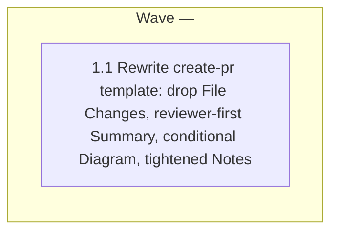

# create-pr: reviewer-friendly template

<!-- AT-A-GLANCE:BEGIN (generated — do not edit; refreshed by render_plan.py --summarize) -->
## At a glance

**1 tasks · 1 waves · 1 files · 1/1 done**

| Wave | Task | Title | Files | Done (acceptance) |
|---|---|---|---|---|
| — | 1.1 | Rewrite create-pr template: drop File Changes, reviewer-first Summary, conditional Diagram, tightened Notes | skills/create-pr/SKILL.md | `skills/create-pr/SKILL.md` has no File Changes section/row, has a conditional D… |



### Progress
- [x] 1.1 — Rewrite create-pr template: drop File Changes, reviewer-first Summary, conditional Diagram, tightened Notes
<!-- AT-A-GLANCE:END -->

## 1. Motivation

`skills/create-pr/SKILL.md` (the `/create-pr` skill) generates `.pr-body.md` from a fixed
template. Per [issue #138](https://github.com/minhtran3124/agent-harness/issues/138):

- The `## File Changes` table restates what GitHub's diff view already shows — pure overhead,
  worse on large PRs.
- `## Summary` guidance is generic ("1–3 sentences, why") and doesn't reliably produce a
  fast, accurate mental model for a reviewer.
- There's no guidance for when a diagram/workflow visual (e.g. Mermaid) would help — some
  process/flow-shaped changes would benefit, and the template has no path for one today.
- `## Notes` is scoped as "anything reviewers should know" — too broad; should be main
  points and important changes only (breaking changes, follow-ups, caveats).

This is a single-file, single-skill-document change with one clear interpretation (intake:
`normal` lane, `high` confidence, flags `existing-behavior` + `weak-proof`, no hard gate —
see `specs/create-pr-reviewer-friendly/SUMMARY.md`). No design fork exists and the code
(one markdown skill file) is already read and understood, so per the artifact-policy signal
rule (`rules/orchestration.md`) neither `design.md` nor `research-brief.md` is triggered —
this plan proceeds directly from intake.

## 2. Non-goals

- Not changing `create-pr`'s scope (still template-only — no push, no real PR, output stays
  `.pr-body.md`).
- Not adding new triggers, flags, or a separate diagram-generation tool.
- Not touching other skills (`create-pr` only).

## 3. Success Criteria

- Generated template has no `## File Changes` section (and no corresponding Rules-table row).
- `## Summary` guidance produces a reviewer-first description: what changed + why it matters,
  readable in ~10 seconds, without cross-referencing the diff.
- Template conditionally includes a `## Diagram` section (Mermaid) — only when the change is
  flow/process-shaped or the linked ticket already has one; process guidance tells the agent
  how to decide.
- `## Notes` guidance is scoped to main points / important changes only (breaking changes,
  follow-ups, known limitations) — not a catch-all.
- `bash scripts/lint-doc-truth.sh` still passes (no broken references introduced).

## 4. Tasks

### Task 1.1 — Rewrite create-pr template: drop File Changes, reviewer-first Summary, conditional Diagram, tightened Notes

- **Files:** skills/create-pr/SKILL.md
- **Action:**
  Rewrite `skills/create-pr/SKILL.md` in place, keeping the frontmatter (`name: create-pr`)
  and the `## Triggers` section unchanged. Apply these edits:

  1. **Frontmatter `description`** — replace the trailing clause so it no longer promises a
     file-changes table:
     ```
     description: Generates a PR description template — title, summary, tasks, and notes (with an optional diagram for flow-shaped changes). Use when the user asks to write a PR description, create a PR template, or prepare a pull request write-up. Does NOT push code or create a real PR on GitHub.
     ```

  2. **`## Process` step 3** — replace:
     ```
     **3. Analyze changes**
     - Identify the overall purpose: `feat`, `fix`, `refactor`, `chore`, `docs`, `test`, `perf`
     - Group changed files by module/area
     - Focus on what changed and why — not how
     ```
     with:
     ```
     **3. Analyze changes**
     - Identify the overall purpose: `feat`, `fix`, `refactor`, `chore`, `docs`, `test`, `perf`
     - Identify the behavioral delta — what a reviewer needs to know to understand the change without reading the diff
     - Decide if a diagram helps: does the change alter a multi-step process, state machine, or request/data flow — or does the linked ticket/spec already include one? If yes, sketch a small Mermaid diagram for the `## Diagram` section; if no, omit that section entirely
     ```
     (`Group changed files by module/area` only served the now-removed File Changes table —
     drop it per behavior.md §3, orphan cleanup from this change.)

  3. **`## PR Template` fenced block** — replace the whole block with:
     ````
     ```markdown
     ## Title

     type: short description  <!-- feat | fix | refactor | chore | docs | test | perf — max 72 chars -->

     ## Summary

     [2–4 sentences a reviewer can read in ~10 seconds and understand the change without opening the diff. Lead with what changed and why it matters — the behavior/outcome, not the implementation. State it as before → after in plain terms.]

     ## Tasks

     - [What was done — one clear line per task]
     - [Keep it short; no implementation details]

     ## Diagram

     <!-- Include ONLY when the change is flow/process-shaped: a multi-step process, state machine, or request/data flow — or the linked ticket/spec already has one. Omit this whole section otherwise; do not force a diagram onto a change that doesn't need one. -->

     ```mermaid
     flowchart LR
         A[Before] --> B[After]
     ```

     ## Notes

     [Only the main points and important changes a reviewer needs flagged — breaking changes, migration steps, follow-ups, known limitations. Omit routine detail already visible in the diff. Remove this whole section if nothing rises to that bar.]
     ```
     ````
     (The inner ` ```mermaid ` fence nests inside the outer ` ```markdown ` fence exactly as
     the existing table nested inside it — same nesting pattern already used in the file.)

  4. **`## Rules` table** — replace:
     ```
     | Section | Rule |
     |---------|------|
     | **Title** | `type: description`, max 72 chars |
     | **Summary** | Why, not how. 1–3 sentences max. |
     | **Tasks** | One bullet per task. Clear and direct. No over-explaining. |
     | **File Changes** | One row per file. One sentence. Group by dir if 10+ files. |
     | **Notes** | Only include if genuinely useful to reviewers. |
     ```
     with:
     ```
     | Section | Rule |
     |---------|------|
     | **Title** | `type: description`, max 72 chars |
     | **Summary** | 2–4 sentences, reviewer-first: what changed + why it matters, readable in ~10 seconds without opening the diff. No diff narration. |
     | **Tasks** | One bullet per task. Clear and direct. No over-explaining. |
     | **Diagram** | Include only when the change is flow/process-shaped (multi-step process, state machine, request/data flow) or the ticket already has one. Omit otherwise. |
     | **Notes** | Only main points and important changes (breaking changes, follow-ups, known limitations). Omit the whole section if nothing rises to that bar. |
     ```

  5. **Final "Do not" line** — replace:
     ```
     **Do not** include line-by-line code explanations anywhere in the description.
     ```
     with:
     ```
     **Do not** include line-by-line code explanations, or restate the file list — the diff view already shows every changed file.
     ```

- **Verify:** `! grep -q '^## File Changes' skills/create-pr/SKILL.md && grep -q '^## Diagram' skills/create-pr/SKILL.md && grep -qi 'reviewer' skills/create-pr/SKILL.md && bash scripts/lint-doc-truth.sh`
- **Done:** `skills/create-pr/SKILL.md` has no File Changes section/row, has a conditional
  Diagram section with decision guidance in both `## Process` and `## Rules`, Summary/Notes
  rules are reviewer-scoped, and `lint-doc-truth.sh` passes.

## 5. Risks

- **Prompt-doc only, no automated eval** — `evals/skills` has no `create-pr` coverage, so
  correctness of the generated PR body is not machine-verified beyond structural greps and
  doc-truth lint (flagged at intake as `weak-proof`). Mitigated by keeping the diff small,
  single-file, and reviewed by `/correctness-review` + `/intent-review` before shipping.
- **Nested fence rendering** — the template already nests a fenced table inside the outer
  ` ```markdown ` block; adding a ` ```mermaid ` fence follows the same existing pattern, so
  rendering risk is no higher than status quo.

## 6. Status Log

- 2026-07-21 — Plan drafted from intake (`specs/create-pr-reviewer-friendly/SUMMARY.md`),
  normal lane, no design fork → no `design.md`/`research-brief.md` required.
- 2026-07-21 — Task 1.1 implemented (`943a4ed`), spec + quality review found a fence-nesting
  bug and an orphan Rules-table line, fixed in `bff3342`, both re-reviewed and approved.
