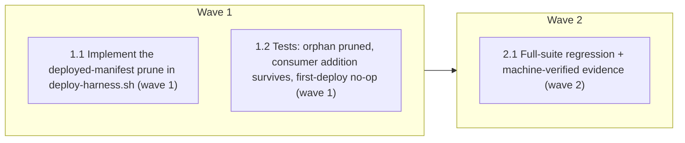

# deploy-harness: prune deleted-skill orphans (deployed-manifest, safe by construction)

<!-- AT-A-GLANCE:BEGIN (generated — do not edit; refreshed by render_plan.py --summarize) -->
## At a glance

**3 tasks · 2 waves · 3 files · 0/3 done**

| Wave | Task | Title | Files | Done (acceptance) |
|---|---|---|---|---|
| 1 | 1.1 | Implement the deployed-manifest prune in deploy-harness.sh (wave 1) | scripts/deploy-harness.sh | deploy writes `.harness-deployed`, prunes previous-manifest orphans only, shape-… |
| 1 | 1.2 | Tests: orphan pruned, consumer addition survives, first-deploy no-op (wave 1) | tests/scripts/deploy-prune.test.sh | all cases pass — orphan pruned, consumer skill + sidecars + backups survive, fir… |
| 2 | 2.1 | Full-suite regression + machine-verified evidence (wave 2) | specs/deploy-prune-orphans/SUMMARY.md | ALL GREEN; evidence machine-verified. |

### Progress
- [ ] 1.1 — Implement the deployed-manifest prune in deploy-harness.sh (wave 1)
- [ ] 1.2 — Tests: orphan pruned, consumer addition survives, first-deploy no-op (wave 1)
- [ ] 2.1 — Full-suite regression + machine-verified evidence (wave 2)
<!-- AT-A-GLANCE:END -->

## 1. Motivation

`deploy-harness.sh` never removes `.claude/` copies of harness entries deleted from source (surfaced by the lingering `.claude/skills/bootstrap-xia2/`). A naive prune would delete consumer additions — the documented data-loss hazard. Fix via a per-deploy manifest so the harness prunes only what it previously deployed. Research: `research-brief.md`; design: `design.md`.

## 2. Non-goals

No change to copy/protected-file/settings-merge logic. No retroactive prune (first post-fix deploy writes the manifest, prunes nothing). No `.gitignore` change (`.claude/` already ignored).

## 3. Success Criteria

- A harness entry deleted from source is pruned from `.claude/` on the next deploy.
- A consumer's custom skill in `.claude/skills/` (absent from source) **survives** a re-sync.
- Sidecars / `.harness-backup-*` / `settings.local.json` / `agent-memory/` / `worktrees/` are never pruned.
- First deploy (no prior manifest) prunes nothing; `--dry-run` writes nothing.
- Full suite + resync/install suites green.

## 4. Tasks

### Task 1.1 — Implement the deployed-manifest prune in deploy-harness.sh (wave 1)

- **Files:** scripts/deploy-harness.sh
- **Action:** Per design.md. (a) Before the copy loop, read `PREV_MANIFEST` from `$OUT/.harness-deployed` (empty if absent). (b) In `copy_dir` (and the protected paths), record each top-level `<dir>/<entry>` written into a `DEPLOYED` accumulator (a file or array; avoid subshell scope loss — append to a temp file). (c) After the copy loop + strip_archive, run a prune pass: for each path in PREV_MANIFEST not in DEPLOYED, if its shape starts with one of `skills/ agents/ hooks/ rules/ templates/`, `rm -rf "$OUT/$path"` and report `pruned <path>`. (d) Write DEPLOYED to `$OUT/.harness-deployed`. On `--dry-run`, compute and report would-be prunes read-only (no rm, no manifest write) — hook into the existing dry-run report path. Keep never-prune invariants: only PREV_MANIFEST∖DEPLOYED, shape-guarded.
- **Verify:** `bash -c 'bash -n scripts/deploy-harness.sh && grep -q "harness-deployed" scripts/deploy-harness.sh'`
- **Done:** deploy writes `.harness-deployed`, prunes previous-manifest orphans only, shape-guarded; syntax valid.

### Task 1.2 — Tests: orphan pruned, consumer addition survives, first-deploy no-op (wave 1)

- **Files:** tests/scripts/deploy-prune.test.sh
- **Action:** New suite (source tests/lib.sh, deploy from real $ROOT to mktemp targets). Cases: (1) deploy, add a fake source skill dir? — instead: deploy to target, then simulate a deleted source entry by deploying a first time (manifest written), inject a stale `.claude/skills/_ghost` recorded as if harness-deployed, and confirm a re-sync where source lacks it prunes it; simplest robust construction: first deploy writes manifest listing real skills; manually append a bogus `skills/_ghost` to `$T/.claude/.harness-deployed` and create `$T/.claude/skills/_ghost`, re-deploy, assert `_ghost` pruned (it's in prev-manifest, not in source). (2) create `$T/.claude/skills/consumer-custom/` NOT in any manifest, re-deploy, assert it SURVIVES (never in manifest). (3) fresh target, first deploy: assert `.harness-deployed` exists and nothing under a synced dir was deleted. (4) create `$T/.claude/skills/xia2.harness-incoming` + `$T/.claude/.harness-backup-x/`, re-deploy, assert both survive.
- **Verify:** `bash tests/scripts/deploy-prune.test.sh`
- **Done:** all cases pass — orphan pruned, consumer skill + sidecars + backups survive, first deploy no-op.

### Task 2.1 — Full-suite regression + machine-verified evidence (wave 2)

- **Files:** specs/deploy-prune-orphans/SUMMARY.md
- **Action:** Run the full suite (incl. resync-conflict + install suites — must stay green). Fill the SUMMARY Verify table with pipe-free re-runnable commands; confirm `verify_summary.py --check deploy-prune-orphans` exit 0.
- **Verify:** `bash -c 'bash scripts/run-tests.sh && python3 scripts/verify_summary.py --check deploy-prune-orphans'`
- **Done:** ALL GREEN; evidence machine-verified.

## 5. Risks

- Deletion in the installer — highest care. Safe-by-construction (prune ⊆ prev-manifest), shape-guard, dry-run no-write, load-bearing consumer-survives test (design.md Risks).
- resync-conflict.test.sh exercises deploy heavily — the prune pass must not disturb protected-file/sidecar behavior; Task 2.1's full suite is the backstop.

## 6. Status Log

- 2026-07-17 — research + design + plan written after the bug surfaced during a real `.claude/` re-sync. status proposed. Targets v3.
- 2026-07-17 — executed 1.1–1.3 + 2.1 on `feat/deploy-prune-orphans`. Deployed-manifest prune implemented (safe by construction); 6-case test suite incl. the load-bearing consumer-survives case; resync + install suites unaffected; full suite ALL GREEN; verify_summary --check exit 0.
