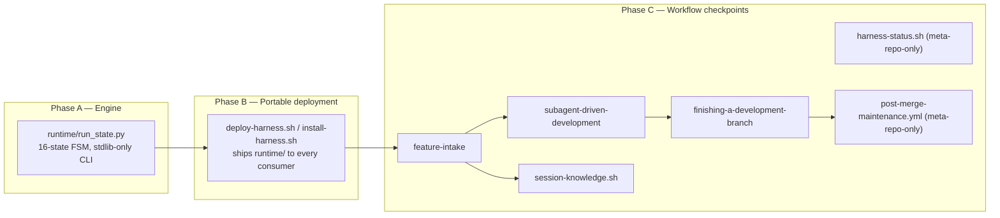

# Durable Run State — Design (canonical, GitHub issue #129)

Consolidated design account for the whole Durable Run State Contract (Phases A–D). Real design
decisions were made and recorded in each phase's own `design.md`
(`specs/gh-129-durable-run-state-phase-{b,c}/design.md` — Phase A predates a `design.md`
requirement for its lane). This file cross-references them rather than re-deciding anything.

## 1. Architecture overview

## 2. Ownership boundary with `specs/STATE.md`

See `specs/STATE.md` → `## RUN/Event State vs. This File` (Phase D, Task 1.1) for the full
table. Summary: `STATE.md` is session-scoped and human-focused; `RUN.json`/`events.jsonl` is
per-spec-slug and durable across sessions. Neither reads nor writes the other's files.

## 3. Portability boundary

Checkpoints 1–6 (per `specs/gh-129-durable-run-state-phase-c/design.md` §3) are portable —
shipped to every consuming repo via Phase B's deploy/install registration. Checkpoints 7–8
(`harness-status.sh`, `post-merge-maintenance.yml`) are meta-repo-only tooling: `scripts/` and
`.github/workflows/` are never distributed (confirmed via direct grep of
`SYNCED_DIRS_RE`/`PAYLOAD` in both distribution scripts — neither references `.github` or a
bare `scripts/`).

## 4. Known, disclosed limitations

See `research-brief.md` → "Known, disclosed limitations." Both are Phase C findings, both
explicitly deferred (one advisory/scored-below-fix-threshold, one by direct user decision) —
not re-opened here.

## 5. Non-goals

See `PLAN.md` §2 (issue #129's Phase D Non-goals, quoted verbatim) — this design doc does not
restate them to avoid drift between two copies.
