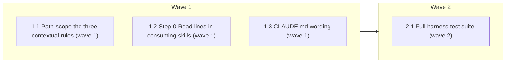

# Dynamic (On-Demand) Rule Loading — Phases 0–2

<!-- AT-A-GLANCE:BEGIN (generated — do not edit; refreshed by render_plan.py --summarize) -->
## At a glance

**4 tasks · 2 waves · 8 files · 0/4 done**

| Wave | Task | Title | Files | Done (acceptance) |
|---|---|---|---|---|
| 1 | 1.1 | Path-scope the three contextual rules (wave 1) | rules/plan-format.md, rules/wave-parallelism.md, rules/auto-correct-scope.md | All three files start with a `paths:` frontmatter block; lint passes. |
| 1 | 1.2 | Step-0 Read lines in consuming skills (wave 1) | skills/writing-plans/SKILL.md, skills/executing-plans/SKILL.md, skills/subagent-driven-development/SKILL.md | Each of the three skills contains an explicit Read instruction for its rule(s). |
| 1 | 1.3 | CLAUDE.md wording (wave 1) | CLAUDE.md | CLAUDE.md describes the two-tier loading model in one sentence. |
| 2 | 2.1 | Full harness test suite (wave 2) | scripts/lint-doc-truth.sh | Suite exits 0. |

### Progress
- [ ] 1.1 — Path-scope the three contextual rules (wave 1)
- [ ] 1.2 — Step-0 Read lines in consuming skills (wave 1)
- [ ] 1.3 — CLAUDE.md wording (wave 1)
- [ ] 2.1 — Full harness test suite (wave 2)
<!-- AT-A-GLANCE:END -->

## 1. Motivation

All 7 rules auto-load every session (~27.6 KB ≈ 7k tokens); ~55% is contextual. Research:
`docs/research/harness-review-improvements/2026-07-21-dynamic-rule-loading-research.md`. Phase 0 (done, see Status Log)
confirmed `paths:` frontmatter is supported in Claude Code v2.1.216: scoped rules skip
session-start load and inject on Read of a matching file — but NOT on Write of a new file,
so explicit skill Step-0 Read lines are load-bearing for the plan-authoring flow.

## 2. Non-goals

- Phase 3 (orchestration.md core split) — deferred to its own change with a blind-run eval.
- Hook-injected context (`additionalContext`) — rejected as default mechanism.
- Syncing `.claude/` in this repo (deploy is user-confirmed, per standing memory).

## 3. Success Criteria

- `plan-format.md`, `wave-parallelism.md`, `auto-correct-scope.md` carry `paths:` frontmatter.
- Consuming skills instruct an explicit Read of the rules they depend on.
- `bash scripts/run-tests.sh` green; CLAUDE.md wording no longer implies all rules are always-on.

## 4. Tasks

### Task 1.1 — Path-scope the three contextual rules (wave 1)

- **Files:** rules/plan-format.md, rules/wave-parallelism.md, rules/auto-correct-scope.md
- **Action:** Prepend YAML frontmatter: `paths: ["specs/**/PLAN.md"]` for plan-format and
  wave-parallelism; `paths: ["specs/**"]` for auto-correct-scope (it activates whenever a
  spec's PLAN/SUMMARY is read during execution). Body text unchanged.
- **Verify:** `bash scripts/lint-doc-truth.sh`
- **Done:** All three files start with a `paths:` frontmatter block; lint passes.

### Task 1.2 — Step-0 Read lines in consuming skills (wave 1)

- **Files:** skills/writing-plans/SKILL.md, skills/executing-plans/SKILL.md, skills/subagent-driven-development/SKILL.md
- **Action:** Add an explicit "Read `.claude/rules/<rule>.md` now (path-scoped — not
  auto-loaded)" instruction at the point each skill first depends on the rule: writing-plans →
  plan-format; executing-plans Step 0 → plan-format + wave-parallelism; subagent-driven-development
  → auto-correct-scope (+ wave-parallelism where waves are dispatched). Keep edits to the
  minimal lines; do not restate rule content.
- **Verify:** `grep -rlq "not auto-loaded" skills/writing-plans/SKILL.md skills/executing-plans/SKILL.md skills/subagent-driven-development/SKILL.md`
- **Done:** Each of the three skills contains an explicit Read instruction for its rule(s).

### Task 1.3 — CLAUDE.md wording (wave 1)

- **Files:** CLAUDE.md
- **Action:** Amend the Behavioral Guidelines line: behavior.md still auto-loads; add a clause
  that contextual rules (plan-format, wave-parallelism, auto-correct-scope) are path-scoped
  via `paths:` frontmatter and load on demand.
- **Verify:** `grep -q "path-scoped" CLAUDE.md`
- **Done:** CLAUDE.md describes the two-tier loading model in one sentence.

### Task 2.1 — Full harness test suite (wave 2)

- **Files:** scripts/lint-doc-truth.sh
- **Verify:** `bash scripts/run-tests.sh`
- **Action:** Run the full suite CI runs; fix any doc-truth/lint fallout from waves 1 —
  including review finding 4: stale "auto-load every session" comment in lint-doc-truth.sh.
- **Done:** Suite exits 0.

## 5. Risks

- Frontmatter on rule files could confuse a consumer below v2.1.198 → fails safe (rule stays
  always-on; frontmatter rendered as text). Noted in research doc caveat A2.
- Subagent trigger behavior of `paths:` unconfirmed (caveat A3) — mitigated: dispatch prompts
  already inject rule paths and subagents Read them (mechanism B covers subagents).
- This repo's own `.claude/rules/` copies drift until the user runs deploy — behavior change
  takes effect in consumer repos / after deploy, not in the current session.

## 6. Status Log

- 2026-07-21 — Phase 0 empirical test (scratchpad mini-project, v2.1.216): scoped rule absent
  at session start (T1 ✅), injected after Read of matching file (T2 ✅), NOT injected after
  Write of a new matching file (T3 ❌) → skill Read lines are load-bearing for authoring flows.
- 2026-07-21 — status: active; executing waves 1–2 in-place on `feat/dynamic-rule-loading`.
- 2026-07-21 — waves 1–2 complete, commit `60286de`. Suite ALL GREEN ×2; reviewer two-pass
  PASS/PASS (finding 3: deploy of `.claude/rules/` pending human confirmation; finding 4 fixed).
- 2026-07-21 — shipped via `feat/dynamic-rule-loading` (PR #141)
- 2026-07-21 — Codex P1 addressed (commit `d61e155`): implementer-prompt.md now Reads the
  path-scoped auto-correct-scope rule explicitly.
- 2026-07-21 — deployed (`deploy-harness.sh --yes`) + post-deploy end-to-end verification:
  T1/T2/T3 canary probes on the real `.claude/rules/` all match the tiered spec (see SUMMARY
  → Post-deploy verification).
