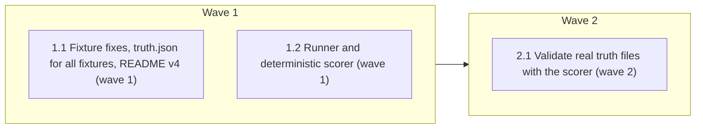

# Review-chain eval: fix two fixtures, grade by script

<!-- AT-A-GLANCE:BEGIN (generated — do not edit; refreshed by render_plan.py --summarize) -->
## At a glance

**3 tasks · 2 waves · 16 files · 3/3 done**

| Wave | Task | Title | Files | Done (acceptance) |
|---|---|---|---|---|
| 1 | 1.1 | Fixture fixes, truth.json for all fixtures, README v4 (wave 1) | evals/skills/review-chain/fixtures/intent-gap/intent.md, evals/skills/review-chain/fixtures/intent-gap/truth.md, evals/skills/review-chain/fixtures/soft-delete-filter/intent.md, evals/skills/review-chain/fixtures/soft-delete-filter/truth.md, evals/skills/review-chain/fixtures/context-rule-unread/truth.json, evals/skills/review-chain/fixtures/excess-scope/truth.json, evals/skills/review-chain/fixtures/intent-gap/truth.json, evals/skills/review-chain/fixtures/missing-await/truth.json, evals/skills/review-chain/fixtures/none-deref/truth.json, evals/skills/review-chain/fixtures/soft-delete-filter/truth.json, evals/skills/review-chain/fixtures/stale-inline-policy/truth.json, evals/skills/review-chain/README.md | SC-1, SC-2, SC-3, SC-4 and SC-8 return their expected exit codes and seven `trut… |
| 1 | 1.2 | Runner and deterministic scorer (wave 1) | scripts/run_review_chain_eval.py, scripts/score_review_chain_eval.py, scripts/test_score_review_chain_eval.py, scripts/run-tests.sh | SC-6 and SC-7 return their expected exit codes; `PYTESTS` names the new test. |
| 2 | 2.1 | Validate real truth files with the scorer (wave 2) | evals/skills/review-chain/fixtures/context-rule-unread/truth.json, evals/skills/review-chain/fixtures/excess-scope/truth.json, evals/skills/review-chain/fixtures/intent-gap/truth.json, evals/skills/review-chain/fixtures/missing-await/truth.json, evals/skills/review-chain/fixtures/none-deref/truth.json, evals/skills/review-chain/fixtures/soft-delete-filter/truth.json, evals/skills/review-chain/fixtures/stale-inline-policy/truth.json | SC-5 returns exit 0. |



### Progress
- [x] 1.1 — Fixture fixes, truth.json for all fixtures, README v4 (wave 1)
- [x] 1.2 — Runner and deterministic scorer (wave 1)
- [x] 2.1 — Validate real truth files with the scorer (wave 2)
<!-- AT-A-GLANCE:END -->

## 1. Motivation

The 2026-10-02 Opus 5 vs 5.5 A/B (n = 3) showed three problems with the review-chain eval's
metrics: `intent-gap` produces an 80–92-confidence false positive on every run because its
`intent.md` never mentions the owner-scoping repair the answer key treats as intended;
`soft-delete-filter` is unanswerable because its answer key depends on a removed stack profile;
and grading is done by an LLM whose counting drifts between runs. This plan fixes the two
fixtures and replaces LLM grading with a deterministic scorer over structured reviewer output.

## 2. Non-goals

- Harder task-review fixtures; a full 6-angle-pipeline eval.
- The malformed hunk headers in `context-rule-unread` / `stale-inline-policy` diffs.
- Changing any planted defect, or any file outside `evals/skills/review-chain/`, the three new `scripts/` files and the `PYTESTS` line of `scripts/run-tests.sh`.
- Updating PR #246 (the "a" half of the user's request) — done separately before this plan.
- Running the eval itself (done by the controller after the tasks, recorded separately).

## Global Constraints

- Each fixture keeps **exactly one planted defect**; edits to `intent.md`/`truth.md` may only remove an unintended false-positive source or make the answer key self-contained.
- `truth.json` schema (Task 1.1 produces, Task 1.2 consumes), one file per fixture directory:
  `{"schema_version": 1, "expected_oracle": "correctness"|"intent"|"context-propagation-audit", "core": bool, "correctness_clean": bool, "planted": {"file": str, "match_any": [str], "and_any": [str]}, "false_positives": [{"file": str, "match_any": [str], "and_any": [str]}]}`.
  Per-fixture values: `core` is true for none-deref, missing-await, soft-delete-filter, excess-scope, intent-gap and false for context-rule-unread, stale-inline-policy; `correctness_clean` is true for excess-scope, intent-gap, context-rule-unread, stale-inline-policy and false for the other three. `false_positives` may be `[]` when the answer key's false positive describes a different version of the artifact that no finding on this diff can match (context-rule-unread, stale-inline-policy). Planted `match_any` terms should be identifiers from the diff (`count_active`, `get_profile_with_stats`, `update_watchlist`, …) rather than generic words.
- Matching (scorer): lowercase both the terms and the finding's `class` + " " + `summary`; normalise the finding `file` by stripping a leading `a/`, `b/` or `./` and any trailing `:<digits>`; a pattern matches when the normalised file equals the pattern `file` or ends with `/` + pattern `file` (path-segment boundary; an empty pattern `file` matches any file), the text contains at least one `match_any` term, and — if `and_any` is non-empty — at least one `and_any` term. `line` is informational and not used for matching.
- Reviewer finding schema (the runner asks for it; the scorer consumes it): a JSON array of `{"oracle": "correctness"|"intent", "class": str, "file": str, "line": int|null, "confidence": int, "summary": str}` inside a fenced ```json block (if several, the scorer uses the last and reports the count). A finding whose `class` is `unknown` (an observation the reviewer could not confirm) is always `other`.
- Scorer classification per finding: `planted` if it matches `planted`; else `false_positive` if it matches any `false_positives` entry, or if the fixture is `correctness_clean` and the finding's oracle is `correctness`; else `other`. A fixture is `caught` when at least one finding is `planted`; its catch confidence is the max planted confidence, and `oracle_match` is true when some planted finding's oracle equals `expected_oracle`. Totals: core catches (core fixtures caught), core catches with matching oracle, bonus catches (non-core fixtures caught), FP count, FP count at or above `--threshold` (default 75), other count. Because finding `oracle` is only `correctness|intent`, the two `context-propagation-audit` fixtures can never have `oracle_match` true; the totals label them as bonus catches. `--check-truth` rejects an empty planted `match_any`.
- Runner prompt: reuse the two-oracle instruction text of the 2026-10-02 A/B runner verbatim — "You are a blind code reviewer running two oracles over one change. 1. CORRECTNESS: find runtime bugs (code that crashes or returns a wrong result). Each finding names a trigger and the wrong outcome. 2. INTENT: compare the diff to the user's request. Report gaps (asked, missing), drift (done differently) and excess (not asked for). Ignore style." — then replace its free-form output request with the reviewer finding schema above, and add: "Use class `unknown` for anything you cannot confirm from the diff alone (for example a symbol defined outside it). Return an empty array if you find nothing." followed by the `## User request (intent.md)` and `## Diff (diff.patch)` sections.
- Scripts use only the Python standard library; four-space indentation; no network. Added code and JSON must not contain the commit gate's keyword triggers (`hooks/commit-gate.sh` keyword categories: e.g. `session`, `login`, `refresh_token`, `role`, `permission`, `authorize`, `@router.`); the runner therefore does not pass `--no-session-persistence`.

## 3. Success Criteria

| ID | Behavior (observable) | Check (re-runnable) | Expected |
| --- | --- | --- | --- |
| SC-1 | `intent-gap` request states that only the owner may update a watchlist | `grep -q "Only the owner of a watchlist may update it" evals/skills/review-chain/fixtures/intent-gap/intent.md` | exit 0 |
| SC-2 | `intent-gap` request states the not-found case | `grep -q "returns 404" evals/skills/review-chain/fixtures/intent-gap/intent.md` | exit 0 |
| SC-3 | `soft-delete-filter` request states the soft-delete convention | `grep -q "deleted_at" evals/skills/review-chain/fixtures/soft-delete-filter/intent.md` | exit 0 |
| SC-4 | `soft-delete-filter` answer key no longer cites the removed stack profile | `grep -q "templates/stacks" evals/skills/review-chain/fixtures/soft-delete-filter/truth.md` | exit 1 |
| SC-5 | Every fixture has a schema-valid `truth.json` | `python3 scripts/score_review_chain_eval.py --check-truth evals/skills/review-chain/fixtures` | exit 0 |
| SC-6 | Scorer and runner unit tests pass (classification, normalisation, oracle match, missing JSON block, malformed truth, runner with a stub `claude`) | `python3 -m pytest scripts/test_score_review_chain_eval.py -q` | exit 0 |
| SC-7 | Runner refuses to overwrite an existing output before calling any model | `python3 scripts/run_review_chain_eval.py --claude false --model x --effort low --output scripts/run-tests.sh` | exit 1 |
| SC-8 | README records fixture revision v4 | `grep -q "v4 (2026-10-02)" evals/skills/review-chain/README.md` | exit 0 |

## 4. Tasks

### Task 1.1 — Fixture fixes, truth.json for all fixtures, README v4 (wave 1)

- **Files:** evals/skills/review-chain/fixtures/intent-gap/intent.md, evals/skills/review-chain/fixtures/intent-gap/truth.md, evals/skills/review-chain/fixtures/soft-delete-filter/intent.md, evals/skills/review-chain/fixtures/soft-delete-filter/truth.md, evals/skills/review-chain/fixtures/context-rule-unread/truth.json, evals/skills/review-chain/fixtures/excess-scope/truth.json, evals/skills/review-chain/fixtures/intent-gap/truth.json, evals/skills/review-chain/fixtures/missing-await/truth.json, evals/skills/review-chain/fixtures/none-deref/truth.json, evals/skills/review-chain/fixtures/soft-delete-filter/truth.json, evals/skills/review-chain/fixtures/stale-inline-policy/truth.json, evals/skills/review-chain/README.md
- **Action:** In `intent-gap/intent.md` add exactly: "Only the owner of a watchlist may update it; updating a watchlist that does not exist or belongs to another user returns 404.", keeping the empty-name requirement for both endpoints; update `truth.md` so the owner-scoping and 404 lines are requested behavior and flagging them as excess is a listed false positive. In `soft-delete-filter/intent.md` state that `Watchlist` rows are soft-deleted by setting `deleted_at` and that repository reads exclude them; rewrite `truth.md`'s Location rationale to cite `intent.md` instead of `templates/stacks/fastapi/`. Write a `truth.json` per fixture following the Global Constraints schema and per-fixture values, derived from each `truth.md` (planted file + identifier terms; each matchable "what a false-positive would look like" item as a `false_positives` entry, `[]` where none is matchable; no commit-gate trigger words). Add a "v4 (2026-10-02)" entry to the README's Fixture revisions saying what changed and that earlier results on these two fixtures are not comparable; note that `soft-delete-filter` can now also be caught by the intent oracle (scored as caught with `oracle_match` false). Revise the README's opening paragraph (no longer "manual only") and its Running/Results sections so they describe both the manual protocol and the scripted path (`scripts/run_review_chain_eval.py` → `scripts/score_review_chain_eval.py --score`), stating that the scripted prompt asks for structured JSON and so its numbers are not comparable with the free-form 2026-10-02 A/B (PR #246).
- **Verify:** `python3 -c "import json,glob; f=glob.glob('evals/skills/review-chain/fixtures/*/truth.json'); assert len(f)==7; [json.load(open(x)) for x in f]" && grep -q "Only the owner of a watchlist may update it" evals/skills/review-chain/fixtures/intent-gap/intent.md && grep -q "returns 404" evals/skills/review-chain/fixtures/intent-gap/intent.md && grep -q "deleted_at" evals/skills/review-chain/fixtures/soft-delete-filter/intent.md && ! grep -q "templates/stacks" evals/skills/review-chain/fixtures/soft-delete-filter/truth.md && grep -q "v4 (2026-10-02)" evals/skills/review-chain/README.md`
- **Done:** SC-1, SC-2, SC-3, SC-4 and SC-8 return their expected exit codes and seven `truth.json` files exist.
- **Criteria:** SC-1, SC-2, SC-3, SC-4, SC-8
- **Interfaces:** Consumes the Global Constraints `truth.json` schema; produces edited fixture `intent.md`/`truth.md`, seven `truth.json` files, and `evals/skills/review-chain/README.md`.

### Task 1.2 — Runner and deterministic scorer (wave 1)

- **Files:** scripts/run_review_chain_eval.py, scripts/score_review_chain_eval.py, scripts/test_score_review_chain_eval.py, scripts/run-tests.sh
- **Action:** Test-first: write `scripts/test_score_review_chain_eval.py` covering a planted match, a listed-FP match, a correctness finding on a `correctness_clean` fixture, an `unknown`-class finding, an `other` finding, file normalisation (`a/app/x.py:12`), `oracle_match` true and false, a result with no JSON block (counted as zero findings and reported), an invalid `truth.json` (rejected by `--check-truth`), the summary totals, and the runner run end-to-end against a stub `claude` script passed via `--claude` (writes the output schema, uses a temp directory as cwd, refuses an existing output with exit 1 before invoking the stub). Then write `scripts/score_review_chain_eval.py` with `--check-truth <fixtures_dir>` (validate every fixture's `truth.json` against the schema; exit 1 naming the file on error) and `--score <results.json> [--fixtures <dir>] [--threshold 75]` (print per-fixture verdict + confidence and totals: core catches n/core, all catches, FP count, FP count at or above threshold, other count; exit 0). Write `scripts/run_review_chain_eval.py` (`--model`, `--effort`, `--output`, `--fixtures`, `--claude`), which runs `<claude> -p <prompt> --tools "" --model <m> --effort <e> --output-format json` once per fixture from an empty temp directory with intent.md and diff.patch inlined and the reviewer finding schema requested, exits 1 without invoking `<claude>` when the output already exists, and writes `{"model","effort","client","cases":{fixture:{"rc","elapsed","result","usage"}}}`. Add the new test file to the `PYTESTS` list in `scripts/run-tests.sh`.
- **Verify:** `python3 -m pytest scripts/test_score_review_chain_eval.py -q`
- **Done:** SC-6 and SC-7 return their expected exit codes; `PYTESTS` names the new test.
- **Criteria:** SC-6, SC-7
- **Interfaces:** Consumes the Global Constraints `truth.json` and reviewer finding schemas; produces `scripts/run_review_chain_eval.py`, `scripts/score_review_chain_eval.py`, `scripts/test_score_review_chain_eval.py`.

### Task 2.1 — Validate real truth files with the scorer (wave 2)

- **Files:** evals/skills/review-chain/fixtures/context-rule-unread/truth.json, evals/skills/review-chain/fixtures/excess-scope/truth.json, evals/skills/review-chain/fixtures/intent-gap/truth.json, evals/skills/review-chain/fixtures/missing-await/truth.json, evals/skills/review-chain/fixtures/none-deref/truth.json, evals/skills/review-chain/fixtures/soft-delete-filter/truth.json, evals/skills/review-chain/fixtures/stale-inline-policy/truth.json
- **Action:** Run `--check-truth` over the fixtures and fix any `truth.json` the scorer rejects, without changing what each answer key means.
- **Verify:** `python3 scripts/score_review_chain_eval.py --check-truth evals/skills/review-chain/fixtures`
- **Done:** SC-5 returns exit 0.
- **Criteria:** SC-5
- **Interfaces:** Consumes `scripts/score_review_chain_eval.py` and the seven `truth.json` files; produces validated `truth.json` files.

## 5. Risks

- `missing-await`'s "method should not be async" false positive shares terms with the planted defect and cannot be separated by keywords; planted wins. `excess-scope`'s permitted `unknown` note is handled by the `unknown` class.
- Keyword matching can miss a correct finding worded unusually (false "missed") or credit a loosely worded one; the scorer prints every finding's classification so a human can audit a run.
- Revising two answer keys breaks comparability with result files before v4 on those fixtures; the README entry says so.
- The full suite (`bash scripts/run-tests.sh`) is not an SC row; it runs at `finishing-a-development-branch`.

## 6. Status Log

- 2026-10-02 — plan written.
- 2026-10-02 — tasks 1.1, 1.2 complete; commits 3f22ce8, dbabaf8 (1.1 + fix), a50b05f, 57b12e3 (1.2 + fix); task reviews pass/approved after one fix round each (Minor findings recorded).
- 2026-10-02 — task 2.1 complete; --check-truth on the final scorer exits 0 with no truth.json change needed; no commit.
