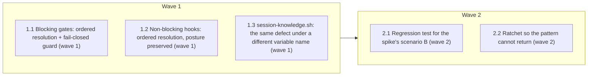

# PLAN — hook project-root resolution

Design: `design.md`. Lane: high-risk (hard gate `high-blast`, `hooks/*`).

<!-- AT-A-GLANCE:BEGIN (generated — do not edit; refreshed by render_plan.py --summarize) -->
## At a glance

**5 tasks · 2 waves · 11 files · 5/5 done**

| Wave | Task | Title | Files | Done (acceptance) |
|---|---|---|---|---|
| 1 | 1.1 | Blocking gates: ordered resolution + fail-closed guard (wave 1) | hooks/commit-quality-gate.sh, hooks/risk-corroboration.sh | Both suites pass; neither hook references `$SCRIPT_DIR` for a repo root. |
| 1 | 1.2 | Non-blocking hooks: ordered resolution, posture preserved (wave 1) | hooks/blast-radius-check.sh, hooks/branch-guard.sh, hooks/render-plan-on-write.sh, hooks/ruff-on-edit.sh, hooks/scope-gate.sh | All five suites pass; no hook changed its blocking posture. |
| 1 | 1.3 | session-knowledge.sh: the same defect under a different variable name (wave 1) | hooks/session-knowledge.sh | 16 existing cases pass; the widened ratchet reports clean. |
| 2 | 2.1 | Regression test for the spike's scenario B (wave 2) | tests/hooks/repo-root-resolution.test.sh | Suite passes against the fixed hooks and FAILS against `HEAD` hooks — a suite th… |
| 2 | 2.2 | Ratchet so the pattern cannot return (wave 2) | scripts/check-hook-root-source.sh, scripts/run-tests.sh | Exits 0 on the fixed tree and 1 when the old line is re-introduced. |



### Progress
- [x] 1.1 — Blocking gates: ordered resolution + fail-closed guard (wave 1)
- [x] 1.2 — Non-blocking hooks: ordered resolution, posture preserved (wave 1)
- [x] 1.3 — session-knowledge.sh: the same defect under a different variable name (wave 1)
- [x] 2.1 — Regression test for the spike's scenario B (wave 2)
- [x] 2.2 — Ratchet so the pattern cannot return (wave 2)
<!-- AT-A-GLANCE:END -->

## 1. Approach

Replace the `SCRIPT_DIR`-derived repo root with an ordered resolution in each of the 7 affected
hooks, and add a per-posture guard for the unresolvable case. `SCRIPT_DIR` stays for locating each
hook's own libraries.

```bash
# before
REPO_DIR="$(git -C "$SCRIPT_DIR" rev-parse --show-toplevel 2>/dev/null)"
[ -z "$REPO_DIR" ] && REPO_DIR="$(cd "$SCRIPT_DIR/.." && pwd)"

# after
REPO_DIR="${CLAUDE_PROJECT_DIR:-$(git rev-parse --show-toplevel 2>/dev/null)}"
[ -z "$REPO_DIR" ] && <per-posture guard from design.md Fork 2>
```

## 2. Tasks

### Task 1.1 — Blocking gates: ordered resolution + fail-closed guard (wave 1)

- **Files:** hooks/commit-quality-gate.sh, hooks/risk-corroboration.sh
- **Action:** Replace the `SCRIPT_DIR`-derived root with `${CLAUDE_PROJECT_DIR:-$(git rev-parse --show-toplevel)}`.
  When neither resolves, print a named reason and exit 2 — these two gates must never guess, because a
  wrong root makes them pass silently.
- **Verify:** `bash tests/hooks/risk-corroboration.test.sh`
- **Done:** Both suites pass; neither hook references `$SCRIPT_DIR` for a repo root.

### Task 1.2 — Non-blocking hooks: ordered resolution, posture preserved (wave 1)

- **Files:** hooks/blast-radius-check.sh, hooks/branch-guard.sh, hooks/render-plan-on-write.sh, hooks/ruff-on-edit.sh, hooks/scope-gate.sh
- **Action:** Same resolution order. On an unresolvable root, note it on stderr and exit 0 — these
  hooks are documented non-blocking in `CLAUDE.md` and must not start blocking.
  `blast-radius-check` keeps its existing `BLAST_RADIUS_STRICT=1` exit-2 path.
- **Verify:** `bash tests/hooks/blast-radius-check.test.sh`
- **Done:** All five suites pass; no hook changed its blocking posture.

### Task 2.1 — Regression test for the spike's scenario B (wave 2)

- **Files:** tests/hooks/repo-root-resolution.test.sh
- **Action:** Host each hook inside a *foreign* git repo whose staged content would trip a gate, run
  it with CWD set to a separate project, and assert it acts on the project. Cover both postures and
  the unresolvable-root case.
- **Verify:** `bash tests/hooks/repo-root-resolution.test.sh`
- **Done:** Suite passes against the fixed hooks and FAILS against `HEAD` hooks — a suite that passes
  both ways proves nothing.

### Task 1.3 — session-knowledge.sh: the same defect under a different variable name (wave 1)

- **Files:** hooks/session-knowledge.sh
- **Action:** Same ordered resolution. This hook spells the banned pattern `git -C "$HOOK_DIR"`,
  not `$SCRIPT_DIR`, so the first ratchet regex did not catch it and Task 1.1/1.2 missed it —
  found by the code review of PR #222. Guard is a silent `exit 0`: the hook runs with
  `exec 2>/dev/null` and is documented "never blocks / silent when empty".
- **Verify:** `bash tests/hooks/session-knowledge.test.sh`
- **Done:** 16 existing cases pass; the widened ratchet reports clean.

### Task 2.2 — Ratchet so the pattern cannot return (wave 2)

- **Files:** scripts/check-hook-root-source.sh, scripts/run-tests.sh
- **Action:** Grep `hooks/` for an own-location-derived root on non-comment lines; wire into
  `run-tests.sh` L1. Added mid-task: SC-1 named a checker that did not exist (Rule 2 deviation,
  recorded in SUMMARY). Regex widened after review to match **any** `*_DIR` variable, not the
  literal name `SCRIPT_DIR` — the narrow version passed while `session-knowledge.sh` was broken.
- **Verify:** `bash scripts/check-hook-root-source.sh`
- **Done:** Exits 0 on the fixed tree and 1 when the old line is re-introduced.

## 3. Success criteria

| ID | Behavior (observable) | Check (re-runnable) | Expected |
| --- | --- | --- | --- |
| SC-1 | No non-comment line in `hooks/` derives a repo root from its own location, under **any** variable name | `bash scripts/check-hook-root-source.sh` | exit 0 |
| SC-2 | The changed hooks keep their existing contracts — no regression in their own suites | `bash tests/hooks/risk-corroboration.test.sh` | exit 0 |
| SC-3 | A hook hosted inside a foreign git repo acts on the project, not on its host; and blocking gates refuse when no root resolves | `bash tests/hooks/repo-root-resolution.test.sh` | exit 0 |

SC-3 is the load-bearing one. SC-1 is traceability (a string is absent) and SC-2 only shows nothing
else broke. Only SC-3 re-runs the actual failure — and it was confirmed to **fail** (5 of 11 cases)
against the pre-fix hooks, so it discriminates rather than passing vacuously.

The whole-suite run (`scripts/run-tests.sh`) is deliberately absent from this table: the strict gate
re-runs each cell under a 60s cap and bans whole-suite invocations
(`docs/solutions/harness/verify-row-must-be-pipe-free-and-under-60s.md`). It is cited in SUMMARY prose.

## 4. Out of scope

- Fork 3 (SCRIPT_DIR/PROJECT_DIR mismatch diagnostics) — deferred, see design.md.
- Any marketplace/plugin manifest work — separate change, separate escalation.
- `check-untracked-py.sh` — CWD-based by design, not affected.

## Status Log

- 2026-09-09 — tasks 1.1, 1.2, 2.1, 2.2 complete; commit `6df5533`
- 2026-09-09 — task 1.3 complete (session-knowledge.sh, found by the code review of PR #222); commit `3a7e471`
- 2026-09-09 — compound records written; commit `4635c8b`
- 2026-09-09 — shipped as PR #221, merged `afdebdd`; released 2.22.0 (PR #224)
