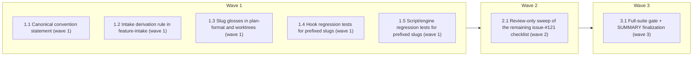

# Ticket-source prefix for spec folders (gh-121)

<!-- AT-A-GLANCE:BEGIN (generated — do not edit; refreshed by render_plan.py --summarize) -->
## At a glance

**7 tasks · 3 waves · 31 files · 7/7 done**

| Wave | Task | Title | Files | Done (acceptance) |
|---|---|---|---|---|
| 1 | 1.1 | Canonical convention statement (wave 1) | templates/structure/specs-README.md, specs/README.md | Both files state the three-form table, case rule, grandfathering, and branch inh… |
| 1 | 1.2 | Intake derivation rule in feature-intake (wave 1) | skills/feature-intake/SKILL.md | Derivation rule present with explicit precedence; no other section of the skill … |
| 1 | 1.3 | Slug glosses in plan-format and worktrees (wave 1) | rules/plan-format.md, skills/using-git-worktrees/SKILL.md | Both glosses in place; no other lines in either file changed. |
| 1 | 1.4 | Hook regression tests for prefixed slugs (wave 1) | tests/hooks/spec-prefix-compat.test.sh
app/foo.py
a.py | ok EOF } t "active PLAN.md in a gh-prefixed folder is found: out-of-scope edit w… |
| 1 | 1.5 | Script/engine regression tests for prefixed slugs (wave 1) | tests/scripts/spec-prefix-compat.test.sh | All cases pass (0 FAILED); no existing file modified; `run-tests.sh` untouched. |
| 2 | 2.1 | Review-only sweep of the remaining issue-#121 checklist (wave 2) | templates/SUMMARY.template.md, templates/ESCALATIONS.template.md, rules/orchestration.md, rules/auto-correct-scope.md, rules/wave-parallelism.md, skills/README.md, skills/writing-plans/SKILL.md, skills/executing-plans/SKILL.md, skills/subagent-driven-development/SKILL.md, skills/brainstorming/SKILL.md, skills/brainstorming/spec-document-reviewer-prompt.md, skills/correctness-review/SKILL.md, skills/correctness-review/correctness-reviewer-prompt.md, skills/correctness-review/correctness-scorer-prompt.md, skills/intent-review/SKILL.md, skills/intent-review/intent-reviewer-prompt.md, skills/finishing-a-development-branch/SKILL.md, skills/visual-planner/SKILL.md, skills/compound/SKILL.md, skills/compound/README.md, skills/compound/subagents/context-analyzer-prompt.md, skills/compound/subagents/decision-extractor-prompt.md, specs/gh-121-spec-ticket-prefix/SUMMARY.md | Every checklist file confirmed or corrected; outcome table in SUMMARY; doc-truth… |
| 3 | 3.1 | Full-suite gate + SUMMARY finalization (wave 3) | specs/gh-121-spec-ticket-prefix/SUMMARY.md, specs/gh-121-spec-ticket-prefix/PLAN.md | Suite prints `ALL GREEN`; SUMMARY evidence-complete (passes `python3 scripts/che… |



### Progress
- [x] 1.1 — Canonical convention statement (wave 1)
- [x] 1.2 — Intake derivation rule in feature-intake (wave 1)
- [x] 1.3 — Slug glosses in plan-format and worktrees (wave 1)
- [x] 1.4 — Hook regression tests for prefixed slugs (wave 1)
- [x] 1.5 — Script/engine regression tests for prefixed slugs (wave 1)
- [x] 2.1 — Review-only sweep of the remaining issue-#121 checklist (wave 2)
- [x] 3.1 — Full-suite gate + SUMMARY finalization (wave 3)
<!-- AT-A-GLANCE:END -->

## 1. Motivation

Spec folders (`specs/<slug>/`) carry no link to their originating ticket. Issue #121 adopts a
ticket-source prefix — `gh-<issue#>-<slug>` / `lin-<TICKET-ID>-<slug>`, plain `<slug>` for
ticket-less work — introduced at `/feature-intake`, with every referencing doc synced and every
gate *proved* (not assumed) compatible with prefixed names. Design: `design.md`. Research:
`research-brief.md` — key facts: all 10 specs-path parsers are slug-shape-agnostic (line-cited);
`run-tests.sh` auto-globs `tests/{hooks,scripts}/*.test.sh`, so new bash tests need no runner
edit; `tests/lib.sh` provides hermetic fixtures (`new_repo`, `stage`, `run_hook`, asserts).

## 2. Non-goals

No migration of existing folders (grandfathered — this feature's own folder is the sole,
already-done rename). No `adhoc-` prefix. No enforcement gate (declined — E002/enforcement).
No hook/script code changes. No prefix vocabulary beyond `gh-`/`lin-`.

## 3. Success Criteria

1. `/feature-intake` doc derives ticket-prefixed folder names (first match wins: gh → lin → plain).
2. Convention definition sites all state the same thing; docs that use `<slug>` opaquely are confirmed, not churned.
3. New regression tests prove prefixed slugs pass every gate; `bash scripts/run-tests.sh` fully green.
4. Zero behavior change for existing unprefixed folders (existing suite green, unmodified).

## 4. Tasks

> Execution notes for every task: edit **top-level** `skills/` / `rules/` / `templates/` sources —
> never the deployed `.claude/` copies. All tasks assume repo root as CWD. Wave 1 tasks are
> mutually file-disjoint and may run in parallel.

### Task 1.1 — Canonical convention statement (wave 1)

- **Files:** templates/structure/specs-README.md, specs/README.md
- **Action:** In **both** files, replace the two-line `## Slug Convention` body (currently:
  `` `specs/<slug>/` where `<slug>` is short kebab-case. Some projects prefix with date: `specs/YYYY-MM-DD/<slug>/`. ``
  plus the `Pick one convention…` line) with:

  ```markdown
  `specs/<name>/` where `<name>` is the spec folder name, derived at intake from the ticket source:

  | Ticket source | Folder name | Example |
  |---|---|---|
  | GitHub issue | `gh-<issue#>-<slug>` | `specs/gh-121-spec-folder-prefix/` |
  | Linear ticket | `lin-<TICKET-ID>-<slug>` | `specs/lin-ENG-315-user-quota/` |
  | No ticket | `<slug>` (plain) | `specs/fix-hook-matching/` |

  `<slug>` is short kebab-case in all three forms. The prefix and slug are lowercase; only the
  Linear ticket ID keeps its native (upper) case — do not normalize it. Folders created before
  this convention are grandfathered — never rename them; every gate treats the full folder name
  as an opaque slug (`specs/<anything>/`). Branch names inherit the prefix for free via
  `<type>/<slug>` (e.g. `feat/gh-121-spec-folder-prefix`).

  Some projects prefix with date instead: `specs/YYYY-MM-DD/<slug>/`. Pick one convention per
  repo and stick with it. This project uses: **ticket-source prefix** (table above) — update
  this line if you change it.
  ```

  Keep everything else in both files untouched (Files Per Spec, Lifecycle, State File sections).
- **Verify:** `grep -q 'gh-<issue#>-<slug>' templates/structure/specs-README.md && grep -q 'lin-<TICKET-ID>-<slug>' specs/README.md`
- **Done:** Both files state the three-form table, case rule, grandfathering, and branch inheritance; no other section changed.

### Task 1.2 — Intake derivation rule in feature-intake (wave 1)

- **Files:** skills/feature-intake/SKILL.md
- **Action:** In `## Arguments`, replace the line
  `` - `<slug>` — the spec directory (e.g. `specs/<slug>/`). If absent, derive a kebab-case slug. ``
  with:

  ```markdown
  - `<slug>` — the spec directory (e.g. `specs/<slug>/`). If absent, derive the folder name
    with a **ticket-source prefix** — first match wins, in this order:
    1. Request references a **GitHub issue** (URL, or `#N` resolvable in the working repo) →
       `gh-<N>-<slug>` (e.g. `specs/gh-121-spec-folder-prefix/`).
    2. Request references a **Linear ticket** (URL or `TEAM-###` identifier) →
       `lin-<TICKET-ID>-<slug>` — the ticket ID keeps its native case (e.g.
       `specs/lin-ENG-315-user-quota/`).
    3. No ticket → plain kebab-case `<slug>` (unchanged behavior).

    Canonical statement: `templates/structure/specs-README.md` → Slug Convention. Existing
    folders are grandfathered — never rename. Branch names (`<type>/<slug>`) inherit the
    prefix automatically because the slug carries it.
  ```
- **Verify:** `grep -q 'gh-<N>-<slug>' skills/feature-intake/SKILL.md && grep -q 'first match wins' skills/feature-intake/SKILL.md`
- **Done:** Derivation rule present with explicit precedence; no other section of the skill changed.

### Task 1.3 — Slug glosses in plan-format and worktrees (wave 1)

- **Files:** rules/plan-format.md, skills/using-git-worktrees/SKILL.md
- **Action:** Two one-line glosses:
  1. `rules/plan-format.md` — in the `## PLAN.md structure` frontmatter example, change
     `slug: <kebab-case>` to
     `slug: <kebab-case — may carry a ticket-source prefix (gh-<n>-…/lin-<ID>-…), see templates/structure/specs-README.md>`.
  2. `skills/using-git-worktrees/SKILL.md` — after the line
     `` - **`<slug>`** is kebab-case and SHOULD equal the `specs/<slug>` slug for this work, so the branch ``
     (and its continuation), append to that bullet: `A ticket-prefixed slug carries its prefix
     into the branch name unchanged (e.g. `feat/gh-121-spec-folder-prefix`).`
- **Verify:** `grep -q 'ticket-source prefix' rules/plan-format.md && grep -q 'gh-121-spec-folder-prefix' skills/using-git-worktrees/SKILL.md`
- **Done:** Both glosses in place; no other lines in either file changed.

### Task 1.4 — Hook regression tests for prefixed slugs (wave 1)

- **Files:** tests/hooks/spec-prefix-compat.test.sh
- **Action:** Create the file with the exact content below (patterned on the sibling tests;
  `run-tests.sh` auto-globs it — do NOT edit `run-tests.sh`), then `chmod +x` it:

  ```bash
  #!/bin/bash
  # Regression tests for issue #121: ticket-prefixed spec folders (specs/gh-<n>-<slug>/,
  # specs/lin-<TICKET-ID>-<slug>/) pass every hook exactly like plain slugs — proves the
  # grandfathering claim mechanically (gates parse specs/<anything>/, not slug shape).
  source "$(dirname "$0")/../lib.sh"

  GH="gh-999-fixture"
  LIN="lin-ENG-315-fixture"
  COMMIT_JSON=$(json_cmd 'git commit -m x')

  # ── commit-quality-gate.sh: Check 1.5 (escalations) slug extraction ──
  H=commit-quality-gate.sh

  t "Check 1.5: pending escalation in a gh-prefixed slug → BLOCKED"
  repo=$(new_repo $H)
  stage "$repo" "specs/$GH/SUMMARY.md" "Lane: normal"
  stage "$repo" "specs/$GH/ESCALATIONS.md" '## E001
  - decision: pending'
  run_hook "$repo" $H "$COMMIT_JSON"
  assert_rc_contains 2 "deny-on-no-response"

  t "Check 1.5: recorded decision in the gh-prefixed slug self-unblocks"
  repo=$(new_repo $H)
  stage "$repo" "specs/$GH/SUMMARY.md" "Lane: normal"
  stage "$repo" "specs/$GH/ESCALATIONS.md" '## E001
  - decision: A (accepted)'
  run_hook "$repo" $H "$COMMIT_JSON"
  assert_rc_contains 0 "Escalations... PASSED"

  # ── commit-quality-gate.sh: Check 1.6 (lane evidence) on a lin-prefixed SUMMARY ──
  LANE_PY="$ROOT/scripts/check_lane_evidence.py"
  LANE_BAD=$'Lane: normal\nConfidence: high\nReason: a real filled reason\n\n### Verify\n\n| Check | Command | Exit | Notes |\n| --- | --- | --- | --- |\n| p | `<command>` | 0 | placeholder only |\n'
  LANE_OK=$'Lane: normal\nConfidence: high\nReason: a real filled reason\n\n### Verify\n\n| Check | Command | Exit | Notes |\n| --- | --- | --- | --- |\n| p | `true` | 0 | a real command |\n'

  t "Check 1.6: lane evidence FAILS on a lin-prefixed SUMMARY and names its real path"
  repo=$(new_repo $H)
  mkdir -p "$repo/scripts"; cp "$LANE_PY" "$repo/scripts/"
  stage "$repo" "specs/$LIN/SUMMARY.md" "$LANE_BAD"
  run_hook "$repo" $H "$COMMIT_JSON"
  assert_rc_contains 2 "specs/$LIN/SUMMARY.md"

  t "Check 1.6: lane evidence PASSES on a lin-prefixed SUMMARY with a real row"
  repo=$(new_repo $H)
  mkdir -p "$repo/scripts"; cp "$LANE_PY" "$repo/scripts/"
  stage "$repo" "specs/$LIN/SUMMARY.md" "$LANE_OK"
  run_hook "$repo" $H "$COMMIT_JSON"
  assert_rc_contains 0 "Lane evidence... PASSED"

  # ── risk-corroboration.sh: Lane resolved from a staged gh-prefixed SUMMARY ──
  H=risk-corroboration.sh

  t "risk-corroboration reads Lane: high-risk from a gh-prefixed SUMMARY → corroborated"
  repo=$(new_repo $H)
  stage "$repo" "alembic/versions/abc_add_table.py" "def upgrade(): pass"
  stage "$repo" "specs/$GH/SUMMARY.md" "Lane: high-risk"
  run_hook "$repo" $H "$COMMIT_JSON"
  assert_rc_contains 0 "corroborated"

  t "risk-corroboration still blocks a low lane declared in a gh-prefixed SUMMARY"
  repo=$(new_repo $H)
  stage "$repo" "alembic/versions/abc_add_table.py" "def upgrade(): pass"
  stage "$repo" "specs/$GH/SUMMARY.md" "Lane: normal"
  run_hook "$repo" $H "$COMMIT_JSON"
  assert_rc_contains 2 "BLOCKED"

  # ── branch-isolation-guard.sh: specs/* exemption covers prefixed paths ──
  H=branch-isolation-guard.sh

  t "prefixed specs/ bookkeeping stays writable on main (intake exemption)"
  repo=$(new_repo $H)
  run_hook "$repo" $H "$(json_file "$repo/specs/$GH/SUMMARY.md")"
  assert_silent_ok

  t "code file on main is still denied (exemption not loosened by the fixture)"
  repo=$(new_repo $H)
  run_hook "$repo" $H "$(json_file "$repo/app/x.py")"
  assert_rc_contains 0 '"permissionDecision":"deny"'

  # ── blast-radius-check.sh: active-plan lookup finds a prefixed folder ──
  H=blast-radius-check.sh

  # prefixed_plan <repo> — active PLAN.md inside specs/$GH with app/foo.py in scope.
  # Markdown task syntax (not legacy XML): a fenced <task> XML literal inside THIS plan
  # would flip render_plan/blast-radius into XML mode on the real PLAN.md; markdown
  # fixtures keep the plan and the test file identical and safe.
  prefixed_plan() {
    mkdir -p "$1/specs/$GH"
    cat > "$1/specs/$GH/PLAN.md" <<'EOF'
  ---
  status: active
  ---
  ### Task 1.1 — t (wave 1)

  - **Files:** app/foo.py
  - **Action:** x
  - **Verify:** `true`
  - **Done:** ok
  EOF
  }

  t "active PLAN.md in a gh-prefixed folder is found: out-of-scope edit warns"
  repo=$(new_repo $H)
  prefixed_plan "$repo"
  run_hook "$repo" $H "$(json_file "$repo/app/rogue.py")"
  assert_rc_contains 0 "blast-radius"

  t "in-scope edit under the prefixed plan stays silent"
  repo=$(new_repo $H)
  prefixed_plan "$repo"
  run_hook "$repo" $H "$(json_file "$repo/app/foo.py")"
  assert_silent_ok

  # ── render-plan-on-write.sh: path filter matches a prefixed PLAN.md ──
  H=render-plan-on-write.sh

  if command -v python3 >/dev/null 2>&1 && [ -f "$ROOT/skills/visual-planner/render_plan.py" ]; then
    t "prefixed specs/<gh>/PLAN.md matches the path filter → PLAN.html rendered"
    repo=$(new_repo $H)
    mkdir -p "$repo/skills/visual-planner"
    cp "$ROOT/skills/visual-planner/render_plan.py" "$repo/skills/visual-planner/"
    [ -f "$ROOT/skills/visual-planner/template.html" ] && cp "$ROOT/skills/visual-planner/template.html" "$repo/skills/visual-planner/"
    mkdir -p "$repo/specs/$GH"
    cat > "$repo/specs/$GH/PLAN.md" <<'EOF'
  ---
  slug: gh-999-fixture
  status: active
  ---
  # Fixture
  ## 1. Motivation
  x
  ## 4. Tasks
  ### Task 1.1 — do (wave 1)

  - **Files:** a.py
  - **Action:** do
  - **Verify:** `true`
  - **Done:** ok
  EOF
    run_hook "$repo" $H "$(json_file "$repo/specs/$GH/PLAN.md")"
    if [ -f "$repo/specs/$GH/PLAN.html" ]; then pass
    else fail "rc=$RC html missing — out: $(echo "$OUT" | head -2 | tr '\n' ' ')"; fi
  else
    t "render-plan prefixed-path case"; skip "python3 or render engine unavailable"
  fi

  finish
  ```

  Note the heredoc bodies above are written here indented for plan readability — in the real
  file, heredoc content and its terminators (`EOF`) MUST start at column 0.
- **Verify:** `bash tests/hooks/spec-prefix-compat.test.sh`
- **Done:** All cases pass (0 FAILED; the render case may legitimately `skip` where python3 is absent); no existing file modified.

### Task 1.5 — Script/engine regression tests for prefixed slugs (wave 1)

- **Files:** tests/scripts/spec-prefix-compat.test.sh
- **Action:** Create the file with the exact content below (auto-globbed by `run-tests.sh`;
  do NOT edit `run-tests.sh`), then `chmod +x` it:

  ```bash
  #!/bin/bash
  # Regression tests for issue #121 (scripts half): bookkeeping, ci-strict-gate, and the
  # python gate engines resolve ticket-prefixed slugs (gh-/lin-) exactly like plain ones.
  source "$(dirname "$0")/../lib.sh"

  GH="gh-999-fixture"

  # ── bookkeeping.sh: slug extraction from a prefixed SUMMARY path ──
  SCRIPT="$ROOT/scripts/bookkeeping.sh"

  t "bookkeeping extracts the full prefixed folder name as the ledger slug"
  d=$(mktemp -d); _CLEANUP_DIRS+=("$d")
  printf '0.2.0\n' > "$d/VERSION"
  mkdir -p "$d/docs/harness-experimental"
  printf '# Trust Metrics Ledger\n\n## Ledger\n\n| Date | Slug | Lane | Affects | Confidence | Flags | Escalated | Outcome | Notes |\n|---|---|---|---|---|---|---|---|---|\n| 2026-06-14 | old | normal | - | high | none | no | shipped | seed |\n' > "$d/docs/harness-experimental/trust-metrics.md"
  printf '# Changelog\n\n## [Unreleased]\n\n## [0.2.0] — 2026-06-14\n\n### Changed\n- seed\n' > "$d/CHANGELOG.md"
  mkdir -p "$d/specs/$GH"
  printf 'Lane: high-risk\nConfidence: medium\nFlags: none\nAffects: hooks/foo.sh\n' > "$d/specs/$GH/SUMMARY.md"
  bash "$SCRIPT" --pr 7 --title T --sha s --files "specs/$GH/SUMMARY.md" --date 2026-07-20 --root "$d" >/dev/null
  row=$(tail -1 "$d/docs/harness-experimental/trust-metrics.md")
  if echo "$row" | grep -q "$GH" && echo "$row" | grep -q 'high-risk'; then pass
  else fail "ledger row missing prefixed slug/lane: $row"; fi

  # ── ci-strict-gate.sh: changed-SUMMARY regex matches a prefixed path ──
  GATE="$ROOT/scripts/ci-strict-gate.sh"
  VERIFY_PY="$ROOT/scripts/verify_summary.py"

  # mkrepo → fresh repo with verify_summary.py and one base commit (mirrors ci-strict-gate.test.sh)
  mkrepo() {
    local r; r=$(mktemp -d); _CLEANUP_DIRS+=("$r")
    git -C "$r" init -q -b main 2>/dev/null || git -C "$r" init -q
    git -C "$r" config user.email t@t; git -C "$r" config user.name t
    mkdir -p "$r/scripts"; cp "$VERIFY_PY" "$r/scripts/"
    echo "seed" > "$r/README.md"
    git -C "$r" add -A >/dev/null 2>&1; git -C "$r" commit -qm base
    echo "$r"
  }
  # write_summary <repo> <lane> <cmd> — SUMMARY.md inside the PREFIXED slug
  write_summary() {
    mkdir -p "$1/specs/$GH"
    {
      echo "# $GH"
      echo "Lane: $2"
      echo ""
      echo "### Verify"
      echo ""
      echo "| Check | Command | Exit | Notes |"
      echo "| --- | --- | --- | --- |"
      [ -n "$3" ] && echo "| ok | $3 | 0 | n |"
    } > "$1/specs/$GH/SUMMARY.md"
  }
  commit_run() {
    local r="$1" base
    base=$(git -C "$r" rev-parse HEAD)
    git -C "$r" add -A >/dev/null 2>&1
    git -C "$r" commit -qm change
    OUT=$(cd "$r" && bash "$GATE" "$base" 2>&1); RC=$?
  }

  t "ci-strict-gate: hooks/ diff + high-risk SUMMARY in a prefixed folder → PASS"
  r=$(mkrepo)
  mkdir -p "$r/hooks"; echo '#!/bin/bash' > "$r/hooks/foo.sh"
  write_summary "$r" "high-risk" "test 1 = 1"
  commit_run "$r"
  assert_rc 0

  t "ci-strict-gate: same diff, prefixed SUMMARY below high-risk → BLOCK (regex matched it)"
  r=$(mkrepo)
  mkdir -p "$r/hooks"; echo '#!/bin/bash' > "$r/hooks/foo.sh"
  write_summary "$r" "normal" "test 1 = 1"
  commit_run "$r"
  assert_rc 1

  # ── python engines: prefixed slug → specs/<slug>/SUMMARY.md path join ──
  if command -v python3 >/dev/null 2>&1; then
    t "check_lane_evidence.py resolves a prefixed slug via specs_root"
    d2=$(mktemp -d); _CLEANUP_DIRS+=("$d2")
    mkdir -p "$d2/specs/$GH"
    printf 'Lane: tiny\nConfidence: high\nReason: a real filled reason\n' > "$d2/specs/$GH/SUMMARY.md"
    OUT=$(python3 -c "
  import sys
  from pathlib import Path
  sys.path.insert(0, '$ROOT/scripts')
  from check_lane_evidence import main
  sys.exit(main(['$GH'], specs_root=Path('$d2/specs')))
  " 2>&1); RC=$?
    assert_rc 0

    t "check_lane_evidence.py fails a prefixed slug whose evidence is missing (resolution really happened)"
    d3=$(mktemp -d); _CLEANUP_DIRS+=("$d3")
    mkdir -p "$d3/specs/$GH"
    printf 'Lane: high-risk\nConfidence: medium\nReason: r\n' > "$d3/specs/$GH/SUMMARY.md"
    OUT=$(python3 -c "
  import sys
  from pathlib import Path
  sys.path.insert(0, '$ROOT/scripts')
  from check_lane_evidence import main
  sys.exit(main(['$GH'], specs_root=Path('$d3/specs')))
  " 2>&1); RC=$?
    assert_rc 1
  else
    t "python engine cases"; skip "python3 unavailable"
  fi

  finish
  ```

  Same column-0 rule for the embedded python heredoc strings: in the real file the `python3 -c "…"`
  bodies must be valid python indentation (no leading spaces on the `import`/`from`/`sys.exit` lines).
- **Verify:** `bash tests/scripts/spec-prefix-compat.test.sh`
- **Done:** All cases pass (0 FAILED); no existing file modified; `run-tests.sh` untouched.

### Task 2.1 — Review-only sweep of the remaining issue-#121 checklist (wave 2)

- **Files:** templates/SUMMARY.template.md, templates/ESCALATIONS.template.md, rules/orchestration.md, rules/auto-correct-scope.md, rules/wave-parallelism.md, skills/README.md, skills/writing-plans/SKILL.md, skills/executing-plans/SKILL.md, skills/subagent-driven-development/SKILL.md, skills/brainstorming/SKILL.md, skills/brainstorming/spec-document-reviewer-prompt.md, skills/correctness-review/SKILL.md, skills/correctness-review/correctness-reviewer-prompt.md, skills/correctness-review/correctness-scorer-prompt.md, skills/intent-review/SKILL.md, skills/intent-review/intent-reviewer-prompt.md, skills/finishing-a-development-branch/SKILL.md, skills/visual-planner/SKILL.md, skills/compound/SKILL.md, skills/compound/README.md, skills/compound/subagents/context-analyzer-prompt.md, skills/compound/subagents/decision-extractor-prompt.md, specs/gh-121-spec-ticket-prefix/SUMMARY.md
- **Action:** For each file, grep its `specs/<slug>` / slug mentions and confirm the slug is
  used **opaquely** (a folder name passed through, no naming-shape claim). Research finding:
  the only definition sites are the four handled in Tasks 1.1–1.3 — this task is the
  independent confirmation. If a file DOES restate the naming convention (e.g. claims the slug
  is plain kebab-case), replace that claim with a pointer to
  `templates/structure/specs-README.md` → Slug Convention — do not duplicate the table.
  Do NOT touch `skills/compound` tag/solution-slug conventions (`docs/solutions/` slugs are a
  different namespace, out of scope). Record the per-file outcome (confirmed-opaque vs edited)
  in `specs/gh-121-spec-ticket-prefix/SUMMARY.md` under `## What changed`.
- **Verify:** `bash scripts/lint-doc-truth.sh`
- **Done:** Every checklist file confirmed or corrected; outcome table in SUMMARY; doc-truth lint green.

### Task 3.1 — Full-suite gate + SUMMARY finalization (wave 3)

- **Files:** specs/gh-121-spec-ticket-prefix/SUMMARY.md, specs/gh-121-spec-ticket-prefix/PLAN.md
- **Action:** Run `bash scripts/run-tests.sh` (the repo's required gate before shipping
  hook/script-adjacent work; it now collects both new test files automatically). Then finalize
  SUMMARY.md: fill `## What changed`, `### Rationale`, `### Alternatives considered`; replace
  the placeholder `### Verify` table with real, **pipe-free, <60s** rows actually run —
  `bash tests/hooks/spec-prefix-compat.test.sh` (exit 0),
  `bash tests/scripts/spec-prefix-compat.test.sh` (exit 0),
  `bash scripts/lint-doc-truth.sh` (exit 0),
  `python3 scripts/check_lane_evidence.py gh-121-spec-ticket-prefix` (exit 0 — the dogfood
  slug resolving against the real specs root is itself evidence);
  keep `### Rollback` (`git revert <sha>`). Append the wave results to PLAN.md `## 6. Status Log`.
- **Verify:** `bash scripts/run-tests.sh`
  (integration gate — the one intentionally >60s exception; per-task verifies above stay fast)
- **Done:** Suite prints `ALL GREEN`; SUMMARY evidence-complete (passes `python3 scripts/check_lane_evidence.py gh-121-spec-ticket-prefix`); Status Log updated.

## 5. Risks

- **Heredoc/indentation transcription errors in the two test files** — mitigated: the plan
  flags the column-0 rule twice; task Verify runs the file itself.
- **A definition site outside the greps** (`kebab` grep could miss a paraphrase) — mitigated by
  Task 2.1's independent file-by-file confirmation of the issue's full checklist.
- **`Escalations... PASSED` / `Lane evidence... PASSED` message text drift** — assertion strings
  are copied verbatim from the currently-passing sibling tests; if a message changes upstream,
  the sibling tests break identically (not a new fragility class).
- **Doc-truth lint scope illusion** — lint machine-checks only 4 core docs; the sweep is
  judgment-verified by design (accepted in design.md §risks).
- **Fenced-fixture leakage (accepted, cosmetic)** — the markdown-task fixtures embedded in
  Task 1.4's test code leak their `- **Files:**`/`- **Done:**` bullets into this plan's
  At-a-glance row for 1.4 and add `app/foo.py`/`a.py` to blast-radius's advisory allowlist
  while this plan is active. Both effects are documented-harmless (lenient allowlist, derived
  display block). The XML alternative was worse: a fenced `<task>` literal flips the plan
  parser into legacy-XML mode and hides every real task — never embed XML task literals in a
  PLAN.md.

## 6. Status Log

- 2026-07-20 — plan written (status: proposed); design + research brief approved earlier the same day.
- 2026-07-20 — status: active; wave 1 complete (tasks 1.1–1.5), spec-compliance independently
  verified against real commits/diffs and both new test files re-run directly (not just
  trusting implementer reports — the dispatched reviewer subagents stalled after repeated
  idle heartbeats with no content over ~9h, so verification was performed directly instead):
  65589ab (1.1), 3aa8bab (1.2), 90751f9 (1.3), 0151d43 (1.5), dab9fa4 (1.4).
  `bash scripts/run-tests.sh` → ALL GREEN (doc-truth lint, manifest consistency, all bash
  suites incl. both new spec-prefix-compat.test.sh files, 150 python tests). No same-wave
  file overlap; no hook/script edits (verify-don't-modify confirmed).
- 2026-07-21 — wave 2 complete (Task 2.1): review-only sweep of the remaining issue-#121
  checklist. Every file confirmed-opaque — zero edits needed (all references pass the slug
  through path templates; no file restates the naming shape). Per-file outcome table recorded
  in SUMMARY.md `## What changed`. `bash scripts/lint-doc-truth.sh` → exit 0 (green). No commit
  needed for wave 2 itself (no source edits); the confirmation lives in SUMMARY.md.
- 2026-07-21 — wave 3 complete (Task 3.1): full integration gate `bash scripts/run-tests.sh`
  → ALL GREEN. SUMMARY.md finalized evidence-complete — real `### Verify` rows (hooks + scripts
  regression tests, doc-truth lint, lane-evidence dogfood, full suite; all exit 0),
  `### Rationale` / `### Alternatives considered` filled from design.md + ESCALATIONS.md,
  `### Rollback` = `git revert <sha>`. `python3 scripts/check_lane_evidence.py
  gh-121-spec-ticket-prefix` → exit 0. SUMMARY.md + PLAN.md committed together (first commit to
  touch this slug's path — evidence now real, so Check 1.6 passes). `status:` left `active` for
  `finishing-a-development-branch` to flip to `shipped` with the branch-finish commit.
