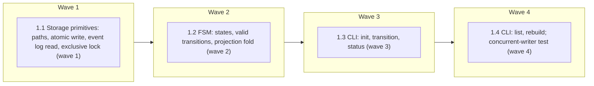

# Durable Run State — Phase A (Contract and Engine)

<!-- AT-A-GLANCE:BEGIN (generated — do not edit; refreshed by render_plan.py --summarize) -->
## At a glance

**4 tasks · 4 waves · 2 files · 4/4 done**

| Wave | Task | Title | Files | Done (acceptance) |
|---|---|---|---|---|
| 1 | 1.1 | Storage primitives: paths, atomic write, event log read, exclusive lock (wave 1) | scripts/run_state.py, scripts/test_run_state.py | `scripts/run_state.py` exists with the storage primitives above; the four tests … |
| 2 | 1.2 | FSM: states, valid transitions, projection fold (wave 2) | scripts/run_state.py, scripts/test_run_state.py | All tests from Task 1.1 and 1.2 pass; `valid_targets` and `validate_transition` … |
| 3 | 1.3 | CLI: init, transition, status (wave 3) | scripts/run_state.py, scripts/test_run_state.py | All tests from Tasks 1.1–1.3 pass, including `test_post_terminal_transition_reje… |
| 4 | 1.4 | CLI: list, rebuild; concurrent-writer test (wave 4) | scripts/run_state.py, scripts/test_run_state.py | All 9 SC rows pass; `python -m pytest scripts/test_run_state.py -q` is green wit… |



### Progress
- [x] 1.1 — Storage primitives: paths, atomic write, event log read, exclusive lock (wave 1)
- [x] 1.2 — FSM: states, valid transitions, projection fold (wave 2)
- [x] 1.3 — CLI: init, transition, status (wave 3)
- [x] 1.4 — CLI: list, rebuild; concurrent-writer test (wave 4)
<!-- AT-A-GLANCE:END -->

## 1. Motivation

`specs/STATE.md` is a human-readable, prose singleton (session breadcrumbs only). It cannot
answer, mechanically: what state is a run in, what is it waiting on, which commit was actually
verified, or how to resume after a dead session. GitHub issue #129 proposes a durable,
machine-readable run-state layer to close this gap. This plan implements **Phase A only**: the
on-disk event/projection schema and the stdlib-only transition engine + CLI. It deliberately
does not deploy anything to `.claude/runtime/`, does not wire any skill/hook, and does not touch
`harness-manifest.json` — those are Phase B/C/D, gated on this engine's contract being stable
first (per the issue: "Proposal 2 ... should build on this contract").

No `research-brief.md` was written for this spec (normal lane, not high-risk at intake) —
GitHub issue #129 itself already documents the design decisions (event/projection split,
`fcntl.flock` locking, atomic replace, idempotent replay, exit-code contract, 16-state model)
that a research-brief would otherwise establish; this plan treats the issue body as that input.

## 2. Non-goals

- `runtime/` source tree or `.claude/runtime/` deployment (Phase B).
- `scripts/deploy-harness.sh` / `scripts/install-harness.sh` changes, or `SYNCED_DIRS_RE`
  updates (Phase B).
- Wiring into `feature-intake`, `finishing-a-development-branch`, `SessionStart`, or
  `harness-status.sh` (Phase C).
- `harness-manifest.json` registration (Phase C/D).
- `design.md` / cross-OS (macOS + Ubuntu) CI validation / rollout docs (Phase D).
- Verifying that a `--sha` passed to `transition --to shipped` is actually the landed,
  merged commit (that requires git/GitHub integration — Phase C). Phase A only enforces that
  the value is *present and shaped like* a SHA (`^[0-9a-f]{7,40}$`), which is the engine-level
  half of the issue's "shipped requires a confirmed landed SHA" invariant.
- `run_state.py list --active --prompt` (the issue's proposed CLI mentions `--json|--prompt`).
  Only `--json` and the plain-text default are implemented — `--prompt` is speculative output
  shaping with no consumer yet in Phase A; add it when Phase C actually needs it.

## 3. Success Criteria

| ID | Behavior (observable) | Check (re-runnable) | Expected |
|------|-------------------------|-----------------------|------------|
| SC-1 | A fresh run initializes into the `queued` state, creating `events.jsonl` + `RUN.json` | `python -m pytest scripts/test_run_state.py -k test_init_creates_queued_run -q` | exit 0 |
| SC-2 | An invalid state transition is rejected (exit 2) without mutating either artifact | `python -m pytest scripts/test_run_state.py -k test_invalid_transition_rejected -q` | exit 0 |
| SC-3 | A terminal state (`shipped`/`cancelled`/`superseded`) rejects any further transition | `python -m pytest scripts/test_run_state.py -k test_terminal_state_blocks_transition -q` | exit 0 |
| SC-4 | Replaying the same `event_id` is a no-op (exit 0, no new line); reusing an `event_id` for a materially different transition is rejected (exit 2) | `python -m pytest scripts/test_run_state.py -k test_idempotent_replay_and_conflict -q` | exit 0 |
| SC-5 | A corrupted or truncated `events.jsonl` fails visibly (exit 3) instead of fabricating a state | `python -m pytest scripts/test_run_state.py -k test_corrupt_log_fails_visibly -q` | exit 0 |
| SC-6 | `rebuild` reconstructs `RUN.json` from `events.jsonl` alone, reproducing the projection exactly; `rebuild --check` exit-3's on drift | `python -m pytest scripts/test_run_state.py -k test_rebuild_reproduces_projection -q` | exit 0 |
| SC-7 | Concurrent `transition` calls on the same slug (separate OS processes) are serialized by the lock: exactly one FSM-valid winner commits, losers fail cleanly, and the resulting `seq` sequence has no duplicates or gaps | `python -m pytest scripts/test_run_state.py -k test_concurrent_writers_sequence_contiguously -q` | exit 0 |
| SC-8 | Transitioning to `shipped` without a validly-shaped `--sha` is rejected (exit 2) | `python -m pytest scripts/test_run_state.py -k test_shipped_requires_valid_sha -q` | exit 0 |
| SC-9 | `awaiting_*` targets require `--waiting-on`; `blocked`/`escalated` targets require `--resume-event` | `python -m pytest scripts/test_run_state.py -k test_waiting_and_resume_metadata_required -q` | exit 0 |

## 4. Tasks

### Task 1.1 — Storage primitives: paths, atomic write, event log read, exclusive lock (wave 1)

- **Files:** scripts/run_state.py, scripts/test_run_state.py
- **Action:** Create `scripts/run_state.py` with the module docstring documenting the on-disk
  schema (copy verbatim, this is the canonical schema reference — no separate doc file):

  ```python
  #!/usr/bin/env python3
  """Durable run-state engine and CLI for harness-skills specs (GitHub issue #129, Phase A).

  Storage layout per slug (specs/<slug>/):
    events.jsonl      - append-only event log, one JSON object per line (see Event schema)
    events.jsonl.lock - fcntl lock file guarding the read-validate-append-project sequence
    RUN.json          - atomic projection of the current run state, rebuildable from events.jsonl

  Event schema (one line of events.jsonl):
    {
      "event_id": str,          # idempotency key; client-supplied via --event-id, else uuid4
      "seq": int,                # monotonic, assigned by the engine, starts at 1
      "ts": str,                  # ISO-8601 UTC, e.g. "2026-07-24T10:00:00Z"
      "slug": str,
      "run_id": str,
      "from_state": str | None,   # None only for the synthetic init event
      "to_state": str,
      "event": str,                # "namespace.action", e.g. "agent.plan_ready"
      "waiting_on": str | None,
      "resume_event": str | None,
      "sha": str | None,
      "metadata": dict,
    }

  RUN.json projection schema:
    {
      "slug": str, "run_id": str, "state": str, "seq": int,
      "waiting_on": str | None, "resume_event": str | None, "sha": str | None,
      "created_at": str, "updated_at": str, "last_event_id": str,
    }

  Exit codes: 0 success or idempotent no-op; 2 invalid input or invalid transition;
  3 missing/corrupt storage or I/O failure.
  """
  import argparse
  import fcntl
  import json
  import os
  import re
  import sys
  import uuid
  from datetime import datetime, timezone


  class RunStateError(Exception):
      """Base for engine errors; carries the process exit code to use."""
      exit_code = 2


  class InvalidTransitionError(RunStateError):
      exit_code = 2


  class ConflictError(RunStateError):
      exit_code = 2


  class StorageError(RunStateError):
      exit_code = 3


  def spec_dir(slug):
      return os.path.join("specs", slug)


  def events_path(slug):
      return os.path.join(spec_dir(slug), "events.jsonl")


  def lock_path(slug):
      return os.path.join(spec_dir(slug), "events.jsonl.lock")


  def run_json_path(slug):
      return os.path.join(spec_dir(slug), "RUN.json")


  def now_iso():
      return datetime.now(timezone.utc).strftime("%Y-%m-%dT%H:%M:%SZ")


  def atomic_write_json(path, obj):
      tmp = f"{path}.tmp.{os.getpid()}"
      with open(tmp, "w") as f:
          json.dump(obj, f, indent=2, sort_keys=True)
          f.write("\n")
          f.flush()
          os.fsync(f.fileno())
      os.replace(tmp, path)


  def read_json(path):
      try:
          with open(path) as f:
              return json.load(f)
      except FileNotFoundError:
          raise StorageError(f"missing: {path}")
      except json.JSONDecodeError as e:
          raise StorageError(f"corrupt JSON in {path}: {e}")


  def read_events(slug):
      path = events_path(slug)
      if not os.path.exists(path):
          raise StorageError(f"missing: {path}")
      events = []
      with open(path) as f:
          for lineno, line in enumerate(f, start=1):
              line = line.strip()
              if not line:
                  continue
              try:
                  events.append(json.loads(line))
              except json.JSONDecodeError as e:
                  raise StorageError(f"corrupt event log {path}:{lineno}: {e}")
      if not events:
          raise StorageError(f"empty event log: {path}")
      return events


  class locked_run:
      """Context manager: fcntl-exclusive-locks the slug's events.jsonl.lock for the
      duration of a read-validate-append-project sequence. Blocks until acquired.
      POSIX-only (fcntl) — matches this repo's macOS/Ubuntu-only CI, no Windows target."""

      def __init__(self, slug):
          self.slug = slug
          self._fh = None

      def __enter__(self):
          os.makedirs(spec_dir(self.slug), exist_ok=True)
          self._fh = open(lock_path(self.slug), "a+")
          fcntl.flock(self._fh.fileno(), fcntl.LOCK_EX)
          return self

      def __exit__(self, *exc):
          fcntl.flock(self._fh.fileno(), fcntl.LOCK_UN)
          self._fh.close()
          return False
  ```

  Then create `scripts/test_run_state.py` (test-first: write these tests, run them, watch them
  fail on import before `run_state.py` exists / on missing behavior, then the code above makes
  them pass). Use `tmp_path` (pytest fixture) + `monkeypatch.chdir(tmp_path)` so tests never
  touch the real `specs/` tree — every test in this file follows this pattern:

  ```python
  import json
  import os
  import subprocess
  import sys

  import pytest

  sys.path.insert(0, os.path.dirname(__file__))
  import run_state as rs


  @pytest.fixture(autouse=True)
  def isolated_cwd(tmp_path, monkeypatch):
      monkeypatch.chdir(tmp_path)
      os.makedirs("specs", exist_ok=True)
      yield tmp_path


  def test_atomic_write_json_leaves_no_tmp_file_and_correct_content():
      os.makedirs("specs/demo", exist_ok=True)
      path = "specs/demo/RUN.json"
      rs.atomic_write_json(path, {"a": 1})
      assert rs.read_json(path) == {"a": 1}
      assert not [f for f in os.listdir("specs/demo") if f.endswith(".tmp." + str(os.getpid()))]


  def test_read_events_missing_file_raises_storage_error():
      with pytest.raises(rs.StorageError):
          rs.read_events("nope")


  def test_read_events_corrupt_line_raises_storage_error():
      os.makedirs("specs/demo", exist_ok=True)
      with open("specs/demo/events.jsonl", "w") as f:
          f.write('{"seq": 1}\n')
          f.write("not json\n")
      with pytest.raises(rs.StorageError):
          rs.read_events("demo")


  def test_read_events_truncated_last_line_raises_storage_error():
      os.makedirs("specs/demo", exist_ok=True)
      with open("specs/demo/events.jsonl", "w") as f:
          f.write('{"seq": 1}\n')
          f.write('{"seq": 2, "trunc')  # no closing brace/newline
      with pytest.raises(rs.StorageError):
          rs.read_events("demo")
  ```

- **Verify:** `python -m pytest scripts/test_run_state.py -q`
- **Done:** `scripts/run_state.py` exists with the storage primitives above; the four tests in
  this task pass; no `.tmp.*` file is left behind after `atomic_write_json`.

### Task 1.2 — FSM: states, valid transitions, projection fold (wave 2)

- **Files:** scripts/run_state.py, scripts/test_run_state.py
- **Action:** Append to `scripts/run_state.py` (below the storage primitives from Task 1.1) the
  16-state model from issue #129, transition validation, and the pure `project()` fold:

  ```python
  TERMINAL_STATES = {"shipped", "cancelled", "superseded"}
  INTERRUPT_STATES = {"blocked", "escalated"}
  WAITING_STATES = {"awaiting_confirmation", "awaiting_ci", "awaiting_review"}
  ACTIVE_STATES = {
      "queued", "investigating", "awaiting_confirmation", "planning",
      "implementing", "verifying", "awaiting_ci", "fixing_ci",
      "awaiting_review", "addressing_review", "ready_to_merge",
  }
  ALL_STATES = ACTIVE_STATES | INTERRUPT_STATES | TERMINAL_STATES

  # Happy-path forward edges. Every active state may ALSO go to blocked/escalated/
  # cancelled/superseded at any time (added by valid_targets) — those are universal
  # interrupts, not modeled per-state here to avoid repeating them 11 times.
  FORWARD_TRANSITIONS = {
      "queued": {"investigating"},
      "investigating": {"awaiting_confirmation", "planning"},
      "awaiting_confirmation": {"planning"},
      "planning": {"implementing"},
      "implementing": {"verifying"},
      "verifying": {"awaiting_ci", "ready_to_merge"},
      "awaiting_ci": {"fixing_ci", "awaiting_review", "ready_to_merge"},
      "fixing_ci": {"awaiting_ci", "verifying"},
      "awaiting_review": {"addressing_review", "ready_to_merge"},
      "addressing_review": {"awaiting_review", "verifying"},
      "ready_to_merge": {"shipped"},
  }

  SHA_RE = re.compile(r"^[0-9a-f]{7,40}$", re.IGNORECASE)


  def valid_targets(state):
      """States `state` may transition to. Empty set for terminal states."""
      if state in TERMINAL_STATES:
          return set()
      if state in INTERRUPT_STATES:
          # Resume into any active state, or give up.
          return ACTIVE_STATES | {"cancelled"}
      targets = set(FORWARD_TRANSITIONS.get(state, set()))
      targets |= {"blocked", "escalated", "cancelled", "superseded"}
      return targets


  def validate_transition(from_state, to_state, waiting_on, resume_event):
      if from_state not in ALL_STATES:
          raise InvalidTransitionError(f"unknown from_state: {from_state!r}")
      if to_state not in ALL_STATES:
          raise InvalidTransitionError(f"unknown to_state: {to_state!r}")
      if from_state in TERMINAL_STATES:
          raise InvalidTransitionError(
              f"{from_state} is terminal; no further transitions"
          )
      if to_state not in valid_targets(from_state):
          raise InvalidTransitionError(
              f"{from_state} -> {to_state} is not a valid transition"
          )
      if to_state in WAITING_STATES and not waiting_on:
          raise InvalidTransitionError(f"{to_state} requires --waiting-on")
      if to_state in INTERRUPT_STATES and not resume_event:
          raise InvalidTransitionError(f"{to_state} requires --resume-event")


  def project(events):
      """Pure fold: replay an ordered event list into the current RUN.json projection."""
      if not events:
          raise StorageError("no events to project")
      first = events[0]
      state = first["to_state"]
      waiting_on = first.get("waiting_on")
      resume_event = first.get("resume_event")
      sha = first.get("sha")
      for ev in events[1:]:
          state = ev["to_state"]
          waiting_on = ev.get("waiting_on")
          resume_event = ev.get("resume_event")
          if ev.get("sha"):
              sha = ev["sha"]
      last = events[-1]
      return {
          "slug": first["slug"],
          "run_id": first["run_id"],
          "state": state,
          "seq": last["seq"],
          "waiting_on": waiting_on,
          "resume_event": resume_event,
          "sha": sha,
          "created_at": first["ts"],
          "updated_at": last["ts"],
          "last_event_id": last["event_id"],
      }
  ```

  Add to `scripts/test_run_state.py` (pure unit tests, no filesystem needed — these do not need
  the `isolated_cwd` fixture's chdir behavior, though it firing harmlessly is fine):

  ```python
  def test_invalid_transition_rejected():
      with pytest.raises(rs.InvalidTransitionError):
          rs.validate_transition("queued", "shipped", None, None)


  def test_terminal_state_blocks_transition():
      for terminal in rs.TERMINAL_STATES:
          assert rs.valid_targets(terminal) == set()
          with pytest.raises(rs.InvalidTransitionError):
              rs.validate_transition(terminal, "investigating", None, None)


  def test_waiting_and_resume_metadata_required():
      with pytest.raises(rs.InvalidTransitionError):
          rs.validate_transition("investigating", "awaiting_confirmation", None, None)
      rs.validate_transition("investigating", "awaiting_confirmation", "human review", None)

      with pytest.raises(rs.InvalidTransitionError):
          rs.validate_transition("implementing", "blocked", None, None)
      rs.validate_transition("implementing", "blocked", None, "ci.green")


  def test_forward_happy_path_is_valid():
      chain = [
          ("queued", "investigating"), ("investigating", "planning"),
          ("planning", "implementing"), ("implementing", "verifying"),
          ("verifying", "ready_to_merge"), ("ready_to_merge", "shipped"),
      ]
      for from_state, to_state in chain:
          rs.validate_transition(from_state, to_state, None, None)


  def test_project_folds_events_and_carries_sha_forward():
      events = [
          {"seq": 1, "ts": "t1", "slug": "s", "run_id": "r", "to_state": "queued",
           "event_id": "e1", "waiting_on": None, "resume_event": None, "sha": None},
          {"seq": 2, "ts": "t2", "slug": "s", "run_id": "r", "to_state": "verifying",
           "event_id": "e2", "waiting_on": None, "resume_event": None, "sha": "abc1234"},
          {"seq": 3, "ts": "t3", "slug": "s", "run_id": "r", "to_state": "ready_to_merge",
           "event_id": "e3", "waiting_on": None, "resume_event": None, "sha": None},
      ]
      proj = rs.project(events)
      assert proj["state"] == "ready_to_merge"
      assert proj["seq"] == 3
      assert proj["sha"] == "abc1234"  # carried forward, not cleared by the sha-less event
      assert proj["created_at"] == "t1"
      assert proj["updated_at"] == "t3"
  ```

- **Verify:** `python -m pytest scripts/test_run_state.py -q`
- **Done:** All tests from Task 1.1 and 1.2 pass; `valid_targets` and `validate_transition`
  cover the full 16-state model with no I/O.

### Task 1.3 — CLI: init, transition, status (wave 3)

- **Files:** scripts/run_state.py, scripts/test_run_state.py
- **Action:** Append `cmd_init`, `cmd_transition`, `cmd_status`, the argparse wiring for these
  three subcommands, and a `main()` entry point to `scripts/run_state.py`:

  ```python
  def cmd_init(args):
      slug = args.slug
      run_id = args.run_id or str(uuid.uuid4())
      with locked_run(slug):
          ev_path = events_path(slug)
          if os.path.exists(ev_path):
              existing = read_events(slug)
              if existing[0].get("run_id") == run_id:
                  print(f"already initialized (run_id={run_id})")
                  return 0
              raise ConflictError(
                  f"{slug} already initialized with a different run_id"
              )
          event = {
              "event_id": str(uuid.uuid4()), "seq": 1, "ts": now_iso(),
              "slug": slug, "run_id": run_id, "from_state": None,
              "to_state": "queued", "event": "run.init",
              "waiting_on": None, "resume_event": None, "sha": None,
              "metadata": {},
          }
          with open(ev_path, "w") as f:
              f.write(json.dumps(event, sort_keys=True) + "\n")
              f.flush()
              os.fsync(f.fileno())
          atomic_write_json(run_json_path(slug), project(read_events(slug)))
      print(f"initialized {slug} run_id={run_id} state=queued")
      return 0


  def cmd_transition(args):
      slug = args.slug
      with locked_run(slug):
          events = read_events(slug)
          current = project(events)
          from_state = current["state"]

          if args.event_id:
              for ev in events:
                  if ev["event_id"] == args.event_id:
                      # Note: do NOT compare ev["from_state"] to the freshly recomputed
                      # `from_state` here — by replay time the projection has already
                      # advanced past this event, so from_state now equals the event's
                      # recorded to_state, not its from_state. Matching on to_state/event/
                      # waiting_on/resume_event/sha is sufficient since event_id already
                      # scopes the lookup to one historical event.
                      same = (
                          ev["to_state"] == args.to
                          and ev["event"] == args.event
                          and ev.get("waiting_on") == args.waiting_on
                          and ev.get("resume_event") == args.resume_event
                          and ev.get("sha") == args.sha
                      )
                      if same:
                          print(
                              f"idempotent no-op: {slug} already at "
                              f"{ev['to_state']} via event_id={args.event_id}"
                          )
                          return 0
                      raise ConflictError(
                          f"event_id {args.event_id} already used for a "
                          "different transition"
                      )

          validate_transition(from_state, args.to, args.waiting_on, args.resume_event)

          if args.to == "shipped":
              if not args.sha or not SHA_RE.match(args.sha):
                  raise InvalidTransitionError(
                      "shipped requires --sha matching a git SHA (7-40 hex chars)"
                  )

          event = {
              "event_id": args.event_id or str(uuid.uuid4()),
              "seq": events[-1]["seq"] + 1, "ts": now_iso(),
              "slug": slug, "run_id": current["run_id"],
              "from_state": from_state, "to_state": args.to, "event": args.event,
              "waiting_on": args.waiting_on, "resume_event": args.resume_event,
              "sha": args.sha, "metadata": args.meta,
          }
          with open(events_path(slug), "a") as f:
              f.write(json.dumps(event, sort_keys=True) + "\n")
              f.flush()
              os.fsync(f.fileno())
          atomic_write_json(run_json_path(slug), project(read_events(slug)))
      print(f"{slug}: {from_state} -> {args.to}")
      return 0


  def cmd_status(args):
      data = read_json(run_json_path(args.slug))
      if args.json:
          print(json.dumps(data, indent=2, sort_keys=True))
      else:
          for k in ("slug", "run_id", "state", "seq", "waiting_on",
                     "resume_event", "sha", "updated_at"):
              print(f"{k}: {data.get(k)}")
      return 0


  def parse_meta(pairs):
      meta = {}
      for pair in pairs:
          if "=" not in pair:
              raise RunStateError(f"invalid --meta {pair!r}; expected key=value")
          k, v = pair.split("=", 1)
          meta[k] = v
      return meta


  def build_parser():
      p = argparse.ArgumentParser(prog="run_state.py")
      sub = p.add_subparsers(dest="command", required=True)

      p_init = sub.add_parser("init")
      p_init.add_argument("--slug", required=True)
      p_init.add_argument("--run-id")

      p_tr = sub.add_parser("transition")
      p_tr.add_argument("--slug", required=True)
      p_tr.add_argument("--to", required=True, choices=sorted(ALL_STATES))
      p_tr.add_argument("--event", required=True)
      p_tr.add_argument("--event-id")
      p_tr.add_argument("--waiting-on")
      p_tr.add_argument("--resume-event")
      p_tr.add_argument("--sha")
      p_tr.add_argument("--meta", action="append", default=[])

      p_st = sub.add_parser("status")
      p_st.add_argument("--slug", required=True)
      p_st.add_argument("--json", action="store_true")

      return p, sub


  def main(argv=None):
      parser, sub = build_parser()
      args = parser.parse_args(argv)
      if args.command == "transition":
          args.meta = parse_meta(args.meta)
      handlers = {
          "init": cmd_init, "transition": cmd_transition, "status": cmd_status,
      }
      try:
          return handlers[args.command](args)
      except RunStateError as e:
          print(str(e), file=sys.stderr)
          return e.exit_code


  if __name__ == "__main__":
      sys.exit(main())
  ```

  `build_parser()` and `main()`'s `handlers` dict are extended again in Task 1.4 (which adds
  `list` and `rebuild`) — that task's Action gives the exact lines to add, so write the code
  above as-is here and let Task 1.4 append to it.

  Add to `scripts/test_run_state.py` (call `rs.main([...])` directly — no subprocess needed,
  it returns the exit code):

  ```python
  def test_init_creates_queued_run():
      assert rs.main(["init", "--slug", "demo", "--run-id", "r1"]) == 0
      assert rs.read_json("specs/demo/RUN.json")["state"] == "queued"
      assert rs.read_json("specs/demo/RUN.json")["run_id"] == "r1"


  def test_init_idempotent_same_run_id():
      assert rs.main(["init", "--slug", "demo", "--run-id", "r1"]) == 0
      assert rs.main(["init", "--slug", "demo", "--run-id", "r1"]) == 0


  def test_init_conflict_different_run_id():
      assert rs.main(["init", "--slug", "demo", "--run-id", "r1"]) == 0
      assert rs.main(["init", "--slug", "demo", "--run-id", "r2"]) == 2


  def test_transition_happy_path():
      rs.main(["init", "--slug", "demo", "--run-id", "r1"])
      rc = rs.main([
          "transition", "--slug", "demo", "--to", "investigating",
          "--event", "agent.started",
      ])
      assert rc == 0
      assert rs.read_json("specs/demo/RUN.json")["state"] == "investigating"


  def test_idempotent_replay_and_conflict():
      rs.main(["init", "--slug", "demo", "--run-id", "r1"])
      args = [
          "transition", "--slug", "demo", "--to", "investigating",
          "--event", "agent.started", "--event-id", "fixed-id",
      ]
      assert rs.main(args) == 0
      line_count_after_first = sum(
          1 for _ in open("specs/demo/events.jsonl")
      )
      assert rs.main(args) == 0  # replay: no-op
      assert sum(1 for _ in open("specs/demo/events.jsonl")) == line_count_after_first

      conflicting = [
          "transition", "--slug", "demo", "--to", "planning",
          "--event", "agent.started", "--event-id", "fixed-id",
      ]
      assert rs.main(conflicting) == 2


  def test_shipped_requires_valid_sha():
      rs.main(["init", "--slug", "demo", "--run-id", "r1"])
      for to_state in ("investigating", "planning", "implementing",
                         "verifying", "ready_to_merge"):
          rs.main([
              "transition", "--slug", "demo", "--to", to_state,
              "--event", "agent.step",
          ])
      assert rs.main([
          "transition", "--slug", "demo", "--to", "shipped", "--event", "ci.merged",
      ]) == 2
      assert rs.main([
          "transition", "--slug", "demo", "--to", "shipped", "--event", "ci.merged",
          "--sha", "not-a-sha",
      ]) == 2
      assert rs.main([
          "transition", "--slug", "demo", "--to", "shipped", "--event", "ci.merged",
          "--sha", "abc1234",
      ]) == 0


  def test_post_terminal_transition_rejected():
      rs.main(["init", "--slug", "demo", "--run-id", "r1"])
      for to_state in ("investigating", "planning", "implementing",
                         "verifying", "ready_to_merge"):
          rs.main(["transition", "--slug", "demo", "--to", to_state, "--event", "e"])
      rs.main([
          "transition", "--slug", "demo", "--to", "shipped", "--event", "e",
          "--sha", "abc1234",
      ])
      assert rs.main([
          "transition", "--slug", "demo", "--to", "investigating", "--event", "e",
      ]) == 2
  ```

- **Verify:** `python -m pytest scripts/test_run_state.py -q`
- **Done:** All tests from Tasks 1.1–1.3 pass, including `test_post_terminal_transition_rejected`
  (folds SC-3 at the CLI layer, complementing the pure-FSM version in Task 1.2).

### Task 1.4 — CLI: list, rebuild; concurrent-writer test (wave 4)

- **Files:** scripts/run_state.py, scripts/test_run_state.py
- **Action:** Append `cmd_list`, `cmd_rebuild` to `scripts/run_state.py`, register both
  subparsers in `build_parser()`, and add them to the `handlers` dict in `main()`:

  ```python
  def cmd_list(args):
      specs_root = "specs"
      results = []
      if os.path.isdir(specs_root):
          for slug in sorted(os.listdir(specs_root)):
              path = run_json_path(slug)
              if not os.path.isfile(path):
                  continue
              try:
                  data = read_json(path)
              except StorageError:
                  continue
              if args.active and data.get("state") in TERMINAL_STATES:
                  continue
              results.append(data)
      if args.json:
          print(json.dumps(results, indent=2, sort_keys=True))
      else:
          for data in results:
              print(f"{data['slug']}: {data['state']} (waiting_on={data.get('waiting_on')})")
      return 0


  def cmd_rebuild(args):
      slug = args.slug
      with locked_run(slug):
          rebuilt = project(read_events(slug))
          if args.check:
              current = read_json(run_json_path(slug))
              if current != rebuilt:
                  print("DRIFT: RUN.json does not match events.jsonl", file=sys.stderr)
                  return 3
              print(f"{slug}: RUN.json matches events.jsonl (seq={rebuilt['seq']})")
              return 0
          atomic_write_json(run_json_path(slug), rebuilt)
      print(f"{slug}: rebuilt RUN.json from events.jsonl (seq={rebuilt['seq']})")
      return 0
  ```

  In `build_parser()`, before `return p, sub`, add:

  ```python
      p_ls = sub.add_parser("list")
      p_ls.add_argument("--active", action="store_true")
      p_ls.add_argument("--json", action="store_true")

      p_rb = sub.add_parser("rebuild")
      p_rb.add_argument("--slug", required=True)
      p_rb.add_argument("--check", action="store_true")
  ```

  In `main()`'s `handlers` dict, add `"list": cmd_list, "rebuild": cmd_rebuild,`.

  Add to `scripts/test_run_state.py`:

  ```python
  def test_rebuild_reproduces_projection():
      rs.main(["init", "--slug", "demo", "--run-id", "r1"])
      rs.main(["transition", "--slug", "demo", "--to", "investigating", "--event", "e"])
      before = rs.read_json("specs/demo/RUN.json")
      os.remove("specs/demo/RUN.json")
      assert rs.main(["rebuild", "--slug", "demo"]) == 0
      assert rs.read_json("specs/demo/RUN.json") == before


  def test_rebuild_check_detects_drift():
      rs.main(["init", "--slug", "demo", "--run-id", "r1"])
      rs.atomic_write_json("specs/demo/RUN.json", {"tampered": True})
      assert rs.main(["rebuild", "--slug", "demo", "--check"]) == 3


  def test_corrupt_log_fails_visibly():
      rs.main(["init", "--slug", "demo", "--run-id", "r1"])
      with open("specs/demo/events.jsonl", "a") as f:
          f.write("not json at all\n")
      assert rs.main(["rebuild", "--slug", "demo"]) == 3
      assert rs.main(["rebuild", "--slug", "demo", "--check"]) == 3


  def test_list_active_excludes_terminal_states():
      rs.main(["init", "--slug", "alive", "--run-id", "r1"])
      rs.main(["init", "--slug", "done", "--run-id", "r2"])
      for to_state in ("investigating", "planning", "implementing",
                         "verifying", "ready_to_merge"):
          rs.main(["transition", "--slug", "done", "--to", to_state, "--event", "e"])
      rs.main([
          "transition", "--slug", "done", "--to", "shipped", "--event", "e",
          "--sha", "abc1234",
      ])
      import io
      import contextlib
      buf = io.StringIO()
      with contextlib.redirect_stdout(buf):
          rs.main(["list", "--active", "--json"])
      slugs = {row["slug"] for row in json.loads(buf.getvalue())}
      assert slugs == {"alive"}


  def test_concurrent_writers_sequence_contiguously():
      # Separate OS processes (not threads) so the fcntl lock is exercised for real —
      # threads share one process's fd table in a way that doesn't test flock the way
      # independent CLI invocations (e.g. two separate agent sessions) would.
      #
      # All 5 processes attempt the SAME edge (queued -> investigating) with DISTINCT
      # event_ids, so none can idempotently match another's line. Only the process that
      # wins the lock first sees from_state == "queued" and succeeds; by the time the
      # other 4 acquire the lock, the state has already moved to "investigating", and
      # "investigating -> investigating" is not a valid transition (not in
      # FORWARD_TRANSITIONS, and self-loops aren't part of the universal interrupt set
      # either) — so they exit 2 without appending anything. This is the actual property
      # SC-7 needs: the lock serializes concurrent access so exactly one FSM-valid winner
      # commits and the losers fail cleanly, with no duplicate/gapped seq numbers and no
      # partial or interleaved writes to events.jsonl.
      rs.main(["init", "--slug", "demo", "--run-id", "r1"])
      script = os.path.abspath(__file__).replace("test_run_state.py", "run_state.py")
      procs = []
      for i in range(5):
          procs.append(subprocess.Popen([
              sys.executable, script, "transition", "--slug", "demo",
              "--to", "investigating", "--event", "agent.started",
              "--event-id", f"writer-{i}",
          ], cwd=os.getcwd()))
      returncodes = sorted(p.wait() for p in procs)
      assert returncodes == [0, 2, 2, 2, 2]

      events = rs.read_events("demo")
      seqs = [ev["seq"] for ev in events]
      assert seqs == list(range(1, len(events) + 1))  # contiguous: [1, 2], no gaps
      assert len(set(seqs)) == len(seqs)                # no duplicates
      assert len(events) == 2                            # init + exactly one winner
      assert rs.read_json("specs/demo/RUN.json")["state"] == "investigating"
  ```

- **Verify:** `python -m pytest scripts/test_run_state.py -q`
- **Done:** All 9 SC rows pass; `python -m pytest scripts/test_run_state.py -q` is green with
  no skips. Before handing off, additionally run `bash scripts/run-tests.sh` once (repo-wide
  regression gate for anything under `scripts/`) and confirm it stays green — do not include it
  as an SC row (it is a whole-suite command, disallowed by `plan-format.md`'s pipe-free/<60s/
  no-whole-suite rule for SC checks), but it must pass before this branch is handed to review.

## 5. Risks

- **POSIX-only locking.** `fcntl` has no Windows equivalent. Acceptable: this repo's CI and
  stated support matrix are macOS + Ubuntu only (`CLAUDE.md` gotchas), no Windows target.
- **O(n) idempotency scan.** `cmd_transition` scans the full `events.jsonl` linearly when
  `--event-id` is given, to check for replay/conflict. Fine for the run sizes this harness
  produces (a spec's lifecycle is tens of events, not thousands) — noted here as a known
  scaling limit, not addressed in Phase A.
- **Concurrency test realism.** The concurrent-writer test spawns real subprocesses
  (`subprocess.Popen`) rather than threads, because threads share one process's file-descriptor
  table in a way that doesn't exercise `fcntl.flock` the way independent CLI invocations would
  in production (e.g., two separate agent sessions transitioning the same run).
- **`project()` assumes a well-formed first event.** `project([])` and a first event missing
  `to_state`/`slug`/`run_id` both raise (empty list explicitly, missing keys via `KeyError`
  surfacing as an uncaught exception rather than a clean `StorageError`). Acceptable for Phase A
  since `events.jsonl` is only ever written by `cmd_init`/`cmd_transition`, which always emit
  well-formed events — a hand-corrupted file is already covered by the corruption tests, which
  target malformed JSON, not malformed-but-valid-JSON events.

## 6. Status Log

- 2026-07-24 — Plan created (proposed).
- 2026-07-24 — Marked active; execution started in worktree `feat/gh-129-durable-run-state-phase-a`.
- 2026-07-24 — Wave 1 (Task 1.1, storage primitives): `5b0a84b`, fix `429de18`. Spec + quality review passed.
- 2026-07-24 — Wave 2 (Task 1.2, FSM + transition validation): `54ca91f`. Spec + quality review passed.
- 2026-07-24 — Wave 3 (Task 1.3, CLI init/transition/status): `06a9f4f`, follow-up `94ebf69`. Spec + quality review passed.
- 2026-07-24 — Wave 4 (Task 1.4, CLI list/rebuild + concurrency test): `17bae3e`, fix `cc649eb`. Spec + quality review passed. All 9 SC rows green; 23/23 unit tests; repo-wide `run-tests.sh` ALL GREEN.
- 2026-07-24 — Rebased branch onto `github/main` (`3d1ba4d`): the worktree had originally branched
  from a stale local `main`, pulling in ~70 unrelated files from prior, already-completed harness
  work. Content of all 5 touched files verified byte-identical before/after rebase; commit SHAs
  above are post-rebase.
- 2026-07-24 — `/correctness-review` passed (6 findings fixed, 2 advisory recorded). `/intent-review`
  passed (1 advisory, 1 ambiguous finding escalated as E001 and resolved — accept as-is).
- 2026-07-24 — Marked shipped; PR opened via `finishing-a-development-branch`.
