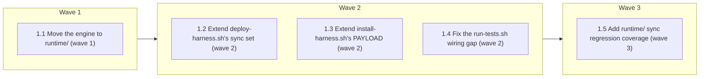

# Durable Run State — Phase B (Portable Deployment)

<!-- AT-A-GLANCE:BEGIN (generated — do not edit; refreshed by render_plan.py --summarize) -->
## At a glance

**5 tasks · 3 waves · 8 files · 5/5 done**

| Wave | Task | Title | Files | Done (acceptance) |
|---|---|---|---|---|
| 1 | 1.1 | Move the engine to runtime/ (wave 1) | runtime/run_state.py, runtime/test_run_state.py, scripts/run_state.py (removed),
scripts/test_run_state.py (removed) | All 29 tests pass at `runtime/test_run_state.py`; `scripts/run_state.py` and `sc… |
| 2 | 1.2 | Extend deploy-harness.sh's sync set (wave 2) | scripts/deploy-harness.sh | A fresh deploy to a clean temp target places `runtime/run_state.py` and `runtime… |
| 2 | 1.3 | Extend install-harness.sh's PAYLOAD (wave 2) | scripts/install-harness.sh | `PAYLOAD` includes `runtime` between `templates` and `settings.json`. |
| 2 | 1.4 | Fix the run-tests.sh wiring gap (wave 2) | scripts/run-tests.sh | `PYTESTS` includes `runtime/test_run_state.py`; the engine's 29 tests are now ac… |
| 3 | 1.5 | Add runtime/ sync regression coverage (wave 3) | tests/scripts/runtime-sync.test.sh | All 6 cases pass; `runtime/`'s sync/prune/consumer-survival behavior matches the… |



### Progress
- [x] 1.1 — Move the engine to runtime/ (wave 1)
- [x] 1.2 — Extend deploy-harness.sh's sync set (wave 2)
- [x] 1.3 — Extend install-harness.sh's PAYLOAD (wave 2)
- [x] 1.4 — Fix the run-tests.sh wiring gap (wave 2)
- [x] 1.5 — Add runtime/ sync regression coverage (wave 3)
<!-- AT-A-GLANCE:END -->

## 1. Motivation

Phase A (merged, PR #164) shipped the durable run-state engine at `scripts/run_state.py` +
`scripts/test_run_state.py`, deliberately deferring the issue's stated design ("source lives
under `runtime/` and is deployed to `.claude/runtime/`") to this phase. Right now the engine
exists only in this repo — it has no path to reach a consuming project's `.claude/` tree the way
`skills/`/`agents/`/`hooks/`/`rules/`/`templates/` already do via `scripts/deploy-harness.sh`.
This plan relocates the engine under `runtime/` and registers that directory into the existing,
already-generic sync/prune mechanism (research confirmed no new pruning logic is needed — see
`research-brief.md`). It also closes a wiring gap discovered mid-brainstorm: Phase A's 29 tests
were never added to `scripts/run-tests.sh`'s hardcoded `PYTESTS` list, so they never ran as part
of the repo's actual aggregate test run.

`harness-manifest.json` contract registration (the issue's fourth Phase B bullet) is explicitly
**deferred to Phase C** — `scripts/check_manifest.py` rejects a `contracts` entry with an empty
`consumers` list, and no real consumer exists until Phase C wires one in. See `design.md` §2/§4.2
and the escalation resolved with the user during `/brainstorming`.

## 2. Non-goals

- `harness-manifest.json` `contracts` registration (deferred to Phase C — no real consumer yet).
- Any new pruning *logic* — the existing `copy_dir`/`record_deployed`/`prune_orphans` mechanism
  is already dir-agnostic; this phase only extends its registered dir set.
- `BOOTSTRAP_OWNED_FILES` / protected-file entries for `runtime/` — both moved files are fully
  harness-owned, never consumer-customized.
- A summary-counter line for `runtime` in `deploy-harness.sh`'s output — `templates` (already
  synced) has none either; adding one only for `runtime` would be an unexplained asymmetry.
- Wiring `run_state.py` into any skill/hook/SessionStart surface (Phase C).
- Cross-OS (Ubuntu) CI validation beyond what `scripts/run-tests.sh` already runs (Phase D).

## 3. Success Criteria

| ID | Behavior (observable) | Check (re-runnable) | Expected |
|------|-------------------------|-----------------------|------------|
| SC-1 | The engine's 29 tests pass at their new location, `runtime/` | `python3 -m pytest runtime/test_run_state.py -q` | exit 0 |
| SC-2 | The old `scripts/run_state.py` / `scripts/test_run_state.py` no longer exist (pure relocation, not duplication) | `bash -c "! test -e scripts/run_state.py && ! test -e scripts/test_run_state.py"` | exit 0 |
| SC-3 | A fresh deploy to a clean target places `run_state.py` under `.claude/runtime/` | `bash -c 'T=$(mktemp -d); bash scripts/deploy-harness.sh --target "$T" >/dev/null 2>&1; [ -f "$T/.claude/runtime/run_state.py" ]; rc=$?; rm -rf "$T"; exit $rc'` | exit 0 |
| SC-4 | `install-harness.sh`'s `PAYLOAD` includes `runtime` | `grep -q "templates runtime settings.json" scripts/install-harness.sh` | exit 0 |
| SC-5 | `scripts/run-tests.sh`'s `PYTESTS` includes the moved test file (closes the wiring gap) | `grep -q "runtime/test_run_state.py" scripts/run-tests.sh` | exit 0 |
| SC-6 | `runtime/` sync + orphan-prune + consumer-addition-survival behavior matches the existing `skills/` semantics | `bash tests/scripts/runtime-sync.test.sh` | exit 0 |

## 4. Tasks

### Task 1.1 — Move the engine to runtime/ (wave 1)

- **Files:** runtime/run_state.py, runtime/test_run_state.py, scripts/run_state.py (removed),
  scripts/test_run_state.py (removed)
- **Action:** Relocate the two files with `git mv` (preserves history) — no content edits:

  ```bash
  git mv scripts/run_state.py runtime/run_state.py
  git mv scripts/test_run_state.py runtime/test_run_state.py
  ```

  Confirmed safe during research: both files use only `__file__`-relative paths internally
  (`test_run_state.py`'s `sys.path.insert(0, os.path.dirname(__file__))` and the concurrency
  test's `os.path.abspath(__file__).replace("test_run_state.py", "run_state.py")`), with zero
  hardcoded `"scripts/"` string anywhere in either file — nothing needs to change beyond the
  move itself. Nothing in the repo currently imports or calls `scripts/run_state.py`
  (Phase C, which would, hasn't started), so there is no caller to update.

- **Verify:** `python3 -m pytest runtime/test_run_state.py -q`
- **Done:** All 29 tests pass at `runtime/test_run_state.py`; `scripts/run_state.py` and
  `scripts/test_run_state.py` no longer exist on disk.

### Task 1.2 — Extend deploy-harness.sh's sync set (wave 2)

- **Files:** scripts/deploy-harness.sh
- **Action:** Two exact edits, adding `runtime` alongside the 5 existing synced dirs. First,
  the regex that gates orphan-pruning eligibility (currently line 106):

  ```bash
  SYNCED_DIRS_RE='^(skills|agents|hooks|rules|templates)/[^/]+$'
  ```
  becomes:
  ```bash
  SYNCED_DIRS_RE='^(skills|agents|hooks|rules|templates|runtime)/[^/]+$'
  ```

  Second, the actual per-dir sync loop (currently line 383):

  ```bash
  for d in skills agents hooks rules templates; do
  ```
  becomes:
  ```bash
  for d in skills agents hooks rules templates runtime; do
  ```

  Do not touch the summary-counters block (`SK`/`AG`/`HK`/`RL` and the printed lines below it)
  — `templates` already has no counter line there, so `runtime` shouldn't get one either (avoid
  an unexplained asymmetry; see Non-goals). `copy_dir()`, `record_deployed()`, and
  `prune_orphans()` need no changes — confirmed during research that they are already
  dir-agnostic, driven entirely by the loop above and the regex.

- **Verify:** `bash -c 'T=$(mktemp -d); bash scripts/deploy-harness.sh --target "$T" >/dev/null 2>&1; [ -f "$T/.claude/runtime/run_state.py" ]; rc=$?; rm -rf "$T"; exit $rc'`
- **Done:** A fresh deploy to a clean temp target places `runtime/run_state.py` and
  `runtime/test_run_state.py` under `.claude/runtime/`.

### Task 1.3 — Extend install-harness.sh's PAYLOAD (wave 2)

- **Files:** scripts/install-harness.sh
- **Action:** One exact edit — add `runtime` to the `PAYLOAD` array (currently line 33), which
  drives legacy root-level-file detection and `--keep-sources` staging (both independent of
  `deploy-harness.sh`'s own dir loop from Task 1.2):

  ```bash
  PAYLOAD=(skills agents hooks rules templates settings.json scripts/deploy-harness.sh scripts/init-structure.sh VERSION CHANGELOG.md)
  ```
  becomes:
  ```bash
  PAYLOAD=(skills agents hooks rules templates runtime settings.json scripts/deploy-harness.sh scripts/init-structure.sh VERSION CHANGELOG.md)
  ```

- **Verify:** `grep -q "templates runtime settings.json" scripts/install-harness.sh`
- **Done:** `PAYLOAD` includes `runtime` between `templates` and `settings.json`.

### Task 1.4 — Fix the run-tests.sh wiring gap (wave 2)

- **Files:** scripts/run-tests.sh
- **Action:** One exact edit — add the moved test file to the hardcoded `PYTESTS` list
  (currently line 61; this list never had `scripts/test_run_state.py` in it, confirmed by
  running the exact list during research: `185 passed`, unchanged before/after Phase A merged):

  ```bash
  PYTESTS="scripts/test_check_manifest.py scripts/test_verify_summary.py scripts/test_check_verify_rows.py scripts/test_check_review_receipt.py skills/visual-planner/test_render_plan.py"
  ```
  becomes:
  ```bash
  PYTESTS="scripts/test_check_manifest.py scripts/test_verify_summary.py scripts/test_check_verify_rows.py scripts/test_check_review_receipt.py skills/visual-planner/test_render_plan.py runtime/test_run_state.py"
  ```

- **Verify:** `grep -q "runtime/test_run_state.py" scripts/run-tests.sh`
- **Done:** `PYTESTS` includes `runtime/test_run_state.py`; the engine's 29 tests are now
  actually exercised by `bash scripts/run-tests.sh`'s aggregate run.

### Task 1.5 — Add runtime/ sync regression coverage (wave 3)

- **Files:** tests/scripts/runtime-sync.test.sh
- **Action:** Create the file below, mirroring `tests/scripts/deploy-prune.test.sh`'s 6-case
  pattern (same helpers, same shape) but scoped to `runtime/` instead of `skills/`. Depends on
  Tasks 1.1 (so `runtime/run_state.py` exists to actually sync) and 1.2 (so
  `deploy-harness.sh` actually syncs it) both being done first — this is why it's wave 3.

  ```bash
  #!/bin/bash
  # Tests for deploy-harness.sh syncing/pruning the runtime/ directory (Phase B, GitHub issue #129).
  # Mirrors tests/scripts/deploy-prune.test.sh's pattern, scoped to runtime/ instead of skills/.
  source "$(dirname "$0")/../lib.sh"

  DEPLOY="$ROOT/scripts/deploy-harness.sh"
  new_target() { local d; d=$(mktemp -d); _CLEANUP_DIRS+=("$d"); echo "$d"; }
  deploy() { bash "$DEPLOY" --target "$1" </dev/null >/dev/null 2>&1; }

  t "first deploy writes .harness-deployed and syncs runtime/"
  T=$(new_target); deploy "$T"
  if [ -f "$T/.claude/.harness-deployed" ] && [ -f "$T/.claude/runtime/run_state.py" ]; then pass
  else fail "manifest missing or runtime/run_state.py did not land on first deploy"; fi

  t "a runtime entry gone from source (in the prior manifest) is pruned on re-sync"
  T=$(new_target); deploy "$T"
  echo "runtime/_ghost.py" >> "$T/.claude/.harness-deployed"
  touch "$T/.claude/runtime/_ghost.py"
  deploy "$T"
  if [ ! -e "$T/.claude/runtime/_ghost.py" ]; then pass; else fail "orphan runtime/_ghost.py was not pruned"; fi

  t "a consumer's own file under runtime/ (never in the manifest) SURVIVES a re-sync"
  T=$(new_target); deploy "$T"
  touch "$T/.claude/runtime/consumer-custom.py"
  deploy "$T"
  if [ -f "$T/.claude/runtime/consumer-custom.py" ]; then pass
  else fail "consumer's custom runtime/ file was destroyed — blind prune hazard"; fi

  t "sidecars under runtime/ are never pruned"
  T=$(new_target); deploy "$T"
  touch "$T/.claude/runtime/run_state.py.harness-incoming"
  deploy "$T"
  if [ -e "$T/.claude/runtime/run_state.py.harness-incoming" ]; then pass
  else fail "a sidecar under runtime/ was pruned"; fi

  t "re-sync with no deletions prunes nothing under runtime/ (idempotent)"
  T=$(new_target); deploy "$T"
  before=$(find "$T/.claude/runtime" -maxdepth 1 | sort)
  deploy "$T"
  after=$(find "$T/.claude/runtime" -maxdepth 1 | sort)
  if [ "$before" = "$after" ]; then pass; else fail "runtime/ set changed on a no-op re-sync"; fi

  t "dry-run reports a would-be prune under runtime/ but writes nothing"
  T=$(new_target); deploy "$T"
  echo "runtime/_ghost2.py" >> "$T/.claude/.harness-deployed"
  touch "$T/.claude/runtime/_ghost2.py"
  out=$(bash "$DEPLOY" --target "$T" --dry-run </dev/null 2>&1)
  if printf '%s' "$out" | grep -qF "would prune stale" && [ -e "$T/.claude/runtime/_ghost2.py" ]; then pass
  else fail "dry-run did not report, or it deleted: out=$(printf '%s' "$out" | grep -i prune | head -1)"; fi

  finish
  ```

  Make it executable: `chmod +x tests/scripts/runtime-sync.test.sh`. It will be picked up
  automatically by `scripts/run-tests.sh`'s existing `tests/scripts/*.test.sh` glob (line 48) —
  no separate wiring needed for the L3 shell-suite runner (only the L2 Python `PYTESTS` list,
  fixed in Task 1.4, needed explicit registration).

- **Verify:** `bash tests/scripts/runtime-sync.test.sh`
- **Done:** All 6 cases pass; `runtime/`'s sync/prune/consumer-survival behavior matches the
  existing `skills/` semantics exactly.

## 5. Risks

- **Relocation risk:** low — confirmed via direct grep that neither moved file has a hardcoded
  `"scripts/"` path reference; both are `__file__`-relative. `git mv` preserves blame/history.
- **Sync-set risk:** low — the mechanism being extended (`copy_dir`/`record_deployed`/
  `prune_orphans`) is already exercised by 5 other directories and has its own passing
  regression suite (`deploy-prune.test.sh`); this phase only widens its registered dir set,
  introducing no new code paths.
- **Wiring-gap fix risk:** low — adding one filename to an existing, working pytest invocation.
  The only way this surfaces a problem is if `runtime/test_run_state.py`'s 29 tests were
  secretly relying on some environment state only present when run standalone — already
  disproven: the correctness-review, spec review, and quality review in Phase A all ran
  `python -m pytest scripts/test_run_state.py -q` directly and it passed cleanly every time.
- **Scope risk:** none identified — `harness-manifest.json` registration is explicitly deferred,
  removing the one item that would have required touching governance/validation logic.

## 6. Status Log

- 2026-07-24 — Plan created (proposed).
- 2026-07-24 — Marked active; execution started in worktree `feat/gh-129-durable-run-state-phase-b`.
- 2026-07-24 — Wave 1 (Task 1.1, move to runtime/): `8981203`. Spec + quality review passed.
- 2026-07-24 — Wave 2 (Task 1.2 `caf67be`, 1.3 `bfc7979`, 1.4 `d9ae778`, parallel): spec + quality review passed. Follow-up comment fix `a13ddf8` from quality review.
- 2026-07-24 — Wave 3 (Task 1.5, runtime-sync test): `3c162e0`. Spec + quality review passed (quality review confirmed load-bearing assertions via mutation testing). All 6 SC rows green; 214/214 repo-wide unit tests; `bash scripts/run-tests.sh` ALL GREEN.
