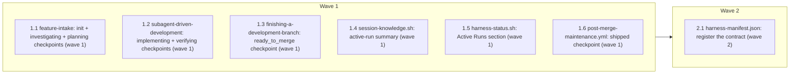

# Durable Run State — Phase C (Core Workflow Checkpoints)

<!-- AT-A-GLANCE:BEGIN (generated — do not edit; refreshed by render_plan.py --summarize) -->
## At a glance

**7 tasks · 2 waves · 9 files · 0/7 done**

| Wave | Task | Title | Files | Done (acceptance) |
|---|---|---|---|---|
| 1 | 1.1 | feature-intake: init + investigating + planning checkpoints (wave 1) | skills/feature-intake/SKILL.md | Both edits present; `grep -c "run_state.py" skills/feature-intake/SKILL.md` retu… |
| 1 | 1.2 | subagent-driven-development: implementing + verifying checkpoints (wave 1) | skills/subagent-driven-development/SKILL.md | Both edits present; `grep -q "tasks.complete" skills/subagent-driven-development… |
| 1 | 1.3 | finishing-a-development-branch: ready_to_merge checkpoint (wave 1) | skills/finishing-a-development-branch/SKILL.md | The new item 4b is present between items 4 and 5. |
| 1 | 1.4 | session-knowledge.sh: active-run summary (wave 1) | hooks/session-knowledge.sh, tests/hooks/session-knowledge.test.sh | All existing cases plus the 4 new cases pass (existing KB-only behavior unchange… |
| 1 | 1.5 | harness-status.sh: Active Runs section (wave 1) | scripts/harness-status.sh, tests/scripts/harness-status.test.sh | All existing cases plus the 3 new cases pass; Drift Audit remains the last secti… |
| 1 | 1.6 | post-merge-maintenance.yml: shipped checkpoint (wave 1) | .github/workflows/post-merge-maintenance.yml | The new step is present between "Run bookkeeping" and "Open the bookkeeping PR",… |
| 2 | 2.1 | harness-manifest.json: register the contract (wave 2) | harness-manifest.json | `check_manifest.py` exits 0 — the new entry's `surface` and `consumers` paths al… |



### Progress
- [ ] 1.1 — feature-intake: init + investigating + planning checkpoints (wave 1)
- [ ] 1.2 — subagent-driven-development: implementing + verifying checkpoints (wave 1)
- [ ] 1.3 — finishing-a-development-branch: ready_to_merge checkpoint (wave 1)
- [ ] 1.4 — session-knowledge.sh: active-run summary (wave 1)
- [ ] 1.5 — harness-status.sh: Active Runs section (wave 1)
- [ ] 1.6 — post-merge-maintenance.yml: shipped checkpoint (wave 1)
- [ ] 2.1 — harness-manifest.json: register the contract (wave 2)
<!-- AT-A-GLANCE:END -->

## 1. Motivation

Phases A (engine, PR #164) and B (portable deployment, PR #166) shipped a durable run-state
engine to every consuming repo, but nothing calls it — confirmed via
`grep -rniE "run_state|runtime/run" skills/ hooks/ scripts/harness-status.sh` returning empty.
This plan wires the engine into 8 checkpoints across the core workflow (see `design.md` §3),
fixing a real FSM bug found during design review (`queued` has no direct edge to
`implementing` — the real path is `queued → investigating → planning → implementing`) and
scoping the full chain to normal/high-risk lanes only (confirmed with the user; `tiny` lane
stops at `investigating`, no synthetic/mock chain).

## 2. Non-goals

(See `design.md` §5 for full rationale on each.)

- Wiring `awaiting_ci`/`fixing_ci`/`awaiting_review`/`addressing_review`/`blocked`/`escalated`.
- Mapping the `tiny` lane past `investigating`.
- Adding `run_state.py list --prompt` (Phase A dropped it; nothing here needs it).
- Extending `deploy-harness.sh`/`install-harness.sh` distribution to cover `scripts/` generally
  or `.github/workflows/` — checkpoints 7-8 stay meta-repo-only, stated explicitly.
- Cross-OS CI validation of the full 3-phase contract (Phase D).
- Retroactively initializing a run for a spec that was never `init`-ed.
- YAML-parse validation of the workflow file (no YAML parser in this stdlib-only repo's
  toolchain; correctness is enforced by careful hand-construction + code-quality review +
  GitHub's own parse on push, not a new SC/dependency).

## 3. Success Criteria

| ID | Behavior (observable) | Check (re-runnable) | Expected |
|------|-------------------------|-----------------------|------------|
| SC-1 | `feature-intake` Step 6 documents the init+investigating checkpoint | `grep -q "run_state.py init" skills/feature-intake/SKILL.md` | exit 0 |
| SC-2 | `feature-intake` Step 7 documents the lane-scoped planning checkpoint | `grep -q "route.<lane>" skills/feature-intake/SKILL.md` | exit 0 |
| SC-3 | `subagent-driven-development` documents the implementing checkpoint | `grep -q "plan.execution_started" skills/subagent-driven-development/SKILL.md` | exit 0 |
| SC-4 | `subagent-driven-development` documents the verifying checkpoint | `grep -q "tasks.complete" skills/subagent-driven-development/SKILL.md` | exit 0 |
| SC-5 | `finishing-a-development-branch` documents the ready_to_merge checkpoint | `grep -q "pr.opened" skills/finishing-a-development-branch/SKILL.md` | exit 0 |
| SC-6 | `session-knowledge.sh`'s hook test suite passes (incl. new active-run cases) | `bash tests/hooks/session-knowledge.test.sh` | exit 0 |
| SC-7 | `harness-status.sh`'s test suite passes (incl. new active-run cases) | `bash tests/scripts/harness-status.test.sh` | exit 0 |
| SC-8 | `post-merge-maintenance.yml` documents the shipped checkpoint with its guard | `grep -q "Run-state checkpoint" .github/workflows/post-merge-maintenance.yml` | exit 0 |
| SC-9 | `harness-manifest.json` validates with the new contract entry | `python3 scripts/check_manifest.py` | exit 0 |

## 4. Tasks

### Task 1.1 — feature-intake: init + investigating + planning checkpoints (wave 1)

- **Files:** skills/feature-intake/SKILL.md
- **Action:** Two edits.

  **Edit A** — in `## Step 6 — Emit the intake statement + write SUMMARY.md`, immediately after
  the paragraph ending `"...must be captured here at intake, not reconstructed from the plan
  later."` (the last paragraph of Step 6, right before `## Step 7`), insert:

  ````markdown

  **Run-state checkpoint (non-fatal).** After `SUMMARY.md` is written, initialize the durable
  run and mark it investigating — this must never block intake, even on failure (Phase C,
  GitHub issue #129):

  ```bash
  python3 runtime/run_state.py init --slug <slug> || true
  python3 runtime/run_state.py transition --slug <slug> --to investigating \
    --event intake.classifying || true
  ```

  If `runtime/run_state.py` is missing (an older harness install predating Phase C) or either
  call fails, continue intake normally — this is observability, not a gate. Never surface a
  `run_state.py` error to the user as an intake failure.
  ````

  **Edit B** — in `## Step 7 — Route to the workflow path`, immediately after the routing table
  (the `| **high-risk** | Full chain: ... |` row) and before the paragraph starting `"After
  routing, hand off..."`, insert:

  ````markdown

  **Run-state checkpoint (non-fatal, normal/high-risk lanes only).** Once `Route:` resolves to
  `normal` or `high-risk`, mark the run as entering planning:

  ```bash
  python3 runtime/run_state.py transition --slug <slug> --to planning \
    --event route.<lane> || true
  ```

  Substitute `<lane>` with the resolved lane (`normal` or `high-risk`). Skip this call entirely
  for the `tiny` lane — it has no separate planning phase; its run stays at `investigating`
  (Non-goal, `design.md` §5). As above, never let a `run_state.py` failure block routing.
  ````

- **Verify:** `grep -q "run_state.py init" skills/feature-intake/SKILL.md`
- **Done:** Both edits present; `grep -c "run_state.py" skills/feature-intake/SKILL.md` returns
  at least 3 (init, investigating transition, planning transition).

### Task 1.2 — subagent-driven-development: implementing + verifying checkpoints (wave 1)

- **Files:** skills/subagent-driven-development/SKILL.md
- **Action:** Two edits.

  **Edit A** — in `**Next — mark the plan active.**` paragraph (Step 1), immediately after the
  sentence ending `"...the \`shipped\` transition happens later in
  \`finishing-a-development-branch\`."`, insert a new paragraph:

  ````markdown

  **Run-state checkpoint (non-fatal).** In the same step, mark the run as implementing:

  ```bash
  python3 runtime/run_state.py transition --slug <slug> --to implementing \
    --event plan.execution_started || true
  ```
  ````

  **Edit B** — immediately after `5. **Mark the task complete** and move on. Never advance
  while either review has an open issue.` (the last line of Step 2's numbered list) and before
  `**Step 3 — After all tasks pass, run the final chain over the whole diff...**`, insert:

  ````markdown

  **Run-state checkpoint (non-fatal).** Once every task in every wave has passed both reviews,
  before starting the final chain below, mark the run as verifying:

  ```bash
  python3 runtime/run_state.py transition --slug <slug> --to verifying \
    --event tasks.complete || true
  ```
  ````

- **Verify:** `grep -q "plan.execution_started" skills/subagent-driven-development/SKILL.md`
- **Done:** Both edits present; `grep -q "tasks.complete" skills/subagent-driven-development/SKILL.md` also passes.

### Task 1.3 — finishing-a-development-branch: ready_to_merge checkpoint (wave 1)

- **Files:** skills/finishing-a-development-branch/SKILL.md
- **Action:** In `### Step 3: Push and Open PR`'s numbered list, between item `4. Create the PR
  with \`gh pr create\`...` and item `5. Return the PR URL to the user...`, insert a new item
  `4b`:

  ````markdown
  4b. **Run-state checkpoint (non-fatal).** After the PR is created, mark the run
      ready_to_merge — this must never fail the PR-creation flow, and correctly no-ops for a
      `tiny`-lane branch (whose run never left `investigating`, so the engine cleanly rejects
      the transition):

      ```bash
      python3 runtime/run_state.py transition --slug <slug> --to ready_to_merge \
        --event pr.opened || true
      ```
  ````

- **Verify:** `grep -q "pr.opened" skills/finishing-a-development-branch/SKILL.md`
- **Done:** The new item 4b is present between items 4 and 5.

### Task 1.4 — session-knowledge.sh: active-run summary (wave 1)

- **Files:** hooks/session-knowledge.sh, tests/hooks/session-knowledge.test.sh
- **Action:** Replace the entire contents of `hooks/session-knowledge.sh` with the version
  below — it restructures the existing KB-loading logic (unchanged behavior, same guards) so it
  no longer early-`exit 0`s before a second, independent source (active runs) gets a chance to
  contribute, and adds that second source, bounded to 5 runs (matching `harness-status.sh`'s
  existing "last 5" convention).

  ```bash
  #!/usr/bin/env bash
  # SessionStart hook: load knowledge base (INDEX + critical-patterns) into session context,
  # AND report bounded active-run summaries from runtime/run_state.py (Phase C, GitHub issue
  # #129). Emits hookSpecificOutput.additionalContext when either source has content; silent
  # exit 0 when both are empty/missing. NEVER blocks: every branch exits 0 — follows the
  # defensive pattern of state-breadcrumb.sh.
  # JSON shape follows scope-gate.sh (jq -cn with additionalContext).
  #
  # Overridable for tests:
  #   SESSION_KNOWLEDGE_DIR=/path/to/fixture/docs/solutions  bash hooks/session-knowledge.sh
  #   RUN_STATE_REPO_ROOT=/path/to/fixture/repo              bash hooks/session-knowledge.sh

  set +e
  set +u
  set +o pipefail
  exec 2>/dev/null

  # Resolve the repo root the same way every sibling hook does (git worktree root), so it
  # works from both hooks/ (source) and .claude/hooks/ (deployed).
  HOOK_DIR="$(cd "$(dirname "${BASH_SOURCE[0]}")" && pwd)"
  REPO_ROOT="$(git -C "$HOOK_DIR" rev-parse --show-toplevel 2>/dev/null)"
  [ -z "$REPO_ROOT" ] && REPO_ROOT="$(cd "$HOOK_DIR/.." && pwd)"
  KB_DIR="${SESSION_KNOWLEDGE_DIR:-$REPO_ROOT/docs/solutions}"
  RUN_STATE_ROOT="${RUN_STATE_REPO_ROOT:-$REPO_ROOT}"

  INDEX="$KB_DIR/INDEX.md"
  CRITICAL="$KB_DIR/critical-patterns.md"

  # --- Guard: jq required for either source ---
  if ! command -v jq >/dev/null 2>&1; then
      exit 0
  fi

  # ============================================================
  # Source 1: knowledge base (docs/solutions/) — same logic as before, just no longer exits
  # early so Source 2 below still gets evaluated.
  # ============================================================
  _kb_section=""
  if [ -f "$INDEX" ]; then
      _index_content=$(cat "$INDEX" 2>/dev/null)
      _kb_has_data=1

      # Format 2: "0 total entries" in a header/comment line
      if printf '%s\n' "$_index_content" | grep -qE '0 total entries' 2>/dev/null; then
          _kb_has_data=0
      fi

      if [ "$_kb_has_data" = "1" ]; then
          _data_rows=$(printf '%s\n' "$_index_content" \
              | grep -E '^[|]' \
              | grep -v '^[|][-| ]*$' \
              | grep -iv '^[|][[:space:]]*File[[:space:]]*[|]')
          if [ -z "$_data_rows" ]; then
              _kb_has_data=0
          else
              _non_placeholder=$(printf '%s\n' "$_data_rows" | grep -v '_(' 2>/dev/null)
              [ -z "$_non_placeholder" ] && _kb_has_data=0
          fi
      fi

      if [ "$_kb_has_data" = "1" ]; then
          _index_section=$(head -n 30 "$INDEX" 2>/dev/null)
          _critical_section=""
          if [ -f "$CRITICAL" ]; then
              _line_count=$(wc -l < "$CRITICAL" 2>/dev/null | tr -d ' ')
              if [ "${_line_count:-0}" -le 40 ]; then
                  _critical_section=$(cat "$CRITICAL" 2>/dev/null)
              else
                  _critical_section=$(grep -E '^#' "$CRITICAL" 2>/dev/null)
              fi
          fi
          _kb_section=$(printf '%s\n\n---\n\n%s\n\n%s' \
              "$_index_section" \
              "$_critical_section" \
              "[session-knowledge] docs/solutions/ — read full file when relevant")
      fi
  fi

  # ============================================================
  # Source 2: active runs (runtime/run_state.py list --active --json), bounded to 5.
  # Absent/broken run_state.py is not an error — just no contribution from this source.
  # ============================================================
  _runs_section=""
  _RS="$RUN_STATE_ROOT/runtime/run_state.py"
  if [ -f "$_RS" ] && command -v python3 >/dev/null 2>&1; then
      _runs_json=$(cd "$RUN_STATE_ROOT" && python3 "$_RS" list --active --json 2>/dev/null)
      if [ -n "$_runs_json" ]; then
          _runs_section=$(printf '%s' "$_runs_json" | python3 -c '
  import json, sys
  try:
      runs = json.load(sys.stdin)
  except Exception:
      runs = []
  if runs:
      lines = ["[active runs] (showing up to 5 of %d)" % len(runs)]
      for r in runs[:5]:
          lines.append("  %s: %s (waiting_on=%s)" % (r.get("slug"), r.get("state"), r.get("waiting_on")))
      print("\n".join(lines))
  ' 2>/dev/null)
      fi
  fi

  # ============================================================
  # Combine — emit only if at least one source has content.
  # ============================================================
  if [ -z "$_kb_section" ] && [ -z "$_runs_section" ]; then
      exit 0
  fi

  if [ -n "$_kb_section" ] && [ -n "$_runs_section" ]; then
      _context=$(printf '%s\n\n---\n\n%s' "$_kb_section" "$_runs_section")
  elif [ -n "$_kb_section" ]; then
      _context="$_kb_section"
  else
      _context="$_runs_section"
  fi

  _json_str=$(printf '%s' "$_context" | python3 -c 'import json,sys; print(json.dumps(sys.stdin.read()))' 2>/dev/null)
  if [ -z "$_json_str" ]; then
      exit 0
  fi

  printf '{"hookSpecificOutput":{"hookEventName":"SessionStart","additionalContext":%s}}\n' "$_json_str"
  exit 0
  ```

  Then add the following cases to `tests/hooks/session-knowledge.test.sh`, immediately before
  the final `finish` line. A `make_active_run` helper is added alongside the existing `make_kb`
  helper (near the top of the file, after `make_kb`'s definition):

  ```bash
  # make_active_run <root> <slug> <state> — writes a minimal RUN.json fixture directly (no
  # need to run runtime/run_state.py init for these hook-level tests).
  make_active_run() {
      local root="$1" slug="$2" state="$3"
      mkdir -p "$root/specs/$slug"
      cat > "$root/specs/$slug/RUN.json" <<JSON
  {"slug": "$slug", "run_id": "r1", "state": "$state", "seq": 1,
   "waiting_on": null, "resume_event": null, "sha": null,
   "created_at": "2026-01-01T00:00:00Z", "updated_at": "2026-01-01T00:00:00Z",
   "last_event_id": "e1"}
  JSON
  }
  ```

  And these test cases before `finish`:

  ```bash
  # --- Active-run reporting (Phase C, GitHub issue #129) ---------------------------------

  t "active run present, KB empty → JSON output with run slug, no crash"
  repo=$(new_repo $H)
  mkdir -p "$repo/docs/solutions" "$repo/runtime"
  printf '%s\n' '# Knowledge Base Index
  > Last updated: 2026-06-11 | 0 total entries' > "$repo/docs/solutions/INDEX.md"
  cp "$ROOT/runtime/run_state.py" "$repo/runtime/"
  make_active_run "$repo" "demo-slug" "implementing"
  OUT=$(cd "$repo" && printf '' | RUN_STATE_REPO_ROOT="$repo" SESSION_KNOWLEDGE_DIR="$repo/docs/solutions" bash "hooks/$H" 2>&1); RC=$?
  if [ "$RC" -ne 0 ]; then fail "rc=$RC (want 0)"
  elif ! printf '%s' "$OUT" | jq -e . >/dev/null 2>&1; then fail "output is not valid JSON"
  elif ! echo "$OUT" | grep -q "demo-slug"; then fail "expected 'demo-slug' in output"
  else pass; fi

  t "no active runs, KB empty → silent exit 0"
  repo=$(new_repo $H)
  mkdir -p "$repo/docs/solutions" "$repo/runtime"
  printf '%s\n' '# Knowledge Base Index
  > Last updated: 2026-06-11 | 0 total entries' > "$repo/docs/solutions/INDEX.md"
  cp "$ROOT/runtime/run_state.py" "$repo/runtime/"
  run_hook "$repo" $H "" SESSION_KNOWLEDGE_DIR="$repo/docs/solutions" RUN_STATE_REPO_ROOT="$repo"
  assert_silent_ok

  t "runtime/run_state.py absent (older harness install) → falls back to KB-only, no crash"
  repo=$(new_repo $H)
  make_kb "$repo" "$_REAL_INDEX" "# Critical Patterns"
  OUT=$(cd "$repo" && printf '' | RUN_STATE_REPO_ROOT="$repo" SESSION_KNOWLEDGE_DIR="$repo/docs/solutions" bash "hooks/$H" 2>&1); RC=$?
  if [ "$RC" -eq 0 ] && echo "$OUT" | grep -q "my-entry"; then pass
  else fail "expected KB-only output when run_state.py absent — rc=$RC out: $(echo "$OUT" | head -3)"; fi

  t "more than 5 active runs → bounded to 5 in output"
  repo=$(new_repo $H)
  mkdir -p "$repo/docs/solutions" "$repo/runtime"
  printf '%s\n' '# Knowledge Base Index
  > Last updated: 2026-06-11 | 0 total entries' > "$repo/docs/solutions/INDEX.md"
  cp "$ROOT/runtime/run_state.py" "$repo/runtime/"
  for i in 1 2 3 4 5 6 7; do make_active_run "$repo" "slug-$i" "implementing"; done
  OUT=$(cd "$repo" && printf '' | RUN_STATE_REPO_ROOT="$repo" SESSION_KNOWLEDGE_DIR="$repo/docs/solutions" bash "hooks/$H" 2>&1); RC=$?
  _count=$(echo "$OUT" | grep -oE 'slug-[0-9]' | sort -u | wc -l | tr -d ' ')
  if [ "$RC" -eq 0 ] && [ "$_count" -le 5 ]; then pass
  else fail "expected <=5 distinct slugs in output, got $_count — out: $(echo "$OUT" | head -5)"; fi
  ```

- **Verify:** `bash tests/hooks/session-knowledge.test.sh`
- **Done:** All existing cases plus the 4 new cases pass (existing KB-only behavior unchanged,
  active-run reporting works, absence is non-fatal, bounded to 5).

### Task 1.5 — harness-status.sh: Active Runs section (wave 1)

- **Files:** scripts/harness-status.sh, tests/scripts/harness-status.test.sh
- **Action:** In `scripts/harness-status.sh`, insert a new section between the `=== Audit Trend
  (last 5 runs) ===` block and the `# ── Drift Audit (advisory) ──` comment (i.e. immediately
  before `echo ""` / `if [[ -x "$REPO_ROOT/scripts/harness-audit.sh" ]]; then` at the end of the
  file) — the Drift Audit block must stay LAST, since existing tests assert on it appearing as
  the final output (`DRIFT_AUDIT_RAN` sentinel):

  ```bash

  # ── Active Runs (Phase C, GitHub issue #129) ────────────────────────────────────
  echo ""
  echo "=== Active Runs ==="
  RUN_STATE="$REPO_ROOT/runtime/run_state.py"
  if [[ ! -f "$RUN_STATE" ]]; then
      echo "  [not found: $RUN_STATE]"
  elif ! command -v python3 >/dev/null 2>&1; then
      echo "  [python3 not available]"
  else
      _active_runs_out=$( (cd "$REPO_ROOT" && python3 "$RUN_STATE" list --active) 2>/dev/null ) || true
      if [[ -z "$_active_runs_out" ]]; then
          echo "  [no active runs]"
      else
          echo "$_active_runs_out" | sed 's/^/  /'
      fi
  fi
  ```

  Then add these cases to `tests/scripts/harness-status.test.sh`, immediately before the final
  `finish` line:

  ```bash
  # ── Active Runs (Phase C, GitHub issue #129) ─────────────────────────────────────────────

  t "runtime/run_state.py absent → says so, script completes"
  mkrepo; run_status "$r"
  assert_survived "[not found: $r/runtime/run_state.py]"

  t "no active runs → says so, script completes"
  mkrepo
  mkdir -p "$r/runtime"; cp "$ROOT/runtime/run_state.py" "$r/runtime/"
  run_status "$r"
  assert_survived '[no active runs]'

  t "active run present → slug rendered, script completes"
  mkrepo
  mkdir -p "$r/runtime" "$r/specs/demo-slug"
  cp "$ROOT/runtime/run_state.py" "$r/runtime/"
  cat > "$r/specs/demo-slug/RUN.json" <<JSON
  {"slug": "demo-slug", "run_id": "r1", "state": "implementing", "seq": 1,
   "waiting_on": null, "resume_event": null, "sha": null,
   "created_at": "2026-01-01T00:00:00Z", "updated_at": "2026-01-01T00:00:00Z",
   "last_event_id": "e1"}
  JSON
  run_status "$r"
  assert_survived 'demo-slug'
  ```

- **Verify:** `bash tests/scripts/harness-status.test.sh`
- **Done:** All existing cases plus the 3 new cases pass; Drift Audit remains the last section
  in the script's output (existing `assert_survived` semantics unaffected).

### Task 1.6 — post-merge-maintenance.yml: shipped checkpoint (wave 1)

- **Files:** .github/workflows/post-merge-maintenance.yml
- **Action:** Insert a new step between the existing `- name: Run bookkeeping` step (ending
  `id: book`'s block) and the `- name: Open the bookkeeping PR` step. This must run on every
  merge regardless of whether bookkeeping detected ledger changes — a run reaching `shipped` is
  independent of the ledger. Implements the 3 risk guards agreed with the user: RUN.json
  existence check (skip cleanly if absent), non-fatal wrap (`|| echo ::warning::`, never fails
  the job), and the correct path (`runtime/run_state.py` at repo root, since this job checks out
  the base branch directly, never `.claude/`). Slug resolution reuses the same
  `/tmp/changed-files.txt` the "Gather changed files" step already wrote (same pattern
  `scripts/bookkeeping.sh:57` uses internally) rather than modifying `bookkeeping.sh`'s output
  contract for this one consumer:

  ```yaml

      - name: Run-state checkpoint — mark shipped (non-fatal, Phase C)
        run: |
          slug=$(grep -oE 'specs/[^/]+/SUMMARY\.md' /tmp/changed-files.txt | head -1 | cut -d/ -f2 || true)
          if [ -z "$slug" ]; then
            echo "no specs/<slug>/SUMMARY.md in this PR — skipping run-state transition"
          elif [ ! -f "specs/$slug/RUN.json" ]; then
            echo "no RUN.json for $slug — skipping run-state transition"
          else
            python3 runtime/run_state.py transition --slug "$slug" --to shipped \
              --event ci.merged --sha "$MERGE_SHA" \
              || echo "::warning::run-state transition to shipped failed/skipped for $slug"
          fi
  ```

  This matches the file's real convention: `steps:` at 4 spaces, `- name:` items at 6, `run: |`
  at 8, and body lines at 10/12/14 (verified by parsing a spliced copy with `yaml.safe_load()`
  during plan review — the version above parses clean; do not re-indent when applying.
  Match the existing file's YAML indentation exactly (this snippet is already indented
  to the `steps:` list's nesting level — verify against the surrounding `- name:` entries when
  applying).

- **Verify:** `grep -q "Run-state checkpoint" .github/workflows/post-merge-maintenance.yml`
- **Done:** The new step is present between "Run bookkeeping" and "Open the bookkeeping PR",
  correctly indented (same nesting as sibling `- name:` steps).

### Task 2.1 — harness-manifest.json: register the contract (wave 2)

- **Files:** harness-manifest.json
- **Action:** Depends on Tasks 1.1–1.6 having landed (needs the real consumer file list to be
  final, and needs `check_manifest.py`'s path-existence check to find them on disk) — hence
  wave 2. Add a new entry to the `contracts` object, after the existing `hard-gate-vocabulary`
  entry. That entry is currently the LAST key in `contracts` and has no trailing comma — add
  `,` immediately after its closing `}` before splicing in the new block, or the file becomes
  invalid JSON:

  ```json
    "durable-run-state-checkpoints": {
      "surface": ["runtime/run_state.py"],
      "consumers": [
        "skills/feature-intake/SKILL.md",
        "skills/subagent-driven-development/SKILL.md",
        "skills/finishing-a-development-branch/SKILL.md",
        "hooks/session-knowledge.sh",
        "scripts/harness-status.sh",
        ".github/workflows/post-merge-maintenance.yml"
      ],
      "desc": "Phase C (GitHub issue #129) workflow checkpoints that call runtime/run_state.py"
    }
  ```

  This is valid JSON — the whole file must still parse (`python3 -m json.tool
  harness-manifest.json` as a sanity check before committing). This closes the loop Phase B
  deferred: `check_manifest.py` Check C rejects an empty `consumers` list, and these 6 files are
  now real consumers, not a placeholder.

- **Verify:** `python3 scripts/check_manifest.py`
- **Done:** `check_manifest.py` exits 0 — the new entry's `surface` and `consumers` paths all
  exist on disk (Tasks 1.1–1.6 already landed), and no other manifest check regresses.

## 5. Risks

- **Non-fatal-everywhere can mask a genuine `run_state.py` bug silently for a while.** Disclosed
  in `design.md` §4.3, not new here. Mitigation unchanged: `RUN.json` is always rebuildable, and
  a run stuck mid-chain self-reports via `list --active`/`harness-status` eventually.
- **6 files touched across 2 skill-prose files, 2 script files, 1 hook, 1 CI workflow** — wide
  but coherent (every task wires the same FSM into the same 8-checkpoint table from `design.md`
  §3). Each wave-1 task is independently reviewable and testable (or grep-verifiable, for the
  prose-only skill edits per `design.md` §6's testing-boundary note).
- **`post-merge-maintenance.yml` requires syncing to `main`/`loop`** for the trigger to see any
  change — a pre-existing, well-documented caveat in the file's own header comment, not new to
  this task. The new step itself doesn't change the trigger, only adds a step to the existing
  job, so this risk is lower than a trigger-list edit would carry, but still applies to getting
  the change live at all.
- **YAML indentation correctness in Task 1.6 is not machine-verified** (Non-goal, §2) — relies
  on careful construction + code-quality review + GitHub's own parse on push. A malformed step
  would surface as a workflow-file parse failure on the next merge, not silently.

## 6. Status Log

- 2026-07-24 — Plan created (proposed).
