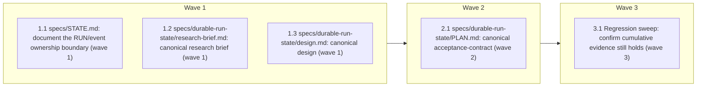

# Durable Run State — Phase D (Evidence and Rollout)

<!-- AT-A-GLANCE:BEGIN (generated — do not edit; refreshed by render_plan.py --summarize) -->
## At a glance

**5 tasks · 3 waves · 6 files · 5/5 done**

| Wave | Task | Title | Files | Done (acceptance) |
|---|---|---|---|---|
| 1 | 1.1 | specs/STATE.md: document the RUN/event ownership boundary (wave 1) | specs/STATE.md | New section present at the specified location; existing `## Session End Log` con… |
| 1 | 1.2 | specs/durable-run-state/research-brief.md: canonical research brief (wave 1) | specs/durable-run-state/research-brief.md (new) | File exists at the specified path with the content above. |
| 1 | 1.3 | specs/durable-run-state/design.md: canonical design (wave 1) | specs/durable-run-state/design.md (new) | File exists at the specified path with the content above. |
| 2 | 2.1 | specs/durable-run-state/PLAN.md: canonical acceptance-contract (wave 2) | specs/durable-run-state/PLAN.md (new) | File exists; all 11 acceptance criteria mapped; `grep -c "AC-"` returns ≥11. |
| 3 | 3.1 | Regression sweep: confirm cumulative evidence still holds (wave 3) | none created/modified unless a regression is found (in which case: whichever file
the failing command indicates, plus a note in this spec's `SUMMARY.md` under `### Deviations`) | Every re-run command exits 0; any regression found is fixed and logged in this p… |



### Progress
- [x] 1.1 — specs/STATE.md: document the RUN/event ownership boundary (wave 1)
- [x] 1.2 — specs/durable-run-state/research-brief.md: canonical research brief (wave 1)
- [x] 1.3 — specs/durable-run-state/design.md: canonical design (wave 1)
- [x] 2.1 — specs/durable-run-state/PLAN.md: canonical acceptance-contract (wave 2)
- [x] 3.1 — Regression sweep: confirm cumulative evidence still holds (wave 3)
<!-- AT-A-GLANCE:END -->

## 1. Motivation

Phases A (engine, PR #164), B (portable deployment, PR #166), and C (core workflow checkpoints,
PR #167, open) built and wired a durable run-state contract, but the feature has no single
canonical account of itself — each phase's `specs/gh-129-durable-run-state-phase-{a,b,c}/` folder
documents only its own slice, and `specs/STATE.md` (the pre-existing session-breadcrumb
mechanism) has no stated relationship to the new per-spec `RUN.json`/`events.jsonl` durable
state. Phase D (per GitHub issue #129, "Phase D — Evidence and rollout") closes this: it
documents the ownership boundary, ships one consolidated `specs/durable-run-state/` spec folder,
re-verifies the cumulative evidence across all three phases, and confirms the whole contract
passes the existing macOS+Ubuntu CI matrix.

## 2. Non-goals

(Quoted verbatim from issue #129's Phase D section.)

- Proposal 2 retry budgets, self-healing loops, or agentic recovery.
- Slack, GitHub, Linear, or PagerDuty event adapters.
- Automatic merge detection.
- Raw transcript synchronization.
- Multi-run archival per slug.
- SQLite or third-party runtime dependencies.
- A dashboard or automatic policy self-modification.
- Authoring a new CI workflow — `.github/workflows/harness-ci.yml` already runs a
  `ubuntu-latest`/`macos-latest` matrix on every PR (`on: pull_request`, no branch filter); Phase
  D validates against it, it does not add one.
- Fixing the two known limitations Phase C's correctness-review already disclosed as advisory/
  deferred (CI `shipped`-checkpoint persistence gap; stale active-runs never expiring) — those are
  tracked in Phase C's `SUMMARY.md`, not re-litigated here.
- Editing `specs/gh-129-durable-run-state-phase-c/` — that folder lives on an unmerged branch
  (PR #167) not present in this checkout; Phase D's regression sweep (Task 3.1) covers Phase A
  and B, which are merged and present.

## 3. Success Criteria

| ID | Behavior (observable) | Check (re-runnable) | Expected |
|------|-------------------------|-----------------------|------------|
| SC-1 | `specs/STATE.md` documents the RUN/event ownership boundary | `grep -q "RUN.json" specs/STATE.md` | exit 0 |
| SC-2 | `specs/durable-run-state/research-brief.md` exists and cites the real engine module | `grep -q "runtime/run_state.py" specs/durable-run-state/research-brief.md` | exit 0 |
| SC-3 | `specs/durable-run-state/design.md` exists and documents all 4 phases | `grep -q "Phase D" specs/durable-run-state/design.md` | exit 0 |
| SC-4 | `specs/durable-run-state/PLAN.md` exists with its own acceptance-contract table | `grep -q "## 3. Success Criteria" specs/durable-run-state/PLAN.md` | exit 0 |
| SC-5 | `specs/durable-run-state/PLAN.md` maps every one of the issue's 11 acceptance criteria to a phase + a re-runnable check | `[ "$(grep -c "AC-" specs/durable-run-state/PLAN.md)" -ge 11 ]` | exit 0 |
| SC-6 | Phase A's engine test suite (now at its Phase-B-relocated path) still passes | `python3 -m pytest runtime/test_run_state.py -q` | exit 0 |
| SC-7 | Phase B's portable-deploy regression suite still passes | `bash tests/scripts/runtime-sync.test.sh` | exit 0 |
| SC-8 | `harness-manifest.json` still validates cumulatively (all phases' contracts) | `python3 scripts/check_manifest.py` | exit 0 |
| SC-9 | The pushed branch's CI run passes on both matrix legs (ubuntu-latest, macos-latest) | `gh pr checks` | exit 0 |

## 4. Tasks

### Task 1.1 — specs/STATE.md: document the RUN/event ownership boundary (wave 1)

- **Files:** specs/STATE.md
- **Action:** Add a new section, `## RUN/Event State vs. This File`, immediately after the
  existing `## Notes` section and before `## Session End Log`. Content:

  ```markdown
  ## RUN/Event State vs. This File

  This file and `specs/<slug>/RUN.json` + `events.jsonl` (added in GitHub issue #129, "Durable
  Run State Contract") track different things at different granularities — they are
  complementary, not competing:

  | | `specs/STATE.md` (this file) | `specs/<slug>/RUN.json` + `events.jsonl` |
  |---|---|---|
  | Scope | One session's current focus | One spec's entire lifecycle |
  | Granularity | Session-level: "what am I working on right now" | Per-spec-slug: durable FSM state (`queued` → ... → `shipped`) |
  | Written by | `hooks/state-breadcrumb.sh` (SessionEnd), manually by skills | `runtime/run_state.py` (`init`/`transition`), called from `feature-intake`, `subagent-driven-development`, `finishing-a-development-branch`, and (meta-repo-only) `post-merge-maintenance.yml` |
  | Lifetime | Overwritten each session; "Active Spec" always names the most recent | Append-only event log per slug; every spec that ever ran `feature-intake` keeps its own record indefinitely |
  | Discoverable via | Read directly, or `/session-tracker` | `runtime/run_state.py list --active[--json]`, surfaced at SessionStart (`hooks/session-knowledge.sh`) and on-demand (`scripts/harness-status.sh`, meta-repo-only) |
  | Answers | "What was I doing when the session ended?" | "Where is spec X in its lifecycle, across every session that ever touched it?" |

  **Compatibility boundary.** A spec created before GitHub issue #129 (no `RUN.json`) is
  unaffected: every run-state checkpoint call is unconditionally non-fatal (`|| true`), so an
  older spec with no `RUN.json` simply never gets tracked by the new system — it remains fully
  usable via `STATE.md`/`/session-tracker` exactly as before. The two mechanisms never write to
  or read from each other's files; a consuming repo can have `STATE.md` with no `RUN.json`
  anywhere (Phase A/B not yet wired) or vice versa is not possible (Phase C's checkpoints are
  additive prose in already-existing skills, not a replacement for `state-breadcrumb.sh`).
  ```

- **Verify:** `grep -q "RUN/Event State vs. This File" specs/STATE.md`
- **Done:** New section present at the specified location; existing `## Session End Log` content
  unchanged below it.

### Task 1.2 — specs/durable-run-state/research-brief.md: canonical research brief (wave 1)

- **Files:** specs/durable-run-state/research-brief.md (new)
- **Action:** Create the directory and file. This is the Phase D **deliverable** research brief
  (a documentation product, not this task's own planning artifact) — it consolidates what already
  exists across Phases A–C so a future reader never has to re-derive it. Content:

  ```markdown
  # Durable Run State — Research Brief (canonical, GitHub issue #129)

  Consolidates what already exists across Phases A (engine), B (portable deployment), and C
  (core workflow checkpoints) of the Durable Run State Contract. Written at Phase D (Evidence
  and rollout) so a future reader never has to re-derive this from three separate phase folders.

  ## What already exists

  - **Engine** (`runtime/run_state.py`, Phase A → relocated by Phase B): stdlib-only Python CLI.
    Subcommands: `init`, `transition`, `status`, `list`, `rebuild`. Exit codes: 0
    (success/idempotent), 2 (invalid input/transition), 3 (storage error). A 16-state FSM —
    `queued → investigating → planning → implementing → verifying → ready_to_merge → shipped`
    (happy path), plus `TERMINAL_STATES` (`shipped`/`cancelled`/`superseded`), `INTERRUPT_STATES`
    (`blocked`/`escalated`), `WAITING_STATES` (`awaiting_confirmation`/`awaiting_ci`/
    `awaiting_review`). Storage: `specs/<slug>/events.jsonl` (append-only) +
    `specs/<slug>/RUN.json` (current projection, atomically rewritten). `fcntl.flock` locking
    for concurrent-writer safety; idempotent event replay via `--event-id`.
  - **Portable deployment** (Phase B, PR #166): the engine lives at `runtime/` (not `scripts/`),
    registered in `scripts/deploy-harness.sh`'s `SYNCED_DIRS_RE` and
    `scripts/install-harness.sh`'s `PAYLOAD` array — every consuming repo gets it on
    install/resync, landing at `.claude/runtime/run_state.py`.
  - **Workflow checkpoints** (Phase C, PR #167, open against the epic branch): 8 checkpoints
    across 6 files call the engine — `skills/feature-intake/SKILL.md` (init + investigating +
    lane-scoped planning), `skills/subagent-driven-development/SKILL.md` (implementing +
    verifying), `skills/finishing-a-development-branch/SKILL.md` (ready_to_merge),
    `hooks/session-knowledge.sh` (SessionStart active-run summary),
    `scripts/harness-status.sh` (on-demand Active Runs section, meta-repo-only),
    `.github/workflows/post-merge-maintenance.yml` (shipped-on-merge, meta-repo-only). Every
    checkpoint call is unconditionally non-fatal (`|| true`). Only normal/high-risk lanes get the
    full chain; `tiny`-lane runs intentionally stop at `investigating`.
  - **Pre-existing, adjacent mechanism**: `specs/STATE.md` + `hooks/state-breadcrumb.sh`
    (SessionEnd) — tracks one session's current focus, not a per-spec durable FSM. Phase D
    (Task 1.1) documents the boundary between the two; they do not read or write each other's
    files.

  ## Known, disclosed limitations (not fixed by this phase — see Non-goals)

  - The CI `shipped` checkpoint (`post-merge-maintenance.yml`) writes `RUN.json`/`events.jsonl`
    in the runner's ephemeral checkout, but nothing commits those files, so the transition
    frequently no-ops today. Recorded as advisory in Phase C's `SUMMARY.md`.
  - A `tiny`-lane or abandoned run never reaches a terminal state, so `list --active`'s consumers
    (`session-knowledge.sh`, `harness-status.sh`) will accumulate stale entries over time
    (bounded to 5 displayed, unbounded underlying). Deferred by explicit user decision during
    Phase C.

  ## What Phase D adds

  - This brief, `design.md`, and a canonical `PLAN.md` under `specs/durable-run-state/` — a
    single consolidated account of the whole feature, cross-referencing each phase's own
    `specs/gh-129-durable-run-state-phase-{a,b,c}/` folder rather than duplicating their content.
  - A documented ownership boundary with `specs/STATE.md` (Task 1.1).
  - A regression sweep confirming Phase A/B's evidence still holds cumulatively (Task 3.1).
  - Confirmation that the whole contract passes the existing macOS+Ubuntu CI matrix (SC-9).

  ## Sources

  - `specs/gh-129-durable-run-state-phase-a/SUMMARY.md`, `PLAN.md` — engine (all Verify rows,
    Advisory/Intent Findings).
  - `specs/gh-129-durable-run-state-phase-b/SUMMARY.md`, `PLAN.md`, `design.md` — portable
    deployment.
  - `specs/gh-129-durable-run-state-phase-c/SUMMARY.md`, `PLAN.md`, `design.md` (on branch
    `feat/gh-129-durable-run-state-phase-c`, PR #167 — not present in this checkout since it is
    unmerged; cited from the PR/branch, not re-read line-by-line here since the branch this task
    runs from does not have it checked out).
  - `runtime/run_state.py` (current, this checkout).
  ```

- **Verify:** `grep -q "runtime/run_state.py" specs/durable-run-state/research-brief.md`
- **Done:** File exists at the specified path with the content above.

### Task 1.3 — specs/durable-run-state/design.md: canonical design (wave 1)

- **Files:** specs/durable-run-state/design.md (new)
- **Action:** Create the file. This is the Phase D **deliverable** design doc — a consolidated
  architecture account, not a new design decision (all real design decisions were made and
  recorded in each phase's own `design.md`; this file cross-references them). Content:

  ```markdown
  # Durable Run State — Design (canonical, GitHub issue #129)

  Consolidated design account for the whole Durable Run State Contract (Phases A–D). Real design
  decisions were made and recorded in each phase's own `design.md`
  (`specs/gh-129-durable-run-state-phase-{b,c}/design.md` — Phase A predates a `design.md`
  requirement for its lane). This file cross-references them rather than re-deciding anything.

  ## 1. Architecture overview

  ```mermaid
  flowchart LR
      subgraph "Phase A — Engine"
          E["runtime/run_state.py<br/>16-state FSM, stdlib-only CLI"]
      end
      subgraph "Phase B — Portable deployment"
          D["deploy-harness.sh / install-harness.sh<br/>ships runtime/ to every consumer"]
      end
      subgraph "Phase C — Workflow checkpoints"
          C1["feature-intake"] --> C2["subagent-driven-development"]
          C2 --> C3["finishing-a-development-branch"]
          C4["session-knowledge.sh"]
          C5["harness-status.sh (meta-repo-only)"]
          C6["post-merge-maintenance.yml (meta-repo-only)"]
      end
      E --> D --> C1
      C1 --> C4
      C3 --> C6
  ```

  ## 2. Ownership boundary with `specs/STATE.md`

  See `specs/STATE.md` → `## RUN/Event State vs. This File` (Phase D, Task 1.1) for the full
  table. Summary: `STATE.md` is session-scoped and human-focused; `RUN.json`/`events.jsonl` is
  per-spec-slug and durable across sessions. Neither reads nor writes the other's files.

  ## 3. Portability boundary

  Checkpoints 1–6 (per `specs/gh-129-durable-run-state-phase-c/design.md` §3) are portable —
  shipped to every consuming repo via Phase B's deploy/install registration. Checkpoints 7–8
  (`harness-status.sh`, `post-merge-maintenance.yml`) are meta-repo-only tooling: `scripts/` and
  `.github/workflows/` are never distributed (confirmed via direct grep of
  `SYNCED_DIRS_RE`/`PAYLOAD` in both distribution scripts — neither references `.github` or a
  bare `scripts/`).

  ## 4. Known, disclosed limitations

  See `research-brief.md` → "Known, disclosed limitations." Both are Phase C findings, both
  explicitly deferred (one advisory/scored-below-fix-threshold, one by direct user decision) —
  not re-opened here.

  ## 5. Non-goals

  See `PLAN.md` §2 (issue #129's Phase D Non-goals, quoted verbatim) — this design doc does not
  restate them to avoid drift between two copies.
  ```

- **Verify:** `grep -q "Phase D" specs/durable-run-state/design.md`
- **Done:** File exists at the specified path with the content above.

### Task 2.1 — specs/durable-run-state/PLAN.md: canonical acceptance-contract (wave 2)

- **Files:** specs/durable-run-state/PLAN.md (new)
- **Action:** Depends on Tasks 1.1–1.3 landing first (references `research-brief.md`/
  `design.md`). This is the Phase D **deliverable** canonical plan — since the actual
  implementation is already done (Phases A–C), this file's job is the acceptance-contract
  mapping the issue's 11 verbatim acceptance criteria to the phase and re-runnable check that
  already proves each one, not a plan to build new code. Use the same YAML frontmatter shape as
  any `PLAN.md` (`slug: durable-run-state`, `status: shipped` — since the underlying work is
  already merged/in-review, this canonical rollup ships as a completed record) but its own
  `## 3. Success Criteria` table uses a distinct `AC-<n>` (Acceptance Criterion) id prefix rather
  than `SC-<n>`, to make clear these are the issue's own acceptance criteria, not this task's:

  ```markdown
  ---
  slug: durable-run-state
  status: shipped
  owner: Minh Tran
  created: 2026-07-24
  ---

  # Durable Run State — Canonical Plan (GitHub issue #129)

  ## 1. Motivation

  See `research-brief.md` and `design.md` in this folder. This file is the acceptance-contract
  rollup: it maps every one of issue #129's acceptance criteria to the phase that satisfies it
  and the re-runnable check that proves it, so a reader (or CI) can confirm the whole contract
  without reading four separate phase folders.

  ## 2. Non-goals

  See `specs/gh-129-durable-run-state-phase-d/PLAN.md` §2 (this rollup's own authoring phase) —
  quoted verbatim from the issue, not restated here to avoid drift.

  ## 3. Success Criteria (issue #129's acceptance criteria, mapped)

  | ID | Behavior (observable) | Check (re-runnable) | Expected |
  |------|-------------------------|-----------------------|------------|
  | AC-1 | A new run can be initialized from a spec SUMMARY and produces valid `RUN.json` + `events.jsonl` | `python3 -m pytest runtime/test_run_state.py -k test_init_creates_queued_run -q` | exit 0 — Phase A |
  | AC-2 | Valid transitions update both artifacts consistently | `python3 -m pytest runtime/test_run_state.py -k test_idempotent_replay_and_conflict -q` | exit 0 — Phase A |
  | AC-3 | Invalid, skipped, reversed, and post-terminal transitions fail without mutation | `python3 -m pytest runtime/test_run_state.py -k "test_invalid_transition_rejected or test_terminal_state_blocks_transition" -q` | exit 0 — Phase A |
  | AC-4 | Rebuilding from `events.jsonl` reproduces the current projection | `python3 -m pytest runtime/test_run_state.py -k test_rebuild_reproduces_projection -q` | exit 0 — Phase A |
  | AC-5 | Duplicate event replay is idempotent; conflicting event reuse is rejected | `python3 -m pytest runtime/test_run_state.py -k test_idempotent_replay_and_conflict -q` | exit 0 — Phase A |
  | AC-6 | Concurrent writers produce contiguous event sequences | `python3 -m pytest runtime/test_run_state.py -k test_concurrent_writers_sequence_contiguously -q` | exit 0 — Phase A (5 real OS processes) |
  | AC-7 | Corrupt or truncated logs fail visibly and do not silently fabricate state | `python3 -m pytest runtime/test_run_state.py -k test_corrupt_log_fails_visibly -q` | exit 0 — Phase A |
  | AC-8 | Active runs are discoverable from SessionStart/status surfaces | `bash tests/hooks/session-knowledge.test.sh` | exit 0 — Phase C |
  | AC-9 | Fresh install and resync deploy `.claude/runtime/` and preserve consumer-owned additions | `bash tests/scripts/runtime-sync.test.sh` | exit 0 — Phase B |
  | AC-10 | Legacy specs remain usable | `python3 -c "import glob,sys; bad=[1 for f in glob.glob('skills/*/SKILL.md') for l in open(f) if 'runtime/run_state.py' in l and 'true' not in l]; sys.exit(1 if bad else 0)"` | exit 0 — fails if any checkpoint call omits its non-fatal guard; passes vacuously before Phase C merges (no references yet) |
  | AC-11 | Full harness tests pass on macOS and Ubuntu | `gh pr checks` | exit 0 — this phase, SC-9 |

  ## 4. Tasks

  None — this is a rollup of already-completed work (Phases A–C), not a plan for new
  implementation. See `specs/gh-129-durable-run-state-phase-{a,b,c,d}/PLAN.md` for the tasks
  that actually built and verified this contract.

  ## 5. Risks

  None beyond what each phase's own `PLAN.md` §5 already discloses.

  ## 6. Status Log

  - 2026-07-24 — Canonical rollup created at Phase D, consolidating Phases A (PR #164), B
    (PR #166), and C (PR #167).
  ```

  Note: AC-10's check is a lightweight static assertion, not a full behavioral test — legacy-spec
  backward compatibility is structurally guaranteed by every checkpoint call being
  unconditionally non-fatal, already proven by Phase A/B/C's own test suites. Unlike a
  vacuously-passing placeholder, this check genuinely fails if any `runtime/run_state.py` call is
  ever added to a `SKILL.md` without its non-fatal guard on the same line.

- **Verify:** `grep -q "## 3. Success Criteria" specs/durable-run-state/PLAN.md && [ "$(grep -c "AC-" specs/durable-run-state/PLAN.md)" -ge 11 ]`
- **Done:** File exists; all 11 acceptance criteria mapped; `grep -c "AC-"` returns ≥11.

### Task 3.1 — Regression sweep: confirm cumulative evidence still holds (wave 3)

- **Files:** none created/modified unless a regression is found (in which case: whichever file
  the failing command indicates, plus a note in this spec's `SUMMARY.md` under `### Deviations`)
- **Action:** Depends on Task 2.1 landing first. Re-run every command listed in `specs/gh-129-durable-run-state-phase-a/SUMMARY.md`'s
  and `specs/gh-129-durable-run-state-phase-b/SUMMARY.md`'s `### Verify` tables (both already
  merged, present in this checkout), plus `python3 scripts/check_manifest.py` and the full
  `bash scripts/run-tests.sh`. Confirm every command still exits 0. If any command fails, that is
  a real regression — fix the underlying code (not the test), following
  `.claude/rules/auto-correct-scope.md` for whether it's a Rule 1–3 auto-fix or a Rule 4 STOP.
  Phase A's test file has since moved (Phase B relocated it from `scripts/test_run_state.py` to
  `runtime/test_run_state.py`) — run the commands at their current paths, not the original
  (already-stale) ones written in Phase A's `SUMMARY.md`.
- **Verify:** `python3 -m pytest runtime/test_run_state.py -q && bash tests/scripts/runtime-sync.test.sh && python3 scripts/check_manifest.py`
- **Done:** Every re-run command exits 0; any regression found is fixed and logged in this
  phase's `SUMMARY.md` under `### Deviations`; `bash scripts/run-tests.sh` is ALL GREEN.

## 5. Risks

- **Documentation drift risk**: the canonical `specs/durable-run-state/` docs summarize Phase C
  content from an unmerged branch (PR #167). If PR #167's diff changes materially before merge,
  this rollup could describe something slightly different from what actually ships. Mitigation:
  Task 1.2/1.3 cite Phase C by its already-reviewed, review-receipt-passed state (unlikely to
  change further); if it does change, a follow-up doc-sync commit is cheap (docs only, no code).
- **SC-9 (`gh pr checks`) cannot be verified until the PR exists and CI has run** — by
  construction, this SC's proof is established during `finishing-a-development-branch`, after
  push, not during task execution. This mirrors how CI-adjacent evidence was handled in prior
  phases (evidence recorded in `SUMMARY.md` once available, not fabricated ahead of time).

## 6. Status Log

- 2026-07-24 — Plan created (proposed).
- 2026-07-24 — Plan marked active; wave 1 dispatched (3 tasks, parallel, disjoint files).
- 2026-07-24 — Wave 1 complete, all `<verify>` green, no deviations:
  - Task 1.1 (specs/STATE.md) — `9d65d77`
  - Task 1.2 (research-brief.md) — `125bd27`
  - Task 1.3 (design.md) — `777f7de`
  - Full suite re-run post-wave: ALL GREEN (214 python tests + shell suites), no regressions.
- 2026-07-24 — Wave 2 dispatched and complete, `<verify>` green, no deviations:
  - Task 2.1 (specs/durable-run-state/PLAN.md) — `811a413`
  - Full suite re-run post-wave: ALL GREEN (214 python tests + shell suites), no regressions.
- 2026-07-24 — Wave 3 dispatched and complete, no regressions found, no deviations:
  - Task 3.1 (regression sweep, SUMMARY.md evidence only) — `4214f5b`
  - Full suite: ALL GREEN (214 python tests + shell suites). All 5 tasks across 3 waves complete.
