# Close context-propagation review escapes (issue #143, Phases 0–5)

<!-- AT-A-GLANCE:BEGIN (generated — do not edit; refreshed by render_plan.py --summarize) -->
## At a glance

**14 tasks · 6 waves · 31 files · 0/14 done**

| Wave | Task | Title | Files | Done (acceptance) |
|---|---|---|---|---|
| 1 | 0.1 | P1 regression fixture: rule referenced, never Read (wave 1) | evals/skills/review-chain/fixtures/context-rule-unread/intent.md, evals/skills/review-chain/fixtures/context-rule-unread/diff.patch, evals/skills/review-chain/fixtures/context-rule-unread/truth.md | Fixture matches the 3-file shape; truth.md names the new defect class and expect… |
| 1 | 0.2 | P2 regression fixture: stale inline policy subset (wave 1) | evals/skills/review-chain/fixtures/stale-inline-policy/intent.md, evals/skills/review-chain/fixtures/stale-inline-policy/diff.patch, evals/skills/review-chain/fixtures/stale-inline-policy/truth.md | Fixture reproduces the 5-of-8 subset defect exactly as escaped on PR #141. |
| 1 | 0.3 | Deterministic regression test for the shipped P1/P2 fixes (wave 1) | tests/scripts/context-propagation-regression.test.sh | 5 cases pass on HEAD; removing either explicit Read (or one STOP case) in a temp… |
| 2 | 1.1 | workflow-engine path signal in risk corroboration (wave 2) | hooks/risk-corroboration.sh, harness-manifest.json, tests/hooks/risk-corroboration.test.sh | 18 hook cases pass; manifest↔hook agreement holds — Success Criterion 2 (block h… |
| 2 | 1.2 | feature-intake guidance: Markdown is not prose-only (wave 2) | skills/feature-intake/SKILL.md, CLAUDE.md | Intake guidance names the workflow-engine gate; hook table stays lint-clean. |
| 3 | 2.1 | context-propagation-audit skill (wave 3) | skills/context-propagation-audit/SKILL.md | Skill documents trigger, matrix, hard-fail rules, and output location — Success … |
| 3 | 2.2 | wire the audit into the workflow (wave 3) | skills/subagent-driven-development/SKILL.md, skills/README.md | Audit is reachable from the standard chain exactly when the trigger fires — Succ… |
| 3 | 2.3 | inline-policy drift lint (wave 3) | tests/scripts/inline-policy-drift.test.sh | A silently drifted inline STOP copy fails CI — design.md acceptance criterion 4. |
| 4 | 3.1 | context-boundary probe protocol (wave 4) | evals/context-boundaries/README.md, evals/context-boundaries/probes/main-session.md, evals/context-boundaries/probes/implementer-subagent.md, evals/context-boundaries/probes/reviewer-agent.md, evals/context-boundaries/probes/scorer-agent.md | Protocol exists with positive+negative probes per context and version-pinning ru… |
| 4 | 3.2 | run the probes, record evidence (wave 4) | evals/context-boundaries/results/2026-07-22-baseline.md | All four contexts have recorded, version-pinned verdicts; zero silent `unconfirm… |
| 5 | 4.1 | review-receipt engine (wave 5) | templates/REVIEW-RECEIPT.template.json, scripts/check_review_receipt.py, scripts/test_check_review_receipt.py, scripts/run-tests.sh, .gitignore | Receipt validates only against the exact reviewed HEAD — Success Criterion 5 (en… |
| 5 | 4.2 | wire receipt writing and the pre-push gate (wave 5) | skills/subagent-driven-development/SKILL.md, skills/finishing-a-development-branch/SKILL.md | A commit after review makes the receipt stale and the finishing skill refuses to… |
| 6 | 5.1 | threshold-75 benchmark run (wave 6) | evals/skills/review-chain/results/2026-07-22-threshold-75.md | Recall + FP measured and recorded with limitations — Success Criterion 6 (benchm… |
| 6 | 5.2 | review-escape ledger (wave 6) | docs/review-escapes.md, evals/skills/review-chain/README.md | Ledger exists, seeded with all three known escapes, wired to the fixture corpus … |

```mermaid
flowchart LR
  subgraph W0[Wave 1]
    T0_1["0.1 P1 regression fixture: rule referenced, never Read (wave 1)"]
    T0_2["0.2 P2 regression fixture: stale inline policy subset (wave 1)"]
    T0_3["0.3 Deterministic regression test for the shipped P1/P2 fixes (wave 1)"]
  end
  subgraph W1[Wave 2]
    T1_1["1.1 workflow-engine path signal in risk corroboration (wave 2)"]
    T1_2["1.2 feature-intake guidance: Markdown is not prose-only (wave 2)"]
  end
  subgraph W2[Wave 3]
    T2_1["2.1 context-propagation-audit skill (wave 3)"]
    T2_2["2.2 wire the audit into the workflow (wave 3)"]
    T2_3["2.3 inline-policy drift lint (wave 3)"]
  end
  subgraph W3[Wave 4]
    T3_1["3.1 context-boundary probe protocol (wave 4)"]
    T3_2["3.2 run the probes, record evidence (wave 4)"]
  end
  subgraph W4[Wave 5]
    T4_1["4.1 review-receipt engine (wave 5)"]
    T4_2["4.2 wire receipt writing and the pre-push gate (wave 5)"]
  end
  subgraph W5[Wave 6]
    T5_1["5.1 threshold-75 benchmark run (wave 6)"]
    T5_2["5.2 review-escape ledger (wave 6)"]
  end
  W0 --> W1
  W1 --> W2
  W2 --> W3
  W3 --> W4
  W4 --> W5
```

### Progress
- [ ] 0.1 — P1 regression fixture: rule referenced, never Read (wave 1)
- [ ] 0.2 — P2 regression fixture: stale inline policy subset (wave 1)
- [ ] 0.3 — Deterministic regression test for the shipped P1/P2 fixes (wave 1)
- [ ] 1.1 — workflow-engine path signal in risk corroboration (wave 2)
- [ ] 1.2 — feature-intake guidance: Markdown is not prose-only (wave 2)
- [ ] 2.1 — context-propagation-audit skill (wave 3)
- [ ] 2.2 — wire the audit into the workflow (wave 3)
- [ ] 2.3 — inline-policy drift lint (wave 3)
- [ ] 3.1 — context-boundary probe protocol (wave 4)
- [ ] 3.2 — run the probes, record evidence (wave 4)
- [ ] 4.1 — review-receipt engine (wave 5)
- [ ] 4.2 — wire receipt writing and the pre-push gate (wave 5)
- [ ] 5.1 — threshold-75 benchmark run (wave 6)
- [ ] 5.2 — review-escape ledger (wave 6)
<!-- AT-A-GLANCE:END -->

## 1. Motivation

PR #141 passed the full local review chain; the external Codex reviewer still found two real
defects — a path-scoped rule referenced but never Read in an isolated subagent context (P1),
and a stale 5-of-8 inline policy copy whose authoritative source was never loaded (P2). No
current oracle proves an instruction reaches every isolated execution context that consumes it,
`risk-corroboration.sh` is blind to skill/prompt Markdown, and review results are not pinned to
the final HEAD SHA. See `design.md` (condensed from issue #143) and `research-brief.md`.

Phase 5's threshold half already shipped (issue #152 / PR #153: default 75 +
`tests/scripts/scorer-threshold-contract.test.sh`). This plan covers everything else.

## 2. Non-goals

Binding, from the issue: no new always-on generic LLM pass; no harness mirror into
Codex/Cursor/OpenCode; no external review requirement for tiny changes; prose-only docs changes
stay non-high-risk; no new inline copies of authoritative policy lists.

## 3. Success Criteria

1. P1/P2 regression fixtures exist; a deterministic test fails if a required explicit Read is
   removed from a covered consumer (mutation-checked).
2. A staged workflow-engine Markdown change with `Lane:` below high-risk is blocked by
   `risk-corroboration.sh`; prose docs changes are not.
3. A change-triggered consumer-audit skill exists and is wired into
   subagent-driven-development; `assumed/unconfirmed` delivery on a load-bearing instruction
   fails the audit.
4. Context-boundary probe protocol + recorded evidence exist; main-session evidence is never
   accepted for child contexts.
5. A machine-readable review receipt is written after reviews and
   `finishing-a-development-branch` refuses to push when `HEAD != reviewed_head_sha` or
   blocking findings are unresolved.
6. Threshold-75 benchmark results (catch rate + false positives + limitations) and a seeded
   review-escape ledger exist.
7. `bash scripts/run-tests.sh` → ALL GREEN throughout.

## 4. Tasks

### Task 0.1 — P1 regression fixture: rule referenced, never Read (wave 1)

- **Files:** evals/skills/review-chain/fixtures/context-rule-unread/intent.md, evals/skills/review-chain/fixtures/context-rule-unread/diff.patch, evals/skills/review-chain/fixtures/context-rule-unread/truth.md
- **Action:** Create the fixture in the existing 3-file shape (see
  `evals/skills/review-chain/fixtures/none-deref/` as the model). `intent.md`: "Add a dispatch
  prompt so implementer subagents classify their self-fixes against the auto-correct-scope
  rule." `diff.patch`: a self-contained diff adding a fictional
  `skills/demo-dispatch/worker-prompt.md` that *references* `.claude/rules/auto-correct-scope.md`
  ("classify deviations per the rule") but contains no instruction to Read it — the isolated
  consumer can never load a path-scoped rule it is only pointed at. `truth.md`: defect class
  `context-propagation`; location = the reference line; expected oracle: the Phase-2
  consumer audit (`/context-propagation-audit`); note that `/correctness-review` and
  `/intent-review` are EXPECTED to miss it (that is the point of the fixture — record as
  `missed` for them, not as their failure); FP description: flagging a prompt that
  pastes the full rule text inline.
- **Verify:** `test -f evals/skills/review-chain/fixtures/context-rule-unread/intent.md -a -f evals/skills/review-chain/fixtures/context-rule-unread/diff.patch -a -f evals/skills/review-chain/fixtures/context-rule-unread/truth.md`
- **Done:** Fixture matches the 3-file shape; truth.md names the new defect class and expected oracle.

### Task 0.2 — P2 regression fixture: stale inline policy subset (wave 1)

- **Files:** evals/skills/review-chain/fixtures/stale-inline-policy/intent.md, evals/skills/review-chain/fixtures/stale-inline-policy/diff.patch, evals/skills/review-chain/fixtures/stale-inline-policy/truth.md
- **Action:** Same shape. `intent.md`: "Give the reviewer prompt the Rule-4 STOP criteria so it
  can classify findings without reading specs." `diff.patch`: adds a fictional
  `skills/demo-review/reviewer-prompt.md` carrying an inline STOP list with only 5 of the 8
  authoritative cases (omit `session-scope`, `high-blast file`, `replace-service` — the exact
  three Codex P2 found missing) and no Read of `rules/auto-correct-scope.md`. `truth.md`:
  defect class `stale-inline-policy`; expected oracle `/context-propagation-audit` (drift lint
  angle); FP description: flagging an inline summary that IS generated/linted against the
  authoritative source.
- **Verify:** `test -f evals/skills/review-chain/fixtures/stale-inline-policy/intent.md -a -f evals/skills/review-chain/fixtures/stale-inline-policy/diff.patch -a -f evals/skills/review-chain/fixtures/stale-inline-policy/truth.md`
- **Done:** Fixture reproduces the 5-of-8 subset defect exactly as escaped on PR #141.

### Task 0.3 — Deterministic regression test for the shipped P1/P2 fixes (wave 1)

- **Files:** tests/scripts/context-propagation-regression.test.sh
- **Action:** New contract test (model:
  `tests/scripts/scorer-threshold-contract.test.sh` — live-file parse + self-mutation check),
  auto-collected by `run-tests.sh` L3. Cases: (1)
  `skills/subagent-driven-development/implementer-prompt.md` contains a `FIRST: Read`
  instruction for `.claude/rules/auto-correct-scope.md` (the `d61e155` fix); (2)
  `skills/correctness-review/correctness-reviewer-prompt.md` contains an explicit Read of the
  same rule before Rule-4 classification (the `1c0f01d` fix); (3) the reviewer prompt's inline
  Rule-4 STOP list covers all 8 cases — the registry and copies use drifted wording on HEAD, so
  match by per-case anchor KEYWORD, not phrase: derive one stable token per registry bullet
  (`schema`, `API contract`, `remov`, `external`, `auth`, `session`, `high-blast`, `replac` —
  extracted from `rules/auto-correct-scope.md` Rule-4 section at runtime, tokens listed at the
  top of the test) and assert each token appears in the prompt's STOP list region; (4) mutation check: copy
  the prompt to mktemp, delete the Read line, re-run the check function, assert it fails; (5)
  mutation check: remove one STOP case from the temp copy, assert the drift check fails.
- **Verify:** `bash tests/scripts/context-propagation-regression.test.sh`
- **Done:** 5 cases pass on HEAD; removing either explicit Read (or one STOP case) in a temp copy is detected — Success Criterion 1.

### Task 1.1 — workflow-engine path signal in risk corroboration (wave 2)

- **Files:** hooks/risk-corroboration.sh, harness-manifest.json, tests/hooks/risk-corroboration.test.sh
- **Action:** Test-first: add 3 cases to `tests/hooks/risk-corroboration.test.sh` — (a) staged
  `skills/x/SKILL.md` diff + SUMMARY `Lane: normal` → blocked with `workflow-engine` named;
  (b) staged `docs/notes.md` (prose) → silent pass; (c) staged `skills/README.md` → silent pass
  (inventory prose, not an engine surface). Run: all 3 fail. Then in
  `hooks/risk-corroboration.sh`, next to the existing path signals (L85–88), add one line
  against `$STAGED_PATHS`:
  `echo "$STAGED_PATHS" | grep -qE '^skills/[^/]+/SKILL\.md$|^skills/[^/]+/[^/]*prompt[^/]*\.md$|^agents/[^/]+\.md$|^rules/[^/]+\.md$' && add_cat "workflow-engine"`
  and a `workflow-engine) echo block ;;` branch in `category_mode()` matching existing style.
  Mirror in `harness-manifest.json` `hard_gates.detectable`:
  `{"slug": "workflow-engine", "mode": "block", "desc": "workflow-as-code: skills/*/SKILL.md, skill dispatch prompts, agents/*.md, rules/*.md — instruction delivery, routing, review gates"}`.
  Deliberately excluded (non-goal: prose stays cheap): `skills/README.md`, `docs/**`,
  `templates/**`, `techstacks/**`.
- **Verify:** `bash tests/hooks/risk-corroboration.test.sh && python3 scripts/check_manifest.py`
- **Done:** 18 hook cases pass; manifest↔hook agreement holds — Success Criterion 2 (block half).

### Task 1.2 — feature-intake guidance: Markdown is not prose-only (wave 2)

- **Files:** skills/feature-intake/SKILL.md, CLAUDE.md
- **Action:** In `skills/feature-intake/SKILL.md`: append to the hard-gates list (L78–95) a
  `workflow-engine surface` bullet (skills/*/SKILL.md, dispatch prompts, agents/, rules/ —
  cite `harness-manifest.json` as canonical), and add one sentence to Step 2: "Markdown under
  these paths is executable workflow code — classify by what it changes (instruction delivery,
  routing, review gates), never as prose." In `CLAUDE.md`, update the
  `risk-corroboration.sh` hook-table row Action cell to mention the workflow-engine path
  signal (doc-truth lint compares this table against `settings.json` wiring, so keep the
  trigger/wired columns unchanged).
- **Verify:** `bash scripts/lint-doc-truth.sh`
- **Done:** Intake guidance names the workflow-engine gate; hook table stays lint-clean.

### Task 2.1 — context-propagation-audit skill (wave 3)

- **Files:** skills/context-propagation-audit/SKILL.md
- **Action:** New change-triggered (NOT always-on) skill. Trigger: the diff touches the
  workflow-engine inventory from Task 1.1. Protocol: for every changed source-of-truth
  (rule/policy/prompt contract), build the matrix
  `Source | Consumer | Execution context (main / implementer / reviewer / scorer / new session) | Delivery (always-loaded / paths:-triggered / pasted / explicit Read) | Proof (test or inspected call site)`.
  Enumeration: `code-review-graph` tools first, then corroborate with grep/read (per the
  boundary-of-trust rule — graph output is untrusted; `not_observed != absent`: every "no
  consumers" claim must cite its search surface). Hard rules: a load-bearing instruction with
  delivery `assumed` or `unconfirmed` FAILS the audit; main-session evidence is not proof for a
  child context; prefer explicit Reads over inline copies; where an inline summary must stay,
  it must be lint-anchored to its registry (Task 2.3 pattern). Output: the matrix + verdict
  into `specs/<slug>/SUMMARY.md` under `### Context-Propagation Audit`. Document standalone
  invocation (`/context-propagation-audit <diff-range>`) and the escaped-defect classes it
  exists for (fixtures from Tasks 0.1/0.2). Dispatch note for waves 3+: the wave-2 gate
  (Task 1.1) will trip on these very skill files — `Lane: high-risk` is already declared in
  this slug's SUMMARY.md, so commits pass; do not "fix" a block by editing the lane.
- **Verify:** `bash scripts/lint-doc-truth.sh`
- **Done:** Skill documents trigger, matrix, hard-fail rules, and output location — Success Criterion 3 (definition half).

### Task 2.2 — wire the audit into the workflow (wave 3)

- **Files:** skills/subagent-driven-development/SKILL.md, skills/README.md
- **Action:** In `subagent-driven-development/SKILL.md`, immediately before the
  `/correctness-review` prose step (the "Final Adversarial Correctness Review" section,
  ~L165–191 — NOT the `digraph process` block at L56–110, whose L76–78 node labels merely name
  the same steps): "If the cumulative diff touches the workflow-engine inventory
  (`harness-manifest.json` → `workflow-engine`), run `/context-propagation-audit` first; an
  audit FAIL blocks the review chain until delivery is proven or the change is escalated." Add
  the matching node to the `digraph process` block (L56–110). Add the skill row to
  `skills/README.md` inventory (mark **change-triggered**), and note in its `/correctness-review`
  row that context-propagation defects belong to the audit, not the bug hunt.
- **Verify:** `bash scripts/lint-doc-truth.sh && grep -q "context-propagation-audit" skills/subagent-driven-development/SKILL.md`
- **Done:** Audit is reachable from the standard chain exactly when the trigger fires — Success Criterion 3 (wiring half).

### Task 2.3 — inline-policy drift lint (wave 3)

- **Files:** tests/scripts/inline-policy-drift.test.sh
- **Action:** Generalize the registry-anchored drift pattern for the one remaining known
  duplicated policy: the Rule-4 STOP list (registry: `rules/auto-correct-scope.md`; known
  inline copies: `skills/correctness-review/correctness-reviewer-prompt.md`,
  `skills/correctness-review/SKILL.md`). Parse the case list from the registry, assert every
  case appears in each copy, and mutation-check (temp copy minus one case → detected).
  Match by per-case anchor keyword as in Task 0.3 (registry wording and copy wording have
  legitimately drifted; keywords are the stable contract). Scorer-threshold drift is already
  covered by `scorer-threshold-contract.test.sh` — do not duplicate it; state the division in
  the header comment. Keep the copies list explicit at the top of the file so adding a future
  copy is one line.
- **Verify:** `bash tests/scripts/inline-policy-drift.test.sh`
- **Done:** A silently drifted inline STOP copy fails CI — design.md acceptance criterion 4.

### Task 3.1 — context-boundary probe protocol (wave 4)

- **Files:** evals/context-boundaries/README.md, evals/context-boundaries/probes/main-session.md, evals/context-boundaries/probes/implementer-subagent.md, evals/context-boundaries/probes/reviewer-agent.md, evals/context-boundaries/probes/scorer-agent.md
- **Action:** New eval subtree (manual protocol, same philosophy as review-chain v1 — no
  runner). README: purpose (prove instruction *delivery* per context, both positive and
  negative), procedure (run each probe prompt in its real context: main session, implementer
  via Task dispatch, reviewer via the read-only `reviewer` agent, scorer via cheap-model
  dispatch), evidence rules (record `claude --version` + repo HEAD sha with every run;
  a main-session result is VALID ONLY for main; an unconfirmed load-bearing boundary lowers
  confidence or blocks — it must never be recorded as mitigated), and staleness (results are
  version-pinned; re-probe after Claude Code upgrades). Each probe file: the exact dispatch
  prompt, the marker the context must echo if the instruction arrived (e.g. quote line 1 of
  `rules/auto-correct-scope.md`), the negative control (a path-scoped rule that must NOT be
  auto-loaded there), and a results-recording stanza.
- **Verify:** `test -f evals/context-boundaries/README.md -a -f evals/context-boundaries/probes/main-session.md -a -f evals/context-boundaries/probes/implementer-subagent.md -a -f evals/context-boundaries/probes/reviewer-agent.md -a -f evals/context-boundaries/probes/scorer-agent.md`
- **Done:** Protocol exists with positive+negative probes per context and version-pinning rules.

### Task 3.2 — run the probes, record evidence (wave 4)

- **Files:** evals/context-boundaries/results/2026-07-22-baseline.md
- **Action:** Execute all four probes on the current Claude Code version. The results file is
  named for the plan date; if executed on a later date, update the filename in this task's
  Files and Verify in the same commit (keeps `blast-radius-check` in scope). Record per
  context: probe, expected, observed, verdict
  (`delivered / not-delivered / unconfirmed`), `claude --version`, HEAD sha. Any
  `unconfirmed` on a load-bearing boundary: open an escalation block per
  `templates/ESCALATIONS.template.md` instead of shipping an assumption — this is the
  anti-pattern that caused #141.
- **Verify:** `grep -qE 'claude --version|Claude Code version' evals/context-boundaries/results/2026-07-22-baseline.md && grep -q 'verdict' evals/context-boundaries/results/2026-07-22-baseline.md`
- **Done:** All four contexts have recorded, version-pinned verdicts; zero silent `unconfirmed` — Success Criterion 4.

### Task 4.1 — review-receipt engine (wave 5)

- **Files:** templates/REVIEW-RECEIPT.template.json, scripts/check_review_receipt.py, scripts/test_check_review_receipt.py, scripts/run-tests.sh, .gitignore
- **Action:** Test-first (pytest). Template schema:
  `{"reviewed_head_sha": "", "reviews": [{"type": "correctness|intent|context-propagation-audit", "reviewer": "<model-or-tier>", "result": "pass|fail", "blocking_open": 0, "advisory_open": 0}], "created": "<iso8601>"}`.
  `check_review_receipt.py <specs/slug-dir>`: exit 1 with a one-line reason when the receipt is
  missing, malformed, `reviewed_head_sha != git rev-parse HEAD`, any review `result: fail`, or
  any `blocking_open > 0`; exit 0 otherwise; `--require correctness,intent` asserts those
  review types are present (a prose-only Verify row can never satisfy it — the sha comparison
  is against live git state). Receipt lives at `specs/<slug>/.review-receipt.json`: add the
  `.gitignore` pattern (derived, machine-local — same policy as `PLAN.html` /
  `.plan-review.json`). Append `scripts/test_check_review_receipt.py` to the `PYTESTS` list in
  `scripts/run-tests.sh` (explicit list — see research brief §6). Tests: fresh receipt passes;
  new commit → stale → exit 1; blocking_open > 0 → exit 1; missing type with `--require` →
  exit 1; malformed JSON → exit 1.
- **Verify:** `bash -c 'PYBIN="${TMPDIR:-/tmp}/harness-tests-venv/bin/python"; [ -x "$PYBIN" ] || PYBIN=python3; "$PYBIN" -m pytest scripts/test_check_review_receipt.py -q --no-header --no-cov -p no:cacheprovider'`
- **Done:** Receipt validates only against the exact reviewed HEAD — Success Criterion 5 (engine half).

### Task 4.2 — wire receipt writing and the pre-push gate (wave 5)

- **Files:** skills/subagent-driven-development/SKILL.md, skills/finishing-a-development-branch/SKILL.md
- **Action:** `subagent-driven-development/SKILL.md`: after the intent-review prose step
  (~L193–205; the L79–81 hits are digraph node labels, not the step),
  write/refresh `specs/<slug>/.review-receipt.json` from the template with the reviewed HEAD
  sha and per-review results; ANY post-review fix commit invalidates it — re-run the affected
  review and re-write the receipt before handoff (re-review-after-fix, issue AC).
  `finishing-a-development-branch/SKILL.md`: new gate at the top of Step 3 (L74):
  `python3 scripts/check_review_receipt.py specs/<slug> --require correctness,intent` — refuse
  push/PR on exit 1 for normal and high-risk lanes (tiny lane: skip, its route has no review
  chain to pin); on refusal, route back to the stale review, never edit the receipt by hand.
  Add: for high-risk workflow-engine changes, note the existing heterogeneous Codex PR review
  as an optional post-push merge requirement (reference only — no local mirroring, per
  non-goals).
- **Verify:** `bash scripts/lint-doc-truth.sh && grep -q "check_review_receipt" skills/finishing-a-development-branch/SKILL.md`
- **Done:** A commit after review makes the receipt stale and the finishing skill refuses to push — Success Criterion 5.

### Task 5.1 — threshold-75 benchmark run (wave 6)

- **Files:** evals/skills/review-chain/results/2026-07-22-threshold-75.md
- **Action:** Run the manual review-chain protocol (README) over all 7 fixtures (5 existing +
  Tasks 0.1/0.2) at the shipped threshold 75. The results file is named for the plan date; if
  run later, update the filename in Files and Verify in the same commit. Record per
  fixture: `caught / caught-wrong-reason / missed / false-positive` + token cost, using
  `results/template.md` columns. Add a comparison row set against the 2026-07-13/14 threshold-80
  baselines and an explicit Limitations section: n=7, single run, non-deterministic reviewers
  (cite `docs/solutions/harness/skill-eval-blind-run-scoring.md` — blind-run discipline, no
  optimizing for zero auto-fix FPs alone). Report BOTH catch rate and FP cost (issue AC).
  Expected for the two Phase-0 fixtures pre-Phase-2: `missed` by correctness/intent — record
  as baseline for the audit skill, not as chain failure.
- **Verify:** `grep -q "false-positive" evals/skills/review-chain/results/2026-07-22-threshold-75.md && grep -qi "limitations" evals/skills/review-chain/results/2026-07-22-threshold-75.md`
- **Done:** Recall + FP measured and recorded with limitations — Success Criterion 6 (benchmark half).

### Task 5.2 — review-escape ledger (wave 6)

- **Files:** docs/review-escapes.md, evals/skills/review-chain/README.md
- **Action:** Create the ledger: header explaining the rule (every post-push finding by an
  external/heterogeneous reviewer becomes a row AND a regression fixture or a documented
  won't-fix), table `date | PR | finder | class | severity | fixture | status`. Seed with the
  three known escapes: PR #141 P1 (`context-propagation` → fixture `context-rule-unread`),
  PR #141 P2 (`stale-inline-policy` → fixture `stale-inline-policy`), PR #153 P1
  (`missing-regression-guard` → `tests/scripts/scorer-threshold-contract.test.sh`). Add a
  short "Feeding the ledger" section to `evals/skills/review-chain/README.md` linking the two
  (ledger row ↔ fixture) so future escapes follow the same path.
- **Verify:** `test "$(grep -c '| PR #' docs/review-escapes.md)" -eq 3`
- **Done:** Ledger exists, seeded with all three known escapes, wired to the fixture corpus — Success Criterion 6 (ledger half).

## 5. Risks

- **Ceremony creep (issue #67):** the audit is change-triggered by a narrow path inventory;
  prose surfaces are explicitly excluded in Task 1.1. Watch the first weeks of
  `workflow-engine` blocks — if prose-ish skill edits trip it disproportionately, narrow the
  regex, don't add exemption env vars.
- **False positives on the new gate:** every SKILL.md edit now demands `Lane: high-risk` or a
  human narrowing — including small ones (this very plan's Phase-2 skill files will trip it).
  That is the issue's stated intent; the mitigation is the human-narrowing path already in
  `feature-intake`, not a bypass.
- **Receipt is gitignored/local:** the pre-push gate is enforced by skill instruction, not CI
  (a fresh clone has no receipt). Acceptable for v1 (same trust level as the rest of the skill
  chain); a CI variant would need receipts committed — revisit only if local enforcement
  demonstrably leaks.
- **Probe evidence rots:** results are pinned to a Claude Code version; the README staleness
  rule (re-probe on upgrade) is the guard. A probe that can no longer be reproduced downgrades
  the boundary to `unconfirmed`, which blocks — by design.
- **Benchmark n is tiny (n=7, single run):** stated in Limitations; trends only, no
  threshold retuning off this run alone (issue #61 protocol).

## 6. Status Log

- 2026-07-22 — Plan drafted (all phases of issue #143). Phase 5 threshold half pre-shipped via
  issue #152 / PR #153 (`aa92c22`, `879dfcc` on `fix/scorer-threshold-152`, PR open).
