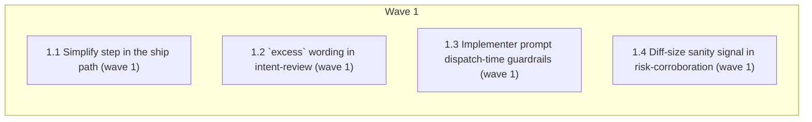

# Enforce Simplicity First: prevent over-coding / over-engineering (issue #159)

<!-- AT-A-GLANCE:BEGIN (generated — do not edit; refreshed by render_plan.py --summarize) -->
## At a glance

**4 tasks · 1 waves · 6 files · 4/4 done**

| Wave | Task | Title | Files | Done (acceptance) |
|---|---|---|---|---|
| 1 | 1.1 | Simplify step in the ship path (wave 1) | skills/subagent-driven-development/SKILL.md | Step is present and ordered before `/correctness-review` — SC-1. |
| 1 | 1.2 | `excess` wording in intent-review (wave 1) | skills/intent-review/SKILL.md, skills/intent-review/intent-reviewer-prompt.md | Wording present in both files — SC-2. |
| 1 | 1.3 | Implementer prompt dispatch-time guardrails (wave 1) | skills/subagent-driven-development/implementer-prompt.md | Constraint text appears before the task body — SC-3. |
| 1 | 1.4 | Diff-size sanity signal in risk-corroboration (wave 1) | hooks/risk-corroboration.sh, tests/hooks/risk-corroboration.test.sh | New cases pass; hook exit code unchanged on the warn path — SC-4. |

### Progress
- [x] 1.1 — Simplify step in the ship path (wave 1)
- [x] 1.2 — `excess` wording in intent-review (wave 1)
- [x] 1.3 — Implementer prompt dispatch-time guardrails (wave 1)
- [x] 1.4 — Diff-size sanity signal in risk-corroboration (wave 1)
<!-- AT-A-GLANCE:END -->

## 1. Motivation

`rules/behavior.md` §2 (Simplicity First) states the principle but nothing in the workflow
verifies it — agent output still trends toward speculative abstractions, unrequested config
knobs, error handling for impossible cases, and ceremony creep on tiny changes. See
`design.md` (condensed from issue #159 and its own follow-up audit comment) for the full
problem statement, current-state audit, and design decisions D1–D5.

## 2. Non-goals

Binding, from the issue: no new hook; no new block-mode gate (diff-size signal and the
simplify insertion stay warn/apply-in-diff only); no rewrite of `/simplify`, `intent-review`,
or `risk-corroboration.sh` beyond targeted insertions.

## 3. Success Criteria

| ID | Behavior (observable) | Check (re-runnable) | Expected |
|----|------------------------|----------------------|----------|
| SC-1 | `subagent-driven-development` runs `/simplify` on the accumulated diff before `/correctness-review` whenever the diff crosses the D4 threshold | `grep -n "simplify" skills/subagent-driven-development/SKILL.md` | exit 0 — step present, ordered before the correctness-review section |
| SC-2 | `intent-review`'s `excess` definition names config knobs and new public surface explicitly | `grep -q "config knob" skills/intent-review/intent-reviewer-prompt.md` | exit 0 |
| SC-3 | The implementer dispatch prompt restates Simplicity First constraints before the task body, not only in the trailing self-check | `grep -in "minimum code that solves the problem" skills/subagent-driven-development/implementer-prompt.md` | exit 0 — match appears above line 91 (the existing self-check line) |
| SC-4 | `risk-corroboration.sh` prints a warn-only note (never blocks) when changed-line count is out of proportion to the declared lane | `bash tests/hooks/risk-corroboration.test.sh` | exit 0 — new diff-size case passes, exit code of the hook itself stays 0 on the warn path |
| SC-5 | The doc-truth lint stays clean after all four skill/prompt/hook edits | `bash scripts/lint-doc-truth.sh` | exit 0 |

## 4. Tasks

### Task 1.1 — Simplify step in the ship path (wave 1)

- **Files:** skills/subagent-driven-development/SKILL.md
- **Action:** Insert a step immediately after the `## Final Adversarial Correctness Review`
  heading (currently L137 of `skills/subagent-driven-development/SKILL.md`), before the existing
  "Pre-gate — context-propagation audit" paragraph: if the cumulative diff has ≥10 substantive
  (non-docs/format/lockfile) changed lines (D4 threshold), run `/simplify` over the diff before
  `/correctness-review`; re-run the task's test loop after any apply. State the D3 carve-out:
  this pass edits an unmerged, pre-ship diff, so deletion is allowed here — unlike
  `intent-review`'s post-hoc `excess` verdict, which stays report-only. No `digraph process`
  block currently exists in this file (verified) — skip that sub-step.
- **Verify:** `grep -n "simplify" skills/subagent-driven-development/SKILL.md`
- **Done:** Step is present and ordered before `/correctness-review` — SC-1.

### Task 1.2 — `excess` wording in intent-review (wave 1)

- **Files:** skills/intent-review/SKILL.md, skills/intent-review/intent-reviewer-prompt.md
- **Action:** In `intent-reviewer-prompt.md` (~L85-86), extend the `excess` definition to
  explicitly name "config knobs / new public surface not traceable to any intent clause" and
  state findings of this class are flagged by default. Add the same D3 carve-out sentence used
  in Task 1.1 to both files: `excess` here is a post-hoc verdict on the final diff (report-only,
  Rule 4 applies to removal), distinct from the simplify pass's pre-ship deletion.
- **Verify:** `grep -q "config knob" skills/intent-review/intent-reviewer-prompt.md`
- **Done:** Wording present in both files — SC-2.

### Task 1.3 — Implementer prompt dispatch-time guardrails (wave 1)

- **Files:** skills/subagent-driven-development/implementer-prompt.md
- **Action:** Near the top of the prompt (before the task body, not only in the trailing
  self-check at L88), restate: "Minimum code that solves the problem. No abstractions for
  single-use code. Every changed line must trace to the request." Keep the existing L88
  self-check line unchanged.
- **Verify:** `grep -n "minimum code that solves the problem" skills/subagent-driven-development/implementer-prompt.md`
- **Done:** Constraint text appears before the task body — SC-3.

### Task 1.4 — Diff-size sanity signal in risk-corroboration (wave 1)

- **Files:** hooks/risk-corroboration.sh, tests/hooks/risk-corroboration.test.sh
- **Action:** Test-first: add cases to `tests/hooks/risk-corroboration.test.sh` — (a) staged
  diff >150 changed lines with `Lane: tiny` → warn note printed, hook still exits 0; (b) staged
  diff >600 changed lines with `Lane: normal` → warn note printed, exit 0; (c) a small diff
  under both thresholds → no note. Run: new cases fail. Then in `hooks/risk-corroboration.sh`,
  after the existing lane corroboration, count total changed lines from `$CODE_ADDED` +
  `$CODE_REMOVED` and print a note (to stderr or stdout, matching the hook's existing warn
  style) suggesting `/simplify` when the count exceeds the declared lane's threshold (150 for
  tiny, 600 for normal — high-risk has no threshold, ceremony is expected there). Warn-only:
  never change the hook's exit code for this signal — existing block-mode gates are untouched.
- **Verify:** `bash tests/hooks/risk-corroboration.test.sh`
- **Done:** New cases pass; hook exit code unchanged on the warn path — SC-4.

## 5. Risks

- **Threshold tuning:** D4's 10-line trigger and D5's 150/600-line thresholds are the issue
  author's suggested starting points, not measured — expect to revisit after the first weeks of
  use if the simplify pass fires too often on legitimately-sized changes or the diff-size note
  fires on necessarily large mechanical diffs (e.g. generated files, renames).
- **D3 carve-out clarity:** two files (simplify-path ship step, intent-review) both need the
  same wording so a reader never sees contradictory deletion-authority guidance between the
  pre-ship pass and the post-hoc `excess` verdict — keep the wording identical, not paraphrased.
- **workflow-engine gate:** all four files are skill/prompt/hook markdown, so this change trips
  the `workflow-engine` hard gate at commit time (warn-mode per `harness-manifest.json`) —
  expect a note, not a block; declare the intake lane accordingly when this plan executes.

## 6. Status Log

- 2026-07-23 — Plan drafted from issue #159 and its own follow-up audit comment (design
  decisions D1–D5, current-state table, wave-1/wave-2 split). Wave 2 items from the issue
  comment (context-propagation-audit dogfood, CHANGELOG/VERSION bookkeeping) are execution-time
  ceremony, not authored plan tasks — they run automatically via the standard ship chain and the
  post-merge bookkeeping PR when this plan is executed, per `docs/solutions/harness/manual-version-bump-collides-with-event-sourced-bookkeeping.md`.
- 2026-07-23 — Executed wave 1 on `feat/gh-159-simplicity-enforcement` (worktree
  `.claude/worktrees/feat+gh-159-simplicity-enforcement`): Task 1.1 `07f76b8`, Task 1.2 `31e6784`
  (+ quality-review fix `4669f20`), Task 1.3 `9d972ad` (+ quality-review fix `0e121fc`), Task 1.4
  `514f8cc` (relocated from an errant commit `55bcabf` an implementer subagent made on the shared
  `loop` branch by using the wrong working directory — cherry-picked onto the correct branch, the
  errant commit reset off `loop`, and `loop`'s pre-existing uncommitted STATE.md breadcrumb
  restored exactly). All four tasks passed spec-compliance review; code-quality review found two
  minor wording issues (1.2, 1.3, both fixed) and one false-positive "critical" (a reviewer
  couldn't find `/simplify` as a repo skill file — confirmed via `strings` on the `claude` binary
  that it's a genuine compiled-in built-in command, not a repo skill). `bash
  tests/hooks/risk-corroboration.test.sh` (31/31) and `bash scripts/run-tests.sh` (ALL GREEN)
  both pass on HEAD.
