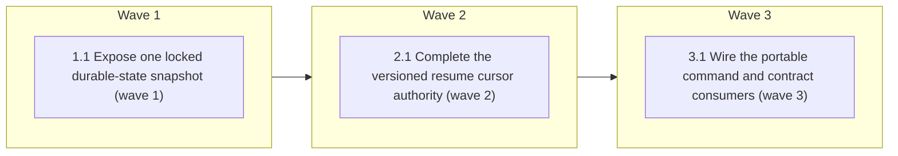

# Complete #175: make separate-session resume evidence-driven

<!-- AT-A-GLANCE:BEGIN (generated — do not edit; refreshed by render_plan.py --summarize) -->
## At a glance

**3 tasks · 3 waves · 9 files · 3/3 done**

| Wave | Task | Title | Files | Done (acceptance) |
|---|---|---|---|---|
| 1 | 1.1 | Expose one locked durable-state snapshot (wave 1) | runtime/run_state.py, runtime/test_run_state.py | one shared locked snapshot owns storage topology/validation; status behavior is … |
| 2 | 2.1 | Complete the versioned resume cursor authority (wave 2) | runtime/resume_decision.py, runtime/test_resume_decision.py | the helper answers both lifecycle route and task cursor with stable reason codes… |
| 3 | 3.1 | Wire the portable command and contract consumers (wave 3) | skills/subagent-driven-development/SKILL.md, skills/subagent-driven-development/references/resume.md, harness-manifest.json, tests/scripts/runtime-sync.test.sh, tests/scripts/sdd-resume-cursor.test.sh | source and deployed sessions invoke the same authority; the manifest exposes its… |

### Progress
- [x] 1.1 — Expose one locked durable-state snapshot (wave 1)
- [x] 2.1 — Complete the versioned resume cursor authority (wave 2)
- [x] 3.1 — Wire the portable command and contract consumers (wave 3)
<!-- AT-A-GLANCE:END -->

## 1. Motivation

PR #179 replaced Step -1's prose state table with `runtime/resume_decision.py`, but the helper
implements only durable-state routing. It does not reconstruct the task cursor from PLAN/git,
consume SUMMARY/STATE context, enforce the shipped-plan exception, or recover the metadata needed
to return an interrupt to a waiting origin. Because the SDD skill follows its action exactly, these
gaps can dispatch already-shipped work or produce a transition that cannot execute. Complete the
existing authority rather than adding a second resume script. See `research-brief.md` and
`design.md`.

## 2. Non-goals

- New FSM states or changes to legal lifecycle edges.
- Automatic blocker-resolution judgment or automatic execution of task Verify commands.
- Mutation of run-state, plan, summary, or session-state artifacts by the decision command.
- A repository-wide PLAN parser refactor.
- Inferring completion from changed files or commit messages without a Status Log claim.
- Adding a second `resume_cursor.py` public callable.

## Global Constraints

- Implement in an isolated branch/worktree from `simplify`; preserve unrelated worktrees and user
  changes.
- `runtime/resume_decision.py` remains the single public resume authority and derives every state
  set/legal edge from `runtime/run_state.py`.
- The decision command is semantically read-only: it may inspect git/files and acquire the engine's
  ignored lock file, but must not run plan-authored commands or write/rebuild canonical evidence.
- Contradictory or unresolvable evidence fails closed with a structured `stop`; absence remains
  explicit unknown, never inferred success.
- Human/session judgment remains responsible for confirming waits/blockers and evaluating
  deviations; code supplies evidence and required transitions only.
- Canonical markdown and legacy XML plans remain resumable, with parity fixtures against the live
  renderer's ordered task IDs. Resume completion is associated per task mention and tested
  independently from the renderer's presentation-grade done set.
- No test may parse `SKILL.md` prose to prove lifecycle behavior.
- Every focused Verify below must finish in under 60 seconds; run `bash scripts/run-tests.sh` once
  before shipping and record it in the Status Log/SUMMARY rather than as an SC row.

## 3. Success Criteria

| ID | Behavior (observable) | Check (re-runnable) | Expected |
| --- | --- | --- | --- |
| SC-1 | Status and resume decisions consume the same locked, validated snapshot and never report false drift across a concurrent transition | `python3 -m pytest runtime/test_run_state.py -k "snapshot or readonly_lock" -q` | exit 0 |
| SC-2 | Every engine state and storage combination maps to one exact action/reason code, and adding an unclassified state fails the suite | `python3 -m pytest runtime/test_resume_decision.py -k "state_matrix or storage_matrix" -q` | exit 0 |
| SC-3 | A shipped plan blocks task execution while shipped-plan CI/review repair states remain routable | `python3 -m pytest runtime/test_resume_decision.py -k shipped_plan -q` | exit 0 |
| SC-4 | Interrupt recovery returns an executable transition, including recovered original `waiting_on` and successor data for every waiting origin | `python3 -m pytest runtime/test_resume_decision.py -k "interrupt or waiting_origin" -q` | exit 0 |
| SC-5 | Markdown and legacy plans yield an ordered task cursor; claimed-complete tasks expose checks to re-run and disputed task/commit evidence stops resume | `python3 -m pytest runtime/test_resume_decision.py -k "cursor or git_evidence" -q` | exit 0 |
| SC-6 | Only same-slug, <=7-day STATE context is consumed and SUMMARY deviations are returned without changing lifecycle routing | `python3 -m pytest runtime/test_resume_decision.py -k "state_hint or deviations" -q` | exit 0 |
| SC-7 | All valid decisions emit the stable version-1 JSON shape and leave every canonical evidence file byte-identical | `python3 -m pytest runtime/test_resume_decision.py -k "schema or readonly" -q` | exit 0 |
| SC-8 | A default deployed consumer can execute the exact resume command and receives valid structured JSON | `bash tests/scripts/runtime-sync.test.sh` | exit 0 |
| SC-9 | The manifest registers the resume authority and its SDD consumers without registry drift | `python3 scripts/check_manifest.py` | exit 0 |
| SC-10 | The SDD behavior contract routes shipped, repair, review-chain, wait, rebuild, and evidence-conflict fixtures without prose anchors | `bash tests/scripts/sdd-resume-cursor.test.sh` | exit 0 |

## 4. Tasks

### Task 1.1 — Expose one locked durable-state snapshot (wave 1)

- **Files:** runtime/run_state.py, runtime/test_run_state.py
- **Action:** Test-first, add a neutral snapshot function under `locked_run_readonly` that
  distinguishes untracked, projection-only, events-only, drifted, invalid, and consistent storage
  and returns validated events/projection without printing or rewriting canonical evidence.
  Refactor `cmd_status` to consume it while preserving its projection-only compatibility behavior,
  output, and exit codes; resume will apply the stricter stop/rebuild policy in Task 2.1. Add a
  concurrency fixture that holds a transition across append/projection-write and proves
  status/resume readers cannot observe a torn pair. Preserve no-artifact-on-typo behavior and all
  #174 chain validation.
- **Verify:** `python3 -m pytest runtime/test_run_state.py -k "snapshot or status_readonly_lock" -q`
- **Done:** one shared locked snapshot owns storage topology/validation; status behavior is unchanged;
  the torn-read fixture passes and no read path creates or edits storage.
- **Criteria:** SC-1
- **Interfaces:** Consumes: existing chain validation, projection fold, and shared lock. Produces: `runtime/run_state.py`, `runtime/test_run_state.py`.

### Task 2.1 — Complete the versioned resume cursor authority (wave 2)

- **Files:** runtime/resume_decision.py, runtime/test_resume_decision.py
- **Action:** Replace the current partial verdict with the design's version-1 structured schema.
  Consume Task 1.1's locked snapshot; parse canonical markdown and legacy XML task definitions,
  Verify commands, plan status, and Status Log completion markers associated with individual task
  mentions; return ordered `claimed_complete`, `pending`, `next_task`, and `checks_to_rerun`. A
  mixed entry such as `Task 1.1 complete; Task 1.2 pending` must claim only `1.1`. Accept `--base`;
  otherwise apply the conservative non-self upstream/nearest-ancestor policy. Require claimed SHAs
  to resolve inside
  the chosen `BASE..HEAD`, and stop on ambiguity/conflict. Extract SUMMARY deviations and only a
  same-slug, <=7-day STATE hint. Encode the exact lifecycle matrix, shipped-plan repair exception,
  proposed/paused activation action, missing/invalid-plan stop, untracked-run behavior, and
  interrupt return transition; recover original waiting metadata from the event that entered a
  waiting origin and return its allowed successors. Apply the documented decision precedence so a
  task-cursor conflict cannot override terminal/wait/repair/review-chain routing. Keep every valid
  decision exit 0, CLI misuse exit 2, unexpected failure exit 3. Never execute a Verify command or
  rewrite canonical evidence.
  Add exact expected-result tests for every state/storage/plan combination, task-order parity
  fixtures against the renderer, a mixed complete/pending completion fixture,
  wrong-base/stale-STATE/paused-plan cases, schema stability, and before/after canonical-file byte
  snapshots proving semantic read-only behavior.
- **Verify:** `python3 -m pytest runtime/test_resume_decision.py -q`
- **Done:** the helper answers both lifecycle route and task cursor with stable reason codes; all
  current states have exact expected actions; every reproduced #175 gap and negative evidence case
  is covered behaviorally.
- **Criteria:** SC-2, SC-3, SC-4, SC-5, SC-6, SC-7
- **Interfaces:** Consumes: `runtime/run_state.py`, PLAN/SUMMARY/STATE artifacts, and git refs. Produces: `runtime/resume_decision.py`, `runtime/test_resume_decision.py`.

### Task 3.1 — Wire the portable command and contract consumers (wave 3)

- **Files:** skills/subagent-driven-development/SKILL.md, skills/subagent-driven-development/references/resume.md, harness-manifest.json, tests/scripts/runtime-sync.test.sh, tests/scripts/sdd-resume-cursor.test.sh
- **Action:** Update the resume entry point to resolve the source-tree runtime first and the deployed
  `.claude/runtime` fallback second, then branch only on structured `action`/`reason_code`. Document
  that `execute-plan` first runs every `checks_to_rerun` item and dispatches no pending task until
  those claims verify; `required_transition` is applied only after the session confirms its external
  condition. Keep rare repair instructions in `references/resume.md`, without reintroducing the
  state table. Register `resume-cursor-decision` in the manifest with the snapshot/helper surfaces
  and SDD/integration consumers. Extend the runtime deploy fixture to invoke the exact fallback
  command in a disposable consumer. Add a behavior-level shell contract for every public action,
  evidence conflict, and portable path; assert outputs, not prose phrases.
- **Verify:** `bash tests/scripts/sdd-resume-cursor.test.sh`
- **Done:** source and deployed sessions invoke the same authority; the manifest exposes its blast
  radius; the skill cannot dispatch pending work before claimed completion checks are re-run; no
  prose state authority remains.
- **Criteria:** SC-8, SC-9, SC-10
- **Interfaces:** Consumes: `runtime/resume_decision.py` version-1 JSON contract. Produces: `skills/subagent-driven-development/SKILL.md`, `skills/subagent-driven-development/references/resume.md`, `harness-manifest.json`, `tests/scripts/sdd-resume-cursor.test.sh`.

## 5. Risks

- **Duplicated PLAN parsing drifts from the renderer.** Mitigation: support only the two already
  executable formats and require parity fixtures over ordered task IDs. Test safety-critical,
  per-task completion association independently from the renderer's entry-wide done set.
- **Base inference selects an old but valid ancestor.** Mitigation: explicit `--base` wins, self
  refs are excluded, selection provenance is returned, claimed SHAs must be inside the range, and
  ambiguity stops rather than guesses a conventional branch.
- **Structured output becomes a second public API.** Mitigation: `schema_version`, stable keys and
  reason codes, manifest registration, and schema tests; human prose remains non-authoritative.
- **STATE free-form text is over-trusted.** Mitigation: slug/freshness gate and advisory
  `session_hint`; only typed durable state controls lifecycle routing.
- **A decision helper accidentally mutates recovery state.** Mitigation: no rebuild/apply option,
  before/after canonical-file byte assertions for all action families, and separate explicit
  run-state commands; the existing ignored lock file is the only allowed write-side mechanism.
- **Prompt slimming regresses when wiring cursor detail.** Mitigation: keep the core skill to the
  public command and action contract; put conditional procedures in `references/resume.md`.

## 6. Status Log

- 2026-08-09 — Research and design completed from issue #175, PRs #173/#179, current code/tests,
  and two isolated repros. Plan authored in the high-risk lane because execution will change
  workflow-engine behavior and the durable-state contract. No implementation performed.
- 2026-08-09 — Planning artifacts validated: plan contract, Verify-row lint, and doc-truth lint
  pass; `bash scripts/run-tests.sh` is ALL GREEN (305 Python tests plus all hook/script suites).
- 2026-08-09 — task 1.1 complete; commit bec4ef4. Task Verify green (11 passed); full run_state
  suite 86 passed, no regression. Task review: spec pass, quality approved; one Minor (untested-edge
  stderr message precedence, recorded in SUMMARY ### Not auto-verified) forwarded to final review.
- 2026-08-09 — task 2.1 complete; commit e791638. Task Verify green (24 passed; SC-2..SC-7 selectors
  all pass); run_state engine suite 86 passed, full run-tests.sh ALL GREEN (389 python). Task review:
  spec pass, quality approved; landmine (per-task-mention completion) confirmed closed; two Minors
  (soft-marker completion edge, byte-snapshot coverage narrower than canonical set) recorded in
  SUMMARY ### Not auto-verified and forwarded to final review.
- 2026-08-09 — task 3.1 complete; commit c24cb5c. Verify green at truth tier: check_manifest exit 0,
  runtime-sync.test.sh 7 passed, sdd-resume-cursor.test.sh 9 passed, full run-tests.sh ALL GREEN
  (389 python). Task review: spec pass, quality approved; two Minors (reviewer had no Bash — exits
  since re-confirmed 0/0/0; cosmetic report quote) — no code change needed. All three waves done.
- 2026-08-10 — final review chain complete. context-propagation-audit PASS; correctness-review
  (6 plan-blind finders) surfaced real over-claim/parser bugs the plan-anchored task reviews missed
  (idealized fixtures), closed over fix rounds 401e1ce/5842539/9b7ab60/00b513b — the completion
  parser is now strict per-mention (design §5.4), verified at truth-tier over the full adversarial
  battery + 50-plan corpus; intent-review PASS (no gap/drift/excess). Review receipt pinned at
  00b513b (correctness+intent+audit, 0 blocking). verify_summary --check: all 10 SC rows re-run
  exit 0. Full suite ALL GREEN (454 python). status → shipped.
