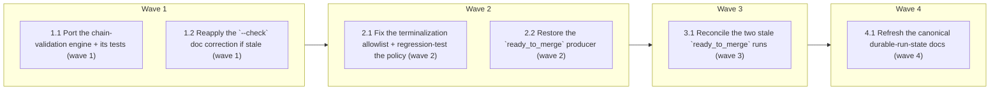

# Close out #129: validate run history and make terminalization reliable

<!-- AT-A-GLANCE:BEGIN (generated — do not edit; refreshed by render_plan.py --summarize) -->
## At a glance

**6 tasks · 4 waves · 17 files · 0/6 done**

| Wave | Task | Title | Files | Done (acceptance) |
|---|---|---|---|---|
| 1 | 1.1 | Port the chain-validation engine + its tests (wave 1) | runtime/run_state.py, runtime/test_run_state.py, runtime/test_chain_guards_are_load_bearing.py, tests/scripts/run-state-chain-validation.test.sh, scripts/run-tests.sh | `validate_chain` present and wired into `read_events`/`status`/`rebuild`/`rebuil… |
| 1 | 1.2 | Reapply the `--check` doc correction if stale (wave 1) | skills/subagent-driven-development/SKILL.md | the `--check` claim in the SKILL matches implemented behavior, or the file is un… |
| 2 | 2.1 | Fix the terminalization allowlist + regression-test the policy (wave 2) | .github/workflows/post-merge-maintenance.yml, tests/scripts/post-merge-runstate-staging.test.sh | the allowlist covers `simplify`; the multi-slug picker no longer skips a tracked… |
| 2 | 2.2 | Restore the `ready_to_merge` producer (wave 2) | skills/finishing-a-development-branch/SKILL.md, tests/scripts/finishing-branch-contract.test.sh | finishing-a-development-branch emits a concrete `ready_to_merge` transition. |
| 3 | 3.1 | Reconcile the two stale `ready_to_merge` runs (wave 3) | specs/new-session-plan-resume/RUN.json, specs/new-session-plan-resume/events.jsonl, specs/gate-verifiability-principle/RUN.json, specs/gate-verifiability-principle/events.jsonl | both runs are `shipped` with the confirmed merge SHA; both chains still pass val… |
| 4 | 4.1 | Refresh the canonical durable-run-state docs (wave 4) | specs/durable-run-state/research-brief.md, specs/durable-run-state/design.md, specs/durable-run-state/PLAN.md | canonical docs match the implementation; no stale pre-#177 defect language remai… |

### Progress
- [ ] 1.1 — Port the chain-validation engine + its tests (wave 1)
- [ ] 1.2 — Reapply the `--check` doc correction if stale (wave 1)
- [ ] 2.1 — Fix the terminalization allowlist + regression-test the policy (wave 2)
- [ ] 2.2 — Restore the `ready_to_merge` producer (wave 2)
- [ ] 3.1 — Reconcile the two stale `ready_to_merge` runs (wave 3)
- [ ] 4.1 — Refresh the canonical durable-run-state docs (wave 4)
<!-- AT-A-GLANCE:END -->

## 1. Motivation

Stabilize the durable run-state feature (shipped in PRs #164–#168, #165) so its contract is
trustworthy, then close epic #129. Three defects remain: (1) `read_events` accepts a JSON-valid but
semantically impossible history, so `status`/`list`/`rebuild`/resume can trust a fabricated
projection (#174); (2) the post-merge workflow's static base-branch filter (`[main, loop]`) silently
skips the `shipped` transition for PRs merged into the active integration branch `simplify` — two
runs are stuck at `ready_to_merge`; (3) the canonical docs still advertise the pre-#177 staging
defect. Full context: `research-brief.md`, `design.md`.

## 2. Non-goals

- Proposal 2 retry budgets, self-healing, recovery loops.
- New states, multi-run archival, SQLite, dashboards, external event adapters.
- `list --prompt` without a demonstrated consumer.
- Formal JSON Schema artifacts to satisfy wording in #129.
- Redesigning the whole bookkeeping workflow when a smaller terminalization fix suffices.

## Global Constraints

- All implementation happens in an isolated worktree/branch off `simplify` (branch-isolation-guard
  blocks edits on `simplify` itself).
- Part 1 ports the already-reviewed `feat/gh-174` chain-validation work — do **not** weaken any of
  the 8 invariants or remove the escape hatches (`rebuild --allow-invalid-chain`, close-over-invalid
  for `cancelled`/`superseded`). The validator must **grandfather** the two existing valid logs.
- Reconciliation appends exactly one `shipped` event per stale run **via the real CLI** with the
  confirmed **merge SHA** — never a hand-written event, never the run head commit.
- Changes to `post-merge-maintenance.yml` only take effect after merge to the default branch
  (`main`), because `pull_request_target` loads its definition from the default branch. The
  regression test and header comment must state this.
- `bash scripts/run-tests.sh` must pass locally and on the Ubuntu/macOS CI matrix before ship.

## 3. Success Criteria

| ID | Behavior (observable) | Check (re-runnable) | Expected |
|------|-------------------------|-----------------------|------------|
| SC-1 | An impossible event chain is rejected and every guard is proven load-bearing (rejection + no mutation) | `python3 -m pytest runtime/test_chain_guards_are_load_bearing.py -q` | exit 0 |
| SC-2 | Existing valid lifecycle, idempotency, concurrency, rebuild, and exit-code behavior stays green | `python3 -m pytest runtime/test_run_state.py -q` | exit 0 |
| SC-3 | A tracked log passes semantic validation and its projection matches RUN.json | `python3 runtime/run_state.py rebuild --check --slug gate-verifiability-principle` | exit 0 |
| SC-4 | CLI read surfaces reject a JSON-valid but impossible chain end-to-end without mutating artifacts | `bash tests/scripts/run-state-chain-validation.test.sh` | exit 0 |
| SC-5 | Terminalization trigger allowlist covers the active integration branch and the staging contract (shipped once + both artifacts staged) holds | `bash tests/scripts/post-merge-runstate-staging.test.sh` | exit 0 |
| SC-6 | The branch-filter-gap stale run is terminalized from confirmed evidence | `grep -q "\"state\": \"shipped\"" specs/gate-verifiability-principle/RUN.json` | exit 0 |
| SC-7 | The historical-gap stale run is terminalized from confirmed evidence | `grep -q "\"state\": \"shipped\"" specs/new-session-plan-resume/RUN.json` | exit 0 |
| SC-8 | Canonical durable-run-state docs state the current terminalization policy | `grep -q "integration-branch allowlist" specs/durable-run-state/research-brief.md` | exit 0 |

## 4. Tasks

### Task 1.1 — Port the chain-validation engine + its tests (wave 1)

- **Files:** runtime/run_state.py, runtime/test_run_state.py, runtime/test_chain_guards_are_load_bearing.py, tests/scripts/run-state-chain-validation.test.sh, scripts/run-tests.sh
- **Action:** Port the `validate_chain` engine + wiring from `feat/gh-174-run-state-chain-validation`
  (engine commits `24c9f77`, `28f5481`, `fee736d`, `751118f`, `083cf2a`; test/script commits
  `329dcc1`, `c4a65fd`). `runtime/run_state.py` base == current `simplify`, so engine hunks apply
  cleanly (prefer `git checkout feat/gh-174-run-state-chain-validation -- runtime/run_state.py
  runtime/test_chain_guards_are_load_bearing.py tests/scripts/run-state-chain-validation.test.sh`
  then verify no unrelated drift). Hand-reapply the two known conflicts: (a) `runtime/test_run_state.py`
  — `simplify` renamed 4 `test_*`→`legacy_*`; merge feat's ~+990 lines of adversarial tests onto the
  current file, keeping the renamed legacy tests; (b) `scripts/run-tests.sh` — re-add the single line
  registering `runtime/test_chain_guards_are_load_bearing.py` in PYTESTS. Keep all 8 invariants and
  both escape hatches exactly. Do not weaken validation.
- **Verify:** `python3 -m pytest runtime/test_run_state.py runtime/test_chain_guards_are_load_bearing.py -q`
- **Done:** `validate_chain` present and wired into `read_events`/`status`/`rebuild`/`rebuild --check`/resume; both new test files and the shell test green; `run-tests.sh` registers the mutation gate.
- **Criteria:** SC-1, SC-2, SC-3, SC-4
- **Interfaces:** Consumes the reviewed feat/gh-174 commits. Produces `runtime/run_state.py` (with `validate_chain`), `runtime/test_chain_guards_are_load_bearing.py`, updated `runtime/test_run_state.py`, `tests/scripts/run-state-chain-validation.test.sh`, updated `scripts/run-tests.sh`.

### Task 1.2 — Reapply the `--check` doc correction if stale (wave 1)

- **Files:** skills/subagent-driven-development/SKILL.md
- **Action:** `simplify` rewrote this SKILL. Check whether the current text still over-promises what
  `rebuild --check` proves. If it does, correct it to state exactly what `--check` verifies (chain
  validity + projection drift), mirroring feat/gh-174 commit `329dcc1`. If the current text is
  already accurate or the claim is absent, make no edit and record a no-op. Surgical — touch only
  the `--check` sentence(s).
- **Verify:** `python3 scripts/check_manifest.py`
- **Done:** the `--check` claim in the SKILL matches implemented behavior, or the file is unchanged because it was already accurate.
- **Criteria:** SC-2
- **Interfaces:** Consumes the corrected claim from feat/gh-174. Produces (possibly unchanged) `skills/subagent-driven-development/SKILL.md`.

### Task 2.1 — Fix the terminalization allowlist + regression-test the policy (wave 2)

- **Files:** .github/workflows/post-merge-maintenance.yml, tests/scripts/post-merge-runstate-staging.test.sh
- **Action:** Add the active integration branch to the `branches:` allowlist
  (`[main, loop, simplify]`) — the smallest change that fixes the demonstrated gap. Scoping to
  mainline branches (rather than removing the filter) is deliberate per `design.md`: an unbounded
  `pull_request_target` would run every merged branch tip's code with the write token and could
  terminalize a run on an intermediate feature-branch merge (wrong SHA). Also fix the multi-slug
  picker to iterate matched slugs and pick the first with a `RUN.json` (a `head -1` silently skips a
  tracked run behind an untracked one). Rewrite the header comment: the allowlist is the one
  authoritative place for the policy, must be synced to the default branch (`main`) for
  `pull_request_target`, and rots silently. Extend the regression test with policy assertions: the
  allowlist includes the active integration branch (`simplify`) and `main`, and the main-sync caveat
  is documented — required members, not an exact list. Add `finish` so the suite can actually fail.
  Preserve the staging-contract assertions.
- **Verify:** `bash tests/scripts/post-merge-runstate-staging.test.sh`
- **Done:** the allowlist covers `simplify`; the multi-slug picker no longer skips a tracked run; missing/non-run PRs stay non-fatal; the test asserts the allowlist policy + staging contract and fails on regressions.
- **Criteria:** SC-5
- **Interfaces:** Consumes the current workflow + research findings. Produces updated `.github/workflows/post-merge-maintenance.yml` and `tests/scripts/post-merge-runstate-staging.test.sh`.

### Task 2.2 — Restore the `ready_to_merge` producer (wave 2)

- **Files:** skills/finishing-a-development-branch/SKILL.md, tests/scripts/finishing-branch-contract.test.sh
- **Action:** The slim-surface refactor (`8e04bc5`) left the `ready_to_merge` transition as prose
  only, so no skill reliably produces it and a run stalls at `planning` (`planning → shipped` is
  illegal). Restore it as a concrete non-fatal command
  (`python3 runtime/run_state.py transition --slug <slug> --to ready_to_merge --event pr.opened || true`)
  in the Push-and-PR step, so terminalization is end-to-end.
- **Verify:** `grep -q -- "--to ready_to_merge --event pr.opened" skills/finishing-a-development-branch/SKILL.md`
- **Done:** finishing-a-development-branch emits a concrete `ready_to_merge` transition.
- **Criteria:** SC-5
- **Interfaces:** Consumes the FSM contract. Produces updated `skills/finishing-a-development-branch/SKILL.md`.

### Task 3.1 — Reconcile the two stale `ready_to_merge` runs (wave 3)

- **Files:** specs/new-session-plan-resume/RUN.json, specs/new-session-plan-resume/events.jsonl, specs/gate-verifiability-principle/RUN.json, specs/gate-verifiability-principle/events.jsonl
- **Action:** After Task 1.1 lands (validator active), append exactly one `shipped` event to each
  stale run via the real CLI: `python3 runtime/run_state.py transition --slug <slug> --to shipped
  --event manual.reconcile-gh196 --sha <merge SHA>`. Confirmed merge SHAs: `new-session-plan-resume`
  → `206605218508d5b3ee1d1769e785c4057dc6345a` (PR #173); `gate-verifiability-principle` →
  `c9b3b7ef3f36f846a5df3e0194b819b85656ebd4` (PR #189). Do not hand-edit either artifact. Record the
  one-time repair in SUMMARY `### Not auto-verified` (provenance: GitHub merge evidence).
- **Verify:** `python3 runtime/run_state.py rebuild --check --slug gate-verifiability-principle`
- **Done:** both runs are `shipped` with the confirmed merge SHA; both chains still pass validation; `rebuild --check` exit 0 for each.
- **Criteria:** SC-6, SC-7
- **Interfaces:** Consumes the confirmed merge SHAs + the active validator. Produces `specs/new-session-plan-resume/RUN.json`, `specs/new-session-plan-resume/events.jsonl`, `specs/gate-verifiability-principle/RUN.json`, `specs/gate-verifiability-principle/events.jsonl`.

### Task 4.1 — Refresh the canonical durable-run-state docs (wave 4)

- **Files:** specs/durable-run-state/research-brief.md, specs/durable-run-state/design.md, specs/durable-run-state/PLAN.md
- **Action:** Remove any description of the pre-#177 staging defect (it is fixed) and state the
  current terminalization policy accurately: `shipped` is written by `post-merge-maintenance.yml`
  for a merged PR carrying a tracked run whose base is in the integration-branch allowlist,
  effective once synced to `main`; semantic chain validation now guards every read surface; the
  `ready_to_merge` producer was restored. Include the phrase `integration-branch allowlist` in the
  research-brief so the policy is greppable. Keep edits factual and surgical.
- **Verify:** `grep -q "integration-branch allowlist" specs/durable-run-state/research-brief.md`
- **Done:** canonical docs match the implementation; no stale pre-#177 defect language remains.
- **Criteria:** SC-8
- **Interfaces:** Consumes the landed implementation. Produces updated `specs/durable-run-state/research-brief.md`, `specs/durable-run-state/design.md`, `specs/durable-run-state/PLAN.md`.

## 5. Risks

- **`pull_request_target` default-branch semantics** — the fix is inert until merged to `main`.
  Mitigated by the header comment + policy regression test that make the constraint explicit.
- **Rebase drift in Part 1** — porting from an older branch could pull unrelated hunks. Mitigated by
  scoping the checkout to the four runtime/test/script files and diffing against `simplify` before commit.
- **Broadened trigger noise** — more workflow runs that immediately no-op. Acceptable; guarded by
  the existing `merged`/`bookkeeping-*`/tracked-run checks and the `changed=false` early exit.
- **Reconciliation invalidating a chain** — appending via the CLI (not by hand) keeps `seq`,
  `from_state`, and identity contiguous; invariant 8 is satisfied by the merge SHA.

## 6. Status Log

- 2026-08-08 — Plan authored (high-risk lane). Research + design complete; feat/gh-174 mapped as the
  Part-1 source; stale-run merge SHAs confirmed via `gh pr view`. Ready to execute.
