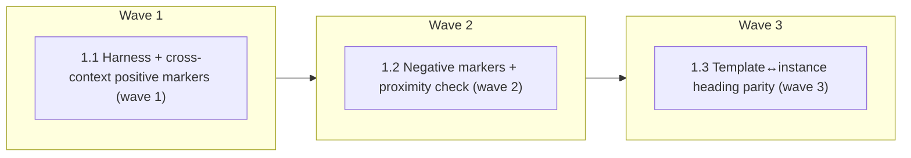

# Verbatim safeguard-parity test (Brichan port, item 1 of issue #213)

<!-- AT-A-GLANCE:BEGIN (generated — do not edit; refreshed by render_plan.py --summarize) -->
## At a glance

**3 tasks · 3 waves · 1 files · 0/3 done**

| Wave | Task | Title | Files | Done (acceptance) |
|---|---|---|---|---|
| 1 | 1.1 | Harness + cross-context positive markers (wave 1) | tests/scripts/safeguard-parity.test.sh | Suite exits 0 with 6 marker cases + 1 mutation case, 0 FAIL lines; each marker r… |
| 2 | 1.2 | Negative markers + proximity check (wave 2) | tests/scripts/safeguard-parity.test.sh | Suite exits 0 with 3 negative-marker cases, 1 proximity case, and 2 new mutation… |
| 3 | 1.3 | Template↔instance heading parity (wave 3) | tests/scripts/safeguard-parity.test.sh | Suite exits 0; 5 pairs checked, 1 exempted with a visible reason, parser guard f… |

### Progress
- [ ] 1.1 — Harness + cross-context positive markers (wave 1)
- [ ] 1.2 — Negative markers + proximity check (wave 2)
- [ ] 1.3 — Template↔instance heading parity (wave 3)
<!-- AT-A-GLANCE:END -->

## 1. Motivation

Load-bearing safeguard sentences are duplicated across isolated contexts (rules, agent
definitions, skill prompts) and nothing asserts they stay in sync — that is currently
`context-propagation-audit`'s manual job. Brichan's `test_skill_parity_contract.py` shows the
durable shape: verbatim markers compared whitespace-normalized, negative assertions banning
rejected phrasings, and proximity checks pairing a dangerous action with its precondition.
Port design: `specs/brichan-mechanism-port/research-brief.md` → Item 1.

Ground-truth deltas from the brief, resolved here (2026-08-20 probes):

- `run-tests.sh` auto-globs `tests/scripts/*.test.sh` (line 97) — no registration edit needed;
  the diff is one new test file.
- The literal `spec_verdict` / `quality_verdict` pair exists in only 2 files
  (`skills/subagent-driven-development/{SKILL.md,task-reviewer-prompt.md}`); the other three
  claimed sites carry prose variants (`quality verdicts`, `two verdicts`) — covered by
  separate marker rows, not one verbatim marker.
- `sub-agent` occurs legitimately in `agents/PROJECT.md`, `agents/PROJECT.template.md`,
  `agents/coding.md`, `skills/README.md`; terminology §1 is advisory ("Do not build a linter
  on it") — style terms are disqualified as negative markers.
- `docs-solutions-INDEX.md` ↔ `docs/solutions/INDEX.md` heading parity fails today (the
  instance is regenerated by `compound` with its own heading shape) — exempted with a visible
  reason, not silently skipped.

## 2. Non-goals

- No edits to `skills/`, `agents/`, `rules/`, `hooks/`, `scripts/`, `settings.json`,
  `templates/` — this is a test-only diff; fixing any drift the new test finds is separate work.
- No byte-parity check of `rules/` ↔ `.claude/rules/` (deploy rewrites paths by design).
- No new config file — the marker table lives in the test itself.
- No mechanization of advisory terminology (§1/§2); markers guard invariants, not style.
- Items 2 and 3 of issue #213 (separate intakes).

## Global Constraints

- The only implementation file is `tests/scripts/safeguard-parity.test.sh`; idiom is
  `tests/lib.sh` (`t` / `pass` / `fail` / `skip` / `finish`), executable via
  `bash tests/scripts/safeguard-parity.test.sh` from the repo root.
- Every checker is a function taking a root-dir argument (the
  `scorer-threshold-contract.test.sh` pattern) so mutation self-checks can run the same
  checker against a mutated `mktemp` copy; register tmp dirs in `_CLEANUP_DIRS`.
- Comparison is whitespace-normalized (collapse all runs of whitespace to single spaces)
  so reflow and reformatting cannot false-fail.
- Every marker row carries a one-line "why" comment naming the invariant or the claim it
  enforces; markers grow only when `compound` records a new drift.
- A check that cannot run (missing file, unparseable `rows` table) prints `fail` with a
  message — never a silent pass (skip and pass stay textually distinguishable).
- Whole suite finishes in under 60 seconds; no network, no writes outside `mktemp` dirs.
- The literal string `mutation check:` appears only inside the four `t` case descriptions —
  never in comments or helper names — so the SC-2 count stays exact.

## 3. Success Criteria

| ID | Behavior (observable) | Check (re-runnable) | Expected |
|------|-------------------------|-----------------------|------------|
| SC-1 | Every safeguard marker, negative assertion, proximity window, and template-heading contract holds on the current tree, and every mutation self-check detects its seeded drift | `bash tests/scripts/safeguard-parity.test.sh` | exit 0 — 0 FAIL lines |
| SC-2 | Each check family carries a mutation self-check that fails the suite when its detection logic goes stale | `grep -c "mutation check:" tests/scripts/safeguard-parity.test.sh` | exit 0 — prints 4 (cross-context, negative, proximity, heading-parity) |
| SC-3 | The suite sits on the path `scripts/run-tests.sh` already globs (L3, `tests/scripts/*.test.sh`), so it runs in CI with no registration edit | `ls tests/scripts/safeguard-parity.test.sh` | exit 0 |
| SC-4 | The INDEX heading-parity exemption is visible in the output, not silent | `bash -c "out=\$(mktemp); bash tests/scripts/safeguard-parity.test.sh > \$out 2>&1; grep -q docs-solutions-INDEX \$out"` | exit 0 — a `skip` line names the exempted pair and its reason |

## 4. Tasks

### Task 1.1 — Harness + cross-context positive markers (wave 1)

- **Files:** tests/scripts/safeguard-parity.test.sh
- **Action:** Create the suite: source `tests/lib.sh`; add `norm_file <root> <relpath>` (read +
  whitespace-normalize) and `assert_marker <root> <marker> <file...>` helpers. Encode the
  initial cross-context marker table, one `t` case per row, each with a why-comment:
  1. `not_observed != absent` → `rules/behavior.md`, `agents/reviewer.md`,
     `skills/correctness-review/correctness-scorer-prompt.md` (CLAUDE.md claims all three
     score against this rule).
  2. `spec_verdict` → `skills/subagent-driven-development/task-reviewer-prompt.md`,
     `skills/subagent-driven-development/SKILL.md` (the two-verdict schema field).
  3. `quality_verdict` → the same two files.
  4. `unmodified-line` → `skills/correctness-review/correctness-scorer-prompt.md`,
     `skills/correctness-review/prompts/shared.md` (scorer auto-0 flag shared by both prompts).
  5. `quality verdicts` → `agents/task-reviewer.md`, `skills/README.md` (prose form of the pair).
  6. `two verdicts` → `rules/auto-correct-scope.md`, `skills/README.md` (prose form of the pair).
  Add one `t "mutation check: seeded cross-context drift is detected"` case: copy the marker-1
  files into `mktemp`, strip `not_observed != absent` from one copy, assert `assert_marker`
  reports the miss (checker output non-empty / nonzero), suite passes when detection fires.
- **Verify:** `bash tests/scripts/safeguard-parity.test.sh`
- **Done:** Suite exits 0 with 6 marker cases + 1 mutation case, 0 FAIL lines; each marker row
  has a why-comment on the preceding line.
- **Criteria:** SC-1, SC-2, SC-3
- **Interfaces:** Consumes: the tests/lib.sh helpers and live prose under rules/, agents/, skills/. Produces: `tests/scripts/safeguard-parity.test.sh` with reusable norm_file / assert_marker checker functions.

### Task 1.2 — Negative markers + proximity check (wave 2)

- **Files:** tests/scripts/safeguard-parity.test.sh
- **Action:** Add `assert_absent <root> <phrase> <dir...>` scanning `*.md` under `skills/`,
  `agents/`, `rules/` (whitespace-normalized), and ban phrasings that contradict the
  reviewer's structural read-only guarantee: `reviewer may write`, `reviewer can write`,
  `grant the reviewer write` (why-comment: `agents/reviewer.md` — independence is enforced by
  the runtime binding; prose granting write ability must never return). Do not add style
  terms (`sub-agent` is in live legitimate use; terminology §1 is advisory). Add
  `assert_proximity <root> <file> <anchor> <required> <window>`: in
  `rules/auto-correct-scope.md`, `BRANCH_ISOLATION_REASON` must sit within 900 normalized
  characters of `break-glass-log.md` (a break-glass knob must sit next to its audit-record
  statement). Add two mutation cases: `t "mutation check: injected banned phrase is detected"`
  (append `reviewer may write` to a tmp copy → `assert_absent` reports it) and
  `t "mutation check: separated proximity pair is detected"` (delete the
  `break-glass-log.md` sentence from a tmp copy → `assert_proximity` reports it).
- **Verify:** `bash tests/scripts/safeguard-parity.test.sh`
- **Done:** Suite exits 0 with 3 negative-marker cases, 1 proximity case, and 2 new mutation
  cases (3 mutation cases total so far), 0 FAIL lines.
- **Criteria:** SC-1, SC-2
- **Interfaces:** Consumes: `tests/scripts/safeguard-parity.test.sh` (Task 1.1 checker functions) and live prose under skills/, agents/, rules/. Produces: `tests/scripts/safeguard-parity.test.sh` extended with assert_absent / assert_proximity.

### Task 1.3 — Template↔instance heading parity (wave 3)

- **Files:** tests/scripts/safeguard-parity.test.sh
- **Action:** Parse the `rows='...'` block from `scripts/init-structure.sh` at run time (single
  source of the mapping — do not duplicate the table). For each `template|instance` pair,
  every `^#` heading line of `templates/structure/<template>` must appear as a fixed string in
  the instance file. Exempt exactly `docs-solutions-INDEX.md` via a `skip` line whose message
  names the reason (instance regenerated by `compound` with its own heading shape) — SC-4
  makes the exemption visible. Guard the parser: zero parsed rows is a `fail` ("rows table
  moved or was renamed in init-structure.sh"), never a pass. Add
  `t "mutation check: instance missing a template heading is detected"`: copy one pair into
  `mktemp`, delete a heading from the instance copy, assert the parity checker reports it.
- **Verify:** `bash tests/scripts/safeguard-parity.test.sh`
- **Done:** Suite exits 0; 5 pairs checked, 1 exempted with a visible reason, parser guard
  fails on zero rows, 4 mutation cases total; `grep -c "mutation check:"` prints 4.
- **Criteria:** SC-1, SC-2, SC-4
- **Interfaces:** Consumes: the rows table in scripts/init-structure.sh and the templates under templates/structure/. Produces: the finished `tests/scripts/safeguard-parity.test.sh`.

## 5. Risks

- **Marker churn** — markers containing numbers or flag names rot fast. Mitigated by the
  curation rule (invariant-bearing sentences only, one-line why, grow only via `compound`).
- **INDEX exemption masks real template drift** — mitigated by SC-4: the exemption is a
  visible `skip` line, and the template stays checked for the other five pairs.
- **Prose-variant markers are weaker than Brichan's whole-tree verbatim concat** — accepted:
  our duplication sites intentionally paraphrase; per-file marker rows are the honest contract.
- **`init-structure.sh` refactor breaks the rows parser** — mitigated by the zero-rows `fail`
  guard (a moved table fails loudly instead of green-by-skip).

## 6. Status Log

- 2026-08-20 — Plan authored (lane: normal, confidence: high; research:
  `specs/brichan-mechanism-port/research-brief.md`). Status: proposed.

- 2026-08-20 — task 1.1 complete; commits 105c4e5, 455561b (spec pass, quality approved after 1 fix round)
- 2026-08-20 — task 1.2 complete; commit 9c72095 (spec pass, quality approved; 4 Minors rolled up, 3 folded into task 1.3 as Rule-1 fixes)
- 2026-08-20 — task 1.3 complete; commits 6b94443, fdebf75 (spec pass, quality approved; row-count floor guard added post-review). All tasks 1.1, 1.2, 1.3 complete.
- 2026-08-20 — final review chain complete at 2c726ba: correctness (3 blocking fixed + re-review FIXED, 11+3 advisories recorded), intent (5 findings recorded, 1 deferred gap), receipt written and validated; verify_summary --check all PASS.
- 2026-08-21 — shipped: branch feat/gh-213-safeguard-parity-test at 2c726ba, full suite ALL GREEN, receipt gate pass; PR opened against main.
