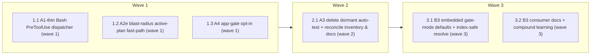

# hook-surface-slim — Package A + B implementation

<!-- AT-A-GLANCE:BEGIN (generated — do not edit; refreshed by render_plan.py --summarize) -->
## At a glance

**6 tasks · 3 waves · 17 files · 0/6 done**

| Wave | Task | Title | Files | Done (acceptance) |
|---|---|---|---|---|
| 1 | 1.1 | A1-thin Bash PreToolUse dispatcher (wave 1) | hooks/pre-bash-dispatch.sh, tests/hooks/pre-bash-dispatch.test.sh, settings.json | dispatcher test passes; `settings.json` PreToolUse Bash has exactly one hook. |
| 1 | 1.2 | A2e blast-radius active-plan fast-path (wave 1) | hooks/lib/lane.sh, tests/hooks/blast-radius-check.test.sh | blast test passes; the 0-active path no longer iterates every `PLAN.md`. |
| 1 | 1.3 | A4 app-gate opt-in (wave 1) | hooks/commit-quality-gate.sh, tests/hooks/commit-quality-gate.test.sh | commit-quality test passes; app checks skipped by default, enforced under opt-in… |
| 2 | 2.1 | A3 delete dormant auto-test + reconcile inventory & docs (wave 2) | hooks/auto-test-on-change.sh, tests/hooks/auto-test-on-change.test.sh, harness-manifest.json, CLAUDE.md | auto-test hook + test gone; manifest, settings, and CLAUDE.md consistent; both c… |
| 3 | 3.1 | B3 embedded gate-mode defaults + index-safe resolve (wave 3) | hooks/lib/gate-modes.default.sh, hooks/risk-corroboration.sh, scripts/check_gate_modes_smoke.py, tests/hooks/warn-mode-smoke.test.sh, tests/hooks/risk-corroboration.test.sh | both tests pass including the bypass guard; `check_gate_modes_smoke.py` passes; … |
| 3 | 3.2 | B3 consumer docs + compound learning (wave 3) | CLAUDE.md, docs/solutions/harness/consumer-risk-modes-index-safe.md | doc-truth passes; consumer note + solution entry present. |

### Progress
- [ ] 1.1 — A1-thin Bash PreToolUse dispatcher (wave 1)
- [ ] 1.2 — A2e blast-radius active-plan fast-path (wave 1)
- [ ] 1.3 — A4 app-gate opt-in (wave 1)
- [ ] 2.1 — A3 delete dormant auto-test + reconcile inventory & docs (wave 2)
- [ ] 3.1 — B3 embedded gate-mode defaults + index-safe resolve (wave 3)
- [ ] 3.2 — B3 consumer docs + compound learning (wave 3)
<!-- AT-A-GLANCE:END -->

## 1. Motivation

Cut always-on hook wall-clock in this meta-repo and stop consumer repos from failing closed on the
risk gate — without loosening any security block. Grounded in `research-brief.md` (§0 re-bench) and
the **corrected** `design-ab.md` (approved defaults: **A1-thin, A2e, A3-delete, A4-opt-in,
B3-only**; sequence A→B).

Two design contracts are **invariants** (see `design-ab.md` §2.2 and §3.3):

1. **Dispatcher relays stdout unconditionally.** `check-untracked-py` denies via stdout-JSON **and
   exits 0**; a "stop on first exit 2" dispatcher would silently drop that deny. The dispatcher must
   relay every sub-hook's stdout regardless of exit code; exit 2 is an independent early-stop.
2. **Risk modes come only from the git index or embedded defaults — never from `.claude/`.** Reading
   an on-disk `.claude/harness-manifest.json` reintroduces the critical policy-TOCTOU that
   `docs/solutions/harness/gate-config-must-read-index.md` closed (`.claude` is gitignored in
   consumers → agent-writable → un-index-checkable).

## 2. Non-goals

- A1-lib (fold the 4 hooks into one process on the commit path) — deferred; A1-thin keeps 4
  sub-spawns on the rare commit/push path, 1 spawn on every non-commit Bash.
- Deleting/loosening `branch-guard`, `branch-isolation-guard`, `scope-gate`, `session-knowledge`,
  `render-plan-on-write`, `ruff-on-edit`.
- Loosening the 7 block-mode risk categories, or Check 1/1.5/1.6 of commit-quality.
- **A4-detect** (run app gates when an `app/` dir exists) — rejected for the directory-name
  false-positive; use `REQUIRE_APP_GATES=1` opt-in instead.
- **B-hybrid / any read of `.claude/harness-manifest.json`** for modes — rejected (TOCTOU #160).
- Consumer `harness-manifest.json` at repo root (B1), lite-profile fork, and lane-scaled review
  ceremony (Package C/E) — separate specs.

## Global Constraints

- Implement in an isolated worktree/branch (`using-git-worktrees`); never edit hooks/settings on a
  shared branch. This is a **high-risk** lane (every task touches `hooks/*` and/or `settings.json`
  = high-blast, Rule 4) — record a `### Rollback` per shipped wave in `SUMMARY.md`.
- The two contracts above are invariants. A change that drops a deny, or reads mode policy from a
  worktree/`.claude/` file, is a failed task regardless of green tests — SC-1 and SC-8 assert them.
- Preserve every existing block/warn decision. The only behavior changes are: 1 spawn on non-commit
  Bash, faster blast miss-path, app-gates opt-in, and consumer risk modes falling back to embedded
  parity (2 warn / 7 block) instead of block-all.
- Keep `harness-manifest.json` ↔ `settings.json` ↔ CLAUDE.md hook table mutually consistent
  (`check_manifest.py` + `lint-doc-truth.sh` green) in the same wave that changes registration.
- The four Bash hook scripts stay directly executable (dispatcher pipes stdin to them unchanged) so
  their per-hook contract tests keep running.
- Test-first where a test harness exists. Per-task `Verify` runs a single test file or a single
  script — never the whole suite (`run-tests.sh` is the pre-PR gate, not a task Verify).

## 3. Success Criteria

| ID | Behavior (observable) | Check (re-runnable) | Expected |
|------|-------------------------|-----------------------|------------|
| SC-1 | Untracked `.py` at commit is still denied through the dispatcher — its stdout-JSON deny is relayed despite the sub-hook exiting 0 | `bash tests/hooks/pre-bash-dispatch.test.sh` | exit 0 |
| SC-2 | `settings.json` registers exactly one PreToolUse Bash hook (the dispatcher) | `python3 -c "import json,sys; s=json.load(open('settings.json')); n=sum(1 for e in s['hooks']['PreToolUse'] if e.get('matcher')=='Bash' for _ in e['hooks']); sys.exit(0 if n==1 else 1)"` | exit 0 |
| SC-3 | Commit-path chain (secrets, escalations, lane evidence) still blocks via the dispatcher | `bash tests/hooks/gate-integration.test.sh` | exit 0 |
| SC-4 | Blast-radius is silent and correct with 0 active plans via the fast-path | `bash tests/hooks/blast-radius-check.test.sh` | exit 0 |
| SC-5 | Dormant `auto-test-on-change.sh` is removed from disk | `test ! -e hooks/auto-test-on-change.sh` | exit 0 |
| SC-6 | commit-quality Checks 2/2.5/3 are skipped unless `REQUIRE_APP_GATES=1` | `bash tests/hooks/commit-quality-gate.test.sh` | exit 0 |
| SC-7 | With no manifest anywhere, embedded defaults yield 2 warn / 7 block (workflow-engine passes with note; auth blocks) | `bash tests/hooks/warn-mode-smoke.test.sh` | exit 0 |
| SC-8 | A worktree `.claude/harness-manifest.json` set all-warn does NOT loosen the auth gate (index/embedded only) | `bash tests/hooks/risk-corroboration.test.sh` | exit 0 |
| SC-9 | `hooks/lib/gate-modes.default.sh` mode-set matches `harness-manifest.json` detectable (drift fails) | `python3 scripts/check_gate_modes_smoke.py` | exit 0 |
| SC-10 | `harness-manifest.json` ↔ `settings.json` ↔ CLAUDE.md hook table stay consistent | `python3 scripts/check_manifest.py` | exit 0 |

## 4. Tasks

### Task 1.1 — A1-thin Bash PreToolUse dispatcher (wave 1)

- **Files:** hooks/pre-bash-dispatch.sh, tests/hooks/pre-bash-dispatch.test.sh, settings.json
- **Action:** Test-first. Create `hooks/pre-bash-dispatch.sh`: read stdin once into `INPUT`, extract
  the command with one `jq`, `source lib/git-command.sh`, and **fast-path `exit 0`** when
  `hook_cmd_is_git_commit_or_push` is false (the common non-commit case — 1 process, no sub-hooks).
  On commit/push, invoke the four sub-hooks **in the current settings order** —
  `check-untracked-py.sh`, `commit-quality-gate.sh`, `risk-corroboration.sh`, `branch-guard.sh` — by
  piping `INPUT` to each `hooks/X.sh`. **Contract (invariant #1): relay each sub-hook's stdout
  unconditionally (any exit code)** so untracked-py's stdout-JSON deny (which exits 0) always reaches
  Claude; treat a sub-hook `exit 2` as an independent early-stop (relay its stdout, then propagate
  exit 2). Fail-closed `exit 2` with a redeploy message if a sub-hook script is missing. Then replace
  the four separate PreToolUse Bash registrations in `settings.json` with the single dispatcher.
  Write `pre-bash-dispatch.test.sh` asserting: (a) `ls` → exit 0, no sub-hook output; (b) commit with
  an untracked `.py` → stdout `permissionDecision:"deny"` even though the sub-hook exits 0; (c) commit
  with a staged secret → deny via exit 2; (d) `git push` → only untracked-py acts.
- **Verify:** `bash tests/hooks/pre-bash-dispatch.test.sh`
- **Done:** dispatcher test passes; `settings.json` PreToolUse Bash has exactly one hook.
- **Criteria:** SC-1, SC-2, SC-3
- **Interfaces:** Consumes the existing git-command matcher lib and the four current Bash hook scripts unchanged. Produces `hooks/pre-bash-dispatch.sh` and a single-dispatcher `settings.json` Bash registration.

### Task 1.2 — A2e blast-radius active-plan fast-path (wave 1)

- **Files:** hooks/lib/lane.sh, tests/hooks/blast-radius-check.test.sh
- **Action:** In `hook_lib_find_active_plan`, replace the full `for p in $(ls -t specs/*/PLAN.md)`
  scan-until-exhausted with a short-circuit that does not read every plan when 0 are active — e.g.
  `grep -lE '^status:[[:space:]]*active' "$repo_dir"/specs/*/PLAN.md` returning the first match, or
  `find … -maxdepth 2` stopping at the first hit. **Preserve the return contract exactly:** no active
  plan → return 1 (blast then exits 0 silently); ≥1 active → echo the first found (document
  "first-found" for the rare multi-active case). This lib is shared by `blast-radius-check.sh`,
  `risk-corroboration.sh`, and `scope-gate.sh` — the contract must not change for any of them. Keep
  bash 3.2 portability. Extend `blast-radius-check.test.sh`: 0-active → silent exit 0; one
  `status: active` plan → its `<files>` set is enforced.
- **Verify:** `bash tests/hooks/blast-radius-check.test.sh`
- **Done:** blast test passes; the 0-active path no longer iterates every `PLAN.md`.
- **Criteria:** SC-4
- **Interfaces:** Consumes the status lines of spec plan files. Produces a faster `hooks/lib/lane.sh` active-plan lookup with an unchanged return contract.

### Task 1.3 — A4 app-gate opt-in (wave 1)

- **Files:** hooks/commit-quality-gate.sh, tests/hooks/commit-quality-gate.test.sh
- **Action:** Gate commit-quality **Check 2** (breakpoint/print scan of `app/**/*.py`), **Check 2.5**
  (`REQUIRE_VERIFY`), and **Check 3** (targeted pytest for staged `app/**/*.py`) behind a single
  opt-in `REQUIRE_APP_GATES=1`. When it is unset (harness default), skip all three. **Do not touch
  Check 1 (secrets), Check 1.5 (escalations), Check 1.6 (lane evidence).** Test-first: with
  `REQUIRE_APP_GATES` unset, a staged `app/x.py` containing `breakpoint()` does **not** block; with
  `REQUIRE_APP_GATES=1` it blocks.
- **Verify:** `bash tests/hooks/commit-quality-gate.test.sh`
- **Done:** commit-quality test passes; app checks skipped by default, enforced under opt-in.
- **Criteria:** SC-6
- **Interfaces:** Consumes the REQUIRE_APP_GATES env var. Produces opt-in Checks 2/2.5/3 in `hooks/commit-quality-gate.sh` (Checks 1/1.5/1.6 unchanged).

### Task 2.1 — A3 delete dormant auto-test + reconcile inventory & docs (wave 2)

- **Files:** hooks/auto-test-on-change.sh, tests/hooks/auto-test-on-change.test.sh, harness-manifest.json, CLAUDE.md
- **Action:** Delete `hooks/auto-test-on-change.sh` and its test. In `harness-manifest.json` `hooks[]`:
  remove the `auto-test-on-change` row, add `pre-bash-dispatch.sh` (`wired: true`), and set the four
  Bash hooks (`check-untracked-py`, `commit-quality-gate`, `risk-corroboration`, `branch-guard`) to
  `wired: false` — they are no longer in `settings.json` directly (the dispatcher invokes them), but
  their files remain on disk so the inventory scan still passes. In the CLAUDE.md hook table: replace
  the four Bash PreToolUse rows with the dispatcher row (noting the four are invoked via it) and
  remove the `auto-test-on-change` dormant row. Depends on Task 1.1 (settings.json must already
  register the dispatcher, else `check_manifest.py`'s wired-vs-settings check fails).
- **Verify:** `python3 scripts/check_manifest.py && bash scripts/lint-doc-truth.sh`
- **Done:** auto-test hook + test gone; manifest, settings, and CLAUDE.md consistent; both checks pass.
- **Criteria:** SC-5, SC-10
- **Interfaces:** Consumes the wave-1 dispatcher registration. Produces a reconciled `harness-manifest.json` inventory and an updated `CLAUDE.md` hook table.

### Task 3.1 — B3 embedded gate-mode defaults + index-safe resolve (wave 3)

- **Files:** hooks/lib/gate-modes.default.sh, hooks/risk-corroboration.sh, scripts/check_gate_modes_smoke.py, tests/hooks/warn-mode-smoke.test.sh, tests/hooks/risk-corroboration.test.sh
- **Action:** Test-first. Create `hooks/lib/gate-modes.default.sh` — a bash-sourceable map of the nine
  `hard_gates.detectable` slugs to their modes (7 block + 2 warn: `workflow-engine`,
  `weakening-validation`), generated from `harness-manifest.json`. In `risk-corroboration.sh`, change
  `GATE_MODES` resolution to **exactly two index-safe sources**: (a) `git show :harness-manifest.json`
  when it resolves (meta-repo, or a consumer that deliberately tracks the manifest) → wins; (b) else
  `source hooks/lib/gate-modes.default.sh` (embedded). **Contract (invariant #2): never read a
  worktree or `.claude/` policy file.** Extend `scripts/check_gate_modes_smoke.py` to assert the
  default map == manifest detectable modes (drift → exit 1). Tests: `warn-mode-smoke` — no manifest
  anywhere → embedded defaults give `workflow-engine` = warn (commit passes with a note),
  `auth` = block (exit 2), `high-blast` = block (exit 2). `risk-corroboration` — **bypass guard**:
  write `.claude/harness-manifest.json` with every category = warn, then an auth-keyword commit at a
  below-high-risk lane still exits 2 (the hook ignores `.claude`).
- **Verify:** `bash tests/hooks/warn-mode-smoke.test.sh && bash tests/hooks/risk-corroboration.test.sh`
- **Done:** both tests pass including the bypass guard; `check_gate_modes_smoke.py` passes; meta-repo
  path unchanged (index manifest still wins).
- **Criteria:** SC-7, SC-8, SC-9
- **Interfaces:** Consumes the manifest detectable modes and the git index. Produces `hooks/lib/gate-modes.default.sh` and an index/embedded-only resolve in `hooks/risk-corroboration.sh` with no `.claude` read.

### Task 3.2 — B3 consumer docs + compound learning (wave 3)

- **Files:** CLAUDE.md, docs/solutions/harness/consumer-risk-modes-index-safe.md
- **Action:** Update the CLAUDE.md gotchas/consumer note: a consumer's `risk-corroboration.sh` now
  falls back to **embedded defaults (2 warn / 7 block parity)** instead of block-all, and the
  `RISK_WARN_CATEGORIES` / `settings.local` break-glass is documented. Add a `docs/solutions/harness/`
  entry recording the B3 decision — why policy is read only from the index or embedded defaults and
  never from `.claude/` (link `gate-config-must-read-index.md`). Runs in the same wave as 3.1 but
  touches disjoint files.
- **Verify:** `bash scripts/lint-doc-truth.sh`
- **Done:** doc-truth passes; consumer note + solution entry present.
- **Criteria:** SC-10
- **Interfaces:** Consumes the Task 3.1 runtime behavior. Produces `docs/solutions/harness/consumer-risk-modes-index-safe.md` and an updated `CLAUDE.md` consumer note.

## 5. Risks

- **Dispatcher drops a deny.** The exact hazard invariant #1 addresses. Mitigation: unconditional
  stdout relay + SC-1 (untracked-py deny survives exit 0) and SC-3 (commit chain).
- **B3 defaults drift from the manifest.** Mitigation: `check_gate_modes_smoke.py` pins the default
  map to `hard_gates.detectable` (SC-9); CI fails on drift.
- **A `.claude` read creeps back in.** Mitigation: SC-8 bypass-guard asserts an all-warn `.claude`
  manifest cannot loosen auth; invariant #2 is in Global Constraints.
- **Manifest/settings/CLAUDE.md skew** after A1-thin re-registration. Mitigation: Task 2.1 reconciles
  all three in one wave; `check_manifest.py` + `lint-doc-truth.sh` gate it (SC-10).
- **Consumer settings merge leaves stale 4-hook commands.** `derive_settings` dedups harness hooks by
  command path and `prune_orphans` covers `hooks/`; verify no stale Bash registrations survive a
  re-deploy (manual check at finish, not a task Verify).
- **Commit path still spawns 4 sub-hooks** (A1-thin accepted trade-off). A1-lib is the only path to
  1-process commits; out of scope (Non-goals).

## 6. Status Log

- 2026-08-06 — Plan drafted from the corrected `design-ab.md` (B3-only + A4-opt-in + relay-stdout contract). Replaced an earlier active PLAN.md that used the rejected B-hybrid/`.claude` + A4-detect design. Status: proposed.
