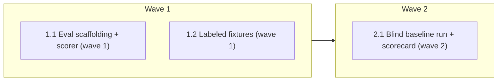

# feature-intake Classifier Eval

<!-- AT-A-GLANCE:BEGIN (generated — do not edit; refreshed by render_plan.py --summarize) -->
## At a glance

**3 tasks · 2 waves · 6 files · 0/3 done**

| Wave | Task | Title | Files | Done (acceptance) |
|---|---|---|---|---|
| 1 | 1.1 | Eval scaffolding + scorer (wave 1) | benchmarks/intake-classifier/README.md, scripts/score_intake_eval.py, scripts/test_score_intake_eval.py, benchmarks/intake-classifier/results/template.md | Scorer unit tests pass. |
| 1 | 1.2 | Labeled fixtures (wave 1) | benchmarks/intake-classifier/fixtures/ | All 7 fixtures parse cleanly (scorer can read every truth.md header). |
| 2 | 2.1 | Blind baseline run + scorecard (wave 2) | benchmarks/intake-classifier/results/ | Scorecard produced; headline lane accuracy + hard-gate-respect rate recorded. |

### Progress
- [ ] 1.1 — Eval scaffolding + scorer (wave 1)
- [ ] 1.2 — Labeled fixtures (wave 1)
- [ ] 2.1 — Blind baseline run + scorecard (wave 2)
<!-- AT-A-GLANCE:END -->

## 1. Motivation

Prove `/feature-intake` classifies correctly. It is the router the whole workflow hinges on,
and its 10-flag + hard-gate → lane logic is the most mechanically-checkable skill, so it yields
a real accuracy number. Extends the `benchmarks/review-chain` fixture + claim-discipline pattern.

## 2. Non-goals

- No CI gating (token-costly, LLM-flaky) — runner is manual, scorer is automatic.
- No eval of other skills or the end-to-end chain yet (same pattern, later).
- No change to feature-intake itself — this only measures it.

## 3. Success Criteria

- A labeled fixture set spanning tiny / normal / high-risk-by-count / 3 hard-gate classes / 1 ambiguity.
- A deterministic, unit-tested scorer that reports lane accuracy, hard-gate-respect rate, confidence match.
- One blind baseline run recorded, with claim discipline stated.

## 4. Tasks

### Task 1.1 — Eval scaffolding + scorer (wave 1)

- **Files:** benchmarks/intake-classifier/README.md, scripts/score_intake_eval.py, scripts/test_score_intake_eval.py, benchmarks/intake-classifier/results/template.md
- **Action:** Write the protocol README (mirror review-chain claim discipline). Build the scorer:
  parse a produced classification file (`Lane:`/`Confidence:`/`Flags:`/`Escalate:` lines) per fixture,
  compare to the fixture's `truth.md` parseable header, emit a scorecard (per-fixture verdict +
  lane accuracy + hard-gate-respect rate + confidence accuracy). Cover the scorer with unit tests
  (lane match, hard-gate downgrade caught, `any` lane, flags-subset, confidence set).
- **Verify:** `python3 -m pytest scripts/test_score_intake_eval.py -q --no-header --no-cov`
- **Done:** Scorer unit tests pass.

### Task 1.2 — Labeled fixtures (wave 1)

- **Files:** benchmarks/intake-classifier/fixtures/
- **Action:** Author 7 fixtures `{request.md, truth.md}`: typo-fix (tiny), add-validation (normal),
  multi-domain (high-risk by count), auth-change (hard gate: auth), edit-hook (hard gate: high-blast,
  meta-repo grounded), db-migration (hard gate: data loss), ambiguous (confidence: low / escalate).
  Each `truth.md` carries a parseable header: `expected_lane`, `expected_confidence`,
  `expected_hard_gate`, `expected_flags_any`, `must_not_downgrade`, `expected_escalate` + prose.
- **Verify:** `python3 scripts/score_intake_eval.py --list benchmarks/intake-classifier/fixtures`
- **Done:** All 7 fixtures parse cleanly (scorer can read every truth.md header).

### Task 2.1 — Blind baseline run + scorecard (wave 2)

- **Files:** benchmarks/intake-classifier/results/
- **Action:** Dispatch one subagent per fixture, blind to `truth.md`, given only `request.md` + the
  feature-intake skill; each emits its `Lane:`/`Confidence:`/`Flags:`/`Escalate:` header to
  `results/baseline/<fixture>.md`. Run the scorer over the run dir; record the scorecard in
  `results/<date>-baseline.md` with claim discipline.
- **Verify:** `python3 scripts/score_intake_eval.py --run benchmarks/intake-classifier/results/baseline`
- **Done:** Scorecard produced; headline lane accuracy + hard-gate-respect rate recorded.

## 5. Risks

- Orchestrator authored truth → classification runs MUST be blind subagents (integrity), per review-chain honesty rule.
- Small n (7) — the number is a claim about these fixtures only (`not_observed != absent`), stated in the README.

## 6. Status Log

- 2026-07-17 — plan created; building wave 1.
- 2026-07-17 — wave 1 done: scorer + 13 unit tests (green), 7 fixtures parse. wave 2 done: blind baseline run scored — lane 4/6, **hard-gate respect 3/3**, confidence 6/7, fully-correct 5/7. Baseline recorded (`results/2026-07-17-baseline.md`); 2 lane-boundary misses flagged for adjudication. Shipped.
