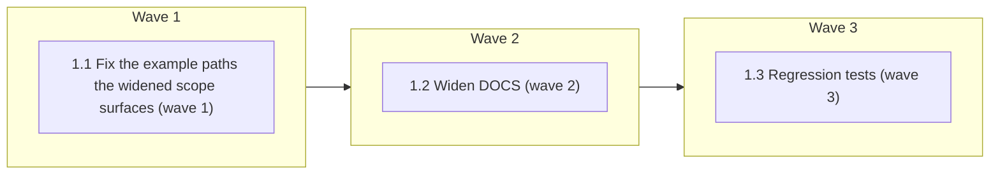

# Widen the doc-truth lint to the docs agents actually load

<!-- AT-A-GLANCE:BEGIN (generated — do not edit; refreshed by render_plan.py --summarize) -->
## At a glance

**3 tasks · 3 waves · 4 files · 2/3 done**

| Wave | Task | Title | Files | Done (acceptance) |
|---|---|---|---|---|
| 1 | 1.1 | Fix the example paths the widened scope surfaces (wave 1) | agents/PROJECT.template.md, agents/test-runner.md | Zero findings from the widened scope that are not genuine dangling paths. |
| 2 | 1.2 | Widen DOCS (wave 2) | scripts/lint-doc-truth.sh | 17 docs linted; exit 0. |
| 3 | 1.3 | Regression tests (wave 3) | tests/scripts/lint-doc-truth.test.sh | Suite passes and is auto-discovered by `run-tests.sh` (`tests/scripts/*.test.sh`… |

### Progress
- [x] 1.1 — Fix the example paths the widened scope surfaces (wave 1)
- [ ] 1.2 — Widen DOCS (wave 2)
- [x] 1.3 — Regression tests (wave 3)
<!-- AT-A-GLANCE:END -->

## 1. Motivation

`scripts/lint-doc-truth.sh` linted four docs: `CLAUDE.md`, `README.md`, `HARNESS.md`,
`skills/README.md`. But `rules/*.md` auto-loads into every session via `.claude/rules/`, and
`agents/*.md` is read by every execution subagent — a dangling path there misleads exactly as
much as one in `CLAUDE.md`, and nothing caught it.

Not hypothetical: PR #119 found stale `skills/xia2/PROJECT.md` pointers surviving in three
`agents/` files, by hand, precisely because the lint did not reach them.

## 2. Non-goals

- Changing what counts as a path reference (the `check_path` / `KNOWN_ROOTS` logic is untouched).
- Widening to `templates/`, `techstacks/`, or `docs/` — a bigger surface with a different
  false-positive profile; separate decision.

## 3. Success Criteria

- `agents/*.md` and `rules/*.md` are linted (4 docs → 17).
- The suite stays green with no false positives.
- A future edit narrowing `DOCS=` back fails a test (the widening is durable, not a one-off).

## 4. Tasks

### Task 1.1 — Fix the example paths the widened scope surfaces (wave 1)

- **Files:** agents/PROJECT.template.md, agents/test-runner.md
- **Action:** The widened scope flags two illustrative paths (`tests/services/test_x.py`,
  `tests/test_x.py`) that were never meant to resolve. Rewrite them in the repo's existing
  placeholder convention (`test_<entity>`, as `rules/plan-format.md` already uses) so they are
  skipped honestly by the existing placeholder rule, rather than special-cased in the lint.
- **Verify:** `bash scripts/lint-doc-truth.sh`
- **Done:** Zero findings from the widened scope that are not genuine dangling paths.

### Task 1.2 — Widen DOCS (wave 2)

- **Files:** scripts/lint-doc-truth.sh
- **Action:** Add `agents/*.md rules/*.md` to `DOCS=`, wrapped in `shopt -s nullglob` /
  `shopt -u nullglob` so an empty `agents/` or `rules/` yields no entries instead of a literal
  glob that the loop would then report as a missing core doc.
- **Verify:** `bash scripts/lint-doc-truth.sh`
- **Done:** 17 docs linted; exit 0.

### Task 1.3 — Regression tests (wave 3)

- **Files:** tests/scripts/lint-doc-truth.test.sh
- **Action:** New hermetic suite (the script had none). Minimal fixture repo — one hook, a
  matching `CLAUDE.md` table row, a `settings.json` registering it — so the lint's part-3
  hook-table check is satisfiable. Cases: baseline clean · dangling path in `rules/` caught ·
  dangling path in `agents/` caught · real path passes · placeholder skipped · empty dirs do not
  trip the nullglob guard · unknown root still out of scope.
- **Verify:** `bash tests/scripts/lint-doc-truth.test.sh`
- **Done:** Suite passes and is auto-discovered by `run-tests.sh` (`tests/scripts/*.test.sh`).

## 5. Risks

- **False positives blocking CI.** Mitigated by measuring first: the widened scope produced
  exactly 2 findings, both illustrative paths, both fixed in Task 1.1.
- **Prose churn.** `rules/` and `agents/` are edited more often than the four core docs, so the
  lint now has more chances to fire on ordinary edits. Accepted: that is the point, and the
  placeholder convention gives authors an escape hatch that reads as documentation.

## 6. Status Log

- 2026-07-20 — measured widened scope: 2 findings, both illustrative, none a real dangling path.
- 2026-07-20 — Tasks 1.1–1.3 done. 4 → 17 docs linted; new suite 7 passed; full suite ALL GREEN.
- 2026-07-20 — mutation-tested: narrowing `DOCS=` back kills the 2 SCOPE cases.
