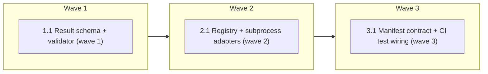

# Evaluator Protocol v1

Phase 2 of `specs/loop-engineering/roadmap.md`. Research: `specs/loop-engineering/research-brief.md`
(§3 gap 1, §4 tiers, §5 constraints). Intake: `SUMMARY.md` (lane normal, confidence medium).

<!-- AT-A-GLANCE:BEGIN (generated — do not edit; refreshed by render_plan.py --summarize) -->
## At a glance

**3 tasks · 3 waves · 9 files · 3/3 done**

| Wave | Task | Title | Files | Done (acceptance) |
|---|---|---|---|---|
| 1 | 1.1 | Result schema + validator (wave 1) | runtime/evaluator-result.schema.json, runtime/evaluator_result.py, runtime/test_evaluator_result.py | Tests cover: valid object passes; missing `status` fails with a message naming t… |
| 2 | 2.1 | Registry + subprocess adapters (wave 2) | runtime/evaluators.json, runtime/evaluators.py, runtime/test_evaluators.py, runtime/testdata/evaluator-pass/SUMMARY.md | All parity and status-mapping tests pass; `python3 runtime/evaluators.py list --… |
| 3 | 3.1 | Manifest contract + CI test wiring (wave 3) | harness-manifest.json, scripts/run-tests.sh | `check_manifest.py` exits 0; both test module names are present in `scripts/run-… |

### Progress
- [x] 1.1 — Result schema + validator (wave 1)
- [x] 2.1 — Registry + subprocess adapters (wave 2)
- [x] 3.1 — Manifest contract + CI test wiring (wave 3)
<!-- AT-A-GLANCE:END -->

## 1. Motivation

Three machine-checkable evaluators ship today — `scripts/verify_summary.py`,
`scripts/check_verify_rows.py`, `scripts/check_review_receipt.py` — but each is a bespoke CLI with
its own argument shape and its own stdout/stderr conventions. Anything that wants to run "the
cheap deterministic tier" (a future loop controller, `resume_decision.py`, CI) must know every
checker by hand. Phase 2 puts one result shape and one registry in front of them so a caller can
ask "run evaluator X, give me `status/score/evidence/exit`" without learning each CLI.

## 2. Non-goals

- No new evaluators. No change to what any checker accepts or rejects.
- No edits to the three wrapped scripts — they keep byte-identical behavior and exit codes.
  `scripts/verify_summary.py` is the `lane-evidence-mapping` contract surface; wrapping keeps
  the CI strict-gate at its warn tier and the contract untouched.
- No new hook, no `settings.json`, `skills/`, `rules/`, or `agents/` edits (research-brief §5).
- No LLM-as-judge evaluator, no in-loop controller, no budgets, no goal envelope — those are
  Phases 3–5.
- No third-party dependency (stdlib only, matching the rest of `runtime/` and `scripts/`).

## 3. Success Criteria

| ID | Behavior (observable) | Check (re-runnable) | Expected |
|------|-------------------------|-----------------------|------------|
| SC-1 | The result schema file is valid JSON and declares the required keys `evaluator`, `status`, `score`, `evidence`, `exit` | `python3 runtime/evaluator_result.py --self-check` | exit 0 — prints the 5 required key names |
| SC-2 | A result object missing `status`, or with `status` outside `pass/fail/error/skipped`, is rejected by the validator | `python3 -m pytest runtime/test_evaluator_result.py -q -p no:cacheprovider` | exit 0 |
| SC-3 | The registry lists exactly the four wrapped evaluators and every entry resolves to an existing script | `python3 runtime/evaluators.py list --check` | exit 0 — prints 4 ids |
| SC-4 | Running an evaluator through the adapter against the tracked pass fixture emits one schema-valid JSON result on stdout | `python3 runtime/evaluators.py run verify-summary-lane -- runtime/testdata/evaluator-pass/SUMMARY.md` | exit 0 — stdout is a single JSON object with `"status": "pass"` |
| SC-5 | The adapter's exit code equals the wrapped checker's exit code for a passing and a failing run of all four evaluators, and for a bad invocation of the three checkers that define exit 2 (`verify_summary.py`, `check_review_receipt.py`, and `verify-summary-check`) | `python3 -m pytest runtime/test_evaluators.py -q -p no:cacheprovider -k parity` | exit 0 |
| SC-6 | A wrapped checker that fails yields `status: fail` and its stderr line in `evidence`; a bad invocation yields `status: error`; a zero-argument `check-verify-rows` run returns instead of blocking on stdin | `python3 -m pytest runtime/test_evaluators.py -q -p no:cacheprovider -k status_mapping` | exit 0 |
| SC-7 | The harness manifest declares the new `evaluator-protocol` contract and the manifest checker accepts it | `python3 scripts/check_manifest.py` | exit 0 |
| SC-8 | Both new test modules are named on the `PYTESTS=` line of the shared test runner that CI runs | `python3 -c "import sys;s=open('scripts/run-tests'+'.sh').read();sys.exit(0 if 'runtime/test_evaluators.py' in s and 'runtime/test_evaluator_result.py' in s else 1)"` | exit 0 |

## Global Constraints

- Invoke the wrapped checkers **by subprocess with their existing CLI** (`python3 scripts/<name>.py …`),
  never by importing their internals. The adapter's process exit code MUST equal the wrapped
  checker's exit code, unchanged.
- Do not edit `scripts/verify_summary.py`, `scripts/check_verify_rows.py`, or
  `scripts/check_review_receipt.py`. If a wrapper needs something they do not expose, record it
  as a Phase-2 gap in `SUMMARY.md` `### Harness-Delta` instead of changing them.
- Status mapping is fixed: exit `0` → `pass`, exit `1` → `fail`, exit `2` → `error`, any other
  exit or a spawn failure → `error`. `score` is `null` for all four (they are pass/fail checkers).
  `scripts/check_verify_rows.py` defines **no** exit-2 path (its docstring advertises one; the
  code has none — `grep -n "return 2" scripts/check_verify_rows.py` is empty), so bad-invocation
  parity is asserted only for the checkers that do.
- Every spawn passes `stdin=subprocess.DEVNULL`. `check_verify_rows.py` reads paths from stdin
  when given no arguments (`scripts/check_verify_rows.py:173-174`); without a closed stdin a
  zero-argument run blocks forever.
- The registry carries both `argv_prefix` and `argv_suffix`; the adapter spawns
  `python3 <script> <argv_prefix> <args> <argv_suffix>`.
- Python stdlib only. Schema validation is a hand-written check in `runtime/evaluator_result.py`
  (required keys, enum, types) — no `jsonschema` package.
- The schema and the registry are tracked files under `runtime/`; the adapter never writes to
  the worktree or to `.harness-state/` (index-safe by construction — nothing for a gate to read).
- Every `Verify:` and SC check is a single pipe-free command that finishes in under 60 s.
- New tests are added to the `PYTESTS` line in `scripts/run-tests.sh`; nothing else in that
  file changes.

## 4. Tasks

### Task 1.1 — Result schema + validator (wave 1)

- **Files:** runtime/evaluator-result.schema.json, runtime/evaluator_result.py, runtime/test_evaluator_result.py
- **Action:** Write the tests first. Create `runtime/evaluator-result.schema.json` as a
  JSON-Schema-shaped document (draft-07 keywords, informational — not consumed by a library)
  with required keys `evaluator` (string), `status` (enum `pass|fail|error|skipped`), `score`
  (number or null), `evidence` (array of objects `{"source": str, "message": str}`), `exit`
  (integer); optional `argv` (array of strings) and `duration_ms` (integer). Seed field naming
  from `templates/REVIEW-RECEIPT.template.json` (`result` there maps to `status` here — note the
  mapping in the module docstring). Create `runtime/evaluator_result.py` exposing
  `REQUIRED_KEYS`, `STATUSES`, `validate(obj) -> list[str]` (empty list = valid; one message per
  violation), and a CLI: `--self-check` loads the schema and prints the required key names,
  `--validate <path>` validates a JSON file. Exit 0 valid, 1 invalid, 2 bad invocation.
- **Verify:** `python3 -m pytest runtime/test_evaluator_result.py -q -p no:cacheprovider`
- **Done:** Tests cover: valid object passes; missing `status` fails with a message naming the key; bad enum fails; `score: null` passes; `evidence` item missing `message` fails; `--self-check` exits 0.
- **Criteria:** SC-1, SC-2
- **Interfaces:** Consumes `templates/REVIEW-RECEIPT.template.json` as naming seed. Produces `runtime/evaluator-result.schema.json`, `runtime/evaluator_result.py` (`validate`, `REQUIRED_KEYS`, `STATUSES`).

### Task 2.1 — Registry + subprocess adapters (wave 2)

- **Files:** runtime/evaluators.json, runtime/evaluators.py, runtime/test_evaluators.py, runtime/testdata/evaluator-pass/SUMMARY.md
- **Action:** Write the tests first. Create `runtime/testdata/evaluator-pass/SUMMARY.md` — a
  minimal tiny-lane SUMMARY (header block per `templates/SUMMARY.template.md`, no sibling
  `PLAN.md`, so SC coverage fail-opens) that `verify_summary.py --lane <path>` accepts today;
  it is the tracked pass fixture for SC-4. Create `runtime/evaluators.json` — a registry keyed
  by evaluator id with `script` (repo-relative path), `tier: "deterministic"`, `argv_prefix`,
  `argv_suffix` (both arrays, may be empty), and `description`. Exactly four entries:
  `verify-summary-lane` (`scripts/verify_summary.py`, prefix `["--lane"]`),
  `verify-summary-check` (`scripts/verify_summary.py`, suffix `["--check"]`),
  `check-verify-rows` (`scripts/check_verify_rows.py`), `check-review-receipt`
  (`scripts/check_review_receipt.py`). Create `runtime/evaluators.py` with
  `load_registry() -> dict`, `run(evaluator_id, args, *, repo_root) -> dict` that spawns
  `python3 <script> <argv_prefix> <args> <argv_suffix>` via `subprocess.run` with
  `cwd=repo_root`, `stdin=subprocess.DEVNULL`, captures stdout/stderr, maps the exit code per
  Global Constraints, builds `evidence` from each non-empty stderr line (`source: "stderr"`)
  and stdout line (`source: "stdout"`), fills `argv` and `duration_ms`, and asserts
  `evaluator_result.validate(result) == []` before returning. CLI: `list [--check]` prints ids
  (with `--check`, exit 1 if any `script` path is missing or the count is not 4);
  `run <id> -- <args…>` prints the JSON result to stdout and exits with the wrapped exit code;
  unknown id → exit 2. Tests build temp spec dirs (a passing `SUMMARY.md`, a failing one, a
  receipt dir with no receipt) and, for each of the four ids, compare `run(...)["exit"]` and
  the CLI's process exit code against a direct `subprocess.run` of the wrapped script with the
  same args, for pass and fail, plus bad-invocation for the three that define exit 2
  (`-k parity`); a second group asserts the `status` mapping, evidence capture, and that a
  zero-argument `check-verify-rows` run returns within the test's 10 s timeout
  (`-k status_mapping`).
- **Verify:** `python3 -m pytest runtime/test_evaluators.py -q -p no:cacheprovider`
- **Done:** All parity and status-mapping tests pass; `python3 runtime/evaluators.py list --check` prints 4 ids and exits 0; `python3 runtime/evaluators.py run verify-summary-lane -- runtime/testdata/evaluator-pass/SUMMARY.md` exits 0 with schema-valid JSON on stdout.
- **Criteria:** SC-3, SC-4, SC-5, SC-6
- **Interfaces:** Consumes `runtime/evaluator_result.py` (`validate`) and the three wrapped checker CLIs by subprocess. Produces `runtime/evaluators.json`, `runtime/evaluators.py` (`load_registry`, `run`, CLI `list`/`run`), `runtime/testdata/evaluator-pass/SUMMARY.md`.

### Task 3.1 — Manifest contract + CI test wiring (wave 3)

- **Files:** harness-manifest.json, scripts/run-tests.sh
- **Action:** Add a `contracts.evaluator-protocol` entry to `harness-manifest.json` with
  `surface: ["runtime/evaluator-result.schema.json", "runtime/evaluators.json", "runtime/evaluators.py", "runtime/evaluator_result.py", "runtime/testdata/evaluator-pass/SUMMARY.md"]`,
  `consumers: ["runtime/test_evaluators.py", "runtime/test_evaluator_result.py", "scripts/run-tests.sh"]`,
  and a one-line `desc` ("Phase 2 loop-engineering: one result schema + registry over the
  deterministic checkers; wrapped exit codes unchanged"). Append
  `runtime/test_evaluator_result.py runtime/test_evaluators.py` to the existing `PYTESTS=`
  line in `scripts/run-tests.sh`; change nothing else in that file.
- **Verify:** `python3 scripts/check_manifest.py && python3 -c "import sys;s=open('scripts/run-tests'+'.sh').read();sys.exit(0 if 'runtime/test_evaluators.py' in s and 'runtime/test_evaluator_result.py' in s else 1)"`
- **Done:** `check_manifest.py` exits 0; both test module names are present in `scripts/run-tests.sh`; `bash scripts/run-tests.sh` is cited in SUMMARY prose (not a Verify row) and passes at finishing time.
- **Criteria:** SC-7, SC-8
- **Interfaces:** Consumes the file set produced by Tasks 1.1 and 2.1. Produces the `evaluator-protocol` contract entry in `harness-manifest.json` and the extended `PYTESTS` line in `scripts/run-tests.sh`.

## 5. Risks

- **`check_manifest.py` requires every `surface`/`consumers` path to exist**
  (`scripts/check_manifest.py:170-174`) — Task 3.1 is in wave 3 precisely so the files exist
  first. If it also requires each contract to be listed elsewhere (e.g. CLAUDE.md), that is a
  Task 3.1 Rule-2 auto-add, recorded in `### Deviations`.
- **`verify_summary.py --check` semantics** — the "check" adapter re-runs Verify rows and may
  exceed 60 s on a large SUMMARY; the adapter passes through whatever the checker does and the
  parity test uses a tiny fixture SUMMARY. The <60 s guardrail applies to the SC/Verify rows in
  this plan, not to every possible wrapped invocation.
- **`scripts/` warn-tier strict gate** — Task 3.1 touches `scripts/run-tests.sh`, so
  `ci-strict-gate.sh` reports (does not block). SUMMARY `### Verify` rows re-run clean, which
  is the proof it looks for.
- **Known loop-control bug** (`docs/solutions/harness/review-round-skipped-when-two-arrive-together.md`)
  — out of scope here (no controller in Phase 2), but the `duration_ms` and `argv` fields are
  kept so Phase 5 receipts can order iterations without a schema bump.

## 6. Status Log

- 2026-08-24 — proposed (writing-plans). Waiting on `using-git-worktrees` → `subagent-driven-development`.
- 2026-08-24 — active; worktree `.claude/worktrees/feat+loop-engineering-phase-2`, branch `feat/loop-engineering-phase-2`; baseline `bash scripts/run-tests.sh` ALL GREEN (582 pytest).
- 2026-08-24 — task 1.1 complete; commit fafe5ba (review: spec pass, quality approved, 3 Minor recorded in SUMMARY)
- 2026-08-24 — task 2.1 complete; commit eaf5600 (review: spec pass, quality approved, 4 Minor recorded in SUMMARY; Verify/SC-3/SC-4 re-run by orchestrator)
- 2026-08-24 — task 3.1 complete; commit 6a610f0 (review: spec pass, quality approved, 2 Minor recorded in SUMMARY; SC-7/SC-8 re-run by orchestrator). All SC rows re-executed via `verify_summary.py --check`: 10/10 PASS. Entering final review chain.
- 2026-08-24 — correctness-review: 6 FIND angles → 13 deduplicated locations → independent scoring; 8 findings >=75 fixed over 3 rounds (commits ce2e1d0, a188a11, a8b0534), 9 recorded advisory. Final re-review: 0 new bugs, no weakened tests, verdict SHIP.
- 2026-08-24 — intent-review (plan-blind): 0 gaps, all 8 SCs proven by passing Verify rows; 5 findings recorded (1 excess needs a human call — the CONSUMER_SCRIPTS widening).
- 2026-08-24 — shipped; receipt pinned at a8b05349c41022ff61e6f1c4a0c2eec0d78dc138; `bash scripts/run-tests.sh` ALL GREEN (652 passed).
