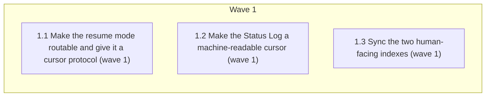

# New-Session Plan Resume

> **For Claude:** REQUIRED SUB-SKILL: use `subagent-driven-development` to implement this plan
> task-by-task. Read `.claude/rules/plan-format.md`, `.claude/rules/wave-parallelism.md` and
> `.claude/rules/auto-correct-scope.md` before the first edit.

<!-- AT-A-GLANCE:BEGIN (generated — do not edit; refreshed by render_plan.py --summarize) -->
## At a glance

**3 tasks · 1 waves · 7 files · 3/3 done**

| Wave | Task | Title | Files | Done (acceptance) |
|---|---|---|---|---|
| 1 | 1.1 | Make the resume mode routable and give it a cursor protocol (wave 1) | skills/subagent-driven-development/SKILL.md, runtime/test_run_state.py | SC-1, SC-2, SC-3, SC-4, SC-6 pass; the file still contains its Step-0 gate, rece… |
| 1 | 1.2 | Make the Status Log a machine-readable cursor (wave 1) | rules/wave-parallelism.md | SC-5 and SC-7 pass; the rule still says the same thing about waves, only the log… |
| 1 | 1.3 | Sync the two human-facing indexes (wave 1) | skills/README.md, CLAUDE.md, skills/writing-plans/SKILL.md, .gitignore | SC-10 passes; both indexes describe the same two modes the skill now implements. |

### Progress
- [x] 1.1 — Make the resume mode routable and give it a cursor protocol (wave 1)
- [x] 1.2 — Make the Status Log a machine-readable cursor (wave 1)
- [x] 1.3 — Sync the two human-facing indexes (wave 1)
<!-- AT-A-GLANCE:END -->

## 1. Motivation

The retired `executing-plans` skill was folded into `subagent-driven-development`, but the fold left
the **new-session / resume** capability undeliverable: the frontmatter still says "in the current
session" (so the mode is unroutable), no prompt tells a fresh session how to reconstruct the task
cursor, `## Status Log` records shas but not task ids (starving the one machine-readable cursor the
repo already renders), and the durable run-state has never been initialized on any spec. Evidence
and file:line references: `research-brief.md`.

This plan restores the **capability** at one source of truth instead of restoring the deleted file —
`scripts/check_slim_surface.py` stays untouched and `harness-manifest.json` skills[] stays at 12.

## 2. Non-goals

- Re-creating `skills/executing-plans/` in any form (file, alias, or wrapper) — explicitly excluded
  by the user.
- Editing `scripts/check_slim_surface.py`, its test, or `harness-manifest.json` skills[].
- Changing any review gate, the Step-0 four-check gate, the receipt contract, or the ship gate.
- Making the run-state checkpoints fatal — they stay `|| true` observability, never gates.
- Building a new `/session-tracker`-style skill (`specs/STATE.md:24` names one that does not exist;
  out of scope here).

## 3. Success Criteria

| ID | Behavior (observable) | Check (re-runnable) | Expected |
|------|-------------------------|-----------------------|------------|
| SC-1 | The skill's routable description names the new-session/resume mode, so a fresh session can find it without opening the file | `grep -q '^description:.*new session' skills/subagent-driven-development/SKILL.md` | exit 0 — pipe-free per `docs/solutions/harness/verify-row-must-be-pipe-free-and-under-60s.md` |
| SC-2 | A named resume mode section exists with an explicit reconstruction step | `grep -q 'Step -1' skills/subagent-driven-development/SKILL.md` | exit 0 |
| SC-3 | The reconstruction recipe names all four cursor sources (Status Log/Progress, run_state status, git log, SUMMARY) | `python3 -c "t=open('skills/subagent-driven-development/SKILL.md').read();import sys;sys.exit(0 if all(s in t for s in ['Status Log','run_state.py status','git log','SUMMARY.md']) else 1)"` | exit 0 |
| SC-4 | Resume is invocable by argument, with no new skill name | `grep -q 'resume <slug>' skills/subagent-driven-development/SKILL.md` | exit 0 |
| SC-5 | The wave collection protocol requires task ids (not only shas) in the Status Log | `grep -q 'task ids' rules/wave-parallelism.md` | exit 0 |
| SC-6 | An uninitialized run is reported as untracked, never forced into a wrong state — the skill forbids `init` at the execution checkpoint and says why | `python3 -c "t=open('skills/subagent-driven-development/SKILL.md').read();import sys;sys.exit(0 if 'Do not' in t and 'queued -> implementing' in t and 'FORWARD_TRANSITIONS' in t else 1)"` | exit 0 — revised after the correctness pass proved `queued -> implementing` is not a legal edge |
| SC-7 | A Status Log entry written per the new protocol yields a derivable done-task cursor | `python3 -c "import sys;sys.path.insert(0,'skills/visual-planner');import render_plan as r;e=r.parse_status_entries('## Status Log' + chr(10)*2 + '- 2026-07-26 — tasks 1.1, 1.2 complete; commits abc1234, def5678' + chr(10));sys.exit(0 if r._done_task_ids(e,['1.1','1.2'])=={'1.1','1.2'} else 1)"` | exit 0 — proves gap 3 is closed end-to-end |
| SC-8 | The retirement guard is still green — no skill returned to disk or the manifest | `python3 scripts/check_slim_surface.py` | exit 0 |
| SC-9 | Skill registry unchanged and bidirectionally consistent | `python3 scripts/check_manifest.py` | exit 0 |
| SC-10 | Every path named in the touched docs exists (no dangling reference) | `bash scripts/lint-doc-truth.sh` | exit 0 |
| SC-11 | The two run-state branches Step -1 must distinguish are pinned mechanically, not only in prose: a never-initialized run is not checkable, and a lost projection over a valid log recovers its `blocked` state | `python3 -m pytest runtime/test_run_state.py -k "never_initialized or missing_projection" -q` | exit 0 — added after Codex round 5 |

## 4. Tasks

### Task 1.1 — Make the resume mode routable and give it a cursor protocol (wave 1)

- **Files:** skills/subagent-driven-development/SKILL.md, runtime/test_run_state.py
- **Action:** Four additive edits to the one file that owns plan execution.
  (a) Frontmatter `description`: extend to name both modes — executing a plan in the current
  session **or resuming one from a new session** — so the router surfaces it (SC-1).
  (b) Rename `## Parallel session` → `## New-session / resume mode` and move it up to directly
  after `## When to Use`, keeping every existing sentence (same gates, batch + checkpoint,
  stop-and-ask). Add the worktree prerequisite: a new session in a worktree with no deployed
  `.claude/` cannot resolve this skill — run `scripts/deploy-harness.sh --target <worktree>` first
  (per `skills/using-git-worktrees/SKILL.md`).
  (c) Inside that section add **`### Step -1 — Reconstruct the cursor (resume only)`**: read
  `specs/<slug>/PLAN.md` `## Status Log` + the derived `### Progress` checklist, run
  `python3 runtime/run_state.py status --slug <slug>`, read `git log --oneline <base>..HEAD` on the
  branch, and read `specs/<slug>/SUMMARY.md` `### Deviations`. Then **re-run the `Verify` command of
  every task the log claims complete** before trusting it — a checkbox is not evidence — report the
  cursor (done / next / blocked) to the user, and continue from the first task that is not verified
  green. Fall through to Step 0 (the four-check gate) as normal; resuming never buys fewer gates.
  (d) In `## The Process` Step 1, document the exit-3 case at the `transition --to implementing`
  checkpoint: an uninitialized run stays untracked (`/feature-intake` owns `init`), and the skill must
  **forbid** calling `init` here — a fresh `init` lands in `queued`, `queued -> implementing` is not a
  legal edge in `FORWARD_TRANSITIONS`, so the transition fails exit 2, `|| true` swallows it, and the
  run reports `queued` while the work is implementing: a wrong state instead of a missing one.
  (Revised mid-execution: the first attempt *added* the blind `init`; the correctness pass proved the
  edge illegal by running it — see SUMMARY `### Deviations`.)
  Also document the argument contract near the top of the resume section: `/subagent-driven-development
  resume <slug>` (no new skill name, no alias file). Do not touch Step 0, the wave policy, the review
  chain, the receipt section, or the ship gate.
- **Verify:** `python3 -c "t=open('skills/subagent-driven-development/SKILL.md').read();import re,sys;sys.exit(0 if all(s in t for s in ['New-session / resume mode','Step -1','resume <slug>','FORWARD_TRANSITIONS','run_state.py status']) and re.search(r'^description:.*(new session|resum)',t,re.M) else 1)"`
- **Done:** SC-1, SC-2, SC-3, SC-4, SC-6 pass; the file still contains its Step-0 gate, receipt
  section, and both review-oracle sections unchanged.

### Task 1.2 — Make the Status Log a machine-readable cursor (wave 1)

- **Files:** rules/wave-parallelism.md
- **Action:** In `## Collection protocol` step 2, change "Append task commit shas to PLAN.md
  `## 7. Status Log`" to require **task ids and their commit shas, plus a completion marker**
  (`complete` or `✓`) in the same entry — and state why: `render_plan.py` `_done_task_ids` extracts
  task ids from entries that read as completions, and that set is what feeds the `### Progress`
  checklist a resuming session reads as its cursor. Give the one-line entry shape
  (`- YYYY-MM-DD — tasks 1.1, 1.2 complete; commits <sha>, <sha>`). Also point step 4's "update
  STATE.md with cursor" at the resume mode in `subagent-driven-development` so a blocked wave is
  resumable. Leave the five invariants, the example table, and the orchestrator-commit shape alone.
- **Verify:** `python3 -c "t=open('rules/wave-parallelism.md').read();import sys;sys.exit(0 if 'task ids' in t and '_done_task_ids' in t and 'Progress' in t else 1)"`
- **Done:** SC-5 and SC-7 pass; the rule still says the same thing about waves, only the log entry
  contract is tightened.

### Task 1.3 — Sync the two human-facing indexes (wave 1)

- **Files:** skills/README.md, CLAUDE.md, skills/writing-plans/SKILL.md, .gitignore
- **Action:** `skills/writing-plans/SKILL.md` Execution Handoff (added during execution — Rule 3:
  its handoff sentence pointed readers at the old "parallel session" name, a stale pointer the
  moment task 1.1 renamed the section). `skills/README.md`: in the Full-Cycle diagram and the Execution table row for
  `/subagent-driven-development`, replace "parallel session" wording with the new mode name and note
  that a resuming session reconstructs its cursor first (Step -1). `CLAUDE.md`: in the Skill
  Workflow chain, change `(same session, or a parallel session — same skill)` to name the
  new-session/resume mode. Wording only — no new claims about hooks, and no new paths beyond files
  that already exist (`lint-doc-truth.sh` lints both files).
- **Verify:** `bash scripts/lint-doc-truth.sh`
- **Done:** SC-10 passes; both indexes describe the same two modes the skill now implements.

## 5. Risks

- **Deleting a gate while moving a section (the slim-skill-surface hazard).** Task 1.1 moves
  ~16 lines. Mitigation: the rule is *move, never drop* — any line stating a constraint survives
  verbatim; task 1.1's `Verify` asserts the load-bearing strings, and Step-0/receipt/ship-gate
  sections are explicitly out of scope.
- **`grep`-shaped Success Criteria prove text, not behavior.** Accepted for SC-1…SC-6 (the artifact
  *is* text — this is workflow-as-code), but SC-7 is a real behavioral check against the actual
  renderer, which is the one gap where a wrong contract would silently produce an empty cursor.
- **Run-state `init` on an already-initialized run.** `cmd_init` without `--run-id` is idempotent
  (checks existence before generating a uuid — `specs/gh-129-durable-run-state-phase-a/SUMMARY.md:67`),
  and the call stays `|| true`, so the added line cannot regress an in-flight run.
- **Reviews run inline, not as independent subagents.** This session is instructed not to dispatch
  agents, so the correctness/intent passes are main-thread self-review — weaker ensemble diversity
  than the skill's contract. Recorded honestly in `SUMMARY.md ### Verify` rather than claimed as a
  full independent pass.

## 6. Status Log

- 2026-07-26 — plan written (lane high-risk, hard gate `workflow-engine`, confidence high; scope
  narrowed by the user to enhance-in-place). Research: `research-brief.md`.
- 2026-07-26 — tasks 1.1, 1.2, 1.3 complete (wave 1, executed in the main session). SC-1…SC-10 all
  exit 0; `scripts/run-tests.sh` ALL GREEN (217 python + all hook/script suites); `lint-doc-truth`,
  `check_manifest`, `check_slim_surface`, `lint-skill-bash` all exit 0. Two Rule-1 precision fixes
  applied in Step -1 (run_state exit-3 semantics, `<base>` definition) and one Rule-3 scope addition
  (`skills/writing-plans/SKILL.md` stale "parallel session" pointer). Commits appended below.
- 2026-07-26 — review chain run. One **blocking** correctness finding fixed: the `run_state.py init`
  added by task 1.1(d) made `queued -> implementing` fail exit 2 (illegal FSM edge), leaving the run
  stuck at `queued` — removed, replaced with the exit-3 contract + an explicit prohibition; SC-6
  rewritten. Two SUMMARY bookkeeping defects fixed (SC-6 mis-tag, whole-suite row TIMEOUT).
  `verify_summary.py --check new-session-plan-resume`: 14/14 rows PASS, SC coverage complete.
  `scripts/run-tests.sh` ALL GREEN (217 python + every hook/script suite) — recorded here rather than
  as a Verify row, per the 60s cap.
