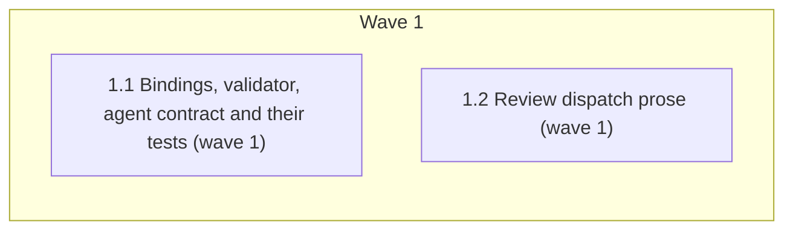

# Review roles on Opus 5.5 (medium), ensemble-diversity rule dropped

<!-- AT-A-GLANCE:BEGIN (generated — do not edit; refreshed by render_plan.py --summarize) -->
## At a glance

**2 tasks · 1 waves · 13 files · 2/2 done**

| Wave | Task | Title | Files | Done (acceptance) |
|---|---|---|---|---|
| 1 | 1.1 | Bindings, validator, agent contract and their tests (wave 1) | agents/runtime-bindings.json, agents/agent-contracts.json, agents/README.md, agents/reviewer.md, scripts/render_runtime_entry.py, scripts/test_render_runtime_entry.py, scripts/test_render_agent_definitions.py, tests/scripts/runtime-entry-bindings.test.sh, tests/scripts/install-harness.test.sh, tests/scripts/deploy-prune.test.sh | SC-1 through SC-8 return their expected exit codes. |
| 1 | 1.2 | Review dispatch prose (wave 1) | skills/correctness-review/correctness-scorer-prompt.md, skills/intent-review/intent-reviewer-prompt.md, skills/intent-review/SKILL.md | SC-9, SC-10 and SC-11 return their expected exit codes. |

### Progress
- [x] 1.1 — Bindings, validator, agent contract and their tests (wave 1)
- [x] 1.2 — Review dispatch prose (wave 1)
<!-- AT-A-GLANCE:END -->

## 1. Motivation

Anthropic's Opus 5.5 guidance makes effort the primary thinking control and reports Opus 5.5 at
`medium` outperforming Opus 5 at `high` on code review. The user chose to move the Claude
`reviewer` and `task-reviewer` roles to `claude-opus-5-5` at `medium`, accepting that the review
passes now share the implementer's model, and to drop the ensemble-diversity rule that forbade it
(`specs/opus-5-5-review-bindings/design.md`).

## 2. Non-goals

- Codex bindings, including the Codex reviewer `model_class` string.
- The `model_stages` map in `adapters/runtime-entry-bindings.json`.
- `docs/solutions/` learning records that mention diversity (flagged for `compound`).
- Redeploying `.claude/` (needs separate user confirmation) and running the evals (after merge).

## Global Constraints

- Edit source files only; never `.claude/`.
- Semantic prompts stay model-neutral: no vendor model label in `skills/` prose (`scripts/check_runtime_neutral_sources.py`).
- Keep the read-only / "not by instruction" / "never fix" claims in `agents/reviewer.md` and their `LOAD_BEARING_SUBSTANCE` tokens.
- Keep every validator check in `scripts/render_runtime_entry.py` other than the two diversity raises.
- Keep the `model_stage` resolution instructions and the `render_runtime_entry.py` reference in both review dispatch prompts.

## 3. Success Criteria

| ID | Behavior (observable) | Check (re-runnable) | Expected |
| --- | --- | --- | --- |
| SC-1 | Claude reviewer and task-reviewer are pinned to Opus 5.5 at medium effort | `python3 -c "import json; r=json.load(open('agents/runtime-bindings.json'))['runtimes']['claude']['roles']; assert all(r[k]['model']=='claude-opus-5-5' and r[k]['effort']=='medium' for k in ('reviewer','task-reviewer'))"` | exit 0 |
| SC-2 | Codex role models are unchanged | `python3 -c "import json; r=json.load(open('agents/runtime-bindings.json'))['runtimes']['codex']['roles']; assert [r[k]['model'] for k in ('coding','reviewer','task-reviewer','test-runner')]==['gpt-5.6-sol','gpt-5.6-terra','gpt-5.6-terra','gpt-5.6-luna']"` | exit 0 |
| SC-3 | The live runtime-entry binding validates with shared review models | `python3 scripts/render_runtime_entry.py --root . --check` | exit 0 |
| SC-4 | Collapsed scorer/finder and intent-reviewer/implementer bindings are accepted, and stage goldens resolve to Opus 5.5 | `python3 -m pytest scripts/test_render_runtime_entry.py -q` | exit 0 |
| SC-5 | Rendered Claude agents carry the new model/effort and keep the load-bearing reviewer claims | `python3 -m pytest scripts/test_render_agent_definitions.py -q` | exit 0 |
| SC-6 | Shell runtime-entry contract passes with the new task-reviewer model | `bash tests/scripts/runtime-entry-bindings.test.sh` | exit 0 |
| SC-7 | Install and deploy tests no longer pin the old reviewer model | `grep -qF "claude-opus-5\$'" tests/scripts/install-harness.test.sh tests/scripts/deploy-prune.test.sh` | exit 1 |
| SC-8 | No agent, binding, contract or script source still requires or claims model diversity | `grep -qi -e "different model" -e "model different from" -e "distinct.from.implement" -e "distinct from .correctness_finder" -e "diversity" -e "must differ" agents/reviewer.md agents/agent-contracts.json agents/README.md agents/runtime-bindings.json scripts/render_runtime_entry.py scripts/test_render_runtime_entry.py scripts/test_render_agent_definitions.py` | exit 1 |
| SC-9 | No review skill prose still requires or claims model diversity | `grep -qi -e "different model" -e "model different from" -e "distinct.from.implement" -e "distinct from .correctness_finder" -e "diversity" -e "must differ" skills/intent-review/SKILL.md skills/intent-review/intent-reviewer-prompt.md skills/correctness-review/correctness-scorer-prompt.md` | exit 1 |
| SC-10 | Shared prompts stay free of vendor model labels and raw skill invocations | `python3 scripts/check_runtime_neutral_sources.py --root .` | exit 0 |
| SC-11 | Documented paths and the hook table still resolve | `bash scripts/lint-doc-truth.sh` | exit 0 |

## 4. Tasks

### Task 1.1 — Bindings, validator, agent contract and their tests (wave 1)

- **Files:** agents/runtime-bindings.json, agents/agent-contracts.json, agents/README.md, agents/reviewer.md, scripts/render_runtime_entry.py, scripts/test_render_runtime_entry.py, scripts/test_render_agent_definitions.py, tests/scripts/runtime-entry-bindings.test.sh, tests/scripts/install-harness.test.sh, tests/scripts/deploy-prune.test.sh
- **Action:** Test-first: in `scripts/test_render_runtime_entry.py`, replace `test_collapsed_model_diversity_is_rejected` with `test_collapsed_review_models_validate`, asserting that a binding mapping `correctness_scorer` to `reviewer`, and one mapping `intent_reviewer` to `coding`, each validates; drop the diversity assertions from the live-binding test and rename it without the word "diversity" (SC-8 greps for it); in `test_paired_model_label_golden_output` set the Claude `task_reviewer` golden to `claude-opus-5-5` and add Claude goldens `intent_reviewer` and `correctness_finder` → `claude-opus-5-5`. Run it and see it fail. Then
  delete the diversity loop (the two `BindingError` raises) from `scripts/render_runtime_entry.py`;
  set Claude `reviewer` and `task-reviewer` to `claude-opus-5-5` / `medium` with `model_class`
  `claude-opus-5-5` in `agents/runtime-bindings.json`; set the reviewer `model_class` in
  `agents/agent-contracts.json` to `review-high-capability` and the reviewer row in
  `agents/README.md` to "review high-capability"; remove the distinct-model / ensemble-diversity
  sentence from the `agents/reviewer.md` description; in `scripts/test_render_agent_definitions.py`
  update `LEGACY_CLAUDE` to the new pins and remove the `distinct` / `ensemble-diversity` tokens and
  their comment; change the `claude-opus-5` pins in the three shell tests to `claude-opus-5-5`.
- **Verify:** `python3 -m pytest scripts/test_render_runtime_entry.py scripts/test_render_agent_definitions.py -q`
- **Done:** SC-1 through SC-8 return their expected exit codes.
- **Criteria:** SC-1, SC-2, SC-3, SC-4, SC-5, SC-6, SC-7, SC-8
- **Interfaces:** Consumes `design.md` §Components 1, 2, 3 (`agents/reviewer.md` only), 4, 5; produces edited `agents/runtime-bindings.json`, `scripts/render_runtime_entry.py`, `agents/reviewer.md` and their tests.

### Task 1.2 — Review dispatch prose (wave 1)

- **Files:** skills/correctness-review/correctness-scorer-prompt.md, skills/intent-review/intent-reviewer-prompt.md, skills/intent-review/SKILL.md
- **Action:** In `correctness-scorer-prompt.md`, replace the "Score with a different model than the
  finders … preserving ensemble diversity" paragraph with a model-neutral instruction to resolve the
  `correctness_scorer` stage, keeping the `model_stage` and rendered-`model:` sentences. Do the same
  for "Use a different model than the implementer … preserving the diversity this pass depends on"
  in `intent-reviewer-prompt.md`. In `skills/intent-review/SKILL.md`, drop "preferably with a model
  different from the implementer" and keep "in fresh context" and the quoting rule. Leave the
  `model_stage: correctness_scorer` and `model_stage: intent_reviewer` lines intact:
  `tests/scripts/runtime-entry-bindings.test.sh` (Task 1.1's SC-6) greps them.
- **Verify:** `python3 scripts/check_runtime_neutral_sources.py --root . && ! grep -qi -e "different model" -e "model different from" -e "diversity" skills/intent-review/SKILL.md skills/intent-review/intent-reviewer-prompt.md skills/correctness-review/correctness-scorer-prompt.md`
- **Done:** SC-9, SC-10 and SC-11 return their expected exit codes.
- **Criteria:** SC-9, SC-10, SC-11
- **Interfaces:** Consumes `design.md` §Components 3; produces edited `skills/correctness-review/correctness-scorer-prompt.md`, `skills/intent-review/intent-reviewer-prompt.md`, `skills/intent-review/SKILL.md`.

## 5. Risks

- Scorer and finders share one model, so a shared blind spot is no longer cross-checked by a second
  model; fresh context, plan-blindness and the threshold-75 filter remain. The follow-up eval measures it.
- `.claude/` keeps the old pins until a confirmed redeploy; evals run before it measure the old config.
- The full suite (`bash scripts/run-tests.sh`) is not an SC row; it runs at `finishing-a-development-branch`.
- Prior eval baselines used `sonnet` / `claude-fable-5`, so a new run cannot attribute a difference to
  this change alone.

## 6. Status Log

- 2026-10-02 — plan written; design and research brief approved.
- 2026-10-02 — tasks 1.1, 1.2 complete; commits d41b78a, adc4bdb; both task reviews spec pass / quality approved (Minor only); SC-1..SC-11 re-run by controller, all match; run-tests.sh ALL GREEN (638 passed).
