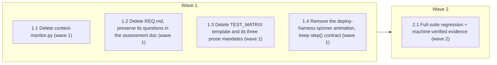

# Phase 2 Wave 1 — Zero-Coupling Deletes

<!-- AT-A-GLANCE:BEGIN (generated — do not edit; refreshed by render_plan.py --summarize) -->
## At a glance

**5 tasks · 2 waves · 9 files · 3/5 done**

| Wave | Task | Title | Files | Done (acceptance) |
|---|---|---|---|---|
| 1 | 1.1 | Delete context-monitor.py (wave 1) | scripts/context-monitor.py | File gone; zero refs outside docs/reviews; nothing else changed. |
| 1 | 1.2 | Delete REQ.md, preserve its questions in the assessment doc (wave 1) | REQ.md, docs/research-harness-req-assessment.md | REQ.md gone; assessment doc self-contained; doc-truth lint green. |
| 1 | 1.3 | Delete TEST_MATRIX template and its three prose mandates (wave 1) | templates/TEST_MATRIX.template.md, rules/orchestration.md, HARNESS.md, README.md | Template gone; zero non-historical mandates remain; lint green. |
| 1 | 1.4 | Remove the deploy-harness spinner animation, keep step() contract (wave 1) | scripts/deploy-harness.sh | Animation gone; step()/✓ output and all installer test suites unchanged and gree… |
| 2 | 2.1 | Full-suite regression + machine-verified evidence (wave 2) | specs/phase2-wave1/SUMMARY.md | ALL GREEN; SUMMARY proof machine-verified; strict gate will pass on CI. |

### Progress
- [x] 1.1 — Delete context-monitor.py (wave 1)
- [ ] 1.2 — Delete REQ.md, preserve its questions in the assessment doc (wave 1)
- [ ] 1.3 — Delete TEST_MATRIX template and its three prose mandates (wave 1)
- [x] 1.4 — Remove the deploy-harness spinner animation, keep step() contract (wave 1)
- [x] 2.1 — Full-suite regression + machine-verified evidence (wave 2)
<!-- AT-A-GLANCE:END -->

## 1. Motivation

First execution wave of issue #67 Phase 2, scoped to the four items `docs/reviews/phase-2-deep-review-2026-07-16.md` verified as deletable with no coordinated machine edits (~375 lines). Fresh re-verification: `specs/phase2-wave1/research-brief.md`; decisions: `design.md`.

## 2. Non-goals

Wave 2 (check_plan_format.py, harness-audit check #4, PR_TEMPLATE.md), Wave 3 owner decisions, and the three reversed items (branch-guard, category_mode, deploy-harness backup/prompt) — none of these may appear in this diff.

## 3. Success Criteria

- The four items are gone; no live reference to any of them survives outside historical docs (docs/reviews/, docs/research*, shipped specs).
- Full harness suite + doc-truth lint green; installer test suites byte-green (spinner trim invisible to them).
- CI strict gate satisfied: this spec's SUMMARY declares `Lane: high-risk` and its Verify table passes `verify_summary.py --check`.

## 4. Tasks

### Task 1.1 — Delete context-monitor.py (wave 1)

- **Files:** scripts/context-monitor.py
- **Action:** `git rm scripts/context-monitor.py`. No other edits — research-brief re-confirmed zero references and no `statusLine` key in either settings file.
- **Verify:** `bash -c 'test ! -f scripts/context-monitor.py && ! grep -rq "context-monitor" scripts/ hooks/ skills/ rules/ templates/ tests/ settings.json harness-manifest.json'`
- **Done:** File gone; zero refs outside docs/reviews; nothing else changed.

### Task 1.2 — Delete REQ.md, preserve its questions in the assessment doc (wave 1)

- **Files:** REQ.md, docs/research-harness-req-assessment.md
- **Action:** Prepend a "Source questions (from REQ.md, deleted 2026-07-17)" block to docs/research-harness-req-assessment.md quoting REQ.md's 6 questions verbatim, then `git rm REQ.md`. Do not touch other historical docs that mention REQ.md.
- **Verify:** `bash -c 'test ! -f REQ.md && grep -q "Source questions" docs/research-harness-req-assessment.md && bash scripts/lint-doc-truth.sh'`
- **Done:** REQ.md gone; assessment doc self-contained; doc-truth lint green.

### Task 1.3 — Delete TEST_MATRIX template and its three prose mandates (wave 1)

- **Files:** templates/TEST_MATRIX.template.md, rules/orchestration.md, HARNESS.md, README.md
- **Action:** `git rm templates/TEST_MATRIX.template.md`. Rewrite per design.md decision 3: orchestration.md:62 paragraph → behavior-to-proof lives in the SUMMARY `### Verify` table; HARNESS.md:53 and README.md:64 → drop the TEST_MATRIX clause, keep the `### Verify` clause. No other content changes in those files.
- **Verify:** `bash -c 'test ! -f templates/TEST_MATRIX.template.md && ! grep -rq "TEST_MATRIX" README.md HARNESS.md rules/ templates/ skills/ scripts/ tests/ && bash scripts/lint-doc-truth.sh'`
- **Done:** Template gone; zero non-historical mandates remain; lint green.

### Task 1.4 — Remove the deploy-harness spinner animation, keep step() contract (wave 1)

- **Files:** scripts/deploy-harness.sh
- **Action:** Per design.md decision 4: delete the `SPIN` array and the 8-frame sleep loop inside `step()`'s TTY branch; TTY branch becomes run-work-then-print `✓ label` (same success line); non-TTY branch and ERR trap unchanged. Surgical — no other part of the installer may change.
- **Verify:** `bash -c '! grep -qE "SPIN|sleep 0.045" scripts/deploy-harness.sh && bash tests/scripts/resync-conflict.test.sh && bash tests/scripts/settings-merge.test.sh && bash tests/scripts/settings-wiring.test.sh'`
- **Done:** Animation gone; step()/✓ output and all installer test suites unchanged and green.

### Task 2.1 — Full-suite regression + machine-verified evidence (wave 2)

- **Files:** specs/phase2-wave1/SUMMARY.md
- **Action:** Run the full CI-equivalent suite; fill this spec's SUMMARY Verify table with only pipe-free re-runnable commands and confirm `python3 scripts/verify_summary.py --check phase2-wave1` exits 0 (the CI strict gate re-runs it because the diff touches `templates/`).
- **Verify:** `bash -c 'bash scripts/run-tests.sh && python3 scripts/verify_summary.py --check phase2-wave1'`
- **Done:** ALL GREEN; SUMMARY proof machine-verified; strict gate will pass on CI.

## 5. Risks

- deploy-harness.sh is the consumer-facing installer — trim is one function body, gated by 4 installer test suites (design.md Risks).
- Prose rewrites could drift from the mechanism — every edited sentence keeps the `### Verify` clause (the mechanism that exists).
- `.claude/rules/orchestration.md` drifts until next authorized re-sync (recorded; local-only).

## 6. Status Log

- 2026-07-17 — research-brief (fresh re-verification of all four claims + the `^templates/` strict-gate discovery), design, and plan written; status proposed, awaiting execution approval. First production plan authored in the markdown task syntax.
- 2026-07-17 — user approved; executed tasks 1.1–1.4 + 2.1 on `feat/phase2-wave1`. All per-task verifies pass; installer suites green; full suite ALL GREEN; `verify_summary --check` exit 0 (one Verify row rewritten pipe-free after tripping the documented cell-split pitfall). ~382 lines deleted.
