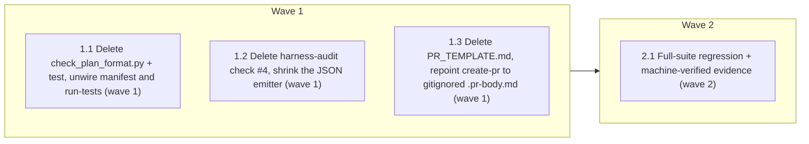

# Phase 2 Wave 2 — Coordinated Deletes

<!-- AT-A-GLANCE:BEGIN (generated — do not edit; refreshed by render_plan.py --summarize) -->
## At a glance

**4 tasks · 2 waves · 12 files · 4/4 done**

| Wave | Task | Title | Files | Done (acceptance) |
|---|---|---|---|---|
| 1 | 1.1 | Delete check_plan_format.py + test, unwire manifest and run-tests (wave 1) | scripts/check_plan_format.py, scripts/test_check_plan_format.py, harness-manifest.json, scripts/run-tests.sh | Both files gone; manifest consumer + PYTESTS entry removed; check_manifest.py ex… |
| 1 | 1.2 | Delete harness-audit check #4, shrink the JSON emitter (wave 1) | scripts/harness-audit.sh, tests/scripts/harness-audit.test.sh | Check #4 gone; `--json` emits valid JSON without the key; audit test suite green… |
| 1 | 1.3 | Delete PR_TEMPLATE.md, repoint create-pr to gitignored .pr-body.md (wave 1) | PR_TEMPLATE.md, .gitignore, skills/create-pr/SKILL.md, skills/finishing-a-development-branch/SKILL.md, skills/README.md | File gone; zero PR_TEMPLATE refs in skills/; .pr-body.md gitignored; lint green. |
| 2 | 2.1 | Full-suite regression + machine-verified evidence (wave 2) | specs/phase2-wave2/SUMMARY.md | ALL GREEN; SUMMARY proof machine-verified. |

### Progress
- [x] 1.1 — Delete check_plan_format.py + test, unwire manifest and run-tests (wave 1)
- [x] 1.2 — Delete harness-audit check #4, shrink the JSON emitter (wave 1)
- [x] 1.3 — Delete PR_TEMPLATE.md, repoint create-pr to gitignored .pr-body.md (wave 1)
- [x] 2.1 — Full-suite regression + machine-verified evidence (wave 2)
<!-- AT-A-GLANCE:END -->

## 1. Motivation

Second execution wave of issue #67 Phase 2: three dead items that each need a coordinated multi-file transaction (manifest/CI/skill wires). Fresh re-verification: `research-brief.md`; decisions: `design.md`. Flows to v3 (staging) then batched to main.

## 2. Non-goals

Wave 3 owner decisions, the three reversed items (branch-guard, category_mode, deploy backup policy), and Wave 1 (already on main) — none appear in this diff.

## 3. Success Criteria

- The three items are gone; every manifest/CI/skill wire updated in the same commit; no dangling reference survives.
- `harness-audit.sh --json` still emits valid JSON (emitter shrink correct); its test suite green.
- Full harness suite + doc-truth lint green; `verify_summary.py --check phase2-wave2` exit 0.

## 4. Tasks

### Task 1.1 — Delete check_plan_format.py + test, unwire manifest and run-tests (wave 1)

- **Files:** scripts/check_plan_format.py, scripts/test_check_plan_format.py, harness-manifest.json, scripts/run-tests.sh
- **Action:** `git rm` both scripts. In harness-manifest.json:68 remove `"scripts/check_plan_format.py"` from `artifact-schema-plan.consumers` (keep render_plan.py). In run-tests.sh:40 remove `scripts/test_check_plan_format.py` from the PYTESTS string. No behavior change to the validator (it is XML-only and unwireable post-PR #69).
- **Verify:** `bash -c 'test ! -f scripts/check_plan_format.py && test ! -f scripts/test_check_plan_format.py && ! grep -q check_plan_format harness-manifest.json scripts/run-tests.sh && python3 scripts/check_manifest.py'`
- **Done:** Both files gone; manifest consumer + PYTESTS entry removed; check_manifest.py exit 0.

### Task 1.2 — Delete harness-audit check #4, shrink the JSON emitter (wave 1)

- **Files:** scripts/harness-audit.sh, tests/scripts/harness-audit.test.sh
- **Action:** Per design.md decision 2: remove docstring item 4 and renumber 5,6→4,5; delete `VERIFY_NEVER_RERUN=0` init; delete the whole check-#4 block; shrink the JSON emitter — `sys.argv[1:11]`→`[1:10]`, drop `vnr` from the unpack tuple, drop `"verify_never_rerun": int(vnr)` from the dict, drop the trailing `"$VERIFY_NEVER_RERUN"` arg. Delete the 3 test cases in harness-audit.test.sh:54-79.
- **Verify:** `bash -c '! grep -q VERIFY_NEVER_RERUN scripts/harness-audit.sh && bash scripts/harness-audit.sh --json | python3 -c "import json,sys; json.load(sys.stdin)" && bash tests/scripts/harness-audit.test.sh'`
- **Done:** Check #4 gone; `--json` emits valid JSON without the key; audit test suite green.

### Task 1.3 — Delete PR_TEMPLATE.md, repoint create-pr to gitignored .pr-body.md (wave 1)

- **Files:** PR_TEMPLATE.md, .gitignore, skills/create-pr/SKILL.md, skills/finishing-a-development-branch/SKILL.md, skills/README.md
- **Action:** `git rm PR_TEMPLATE.md`. Add `.pr-body.md` to .gitignore. Update the 4 references (create-pr/SKILL.md:10,37,40; finishing-a-development-branch/SKILL.md:79; skills/README.md:124) from `PR_TEMPLATE.md` to `.pr-body.md`. No other create-pr behavior change.
- **Verify:** `bash -c 'test ! -f PR_TEMPLATE.md && ! grep -rq "PR_TEMPLATE" skills/ && grep -q ".pr-body.md" .gitignore && bash scripts/lint-doc-truth.sh'`
- **Done:** File gone; zero PR_TEMPLATE refs in skills/; .pr-body.md gitignored; lint green.

### Task 2.1 — Full-suite regression + machine-verified evidence (wave 2)

- **Files:** specs/phase2-wave2/SUMMARY.md
- **Action:** Run the full CI-equivalent suite; fill the SUMMARY Verify table with pipe-free re-runnable commands and confirm `python3 scripts/verify_summary.py --check phase2-wave2` exits 0.
- **Verify:** `bash -c 'bash scripts/run-tests.sh && python3 scripts/verify_summary.py --check phase2-wave2'`
- **Done:** ALL GREEN; SUMMARY proof machine-verified.

## 5. Risks

- JSON-emitter miscount in 1.2 is the one real hazard — its verify runs the emitter through `json.load` + the audit test suite (design.md Risks).
- run-tests.sh is the CI entrypoint — one-line edit, backstopped by Task 2.1's full suite.
- create-pr repoint could orphan a reference — 1.3's grep asserts zero surviving `PR_TEMPLATE` in skills/.

## 6. Status Log

- 2026-07-17 — research-brief (fresh re-verification of all 3 coupling sets + the strict-gate-does-NOT-fire finding), design, plan written; status proposed. Targets v3.
- 2026-07-17 — executed tasks 1.1–1.3 + 2.1 on `feat/phase2-wave2` (branched from v3). All coupling wires updated atomically: manifest consumer + PYTESTS (1.1), JSON emitter 10→9 args + 3 tests + docstring renumber (1.2), 4 create-pr refs → gitignored .pr-body.md (1.3). Full suite ALL GREEN (test count 173→141, the removed check_plan_format cases); verify_summary --check exit 0.
