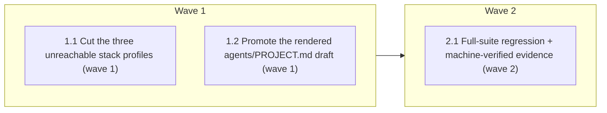

# Phase 2 Wave 3 — Owner-Decided Actions

<!-- AT-A-GLANCE:BEGIN (generated — do not edit; refreshed by render_plan.py --summarize) -->
## At a glance

**3 tasks · 2 waves · 8 files · 0/3 done**

| Wave | Task | Title | Files | Done (acceptance) |
|---|---|---|---|---|
| 1 | 1.1 | Cut the three unreachable stack profiles (wave 1) | templates/stacks/nextjs/architecture.md, templates/stacks/nextjs/guidelines.md, templates/stacks/node/architecture.md, templates/stacks/node/guidelines.md, templates/stacks/django/architecture.md, templates/stacks/django/guidelines.md | Three profiles gone; fastapi + _skeleton remain; lint green. |
| 1 | 1.2 | Promote the rendered agents/PROJECT.md draft (wave 1) | agents/PROJECT.md | PROJECT.md filled with real facts, no longer identical to the template, annotati… |
| 2 | 2.1 | Full-suite regression + machine-verified evidence (wave 2) | specs/phase2-wave3/SUMMARY.md | ALL GREEN; SUMMARY proof machine-verified. |

### Progress
- [ ] 1.1 — Cut the three unreachable stack profiles (wave 1)
- [ ] 1.2 — Promote the rendered agents/PROJECT.md draft (wave 1)
- [ ] 2.1 — Full-suite regression + machine-verified evidence (wave 2)
<!-- AT-A-GLANCE:END -->

## 1. Motivation

Final Phase 2 wave. The four items were technically investigated in the deep review (PR #77) but each needed an owner decision. User decided (2026-07-17): cut the 3 unreachable stack profiles; promote the pre-rendered PROJECT.md draft; keep protected-path-guard dormant (no action); keep agent-memory (no action). This plan executes the two actionable choices.

## 2. Non-goals

protected-path-guard and agent-memory (owner chose keep — no change); Wave 1/2 (already landed); the three reversed items.

## 3. Success Criteria

- `templates/stacks/{nextjs,node,django}` gone; `fastapi` + `_skeleton` remain; bootstrap-xia2's generic `<stack>` logic still valid.
- `agents/PROJECT.md` filled with this repo's real execution facts (no longer byte-identical to the template).
- Full suite + doc-truth lint green; `verify_summary.py --check phase2-wave3` exit 0.

## 4. Tasks

### Task 1.1 — Cut the three unreachable stack profiles (wave 1)

- **Files:** templates/stacks/nextjs/architecture.md, templates/stacks/nextjs/guidelines.md, templates/stacks/node/architecture.md, templates/stacks/node/guidelines.md, templates/stacks/django/architecture.md, templates/stacks/django/guidelines.md
- **Action:** `git rm -r templates/stacks/{nextjs,node,django}`. bootstrap-xia2 references `templates/stacks/<stack>/` generically and falls back to `_skeleton` when no profile matches (never emits a wrong-stack profile), so a JS/Django consumer stays functional. Keep fastapi + _skeleton.
- **Verify:** `bash -c 'test ! -d templates/stacks/nextjs && test ! -d templates/stacks/node && test ! -d templates/stacks/django && test -d templates/stacks/fastapi && test -d templates/stacks/_skeleton && bash scripts/lint-doc-truth.sh'`
- **Done:** Three profiles gone; fastapi + _skeleton remain; lint green.

### Task 1.2 — Promote the rendered agents/PROJECT.md draft (wave 1)

- **Files:** agents/PROJECT.md
- **Action:** Replace the template-identical agents/PROJECT.md with the content of `.claude/agents/PROJECT.md.proposed` (bootstrap-rendered for this repo), stripping the `<!-- auto: … -->` review-annotation comments. Content is this repo's real execution facts (test command, source→test mapping, failure-diagnosis hints). Do not touch agents/PROJECT.template.md (the generator source).
- **Verify:** `bash -c '! diff -q agents/PROJECT.md agents/PROJECT.template.md && grep -q "bash scripts/run-tests.sh" agents/PROJECT.md && ! grep -q "auto:" agents/PROJECT.md'`
- **Done:** PROJECT.md filled with real facts, no longer identical to the template, annotations stripped.

### Task 2.1 — Full-suite regression + machine-verified evidence (wave 2)

- **Files:** specs/phase2-wave3/SUMMARY.md
- **Action:** Run the full CI-equivalent suite; fill the SUMMARY Verify table with pipe-free re-runnable commands; confirm `python3 scripts/verify_summary.py --check phase2-wave3` exits 0.
- **Verify:** `bash -c 'bash scripts/run-tests.sh && python3 scripts/verify_summary.py --check phase2-wave3'`
- **Done:** ALL GREEN; SUMMARY proof machine-verified.

## 5. Risks

- Cutting stacks: a consumer whose stack was nextjs/node/django now gets `_skeleton` instead of a tailored profile — acceptable (skeleton is the designed fallback; owner-approved). No in-repo consumer exists.
- Promoting PROJECT.md ships meta-repo facts in the install payload — owner-accepted trade-off; deploy protects filled copies so a consumer's own render is not clobbered once filled.

## 6. Status Log

- 2026-07-17 — owner decided all 4 Wave-3 items (cut stacks / promote PROJECT.md / keep guard dormant / keep agent-memory); executed the 2 actionable ones on `feat/phase2-wave3`. Full suite ALL GREEN.
