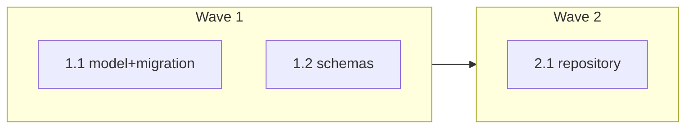

# plan-at-a-glance — Design

> Scope: **A + B** from issue #54 (decided; see `SUMMARY.md` / `ESCALATIONS.md` E001).
> Lane: **high-risk** (edits `render_plan.py`, a core skill engine, and `render-plan-on-write.sh`).

## 1. Problem

`specs/<slug>/PLAN.md` is tracked and authored as a sequence of fenced `xml` `<task>` blocks
(`rules/plan-format.md`). A human reading it on GitHub, in an editor, or via `cat` sees only raw
XML — no wave map, no file map, no progress. The readable view (`PLAN.html`) is gitignored and
local-only. This design makes `PLAN.md` **self-summarizing** so a human understands scope, order,
and progress straight from the tracked file, with **zero tooling**.

## 2. Goal & non-goals

**Goal:** an auto-generated, deterministic "At a glance" block at the top of every tracked
`PLAN.md`, containing a wave×task table, a Mermaid wave diagram, count summary, and in-place
progress checkboxes — regenerated on every save by `render_plan.py`.

**Non-goals (deferred — issue directions C & D):**
- Publishing `PLAN.html` as a shareable Artifact URL (C).
- A single `build_roadmap.py` cross-plan entry point (D).
- Changing the machine contract. Agents parse `<task id/wave/files/action/verify/done>`; the
  summary block is **additive, derived, and never the source of truth**.

## 3. Constraints (from the issue)

1. **Additive & derived** — the `<task>` blocks remain the single source of truth; the block is
   generated *from* them.
2. **Deterministic & script-owned** — generated by `render_plan.py`, never LLM-transcribed.
3. **Idempotent** — same input ⇒ byte-identical block ⇒ regeneration is a no-op; agent edits and
   the PostToolUse hook never cause churn.
4. **Progress derives from `## Status Log`** — the Status Log stays the source of truth for
   completion; checkboxes reflect it.

## 4. The "At a glance" block

Inserted immediately **before the first `## ` heading** (after the H1 and any directive blockquote —
9/17 existing plans carry a `> **For Claude:** REQUIRED SUB-SKILL…` directive between the H1 and the
first `##`; anchoring before the first `##` keeps that directive attached to its title). Delimited by
HTML-comment sentinels:

```markdown
# <Plan title>

> **For Claude:** REQUIRED SUB-SKILL… (directive blockquote, if present — left intact above the block)

<!-- AT-A-GLANCE:BEGIN (generated — do not edit; refreshed by render_plan.py --summarize) -->
## At a glance

**5 tasks · 3 waves · 8 files · 2/5 done**

| Wave | Task | Title | Files | Done (acceptance) |
|---|---|---|---|---|
| 1 | 1.1 | model+migration | app/models/…, alembic/… | Migration applies clean… |
| 1 | 1.2 | schemas | app/schemas/… | Schemas validate… |
| 2 | 2.1 | repository | app/repositories/… | Repo tests pass… |



### Progress
- [x] 1.1 — model+migration
- [x] 1.2 — schemas
- [ ] 2.1 — repository
<!-- AT-A-GLANCE:END -->

## 1. Motivation
…
```

### 4.1 Contents

- **Count line** — `<N> tasks · <W> waves · <F> files · <done>/<N> done`. Four counts that exist
  in the data. The issue's "est. steps" is **omitted**: plans encode no distinct "step" datum, so a
  fuzzy number would imply precision the data lacks (decided).
- **Table** (issue direction A) — one row per task, sorted by `(wave, id)`. Columns: Wave, Task id,
  Title (from `### Task <id> — Title` heading via `attach_titles`; **fallback to the task id** when no
  matching heading exists — `attach_titles` sets no `title` key in that case, so `render_summary_block`
  must default it and never `KeyError`), Files (`<files>`, comma-joined), Done (the `<done>` acceptance
  text, **truncated to 80 chars** with an ellipsis when longer — a fixed limit keeps the determinism
  guarantee in §4.2 assertable).
- **Mermaid** — `flowchart LR`; one `subgraph W<k>[Wave k]` per wave containing its task nodes;
  edges `W<k> --> W<k+1>` in wave order. Wave subgraphs chosen over task-dependency edges because
  plans encode wave numbers, not true inter-task dependencies (decided). Node ids are sanitized task
  ids; labels are `<id> <title>`. GitHub renders Mermaid natively — zero tooling to view.
- **Progress checklist** (issue direction B) — `- [x] <id> — <title>` when the task id is in the
  done set, else `- [ ]`. Ordered by `(wave, id)`.

### 4.2 Determinism

The block is a pure function of parsed data: tasks sorted deterministically, **no timestamps, no
randomness, no environment-dependent content**. Identical PLAN.md input ⇒ byte-identical block.

## 5. Generation mechanism (`render_plan.py`)

Approach 1 (decided): a new opt-in `--summarize` flag; the hook passes it. Bare
`render_plan.py <FILE>` keeps its current read→HTML-only contract (preserves the 43 existing tests
and manual/other callers). Three new units, pure-logic separated from I/O:

| Unit | Signature | Responsibility |
|---|---|---|
| `render_summary_block` | `(tasks, done_ids) -> str` | Build the markdown block **including** both sentinels. Pure, deterministic, unit-testable. (Frontmatter is not needed — the block is derived solely from tasks + done set.) |
| `inject_summary_block` | `(plan_text, block) -> str` | Pure string transform. If both sentinels present, replace the region between them; else insert `block` **immediately before the first `## ` heading** (preserving the H1 and any directive blockquote above it). Never touches human prose outside the region. |
| `summarize_plan_file` | `(path) -> bool` | I/O wrapper: read → parse (reuse `parse_frontmatter`/`extract_tasks`/`parse_task_block`/`attach_titles`/`_done_task_ids`) → build → inject → **write only if bytes changed**. Returns whether it wrote. |

### 5.1 CLI wiring

`main()` gains a `--summarize` flag (hand-rolled arg loop, matching existing style at
`render_plan.py:1299`). When present: run `summarize_plan_file(path)` **before** the HTML render so
the HTML reflects the current file, then render HTML as today.

### 5.2 Edge cases

- **No tasks / unparseable** — emit a minimal block (counts all zero, "No tasks yet") or skip
  injection; never crash, never corrupt the file. (Matches the hook's non-blocking ethos.)
- **Anchor / no `##` heading** — insert immediately before the first `## ` heading; this keeps the H1
  and any `> **For Claude:** …` directive blockquote (present in 9/17 existing plans) intact above the
  block. If the file has no `## ` heading at all, append the block at the end of the body. If there is
  no `# ` title either, insert at the top of the body (after front-matter). Warn, don't fail.
- **Malformed/half-present sentinels** — if only one sentinel is found, treat as "not present" and
  insert a fresh block; do not attempt a partial replace (avoids corrupting the file).
- **Front-matter preserved** — injection operates on the body after `parse_frontmatter`; the
  `--- … ---` header is re-prepended unchanged.
- **Missing `title`** — `attach_titles` only sets `title` when a `### Task <id> — Title` heading
  exists; `render_summary_block` defaults the title to the task id so the table/checklist never
  `KeyError`.
- **Missing `wave` attribute** — `parse_task_block` defaults `wave` to `"—"` (and `plan-format.md`
  permits omitting `wave` on single-wave plans). The count line counts distinct wave values (so an
  all-`"—"` plan reports `1 wave`), the Mermaid subgraph id is sanitized (`"—"` → e.g. `W0`/`Wnone`),
  and the sort key treats `"—"` as a single ordered bucket. Verified by a dedicated unit test.

## 6. Progress semantics (direction B)

Checkbox state derives from `_done_task_ids()` (`render_plan.py:467`), which reads the
`## Status Log`. The `## Status Log` remains the **single source of truth** for completion; the
checklist is a projection of it. Checkboxes live inside the generated region, so they are never
hand-edited — updating progress means updating the Status Log, then regeneration reflects it.

## 7. Hook & HTML integration

- **Hook** — `hooks/render-plan-on-write.sh` adds `--summarize` to its `render_plan.py` invocation.
  It already fires PostToolUse(Write|Edit) on `*/specs/*/PLAN.md`, so the block regenerates on every
  save with no new wiring.
- **No infinite loop** — PostToolUse fires only on the harness's Write/Edit *tools*, not on
  `render_plan.py`'s own subprocess file write. The idempotent no-op-on-unchanged write is belt-and-
  suspenders, not the loop guard.
- **HTML de-duplication** — the HTML renderer **strips the `AT-A-GLANCE:BEGIN…END` region** from the
  body before rendering, so the rich HTML view is not duplicated by the markdown summary.

## 8. Testing

**Unit (`skills/visual-planner/test_render_plan.py`, pytest):**
- `render_summary_block` is deterministic: called twice on the same input ⇒ identical string.
- `inject_summary_block` inserts after H1 when no sentinels exist.
- `inject_summary_block` replaces only the region between sentinels when present; surrounding human
  prose (Motivation, tasks, Status Log) is byte-preserved.
- Half-present / missing-H1 edge cases insert cleanly without corruption.
- Count line correct (tasks, waves, files, done/total), including an all-`"—"`-wave plan reporting
  `1 wave`.
- Missing-title task falls back to its id (no `KeyError`); `<done>` longer than 80 chars is truncated
  with an ellipsis.
- Checkbox state matches `done_ids` (done → `[x]`, not-done → `[ ]`).
- Mermaid contains one subgraph per wave and `W_k --> W_{k+1}` edges in order.
- HTML render strips the marked region (no duplicate "At a glance" in HTML).
- `summarize_plan_file` is a no-op (no write, returns False) when the block is already current.

**Hook contract (`tests/hooks/render-plan-on-write.test.sh`):**
- After a PLAN.md save, the block is present in PLAN.md.
- Running the hook again on the now-current file writes nothing (idempotent).

**Regression:** the 43 existing `test_render_plan.py` cases stay green (bare invocation unchanged).

## 9. Risks & mitigations

| Risk | Mitigation |
|---|---|
| `render_plan.py` now mutates its input file | Opt-in flag only; explicit sentinels; write-only-if-changed; regression suite unchanged. |
| Corrupting human prose | Injection confined to the sentinel region; half-present sentinels treated as absent (fresh insert, never partial replace). |
| Block churn in diffs | Full determinism (no timestamps/randomness) + byte-equality no-op. |
| Wide tables from long file lists | `<done>` truncated; files comma-joined (Markdown tables scroll/wrap). |
| Format drift vs `rules/plan-format.md` | Update `rules/plan-format.md` and `skills/writing-plans/SKILL.md` to document the additive block as derived output. |

## 10. Files touched (anticipated)

- `skills/visual-planner/render_plan.py` — new functions + `--summarize` flag (core skill engine — hard gate).
- `hooks/render-plan-on-write.sh` — pass `--summarize` (hard gate — any `hooks/*`).
- `skills/visual-planner/test_render_plan.py` — new unit tests.
- `tests/hooks/render-plan-on-write.test.sh` — extended contract cases.
- `rules/plan-format.md`, `skills/writing-plans/SKILL.md` — document the derived block (additive).

## 11. Rollback

- `git revert <sha>` (pure-additive feature; removing the flag + hook arg reverts to today's behavior).
- Generated blocks in existing PLAN.md files are inert markdown; they can be left or stripped by
  deleting the sentinel region.
