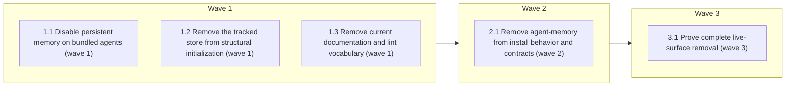

# Remove agent-memory end to end

<!-- AT-A-GLANCE:BEGIN (generated — do not edit; refreshed by render_plan.py --summarize) -->
## At a glance

**5 tasks · 3 waves · 14 files · 0/5 done**

| Wave | Task | Title | Files | Done (acceptance) |
|---|---|---|---|---|
| 1 | 1.1 | Disable persistent memory on bundled agents (wave 1) | agents/coding.md, agents/reviewer.md, agents/test-runner.md | All three bundled source agents retain valid frontmatter and have no persistent-… |
| 1 | 1.2 | Remove the tracked store from structural initialization (wave 1) | agent-memory/README.md, templates/structure/agent-memory-README.md, scripts/init-structure.sh, tests/scripts/init-structure.test.sh | The store and template are gone; the initializer creates exactly six files, expl… |
| 1 | 1.3 | Remove current documentation and lint vocabulary (wave 1) | README.md, skills/README.md, skills/xia2/README.md, scripts/lint-doc-truth.sh | Current user-facing docs no longer claim the feature exists or is installed, the… |
| 2 | 2.1 | Remove agent-memory from install behavior and contracts (wave 2) | scripts/install-harness.sh, tests/scripts/install-harness.test.sh | The integration suite proves dry-run/fresh install/reinstall do not advertise, c… |
| 3 | 3.1 | Prove complete live-surface removal (wave 3) | specs/remove-agent-memory/SUMMARY.md | Full suite is green; SUMMARY contains machine-recheckable proof that no live fea… |

### Progress
- [ ] 1.1 — Disable persistent memory on bundled agents (wave 1)
- [ ] 1.2 — Remove the tracked store from structural initialization (wave 1)
- [ ] 1.3 — Remove current documentation and lint vocabulary (wave 1)
- [ ] 2.1 — Remove agent-memory from install behavior and contracts (wave 2)
- [ ] 3.1 — Prove complete live-surface removal (wave 3)
<!-- AT-A-GLANCE:END -->

## 1. Motivation

Remove the unused tracked `agent-memory` convention, disable persistent memory on the three
bundled subagents, and ensure structural initialization and harness installation never recreate
or advertise the feature. Design: `design.md`; evidence map: `research-brief.md`.

## 2. Non-goals

Do not touch Claude Code's main auto-memory under `~/.claude/projects/`, this checkout's live
gitignored `.claude/`, `/compound`, `docs/solutions/`, or `session-knowledge.sh`. Do not delete a
pre-existing consumer-owned `agent-memory/` during install. Do not rewrite dated historical
documents under `docs/` or other shipped specs.

## 3. Success Criteria

- Root `agent-memory/` and `templates/structure/agent-memory-README.md` are absent.
- The coding, reviewer, and test-runner source definitions contain no `memory:` frontmatter.
- `init-structure.sh` creates exactly the six remaining structural files and does not create
  `agent-memory/`.
- Fresh install and dry-run do not create or advertise agent memory; installed bundled agents are
  memory-free; reinstall remains non-destructive toward a pre-existing consumer directory.
- Current product docs and runtime/test sources have zero live `agent-memory` / `memory: project`
  references; historical documents remain intact.
- Targeted suites and `scripts/run-tests.sh` pass, with re-runnable evidence in SUMMARY.md.

## 4. Tasks

### Task 1.1 — Disable persistent memory on bundled agents (wave 1)

- **Files:** agents/coding.md, agents/reviewer.md, agents/test-runner.md
- **Action:** Test the intended source contract first with a grep that currently fails because all
  three files contain `memory: project`. Remove only the `memory: project` frontmatter line from
  each definition; do not add `memory: local`, `memory: user`, memory-reading prose, or changes to
  the agents' roles/tools. Re-run the same assertion. Do not deploy into the live `.claude/` tree;
  the install integration task verifies derived copies in a temporary target.
- **Verify:** `bash -c '! grep -nE "^memory:" agents/{coding,reviewer,test-runner}.md'`
- **Done:** All three bundled source agents retain valid frontmatter and have no persistent-memory
  field; no live `.claude/` file was modified.

### Task 1.2 — Remove the tracked store from structural initialization (wave 1)

- **Files:** agent-memory/README.md, templates/structure/agent-memory-README.md, scripts/init-structure.sh, tests/scripts/init-structure.test.sh
- **Action:** Update the init-structure contract test first: remove `agent-memory/README.md` from
  `DESTS`, change the bare/re-run labels and `created`/`exists` expectations from seven to six,
  and add an explicit failure if `$d/agent-memory` exists after initialization. Run the test to
  observe failure against the old script. Remove the agent-memory template row from
  `scripts/init-structure.sh`; delete both the tracked root README and the byte-identical source
  template; rerun the test. Preserve create-if-missing, no-clobber, idempotency, and exit-0
  behavior for the remaining six files.
- **Verify:** `bash -c 'test ! -e agent-memory && test ! -e templates/structure/agent-memory-README.md && bash tests/scripts/init-structure.test.sh'`
- **Done:** The store and template are gone; the initializer creates exactly six files, explicitly
  proves it does not create agent-memory, and its contract suite passes.

### Task 1.3 — Remove current documentation and lint vocabulary (wave 1)

- **Files:** README.md, skills/README.md, skills/xia2/README.md, scripts/lint-doc-truth.sh
- **Action:** Rewrite the README inheritance row to make `/compound` + `docs/solutions/` the sole
  committed knowledge path and remove agent-memory from the installation structural-dir list.
  In `skills/README.md`, remove agent-memory from every scaffold/adoption instruction and delete
  the complete Agent Memory section without leaving an empty heading. In `skills/xia2/README.md`,
  change all three init-structure descriptions to list only `specs/` and `docs/solutions/` (the
  script also creates `techstacks/README.md`, but do not broaden these existing high-level
  descriptions unless needed for truth). Remove `agent-memory` from `KNOWN_ROOTS` in
  `scripts/lint-doc-truth.sh`. Preserve historical docs and specs.
- **Verify:** `bash -c '! grep -n "agent-memory" README.md skills/README.md skills/xia2/README.md scripts/lint-doc-truth.sh && bash scripts/lint-doc-truth.sh'`
- **Done:** Current user-facing docs no longer claim the feature exists or is installed, the lint
  root vocabulary matches the remaining tree, and doc-truth lint passes.

### Task 2.1 — Remove agent-memory from install behavior and contracts (wave 2)

- **Files:** scripts/install-harness.sh, tests/scripts/install-harness.test.sh
- **Action:** Extend the install integration tests first. The dry-run case must reject any
  `agent-memory` text and must prove the initially-empty target remains empty with
  `find "$tgt" -mindepth 1 -print -quit`. The fresh structural-scaffold case must require all six
  surviving files — `specs/{README.md,STATE.md}`,
  `docs/solutions/{README.md,INDEX.md,critical-patterns.md}`, and `techstacks/README.md` —
  explicitly require no target `agent-memory/`, and assert the three installed
  `.claude/agents/*.md` files have no `memory:` field. Add a dedicated fresh-target reinstall case
  that runs install twice and confirms no agent-memory directory appears. Add a non-destructive
  compatibility case that pre-creates `agent-memory/KEEP.md` with sentinel content, snapshots the
  directory's relative path manifest, runs install, and proves both the manifest and content are
  byte-identical afterward; this must fail if the installer adds `README.md` or any sibling. Run
  the suite to observe the old prose/behavior failure. Then remove agent-memory from the install
  script header and dry-run scaffold message; rely on the updated init script for real installs;
  rerun the suite. Do not add deletion or migration code.
- **Verify:** `bash tests/scripts/install-harness.test.sh`
- **Done:** The integration suite proves dry-run/fresh install/reinstall do not advertise, create,
  or enable agent memory, while pre-existing consumer data remains untouched.

### Task 3.1 — Prove complete live-surface removal (wave 3)

- **Files:** specs/remove-agent-memory/SUMMARY.md
- **Action:** Create SUMMARY.md using the repository template and record the requested removal,
  high-risk rationale (installer + templates + distributed agent definitions), files changed,
  risks, rollback, and pipe-free re-runnable Verify rows. Run targeted init/install/doc-lint tests,
  then run this exact pipe-free live-surface assertion and record it as a Verify row:
  `bash -c 'rg -n --hidden --glob "!.git/**" --glob "!.claude/**" --glob "!docs/**" --glob "!specs/**" -e "agent-memory" -e "^memory: project$" -e "^memory: local$" -e "^memory: user$" .; rc=$?; test "$rc" -eq 1'`.
  This covers every non-historical repository surface while excluding all audit/history docs and
  this removal spec. Separately run `bash scripts/run-tests.sh` once as shipping evidence and cite
  its result in prose, never in the SUMMARY Verify table because the full suite exceeds the
  per-command 60-second gate. Populate actual exit codes/results for the bounded rows and make
  `verify_summary.py --check remove-agent-memory` pass.
- **Verify:** `bash -c 'rg -n --hidden --glob "!.git/**" --glob "!.claude/**" --glob "!docs/**" --glob "!specs/**" -e "agent-memory" -e "^memory: project$" -e "^memory: local$" -e "^memory: user$" .; rc=$?; test "$rc" -eq 1 && python3 scripts/verify_summary.py --check remove-agent-memory'`
- **Done:** Full suite is green; SUMMARY contains machine-recheckable proof that no live feature or
  install path remains, and verify_summary exits 0.

## 5. Risks

- Removing a distributed agent frontmatter field and installer behavior affects consuming repos,
  so execute in the high-risk lane and validate only through throwaway install targets.
- A consumer may have populated root agent-memory manually. Automatic cleanup is deliberately
  absent; reinstall preserves it byte-for-byte.
- Historical documents will continue to contain the term. Verification distinguishes immutable
  audit records from live source/docs rather than weakening history to get a global zero-hit grep.
- A stale live mention may exist outside the mapped surface. The final scoped grep and widened
  doc-truth lint are independent backstops.
- The live `.claude/` copy remains stale until a separately authorized deploy; this plan must not
  mutate it.

## 6. Status Log

- 2026-07-20 — codebase research completed; owner requested full removal including install
  behavior; design and implementation plan drafted; status proposed.
