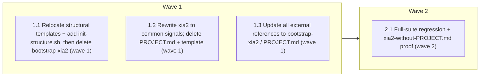

# Remove bootstrap-xia2 — xia2 goes fully common

<!-- AT-A-GLANCE:BEGIN (generated — do not edit; refreshed by render_plan.py --summarize) -->
## At a glance

**4 tasks · 2 waves · 21 files · 0/4 done**

| Wave | Task | Title | Files | Done (acceptance) |
|---|---|---|---|---|
| 1 | 1.1 | Relocate structural templates + add init-structure.sh, then delete bootstrap-xia2 (wave 1) | templates/structure/specs-README.md, templates/structure/specs-STATE.md, templates/structure/agent-memory-README.md, templates/structure/docs-solutions-README.md, templates/structure/docs-solutions-INDEX.md, templates/structure/docs-solutions-critical-patterns.md, scripts/init-structure.sh, tests/scripts/init-structure.test.sh | bootstrap-xia2 gone; templates relocated; init-structure.sh scaffolds a bare rep… |
| 1 | 1.2 | Rewrite xia2 to common signals; delete PROJECT.md + template (wave 1) | skills/xia2/SKILL.md, skills/xia2/PROJECT.md, skills/xia2/PROJECT.template.md, skills/xia2/tests/structural/depth-modes-test-cases.md | xia2 has zero PROJECT.md references, defines common signals inline, hardcodes th… |
| 1 | 1.3 | Update all external references to bootstrap-xia2 / PROJECT.md (wave 1) | harness-manifest.json, skills/README.md, CLAUDE.md, rules/architecture.md, rules/guidelines.md, agents/README.md, agents/PROJECT.template.md, README.md | No live bootstrap-xia2 reference in core docs/manifest; doc-truth lint + check_m… |
| 2 | 2.1 | Full-suite regression + xia2-without-PROJECT.md proof (wave 2) | specs/remove-bootstrap-xia2/SUMMARY.md | ALL GREEN; xia2 config-free; structural init proven; evidence machine-verified. |

### Progress
- [ ] 1.1 — Relocate structural templates + add init-structure.sh, then delete bootstrap-xia2 (wave 1)
- [ ] 1.2 — Rewrite xia2 to common signals; delete PROJECT.md + template (wave 1)
- [ ] 1.3 — Update all external references to bootstrap-xia2 / PROJECT.md (wave 1)
- [ ] 2.1 — Full-suite regression + xia2-without-PROJECT.md proof (wave 2)
<!-- AT-A-GLANCE:END -->

## 1. Motivation

Owner-approved (2026-07-17, "cắt sạch hoàn toàn"): eliminate the per-project config layer, make xia2 classify from built-in common signals, preserve structural-file init, delete bootstrap-xia2 — everything still works. Design: `design.md`; research: `research-brief.md`.

## 2. Non-goals

No optional `.xia2-signals` override (cut clean). No changes to templates/stacks/ (fastapi + _skeleton stay). No rewrite of the Decision Procedure's output contract — only its signal source. agents/PROJECT.md stays as a static maintained file.

## 3. Success Criteria

- `/xia2` classifies with **no PROJECT.md present** — the skill defines common signals inline and hardcodes docs/solutions/INDEX.md + specs/.
- Structural files (6) are re-creatable in a bare repo via `scripts/init-structure.sh` (create-if-missing), sourced from relocated `templates/structure/`.
- `skills/bootstrap-xia2/`, `skills/xia2/PROJECT.md`, `skills/xia2/PROJECT.template.md` are gone; no live reference to any of them survives (grep clean outside historical docs).
- check_manifest consistent, doc-truth lint clean, full suite green, `verify_summary.py --check remove-bootstrap-xia2` exit 0.

## 4. Tasks

### Task 1.1 — Relocate structural templates + add init-structure.sh, then delete bootstrap-xia2 (wave 1)

- **Files:** templates/structure/specs-README.md, templates/structure/specs-STATE.md, templates/structure/agent-memory-README.md, templates/structure/docs-solutions-README.md, templates/structure/docs-solutions-INDEX.md, templates/structure/docs-solutions-critical-patterns.md, scripts/init-structure.sh, tests/scripts/init-structure.test.sh
- **Action:** `git mv` the 6 templates from `skills/bootstrap-xia2/templates/` to `templates/structure/` (same content). Write `scripts/init-structure.sh` (~30 lines, `set -u`, create-if-missing): for each (template → destination) row [specs/README.md, specs/STATE.md, agent-memory/README.md, docs/solutions/README.md, docs/solutions/INDEX.md, docs/solutions/critical-patterns.md] write the template only if the destination is absent, print `created`/`exists`; accept `--root <dir>` for testing; exit 0. Write `tests/scripts/init-structure.test.sh` (source tests/lib.sh): bare repo → all 6 created; re-run → all `exists`, no clobber. After the move, `git rm -r skills/bootstrap-xia2/`.
- **Verify:** `bash -c 'test ! -d skills/bootstrap-xia2 && test -d templates/structure && bash tests/scripts/init-structure.test.sh'`
- **Done:** bootstrap-xia2 gone; templates relocated; init-structure.sh scaffolds a bare repo and is idempotent; its test passes.

### Task 1.2 — Rewrite xia2 to common signals; delete PROJECT.md + template (wave 1)

- **Files:** skills/xia2/SKILL.md, skills/xia2/PROJECT.md, skills/xia2/PROJECT.template.md, skills/xia2/tests/structural/depth-modes-test-cases.md
- **Action:** Per design.md §1: in skills/xia2/SKILL.md delete the `<PROJECT-CONFIG-GATE>` block and replace every `PROJECT.md > …` reference (frontmatter description; intro line 9; Depth-mode table rows 45/46; implicit-signal line 52; Step 2a; Step 2b knowledge-base lookup; Step 2.5 recent-decisions; Tool Routing row; Guardrails "Never proceed without PROJECT.md"; See-also) with a new "## Common signals (built-in)" section — the generic vocabulary from design.md's table — and hardcode Knowledge base = `docs/solutions/INDEX.md`, Recent decisions = `specs/`. Keep the HARD-GATE (research-before-code), Depth Modes procedure, and Steps 3–7 unchanged in substance. `git rm skills/xia2/PROJECT.md skills/xia2/PROJECT.template.md`. Update skills/xia2/tests/structural/depth-modes-test-cases.md to remove the "against current PROJECT.md" framing (cases now run against common signals).
- **Verify:** `bash -c '! grep -q "PROJECT.md" skills/xia2/SKILL.md && ! grep -q "PROJECT-CONFIG-GATE" skills/xia2/SKILL.md && test ! -f skills/xia2/PROJECT.md && test ! -f skills/xia2/PROJECT.template.md && grep -q "docs/solutions/INDEX.md" skills/xia2/SKILL.md'`
- **Done:** xia2 has zero PROJECT.md references, defines common signals inline, hardcodes the two harness-convention signals; PROJECT files deleted.

### Task 1.3 — Update all external references to bootstrap-xia2 / PROJECT.md (wave 1)

- **Files:** harness-manifest.json, skills/README.md, CLAUDE.md, rules/architecture.md, rules/guidelines.md, agents/README.md, agents/PROJECT.template.md, README.md
- **Action:** Remove `bootstrap-xia2` from harness-manifest.json skill inventory (line 94). skills/README.md: drop the 6 bootstrap references (lines 14, 92, 176, 210, 333, 335-336) — xia2 is now config-free; INDEX/critical-patterns scaffolding is via `scripts/init-structure.sh`; adoption steps become "copy skills/xia2/, run init-structure.sh". CLAUDE.md:73: drop "including anything bootstrap-xia2 generated" from the resync note. rules/architecture.md:20,26 + rules/guidelines.md:6: drop "generated by /bootstrap-xia2"; state these are edited directly or start from templates/stacks/_skeleton/. agents/README.md:22,30 + agents/PROJECT.template.md:6,20,21: drop bootstrap-render mentions; agents/PROJECT.md is a maintained file. README.md:83: "bootstrap-xia2-generated files kept" → "locally-generated files kept".
- **Verify:** `bash -c '! grep -rq "bootstrap-xia2" harness-manifest.json skills/README.md CLAUDE.md rules/ agents/ README.md && bash scripts/lint-doc-truth.sh && python3 scripts/check_manifest.py'`
- **Done:** No live bootstrap-xia2 reference in core docs/manifest; doc-truth lint + check_manifest green.

### Task 2.1 — Full-suite regression + xia2-without-PROJECT.md proof (wave 2)

- **Files:** specs/remove-bootstrap-xia2/SUMMARY.md
- **Action:** Run the full CI-equivalent suite. Round-trip init-structure.sh in a temp bare repo (all 6 created, idempotent). Assert xia2 has no PROJECT.md dependency. Fill the SUMMARY Verify table with pipe-free re-runnable commands; confirm `python3 scripts/verify_summary.py --check remove-bootstrap-xia2` exits 0.
- **Verify:** `bash -c 'bash scripts/run-tests.sh && python3 scripts/verify_summary.py --check remove-bootstrap-xia2'`
- **Done:** ALL GREEN; xia2 config-free; structural init proven; evidence machine-verified.

## 5. Risks

- Redefine-the-system change (risk-classification source: curated → common) — owner-approved; reversible via `git revert` (prose + one script, no data migration).
- xia2 is a core skill — rewrite is prose-only, Decision Procedure output contract unchanged; only the signal source swaps.
- Precision loss on project-specific high-blast files not matching common patterns — accepted per audience; risk-corroboration + reviews backstop.
- `.claude/` deployed copies (xia2/PROJECT.md, .proposed) go stale until next authorized deploy-harness re-sync — local-only, noted.

## 6. Status Log

- 2026-07-17 — research + design approved (cut clean, no override); plan written; status proposed. Targets v3 (staging). templates/ in diff → high-risk lane + strict gate.
