# Require Claude Code `/simplify` Before Final Review

<!-- AT-A-GLANCE:BEGIN (generated — do not edit; refreshed by render_plan.py --summarize) -->
## At a glance

**8 tasks · 6 waves · 39 files · 7/8 done**

| Wave | Task | Title | Files | Done (acceptance) |
|---|---|---|---|---|
| 1 | 1.1 | Pin capability and policy authority (wave 1) | rules/simplify-stage.md, scripts/check_claude_simplify.py, scripts/test_check_claude_simplify.py | Capability and policy decisions are deterministic, explicit-base aware, and cove… |
| 1 | 1.2 | Build the isolated shadow-eval harness (wave 1) | evals/skills/simplify-stage/README.md, evals/skills/simplify-stage/schema.json, evals/skills/simplify-stage/fixtures/, scripts/run_simplify_stage_eval.py, scripts/score_simplify_stage_eval.py, scripts/test_run_simplify_stage_eval.py, scripts/test_score_simplify_stage_eval.py | The runner cannot mutate the source checkout, output schema is validated, truth … |
| 2 | 2.1 | Run and adjudicate the pinned shadow candidate (wave 2) | evals/skills/simplify-stage/results/baseline.json, evals/skills/simplify-stage/results/candidate.json, evals/skills/simplify-stage/results/comparison.md, evals/skills/simplify-stage/results/transcripts/ | Results are complete, immutable, version-pinned, and explicitly accept or reject… |
| 3 | 3.1 | Capture and validate simplify evidence (wave 3) | skills/subagent-driven-development/scripts/simplify_record.py, skills/subagent-driven-development/scripts/test_simplify_record.py, scripts/check_review_receipt.py, scripts/test_check_review_receipt.py | Required simplify evidence cannot be forged with symbolic SHAs, no-op/changed co… |
| 4 | 4.1 | Wire simplify before the final review package (wave 4) | skills/subagent-driven-development/SKILL.md, skills/subagent-driven-development/references/review-chain.md, skills/subagent-driven-development/references/simplify-stage.md, skills/subagent-driven-development/references/resume.md, tests/scripts/sdd-simplify-stage-contract.test.sh | Every executable route places simplify before final package/oracles/receipt, cha… |
| 4 | 4.2 | Enforce simplify at branch finishing (wave 4) | skills/finishing-a-development-branch/SKILL.md, tests/scripts/finishing-branch-contract.test.sh | A required branch cannot push with missing/stale/failed simplify evidence, while… |
| 5 | 5.1 | Synchronize hook guidance, documentation, manifest, and aggregate checks (wave 5) | hooks/risk-corroboration.sh, tests/hooks/risk-corroboration.test.sh, rules/orchestration.md, rules/auto-correct-scope.md, CLAUDE.md, HARNESS.md, skills/README.md, harness-manifest.json, scripts/run-tests.sh, scripts/check_simplify_adoption.py, scripts/test_check_simplify_adoption.py | No stale claim says simplify is optional on required scope or that it owns corre… |
| 6 | 6.1 | Verify, deploy, review, and hand off (wave 6) | specs/require-claude-simplify-gate/SUMMARY.md, specs/require-claude-simplify-gate/PLAN.md, specs/require-claude-simplify-gate/.review-receipt.json | All SC rows have passing evidence, shadow quality/value gates pass, full CI and … |

```mermaid
flowchart LR
  subgraph W0[Wave 1]
    T1_1["1.1 Pin capability and policy authority (wave 1)"]
    T1_2["1.2 Build the isolated shadow-eval harness (wave 1)"]
  end
  subgraph W1[Wave 2]
    T2_1["2.1 Run and adjudicate the pinned shadow candidate (wave 2)"]
  end
  subgraph W2[Wave 3]
    T3_1["3.1 Capture and validate simplify evidence (wave 3)"]
  end
  subgraph W3[Wave 4]
    T4_1["4.1 Wire simplify before the final review package (wave 4)"]
    T4_2["4.2 Enforce simplify at branch finishing (wave 4)"]
  end
  subgraph W4[Wave 5]
    T5_1["5.1 Synchronize hook guidance, documentation, manifest, and aggregate checks (wave 5)"]
  end
  subgraph W5[Wave 6]
    T6_1["6.1 Verify, deploy, review, and hand off (wave 6)"]
  end
  W0 --> W1
  W1 --> W2
  W2 --> W3
  W3 --> W4
  W4 --> W5
```

### Progress
- [x] 1.1 — Pin capability and policy authority (wave 1)
- [x] 1.2 — Build the isolated shadow-eval harness (wave 1)
- [x] 2.1 — Run and adjudicate the pinned shadow candidate (wave 2)
- [x] 3.1 — Capture and validate simplify evidence (wave 3)
- [x] 4.1 — Wire simplify before the final review package (wave 4)
- [x] 4.2 — Enforce simplify at branch finishing (wave 4)
- [x] 5.1 — Synchronize hook guidance, documentation, manifest, and aggregate checks (wave 5)
- [ ] 6.1 — Verify, deploy, review, and hand off (wave 6)
<!-- AT-A-GLANCE:END -->

## 1. Motivation

Add a branch-level cleanup owner for reuse, simplification, efficiency, and abstraction altitude
without merging it into correctness, intent, or context-propagation review. The bundled skill
mutates code, so require it only by deterministic signal and place it before all final evidence.

## 2. Non-goals

- Do not create or vendor a repository skill named `simplify`.
- Do not run `/simplify` after every task or for every documentation-only change.
- Do not replace task review, correctness review, intent review, or context-propagation audit.
- Do not let a commit hook execute a model skill or block intermediate implementation commits.
- Do not treat token savings as a quality gate.
- Do not silently skip a required stage when Claude Code is unavailable or too old.

## Global Constraints

- Quality gates run before value or efficiency gates; any new safety miss rejects hard-gate rollout.
- The supported bundled behavior requires Claude Code 2.1.154 or newer and must be re-evaluated
  when vendor semantics change.
- Resolve and record an explicit base; never assume the default branch or rebuild an implicit diff.
- `/simplify` runs at most once per final review cycle, on a clean committed checkpoint.
- Any mutation must pass targeted verification and an independent spec + quality delta review
  before commit.
- All final review packages, oracles, and receipts are created after accepted simplify mutations.
- Rule-4, blast-radius, escalation, human-review, and no-merge boundaries remain unchanged.
- Same-wave tasks have disjoint file sets and consume only artifacts produced by earlier waves.

## 3. Success Criteria

| ID | Behavior (observable) | Check (re-runnable) | Expected |
| --- | --- | --- | --- |
| SC-1 | The capability gate accepts Claude Code 2.1.154+ and rejects an old, malformed, or missing client | `python3 -m pytest scripts/test_check_claude_simplify.py -q` | exit 0 |
| SC-2 | Policy requires code-bearing normal/high-risk changes and oversized tiny changes while skipping allowed non-code scope with a bounded reason | `python3 scripts/check_claude_simplify.py --self-test-policy` | exit 0 |
| SC-3 | A required simplify stage cannot begin from a dirty worktree or an unresolved/implicit base | `python3 -m pytest skills/subagent-driven-development/scripts/test_simplify_record.py -q` | exit 0 |
| SC-4 | Final review ordering is task review, simplify, delta verification/review when changed, branch package, final oracles, then receipt | `bash tests/scripts/sdd-simplify-stage-contract.test.sh` | exit 0 |
| SC-5 | A changed simplify outcome requires passing verification and spec/quality delta verdicts, while a no-op has consistent empty evidence | `python3 -m pytest scripts/test_check_review_receipt.py -q` | exit 0 |
| SC-6 | Receipt validation fails closed on missing, stale, malformed, old-version, or unreviewed simplify evidence in a required case | `python3 scripts/check_review_receipt.py --self-test-simplify` | exit 0 |
| SC-7 | Finishing refuses a required branch without simplify evidence and retains create-PR-only safety boundaries | `bash tests/scripts/finishing-branch-contract.test.sh` | exit 0 |
| SC-8 | The pinned shadow candidate introduces no test regression, unsafe mutation, or new blocking final-review finding | `python3 scripts/score_simplify_stage_eval.py --compare evals/skills/simplify-stage/results/baseline.json evals/skills/simplify-stage/results/candidate.json --quality-gate` | exit 0 |
| SC-9 | The candidate demonstrates accepted cleanup on positive fixtures and no edit on negative/no-op fixtures | `python3 scripts/score_simplify_stage_eval.py --compare evals/skills/simplify-stage/results/baseline.json evals/skills/simplify-stage/results/candidate.json --value-gate` | exit 0 |
| SC-10 | Source instructions, hooks, manifest, tests, and deployed harness agree on one simplify-stage contract | `python3 scripts/check_simplify_adoption.py` | exit 0 |

## 4. Tasks

### Task 1.1 — Pin capability and policy authority (wave 1)

- **Files:** rules/simplify-stage.md, scripts/check_claude_simplify.py, scripts/test_check_claude_simplify.py
- **Criteria:** SC-1, SC-2
- **Interfaces:** Consumes Claude Code version, lane, explicit BASE/HEAD paths, changed paths, and numstat; produces capability status plus `required` and a bounded policy reason.
- **Action:** Write failing unit tests first. Add the human-readable policy authority and a
  deterministic helper that parses Claude Code versions, requires 2.1.154+, classifies reviewable
  source versus permitted non-code exclusions, applies the normal/high-risk and tiny-size policy,
  and emits machine-readable results. Reject missing/old/malformed clients in required cases.
- **Verify:** `python3 -m pytest scripts/test_check_claude_simplify.py -q`
- **Done:** Capability and policy decisions are deterministic, explicit-base aware, and covered by positive, negative, boundary, and mutation tests.

### Task 1.2 — Build the isolated shadow-eval harness (wave 1)

- **Files:** evals/skills/simplify-stage/README.md, evals/skills/simplify-stage/schema.json, evals/skills/simplify-stage/fixtures/, scripts/run_simplify_stage_eval.py, scripts/score_simplify_stage_eval.py, scripts/test_run_simplify_stage_eval.py, scripts/test_score_simplify_stage_eval.py
- **Criteria:** SC-8, SC-9
- **Interfaces:** Consumes version-pinned fixtures and a Claude CLI command; produces immutable pre/post diffs, transcripts, test/final-review outcomes, timing/token metadata, and deterministic quality/value scores.
- **Action:** Define positive fixtures for reuse, duplication, efficiency, and abstraction altitude,
  plus negative fixtures for required behavior, public contracts, docs-only, and no-op scope. Run
  every candidate in a disposable isolated Git worktree. Use fake-Claude tests for orchestration,
  hide fixture truth during collection, preserve the first raw run, and score quality before value.
- **Verify:** `python3 -m pytest scripts/test_run_simplify_stage_eval.py scripts/test_score_simplify_stage_eval.py -q`
- **Done:** The runner cannot mutate the source checkout, output schema is validated, truth stays hidden during collection, and both gates reject intentionally bad mutations.

### Task 2.1 — Run and adjudicate the pinned shadow candidate (wave 2)

- **Files:** evals/skills/simplify-stage/results/baseline.json, evals/skills/simplify-stage/results/candidate.json, evals/skills/simplify-stage/results/comparison.md, evals/skills/simplify-stage/results/transcripts/
- **Criteria:** SC-8, SC-9
- **Interfaces:** Consumes the wave-1 corpus and installed Claude Code 2.1.220 candidate; produces version-pinned raw results and an accept/reject rollout decision.
- **Action:** Capture the advisory baseline, then run `/simplify` once per fixture in disposable
  worktrees. Record all outputs including rejected edits, test results, downstream blocking
  findings, runtime, and token usage. Run the quality gate first. Stop the rollout and retain the
  rejected candidate if quality fails; enable later required-stage tasks only when both quality
  and value gates pass.
- **Verify:** `python3 scripts/score_simplify_stage_eval.py --compare evals/skills/simplify-stage/results/baseline.json evals/skills/simplify-stage/results/candidate.json --quality-gate`
- **Done:** Results are complete, immutable, version-pinned, and explicitly accept or reject required rollout without using efficiency to excuse a safety miss.

### Task 3.1 — Capture and validate simplify evidence (wave 3)

- **Files:** skills/subagent-driven-development/scripts/simplify_record.py, skills/subagent-driven-development/scripts/test_simplify_record.py, scripts/check_review_receipt.py, scripts/test_check_review_receipt.py
- **Criteria:** SC-3, SC-5, SC-6
- **Interfaces:** Consumes policy output, clean checkpoint SHAs, simplify outcome, changed paths, verification, and delta verdicts; produces a validated `type: simplify` entry for the existing review receipt.
- **Action:** Add a mechanical begin/finish helper that refuses a dirty worktree, records resolved
  SHAs/version/target, and validates changed versus no-op evidence. Extend review-receipt validation
  with `--require-simplify-if <base>`. Validate full SHAs, ancestry, version, bounded reasons,
  changed-file consistency, passing verification and delta verdicts, and final reviewed-HEAD
  coverage. Keep the existing specs-only bookkeeping exception and fail closed on malformed or
  stale source evidence.
- **Verify:** `python3 -m pytest skills/subagent-driven-development/scripts/test_simplify_record.py scripts/test_check_review_receipt.py -q`
- **Done:** Required simplify evidence cannot be forged with symbolic SHAs, no-op/changed contradictions, old versions, skipped results, or unreviewed post-simplify code.

### Task 4.1 — Wire simplify before the final review package (wave 4)

- **Files:** skills/subagent-driven-development/SKILL.md, skills/subagent-driven-development/references/review-chain.md, skills/subagent-driven-development/references/simplify-stage.md, skills/subagent-driven-development/references/resume.md, tests/scripts/sdd-simplify-stage-contract.test.sh
- **Criteria:** SC-2, SC-3, SC-4, SC-5
- **Interfaces:** Consumes all-green task results, explicit branch base, policy output, and clean checkpoint; produces no-op evidence or an accepted, verified, committed simplify delta before the branch review package.
- **Action:** Add the stage to the existing `verifying` path. Require Claude Code's bundled Skill
  invocation exactly once when policy says required; do not create a local same-name skill. For a
  changed result, generate a delta package, run targeted verification, and dispatch the combined
  task reviewer with plan constraints. Reject `cannot_verify`, spec failure, quality failure, and
  Critical/Important findings. Commit accepted cleanup before creating the final branch package.
  Make resume idempotent on valid evidence and resume the chain on missing/stale evidence.
- **Verify:** `bash tests/scripts/sdd-simplify-stage-contract.test.sh`
- **Done:** Every executable route places simplify before final package/oracles/receipt, changed cleanup is independently reviewed, no required path silently skips, and no invocation loop exists.

### Task 4.2 — Enforce simplify at branch finishing (wave 4)

- **Files:** skills/finishing-a-development-branch/SKILL.md, tests/scripts/finishing-branch-contract.test.sh
- **Criteria:** SC-6, SC-7
- **Interfaces:** Consumes resolved finish context and the reviewed receipt; produces push authorization only when conditional simplify, correctness, intent, and context-audit requirements pass.
- **Action:** Extend the existing receipt command with `--require-simplify-if <base>` and require it
  immediately before push. Preserve tiny/non-code exemptions, ambiguity handling, specs-only
  bookkeeping, named-file staging, create-PR-only behavior, and no-merge/no-force/no-discard
  boundaries. Add mutation assertions proving removal of the simplify clause blocks the contract
  test.
- **Verify:** `bash tests/scripts/finishing-branch-contract.test.sh`
- **Done:** A required branch cannot push with missing/stale/failed simplify evidence, while exempt work and existing safety boundaries retain their behavior.

### Task 5.1 — Synchronize hook guidance, documentation, manifest, and aggregate checks (wave 5)

- **Files:** hooks/risk-corroboration.sh, tests/hooks/risk-corroboration.test.sh, rules/orchestration.md, rules/auto-correct-scope.md, CLAUDE.md, HARNESS.md, skills/README.md, harness-manifest.json, scripts/run-tests.sh, scripts/check_simplify_adoption.py, scripts/test_check_simplify_adoption.py
- **Criteria:** SC-2, SC-4, SC-7, SC-10
- **Interfaces:** Consumes the implemented policy, SDD, receipt, and finishing contracts; produces one coherent documented/deployed workflow plus deterministic adoption verification.
- **Action:** Before editing hooks or scripts, run `bash scripts/run-tests.sh`. Keep the commit hook
  warn-only so intermediate commits are not deadlocked; update its message to name the final
  simplify stage and keep the tiny threshold aligned with policy. Document the exact ordering,
  version floor, conditional scope, mutation boundary, Rule-4 routes, and final gate. Register new
  files in the manifest and CI-equivalent runner. Add an aggregate checker with mutation tests for
  policy, ordering, receipt, hook, documentation, and deployed parity.
- **Verify:** `python3 -m pytest scripts/test_check_simplify_adoption.py -q`
- **Done:** No stale claim says simplify is optional on required scope or that it owns correctness; hooks advise without deadlock; source, manifest, tests, and docs agree.

### Task 6.1 — Verify, deploy, review, and hand off (wave 6)

- **Files:** specs/require-claude-simplify-gate/SUMMARY.md, specs/require-claude-simplify-gate/PLAN.md, specs/require-claude-simplify-gate/.review-receipt.json
- **Criteria:** SC-1, SC-2, SC-3, SC-4, SC-5, SC-6, SC-7, SC-8, SC-9, SC-10
- **Interfaces:** Consumes all deterministic checks, pinned eval results, simplify-stage evidence, and final reviewer outputs; produces a SC-complete SUMMARY, deployed harness, current reviewed receipt, and PR-ready branch.
- **Action:** Run every focused criterion check and the full `bash scripts/run-tests.sh`; deploy with
  `bash scripts/deploy-harness.sh`; rerun aggregate source/deployed parity; run
  context-propagation, correctness, and intent review over the post-simplify HEAD; resolve or
  durably record every finding; write the receipt without hand-editing reviewed SHAs; mark shipped,
  push, and open a PR for human review. Never merge it.
- **Verify:** `python3 scripts/verify_summary.py --check require-claude-simplify-gate`
- **Done:** All SC rows have passing evidence, shadow quality/value gates pass, full CI and deployed parity are green, final oracles cover the post-simplify HEAD, and a human-review PR is open.

## 5. Risks

| Risk | Mitigation |
| --- | --- |
| Vendor changes `/simplify` semantics | Pin minimum/tested version and invalidate eval on semantic change |
| Auto-cleanup changes behavior | Clean checkpoint, targeted tests, delta spec/quality review, then full final oracles |
| Required skill unavailable | Fail closed with an upgrade/capability error |
| Skill targets the wrong base | Resolve and record explicit BASE/HEAD; eval non-default-base fixtures |
| Prompt instruction is claimed but not run | Durable mechanical metadata plus receipt ordering; document the remaining model trust boundary |
| Hook blocks implementation before final stage | Keep hook advisory; enforce only in finishing receipt gate |
| Repeated cleanup churn | Exactly one invocation per final review cycle; no automatic loop |
| Fixed overhead dominates small work | Signal-based requirement and explicit non-code/tiny exemptions |
| Local skill shadows bundled behavior | Never create a repository `simplify` skill |
| Final receipt predates cleanup | Generate final package and all oracle evidence after simplify commit |

## 6. Status Log

- 2026-07-30 — External Claude Code behavior, local workflow gap, version drift, and mutation risks
  researched. Signal-gated design approved for planning.
- 2026-07-30 — Research brief, design, SUMMARY intake, and implementation plan authored. Status is
  `proposed`; no runtime workflow behavior has changed.
- 2026-07-30 — Implementation started on `feat/require-claude-simplify-gate`, stacked from the
  Superpowers review-pipeline branch. Baseline full suite passed: 278 Python tests and all shell
  contracts green. Status changed to `active`.
- 2026-07-30 — Wave 1 complete: tasks 1.1, 1.2. Commit `757420a` — capability/policy authority
  (`rules/simplify-stage.md`, `scripts/check_claude_simplify.py`) and the isolated shadow-eval
  harness (`evals/skills/simplify-stage/`, `scripts/run_simplify_stage_eval.py`,
  `scripts/score_simplify_stage_eval.py`), both independently reviewed PASS.
- 2026-07-30 — Wave 2 complete: task 2.1. Commits `0eb1287`, `8c51780`, `f5ecf89`, `50e3470` — four
  eval-harness infrastructure bugs found and fixed via real execution (relative-path resolution;
  sandboxed `~/.claude/session-env`; `/tmp/claude-<uid>/` scratch dir, escalated as
  `ESCALATIONS.md` E001 and decided by the user — option B; the sandboxed candidate's own
  git-common-dir + safe devices), each independently reviewed PASS. Final pinned candidate
  (Claude Code 2.1.220) collected and scored against baseline at HEAD `50e3470`: **quality gate
  FAILED** — fixture `already-simple` (explicitly `no_op`-only in `truth.json`) was modified by the
  real `/simplify` invocation. Value gate not evaluated (quality gates first). Rollout decision:
  **REJECT**, recorded in `evals/skills/simplify-stage/results/comparison.md`. Per Global
  Constraints and this section's own gating rule, Waves 3–6 (wiring `/simplify` as a required hard
  gate) do not proceed on this evidence. Awaiting a user decision on how to proceed (accept reject
  and close the feature, revisit corpus/prompt, or accept residual risk with a mitigation).
- 2026-07-30 — Task 2.1 round 2: user chose to revisit the prompt rather than close the feature.
  Commit `58156cb` tightened the `/simplify` invocation prompt to distinguish a reuse/DRY target
  that encodes a real shared rule from a trivial one-line builtin delegation, reviewed twice (one
  round flagged and revised for over-breadth) before spending real tokens. Re-ran baseline +
  candidate at HEAD `58156cb`: `already-simple`'s round-1 safety miss is fixed (now `no_op`), but
  quality gate still **FAILS** — a new, unrelated stray-file issue (`cross-task-duplication` left
  behind an empty `target.diff` outside `allowed_changed_paths`) plus a genuine overcorrection (the
  same wording that fixed `already-simple` also suppressed the intended DRY consolidation on
  `reuse-existing-helper` and `cross-task-duplication`, both `value_opportunity: true` fixtures).
  Rollout decision: **REJECT (round 2)**, recorded in
  `evals/skills/simplify-stage/results/comparison.md`. Stopped rather than attempt a third
  prompt-wording iteration unprompted; surfaced back to the user.
- 2026-07-30 — Task 2.1 round 3: user chose to try a third prompt iteration. Commit `5a34cae`
  re-anchored the reuse/DRY guidance on the actual distinguishing signal (does the same computation
  appear at 2+ call sites — real duplication, worth consolidating regardless of length — vs. does a
  function merely share a builtin call as part of a different, larger computation, not duplication
  at all), softened from an initial "verbatim" draft flagged by review as risking a literal-text
  failure mode. Re-ran baseline + candidate at HEAD `5a34cae`: **all 8/8 fixtures matched their
  `truth.json` expectation exactly** — quality gate PASS, value gate PASS (`value_score: 4` ≥
  `minimum_value_score: 3`). SC-8 and SC-9 now satisfied. Rollout decision: **ACCEPT**, recorded in
  `evals/skills/simplify-stage/results/comparison.md` ("Round 3"). `baseline.json`/`candidate.json`
  at this HEAD are the canonical accepted evidence (not renamed). Per "Sau Wave 2", Waves 3–6 may
  now proceed — paused to report the ACCEPT result and request explicit go-ahead before Wave 3,
  since Wave 4 touches high-blast-radius files (`skills/subagent-driven-development/SKILL.md`,
  `hooks/risk-corroboration.sh`) that `rules/auto-correct-scope.md` Rule 4 lists as STOP+ask.
  User confirmed proceeding into Wave 3–6.
- 2026-07-30 — Wave 3 complete: task 3.1. Commit `cba0b71` — `simplify_record.py` (mechanical
  begin/finish evidence producer: refuses a dirty worktree, resolves base/pre/post SHAs and
  ancestry, records Claude Code version, outcome, changed paths, verification, and delta verdict)
  and `scripts/check_review_receipt.py`'s new `--require-simplify-if <BASE_REF>` consumer flag
  (mirrors `--require-audit-if`'s shape; computes pass/fail independently of the entry's
  self-reported `result` so a forged "pass" cannot ride on failing evidence). TDD (RED before
  GREEN), 66 new/extended tests, `--self-test-simplify` passing. Independently, adversarially
  reviewed for bypass/forgery paths (not just self-reviewed by the implementing agent): PASS on
  both spec and quality, no scope creep, no vacuous test found.
- 2026-07-30 — Wave 4 complete: tasks 4.1, 4.2 (dispatched in parallel, disjoint files). Commit
  `f1a9e8f` (task 4.2) adds `--require-simplify-if <base>` to `finishing-a-development-branch`'s
  push-time receipt gate, mirroring the existing `--require-audit-if` clause exactly; mutation-
  tested, safety boundaries (create-PR-only, no-merge/force/discard) confirmed byte-identical.
  Commit `6ac6d65` (task 4.1) adds `references/simplify-stage.md` wiring the required stage into
  `subagent-driven-development`'s `verifying` path ahead of `review-chain.md`, explicitly avoiding
  `docs/solutions/harness/prose-encoded-state-logic-accrues-contradiction-chains.md`'s failure
  pattern (every step names a concrete script/skill and describes what to do with its output,
  rather than reconstructing decision logic in prose). An independent, adversarial review of
  `6ac6d65` (not the implementing agent's own self-review) found a real executability gap: the
  "not required" skip path had no valid `simplify_record.py finish --begin-state` to pass, because
  `begin()` was scoped to "required and ok" only. Root cause traced deeper: `check_review_receipt.py
  --require-simplify-if` decides an entry is needed whenever ANY reviewable path changed
  (lane/threshold-unaware), independent of the `required` field's lane-aware policy — so a
  `tiny_source_change` diff (reviewable paths touched, `required: false`) still needs an entry the
  old flow never produced. Fixed in `0611dbb`: re-keyed the bookkeeping decision on
  `reviewable_paths` (empty vs non-empty) rather than `required`; reworded `resume.md`'s two-way
  dichotomy (which similarly missed `missing-required-type`/`malformed`/`review-failed` outcomes) to
  key off the checker's exit code instead of enumerating failure-message prefixes. Added a
  dedicated check + mutation pair for the fixed bug. Independently re-reviewed after the fix:
  PASS, both bugs confirmed closed, no new gap. `bash tests/scripts/sdd-simplify-stage-contract.
  test.sh` (25 passed) and `bash tests/scripts/finishing-branch-contract.test.sh` (4 passed) both
  green; full suite `bash scripts/run-tests.sh` — 299 passed, no regressions.
- 2026-07-30 — Wave 5 complete: task 5.1. User specifically confirmed the narrow, wording-only
  scope of the `hooks/risk-corroboration.sh` change before this task started (Rule-4 hooks/* edit).
  Commit `c8b7840`: reworded the hook's existing non-blocking oversized-diff note to name the
  required final simplify stage (no new condition, no exit-code change — confirmed via diff and
  the hook's own mutation-tested contract test); confirmed the tiny-lane threshold already matched
  `check_claude_simplify.py`'s constant (no numeric change needed); inserted simplify-stage into
  `CLAUDE.md`'s and `skills/README.md`'s workflow chain diagrams at the correct ordering point;
  registered a new `simplify-stage-contract` entry in `harness-manifest.json`; registered the four
  Python test files this feature added that were missing from `scripts/run-tests.sh`'s explicit
  `PYTESTS` list (a real, confirmed pre-existing gap — those files were never in the CI-equivalent
  count); added `scripts/check_simplify_adoption.py`, an aggregate drift checker mirroring
  `check_manifest.py`'s pattern (policy version-floor parity, SDD ordering, receipt flag presence,
  hook threshold parity, doc staleness, deployed `.claude/` parity — the last degrading gracefully
  pre-deploy, confirmed by running it standalone and seeing it correctly flag real pre-deploy
  `.claude/` staleness as drift, not a vacuous always-pass). `rules/orchestration.md`,
  `rules/auto-correct-scope.md`, `HARNESS.md` were read and found not to need changes — left
  untouched rather than padded. `python3 -m pytest scripts/test_check_simplify_adoption.py -q` — 17
  passed. Full suite `bash scripts/run-tests.sh` — 473 passed (up from 299, confirming the PYTESTS
  gap is now closed), no regressions. Independently re-verified directly (not just trusting the
  implementing agent's self-report, which stalled mid-task) before committing.

- 2026-08-04 — Receipt-refresh chain run and branch finished. A commit of re-collected shadow-eval
  evidence (`9bbd134`, 153 files, zero code) had staled the review receipt, because
  `check_review_receipt.py` forgave only `specs/` while `rules/simplify-stage.md` also excludes
  stored `evals/` results. Fixed the exemption (`a2e34c9`), then ran the full required chain at the
  new HEAD: `/simplify` stage (`8e6eca5`, delta review `spec: pass` / `quality: approved`),
  context-propagation audit (**FAIL** on SKILL.md's resume read gate letting a fresh session skip
  `resume.md`'s simplify re-check — repaired `ac161a0`, independently re-verified CLOSED),
  correctness review (one real bug: the new exemption inherited `classify_path`'s case folding, so
  `Specs/x.py` shipped unreviewed — fixed `ed77172`), and plan-blind intent review (**PASS**).
  Correctness coverage is **partial and recorded as such**: 3 of 6 FIND angles never reported
  (usage limit, then user-stopped) and are owed, per
  `docs/solutions/harness/no-report-reviewer-dispatch-is-not-a-pass.md`. Full suite green: 493
  Python tests and all shell contracts. Status changed to `shipped`.

- 2026-08-05 — CI green, and the three FIND angles Round 2 left owed are discharged. CI failed on
  first push for four separate causes, each fixed and verified: `make_repo` used `git init -q` so
  two ancestry tests checked out `main` by name on runners defaulting to `master` (`c1dafb5`,
  reproduced locally via `init.defaultBranch=master`); candidate eval tests asserted success on
  Linux where the runner refuses by design without Seatbelt (`1385496`, `8bfacc1`); the fake
  Claude client's `#!/usr/bin/python3` is the Xcode stub, which dlopens libxcrun from
  `/Applications` and is correctly denied by the sandbox — fixed in the fixture, on `/bin/sh`,
  rather than by widening the live security boundary (`b2d6816`, `46b6765`); and a stderr
  diagnostic added to `run_simplify_stage_eval.py` staled the digest-pinned shadow-eval evidence,
  failing SC-8/SC-9, so it was reverted once it had served its purpose (`d01af39`).
  Round 3 then ran `call-site-impact`, `stack-defects`, and `guard-completeness` and found a P1 or
  P2 in each: deployed skill helpers could not resolve `scripts/` imports in any consumer repo
  (`ESCALATIONS.md` E003, decision A → `a0ccb63`); `classify_path` still folded case on directory
  authorities, so real source under `Docs/` or `Evals/Raw/` skipped the required stage entirely
  (`dda9b2d`); and `git diff --name-only` without `-z` quoted non-ASCII paths, failing the gate
  closed on a valid branch (`57650be`). Full suite green: 514 passed.

