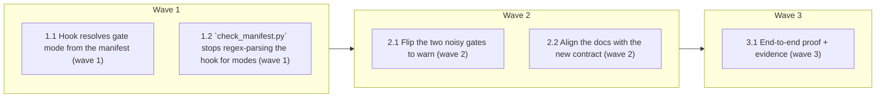

# Restore signal to the commit gate (review items 1→3)

<!-- AT-A-GLANCE:BEGIN (generated — do not edit; refreshed by render_plan.py --summarize) -->
## At a glance

**5 tasks · 3 waves · 12 files · 0/5 done**

| Wave | Task | Title | Files | Done (acceptance) |
|---|---|---|---|---|
| 1 | 1.1 | Hook resolves gate mode from the manifest (wave 1) | hooks/risk-corroboration.sh, tests/hooks/risk-corroboration.test.sh | All pre-existing cases still pass and the four new manifest-mode cases pass; no … |
| 1 | 1.2 | `check_manifest.py` stops regex-parsing the hook for modes (wave 1) | scripts/check_manifest.py, scripts/test_check_manifest.py | pytest green; `grep -c category_mode scripts/check_manifest.py` returns 0. |
| 2 | 2.1 | Flip the two noisy gates to warn (wave 2) | harness-manifest.json, scripts/check_gate_modes_smoke.py, scripts/run-tests.sh | exit 0; `python3 scripts/check_manifest.py` still exit 0. |
| 2 | 2.2 | Align the docs with the new contract (wave 2) | CLAUDE.md, skills/feature-intake/SKILL.md, rules/orchestration.md | doc-truth lint green; each of the four enumerated doc locations (CLAUDE.md row, … |
| 3 | 3.1 | End-to-end proof + evidence (wave 3) | tests/hooks/warn-mode-smoke.test.sh, specs/simplify-gate-surface/SUMMARY.md | both smoke cases pass; `bash scripts/run-tests.sh` reports ALL GREEN; the SUMMAR… |

### Progress
- [ ] 1.1 — Hook resolves gate mode from the manifest (wave 1)
- [ ] 1.2 — `check_manifest.py` stops regex-parsing the hook for modes (wave 1)
- [ ] 2.1 — Flip the two noisy gates to warn (wave 2)
- [ ] 2.2 — Align the docs with the new contract (wave 2)
- [ ] 3.1 — End-to-end proof + evidence (wave 3)
<!-- AT-A-GLANCE:END -->

## 1. Motivation

`workflow-engine` trips on 34 of the last 40 commits (85%) and 41 of 63 specs declare
`Lane: high-risk` (65%) — the commit gate blocks ordinary work and its "high-risk" verdict
carries no information. The documented escape hatch (`RISK_WARN_CATEGORIES=… git commit`)
cannot work: a PreToolUse hook runs before the command with the session environment, so an
inline prefix never reaches it (reproduced against the real hook). And the cleanup that would
fix this was already proposed once and blocked, because `scripts/check_manifest.py`
regex-parses the hook's `case` branches — the checker guards the very thing that needs to
change.

Full analysis, measurements, and the rejected alternatives: `design.md`.

## 2. Non-goals

- No change to `verify_summary.py`, `ci-strict-gate.sh`, or the review-receipt engine.
- No deletion of the `app/`-scoped checks in `commit-quality-gate.sh` (review item 4).
- No merging of `check-untracked-py.sh` / `branch-guard.sh` (item 5).
- No removal of the `weakening-validation` **detector** (item 6) — only its mode moves.
- No deletion of dormant leftovers (item 7).
- No change to `/feature-intake`'s lane **classification** — enforcement only, so the intake
  eval fixtures stay valid (`design.md` §4).
- This spec does not write `.claude/settings.local.json`; `.claude/` is deployed state and
  mutating it needs explicit human confirmation (see §5).

## 3. Success Criteria

| ID | Behavior (observable) | Check (re-runnable) | Expected |
|------|-------------------------|-----------------------|------------|
| SC-1 | The hook's block/warn decision comes from `harness-manifest.json`, and every existing corroboration behavior (block on auth, corroborate on high-risk, no-Lane warn, strict mode) is unchanged | `bash tests/hooks/risk-corroboration.test.sh` | exit 0 |
| SC-2 | `check_manifest.py` no longer regex-parses shell source for gate modes | `grep -q "category_mode" scripts/check_manifest.py` | exit 1 — the source-regex coupling is gone |
| SC-3 | The manifest ↔ hook ↔ settings.json inventory invariant still holds | `python3 scripts/check_manifest.py` | exit 0 |
| SC-4 | `workflow-engine` and `weakening-validation` are declared warn-mode in the manifest; the other seven detectable gates still block | `python3 scripts/check_gate_modes_smoke.py` | exit 0 |
| SC-5 | The hook documents an override path that actually reaches a PreToolUse hook (no inline `VAR=x git commit` advice) | `grep -q "settings.local.json" hooks/risk-corroboration.sh` | exit 0 |
| SC-6 | Docs still match the shipped hook wiring and the new gate modes | `bash scripts/lint-doc-truth.sh` | exit 0 |
| SC-7 | A below-high-risk lane can commit a diff that trips only warn-mode gates | `bash tests/hooks/warn-mode-smoke.test.sh` | exit 0 |

## 4. Tasks

### Task 1.1 — Hook resolves gate mode from the manifest (wave 1)

- **Files:** hooks/risk-corroboration.sh, tests/hooks/risk-corroboration.test.sh
- **Action:** Replace `category_mode()`'s hardcoded `case` body with a lookup against
  `$REPO_DIR/harness-manifest.json` (`.hard_gates.detectable[] | {slug, mode}`), resolved with
  a single `jq` call **once** before the block/warn partition loop rather than per category —
  `jq` is already a hard dependency of this hook. Keep the `RISK_WARN_CATEGORIES` env override
  as the first branch (session-scoped override still wins over the manifest). Fall back to
  `block` for: slug absent from the manifest, `mode` missing, manifest missing/unreadable,
  invalid JSON, or `jq` unavailable — a consumer repo has no manifest and must keep today's
  strict behavior (`design.md` §2, Fallback semantics).
  Then correct the comment at lines 43-45: state that `RISK_WARN_CATEGORIES` must be present in
  the **hook's own process environment** (i.e. `.claude/settings.local.json` → `env`, or an
  exported session var) and that an inline `VAR=x git commit` prefix does **not** reach a
  PreToolUse hook; point the durable path at the manifest `mode` field. Add the same one-line
  pointer to the BLOCKED message so the fix is visible where the block happens.
  Also update the **header comment** (lines 10-12 and 21-22): it still says the `category_mode`
  branches "MUST match [the manifest] exactly" and that modes are "configured in category_mode()
  below" — after this task the manifest is the mode authority and only `add_cat` is mirrored.
  Extend the test file with four cases: manifest `mode: warn` → warn (exit 0) for a
  below-high-risk lane; manifest `mode: block` → BLOCKED; manifest absent → BLOCKED
  (fallback); malformed manifest JSON → BLOCKED (fail-safe).
- **Verify:** `bash tests/hooks/risk-corroboration.test.sh`
- **Done:** All pre-existing cases still pass and the four new manifest-mode cases pass;
  no `case` statement of hardcoded modes remains in the hook.

### Task 1.2 — `check_manifest.py` stops regex-parsing the hook for modes (wave 1)

- **Files:** scripts/check_manifest.py, scripts/test_check_manifest.py
- **Action:** Delete the `hook_modes` regex (`check_manifest.py:85-87`) and the
  `detectable '<slug>' has no category_mode branch` problem branch (lines 100-104). Keep the
  bidirectional `add_cat` ↔ `manifest.detectable` check — that is a real inventory invariant.
  Update the module docstring's check-B description (a detector must exist for every manifest
  gate; modes are no longer mirrored). In the test file, drop `category_mode` from `RC_STUB`
  and remove the test that asserts a missing mode branch is drift; keep and preserve the
  `add_cat`-direction tests (`test_hook_add_cat_absent_from_manifest` and its inverse).
- **Verify:** `python3 -m pytest scripts/test_check_manifest.py -q --no-header --no-cov -p no:cacheprovider`
- **Done:** pytest green; `grep -c category_mode scripts/check_manifest.py` returns 0.

### Task 2.1 — Flip the two noisy gates to warn (wave 2)

- **Files:** harness-manifest.json, scripts/check_gate_modes_smoke.py, scripts/run-tests.sh
- **Action:** Set `"mode": "warn"` on the `workflow-engine` and `weakening-validation` entries
  in `hard_gates.detectable`, and extend each entry's `desc` with the one-line reason and the
  measurement that justifies it (85% firing rate / 1 firing in 40 commits, both a refactor).
  Leave the other seven at `"block"`. Update `hard_gates.__doc__`, which currently says the
  list "must match its add_cat + category_mode exactly" — after Task 1.1 the manifest *is* the
  mode authority and only `add_cat` is mirrored.
  Add `scripts/check_gate_modes_smoke.py`: a stdlib-only script that loads the manifest and
  exits 0 iff those two slugs are `warn` and the other seven are `block` (this is SC-4's
  re-runnable check and pins the loosening against silent re-tightening or drift).
  **Wire it into CI**: `scripts/run-tests.sh` runs only the `tests/*/*.test.sh` globs plus a
  hardcoded `PYTESTS` list, so an unwired script pins nothing — add a line invoking
  `python3 scripts/check_gate_modes_smoke.py` (alongside the existing manifest check step, or
  append it to `PYTESTS`-adjacent L2 section as a plain command). Without this, "pins against
  drift" is false.
- **Verify:** `python3 scripts/check_gate_modes_smoke.py`
- **Done:** exit 0; `python3 scripts/check_manifest.py` still exit 0.

### Task 2.2 — Align the docs with the new contract (wave 2)

- **Files:** CLAUDE.md, skills/feature-intake/SKILL.md, rules/orchestration.md
- **Action:** `CLAUDE.md:52` — rewrite the `risk-corroboration.sh` row: it blocks on the seven
  block-mode gates, warns on the warn-mode ones, and reads per-gate mode from
  `harness-manifest.json` (no longer from a `case` statement in the hook).
  `skills/feature-intake/SKILL.md:90` — keep `workflow-engine` and `weakening-validation` in the
  hard-gate list (classification is unchanged, so fixture `LC-11` stays valid) and add one
  sentence: these two are **warn-mode at commit time** — intake still classifies them
  `high-risk`, but the commit hook no longer blocks on them alone.
  `skills/feature-intake/SKILL.md:29` (HARD-GATE paragraph) — same correction: "blocks a commit
  whose diff trips a hard gate" holds only for **block-mode** gates; say so.
  `rules/orchestration.md:39` — "a declared lane below `high-risk` is **blocked** when the diff
  trips a hard-gate signal" → true only for block-mode gates; warn-mode gates print a note and
  allow. One-sentence fix, same paragraph.
  Note: `lint-doc-truth.sh` checks only path existence and the hook table vs `settings.json` —
  it does **not** read prose, so the enumerated lines above are the real checklist; the lint
  merely proves nothing structural broke.
- **Verify:** `bash scripts/lint-doc-truth.sh`
- **Done:** doc-truth lint green; each of the four enumerated doc locations (CLAUDE.md row,
  SKILL.md:29, SKILL.md:90, orchestration.md:39) states the block/warn split — verified by
  reading those lines, not by the lint alone.

### Task 3.1 — End-to-end proof + evidence (wave 3)

- **Files:** tests/hooks/warn-mode-smoke.test.sh, specs/simplify-gate-surface/SUMMARY.md
- **Action:** Add `tests/hooks/warn-mode-smoke.test.sh`: build a temp repo (via `tests/lib.sh`)
  carrying a **copy of the real `harness-manifest.json`**, stage a diff that trips only
  `weakening-validation` (remove a line containing `raise`) alongside `Lane: normal`, and assert
  the hook exits 0 with `warn-mode` in its output — i.e. the exact commit from the reported
  incident now goes through. Add a second case where the staged diff also touches `hooks/`
  (`high-blast`, still `block`) and assert exit 2, proving the loosening is scoped.
  Then run the full suite (`bash scripts/run-tests.sh`) and record every check actually run in
  the SUMMARY `### Verify` table with its `Criterion` column mapped to SC-1…SC-7.
  **Activation (human-confirmed, not automated):** the hook that actually gates commits in this
  repo is the deployed copy `.claude/hooks/risk-corroboration.sh`
  (`.claude/settings.json:41`), not the source in `hooks/`. This task ends by asking the human
  to run `scripts/deploy-harness.sh` (mutating `.claude/` requires explicit confirmation) and
  recording the outcome in the Status Log. Until that re-deploy happens, the incident this spec
  fixes still reproduces — merging alone does not activate the change.
- **Verify:** `bash tests/hooks/warn-mode-smoke.test.sh`
- **Done:** both smoke cases pass; `bash scripts/run-tests.sh` reports ALL GREEN; the SUMMARY
  `### Verify` table covers every SC with a re-runnable, pipe-free command; the activation
  ask is surfaced to the human and its outcome (deployed / deferred) logged in the Status Log.

## 5. Risks

| Risk | Mitigation |
|---|---|
| Loosening hides a genuinely risky commit | `warn` still detects and prints to stderr; it only stops blocking. The seven other gates, `ci-strict-gate.sh`, and `branch-isolation-guard.sh` are untouched. Re-tightening is one JSON field. |
| This PR trips `ci-strict-gate.sh` itself (touches `hooks/`) | Intended. The PR carries a changed `Lane: high-risk` SUMMARY with a machine-verified `### Verify` row — produced by Task 3.1. |
| Fail-open regression: an empty manifest lookup silently un-blocks a gate | Default to `block` on every failure path (absent slug, missing `mode`, missing/unreadable/invalid manifest, no `jq`), pinned by two dedicated tests in Task 1.1. |
| Consumer repos behave differently from this one (no manifest ⇒ everything blocks) | Deliberate, documented in `design.md` §2 — the 85% firing rate is a meta-repo artifact, so consumers keep the strict default. |
| `.claude/settings.local.json` is the right place for a session override, but `.claude/` is deployed state | This spec only *documents* that path. Writing the file is a separate, human-confirmed action, never automated here. |
| Committing this work hits the gate mid-flight (the diff touches `hooks/`, which stays `block`) | Expected: `SUMMARY.md` declares `Lane: high-risk`, which corroborates. |
| Wave-boundary commits deadlock on `commit-quality-gate.sh` Check 1.6: any commit staging `specs/simplify-gate-surface/SUMMARY.md` is denied while its `### Verify` table is all placeholders (`verify_summary.py --lane` currently exits 1 with 8 missing) | Do **not** stage `SUMMARY.md` in wave-1/2 commits (append Deviations to it but leave it unstaged), or fill a real Verify row first. Task 3.1 fills the table and clears the gate. |
| The change merges but never activates: the live gate is the deployed copy in `.claude/hooks/`, which this spec must not mutate autonomously | Explicit activation step in Task 3.1 — human-confirmed `deploy-harness.sh` run, outcome logged. |

## 6. Status Log

- 2026-07-23 — Spec created (design + plan) from the gate review. Status: `proposed`,
  awaiting go-ahead before Wave 1.
- 2026-07-23 — Gap review against the live codebase closed 4 holes: (1) activation step added
  to Task 3.1 — the live gate is `.claude/hooks/risk-corroboration.sh`, so merging without a
  human-confirmed re-deploy changes nothing; (2) `check_gate_modes_smoke.py` wired into
  `scripts/run-tests.sh` (Task 2.1) — CI never ran it, so it pinned nothing; (3) Task 2.2
  extended to `rules/orchestration.md:39`, `SKILL.md:29`, and the hook's header comment
  (Task 1.1), all of which still claim unconditional blocking; noted that `lint-doc-truth.sh`
  cannot verify prose claims; (4) Check-1.6 wave-boundary deadlock risk recorded (don't stage
  SUMMARY.md before Task 3.1).
