# Simplify the hook surface

<!-- AT-A-GLANCE:BEGIN (generated — do not edit; refreshed by render_plan.py --summarize) -->
## At a glance

**13 tasks · 6 waves · 84 files · 13/13 done**

| Wave | Task | Title | Files | Done (acceptance) |
|---|---|---|---|---|
| 1 | 1.1 | Build commit-gate.sh with non-risk checks and profiles (wave 1) | hooks/commit-gate.sh, tests/hooks/commit-gate.test.sh, tests/hooks/commit-gate-evidence.test.sh, tests/lib.sh | `bash tests/hooks/commit-gate.test.sh` and `bash tests/hooks/commit-gate-evidenc… |
| 1 | 1.2 | Branch-isolation fast path without python3 (wave 1) | hooks/branch-isolation-guard.sh, tests/hooks/branch-isolation-guard.test.sh | All pre-existing cases plus the new no-python3 cases pass (exit 0). |
| 1 | 1.3 | session-knowledge emits an INDEX pointer (wave 1) | hooks/session-knowledge.sh, tests/hooks/session-knowledge.test.sh | The test file exits 0. On this repo, `CLAUDE_PROJECT_DIR=$PWD bash hooks/session… |
| 1 | 1.4 | Move the AT-A-GLANCE refresh from the hook to the skills (wave 1) | skills/writing-plans/SKILL.md, skills/visual-planner/SKILL.md, rules/wave-parallelism.md, rules/plan-format.md | All four files contain `--summarize`, and `rules/plan-format.md` contains neithe… |
| 2 | 2.1 | Port the risk-corroboration tests to commit-gate (wave 2) | tests/hooks/commit-gate-risk.test.sh, hooks/commit-gate.sh | Exit 0. The case count is at least the sum of the ported source cases, with per-… |
| 3 | 3.1 | Cut over: register the new surface, delete the old hooks (wave 3) | settings.json, hooks/pre-bash-dispatch.sh, hooks/check-untracked-py.sh, hooks/commit-quality-gate.sh, hooks/risk-corroboration.sh, hooks/branch-guard.sh, hooks/ruff-on-edit.sh, hooks/render-plan-on-write.sh, hooks/scope-gate.sh, hooks/state-breadcrumb.sh, hooks/blast-radius-check.sh, hooks/lib/lane.sh, hooks/lib/gate-modes.default.sh, tests/hooks/pre-bash-dispatch.test.sh, tests/hooks/check-untracked-py.test.sh, tests/hooks/commit-quality-gate.test.sh, tests/hooks/risk-corroboration.test.sh, tests/hooks/branch-guard.test.sh, tests/hooks/ruff-on-edit.test.sh, tests/hooks/render-plan-on-write.test.sh, tests/hooks/scope-gate.test.sh, tests/hooks/state-breadcrumb.test.sh, tests/hooks/blast-radius-check.test.sh, tests/hooks/warn-mode-smoke.test.sh, tests/hooks/gate-integration.test.sh, tests/hooks/codex-edit-hooks.test.sh, tests/hooks/repo-root-resolution.test.sh, tests/hooks/spec-prefix-compat.test.sh, tests/hooks/normalize-tool-input.test.sh | - SC-1 passes. - `bash tests/hooks/repo-root-resolution.test.sh`, `bash tests/ho… |
| 4 | 4.1 | Retarget the manifest and CI checkers to commit-gate (wave 4) | harness-manifest.json, scripts/check_manifest.py, scripts/test_check_manifest.py, scripts/check_gate_modes_smoke.py, scripts/check_review_receipt.py, tests/scripts/workflow-engine-regex-parity.test.sh, tests/scripts/consumer-subset.test.sh, tests/scripts/settings-merge.test.sh, tests/scripts/settings-wiring.test.sh, tests/scripts/install-gitignore.test.sh, specs/codex-support/neutralization-inventory.json | SC-7 and SC-13 pass; `git grep -n -e ruff-on-edit -e render-plan-on-write -e sco… |
| 5 | 5.1 | Regenerate the Codex adapter and retire the unused evidence (wave 5) | scripts/render_codex_adapter.py, scripts/test_render_codex_adapter.py, adapters/codex/plugin/hooks/hooks.json, specs/codex-support/capability-matrix.json, scripts/capture_codex_capabilities.sh, tests/scripts/codex-capability-probe.test.sh | SC-9 and SC-10 pass, `python3 scripts/check_codex_capabilities.py --require-evid… |
| 5 | 5.2 | Install and deploy `--profile` (wave 5) | scripts/deploy-harness.sh, scripts/install-harness.sh, tests/scripts/deploy-profile.test.sh | Exit 0. |
| 6 | 6.1 | Top-level docs, templates, and the CLAUDE.md hook table (wave 6) | CLAUDE.md, README.md, CHANGELOG.md, agents/PROJECT.md, templates/SUMMARY.template.md, templates/ESCALATIONS.template.md, templates/structure/specs-STATE.md, templates/structure/specs-README.md, scripts/install-harness.sh | SC-8 passes. `git grep -n -e ruff-on-edit -e render-plan-on-write -e scope-gate … |
| 6 | 6.2 | Rules, skills, and prompts prose (wave 6) | rules/orchestration.md, rules/auto-correct-scope.md, skills/README.md, skills/correctness-review/correctness-scorer-prompt.md, skills/compound/subagents/solution-extractor-prompt.md, skills/feature-intake/tests/lane-classification-cases.md | The Verify command exits 1 (no matches). |
| 6 | 6.3 | Script comments and superseded notes in the knowledge base (wave 6) | scripts/ci-strict-gate.sh, scripts/verify_summary.py, scripts/harness-audit.sh, scripts/deploy-harness.sh, docs/solutions/critical-patterns.md, docs/solutions/INDEX.md, docs/solutions/harness, docs/solutions/harness-bootstrap | The Verify command exits 1, and this command exits 0: `python3 -c "import pathli… |
| 6 | 6.4 | Sweep removed-hook names from the new hook and its tests (wave 6) | hooks/commit-gate.sh, tests/hooks/commit-gate.test.sh, tests/hooks/commit-gate-evidence.test.sh, tests/hooks/commit-gate-risk.test.sh, tests/hooks/command-matching.test.sh, tests/lib.sh | The Verify command exits 1, and `bash tests/hooks/commit-gate.test.sh`, `bash te… |

```mermaid
flowchart LR
  subgraph W0[Wave 1]
    T1_1["1.1 Build commit-gate.sh with non-risk checks and profiles (wave 1)"]
    T1_2["1.2 Branch-isolation fast path without python3 (wave 1)"]
    T1_3["1.3 session-knowledge emits an INDEX pointer (wave 1)"]
    T1_4["1.4 Move the AT-A-GLANCE refresh from the hook to the skills (wave 1)"]
  end
  subgraph W1[Wave 2]
    T2_1["2.1 Port the risk-corroboration tests to commit-gate (wave 2)"]
  end
  subgraph W2[Wave 3]
    T3_1["3.1 Cut over: register the new surface, delete the old hooks (wave 3)"]
  end
  subgraph W3[Wave 4]
    T4_1["4.1 Retarget the manifest and CI checkers to commit-gate (wave 4)"]
  end
  subgraph W4[Wave 5]
    T5_1["5.1 Regenerate the Codex adapter and retire the unused evidence (wave 5)"]
    T5_2["5.2 Install and deploy `--profile` (wave 5)"]
  end
  subgraph W5[Wave 6]
    T6_1["6.1 Top-level docs, templates, and the CLAUDE.md hook table (wave 6)"]
    T6_2["6.2 Rules, skills, and prompts prose (wave 6)"]
    T6_3["6.3 Script comments and superseded notes in the knowledge base (wave 6)"]
    T6_4["6.4 Sweep removed-hook names from the new hook and its tests (wave 6)"]
  end
  W0 --> W1
  W1 --> W2
  W2 --> W3
  W3 --> W4
  W4 --> W5
```

### Progress
- [x] 1.1 — Build commit-gate.sh with non-risk checks and profiles (wave 1)
- [x] 1.2 — Branch-isolation fast path without python3 (wave 1)
- [x] 1.3 — session-knowledge emits an INDEX pointer (wave 1)
- [x] 1.4 — Move the AT-A-GLANCE refresh from the hook to the skills (wave 1)
- [x] 2.1 — Port the risk-corroboration tests to commit-gate (wave 2)
- [x] 3.1 — Cut over: register the new surface, delete the old hooks (wave 3)
- [x] 4.1 — Retarget the manifest and CI checkers to commit-gate (wave 4)
- [x] 5.1 — Regenerate the Codex adapter and retire the unused evidence (wave 5)
- [x] 5.2 — Install and deploy `--profile` (wave 5)
- [x] 6.1 — Top-level docs, templates, and the CLAUDE.md hook table (wave 6)
- [x] 6.2 — Rules, skills, and prompts prose (wave 6)
- [x] 6.3 — Script comments and superseded notes in the knowledge base (wave 6)
- [x] 6.4 — Sweep removed-hook names from the new hook and its tests (wave 6)
<!-- AT-A-GLANCE:END -->

## 1. Motivation

The harness registers 8 hook commands across 5 events. Each Edit/Write pays for a PreToolUse hook
plus three parallel PostToolUse hooks, and every one of them spawns a Python normalizer. A commit
fans out to 4 sub-hooks, and each of them re-parses the payload and re-diffs the index.

Half of those hooks are nudges or conveniences, not gates. In consumer repos, several clash with
what the repo already does: `ruff format` rewrites files under the repo's own formatter, and
Python-only gates run in non-Python repos.

Target: 3 registered hooks (`commit-gate.sh`, `branch-isolation-guard.sh`, `session-knowledge.sh`)
and install profiles `minimal | standard | strict`. Every important gate stays.

- Design, approach A, approved by the user 2026-09-29: `specs/simplify-hook-surface/design.md`
- Research: `specs/simplify-hook-surface/research-brief.md` (design corrections D1–D7 are folded
  into the tasks below)

## Global Constraints

- bash 3.2 compatible: no `declare -A`, no `mapfile`, no `grep -P`, no GNU-only sed. `timeout` is
  not installed on macOS.
- Hook repo root is `REPO_DIR="${CLAUDE_PROJECT_DIR:-$(git rev-parse --show-toplevel 2>/dev/null)}"`.
  Never derive it from the script's own directory; the `scripts/check-hook-root-source.sh`
  ratchet enforces this.
- Gate modes are read only from `git show :harness-manifest.json`, else
  `hooks/lib/gate-modes.default.sh` (invariant SC-8 of the prior spec). Never read a worktree or
  `.claude/` policy file.
- A hook blocks only with exit 2 (stderr message), or with stdout
  `permissionDecision:"deny"` JSON and exit 0. Never exit 1: it is non-blocking in Claude Code.
- The fail-closed behaviors stay: an unclassifiable Bash payload, or a missing
  `lib/git-command.sh` or `lib/lane.sh`, blocks with exit 2.
- These literal strings must appear byte-identical in `hooks/commit-gate.sh`, because the parity
  tests grep for them:
  - every `add_cat "<slug>"` call;
  - `git show :harness-manifest.json`;
  - the workflow-engine regexes `'^skills/[^/]+/SKILL\.md$|^skills/[^/]+/.*prompt[^/]*\.md$|^agents/[^/]+\.md$|^rules/[^/]+\.md$'` and `'(^|/)(README\.md|[A-Za-z0-9_-]+\.template\.md)$'`.
- The root `settings.json` keeps the commit-gate command bare (`hooks/commit-gate.sh`, no
  arguments). `lint-doc-truth.sh` runs `[ -f "$cmd" ]` on every whole command. Only
  `derive_settings` appends `--profile 
`.
- Do not modify, deploy into, or delete anything under the local `.claude/` directory. Tests that
  read `.claude/` must pass whether or not it is re-deployed.
- Stage and commit in separate Bash calls (`hooks/check-untracked-py.sh` scans the whole command
  string).
- In new or moved content, removed-hook names may appear only in the three absence-assertion tests
  (existing files keep them until the task that owns them rewrites them):
  `tests/scripts/settings-merge.test.sh`, `tests/scripts/deploy-profile.test.sh`, and
  `tests/scripts/codex-capability-probe.test.sh`. Code moved into `hooks/commit-gate.sh`, and ported
  test cases, describe the check by name (`check_secrets`, `check_risk`, …), never by the old hook
  file. Per-source case counts go in the task report, not in the test file.
- Port test cases; do not drop them. Retire a case only when the behavior it covers is one of the
  demotions in design §2.5, and name it in SUMMARY `### Deviations` together with its source file.

## 2. Non-goals

- Per-profile Codex adapters. Codex receives the standard set.
- Changing any gate's detection regexes, messages, or block/warn modes.
- Cleaning up the three stale `status: active` plans.
- Adding `MultiEdit` to the branch-isolation matcher. This is a pre-existing gap and goes to the
  backlog.
- Re-deploying the local `.claude/`. That is the user's call after merge.

## 3. Success Criteria

| ID | Behavior (observable) | Check (re-runnable) | Expected |
|------|-------------------------|-----------------------|------------|
| SC-1 | Root settings register exactly 3 commands under exactly PreToolUse and SessionStart | `python3 -c "import json;h=json.load(open('settings.json'))['hooks'];assert sorted(h)==['PreToolUse','SessionStart'],sorted(h);assert sum(len(g['hooks']) for v in h.values() for g in v)==3"` | exit 0 |
| SC-2 | A Claude Write/Edit payload is decided by branch-isolation-guard with python3 absent from PATH; apply_patch still uses the normalizer and fails closed on main | `bash tests/hooks/branch-isolation-guard.test.sh` | exit 0 |
| SC-3 | commit-gate: fast non-git exit, fail-closed parse, secrets/.env, escalations, lane evidence, run-state, plan-scope warn, app gates, untracked-py (strict), per-profile check selection | `bash tests/hooks/commit-gate.test.sh` | exit 0 |
| SC-4 | commit-gate risk corroboration keeps every prior outcome, including index-only gate modes and embedded-default parity | `bash tests/hooks/commit-gate-risk.test.sh` | exit 0 |
| SC-5 | Deploy and install honor `--profile`, persist `.claude/.harness-profile`, reuse it on re-sync, reject an unknown profile before any write, and drop emptied event keys | `bash tests/scripts/deploy-profile.test.sh` | exit 0 |
| SC-6 | Settings merge keeps foreign consumer hooks and prunes the removed harness hooks on re-sync | `bash tests/scripts/settings-merge.test.sh` | exit 0 |
| SC-7 | The manifest inventory, `hook_profiles`, and `add_cat` set match the disk and settings | `python3 scripts/check_manifest.py` | exit 0 |
| SC-8 | The CLAUDE.md hook table and doc paths match the disk and settings | `bash scripts/lint-doc-truth.sh` | exit 0 |
| SC-9 | The committed Codex hooks.json equals the adapter rendered from the new settings | `python3 -m pytest -q scripts/test_render_codex_adapter.py` | exit 0 |
| SC-10 | The Codex SessionEnd probe no longer depends on a harness hook, and the probe suite passes | `bash tests/scripts/codex-capability-probe.test.sh` | exit 0 |
| SC-11 | session-knowledge emits an INDEX pointer line instead of INDEX rows, and keeps the 40-line critical-patterns cap | `bash tests/hooks/session-knowledge.test.sh` | exit 0 |
| SC-12 | No live file outside the historical set names a removed hook | `git grep -n -e ruff-on-edit -e render-plan-on-write -e scope-gate -e state-breadcrumb -e blast-radius-check -e branch-guard.sh -e check-untracked-py -e commit-quality-gate -e risk-corroboration.sh -e pre-bash-dispatch -- . :!specs :!docs/research :!docs/harness-experimental :!docs/solutions :!docs/harness-gap-closure-plan.md :!docs/harness-v03-plan-overview.md :!research-loop.md :!evals :!CHANGELOG.md :!tests/scripts/settings-merge.test.sh :!tests/scripts/deploy-profile.test.sh :!tests/scripts/codex-capability-probe.test.sh` | exit 1 — no matches |
| SC-13 | The runtime-neutral scan roots all exist and the scan is clean | `python3 scripts/check_runtime_neutral_sources.py --root .` | exit 0 |
| SC-14 | Plan authoring and the wave boundary both run `render_plan.py --summarize` | `python3 -c "import pathlib as p;fs=['skills/writing-plans/SKILL.md','rules/wave-parallelism.md','rules/plan-format.md','skills/visual-planner/SKILL.md'];m=[f for f in fs if '--summarize' not in p.Path(f).read_text()];assert not m,m"` | exit 0 |
| SC-15 | commit-gate escalation, lane-evidence, and run-state checks keep their prior outcomes | `bash tests/hooks/commit-gate-evidence.test.sh` | exit 0 |

## 4. Tasks

### Task 1.1 — Build commit-gate.sh with non-risk checks and profiles (wave 1)

- **Files:** hooks/commit-gate.sh, tests/hooks/commit-gate.test.sh, tests/hooks/commit-gate-evidence.test.sh, tests/lib.sh
- **Action:**
  - **Test helper first.** Add `run_hook_args <repo> <hook.sh> <json> <arg>... -- [VAR=val ...]` to
    `tests/lib.sh`: same CWD and merged-stream semantics as `run_hook`, but it passes the hook
    arguments. Rewrite the stale header and comments that name `check-untracked-py` and the
    `git -C "$(dirname $0)"` root.
  - **Port the tests.** Write `tests/hooks/commit-gate.test.sh` first. Port, as `commit-gate.sh`
    cases, every case from:
    - `tests/hooks/commit-quality-gate.test.sh`
    - `tests/hooks/pre-bash-dispatch.test.sh`
    - `tests/hooks/check-untracked-py.test.sh` (under `--profile strict`)
    - `tests/hooks/gate-integration.test.sh`
    - the commit-quality-gate cases of `tests/hooks/repo-root-resolution.test.sh` and of
      `tests/hooks/spec-prefix-compat.test.sh`
    - the matching-logic cases of `tests/hooks/blast-radius-check.test.sh`, as commit-time
      `check_plan_scope` warns plus the `BLAST_RADIUS_STRICT=1` block

    Add profile cases:
    - `minimal` blocks a secret but allows a commit whose SUMMARY lacks lane evidence.
    - `standard` does not deny an untracked `.py`.
    - `strict` denies an untracked `.py` on commit and on push.
    - An unknown `--profile` warns and behaves as `standard`.
    - With python3 absent from PATH, the secrets check still blocks.
  - **Build the hook.** Implement `hooks/commit-gate.sh` per design §2.1:
    - one payload parse, reusing the `pre-bash-dispatch.sh` jq fast path and its normalizer
      fallback;
    - `hook_cmd_is_git_commit_or_push`;
    - `--profile` parsing;
    - one computation of `STAGED_PATHS`, `SPEC_SLUGS`, `LANE_VAL`, `VERIFY_SUMMARY`;
    - check functions whose bodies are moved verbatim from the source hooks, with the profile
      gating from the design §2.1 table.

    Include `check_risk` now, moved verbatim from `hooks/risk-corroboration.sh`, so the file is
    complete. Its dedicated tests land in Task 2.1. Do not delete or unregister any old hook in
    this task. Put the escalation, lane-evidence (Check 1.6), and run-state (Check 1.7) cases in
    `tests/hooks/commit-gate-evidence.test.sh` and every other case in `tests/hooks/commit-gate.test.sh`,
    so each file stays under the 60 s Verify budget.
- **Verify:** `bash tests/hooks/commit-gate.test.sh`
- **Done:** `bash tests/hooks/commit-gate.test.sh` and `bash tests/hooks/commit-gate-evidence.test.sh` each exit 0. Their combined case count is at least the sum of the ported source cases,
  minus the named retirements; the per-source counts are recorded in the task report.
- **Criteria:** SC-3, SC-15
- **Interfaces:** Consumes hooks/lib/git-command.sh, hooks/lib/lane.sh, hooks/lib/gate-modes.default.sh, hooks/lib/normalize-tool-input.py, scripts/verify_summary.py. Produces `hooks/commit-gate.sh` (CLI: stdin hook JSON, optional `--profile minimal|standard|strict`), `run_hook_args` in `tests/lib.sh`.

### Task 1.2 — Branch-isolation fast path without python3 (wave 1)

- **Files:** hooks/branch-isolation-guard.sh, tests/hooks/branch-isolation-guard.test.sh
- **Action:** Add the failing tests first:
  - A Claude `Write` payload and an `Edit` payload for a non-specs path on `main` are denied, and
    a `specs/x/SUMMARY.md` path on `main` is allowed, with PATH set to a directory holding
    symlinks to `bash`, `git`, `jq`, `dirname`, `cat`, `paste`, `date`, `mkdir`, plus any other
    binary the new bash relativization calls (for example `basename`, `sed`), and no python3.
  - An `apply_patch` payload on `main` with python3 absent still denies (fail-closed).

  Then implement the design §2.2 fast path. When `tool_name` is `Write` or `Edit` and
  `.tool_input.file_path` is a non-empty single-line string, derive the repo-relative path in
  bash:
  - Relativize against `ROOT`. Resolve an existing parent with `cd -P`, following the
    normalizer's `outside-root` and `repository-root-path` rules.
  - Set `STATUS=known`, `TOOL_CLASS=edit`.
  - If relativizing fails, fall through to the normalizer.

  Keep every other line of the decision logic. Update the header comment that cites
  `branch-guard.sh` so it names `commit-gate.sh` instead.
- **Verify:** `bash tests/hooks/branch-isolation-guard.test.sh`
- **Done:** All pre-existing cases plus the new no-python3 cases pass (exit 0).
- **Criteria:** SC-2
- **Interfaces:** Consumes the Claude PreToolUse Write/Edit payload and hooks/lib/normalize-tool-input.py (fallback only). Produces `hooks/branch-isolation-guard.sh` with an unchanged deny/allow contract.

### Task 1.3 — session-knowledge emits an INDEX pointer (wave 1)

- **Files:** hooks/session-knowledge.sh, tests/hooks/session-knowledge.test.sh
- **Action:** Update the tests first:
  - The cases asserting INDEX row text (`Real entry`, `my-entry`) instead assert the pointer line
    `docs/solutions/INDEX.md — <N> entries`, where N is the data-row count the hook already
    computes.
  - Rewrite the 30-line truncation case to assert that no INDEX table row appears.
  - Keep the 40-line critical-patterns cap case unchanged (research D1).

  Then replace `_index_section=$(head -n 30 "$INDEX")` with that single pointer line. Remove the
  header comment references to `state-breadcrumb.sh` and `scope-gate.sh`.
- **Verify:** `bash tests/hooks/session-knowledge.test.sh`
- **Done:** The test file exits 0. On this repo, `CLAUDE_PROJECT_DIR=$PWD bash hooks/session-knowledge.sh` prints under 6000 bytes (recorded in the task report).
- **Criteria:** SC-11
- **Interfaces:** Consumes docs/solutions/INDEX.md, docs/solutions/critical-patterns.md, runtime/run_state.py. Produces `hooks/session-knowledge.sh` additionalContext JSON.

### Task 1.4 — Move the AT-A-GLANCE refresh from the hook to the skills (wave 1)

- **Files:** skills/writing-plans/SKILL.md, skills/visual-planner/SKILL.md, rules/wave-parallelism.md, rules/plan-format.md
- **Action:** Research D7. Make these edits:
  - In `skills/writing-plans/SKILL.md` step 5, replace "The write hook renders the plain `PLAN.html`" with an explicit step: run `python3 .claude/skills/visual-planner/render_plan.py specs/<slug>/PLAN.md --summarize` after saving the plan.
  - In `rules/wave-parallelism.md`, after the Status Log append (step 2), add a step that runs the same `--summarize` command, so the `### Progress` checklist stays current.
  - In `skills/visual-planner/SKILL.md`, document the `--summarize` flag.
  - `subagent-driven-development` gets the wave-boundary step through `rules/wave-parallelism.md`,
    which `skills/subagent-driven-development/SKILL.md:38` already tells it to read; no SKILL.md
    edit is needed there. State this in the task report for the context-propagation audit.
  - In `rules/plan-format.md`:
    - Replace every mention of `render-plan-on-write.sh` and `blast-radius-check.sh` with the new owners: `--summarize` is invoked by writing-plans and at each wave boundary; the Files set is checked by `hooks/commit-gate.sh` at commit time.
    - Keep the rule's `paths:` frontmatter unchanged.
- **Verify:** `python3 -c "import pathlib as p;fs=['skills/writing-plans/SKILL.md','rules/wave-parallelism.md','rules/plan-format.md','skills/visual-planner/SKILL.md'];m=[f for f in fs if '--summarize' not in p.Path(f).read_text()];assert not m,m"`
- **Done:** All four files contain `--summarize`, and `rules/plan-format.md` contains neither `render-plan-on-write` nor `blast-radius-check`.
- **Criteria:** SC-14
- **Interfaces:** Consumes skills/visual-planner/render_plan.py --summarize (existing). Produces `skills/writing-plans/SKILL.md` and `rules/wave-parallelism.md` steps that invoke it.

### Task 2.1 — Port the risk-corroboration tests to commit-gate (wave 2)

- **Files:** tests/hooks/commit-gate-risk.test.sh, hooks/commit-gate.sh
- **Action:** Port into `tests/hooks/commit-gate-risk.test.sh`, as `commit-gate.sh` cases under the default profile (unless the case needs strict), every case from:
  - `tests/hooks/risk-corroboration.test.sh`: lane vs diff, strict, `RISK_WARN_CATEGORIES`, regex precision, workflow-engine warn, SC-8 index-only modes, diff-size note, active-plan fallback
  - `tests/hooks/warn-mode-smoke.test.sh`
  - the risk cases of `tests/hooks/repo-root-resolution.test.sh` and `tests/hooks/spec-prefix-compat.test.sh`

  Add one case asserting that `--profile minimal` skips risk corroboration, and one asserting that `--profile strict` blocks a tripped category with no declared Lane. Fix `hooks/commit-gate.sh` only where a ported case exposes a divergence from `hooks/risk-corroboration.sh`.
- **Verify:** `bash tests/hooks/commit-gate-risk.test.sh`
- **Done:** Exit 0. The case count is at least the sum of the ported source cases, with per-source counts in the task report.
- **Criteria:** SC-4
- **Interfaces:** Consumes `hooks/commit-gate.sh` from Task 1.1 and harness-manifest.json (index copy). Produces `tests/hooks/commit-gate-risk.test.sh`.

### Task 3.1 — Cut over: register the new surface, delete the old hooks (wave 3)

- **Files:** settings.json, hooks/pre-bash-dispatch.sh, hooks/check-untracked-py.sh, hooks/commit-quality-gate.sh, hooks/risk-corroboration.sh, hooks/branch-guard.sh, hooks/ruff-on-edit.sh, hooks/render-plan-on-write.sh, hooks/scope-gate.sh, hooks/state-breadcrumb.sh, hooks/blast-radius-check.sh, hooks/lib/lane.sh, hooks/lib/gate-modes.default.sh, tests/hooks/pre-bash-dispatch.test.sh, tests/hooks/check-untracked-py.test.sh, tests/hooks/commit-quality-gate.test.sh, tests/hooks/risk-corroboration.test.sh, tests/hooks/branch-guard.test.sh, tests/hooks/ruff-on-edit.test.sh, tests/hooks/render-plan-on-write.test.sh, tests/hooks/scope-gate.test.sh, tests/hooks/state-breadcrumb.test.sh, tests/hooks/blast-radius-check.test.sh, tests/hooks/warn-mode-smoke.test.sh, tests/hooks/gate-integration.test.sh, tests/hooks/codex-edit-hooks.test.sh, tests/hooks/repo-root-resolution.test.sh, tests/hooks/spec-prefix-compat.test.sh, tests/hooks/normalize-tool-input.test.sh
- **Action:**
  - **Registration.** Rewrite `settings.json` hooks to exactly:
    - PreToolUse `Bash` → `hooks/commit-gate.sh`
    - PreToolUse `Write|Edit` → `hooks/branch-isolation-guard.sh`
    - SessionStart → `hooks/session-knowledge.sh`

    Keep the existing statusMessage style.
  - **Deletions.**
    - Delete the ten old hook files and their dedicated test files listed in Files.
    - Delete `tests/hooks/warn-mode-smoke.test.sh`, `tests/hooks/gate-integration.test.sh`, and `tests/hooks/codex-edit-hooks.test.sh`, whose cases were ported in 1.1/2.1 or are covered by the apply_patch cases in `branch-isolation-guard.test.sh`.
  - **Mixed test files.** In `repo-root-resolution.test.sh` and `spec-prefix-compat.test.sh`, remove the cases for deleted hooks (their commit-gate equivalents were ported in 1.1/2.1) and keep the session-knowledge and branch-isolation cases.
  - **Normalizer test.** In `normalize-tool-input.test.sh`, set the consumer-hook loop list to `branch-isolation-guard.sh commit-gate.sh`.
  - **Libs.**
    - In `hooks/lib/lane.sh`, remove `hook_lib_intake_in_progress` and update the header to name `commit-gate.sh` as the consumer.
    - In `hooks/lib/gate-modes.default.sh`, retarget the comments from `risk-corroboration.sh` and `tests/hooks/risk-corroboration.test.sh`
      to `hooks/commit-gate.sh` and `tests/hooks/commit-gate-risk.test.sh`.
- **Verify:** `python3 -c "import json;h=json.load(open('settings.json'))['hooks'];assert sorted(h)==['PreToolUse','SessionStart'],sorted(h);assert sum(len(g['hooks']) for v in h.values() for g in v)==3"`
- **Done:**
  - SC-1 passes.
  - `bash tests/hooks/repo-root-resolution.test.sh`, `bash tests/hooks/spec-prefix-compat.test.sh`, and `bash tests/hooks/normalize-tool-input.test.sh` each exit 0.
  - `ls hooks/*.sh` lists exactly `branch-isolation-guard.sh`, `commit-gate.sh`, `session-knowledge.sh`.
  - `git grep -n -e ruff-on-edit -e render-plan-on-write -e scope-gate -e state-breadcrumb -e blast-radius-check -e branch-guard.sh -e check-untracked-py -e commit-quality-gate -e risk-corroboration.sh -e pre-bash-dispatch -- hooks/lib tests/hooks/repo-root-resolution.test.sh tests/hooks/spec-prefix-compat.test.sh tests/hooks/normalize-tool-input.test.sh` exits 1 (rewrite all comments and loop lists, not only headers).
- **Criteria:** SC-1
- **Interfaces:** Consumes `hooks/commit-gate.sh` (Tasks 1.1/2.1). Produces the 3-command `settings.json` hook registration.

### Task 4.1 — Retarget the manifest and CI checkers to commit-gate (wave 4)

- **Files:** harness-manifest.json, scripts/check_manifest.py, scripts/test_check_manifest.py, scripts/check_gate_modes_smoke.py, scripts/check_review_receipt.py, tests/scripts/workflow-engine-regex-parity.test.sh, tests/scripts/consumer-subset.test.sh, tests/scripts/settings-merge.test.sh, tests/scripts/settings-wiring.test.sh, tests/scripts/install-gitignore.test.sh, specs/codex-support/neutralization-inventory.json
- **Action:**
  - **`harness-manifest.json`**
    - Set the `hooks` array to three `wired: true` rows.
    - Add `hook_profiles` per design §3, listing hooks by file name with the `.sh` suffix
      (`"commit-gate.sh"`), the same form as the `hooks` inventory rows.
    - Point the `hook-input-normalization` consumers at `hooks/branch-isolation-guard.sh`, `hooks/commit-gate.sh`, and the surviving tests.
    - Point the `hard-gate-vocabulary` and `artifact-schema-summary` consumers at `hooks/commit-gate.sh`.
    - Update the `__doc__` strings.
  - **`check_manifest.py`**
    - Check B reads `hooks/commit-gate.sh`.
    - Add a check that `hook_profiles` has exactly `default`, `minimal`, `standard`, `strict`, and that every listed hook exists in the `hooks` inventory.
    - Update the fixtures in `test_check_manifest.py`.
  - **Retarget to `commit-gate.sh`:**
    - the `workflow-engine-regex-parity` `HOOK` path;
    - the `consumer-subset` `cmp`/`grep` checks;
    - the docstrings and comments in `check_gate_modes_smoke.py` and `check_review_receipt.py:47`.
  - **Rewrite `settings-merge.test.sh`**, currently asserting `ruff-on-edit` and `pre-bash-dispatch` counts, to assert:
    - commit-gate registered once;
    - removed hooks count 0 after re-sync;
    - foreign hooks, foreign keys, and invalid-JSON backup preserved.
  - **`settings-wiring.test.sh`:** compare derived commands after stripping one trailing ` --profile 
` (research D4).
  - **`install-gitignore.test.sh`:** retitle its header comments; it asserts only the `.gitignore` append.
  - **`neutralization-inventory.json` `scan_roots`:** replace the removed hook and test paths with `hooks/commit-gate.sh`, `tests/hooks/commit-gate.test.sh`, `tests/hooks/commit-gate-evidence.test.sh`, `tests/hooks/commit-gate-risk.test.sh` (research D2).
- **Verify:** `python3 scripts/check_manifest.py`
- **Done:** SC-7 and SC-13 pass; `git grep -n -e ruff-on-edit -e render-plan-on-write -e scope-gate -e state-breadcrumb -e blast-radius-check -e branch-guard.sh -e check-untracked-py -e commit-quality-gate -e risk-corroboration.sh -e pre-bash-dispatch -- harness-manifest.json scripts/check_manifest.py scripts/test_check_manifest.py scripts/check_gate_modes_smoke.py scripts/check_review_receipt.py tests/scripts/workflow-engine-regex-parity.test.sh tests/scripts/consumer-subset.test.sh tests/scripts/settings-wiring.test.sh tests/scripts/install-gitignore.test.sh specs/codex-support/neutralization-inventory.json` exits 1 (this renames the `test_check_manifest.py` stub file to `hooks/commit-gate.sh` and rewrites the `check_manifest.py` docstring and messages); and `bash tests/scripts/settings-merge.test.sh`, `bash tests/scripts/workflow-engine-regex-parity.test.sh`, and `bash tests/scripts/consumer-subset.test.sh` each exit 0.
- **Criteria:** SC-6, SC-7, SC-13
- **Interfaces:** Consumes the 3-hook surface on disk from Task 3.1 (Check A compares the manifest to hooks/*.sh). Produces an updated `harness-manifest.json` inventory with hook_profiles and a `scripts/check_manifest.py` `hook_profiles` check.

### Task 5.1 — Regenerate the Codex adapter and retire the unused evidence (wave 5)

- **Files:** scripts/render_codex_adapter.py, scripts/test_render_codex_adapter.py, adapters/codex/plugin/hooks/hooks.json, specs/codex-support/capability-matrix.json, scripts/capture_codex_capabilities.sh, tests/scripts/codex-capability-probe.test.sh
- **Action:**
  - **Tests first.** In `test_render_codex_adapter.py`:
    - A settings file with only PreToolUse and SessionStart renders.
    - A settings file missing PreToolUse raises `AdapterError`.
    - An unknown event still raises.
    - Rename the `state-breadcrumb.sh` fixture command to `hooks/session-knowledge.sh`.
  - **Renderer.** Change `expected_codex_hooks` to skip absent events, require PreToolUse, and keep rejecting unknown events.
  - **Adapter file.** Rewrite `adapters/codex/plugin/hooks/hooks.json` to the rendered output.
  - **Capability matrix.** Set `hooks.post_tool_use.shell`, `hooks.post_tool_use.apply_patch`, and `hooks.session_end` to `load_bearing: false` and `support_target: "advisory"`, leaving status, evidence, and config hashes unchanged.
  - **Capture script.** In `capture_codex_capabilities.sh`, replace the `state-breadcrumb.sh` SessionEnd benchmark hook with a self-contained heredoc-written no-op fixture hook under `$WORK`, following the `RECORDER` pattern. Keep the `CONFIG_HASH` canonical input string unchanged.
  - **Probe test.** In `codex-capability-probe.test.sh`, replace the missing-hook case (`:222-233`) with a case asserting the fixture path yields at least 20 samples and that no `state-breadcrumb` string appears in `session-end-timing.json`.
- **Verify:** `python3 -m pytest -q scripts/test_render_codex_adapter.py`
- **Done:** SC-9 and SC-10 pass, `python3 scripts/check_codex_capabilities.py --require-evidence specs/codex-support/capability-matrix.json` exits 0, and `git grep -n -e ruff-on-edit -e render-plan-on-write -e scope-gate -e state-breadcrumb -e blast-radius-check -e branch-guard.sh -e check-untracked-py -e commit-quality-gate -e risk-corroboration.sh -e pre-bash-dispatch -- scripts/render_codex_adapter.py scripts/test_render_codex_adapter.py adapters scripts/capture_codex_capabilities.sh` exits 1.
- **Criteria:** SC-9, SC-10
- **Interfaces:** Consumes the settings.json 3-hook registration from Task 3.1 and the manifest hooks inventory from Task 4.1 (validate_sources requires manifest names to equal hooks/*.sh). Produces a regenerated `adapters/codex/plugin/hooks/hooks.json` and the updated `specs/codex-support/capability-matrix.json` rows.

### Task 5.2 — Install and deploy `--profile` (wave 5)

- **Files:** scripts/deploy-harness.sh, scripts/install-harness.sh, tests/scripts/deploy-profile.test.sh
- **Action:** Write `tests/scripts/deploy-profile.test.sh` first. Cover:
  - A deploy into a temp target with `--profile minimal` registers only the `branch-isolation-guard.sh` and `commit-gate.sh --profile minimal` commands.
  - `standard` (the default) also registers `session-knowledge.sh`.
  - `.claude/.harness-profile` holds the profile.
  - A second deploy without `--profile` reuses it.
  - `.harness-profile` survives `prune_orphans`.
  - An unknown `--profile bogus` exits non-zero, and the target directory has no new files, for both deploy and install.
  - A consumer settings file carrying `PostToolUse`, `UserPromptSubmit`, and `SessionEnd` harness entries ends with those keys absent after re-sync, while a foreign hook on another event survives.

  Then:
  - In `deploy-harness.sh`:
    - Parse and validate `--profile` in the argument loop, before the first write.
    - Resolve the profile in this order: flag, else `$OUT/.harness-profile`, else manifest `default`.
    - Filter the `derive_settings` source hooks to the profile's list, and append ` --profile 
` to the commit-gate command.
    - After the merge, delete event keys whose array is empty (research D5).
    - Write `$OUT/.harness-profile` after `derive_settings`.
  - In `install-harness.sh`, validate `--profile` in its own argument parser before any write (research D6), forward it to deploy, and add it to the usage text.
- **Verify:** `bash tests/scripts/deploy-profile.test.sh`
- **Done:** Exit 0.
- **Criteria:** SC-5
- **Interfaces:** Consumes the 3-hook settings.json from Task 3.1 (derive_settings reads the root file) and harness-manifest.json hook_profiles from Task 4.1. Produces `scripts/deploy-harness.sh --profile`, `scripts/install-harness.sh --profile`, and the `.claude/.harness-profile` file contract.

### Task 6.1 — Top-level docs, templates, and the CLAUDE.md hook table (wave 6)

- **Files:** CLAUDE.md, README.md, CHANGELOG.md, agents/PROJECT.md, templates/SUMMARY.template.md, templates/ESCALATIONS.template.md, templates/structure/specs-STATE.md, templates/structure/specs-README.md, scripts/install-harness.sh
- **Action:**
  - **CLAUDE.md hook table.** Rewrite it to 3 ✅ rows: `commit-gate.sh`, `branch-isolation-guard.sh`, `session-knowledge.sh`. The commit-gate row names its checks and which profile runs each. Remove the ↳ "dispatched" definition.
  - **CLAUDE.md prose.**
    - Add a short "Hook profiles" paragraph: `--profile minimal|standard|strict`, stored in `.claude/.harness-profile`.
    - Update the Gotchas that cite removed hooks.
    - Keep the `Verifies:` / `Does not verify:` lines for each retained gate.
  - **Other files.** Replace the removed-hook references in `README.md:67`, `agents/PROJECT.md:26`, and the templates with `commit-gate.sh`, or drop the Session End Log auto-append wording.
  - **Changelog.** Add a CHANGELOG entry marked breaking: the removed hooks, the demotions from design §2.5, `--profile`, and the re-sync behavior.
  - **Install comment.** Update the `scripts/install-harness.sh:236-240` comment that cites `check-untracked-py.sh`.
- **Verify:** `bash scripts/lint-doc-truth.sh`
- **Done:** SC-8 passes. `git grep -n -e ruff-on-edit -e render-plan-on-write -e scope-gate -e state-breadcrumb -e blast-radius-check -e branch-guard.sh -e check-untracked-py -e commit-quality-gate -e risk-corroboration.sh -e pre-bash-dispatch -- CLAUDE.md README.md agents templates scripts/install-harness.sh` exits 1.
- **Criteria:** SC-8
- **Interfaces:** Consumes the final hook surface from Tasks 3.1 and 5.2. Produces the `CLAUDE.md` hook table and a `CHANGELOG.md` entry.

### Task 6.2 — Rules, skills, and prompts prose (wave 6)

- **Files:** rules/orchestration.md, rules/auto-correct-scope.md, skills/README.md, skills/correctness-review/correctness-scorer-prompt.md, skills/compound/subagents/solution-extractor-prompt.md, skills/feature-intake/tests/lane-classification-cases.md
- **Action:** Replace every reference to a removed hook with the current owner:
  - `hooks/commit-gate.sh`, naming the profile when relevant.
  - In `rules/orchestration.md`, re-word the in-flight "blast radius beyond plan" trigger to "detected at each wave commit by `hooks/commit-gate.sh` and by the task reviewer's spec verdict" (design §2.5).
  - In `rules/auto-correct-scope.md`, list the tiny lane's machine gates as `commit-gate.sh` and `branch-isolation-guard.sh`.
  - In `skills/README.md`, remove the PLAN.html auto-render claims and point to `--summarize`.

  Keep all frontmatter unchanged.
- **Verify:** `git grep -n -e ruff-on-edit -e render-plan-on-write -e scope-gate -e state-breadcrumb -e blast-radius-check -e branch-guard.sh -e check-untracked-py -e commit-quality-gate -e risk-corroboration.sh -e pre-bash-dispatch -- rules skills`
- **Done:** The Verify command exits 1 (no matches).
- **Criteria:** SC-12
- **Interfaces:** Consumes the final hook surface. Produces updated `rules/orchestration.md`, `rules/auto-correct-scope.md`, `skills/README.md`.

### Task 6.3 — Script comments and superseded notes in the knowledge base (wave 6)

- **Files:** scripts/ci-strict-gate.sh, scripts/verify_summary.py, scripts/harness-audit.sh, scripts/deploy-harness.sh, docs/solutions/critical-patterns.md, docs/solutions/INDEX.md, docs/solutions/harness, docs/solutions/harness-bootstrap
- **Action:**
  - **Script comments.** Retarget the comments naming removed hooks:
    - `scripts/ci-strict-gate.sh:57,60,77`
    - `scripts/verify_summary.py:357`
    - `scripts/harness-audit.sh:7`
    - `scripts/deploy-harness.sh:372`

    Change comments only; no logic.
  - **Solution notes.** In every `docs/solutions/**` file that states current behavior of a removed hook, including `critical-patterns.md:124`, append one line: `> Superseded by specs/simplify-hook-surface (2026-09-29): <hook> merged into hooks/commit-gate.sh | removed.` Leave the historical text unchanged.
  - **Index.** Rebuild `docs/solutions/INDEX.md` with `python3 scripts/rebuild_solution_index.py`.
- **Verify:** `git grep -n -e ruff-on-edit -e render-plan-on-write -e scope-gate -e state-breadcrumb -e blast-radius-check -e branch-guard.sh -e check-untracked-py -e commit-quality-gate -e risk-corroboration.sh -e pre-bash-dispatch -- scripts :!scripts/install-harness.sh`
- **Done:** The Verify command exits 1, and this command exits 0:
  `python3 -c "import pathlib,re;r=re.compile(r'ruff-on-edit|render-plan-on-write|scope-gate|state-breadcrumb|blast-radius-check|branch-guard\.sh|check-untracked-py|commit-quality-gate|risk-corroboration\.sh|pre-bash-dispatch');m=[str(f) for f in pathlib.Path('docs/solutions').rglob('*.md') if f.name!='INDEX.md' and r.search(f.read_text()) and 'Superseded by specs/simplify-hook-surface' not in f.read_text()];assert not m,m"`.
  `INDEX.md` is exempt: `rebuild_solution_index.py` regenerates it from each entry's tags and description, so it cannot carry the note. The repo-wide
  SC-12 gate runs after wave 6 completes.
- **Criteria:** SC-12
- **Interfaces:** Consumes the final hook surface. Produces the `docs/solutions/**` superseded notes and a rebuilt `docs/solutions/INDEX.md`.

### Task 6.4 — Sweep removed-hook names from the new hook and its tests (wave 6)

- **Files:** hooks/commit-gate.sh, tests/hooks/commit-gate.test.sh, tests/hooks/commit-gate-evidence.test.sh, tests/hooks/commit-gate-risk.test.sh, tests/hooks/command-matching.test.sh, tests/lib.sh
- **Action:** Replace every remaining removed-hook name in these files with the name of the check
  function or of `hooks/commit-gate.sh`. This includes `tests/hooks/command-matching.test.sh:46`
  (`# ── commit-or-push (check-untracked-py) ──`) and the moved comments that cite sibling hooks.
  Change comments and case descriptions only; no logic.
- **Verify:** `git grep -n -e ruff-on-edit -e render-plan-on-write -e scope-gate -e state-breadcrumb -e blast-radius-check -e branch-guard.sh -e check-untracked-py -e commit-quality-gate -e risk-corroboration.sh -e pre-bash-dispatch -- hooks tests/hooks tests/lib.sh`
- **Done:** The Verify command exits 1, and `bash tests/hooks/commit-gate.test.sh`, `bash tests/hooks/commit-gate-evidence.test.sh`, and `bash tests/hooks/commit-gate-risk.test.sh` each exit 0.
- **Criteria:** SC-12
- **Interfaces:** Consumes `hooks/commit-gate.sh` from Tasks 1.1/2.1. Produces a comment-clean `hooks/commit-gate.sh`.

## 5. Risks

- **Test-port fidelity.** A case dropped in the port silently weakens a gate.
  - Mitigation: each porting task reports per-source case counts, SUMMARY keeps a count ledger (old → new, with retired cases named), and the task reviewer checks the counts.
- **Commit-gate test runtime.** `commit-quality-gate.test.sh` alone takes 29 s, and the merged file may approach the 60 s Verify budget.
  - Mitigation: the cases are split across `commit-gate.test.sh`, `commit-gate-evidence.test.sh` (1.1), and `commit-gate-risk.test.sh` (2.1).
- **Intermediate states.** Between wave 1 and wave 3, the old and new hooks co-exist on disk. That is harmless, since only the old ones are registered until 3.1.
  - The full `scripts/run-tests.sh` is expected to pass only after wave 6, because doc-truth, manifest, Codex freshness, and the deploy-profile tests depend on 3.1, 4.1, 5.1, and 5.2. Per-task Verify rows are targeted.
- **Local `.claude/` is stale during the work.** The deployed hooks still run the old surface, and `settings-wiring.test.sh` reads `.claude/`. Do not re-deploy; D4 keeps the test valid on both surfaces.
- **The SC gate blocks spec commits until SUMMARY covers every SC** (memory). During the waves, park SUMMARY outside `specs/` or commit PLAN Status Log updates carefully. Land PLAN and SUMMARY together at ship.

## 6. Status Log

- 2026-09-29 — plan written (writing-plans); plan review approved after 3 rounds; status proposed.
- 2026-09-29 — tasks 1.1, 1.2, 1.3, 1.4 complete; commits 8347706, 6dcbb64, e77a304 (1.1), 75931b4, d28b10f (1.2), 34001eb (1.3), edb8929 (1.4)
- 2026-09-29 — task 2.1 complete; commit ccb8a48
- 2026-09-29 — task 3.1 complete; commit d822beb
- 2026-09-29 — task 4.1 complete; commits 9f0524f, 9459df5
- 2026-09-29 — tasks 5.1, 5.2 complete; commits 8b650ca (5.1), a11dc37 (5.2), bd31698 (5.1/5.2 review fixes)
- 2026-09-29 — tasks 6.1, 6.2, 6.3, 6.4 complete; commits 5484c69 (6.1 + 6.3, shared-index mix), cdba2bc (6.2, re-commit of orphaned 1df1891), 4d45dfa (6.4), 5e22ec5 (wave-6 review fixes)
- 2026-09-29 — final review chain complete: context-propagation audit PASS (4edddf7, 7f7c370), correctness review (58c6196, d8688c7, 6aa93ca), intent review (no gaps; drifts confirmed by user), compound (3769f10); status shipped
