# Refactor and simplify the skill prompt surface

<!-- AT-A-GLANCE:BEGIN (generated — do not edit; refreshed by render_plan.py --summarize) -->
## At a glance

**21 tasks · 8 waves · 88 files · 19/21 done**

| Wave | Task | Title | Files | Done (acceptance) |
|---|---|---|---|---|
| 1 | 1.1 | Build the prompt inventory and freeze the baseline (wave 1) | scripts/audit_skill_prompts.py, scripts/test_audit_skill_prompts.py, evals/skills/prompt-refactor/results/baseline.json, evals/skills/prompt-refactor/results/baseline.md | The baseline enumerates all 12 skills and all 12 current companion prompts, repr… |
| 1 | 1.2 | Add a versioned skill-eval schema and scorer (wave 1) | scripts/score_skill_eval.py, scripts/test_score_skill_eval.py, evals/skills/prompt-refactor/README.md, evals/skills/prompt-refactor/schema.json, evals/skills/prompt-refactor/results/template.json | The scorer rejects malformed results, environment-mismatched A/B runs, quality r… |
| 1 | 1.3 | Create activation and behavioral fixtures for all skills (wave 1) | evals/skills/prompt-refactor/activation, evals/skills/prompt-refactor/behavior, evals/skills/prompt-refactor/end-to-end, evals/skills/prompt-refactor/corpus-manifest.json | The corpus manifest names all 12 skills, contains train and holdout activation c… |
| 2 | 2.1 | Move resume decisions from prose into a structured helper (wave 2) | runtime/resume_decision.py, runtime/test_resume_decision.py | Every current run state and legal wait successor has an executable expected deci… |
| 2 | 2.2 | Make solution-index rebuilding deterministic (wave 2) | scripts/rebuild_solution_index.py, scripts/test_rebuild_solution_index.py | Compound no longer needs an LLM to scan, sort, count, and overwrite INDEX.md, an… |
| 2 | 2.3 | Make finish-context resolution deterministic (wave 2) | scripts/resolve_finish_context.py, scripts/test_resolve_finish_context.py | `finishing-a-development-branch` can call one helper and route on a tested resul… |
| 2 | 2.4 | Add deterministic isolated-prompt composition (wave 2) | scripts/render_skill_prompt.py, scripts/test_render_skill_prompt.py, skills/_shared/prompt-contracts | Every later prompt refactor has a common, testable delivery mechanism without cr… |
| 3 | 3.1 | Align intake risk with xia2 research depth (wave 3) | skills/feature-intake/SKILL.md, skills/xia2/SKILL.md, skills/xia2/references/depth-classifier.md, rules/research-depth.md, skills/feature-intake/tests/lane-classification-cases.md, skills/xia2/tests/structural/depth-modes-test-cases.md | One request has one risk classification and one explicit research-depth decision… |
| 3 | 3.2 | Reduce brainstorming to the design decision path (wave 3) | skills/brainstorming/SKILL.md, skills/brainstorming/spec-document-reviewer-prompt.md, skills/brainstorming/references/spec-review-loop.md | Design approval and handoff gates are unchanged, while the common-path loaded co… |
| 3 | 3.3 | Make writing-plans a thin consumer of the plan-format authority (wave 3) | skills/writing-plans/SKILL.md, skills/writing-plans/plan-document-reviewer-prompt.md, skills/writing-plans/references/review-loop.md | The skill has one plan schema authority and still rejects every malformed plan c… |
| 3 | 3.4 | Replace worktree shell prose with a tested detection path (wave 3) | skills/using-git-worktrees/SKILL.md, skills/using-git-worktrees/scripts/detect-isolation.sh, tests/scripts/worktree-isolation.test.sh | No shell variable/path is carried implicitly across prose steps, and every isola… |
| 4 | 4.1 | Refactor SDD around the executable resume decision (wave 4) | skills/subagent-driven-development/SKILL.md, skills/subagent-driven-development/references/resume.md, skills/subagent-driven-development/references/review-chain.md, skills/subagent-driven-development/implementer-prompt.md, skills/subagent-driven-development/spec-reviewer-prompt.md, skills/subagent-driven-development/code-quality-reviewer-prompt.md, runtime/test_run_state.py | Common first-run SDD is compact, resume correctness comes from executable decisi… |
| 4 | 4.2 | Split and simplify the correctness review prompts (wave 4) | skills/correctness-review/SKILL.md, skills/correctness-review/README.md, skills/correctness-review/review-config.json, skills/correctness-review/correctness-scorer-prompt.md, skills/correctness-review/prompts/shared.md, skills/correctness-review/prompts/angles, tests/scripts/scorer-threshold-contract.test.sh, tests/scripts/correctness-prompt-composition.test.sh | Review benchmark quality is non-regressing, all six composed prompts validate, a… |
| 4 | 4.3 | Clarify and slim the intent oracle (wave 4) | skills/intent-review/SKILL.md, skills/intent-review/README.md, skills/intent-review/intent-reviewer-prompt.md, tests/scripts/intent-prompt-contract.test.sh | Gap/excess/drift, SC-unproven, missing-oracle, and intent-conflict cases route e… |
| 4 | 4.4 | Slim the context-delivery oracle without weakening proof (wave 4) | skills/context-propagation-audit/SKILL.md, skills/context-propagation-audit/README.md, skills/context-propagation-audit/references/incidents.md, tests/scripts/context-propagation-regression.test.sh, evals/context-boundaries/README.md | Both known escape fixtures still fail under this oracle, child contexts prove re… |
| 5 | 5.1 | Make compound a thin orchestrator over templates and scripts (wave 5) | skills/compound/SKILL.md, skills/compound/README.md, skills/compound/subagents, skills/compound/templates, tests/scripts/compound-contract.test.sh | Bug/knowledge/decision/failure, collision, consolidation, critical promotion, ba… |
| 5 | 5.2 | Simplify finishing around one resolved context (wave 5) | skills/finishing-a-development-branch/SKILL.md, skills/finishing-a-development-branch/references/pr-body.md, skills/finishing-a-development-branch/references/workflow-engine-review.md, tests/scripts/finishing-branch-contract.test.sh | Non-main bases, ticket-prefixed specs, tiny/no-plan branches, stale receipts, an… |
| 5 | 5.3 | Reduce visual-planner instructions to its executable interface (wave 5) | skills/visual-planner/SKILL.md, skills/visual-planner/README.md, skills/visual-planner/references/review-sidecar.md, skills/visual-planner/test_render_plan.py | Runtime instructions explain how to operate and verify the renderer, while imple… |
| 6 | 6.1 | Tune descriptions and synchronize cross-skill contracts (wave 6) | skills/README.md, CLAUDE.md, HARNESS.md, harness-manifest.json, rules/orchestration.md, rules/plan-format.md, rules/auto-correct-scope.md, templates/structure/specs-README.md, skills/brainstorming/SKILL.md, skills/compound/SKILL.md, skills/context-propagation-audit/SKILL.md, skills/correctness-review/SKILL.md, skills/feature-intake/SKILL.md, skills/finishing-a-development-branch/SKILL.md, skills/intent-review/SKILL.md, skills/subagent-driven-development/SKILL.md, skills/using-git-worktrees/SKILL.md, skills/visual-planner/SKILL.md, skills/writing-plans/SKILL.md, skills/xia2/SKILL.md | All activation holdouts pass, descriptions remain concise, and doc/manifest/cont… |
| 7 | 7.1 | Run the controlled A/B and reject regressions (wave 7) | evals/skills/prompt-refactor/results/candidate.json, evals/skills/prompt-refactor/results/candidate.md, docs/review-escapes.md | Candidate quality is non-regressing on train and holdout, limitations are explic… |
| 8 | 8.1 | Final workflow proof, deployment, and evidence (wave 8) | scripts/run-tests.sh, specs/skill-prompt-refactor/SUMMARY.md, specs/skill-prompt-refactor/PLAN.md | The full suite is green, all 12 skill families have evidence, the deployed harne… |

```mermaid
flowchart LR
  subgraph W0[Wave 1]
    T1_1["1.1 Build the prompt inventory and freeze the baseline (wave 1)"]
    T1_2["1.2 Add a versioned skill-eval schema and scorer (wave 1)"]
    T1_3["1.3 Create activation and behavioral fixtures for all skills (wave 1)"]
  end
  subgraph W1[Wave 2]
    T2_1["2.1 Move resume decisions from prose into a structured helper (wave 2)"]
    T2_2["2.2 Make solution-index rebuilding deterministic (wave 2)"]
    T2_3["2.3 Make finish-context resolution deterministic (wave 2)"]
    T2_4["2.4 Add deterministic isolated-prompt composition (wave 2)"]
  end
  subgraph W2[Wave 3]
    T3_1["3.1 Align intake risk with xia2 research depth (wave 3)"]
    T3_2["3.2 Reduce brainstorming to the design decision path (wave 3)"]
    T3_3["3.3 Make writing-plans a thin consumer of the plan-format authority (wave 3)"]
    T3_4["3.4 Replace worktree shell prose with a tested detection path (wave 3)"]
  end
  subgraph W3[Wave 4]
    T4_1["4.1 Refactor SDD around the executable resume decision (wave 4)"]
    T4_2["4.2 Split and simplify the correctness review prompts (wave 4)"]
    T4_3["4.3 Clarify and slim the intent oracle (wave 4)"]
    T4_4["4.4 Slim the context-delivery oracle without weakening proof (wave 4)"]
  end
  subgraph W4[Wave 5]
    T5_1["5.1 Make compound a thin orchestrator over templates and scripts (wave 5)"]
    T5_2["5.2 Simplify finishing around one resolved context (wave 5)"]
    T5_3["5.3 Reduce visual-planner instructions to its executable interface (wave 5)"]
  end
  subgraph W5[Wave 6]
    T6_1["6.1 Tune descriptions and synchronize cross-skill contracts (wave 6)"]
  end
  subgraph W6[Wave 7]
    T7_1["7.1 Run the controlled A/B and reject regressions (wave 7)"]
  end
  subgraph W7[Wave 8]
    T8_1["8.1 Final workflow proof, deployment, and evidence (wave 8)"]
  end
  W0 --> W1
  W1 --> W2
  W2 --> W3
  W3 --> W4
  W4 --> W5
  W5 --> W6
  W6 --> W7
```

### Progress
- [x] 1.1 — Build the prompt inventory and freeze the baseline (wave 1)
- [x] 1.2 — Add a versioned skill-eval schema and scorer (wave 1)
- [x] 1.3 — Create activation and behavioral fixtures for all skills (wave 1)
- [x] 2.1 — Move resume decisions from prose into a structured helper (wave 2)
- [x] 2.2 — Make solution-index rebuilding deterministic (wave 2)
- [x] 2.3 — Make finish-context resolution deterministic (wave 2)
- [x] 2.4 — Add deterministic isolated-prompt composition (wave 2)
- [x] 3.1 — Align intake risk with xia2 research depth (wave 3)
- [x] 3.2 — Reduce brainstorming to the design decision path (wave 3)
- [x] 3.3 — Make writing-plans a thin consumer of the plan-format authority (wave 3)
- [x] 3.4 — Replace worktree shell prose with a tested detection path (wave 3)
- [x] 4.1 — Refactor SDD around the executable resume decision (wave 4)
- [x] 4.2 — Split and simplify the correctness review prompts (wave 4)
- [x] 4.3 — Clarify and slim the intent oracle (wave 4)
- [x] 4.4 — Slim the context-delivery oracle without weakening proof (wave 4)
- [x] 5.1 — Make compound a thin orchestrator over templates and scripts (wave 5)
- [x] 5.2 — Simplify finishing around one resolved context (wave 5)
- [x] 5.3 — Reduce visual-planner instructions to its executable interface (wave 5)
- [x] 6.1 — Tune descriptions and synchronize cross-skill contracts (wave 6)
- [ ] 7.1 — Run the controlled A/B and reject regressions (wave 7)
- [ ] 8.1 — Final workflow proof, deployment, and evidence (wave 8)
<!-- AT-A-GLANCE:END -->

## 1. Motivation

The 12 registered skills and 12 companion prompts currently total 34,034 words. Most skills are
manageable, but the heaviest paths mix core instructions, rare-branch procedures, historical
rationale, duplicated policy, and deterministic state logic. `subagent-driven-development` alone
is 533 lines / 5,260 words and has accumulated a long sequence of resume fixes whose tests inspect
exact prose.

The goal is not merely shorter files. It is a smaller runtime context with equal or better
activation, safety, task success, handoff correctness, review recall, and maintainability.
`design.md` contains the per-skill keep/move/prove decisions; `research-brief.md` records the local
inventory and current progressive-disclosure guidance.

## 2. Non-goals

- Do not remove a skill solely because it is long.
- Do not merge the correctness, intent, and context-delivery oracles.
- Do not weaken branch isolation, hard gates, escalation, SC coverage, review receipts, or the
  create-PR-only shipping boundary.
- Do not replace model judgment for intent, design, or adversarial review with brittle regexes.
- Do not rewrite historical `specs/**` or benchmark results.
- Do not accept token reduction when any quality or safety metric regresses.

## 3. Success Criteria

| ID | Behavior (observable) | Check (re-runnable) | Expected |
| --- | --- | --- | --- |
| SC-1 | The prompt inventory covers every registered skill and companion prompt, records composed runtime paths, and has a pinned pre-refactor baseline | `python3 scripts/audit_skill_prompts.py --validate-inventory evals/skills/prompt-refactor/results/baseline.json` | exit 0 |
| SC-2 | Every skill description passes its should-trigger and near-miss holdout set with no safety-critical false negative | `python3 scripts/score_skill_eval.py --suite activation --candidate` | exit 0 |
| SC-3 | Every skill has golden-path, boundary/STOP, and handoff behavioral cases with a recorded first-run result | `python3 scripts/score_skill_eval.py --suite behavior --candidate` | exit 0 |
| SC-4 | Deterministic resume, solution-index, finish-context, and prompt-composition helpers satisfy their structured contracts | `python3 -m pytest runtime/test_resume_decision.py scripts/test_rebuild_solution_index.py scripts/test_resolve_finish_context.py scripts/test_render_skill_prompt.py -q` | exit 0 |
| SC-5 | Resume routing covers every run state and legal waiting/interrupt transition without parsing prose from `SKILL.md` | `python3 -m pytest runtime/test_run_state.py runtime/test_resume_decision.py -q` | exit 0 |
| SC-6 | Correctness and intent recall do not fall, false positives do not increase, and threshold/fix-loop contracts remain coherent | `python3 scripts/score_skill_eval.py --suite review-chain --candidate` | exit 0 |
| SC-7 | Every isolated implementer/reviewer/scorer prompt is complete after composition and passes schema plus required-policy delivery checks | `python3 scripts/render_skill_prompt.py --check-all` | exit 0 |
| SC-8 | Workflow-engine edits still require and pass context-delivery proof for every load-bearing consumer | `bash tests/scripts/context-propagation-regression.test.sh` | exit 0 |
| SC-9 | The candidate has no quality regression across the agreed baseline/holdout comparison | `python3 scripts/score_skill_eval.py --compare evals/skills/prompt-refactor/results/baseline.json evals/skills/prompt-refactor/results/candidate.json` | exit 0 |
| SC-10 | Quality-passing prompts reduce measured loaded context by at least 25% overall and 50% on SDD resume plus correctness FIND dispatch | `python3 scripts/audit_skill_prompts.py --compare evals/skills/prompt-refactor/results/baseline.json evals/skills/prompt-refactor/results/candidate-inventory.json` | exit 0 |
| SC-11 | Skill registry, live documentation, and source-of-truth references agree after the refactor | `python3 scripts/check_manifest.py` | exit 0 |
| SC-12 | The final plan and summary evidence are structurally valid and every declared criterion is covered | `python3 scripts/verify_summary.py --check skill-prompt-refactor` | exit 0 |

## 4. Tasks

### Task 1.1 — Build the prompt inventory and freeze the baseline (wave 1)

- **Files:** scripts/audit_skill_prompts.py, scripts/test_audit_skill_prompts.py, evals/skills/prompt-refactor/results/baseline.json, evals/skills/prompt-refactor/results/baseline.md
- **Action:** Add a stdlib audit that discovers the manifest's registered skills, their
  `SKILL.md`, companion prompts, conditional references, and deterministically composed child
  prompts. Record lines, words, characters, tokenizer result when available, description length,
  required-policy references, and runtime load paths. Make missing files, unregistered live
  prompts, unresolved references, and a `SKILL.md` above the agreed progressive-disclosure ceiling
  named failures. Generate and commit the current pre-refactor baseline before changing any
  prompt. The Markdown report must state commit SHA, client/model versions (or `not-run` for
  metrics that need a live model), date, and measurement limitations.
- **Verify:** `python3 -m pytest scripts/test_audit_skill_prompts.py -q`
- **Done:** The baseline enumerates all 12 skills and all 12 current companion prompts, reproduces
  the 2,612/23,268 and 1,420/10,766 line/word totals, and can detect a missing or newly untracked
  prompt in a mutation fixture.

### Task 1.2 — Add a versioned skill-eval schema and scorer (wave 1)

- **Files:** scripts/score_skill_eval.py, scripts/test_score_skill_eval.py, evals/skills/prompt-refactor/README.md, evals/skills/prompt-refactor/schema.json, evals/skills/prompt-refactor/results/template.json
- **Action:** Define one result schema for activation, behavioral, review-chain, and end-to-end
  cases. Require case id, skill, expected outcome, observed outcome, first-run verdict, model
  snapshot, reasoning setting, client version, commit SHA, token/tool/latency metrics, and whether
  the case belongs to train or holdout. Implement validation and comparison rules: safety-critical
  false negatives, new behavioral misses, reduced expected-oracle recall, increased false
  positives, or skipped required handoffs fail before efficiency is considered. Preserve the
  existing review-chain honesty rules and explicitly prohibit rerun-until-green reporting.
- **Verify:** `python3 -m pytest scripts/test_score_skill_eval.py -q`
- **Done:** The scorer rejects malformed results, environment-mismatched A/B runs, quality
  regressions hidden by token savings, and accidental scoring of train fixtures as holdout.

### Task 1.3 — Create activation and behavioral fixtures for all skills (wave 1)

- **Files:** evals/skills/prompt-refactor/activation, evals/skills/prompt-refactor/behavior, evals/skills/prompt-refactor/end-to-end, evals/skills/prompt-refactor/corpus-manifest.json
- **Action:** For each of the 12 skills, add realistic should-trigger and near-miss should-not
  activation queries, with 8–10 of each split into train/holdout. Add at least one golden path,
  one boundary/STOP case, and one handoff/output-contract case per skill; use more for
  branch-heavy skills. Seed the end-to-end set with tiny, normal, high-risk, resume, and
  workflow-engine scenarios. Reuse existing intake, xia2, review-chain, and context-boundary
  fixtures by reference rather than duplicating their answer keys. Label every claimed coverage
  boundary; unrepresented behavior remains unmeasured.
- **Verify:** `python3 scripts/score_skill_eval.py --validate-corpus`
- **Done:** The corpus manifest names all 12 skills, contains train and holdout activation cases
  for each, and maps every load-bearing gate/handoff in `design.md` to at least one proof.

### Task 2.1 — Move resume decisions from prose into a structured helper (wave 2)

- **Files:** runtime/resume_decision.py, runtime/test_resume_decision.py
- **Action:** Implement a read-only decision helper over `PLAN.md`, `RUN.json`, `events.jsonl`,
  git history, `SUMMARY.md`, and slug-scoped `STATE.md`. Return structured JSON containing
  `action` (`execute-plan`, `resume-repair`, `resume-review-chain`, `wait`, `stop`, `rebuild`),
  cursor, reason, required transition, recovered `waiting_on`, checks to re-run, and any
  corruption/drift. Derive the state set and legal edges from `runtime/run_state.py`; do not copy
  them. Cover missing projection/log combinations, blocked/escalated origin recovery, completed
  waits, terminal states, shipped-plan repair exceptions, wrong base, stale STATE, and paused-plan
  reactivation. Make the helper non-mutating by default; explicit `--apply-rebuild` is the only
  repair operation.
- **Verify:** `python3 -m pytest runtime/test_resume_decision.py -q`
- **Done:** Every current run state and legal wait successor has an executable expected decision,
  and no test reads prompt prose to prove state behavior.

### Task 2.2 — Make solution-index rebuilding deterministic (wave 2)

- **Files:** scripts/rebuild_solution_index.py, scripts/test_rebuild_solution_index.py
- **Action:** Extract `compound` Step 5.75 into a stdlib script that parses solution
  frontmatter, excludes `INDEX.md`/`critical-patterns.md`, groups by category, sorts by
  `confirmed_at`, preserves exact `applicable_when`, renders missing values as `—`, and writes
  the canonical index template. Support `--check` and `--dry-run`; fail with named file/field
  diagnostics rather than silently dropping malformed entries. Add fixtures for empty stores,
  failure tracks, missing fields, duplicate dates, and stable idempotent output.
- **Verify:** `python3 -m pytest scripts/test_rebuild_solution_index.py -q`
- **Done:** Compound no longer needs an LLM to scan, sort, count, and overwrite INDEX.md, and
  repeated runs are byte-identical.

### Task 2.3 — Make finish-context resolution deterministic (wave 2)

- **Files:** scripts/resolve_finish_context.py, scripts/test_resolve_finish_context.py
- **Action:** Add a read-only helper that derives the actual base branch, changed files, lane,
  matching spec directory, plan status, receipt path, and whether a context-propagation audit is
  required. Resolve ticket-prefixed/mismatched branch and spec slugs using explicit evidence and
  report ambiguity instead of guessing. Output JSON for the skill and a human-readable mode for
  diagnostics. Cover non-main integration branches, no-plan tiny work, multiple plausible plans,
  stale receipts, and workflow-engine diffs.
- **Verify:** `python3 -m pytest scripts/test_resolve_finish_context.py -q`
- **Done:** `finishing-a-development-branch` can call one helper and route on a tested result
  instead of reproducing base/spec resolution prose.

### Task 2.4 — Add deterministic isolated-prompt composition (wave 2)

- **Files:** scripts/render_skill_prompt.py, scripts/test_render_skill_prompt.py, skills/_shared/prompt-contracts
- **Action:** Define a small composition format for shared contracts, role/angle fragments, and
  invocation inputs. Render a self-contained child prompt, list every source fragment in
  provenance, and validate required fields plus output schema. A composed prompt must include
  required explicit Reads for path-scoped policy and must never assume access to the parent
  session. Add `--check-all` and mutation tests for a missing fragment, duplicate/conflicting
  rule, unresolved placeholder, omitted explicit Read, and invalid return schema.
- **Verify:** `python3 -m pytest scripts/test_render_skill_prompt.py -q`
- **Done:** Every later prompt refactor has a common, testable delivery mechanism without creating
  a universal mega-prompt.

### Task 3.1 — Align intake risk with xia2 research depth (wave 3)

- **Files:** skills/feature-intake/SKILL.md, skills/xia2/SKILL.md, skills/xia2/references/depth-classifier.md, rules/research-depth.md, skills/feature-intake/tests/lane-classification-cases.md, skills/xia2/tests/structural/depth-modes-test-cases.md
- **Action:** Rewrite both always-loaded bodies around their distinct decisions: intake owns
  lane/confidence/routing; xia2 owns research coverage. Intake reads hard-gate vocabulary/modes
  from `harness-manifest.json` and stops restating canonical lists except a short human-readable
  summary. When intake metadata exists, xia2 maps `high-risk → Deep`, `normal → Standard` by
  default, and `tiny → Quick` only when all Quick conditions hold; it does not independently
  rescore risk. Preserve portability by loading the generic zero-config classifier reference
  only when no intake metadata exists. Keep waiver risk warnings and depth-upgrade-only behavior.
  Extend cross-product fixtures for lane/depth, ambiguous confidence, waiver, and stale evidence.
- **Verify:** `python3 scripts/score_skill_eval.py --suite intake-research --candidate`
- **Done:** One request has one risk classification and one explicit research-depth decision;
  existing hard-gate and depth canaries remain green.

### Task 3.2 — Reduce brainstorming to the design decision path (wave 3)

- **Files:** skills/brainstorming/SKILL.md, skills/brainstorming/spec-document-reviewer-prompt.md, skills/brainstorming/references/spec-review-loop.md
- **Action:** Keep the no-implementation HARD-GATE, context discovery, one-question dialogue,
  2–3 approaches, sectioned approval, design write, user review, and xia2→writing-plans handoff.
  Merge the current Checklist/Process/After Design repetitions into one ordered flow. Move the
  rare multi-iteration reviewer protocol to a conditional reference loaded only after the design
  file is written; keep the child prompt self-contained via the composer. Preserve the visual
  artifact judgment and decomposition behavior without repeating examples.
- **Verify:** `python3 scripts/score_skill_eval.py --skill brainstorming --candidate`
- **Done:** Design approval and handoff gates are unchanged, while the common-path loaded context
  is smaller and the reviewer loop is loaded only when used.

### Task 3.3 — Make writing-plans a thin consumer of the plan-format authority (wave 3)

- **Files:** skills/writing-plans/SKILL.md, skills/writing-plans/plan-document-reviewer-prompt.md, skills/writing-plans/references/review-loop.md
- **Action:** Retain the explicit load-bearing Read of `rules/plan-format.md`, required
  design/research inputs, scope check, success-criteria-first decomposition, review loop, and
  worktree/SDD handoff. Delete the second prose schema and detailed visual-planner operation;
  point to the authority and call the visual skill only for its named overlay branch. Move the
  chunk reviewer loop to a conditional reference and compose its child prompt. Add valid/invalid
  plan fixtures for empty fields, SC coverage, overlap, manual Verify, missing brief, and handoff.
- **Verify:** `python3 scripts/score_skill_eval.py --skill writing-plans --candidate`
- **Done:** The skill has one plan schema authority and still rejects every malformed plan class
  that SDD Step 0 rejects.

### Task 3.4 — Replace worktree shell prose with a tested detection path (wave 3)

- **Files:** skills/using-git-worktrees/SKILL.md, skills/using-git-worktrees/scripts/detect-isolation.sh, tests/scripts/worktree-isolation.test.sh
- **Action:** Keep detect-first, submodule distinction, native-tool-first, gitignored fallback,
  harness deployment, baseline test, and branch naming. Move git-dir/common-dir probing and
  fallback safety validation into a POSIX-conscious script with structured key/value output.
  The skill calls it, routes on `checkout|worktree|submodule|error`, then uses the native tool or
  the documented fallback. Test real temporary repositories including a submodule and nested
  worktree; fail before adding an unignored project-local worktree.
- **Verify:** `bash tests/scripts/worktree-isolation.test.sh`
- **Done:** No shell variable/path is carried implicitly across prose steps, and every isolation
  branch is executable in a sandbox test.

### Task 4.1 — Refactor SDD around the executable resume decision (wave 4)

- **Files:** skills/subagent-driven-development/SKILL.md, skills/subagent-driven-development/references/resume.md, skills/subagent-driven-development/references/review-chain.md, skills/subagent-driven-development/implementer-prompt.md, skills/subagent-driven-development/spec-reviewer-prompt.md, skills/subagent-driven-development/code-quality-reviewer-prompt.md, runtime/test_run_state.py
- **Action:** Reduce the always-loaded skill to Step-0 validation, branch/plan activation, wave
  execution, implementer status routing, ordered spec→quality review, final oracle chain, receipt
  conjunction, and deviation logging. On `resume`, call `runtime/resume_decision.py` first and
  load `references/resume.md` only for the returned action; remove the prose-encoded 16-state
  algorithm and phrase-based state tests. Stop paraphrasing correctness/intent pipelines and read
  `references/review-chain.md` only at the final gate. Compose all three isolated child prompts,
  preserving the explicit policy Read and SC-row delivery. Keep separate-session batching and
  repair-state behavior.
- **Verify:** `python3 scripts/score_skill_eval.py --skill subagent-driven-development --candidate`
- **Done:** Common first-run SDD is compact, resume correctness comes from executable decisions,
  and all first-run/resume/repair/receipt behavioral cases pass.

### Task 4.2 — Split and simplify the correctness review prompts (wave 4)

- **Files:** skills/correctness-review/SKILL.md, skills/correctness-review/README.md, skills/correctness-review/review-config.json, skills/correctness-review/correctness-scorer-prompt.md, skills/correctness-review/prompts/shared.md, skills/correctness-review/prompts/angles, tests/scripts/scorer-threshold-contract.test.sh, tests/scripts/correctness-prompt-composition.test.sh
- **Action:** Keep the six-angle orchestration, dedup semantics, independent score, threshold
  routing, two-axis classification, bounded fix loop, and residual gate in a compact core. Move
  benchmark history and rejected alternatives to README. Store threshold/floor/score anchors in
  one config read by prompt composition and tests; remove threshold copies from other skills.
  Split the 451-line finder file into one shared contract plus six focused angle fragments so
  each child receives only shared+one angle. Replace the inline Rule-4 list with an explicit Read
  of the authority and prove it is delivered. Preserve `unmodified-line`, unreadable-file cap,
  concrete-trigger requirement, and max-candidate contract.
- **Verify:** `python3 scripts/score_skill_eval.py --suite review-chain --candidate`
- **Done:** Review benchmark quality is non-regressing, all six composed prompts validate, and
  the FIND child context is at least 50% smaller than baseline.

### Task 4.3 — Clarify and slim the intent oracle (wave 4)

- **Files:** skills/intent-review/SKILL.md, skills/intent-review/README.md, skills/intent-review/intent-reviewer-prompt.md, tests/scripts/intent-prompt-contract.test.sh
- **Action:** Keep verbatim-intent priority, secondary design/SC oracles, missing-oracle STOP,
  gap/excess/drift routing, and residual recording. State the blindness boundary precisely:
  the reviewer cannot read PLAN/research, but the controller may pass the PLAN §3 SC table and
  SUMMARY Verify table as constrained inputs. Move the three-oracle rationale and historical
  comparison to README. Compose/validate the isolated reviewer prompt and require each finding
  to cite the violated intent sentence.
- **Verify:** `python3 scripts/score_skill_eval.py --skill intent-review --candidate`
- **Done:** Gap/excess/drift, SC-unproven, missing-oracle, and intent-conflict cases route exactly
  as before without contradictory “never read plan / read SC table” wording.

### Task 4.4 — Slim the context-delivery oracle without weakening proof (wave 4)

- **Files:** skills/context-propagation-audit/SKILL.md, skills/context-propagation-audit/README.md, skills/context-propagation-audit/references/incidents.md, tests/scripts/context-propagation-regression.test.sh, evals/context-boundaries/README.md
- **Action:** Keep the workflow-engine trigger, source×consumer×context matrix, delivery
  mechanisms, graph-then-corroborate enumeration, hard-fail rules, and PASS/FAIL output in core.
  Move PR #141 narrative and worked examples to an incident reference. Use the prompt inventory
  from Task 1.1 to seed consumer enumeration, but retain direct-file corroboration and the
  `not_observed != absent` rule. Update probes so positive delivery uses a non-guessable marker.
- **Verify:** `bash tests/scripts/context-propagation-regression.test.sh`
- **Done:** Both known escape fixtures still fail under this oracle, child contexts prove required
  Reads, and the runtime skill no longer loads incident history on every audit.

### Task 5.1 — Make compound a thin orchestrator over templates and scripts (wave 5)

- **Files:** skills/compound/SKILL.md, skills/compound/README.md, skills/compound/subagents, skills/compound/templates, tests/scripts/compound-contract.test.sh
- **Action:** Keep explicit-only triggering, four evidence roles, conservative track emission,
  orchestrator-only writes, critical promotion, discoverability permission gate, and completion
  report. Replace Step 5.75 prose with `scripts/rebuild_solution_index.py`. Move collision
  numbering and frontmatter validation into deterministic helpers where possible. Compose focused
  subagent prompts with one shared output schema; each isolated extractor still receives all
  required session inputs. Retain multi-decision consolidation and proposed-guardrail backlog.
- **Verify:** `bash tests/scripts/compound-contract.test.sh`
- **Done:** Bug/knowledge/decision/failure, collision, consolidation, critical promotion, backlog,
  and index cases pass without asking the model to perform deterministic indexing.

### Task 5.2 — Simplify finishing around one resolved context (wave 5)

- **Files:** skills/finishing-a-development-branch/SKILL.md, skills/finishing-a-development-branch/references/pr-body.md, skills/finishing-a-development-branch/references/workflow-engine-review.md, tests/scripts/finishing-branch-contract.test.sh
- **Action:** Call `resolve_finish_context.py` once, then keep the ordered test→receipt→plan
  status→push→PR flow and never-merge invariant. Move the PR body template and outside-lineage
  incident rationale to conditional references. Use the resolved plan/base everywhere; refuse on
  ambiguity, stale code review, missing required audit, failing tests, detached HEAD, or push/PR
  failure. Preserve the specs-only shipped commit allowance and rerun the receipt check before
  push. Test commands via mocks/temp repos; no test may push to a real remote.
- **Verify:** `bash tests/scripts/finishing-branch-contract.test.sh`
- **Done:** Non-main bases, ticket-prefixed specs, tiny/no-plan branches, stale receipts, and
  workflow-engine diffs route correctly, and no path can merge or discard work.

### Task 5.3 — Reduce visual-planner instructions to its executable interface (wave 5)

- **Files:** skills/visual-planner/SKILL.md, skills/visual-planner/README.md, skills/visual-planner/references/review-sidecar.md, skills/visual-planner/test_render_plan.py
- **Action:** Keep invocation, view modes, the `--review` three-step branch, sidecar pointer,
  and required self-check failure reporting in the skill. Move the feature catalog, parser
  internals, historical deviations, and old verification examples to README/reference; keep
  `render_plan.py` as behavior authority. Add tests for plain/review output separation,
  sidecar validation, missing/new files, and self-check failure text. Do not change visual
  output unless a test exposes an existing inconsistency.
- **Verify:** `python3 -m pytest skills/visual-planner/test_render_plan.py -q`
- **Done:** Runtime instructions explain how to operate and verify the renderer, while
  implementation history loads only for maintainers.

### Task 6.1 — Tune descriptions and synchronize cross-skill contracts (wave 6)

- **Files:** skills/README.md, CLAUDE.md, HARNESS.md, harness-manifest.json, rules/orchestration.md, rules/plan-format.md, rules/auto-correct-scope.md, templates/structure/specs-README.md, skills/brainstorming/SKILL.md, skills/compound/SKILL.md, skills/context-propagation-audit/SKILL.md, skills/correctness-review/SKILL.md, skills/feature-intake/SKILL.md, skills/finishing-a-development-branch/SKILL.md, skills/intent-review/SKILL.md, skills/subagent-driven-development/SKILL.md, skills/using-git-worktrees/SKILL.md, skills/visual-planner/SKILL.md, skills/writing-plans/SKILL.md, skills/xia2/SKILL.md
- **Action:** After bodies/handoffs stabilize, rewrite each frontmatter description around user
  intent and precise should/should-not trigger boundaries, staying below 1,024 characters.
  Run train queries, revise, then score untouched holdout queries. Update the workflow map,
  contract consumers, external-skill claims, and deployment docs to match the new references and
  helpers. Remove stale path/value copies; add manifest contract entries for any new
  machine-readable authority. Do not scrub historical specs/results.
- **Verify:** `python3 scripts/score_skill_eval.py --suite activation --candidate`
- **Done:** All activation holdouts pass, descriptions remain concise, and doc/manifest/contract
  lint reports no stale skill path, handoff, or authority.

### Task 7.1 — Run the controlled A/B and reject regressions (wave 7)

- **Files:** evals/skills/prompt-refactor/results/candidate.json, evals/skills/prompt-refactor/results/candidate.md, docs/review-escapes.md
- **Action:** Run baseline and candidate on the same pinned model/client/environment according to
  the eval protocol. Execute activation (three runs where declared), all behavioral cases, the
  existing review-chain corpus, context-boundary probes, and five end-to-end canaries. Record
  first-run misses and false positives honestly. If any absolute quality gate fails, fix the
  smallest owning prompt/helper and rerun that affected case as a new recorded attempt; do not
  overwrite the first result. Add any newly discovered escape class to the escape ledger and
  fixture corpus before proceeding. Only after quality passes, evaluate SC-10 efficiency targets.
- **Verify:** `python3 scripts/score_skill_eval.py --compare evals/skills/prompt-refactor/results/baseline.json evals/skills/prompt-refactor/results/candidate.json`
- **Done:** Candidate quality is non-regressing on train and holdout, limitations are explicit,
  and the measured context reduction meets the agreed targets or the plan is revised rather than
  declaring success.

### Task 8.1 — Final workflow proof, deployment, and evidence (wave 8)

- **Files:** scripts/run-tests.sh, specs/skill-prompt-refactor/SUMMARY.md, specs/skill-prompt-refactor/PLAN.md
- **Action:** Wire all deterministic new checks into `scripts/run-tests.sh`, then run the focused
  checks, full `bash scripts/run-tests.sh`, context-propagation audit, correctness review, and
  intent review over the complete diff. Fill every SUMMARY Verify row with commands actually run
  and map every SC. Write the review receipt at the reviewed HEAD. After human confirmation,
  run `bash scripts/deploy-harness.sh` so the derived `.claude/` installation matches source, then
  rerun manifest/doc truth and a smoke invocation from the deployed copy. Mark the plan shipped
  only when source, deployed state, receipt, and evidence all agree; open a PR and never merge it.
- **Verify:** `python3 scripts/verify_summary.py --check skill-prompt-refactor`
- **Done:** The full suite is green, all 12 skill families have evidence, the deployed harness
  matches source, context/correctness/intent reviews pass at HEAD, and the PR is ready for human
  review.

## 5. Risks

| Risk | Mitigation |
|---|---|
| Unique safety instruction is mistaken for explanation | Task 1 maps every gate/handoff to authority+proof before deletion; quality failures override token targets |
| Conditional reference is not loaded in a child context | Deterministic prompt composition + explicit Reads + context-propagation audit |
| SDD helper disagrees with the state engine | Import the state set/transitions from `run_state.py`; exhaustive pair tests; no copied enum |
| A/B results vary by model or context | Pin snapshot/client/reasoning/commit, record first runs, use declared repetitions and holdout |
| Refactor creates a second schema/threshold authority | New config/helper is canonical and registered as a manifest contract; parity tests reject copies |
| Parallel edits create cross-skill drift | Refactor by family, then perform a dedicated sequential contract-sync wave |
| New helpers increase operational surface | Only deterministic branch-heavy behavior moves; each helper has `--check`/structured output and focused tests |
| Full suite exceeds the per-task Verify budget | Focused <60s Verify commands gate each task; the full suite still runs and is recorded during Task 8.1 |
| Existing untracked research file is overwritten | Preserve `docs/research/2026-07-22-self-improving-harness-adoption.md`; it is outside this plan's Files set |

## 6. Status Log

- 2026-07-28 — Evaluation batching was corrected so activation probes send the natural query
  without a forced `/<skill>` dispatch; behavior probes retain explicit dispatch. Three focused
  regression tests pass. Task 7.1 remains open pending authenticated baseline/activation,
  review-chain, context-boundary, and end-to-end observations.

- 2026-07-28 — The canonical SC-9 comparison now rejects partial baseline/candidate collections
  instead of treating a small matching subset as quality evidence. Focused scorer tests and the
  full CI-equivalent suite pass; the current comparison correctly reports missing corpus cases.

- 2026-07-28 — Live batch capture now performs an authentication preflight and exits before
  creating non-evidence transcripts when the configured Claude profile is logged out. Four
  focused batch tests pass.

- 2026-07-28 — Added `check_skill_eval_readiness.py`, which reports auth state and exact missing
  activation, behavior, and end-to-end case counts before a long run. Five focused readiness/batch
  tests and the full CI-equivalent suite pass.

- 2026-07-29 — Capture, batch, and readiness tools now invoke the standard `claude` executable
  directly with the default `~/.claude` profile. The full suite is green (`272` Python tests plus
  all shell contracts).

- 2026-07-28 — Tasks 2.1, 2.3, 2.4, 3.1, 3.2, 3.3, 3.4, 4.1, 4.3, 4.4, 5.1, 5.2,
  5.3, and 6.1 completed: the executable helpers, prompt refactors, cross-skill contracts, and
  their focused regressions are present; the CI-equivalent full suite passed at `84123a3`.

- 2026-07-28 — Task 4.2 completed: correctness FIND is now a dispatcher over one shared child
  contract plus exactly one configured angle. All six composed prompts, threshold/config parity,
  and explicit policy-delivery mutation checks pass. Candidate measured surface is 10,913 words
  (67.9% below baseline).

- 2026-07-28 — Deployed-flow smoke completed against the derived `.claude/` installation. The
  detector and renderer passed. The finishing-context probe first exposed a branch/spec mismatch
  (`refactor/skill-prompt-surface` vs `skill-prompt-refactor`); `resolve_finish_context.py` now
  resolves a unique three-token match and has ambiguity regression coverage. The review-receipt
  gate correctly refused this high-risk branch while no receipt exists. Two first-run deterministic
  behavior observations are recorded in `evals/skills/prompt-refactor/results/deployed-smoke.json`.

- 2026-07-28 — Waves 2–3 and SDD refactor completed. Resume, solution-index, finish-context,
  and prompt-composition decisions now have focused Python contracts. Intake/xia2 share
  `rules/research-depth.md`; brainstorming and plan-writing load narrow review references; and
  worktree isolation uses a tested detector. `bash scripts/run-tests.sh` passed after wiring the
  new Python tests into the CI-equivalent suite.

- 2026-07-28 — Wave 1 completed on `refactor/skill-prompt-surface`. Tasks 1.1 and 1.2 added the
  prompt inventory/baseline tool and versioned eval-result scorer/schema. Task 1.3 generated 192
  activation queries (8 should-trigger + 8 near-miss per skill, each with a holdout), 36 behavior
  contracts, and five end-to-end canaries. Focused tests: 11 passed; full
  `bash scripts/run-tests.sh` passed before corpus fixtures, then corpus validation passed.

- 2026-07-28 — Task 2.2 completed: `scripts/rebuild_solution_index.py` now deterministically
  rebuilds/checks/dry-runs `docs/solutions/INDEX.md`; focused parser/order/idempotence tests pass.

- 2026-07-28 — Proposed after full inventory of 12 `SKILL.md` files, companion prompt surface,
  current tests/evals, recent skill history, prior `slim-skill-surface` work, and current Agent
  Skills progressive-disclosure guidance. Awaiting human review before any prompt implementation.
