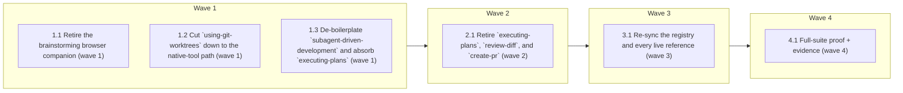

# Slim the skill surface (review items 1→6)

<!-- AT-A-GLANCE:BEGIN (generated — do not edit; refreshed by render_plan.py --summarize) -->
## At a glance

**6 tasks · 4 waves · 23 files · 0/6 done**

| Wave | Task | Title | Files | Done (acceptance) |
|---|---|---|---|---|
| 1 | 1.1 | Retire the brainstorming browser companion (wave 1) | skills/brainstorming/SKILL.md, skills/brainstorming/scripts, skills/brainstorming/visual-companion.md | `skills/brainstorming/` holds only `SKILL.md` + `spec-document-reviewer-prompt.m… |
| 1 | 1.2 | Cut `using-git-worktrees` down to the native-tool path (wave 1) | skills/using-git-worktrees/SKILL.md | File is ≤70 lines; Step 0, the native-first rule, branch naming, and the deploy-… |
| 1 | 1.3 | De-boilerplate `subagent-driven-development` and absorb `executing-plans` (wave 1) | skills/subagent-driven-development/SKILL.md | File is ~220 lines; contains a `## Parallel session` section; the receipt gate, … |
| 2 | 2.1 | Retire `executing-plans`, `review-diff`, and `create-pr` (wave 2) | skills/executing-plans, skills/review-diff, skills/create-pr, skills/finishing-a-development-branch/SKILL.md | The three skill directories are gone; `finishing-a-development-branch` generates… |
| 3 | 3.1 | Re-sync the registry and every live reference (wave 3) | harness-manifest.json, scripts/check_slim_surface.py, CLAUDE.md, README.md, HARNESS.md, skills/README.md, skills/writing-plans/SKILL.md, skills/correctness-review/SKILL.md, rules/plan-format.md, rules/wave-parallelism.md, templates/structure/specs-README.md, docs/harness-experimental/trust-metrics.md, docs/harness-v03-plan-overview.md | doc-truth lint green; `python3 scripts/check_manifest.py` exit 0; no linted doc … |
| 4 | 4.1 | Full-suite proof + evidence (wave 4) | specs/slim-skill-surface/SUMMARY.md | `run-tests.sh` reports ALL GREEN; the dry-run prune report names all three delet… |

### Progress
- [ ] 1.1 — Retire the brainstorming browser companion (wave 1)
- [ ] 1.2 — Cut `using-git-worktrees` down to the native-tool path (wave 1)
- [ ] 1.3 — De-boilerplate `subagent-driven-development` and absorb `executing-plans` (wave 1)
- [ ] 2.1 — Retire `executing-plans`, `review-diff`, and `create-pr` (wave 2)
- [ ] 3.1 — Re-sync the registry and every live reference (wave 3)
- [ ] 4.1 — Full-suite proof + evidence (wave 4)
<!-- AT-A-GLANCE:END -->

## 1. Motivation

Reading all 14 non-`visual-planner` skills in full showed 463 of 2.817 `SKILL.md` lines are
model-hand-holding boilerplate (`Advantages`, `Example Workflow`, `Red Flags`, DOT graphs), and
that the distribution is extreme: 54% of `subagent-driven-development`, 48% of `brainstorming`,
**0% across eight newer skills**. Separately, `skills/brainstorming/scripts/` carries 1.084 lines
— including a hand-written RFC 6455 WebSocket server — to show mockups in a browser, which
Artifacts now do natively with no server at all. `review-diff` has no consumer,
`create-pr` has exactly one, and `executing-plans` differs from `subagent-driven-development`
only in *where it is invoked*.

Full analysis, the two falsified hypotheses, and what is deliberately kept: `design.md`.

## 2. Non-goals

- `visual-planner` is untouched — the user explicitly asked to keep it.
- No change to any review oracle (`correctness-review`, `intent-review`,
  `context-propagation-audit`), to `feature-intake`, or to `evals/` — reading them showed each
  is backed by measured evidence.
- No CI gate changes. Originally scoped as a skills/docs diff only; the sandbox walk (Task 5.1)
  surfaced a blocking pre-existing install bug, and the user authorised fixing it on this branch,
  so `hooks/check-untracked-py.sh` and `scripts/install-harness.sh` are now in scope.
- `xia2`'s depth classifier is **not** merged with `feature-intake`'s lane here (item 7,
  follow-on spec — it requires re-running `skills/xia2/tests/structural/`).
- `compound` Step 5.75 is **not** converted to a script here (item 8).
- `specs/**` and `docs/research/**` are **not** scrubbed of references to deleted skills — they
  are the historical record, and `lint-doc-truth.sh` already excludes both.

## 3. Success Criteria

| ID | Behavior (observable) | Check (re-runnable) | Expected |
|------|-------------------------|-----------------------|------------|
| SC-1 | The brainstorming browser companion and its server are gone from the repo | `test ! -e skills/brainstorming/scripts` | exit 0 |
| SC-2 | No linted doc references a deleted skill or a deleted path | `bash scripts/lint-doc-truth.sh` | exit 0 |
| SC-3 | The skill registry matches what is on disk, both directions | `python3 scripts/check_manifest.py` | exit 0 |
| SC-4 | The three retired skills no longer exist | `python3 scripts/check_slim_surface.py` | exit 0 |
| SC-5 | Trimming `subagent-driven-development` did not drop the review-receipt ship gate | `grep -q check_review_receipt skills/subagent-driven-development/SKILL.md` | exit 0 |
| SC-6 | Trimming `using-git-worktrees` did not drop the harness-deploy step | `grep -q "deploy-harness.sh --target" skills/using-git-worktrees/SKILL.md` | exit 0 |
| SC-7 | The parallel-session execution path survives the merge | `grep -qi "parallel session" skills/subagent-driven-development/SKILL.md` | exit 0 |
| SC-8 | A root-level `.claude/` no longer denies every commit in a fresh consumer | `bash tests/hooks/check-untracked-py.test.sh` | exit 0 |
| SC-9 | A fresh install gitignores `.claude/` so the derived tree is never committed | `bash tests/scripts/install-gitignore.test.sh` | exit 0 |

## 4. Tasks

### Task 1.1 — Retire the brainstorming browser companion (wave 1)

- **Files:** skills/brainstorming/SKILL.md, skills/brainstorming/scripts, skills/brainstorming/visual-companion.md
- **Action:** `git rm -r skills/brainstorming/scripts skills/brainstorming/visual-companion.md`
  (1.084 lines: `server.js` hand-implements the RFC 6455 handshake + frame encoding,
  `frame-template.html`, `helper.js`, start/stop scripts, and the operating manual).
  In `SKILL.md`, delete the `## Visual Companion` section and checklist item 2, and replace them
  with one sentence: when a question is genuinely visual (mockups, layout comparisons,
  architecture diagrams), publish an Artifact instead of asking in text — no consent prompt, no
  local server. Keep the per-question judgment rule verbatim ("would the user understand this
  better by seeing it than reading it?"); it is the part that was actually load-bearing.
  Also drop the `## Process Flow` DOT graph and `## Key Principles` (item 5 — both restate the
  numbered checklist directly above them). **Do not touch the HARD-GATE block, the Checklist, the
  Spec Review Loop, the User Review Gate, or the xia2 → writing-plans handoff.**
- **Verify:** `test ! -e skills/brainstorming/scripts`
- **Done:** `skills/brainstorming/` holds only `SKILL.md` + `spec-document-reviewer-prompt.md`;
  SKILL.md is ~90 lines and still opens with its HARD-GATE.

### Task 1.2 — Cut `using-git-worktrees` down to the native-tool path (wave 1)

- **Files:** skills/using-git-worktrees/SKILL.md
- **Action:** Rewrite to ~60 lines. **Keep:** Step 0 isolation detection (`git-dir` vs
  `git-common-dir`) **including the submodule guard** — that guard prevents a real
  misclassification, not a stylistic mistake; the native-tool-first rule (`EnterWorktree` /
  `WorktreeCreate` / `/worktree`); the Branch Naming section (`<type>/<kebab-slug>`, and the fact
  that `finishing-a-development-branch` resolves the plan via `slug=${branch#*/}`); and the
  `bash scripts/deploy-harness.sh --target "$path"` step with its reason (a worktree has no
  `.claude/` without it, so the harness is broken there).
  **Delete:** Directory Selection Process, Safety Verification, the package-manager auto-detect
  block, Verify Clean Baseline, Report Location, Quick Reference, Common Mistakes, Example
  Workflow, Red Flags. Replace the whole manual path with a two-line fallback: when no native
  tool exists, `git worktree add <dir>/<branch> -b <branch>` into a gitignored directory.
- **Verify:** `grep -q "deploy-harness.sh --target" skills/using-git-worktrees/SKILL.md`
- **Done:** File is ≤70 lines; Step 0, the native-first rule, branch naming, and the
  deploy-harness step all survive; no `## Red Flags` or `## Common Mistakes` section remains.

### Task 1.3 — De-boilerplate `subagent-driven-development` and absorb `executing-plans` (wave 1)

- **Files:** skills/subagent-driven-development/SKILL.md
- **Action:** Delete `## Advantages`, `## Example Workflow` (90 lines of sample dialogue),
  `## Red Flags`, and both fenced DOT graphs (83 lines) — the prose immediately around each
  graph already states the same flow.
  **Before deleting `## Red Flags`, move its two constraints that appear nowhere else in the
  file** into the sections that own them: *"never hand off with a stale review receipt —
  re-run the review and re-write it, never hand-edit the sha"* → `## Review Receipt`; *"never
  ship with an SC lacking a passing `Criterion` row"* → the ship-gate conjunction. Apply the
  same rule to every other deleted line: a line stating a **constraint** moves, a line stating
  an **explanation** goes.
  Then absorb `executing-plans` (item 4) as a `## Parallel session` subsection: carry over its
  Step-0 four guardrail checks (all four fields populated · zero same-wave file overlap · Verify
  is a single exit-code-checkable command · plan scope meets the >3 steps / >2 files / >30 min
  threshold) as a shared pre-flight, and state that the separate-session variant runs the same
  chain with checkpoints between batches instead of per-task subagent dispatch.
  **Do not touch:** Step 0 branch isolation, `status: proposed → active`, the wave-parallelism
  policy, Model Selection, Handling Implementer Status, the correctness → intent chain, the
  Review Receipt section and its conjunction ship gate, or Deviation logging.
- **Verify:** `grep -q check_review_receipt skills/subagent-driven-development/SKILL.md`
- **Done:** File is ~220 lines; contains a `## Parallel session` section; the receipt gate, the
  SC-coverage conjunction, and the stale-receipt rule are all still present.

### Task 2.1 — Retire `executing-plans`, `review-diff`, and `create-pr` (wave 2)

- **Files:** skills/executing-plans, skills/review-diff, skills/create-pr, skills/finishing-a-development-branch/SKILL.md
- **Action:** `git rm -r skills/executing-plans skills/review-diff skills/create-pr`.
  Before removing `create-pr`, fold its template into
  `skills/finishing-a-development-branch/SKILL.md` Step 3 (~15 lines): the PR body shape
  (Title `type: description` ≤72 chars · Summary 2–4 reviewer-first sentences · Tasks · optional
  Diagram · Notes), the base-branch resolution, the write to `.pr-body.md`, and the one
  non-obvious rule — **include the Diagram section only when the change is flow-shaped
  (multi-step process, state machine, request/data flow), otherwise omit the section entirely**.
  Replace Step 3.3 ("Invoke the create-pr skill") with the inline template, and drop `create-pr`
  from that skill's `## Integration` list.
  `review-diff` is deleted outright — it has no consumer, gates nothing, and its 40 lines of
  hardcoded dark-theme Mermaid hex colors render wrong on a light background.
- **Verify:** `python3 scripts/check_slim_surface.py`
- **Done:** The three skill directories are gone; `finishing-a-development-branch` generates
  `.pr-body.md` inline with no cross-skill dispatch.

### Task 3.1 — Re-sync the registry and every live reference (wave 3)

- **Files:** harness-manifest.json, scripts/check_slim_surface.py, CLAUDE.md, README.md, HARNESS.md, skills/README.md, skills/writing-plans/SKILL.md, skills/correctness-review/SKILL.md, rules/plan-format.md, rules/wave-parallelism.md, templates/structure/specs-README.md, docs/harness-experimental/trust-metrics.md, docs/harness-v03-plan-overview.md
- **Action:** Remove `executing-plans`, `review-diff`, and `create-pr` from
  `harness-manifest.json` → `skills[]` (`check_manifest.py` compares it bidirectionally against
  `skills/*/SKILL.md` on disk, so this must land in the same commit as Task 2.1's deletions).
  Add `scripts/check_slim_surface.py` — stdlib-only, exits 0 iff the three skill dirs are absent
  **and** the three names no longer appear in the manifest `skills[]` (this is SC-4's
  re-runnable check; it pins the deletion against a partial revert).
  Then scrub the live references found by `grep`: `CLAUDE.md:30` (workflow chain), `skills/README.md`
  (three reference-table rows + the handoff map + the workflow diagrams), `rules/plan-format.md`
  and `rules/wave-parallelism.md` (the "loaded by executing-plans" sentences),
  `templates/structure/specs-README.md`, `skills/writing-plans/SKILL.md` Execution Handoff
  (the A/B question collapses to one path with a parallel-session note),
  `skills/correctness-review/SKILL.md:183` (the `/review-diff` bullet),
  `docs/harness-experimental/trust-metrics.md`, `docs/harness-v03-plan-overview.md`. Check
  `README.md` and `HARNESS.md` for skill lists and update if present.
  **Do NOT scrub `specs/**` or `docs/research/**`** — they are the historical record and
  `lint-doc-truth.sh` excludes both.
- **Verify:** `bash scripts/lint-doc-truth.sh`
- **Done:** doc-truth lint green; `python3 scripts/check_manifest.py` exit 0; no linted doc
  routes work to a skill that no longer exists.

### Task 4.1 — Full-suite proof + evidence (wave 4)

- **Files:** specs/slim-skill-surface/SUMMARY.md
- **Action:** Run `bash scripts/run-tests.sh` (L1 syntax + doc-truth + manifest + verify-row
  lint, L2 hook contract tests, L3 script integration tests, python unit tests) and confirm
  ALL GREEN. Then run `bash scripts/deploy-harness.sh --dry-run` and confirm its prune report
  lists the three deleted skills as would-be-pruned orphans — proving the deletion propagates
  to `.claude/` on the next real sync rather than leaving stale copies. Record every check
  actually run in the SUMMARY `### Verify` table with its `Criterion` column mapped to SC-1…SC-7,
  and fill `## What changed` with the measured before/after line counts.
- **Verify:** `python3 scripts/check_slim_surface.py`
- **Done:** `run-tests.sh` reports ALL GREEN; the dry-run prune report names all three deleted
  skills; the SUMMARY `### Verify` table covers every SC with a pipe-free re-runnable command.

### Task 5.1 — Fix the fresh-consumer install blocker found by the sandbox walk (wave 5)

- **Files:** hooks/check-untracked-py.sh, scripts/install-harness.sh, tests/hooks/check-untracked-py.test.sh, tests/scripts/install-gitignore.test.sh
- **Action:** Out-of-original-scope, authorised by the user after the sandbox walk proved a fresh
  consumer **cannot commit at all** after installing the harness. Two compounding causes, both
  pre-existing (identical at the branch point `f97764e` and in the repo's initial commit):
  (a) `check-untracked-py.sh` excluded the deployed harness with `grep -v '/\.claude/'`, which
  requires a leading slash and therefore misses the root-level `.claude/skills/...` paths
  `git ls-files` actually returns — so the four `visual-planner` `.py` files denied every
  `git commit` and `git push`. Anchor it: `grep -vE '(^|/)\.claude/'`.
  (b) `install-harness.sh` never added `.claude/` to the consumer's `.gitignore`, leaving the
  derived tree untracked in the first place. Append the pattern only when absent — never rewrite
  an existing `.gitignore`, and preserve a missing trailing newline.
  Add a regression test for the ROOT-level case (the existing suite only covered a *nested*
  `app/.claude/`, which is why the bug survived), plus an install-level test asserting the
  `.gitignore` line is added once, is not duplicated on re-install, and that an existing entry is
  respected.
- **Verify:** `bash tests/hooks/check-untracked-py.test.sh`
- **Done:** Both tests pass; reverting either fix makes its test fail (mutation-checked); a fresh
  `install-harness.sh` into an empty repo can commit immediately.

## 5. Risks

| Risk | Mitigation |
|---|---|
| A gate hides inside a boilerplate-looking section and gets deleted with it | The stated rule for every trim: a line that states a **constraint** moves, a line that states an **explanation** goes. Two known cases are named explicitly in Task 1.3 (stale receipt, SC coverage), and SC-5/SC-6/SC-7 grep for a load-bearing string in each trimmed file. |
| Deleting a skill breaks the registry and fails CI | `check_manifest.py` is bidirectional, so Task 2.1's deletions and Task 3.1's manifest edit must land in the same commit. Task 3.1 lists both, and SC-3 re-runs the checker. |
| Stale skill copies linger in `.claude/` after deletion | `deploy-harness.sh` prunes deleted-skill orphans via its per-deploy manifest (commit `0eb0a77`). Task 4.1 proves it with `--dry-run` before any real sync. |
| Someone re-proposes cutting the review oracles or `evals/` later | Both hypotheses and the evidence that falsified them are recorded in `design.md` §1 and the SUMMARY `### Alternatives considered`. |
| This PR trips `ci-strict-gate.sh` and the `workflow-engine` gate | Intended — it edits `skills/*/SKILL.md`. `SUMMARY.md` declares `Lane: high-risk`, which corroborates, and Task 4.1 supplies the machine-verified `### Verify` row the CI gate requires. |
| Task 5.1 widens the diff into `hooks/` mid-flight | Authorised explicitly by the user after the sandbox walk. Both fixes are two lines each, both are mutation-checked by a new test, and the bug they close is a total blocker for every fresh consumer — leaving it for a later spec means shipping a harness that cannot commit. |
| Losing the browser companion removes a capability someone relies on | It has no consumer outside its own directory and its `SKILL.md` describes it as "still new and can be token-intensive". Artifacts cover the use case; the git history keeps the code if it is ever wanted back. |

## 6. Status Log

- 2026-07-23 — Spec created (design + plan) after reading all 14 non-visual-planner skills in full.
- 2026-07-23 — Wave 1 complete on `refactor/slim-skill-surface` — `90e001d` (tasks 1.1, 1.2, 1.3).
- 2026-07-23 — Waves 2–3 complete — `2995759` (tasks 2.1, 3.1).
- 2026-07-23 — Wave 4 complete: `run-tests.sh` ALL GREEN, `deploy-harness --dry-run` reports all
  three retired skills as would-be-pruned, and all 8 SUMMARY `### Verify` rows re-run PASS via
  `verify_summary.py --check`. Status: `active` until the PR opens.
- 2026-07-23 — PR #158 opened against `loop`.
- 2026-07-23 — Sandbox walk (52 checks over a fresh install, an old-consumer re-sync, the hook
  chain, and a full workflow run) found a pre-existing blocker: a fresh consumer cannot commit.
  Task 5.1 added and fixed on this branch with the user's authorisation.
