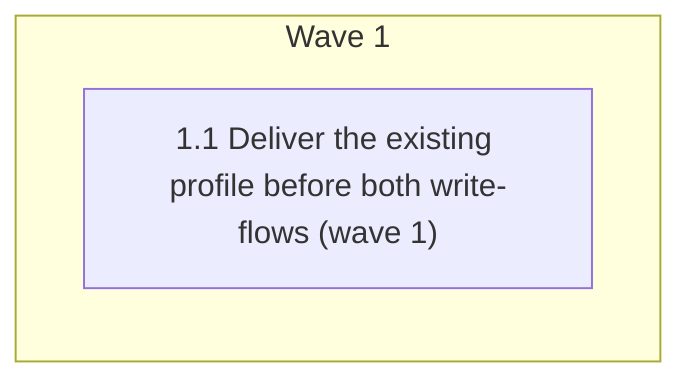

# Deliver the terminology profile to research and summary authors

<!-- AT-A-GLANCE:BEGIN (generated — do not edit; refreshed by render_plan.py --summarize) -->
## At a glance

**1 tasks · 1 waves · 6 files · 1/1 done**

| Wave | Task | Title | Files | Done (acceptance) |
|---|---|---|---|---|
| 1 | 1.1 | Deliver the existing profile before both write-flows (wave 1) | skills/xia2/SKILL.md, skills/feature-intake/SKILL.md, scripts/render_skill_prompt.py, scripts/test_render_skill_prompt.py, rules/terminology.md, specs/ste-terminology-evidence/SUMMARY.md | Both writers receive the canonical rule before creating their artifact; deleting… |

### Progress
- [x] 1.1 — Deliver the existing profile before both write-flows (wave 1)
<!-- AT-A-GLANCE:END -->

## 1. Motivation

`rules/terminology.md` loads when a matching artifact is read, not before a new artifact is
written. `writing-plans` already closes this gap for `PLAN.md`; `xia2` and `feature-intake` do not
close it for `research-brief.md` and `SUMMARY.md`. Add the same explicit delivery contract while
preserving the section-level exclusions approved in `design.md`.

## 2. Non-goals

- Full ASD-STE100 compliance or adoption of the STE dictionary.
- Applying machine-decidable acceptance language to research prose or user intent.
- New hooks, linters, model reviews, templates, or runtime loaders.
- Retroactive rewriting of existing specs.

## Global Constraints

- Reuse the existing explicit-Read and `CONTEXT_MATRIX` pattern; introduce no second delivery
  mechanism.
- `research-brief.md` keeps §3 excluded so uncertainty and negative findings remain accurate.
- `SUMMARY.md ### Intent` remains verbatim and excluded from every terminology rule.
- `SUMMARY.md ### Verify` receives §3 before authoring; rationale and alternatives remain advisory.
- Keep the implementation focused to the two authoring skills, the canonical matrix, its existing
  tests, and the terminology delivery documentation.
- Run `bash scripts/run-tests.sh` once before shipping; record the full-suite result in
  `SUMMARY.md`, not as a Success Criterion row. Do **not** rebuild `.claude/` autonomously —
  deploying to `.claude/` requires explicit user confirmation, and the deploy conflict guard can
  keep a stale protected file (verify content, not the success line). Ask the user to run the
  rebuild after the source changes land.

## 3. Success Criteria

| ID | Behavior (observable) | Check (re-runnable) | Expected |
| --- | --- | --- | --- |
| SC-1 | The research and summary authoring contexts each require an explicit Read of `rules/terminology.md` | `python3 scripts/render_skill_prompt.py --check-all` | exit 0 |
| SC-2 | Removing either new delivery edge — the rule-path token or the explicit `Read` verb — causes the context-matrix mutation test to fail | `python3 -m pytest scripts/test_render_skill_prompt.py -q` | exit 0 |
| SC-3 | Existing context-propagation contracts remain green after adding the two authoring contexts | `bash tests/scripts/context-propagation-regression.test.sh` | exit 0 |
| SC-4 | The updated terminology delivery prose references only repository paths that exist | `bash scripts/lint-doc-truth.sh` | exit 0 |

## 4. Tasks

### Task 1.1 — Deliver the existing profile before both write-flows (wave 1)

- **Files:** skills/xia2/SKILL.md, skills/feature-intake/SKILL.md, scripts/render_skill_prompt.py, scripts/test_render_skill_prompt.py, rules/terminology.md, specs/ste-terminology-evidence/SUMMARY.md
- **Action:** Test-first, add `main.research-author` and `main.summary-author` to the canonical
  context matrix and update its exact-inventory test. Require an explicit Read of
  `rules/terminology.md` for both contexts so the existing generic delivery-edge mutation test
  covers them without bespoke test code. Extend that same generic mutation test
  (`test_each_policy_delivery_edge_is_load_bearing`) to also mutate each context's
  `required_reads` edge — weaken the `Read` verb while keeping the rule path — so dropping the
  explicit Read (not just the path token) is detected for the two new contexts and
  `main.plan-author` alike; this stays inside the existing generic loop, not a bespoke test.
  In `xia2`, place the Read before research-brief
  authoring and state that §1 is advisory while §3 remains excluded for research uncertainty. In
  `feature-intake`, place the Read before `SUMMARY.md` authoring and state that §3 applies to
  `### Verify`, rationale/alternatives are advisory, and `### Intent` remains verbatim and
  excluded. Generalize `terminology.md`'s Delivery paragraph from the plan-only example to the
  three covered writers. Update the spec's context-propagation audit and Verify evidence with the
  two new delivery edges after the focused checks have actually run. Do not add a hook, linter,
  template rule, or new standalone test file.
- **Verify:** `bash -c 'python3 scripts/render_skill_prompt.py --check-all && python3 -m pytest scripts/test_render_skill_prompt.py -q && bash tests/scripts/context-propagation-regression.test.sh && bash scripts/lint-doc-truth.sh'`
- **Done:** Both writers receive the canonical rule before creating their artifact; deleting either
  explicit Read is detected; the documented exclusions and all existing delivery checks remain
  intact.
- **Criteria:** SC-1, SC-2, SC-3, SC-4
- **Interfaces:** Consumes: `rules/terminology.md`, the approved `design.md`, and the local `research-brief.md`. Produces: `skills/xia2/SKILL.md`, `skills/feature-intake/SKILL.md`, `scripts/render_skill_prompt.py`, `scripts/test_render_skill_prompt.py`, `rules/terminology.md`, `specs/ste-terminology-evidence/SUMMARY.md`.

## 5. Risks

- **Scope wording accidentally implies full compliance.** Keep the per-section applicability next
  to each explicit Read and retain the canonical scope table.
- **The new matrix contexts duplicate policy text.** Matrix entries reference only the canonical
  rule path; no rule body is copied.
- **The write-flow receives the rule too late.** Put each explicit Read before the step that writes
  its artifact and make that ordering visible in the skill source.

## 6. Status Log

- 2026-08-13 — User approved the narrow delivery design. Local research confirmed reuse of the
  existing plan-author explicit-Read and context-matrix pattern. Plan authored; no implementation
  performed.
- 2026-08-13 — Plan review applied three fixes: the generic mutation test must also mutate
  `required_reads` (SC-2 now covers the Read-verb edge, not only the path token); the `.claude/`
  rebuild is user-confirmed, never autonomous; execution note — in this checkout `python3`
  resolves to the repo `.venv`, which lacks pytest, so run the SC-2 / Verify pytest step with
  `$TMPDIR/harness-tests-venv/bin/python` or the system Python 3.10 (both pass; CI installs
  pytest for the strict gate). Baselines re-run: SC-1, SC-3, SC-4 all exit 0 pre-change.
- 2026-08-13 — task 1.1 complete; commit 69e0fed. Per-task review: spec pass, quality approved,
  4 Minor findings (recorded in SUMMARY roll-up; none blocking). Controller re-ran SC-1..SC-4
  post-change, all exit 0. `.claude/` rebuild deliberately deferred to user confirmation.
- 2026-08-13 — final review chain green. Context-propagation audit PASS (matrix in SUMMARY; one
  deferred-delivery row). Correctness review: 6 finder angles, 3 scored locations; one confirmed
  finding fixed in 9e04352 (registration pinning + non-vacuous mutation), re-review CLOSED; two
  wording advisories fixed in 159ed1e; 9 advisory findings recorded. Intent review: 3 findings,
  all durably recorded (1 deferred scope decision, 1 design-corroborated drift, 1 accepted
  excess). Receipt pinned at 159ed1e; `verify_summary --check` and `--lane` both exit 0.
