# Superpowers 6.0 Review-Pipeline Adoption

<!-- AT-A-GLANCE:BEGIN (generated — do not edit; refreshed by render_plan.py --summarize) -->
## At a glance

**10 tasks · 6 waves · 50 files · 0/10 done**

| Wave | Task | Title | Files | Done (acceptance) |
|---|---|---|---|---|
| 1 | 1.1 | Freeze the dual-review baseline and evaluation corpus (wave 1) | evals/skills/task-review/README.md, evals/skills/task-review/schema.json, evals/skills/task-review/fixtures/, evals/skills/task-review/results/baseline.json, scripts/run_task_review_eval.py, scripts/score_task_review_eval.py, scripts/test_run_task_review_eval.py, scripts/test_score_task_review_eval.py | The immutable baseline and its environment metadata exist, all fixture truths ar… |
| 2 | 2.1 | Add the new PLAN context contract (wave 2) | rules/plan-format.md, skills/writing-plans/SKILL.md, skills/writing-plans/plan-document-reviewer-prompt.md, scripts/check_plan_contract.py, scripts/test_check_plan_contract.py, skills/visual-planner/render_plan.py, skills/visual-planner/test_render_plan.py | New plans fail closed on missing context contracts, legacy plans still parse/ren… |
| 2 | 2.2 | Build deterministic SDD artifact handoffs (wave 2) | skills/subagent-driven-development/scripts/task_brief.py, skills/subagent-driven-development/scripts/review_package.py, tests/scripts/sdd-artifact-handoffs.test.sh | The controller can obtain all three handoff paths without reading artifact conte… |
| 3 | 3.1 | Replace dual prompts with one bounded task reviewer (wave 3) | skills/subagent-driven-development/task-reviewer-prompt.md, skills/subagent-driven-development/spec-reviewer-prompt.md, skills/subagent-driven-development/code-quality-reviewer-prompt.md, scripts/check_task_review_contract.py, scripts/test_check_task_review_contract.py | One self-contained local prompt covers both judgments, unknown evidence, severit… |
| 3 | 3.2 | Enforce a genuinely read-only task-review role (wave 3) | agents/task-reviewer.md, agents/README.md, tests/scripts/task-reviewer-readonly.test.sh | Per-task review independence is structural, while the existing final reviewer ro… |
| 4 | 4.1 | Rewire SDD around file handoffs and combined routing (wave 4) | skills/subagent-driven-development/SKILL.md, skills/subagent-driven-development/implementer-prompt.md, skills/subagent-driven-development/references/review-chain.md, tests/scripts/sdd-task-review-routing.test.sh | A clean task uses one reviewer; every blocking, unknown, Minor, fix, resume, and… |
| 4 | 4.2 | Reuse a branch review package without merging final oracles (wave 4) | skills/correctness-review/SKILL.md, skills/correctness-review/prompts/shared.md, skills/intent-review/SKILL.md, skills/intent-review/intent-reviewer-prompt.md, tests/scripts/final-review-package-contract.test.sh | Final reviewers share only mechanical diff evidence; no oracle, threshold, findi… |
| 5 | 5.1 | Synchronize workflow documentation and deterministic gates (wave 5) | HARNESS.md, skills/README.md, rules/orchestration.md, rules/auto-correct-scope.md, CLAUDE.md, harness-manifest.json, scripts/run-tests.sh, scripts/check_task_review_adoption.py, scripts/test_check_task_review_adoption.py | No stale pre-6.0 runtime claim remains, one authority exists for each new contra… |
| 5 | 5.2 | Run the controlled candidate A/B and adjudicate results (wave 5) | evals/skills/task-review/results/candidate.json, evals/skills/task-review/results/comparison.md, evals/skills/task-review/results/transcripts/ | SC-7 and SC-8 pass on a complete version-pinned collection, or the rollout stops… |
| 6 | 6.1 | Final verification, deployment, and human-review handoff (wave 6) | specs/superpowers-6-review-pipeline-adoption/SUMMARY.md, specs/superpowers-6-review-pipeline-adoption/PLAN.md, .review-receipt.json | Every SC has passing evidence, full tests and all three final oracles are green,… |

```mermaid
flowchart LR
  subgraph W0[Wave 1]
    T1_1["1.1 Freeze the dual-review baseline and evaluation corpus (wave 1)"]
  end
  subgraph W1[Wave 2]
    T2_1["2.1 Add the new PLAN context contract (wave 2)"]
    T2_2["2.2 Build deterministic SDD artifact handoffs (wave 2)"]
  end
  subgraph W2[Wave 3]
    T3_1["3.1 Replace dual prompts with one bounded task reviewer (wave 3)"]
    T3_2["3.2 Enforce a genuinely read-only task-review role (wave 3)"]
  end
  subgraph W3[Wave 4]
    T4_1["4.1 Rewire SDD around file handoffs and combined routing (wave 4)"]
    T4_2["4.2 Reuse a branch review package without merging final oracles (wave 4)"]
  end
  subgraph W4[Wave 5]
    T5_1["5.1 Synchronize workflow documentation and deterministic gates (wave 5)"]
    T5_2["5.2 Run the controlled candidate A/B and adjudicate results (wave 5)"]
  end
  subgraph W5[Wave 6]
    T6_1["6.1 Final verification, deployment, and human-review handoff (wave 6)"]
  end
  W0 --> W1
  W1 --> W2
  W2 --> W3
  W3 --> W4
  W4 --> W5
```

### Progress
- [ ] 1.1 — Freeze the dual-review baseline and evaluation corpus (wave 1)
- [ ] 2.1 — Add the new PLAN context contract (wave 2)
- [ ] 2.2 — Build deterministic SDD artifact handoffs (wave 2)
- [ ] 3.1 — Replace dual prompts with one bounded task reviewer (wave 3)
- [ ] 3.2 — Enforce a genuinely read-only task-review role (wave 3)
- [ ] 4.1 — Rewire SDD around file handoffs and combined routing (wave 4)
- [ ] 4.2 — Reuse a branch review package without merging final oracles (wave 4)
- [ ] 5.1 — Synchronize workflow documentation and deterministic gates (wave 5)
- [ ] 5.2 — Run the controlled candidate A/B and adjudicate results (wave 5)
- [ ] 6.1 — Final verification, deployment, and human-review handoff (wave 6)
<!-- AT-A-GLANCE:END -->

## 1. Motivation

Remove duplicate per-task review work while preserving or strengthening every local safety
boundary. Replace two reviewers reading the same evidence with one independent reviewer returning
two verdicts, move bulk handoffs to files, deny unknown evidence, and prove the result with a local
A/B evaluation.

## 2. Non-goals

- Do not merge context-propagation, correctness, and intent review.
- Do not weaken lane routing, hooks, SC coverage, receipts, or human escalation.
- Do not rewrite historical specs/eval results or add a cross-harness portability layer.
- Do not use upstream savings claims as acceptance evidence.

## Global Constraints

- Quality gates run before efficiency gates; any new safety miss rejects the candidate.
- Bulk task/diff/report artifacts are passed by path and never pasted into controller context.
- `cannot_verify` never becomes pass; resolve once with focused context, then escalate.
- Only Critical/Important findings block; Minor findings remain durable and reach final review.
- New PLAN contracts must preserve legacy markdown/XML execution.
- Every subagent dispatch names its model explicitly; reviewers use at least the standard tier.
- No runtime source is changed before the baseline dual-review evidence is captured.
- The external Superpowers reviewer template is not a runtime dependency of the new local gate.

## 3. Success Criteria

| ID | Behavior (observable) | Check (re-runnable) | Expected |
|---|---|---|---|
| SC-1 | One task reviewer returns separate spec and quality verdicts, with no live reference to the retired dual prompts | `python3 scripts/check_task_review_contract.py` | exit 0 |
| SC-2 | Task brief, report, and multi-commit review diff move through deterministic files without entering controller context | `bash tests/scripts/sdd-artifact-handoffs.test.sh` | exit 0 |
| SC-3 | Unknown is deny-on-unknown and only Critical/Important findings block; Minor findings are recorded | `bash tests/scripts/sdd-task-review-routing.test.sh` | exit 0 |
| SC-4 | New plans require Global Constraints, Criteria, and Interfaces while legacy plans remain valid | `python3 scripts/check_plan_contract.py --self-test` | exit 0 |
| SC-5 | The task-review agent cannot mutate through its declared tool surface | `bash tests/scripts/task-reviewer-readonly.test.sh` | exit 0 |
| SC-6 | Final correctness and intent reviews can consume one branch diff package without sharing oracle-only context | `bash tests/scripts/final-review-package-contract.test.sh` | exit 0 |
| SC-7 | Candidate task review has no new miss, unsafe pass, or false-positive class on the pinned corpus | `python3 scripts/score_task_review_eval.py --compare evals/skills/task-review/results/baseline.json evals/skills/task-review/results/candidate-v2.json --quality-gate` | exit 0 |
| SC-8 | Clean-task reviewer dispatches fall from two to one and candidate median reviewer tokens/runtime do not exceed baseline | `python3 scripts/score_task_review_eval.py --compare evals/skills/task-review/results/baseline.json evals/skills/task-review/results/candidate-v2.json --efficiency-gate` | exit 0 |
| SC-9 | Source contracts, derived harness, documentation, and review receipt agree at the reviewed HEAD | `python3 scripts/check_task_review_adoption.py` | exit 0 |

## 4. Tasks

### Task 1.1 — Freeze the dual-review baseline and evaluation corpus (wave 1)

- **Files:** evals/skills/task-review/README.md, evals/skills/task-review/schema.json, evals/skills/task-review/fixtures/, evals/skills/task-review/results/baseline.json, scripts/run_task_review_eval.py, scripts/score_task_review_eval.py, scripts/test_run_task_review_eval.py, scripts/test_score_task_review_eval.py
- **Criteria:** SC-7, SC-8
- **Interfaces:** Consumes the current spec and quality reviewer prompts plus raw fixture artifacts; produces a version-pinned baseline JSON and a scorer contract reused unchanged by the candidate.
- **Action:** Before editing any script, run and record `bash scripts/run-tests.sh`. Define fixtures for spec-only, quality-only, combined, Minor-only, cannot-verify, missing-global-constraint, and plan-mandated defects. Build a runner that captures model/client/commit, both reviewer calls, verdicts, token usage, tool calls, and elapsed time without exposing truth files. Add a scorer that evaluates quality before efficiency. Capture the first baseline run before Task 3 deletes either old prompt.
- **Verify:** `python3 -m pytest scripts/test_run_task_review_eval.py scripts/test_score_task_review_eval.py -q`
- **Done:** The immutable baseline and its environment metadata exist, all fixture truths are hidden from reviewers, and the scorer rejects incomplete or quality-regressing collections.

### Task 2.1 — Add the new PLAN context contract (wave 2)

- **Files:** rules/plan-format.md, skills/writing-plans/SKILL.md, skills/writing-plans/plan-document-reviewer-prompt.md, scripts/check_plan_contract.py, scripts/test_check_plan_contract.py, skills/visual-planner/render_plan.py, skills/visual-planner/test_render_plan.py
- **Criteria:** SC-4
- **Interfaces:** Consumes existing markdown/XML parsing and SC schema; produces Global Constraints, Criteria, and Interfaces for new markdown plans plus backward-compatible parsed task data.
- **Action:** Run the full suite before editing scripts. Define a cut-over rule for new plans. Require exact Global Constraints, task-to-SC Criteria mappings, and `Consumes`/`Produces` Interfaces. Add semantic preflight checks for contradictory constraints, missing interface producers, incompatible names/types, and plan-mandated reviewer defects. Keep legacy markdown/XML plans valid and render the new fields in PLAN HTML. Add positive, mutation, and legacy fixtures.
- **Verify:** `python3 -m pytest scripts/test_check_plan_contract.py skills/visual-planner/test_render_plan.py -q`
- **Done:** New plans fail closed on missing context contracts, legacy plans still parse/render, and semantic preflight reports all conflicts in one batch.

### Task 2.2 — Build deterministic SDD artifact handoffs (wave 2)

- **Files:** skills/subagent-driven-development/scripts/task_brief.py, skills/subagent-driven-development/scripts/review_package.py, tests/scripts/sdd-artifact-handoffs.test.sh
- **Criteria:** SC-2
- **Interfaces:** Consumes PLAN path/task id and explicit BASE/HEAD; produces unique task brief, report path, and review package paths under the Git-resolved SDD state directory.
- **Action:** Implement low-freedom CLIs. `task_brief.py` must extract the exact task, mapped SC rows, Global Constraints, and Interfaces. `review_package.py` must validate both SHAs and ancestry, then write commit list, diff stat, and `git diff -U10 BASE..HEAD`; never infer `HEAD~1`. Make filenames slug/task/SHA scoped, owner-only where supported, collision-safe, and valid in linked worktrees. Test multi-commit tasks, spaces, missing/invalid SHAs, legacy plan input, and parallel task isolation.
- **Verify:** `bash tests/scripts/sdd-artifact-handoffs.test.sh`
- **Done:** The controller can obtain all three handoff paths without reading artifact contents, and the package always covers the complete requested range.

### Task 3.1 — Replace dual prompts with one bounded task reviewer (wave 3)

- **Files:** skills/subagent-driven-development/task-reviewer-prompt.md, skills/subagent-driven-development/spec-reviewer-prompt.md, skills/subagent-driven-development/code-quality-reviewer-prompt.md, scripts/check_task_review_contract.py, scripts/test_check_task_review_contract.py
- **Criteria:** SC-1, SC-3
- **Interfaces:** Consumes brief/report/diff paths and exact Global Constraints; produces two verdicts plus bounded evidence-backed findings.
- **Action:** Add the consolidated prompt with `spec_verdict = pass|fail|cannot_verify`, `quality_verdict = approved|needs_fixes`, and bounded findings containing severity/category/file:line/rationale/action. Ban reviewer coaching, pre-rated severity, report trust, mutation, and broad codebase crawling. Allow one named focused search per concrete risk. Mark plan-mandated defects. Remove the optional external Superpowers reviewer branch and retire the two old prompts only after baseline evidence exists. Add a deterministic contract checker and mutation tests.
- **Verify:** `python3 -m pytest scripts/test_check_task_review_contract.py -q`
- **Done:** One self-contained local prompt covers both judgments, unknown evidence, severity calibration, and terse output; old prompt paths have no live consumer.

### Task 3.2 — Enforce a genuinely read-only task-review role (wave 3)

- **Files:** agents/task-reviewer.md, agents/README.md, tests/scripts/task-reviewer-readonly.test.sh
- **Criteria:** SC-5
- **Interfaces:** Consumes artifact paths and review prompt; produces findings only, with no mutation or nested-agent capability.
- **Action:** Add a dedicated task-review agent rather than weakening capabilities needed by correctness/intent reviewers. Whitelist only read/search operations and narrowly scoped read-only commands if the harness supports them. Route any focused test request to `test-runner`. Add a contract test that fails if Write/Edit/Agent or general mutation-capable Bash enters the declared tool surface.
- **Verify:** `bash tests/scripts/task-reviewer-readonly.test.sh`
- **Done:** Per-task review independence is structural, while the existing final reviewer role retains the capabilities required by its separate oracles.

### Task 4.1 — Rewire SDD around file handoffs and combined routing (wave 4)

- **Files:** skills/subagent-driven-development/SKILL.md, skills/subagent-driven-development/implementer-prompt.md, skills/subagent-driven-development/references/review-chain.md, tests/scripts/sdd-task-review-routing.test.sh
- **Criteria:** SC-1, SC-2, SC-3
- **Interfaces:** Consumes the new PLAN/task-artifact/reviewer contracts; produces task completion state, durable Minor findings, and final-review inputs.
- **Action:** Generate a brief before implementation, require the detailed implementer report in its report file, and accept only a short return summary. Generate the review package from the recorded pre-task BASE through current HEAD. Dispatch the task-reviewer with an explicit model. Route `cannot_verify` to one focused context/check retry and then escalation. Send all Critical/Important findings in one fix dispatch and re-review both verdicts. Append Minor findings to SUMMARY and the progress ledger, then pass the roll-up to final review. Bound narration to one short status line between tool calls. Never paste accumulated task history or diff contents.
- **Verify:** `bash tests/scripts/sdd-task-review-routing.test.sh`
- **Done:** A clean task uses one reviewer; every blocking, unknown, Minor, fix, resume, and multi-commit branch has an explicit durable route.

### Task 4.2 — Reuse a branch review package without merging final oracles (wave 4)

- **Files:** skills/correctness-review/SKILL.md, skills/correctness-review/prompts/shared.md, skills/intent-review/SKILL.md, skills/intent-review/intent-reviewer-prompt.md, tests/scripts/final-review-package-contract.test.sh
- **Criteria:** SC-6
- **Interfaces:** Consumes a shared branch diff package path; produces correctness and intent findings under their existing independent oracle contracts.
- **Action:** Let both final reviews read the pre-generated branch package and avoid rebuilding the same Git diff. Preserve their distinct context inputs and blindness rules. Permit focused inspection outside the package only for a named risk with a cited search surface. Keep fallback diff construction for standalone invocation when no package is supplied. Test that PLAN prose never leaks into intent review and intent never leaks into correctness FIND/scorer prompts.
- **Verify:** `bash tests/scripts/final-review-package-contract.test.sh`
- **Done:** Final reviewers share only mechanical diff evidence; no oracle, threshold, finding taxonomy, or completion gate is merged or weakened.

### Task 5.1 — Synchronize workflow documentation and deterministic gates (wave 5)

- **Files:** HARNESS.md, skills/README.md, rules/orchestration.md, rules/auto-correct-scope.md, CLAUDE.md, harness-manifest.json, scripts/run-tests.sh, scripts/check_task_review_adoption.py, scripts/test_check_task_review_adoption.py
- **Criteria:** SC-1, SC-3, SC-4, SC-9
- **Interfaces:** Consumes the implemented source contracts; produces one coherent documented workflow and an aggregate deterministic acceptance check.
- **Action:** Run the full suite before script edits. Replace “two-stage review” wording with “one reviewer, two verdicts,” document severity/unknown/file handoffs, and register the new plan/task-review contract paths in the manifest. Add all new deterministic tests to the CI-equivalent runner. Build an aggregate check that verifies prompt retirement, schema authority, docs truth, Minor/final handoff, derived-install parity, and receipt readiness without executing stochastic evals.
- **Verify:** `python3 -m pytest scripts/test_check_task_review_adoption.py -q`
- **Done:** No stale pre-6.0 runtime claim remains, one authority exists for each new contract, and the aggregate source check passes.

### Task 5.2 — Run the controlled candidate A/B and adjudicate results (wave 5)

- **Files:** evals/skills/task-review/results/candidate.json, evals/skills/task-review/results/comparison.md, evals/skills/task-review/results/transcripts/
- **Criteria:** SC-7, SC-8
- **Interfaces:** Consumes the frozen runner/scorer/fixtures and deployed candidate; produces immutable raw transcripts, candidate JSON, and a human-readable comparison.
- **Action:** Run candidate with the exact baseline model, client, reasoning, clean-worktree, and first-run settings. Score quality first. Reject the candidate on a new miss, unsafe pass, false-positive class, unresolved unknown, or skipped Minor roll-up. Only then evaluate reviewer dispatches, tokens, tool calls, latency, and variance. Do not tune and re-run a failed case; record the miss and change the prompt in a new candidate iteration.
- **Verify:** `python3 scripts/score_task_review_eval.py --compare evals/skills/task-review/results/baseline.json evals/skills/task-review/results/candidate.json --quality-gate --efficiency-gate`
- **Done:** SC-7 and SC-8 pass on a complete version-pinned collection, or the rollout stops with the failed hypothesis recorded.

### Task 6.1 — Final verification, deployment, and human-review handoff (wave 6)

- **Files:** specs/superpowers-6-review-pipeline-adoption/SUMMARY.md, specs/superpowers-6-review-pipeline-adoption/PLAN.md, .review-receipt.json
- **Criteria:** SC-1, SC-2, SC-3, SC-4, SC-5, SC-6, SC-7, SC-8, SC-9
- **Interfaces:** Consumes all task evidence and A/B results; produces a SC-complete SUMMARY, deployed harness, reviewed HEAD receipt, and PR-ready branch.
- **Action:** Run focused checks, full `bash scripts/run-tests.sh`, context-propagation audit, correctness review, and intent review. Fill SUMMARY only with commands actually run and map every SC. Resolve every finding, write the receipt at reviewed HEAD, deploy with `bash scripts/deploy-harness.sh`, rerun source/deployed parity checks, and open a PR for human review. Never merge it.
- **Verify:** `python3 scripts/verify_summary.py --check superpowers-6-review-pipeline-adoption`
- **Done:** Every SC has passing evidence, full tests and all three final oracles are green, source equals deployed state, receipt matches HEAD, and the PR awaits human review.

## 5. Risks

| Risk | Mitigation |
|---|---|
| Consolidation hides one judgment | Preserve two required verdicts and reject missing fields mechanically |
| Packet omits global truth | Put exact constraints/interfaces in brief; allow named focused checks; deny unknown |
| Minor findings silently disappear | Store them in SUMMARY/ledger and pass the list to final review |
| New plan schema breaks history | Cut-over only for new plans; legacy markdown/XML fixtures |
| Read-only hardening removes needed tests | Route focused execution to test-runner; keep final reviewer role separate |
| Efficiency target encourages unsafe trimming | Quality gate is absolute and evaluated first |
| A/B is noisy or contaminated | Pin environment, hide truth, preserve first run, record raw transcripts |
| Diff range drops multi-commit work | Require explicit recorded BASE/HEAD and test ancestry/range |
| Prompt policy fails to reach isolated context | Explicit file reads, composed prompt contract, context-propagation audit |
| Scope expands into portability/final-oracle rewrite | Enforce Global Constraints and Non-goals in preflight and review |

## 6. Status Log

- 2026-07-29 — Research reviewed, benchmark claim corrected, design and implementation plan
  created. Status changed to `active`; runtime implementation is in progress.
- 2026-07-29 — All success criteria verified, derived harness deployed, and receipt recorded.
  Status changed to `shipped`; branch was pushed and awaits human PR review. Draft-PR creation
  was attempted but blocked by the configured GitHub credential lacking collaborator permission.
- 2026-07-29 — External context, correctness, and intent reviews re-ran through `2697714`.
  A child-prompt package-delivery gap and parser edge cases were fixed; full suite and adoption
  checks passed before the receipt refresh. PR creation remains blocked by collaborator permission.
- 2026-07-29 — Final branch head `26d5af5` pushed. A second draft-PR attempt against `simplify`
  failed with `GraphQL: must be a collaborator (createPullRequest)`; no merge was attempted.
- 2026-07-30 — Draft PR #183 opened against `simplify` (https://github.com/minhtran3124/agent-harness/pull/183).
  The earlier rejections were an active-`gh`-account drift; switching to `minhtran3124` in the same
  call as the `gh pr create` resolved it. No merge was attempted.
