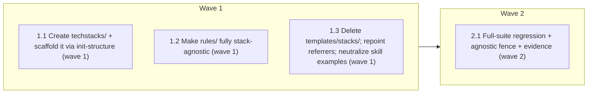

# Decouple tech-stack from core — project-owned `techstacks/`

<!-- AT-A-GLANCE:BEGIN (generated — do not edit; refreshed by render_plan.py --summarize) -->
## At a glance

**4 tasks · 2 waves · 21 files · 0/4 done**

| Wave | Task | Title | Files | Done (acceptance) |
|---|---|---|---|---|
| 1 | 1.1 | Create techstacks/ + scaffold it via init-structure (wave 1) | techstacks/README.md, templates/structure/techstacks-README.md, scripts/init-structure.sh, tests/scripts/init-structure.test.sh | techstacks/README.md exists, init-structure scaffolds it create-if-missing, test… |
| 1 | 1.2 | Make rules/ fully stack-agnostic (wave 1) | rules/architecture.md, rules/guidelines.md, rules/plan-format.md, rules/wave-parallelism.md, rules/auto-correct-scope.md | rules/ carry zero stack tokens; architecture + guidelines are thin techstacks/ p… |
| 1 | 1.3 | Delete templates/stacks/; repoint referrers; neutralize skill examples (wave 1) | templates/stacks/_skeleton/architecture.md, templates/stacks/_skeleton/guidelines.md, templates/stacks/fastapi/architecture.md, templates/stacks/fastapi/guidelines.md, agents/PROJECT.template.md, agents/PROJECT.md, CLAUDE.md, README.md, skills/README.md, skills/executing-plans/SKILL.md, skills/correctness-review/correctness-reviewer-prompt.md | templates/stacks gone; no live templates/stacks reference; lint + manifest green… |
| 2 | 2.1 | Full-suite regression + agnostic fence + evidence (wave 2) | specs/techstacks-decoupling/SUMMARY.md | ALL GREEN; core proven stack-agnostic; evidence machine-verified. |

### Progress
- [ ] 1.1 — Create techstacks/ + scaffold it via init-structure (wave 1)
- [ ] 1.2 — Make rules/ fully stack-agnostic (wave 1)
- [ ] 1.3 — Delete templates/stacks/; repoint referrers; neutralize skill examples (wave 1)
- [ ] 2.1 — Full-suite regression + agnostic fence + evidence (wave 2)
<!-- AT-A-GLANCE:END -->

## 1. Motivation

Owner-approved (2026-07-17, all 4 design decisions): core rules/skills/templates ship zero stack-specific content and only *mention* a new project-owned `techstacks/` root folder; each project fills it independently. Research: `research-brief.md`; decisions: `design.md`.

## 2. Non-goals

No stack auto-detection change (xia2 already config-free). No renaming `templates/`. No migration of real stack content (this meta-repo has none). No shipping an example stack (techstacks/ ships only a README).

## 3. Success Criteria

- `techstacks/` exists as a project-owned root folder with only `README.md` (the convention); scaffolded create-if-missing by init-structure.sh.
- Core `rules/` carry **no** FastAPI/stack-specific tokens; `rules/architecture.md` + `guidelines.md` are thin pointers to `techstacks/`.
- `templates/stacks/` deleted; all referrers point at `techstacks/`.
- Full suite + doc-truth lint + check_manifest green; `verify_summary --check techstacks-decoupling` exit 0.

## 4. Tasks

### Task 1.1 — Create techstacks/ + scaffold it via init-structure (wave 1)

- **Files:** techstacks/README.md, templates/structure/techstacks-README.md, scripts/init-structure.sh, tests/scripts/init-structure.test.sh
- **Action:** Write `templates/structure/techstacks-README.md` — the convention doc (project-owned; put your stack's architecture/guidelines/conventions here as `techstacks/*.md`; the harness reads this folder but ships nothing stack-specific; absorb the useful "prompts to answer" from the old _skeleton). Copy it to `techstacks/README.md` (this repo's instance). Add a `(techstacks-README.md → techstacks/README.md)` row to init-structure.sh's create-if-missing table. Extend tests/scripts/init-structure.test.sh: a bare repo scaffolds `techstacks/README.md`.
- **Verify:** `bash -c 'test -f techstacks/README.md && grep -q techstacks scripts/init-structure.sh && bash tests/scripts/init-structure.test.sh'`
- **Done:** techstacks/README.md exists, init-structure scaffolds it create-if-missing, test passes.

### Task 1.2 — Make rules/ fully stack-agnostic (wave 1)

- **Files:** rules/architecture.md, rules/guidelines.md, rules/plan-format.md, rules/wave-parallelism.md, rules/auto-correct-scope.md
- **Action:** Collapse `rules/architecture.md` and `rules/guidelines.md` each to a ~5-line thin pointer: "this project's stack architecture / engineering guidelines live in `techstacks/` — read that folder; the harness ships none." Strip all placeholder + FastAPI content. In `plan-format.md`, `wave-parallelism.md`, `auto-correct-scope.md`, replace FastAPI examples with stack-neutral illustrations (`src/<module>`, `tests/test_<module>`, "your test runner", "your migration command") — keep the examples' teaching value, remove stack specificity. No token `fastapi/FastAPI/alembic/pydantic/@app./@router.` may remain in rules/ (behavior/orchestration excluded — verify they had none).
- **Verify:** `bash -c '! grep -rniE "fastapi|alembic|pydantic|@app\.|@router\.|asyncpg" rules/ && grep -q techstacks rules/architecture.md && grep -q techstacks rules/guidelines.md'`
- **Done:** rules/ carry zero stack tokens; architecture + guidelines are thin techstacks/ pointers.

### Task 1.3 — Delete templates/stacks/; repoint referrers; neutralize skill examples (wave 1)

- **Files:** templates/stacks/_skeleton/architecture.md, templates/stacks/_skeleton/guidelines.md, templates/stacks/fastapi/architecture.md, templates/stacks/fastapi/guidelines.md, agents/PROJECT.template.md, agents/PROJECT.md, CLAUDE.md, README.md, skills/README.md, skills/executing-plans/SKILL.md, skills/correctness-review/correctness-reviewer-prompt.md
- **Action:** `git rm -r templates/stacks/`. Repoint every `templates/stacks/` reference to `techstacks/`: agents/PROJECT.template.md + agents/PROJECT.md (stack pointer), CLAUDE.md (Stack line / gotcha), README.md, skills/README.md. Neutralize gratuitous FastAPI examples in skills/executing-plans/SKILL.md and skills/correctness-review/correctness-reviewer-prompt.md to stack-neutral forms. Do not touch xia2's common-signals (already generic).
- **Verify:** `bash -c '! test -d templates/stacks && ! grep -rq "templates/stacks" rules/ skills/ agents/ CLAUDE.md README.md && bash scripts/lint-doc-truth.sh && python3 scripts/check_manifest.py'`
- **Done:** templates/stacks gone; no live templates/stacks reference; lint + manifest green.

### Task 2.1 — Full-suite regression + agnostic fence + evidence (wave 2)

- **Files:** specs/techstacks-decoupling/SUMMARY.md
- **Action:** Run the full CI-equivalent suite (incl. init-structure + resync + install suites). Confirm the rules/-agnostic grep-guard passes. Fill the SUMMARY Verify table with pipe-free re-runnable commands; confirm `verify_summary --check techstacks-decoupling` exit 0.
- **Verify:** `bash -c 'bash scripts/run-tests.sh && python3 scripts/verify_summary.py --check techstacks-decoupling'`
- **Done:** ALL GREEN; core proven stack-agnostic; evidence machine-verified.

## 5. Risks

- Redefine-system + auto-loaded rules shrink — owner-approved; reversible via `git revert` (prose + folder move; no data/schema migration). Net context drops (placeholders → pointers).
- templates/ in diff → ci-strict-gate fires → high-risk lane declared; machine-verified Verify table furnished.
- A consuming project that copied a bundled profile into its own rules/architecture.md keeps working (hand-maintained/protected); only the bundled *source* goes away — noted in techstacks/README.

## 6. Status Log

- 2026-07-17 — research + design approved (all 4 decisions); plan written; status active. Targets v3.
- 2026-07-17 — executed 1.1–1.3 + 2.1 on `feat/techstacks-decoupling`: techstacks/ created + scaffolded; rules agnostic (architecture+guidelines → thin pointers, 3 rules' FastAPI examples neutralized); templates/stacks/ deleted; referrers repointed. Rule-1: also fixed stale FastAPI claim in agents/PROJECT.md. Core carries zero FastAPI tokens; full suite ALL GREEN; verify_summary --check exit 0.
