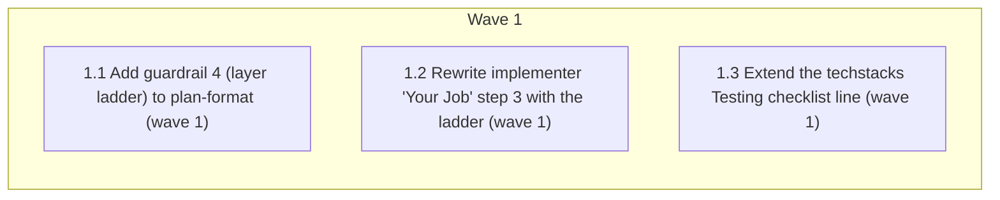

# Test-layer ladder in Verify guardrails + stack testing-strategy hint

<!-- AT-A-GLANCE:BEGIN (generated — do not edit; refreshed by render_plan.py --summarize) -->
## At a glance

**3 tasks · 1 waves · 3 files · 0/3 done**

| Wave | Task | Title | Files | Done (acceptance) |
|---|---|---|---|---|
| 1 | 1.1 | Add guardrail 4 (layer ladder) to plan-format (wave 1) | rules/plan-format.md | Guardrail 4 present with the pinned wording; `grep -c "never a whole-suite row"`… |
| 1 | 1.2 | Rewrite implementer "Your Job" step 3 with the ladder (wave 1) | skills/subagent-driven-development/implementer-prompt.md | New step 3 present; the phrase `Verify implementation works` absent from the fil… |
| 1 | 1.3 | Extend the techstacks Testing checklist line (wave 1) | techstacks/README.md | Extended Testing line present as one checklist entry; rest of the file unchanged… |

### Progress
- [ ] 1.1 — Add guardrail 4 (layer ladder) to plan-format (wave 1)
- [ ] 1.2 — Rewrite implementer "Your Job" step 3 with the ladder (wave 1)
- [ ] 1.3 — Extend the techstacks Testing checklist line (wave 1)
<!-- AT-A-GLANCE:END -->

## 1. Motivation

Distill the two missing pieces of the user-supplied testing philosophy (see
`SUMMARY.md ### Intent`) into the harness: an explicit verification layer ladder
(lint/type-check → smallest test → integration when the behavior spans modules → suite at branch
finish) in the plan-format Verify guardrails and the implementer prompt, and a stack-specific
testing-strategy line in `techstacks/README.md`. The other ~70% of the philosophy is already
mechanized (Verify <60s guardrail, suite at `finishing-a-development-branch`,
weakening-validation gate, repeated-failure escalation) and is not restated.

## 2. Non-goals

- Pasting the full external prompt into `rules/behavior.md`.
- Mechanizing ladder ordering into `verify_summary.py` or any gate.
- Editing `.claude/` (deploy is user-run).
- Adopting the STE Dictionary or claiming full ASD-STE100 compliance.

## Global Constraints

- Insert the prose blocks **verbatim** from `specs/test-layer-ladder/design.md`
  §"Exact edits" — no paraphrase.
- Touch only the four files named in the tasks; no edits outside them.
- Keep the existing SC "Check" definition line ("never a whole-suite row") in
  `rules/plan-format.md` — guardrail 4's final sentence deliberately repeats it; do not
  deduplicate.
- Terminology conformance (profile at `git show 8428bae:rules/terminology.md`): no §3-banned
  vague terms (`works`, `correctly`, `properly`, `as expected`) in inserted text; `test` for
  proof-producing rungs, `check` only inside the compound `type-check`.
- Match surrounding style: numbered-list guardrail prose; 4-space indentation inside the
  implementer prompt block; bold-label checklist line in `techstacks/README.md`.

## 3. Success Criteria

| ID | Behavior (observable) | Check (re-runnable) | Expected |
|------|-------------------------|-----------------------|------------|
| SC-1 | `rules/plan-format.md` Guardrails carries the new layer-ladder item | `grep -q "Layer ladder" rules/plan-format.md` | exit 0 |
| SC-2 | The pre-existing SC "Check" definition line survives un-deduplicated | `grep -q "never a whole-suite row" rules/plan-format.md` | exit 0 |
| SC-3 | Implementer step 3 states the ladder ordering | `grep -q "run your linter and type-checker first" skills/subagent-driven-development/implementer-prompt.md` | exit 0 |
| SC-4 | The §3-banned phrase is gone from the implementer prompt | `grep -q "Verify implementation works" skills/subagent-driven-development/implementer-prompt.md` | exit 1 — banned vague wording removed |
| SC-5 | `techstacks/README.md` Testing line asks the execution-strategy questions | `grep -q "sequential by default or parallel-safe" techstacks/README.md` | exit 0 |
| SC-6 | The context-matrix delivery edges survive the implementer-prompt edit | `python3 scripts/render_skill_prompt.py --check-all` | exit 0 |
| SC-7 | Template source and scaffolded instance stay in parity | `diff -q templates/structure/techstacks-README.md techstacks/README.md` | exit 0 |

## 4. Tasks

### Task 1.1 — Add guardrail 4 (layer ladder) to plan-format (wave 1)

- **Files:** rules/plan-format.md
- **Action:** In `## Guardrails`, append item 4 verbatim from `design.md` §Exact edits (1):
  "**Layer ladder** — run lint and type-check first, then the smallest test that touches the
  change. Add an integration test only when the behavior spans modules. Never put the full
  suite in a task `Verify` or an SC row — the suite runs at `finishing-a-development-branch`
  (the release gate)." Do not change items 1–3 or any other section; keep the existing
  "never a whole-suite row" line in the SC schema untouched.
- **Verify:** `grep -q "Layer ladder" rules/plan-format.md`
- **Done:** Guardrail 4 present with the pinned wording; `grep -c "never a whole-suite row"` still
  reports the pre-existing SC-schema occurrence plus no removals; no other line changed.
- **Criteria:** SC-1, SC-2
- **Interfaces:** Consumes the pinned wording in `design.md` §Exact edits (1). Produces `rules/plan-format.md` (updated guardrail list read by plan authors).

### Task 1.2 — Rewrite implementer "Your Job" step 3 with the ladder (wave 1)

- **Files:** skills/subagent-driven-development/implementer-prompt.md
- **Action:** Replace the single line `3. Verify implementation works` (line 38; the phrase
  occurs exactly once outside `specs/` — spec files quote it, do not edit them) with the two-sentence step from `design.md` §Exact edits (2):
  "3. Verify the implementation: run lint and type-check first, then the task's `<verify>`
  command. Do not substitute the full suite — the suite runs at branch finish." Preserve the
  4-space indentation of the surrounding prompt block and renumber nothing (the step count is
  unchanged). Do not touch the `rules/auto-correct-scope.md` reference elsewhere in the file.
- **Verify:** `grep -q "run lint and type-check first" skills/subagent-driven-development/implementer-prompt.md`
- **Done:** New step 3 present; the phrase `Verify implementation works` absent from the file;
  `python3 scripts/render_skill_prompt.py --check-all` exits 0.
- **Criteria:** SC-3, SC-4, SC-6
- **Interfaces:** Consumes the pinned wording in `design.md` §Exact edits (2). Produces `skills/subagent-driven-development/implementer-prompt.md` (updated step 3, dispatched to every implementer subagent).

### Task 1.3 — Extend the techstacks Testing checklist line (wave 1)

- **Files:** techstacks/README.md
- **Action:** Replace the starter-checklist line `**Testing** — runner, structure, coverage
  target.` with the extended line from `design.md` §Exact edits (3): "**Testing** — runner,
  structure, coverage target. Execution strategy: sequential by default or parallel-safe?
  Which changes need an E2E, race, load, or stress run (intentional, never default)?" Keep it
  a single checklist entry; no other line changes.
- **Verify:** `grep -q "sequential by default or parallel-safe" techstacks/README.md`
- **Done:** Extended Testing line present as one checklist entry; rest of the file unchanged.
- **Criteria:** SC-5
- **Interfaces:** Consumes the pinned wording in `design.md` §Exact edits (3). Produces `techstacks/README.md` (updated starter checklist read by consumer projects).

### Task 1.4 — Mirror the Testing line into the techstacks template source (wave 2)

- **Files:** templates/structure/techstacks-README.md
- **Action:** Apply the identical pinned wording from `design.md` §Exact edits (4) to the
  `**Testing**` line in `templates/structure/techstacks-README.md`, restoring byte parity with
  `techstacks/README.md` as edited by Task 1.3 (same line-wrap points, so `diff` reports no
  difference). Added after task review 1.3: this template is the source
  `scripts/init-structure.sh` scaffolds into consumer projects; no standing test enforces
  parity, so the divergence is silent without this task.
- **Verify:** `diff -q templates/structure/techstacks-README.md techstacks/README.md`
- **Done:** `diff -q` exits 0; only the Testing line changed in the template.
- **Criteria:** SC-7
- **Interfaces:** Consumes the pinned wording in `design.md` §Exact edits (4) and the Task 1.3 line-wrap layout. Produces `templates/structure/techstacks-README.md` (template source scaffolded to consumers by `scripts/init-structure.sh`).

## 5. Risks

- **Deploy drift:** `rules/plan-format.md` is currently identical to the deployed
  `.claude/rules/plan-format.md`; after merge they drift until the user runs deploy. Agent never
  edits `.claude/`.
- **Dedup temptation:** guardrail 4 repeats the SC "Check" definition on purpose; SC-2 catches an
  over-eager cleanup.
- **Gate noise:** the `workflow-engine` warn-mode signal fires at commit for `rules/` +
  `skills/` paths — expected note, not a block.
- **Suite evidence:** the full suite (`bash scripts/run-tests.sh`) is never an SC row (Guardrail
  3 / KB `verify-row-must-be-pipe-free-and-under-60s`); it runs at
  `finishing-a-development-branch` and its result is cited in the SUMMARY prose.

## 6. Status Log

- 2026-08-17 — plan authored (design approved with STE-wording amendment; spec review passed).
- 2026-08-17 — tasks 1.1, 1.2, 1.3 complete; commits b90da10, edf202d, ee9cdd8. Reviews: 1.1
  pass/approved (1 Minor), 1.2 pass/approved (1 Minor), 1.3 spec pass / quality needs_fixes
  (Important: template-source parity gap → Task 1.4 + SC-7 added; ci-strict-gate block tier now
  applies via `templates/`).
- 2026-08-17 — task 1.4 complete; commit 0d07c9a. Review 1.4 pass/approved (2 Minor:
  optional parity re-run — controller re-ran `diff -q`, exit 0; ragged wrap inherited from 1.3
  layout by SC-7 design). Resolves the 1.3 Important finding. All 7 SC checks re-run at expected
  exits by the controller. Wave execution complete → verifying.
- 2026-08-17 — correctness round 1: six FIND angles → 28 candidates → 5 deduped locations →
  3 scored (75 / 25 / 50) + 2 unmodified-line auto-0. One fix applied at the ≥75 location
  (`rules/plan-format.md:119`) with its lockstep mirror in implementer step 3; SC-3 check
  re-pinned to the revised phrase. Sub-75 findings recorded as advisories in SUMMARY.
