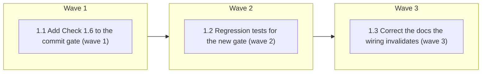

# Wire check_lane_evidence.py into the commit gate

<!-- AT-A-GLANCE:BEGIN (generated — do not edit; refreshed by render_plan.py --summarize) -->
## At a glance

**3 tasks · 3 waves · 5 files · 1/3 done**

| Wave | Task | Title | Files | Done (acceptance) |
|---|---|---|---|---|
| 1 | 1.1 | Add Check 1.6 to the commit gate (wave 1) | hooks/commit-quality-gate.sh | Hook blocks a missing-evidence SUMMARY, passes a complete one, fail-open on no p… |
| 2 | 1.2 | Regression tests for the new gate (wave 2) | tests/hooks/commit-quality-gate.test.sh | New cases pass; the whole suite stays green. |
| 3 | 1.3 | Correct the docs the wiring invalidates (wave 3) | skills/README.md, rules/auto-correct-scope.md, CLAUDE.md | No doc claims enforcement that does not exist, and none understates it either. |

### Progress
- [ ] 1.1 — Add Check 1.6 to the commit gate (wave 1)
- [x] 1.2 — Regression tests for the new gate (wave 2)
- [ ] 1.3 — Correct the docs the wiring invalidates (wave 3)
<!-- AT-A-GLANCE:END -->

## 1. Motivation

`rules/auto-correct-scope.md` presents `scripts/check_lane_evidence.py` as the mechanized
single source of truth for the lane → evidence mapping. It is not mechanized: no hook,
`settings.json` entry, or CI workflow invokes it against a real `SUMMARY.md`. `run-tests.sh`
registers only its unit tests, so the script is proven correct and then never run.

Surfaced by the Codex review on PR #119 (see `specs/skills-readme-truth-sync/SUMMARY.md`).

## 2. Non-goals

- Changing the lane → evidence mapping itself (`check_lane_evidence.py` logic is untouched).
- Touching Check 2.5 / `REQUIRE_VERIFY` — a separate, weaker mechanism that stays as-is.
- Making the gate opt-in. Opt-in is what produced the current dead script.

## 3. Success Criteria

- A commit staging `specs/<slug>/SUMMARY.md` with lane-required evidence missing is **blocked**.
- Recording the evidence in the same commit **unblocks** it (staged copy is authoritative,
  mirroring Check 1.5's self-unblock semantics).
- No retroactive breakage: all 52 existing specs pass today (measured before implementing).
- Missing `python3` degrades to a warning, never a block (fail-open, matching Check 2.5's
  re-run convention).

## 4. Tasks

### Task 1.1 — Add Check 1.6 to the commit gate (wave 1)

- **Files:** hooks/commit-quality-gate.sh
- **Action:** After Check 1.5 (Escalations), add Check 1.6 (Lane evidence). Reuse 1.5's staged
  slug detection (`git diff --cached --name-only` → `^specs/[^/]+/`). For each slug with a
  staged or on-disk `SUMMARY.md`, write the **staged** content to a temp file and pass that
  path to `check_lane_evidence.py` (it accepts a direct path via `_resolve_path`), so a commit
  that adds the evidence self-unblocks. Skip with a warning when `python3` or the script is
  unavailable. Block with exit 2 and surface the script's own error lines.
- **Verify:** `bash tests/hooks/commit-quality-gate.test.sh`
- **Done:** Hook blocks a missing-evidence SUMMARY, passes a complete one, fail-open on no python3.

### Task 1.2 — Regression tests for the new gate (wave 2)

- **Files:** tests/hooks/commit-quality-gate.test.sh
- **Action:** Add cases: (a) staged SUMMARY missing the lane-required `### Verify` row → blocked
  (exit 2); (b) complete SUMMARY → allowed; (c) commit touching no `specs/` path → unaffected;
  (d) staged copy overrides a failing on-disk copy (self-unblock).
- **Verify:** `bash scripts/run-tests.sh`
- **Done:** New cases pass; the whole suite stays green.

### Task 1.3 — Correct the docs the wiring invalidates (wave 3)

- **Files:** skills/README.md, rules/auto-correct-scope.md, CLAUDE.md
- **Action:** `skills/README.md` currently labels the script advisory (written one commit ago on
  the stacked branch) — flip it to describe Check 1.6. Update the `CLAUDE.md` hook table row for
  `commit-quality-gate.sh`. Confirm `auto-correct-scope.md`'s "mechanizes" claim is now true.
- **Verify:** `bash scripts/lint-doc-truth.sh`
- **Done:** No doc claims enforcement that does not exist, and none understates it either.

## 5. Risks

- **Blocking real commits.** Mitigated: measured 52/52 existing specs pass before writing code.
- **High-blast file.** `hooks/commit-quality-gate.sh` auto-runs on every commit; a bug here
  blocks all work. Mitigated by fail-open on missing interpreter + the hook test suite.
- **Stacked on unmerged #119.** If #119 changes in review, Task 1.3's context shifts.

## 6. Status Log

- 2026-07-20 — plan written; blast radius measured (52/52 specs pass).
- 2026-07-20 — Task 1.1 done: Check 1.6 added to `hooks/commit-quality-gate.sh`.
- 2026-07-20 — Task 1.2 done: 8 regression cases added; suite 20 → 28 passed. Mutation-tested
  (neutering `exit 2` kills 2 cases), so the new tests are load-bearing.
- 2026-07-20 — Task 1.3 done: `skills/README.md`, `CLAUDE.md`, `rules/auto-correct-scope.md`
  updated. `lint-doc-truth.sh` exit 0.
- 2026-07-20 — status → shipped pending review.
